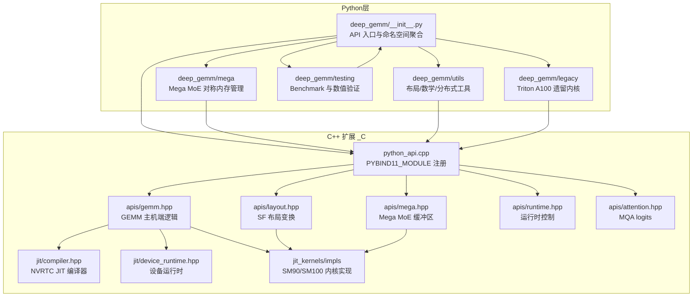
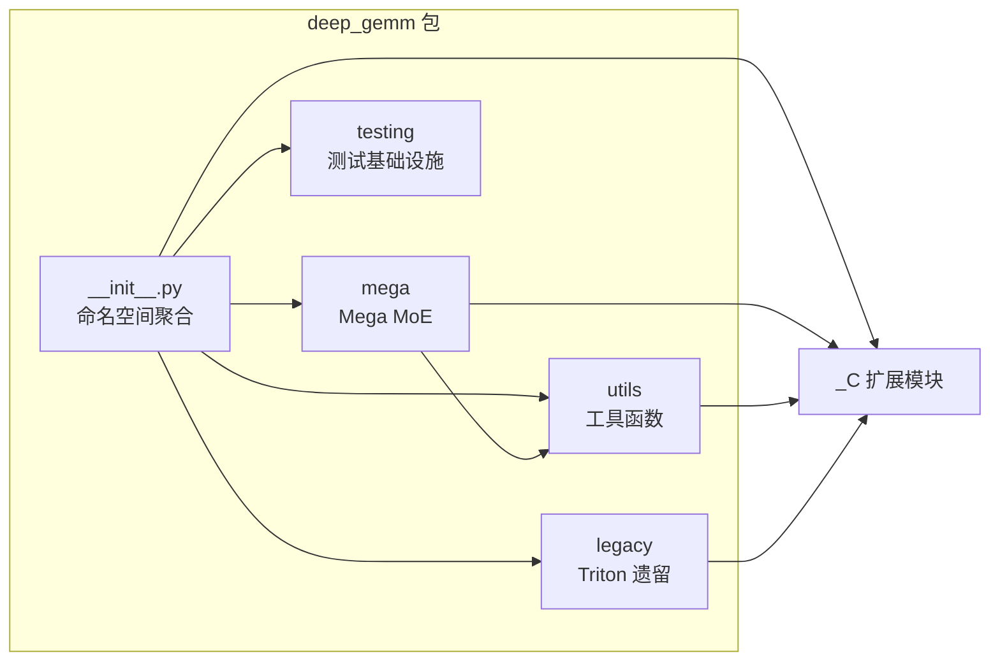
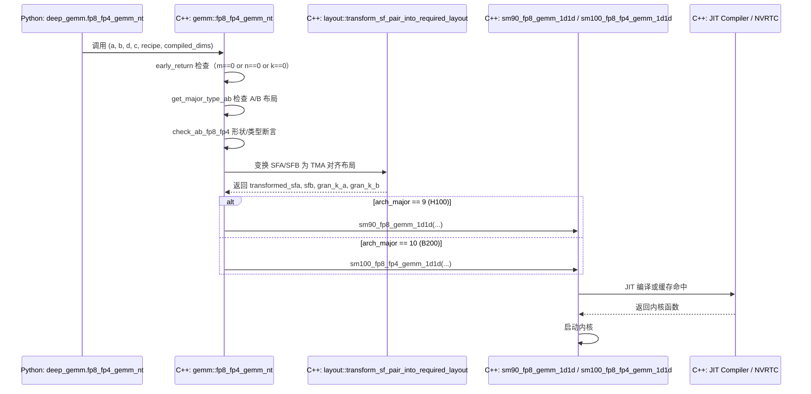
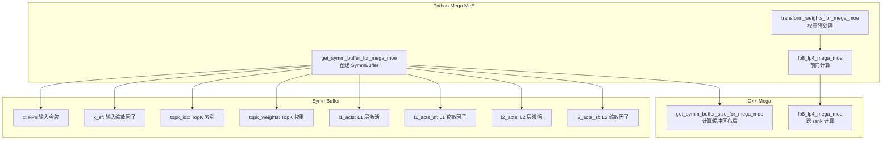
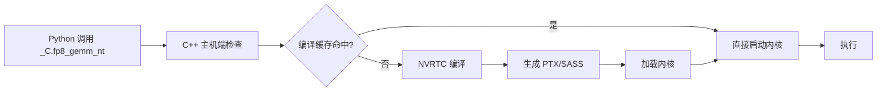
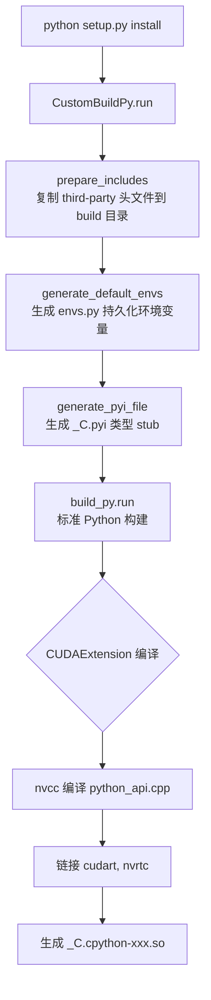
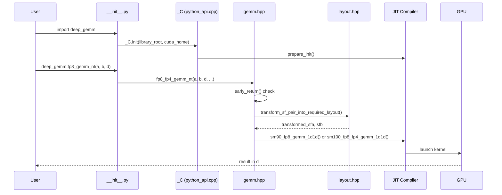

# DeepGEMM Python 层架构深度分析

> 分析对象：DeepGEMM v2.4.2  
> 项目路径：`/Users/backyes/work/triton/DeepGEMM`  
> 目标读者：AI 系统研究人员、高性能计算库设计者

---

## 1. 总体架构概览

DeepGEMM 是一个面向 NVIDIA GPU（SM90/H100、SM100/B200）的 FP8/BF16/FP4 GEMM 内核库，采用 **Python 前端 + C++ JIT 编译后端** 的混合架构。Python 层承担 API 暴露、张量布局变换、权重预处理、分布式对称内存管理以及测试基础设施；C++ 层通过 pybind11 暴露为单一扩展模块 `_C`，负责运行时分发、JIT 编译、TMA 对齐布局和内核启动。

### 1.1 架构分层图



### 1.2 目录结构

```
DeepGEMM/
├── deep_gemm/                    # Python 包
│   ├── __init__.py               # 主入口，聚合全部公开 API
│   ├── mega/                     # Mega MoE 分布式推理
│   │   └── __init__.py           # SymmBuffer + 权重变换
│   ├── utils/                    # 工具层
│   │   ├── __init__.py
│   │   ├── layout.py             # TMA 对齐布局（C++ 调用）
│   │   ├── math.py               # FP8/FP4 量化、缩放因子处理
│   │   └── dist.py               # 分布式初始化与通信
│   ├── testing/                  # 测试基础设施
│   │   ├── __init__.py
│   │   ├── bench.py              # 基准测试框架
│   │   ├── numeric.py            # 数值验证
│   │   └── utils.py              # 测试装饰器
│   ├── legacy/                   # A100 Triton 遗留内核
│   │   ├── __init__.py
│   │   ├── m_grouped_gemm.py
│   │   ├── a_fused_m_grouped_gemm.py
│   │   ├── a_fused_k_grouped_gemm.py
│   │   ├── b_fused_k_grouped_gemm.py
│   │   └── tune_options.py
│   └── include/                  # 随包分发的 C++ 头文件
│       └── deep_gemm/            # 调度器、MMA、epilogue 等
├── csrc/                         # C++ 扩展源码
│   ├── python_api.cpp            # pybind11 模块注册入口
│   ├── apis/             # 各域主机端逻辑
│   ├── jit/                      # JIT 编译、缓存、设备运行时
│   ├── jit_kernels/              # 内核实现与启发式规则
│   │   ├── impls/                # SM90/SM100 具体内核
│   │   └── heuristics/           # 运行时启发式
│   ├── indexing/                 # 索引内核
│   └── utils/                    # C++ 工具函数
├── setup.py                      # 构建系统
└── scripts/generate_pyi.py       # 类型 stub 生成
```

---

## 2. 包结构与模块职责

### 2.1 模块层次图



### 2.2 各模块职责

| 模块 | 职责 | 关键设计 |
|------|------|----------|
| `deep_gemm/__init__.py` | 聚合所有公开符号，初始化运行时 | 延迟导入、环境变量默认值、向后兼容别名 |
| `deep_gemm/mega/` | Mega MoE 分布式推理的 Python 端 | 对称内存 `SymmBuffer`、权重 interleaving/SF 变换 |
| `deep_gemm/utils/` | 布局对齐、FP8/FP4 量化、分布式工具 | 纯 Python 量化 + C++ 布局变换混合 |
| `deep_gemm/testing/` | Benchmark、数值验证、测试装饰器 | CUDA Event 计时、L2 flush、Kineto profiler 集成 |
| `deep_gemm/legacy/` | A100 上 Triton 编写的 BF16 grouped GEMM | Triton `autotune`、Config 过滤 |

---

## 3. API 设计模式

### 3.1 命名约定

DeepGEMM 的公开 API 采用 **数据类型 + 操作 + 布局** 的三段式命名：

```
{precision}_{operation}_{layout}_{variant}
```

示例解析：

| API | 含义 |
|-----|------|
| `fp8_fp4_gemm_nt` | FP8 输入、FP4 权重的 NT（Non-Transpose × Transpose）GEMM |
| `m_grouped_fp8_gemm_nt_contiguous` | M 维度分组的 FP8 GEMM，contiguous 布局 |
| `m_grouped_fp8_gemm_nt_masked` | M 维度分组的 FP8 GEMM，masked 变体 |
| `k_grouped_bf16_gemm_tn_contiguous` | K 维度分组的 BF16 GEMM，TN 布局 |
| `cublaslt_gemm_nn` | cuBLASLt 封装的 NN 布局 |
| `fp8_fp4_mega_moe` | Mega MoE 完整前向内核 |

### 3.2 `_C` 扩展模式

Python 通过单一 C++ 扩展模块 `_C` 与底层交互，采用 **"全量导入 + 条件回退"** 模式：

```python
# 核心运行时控制（始终可用）
from ._C import set_num_sms, get_num_sms, set_tc_util, get_tc_util, ...

# cuBLASLt 封装（始终可用，不依赖 TensorMap）
from ._C import cublaslt_gemm_nt, cublaslt_gemm_nn, ...

# JIT 编译内核（需 CUDA 12.1+ 和 TensorMap 支持）
try:
    from ._C import fp8_fp4_gemm_nt, m_grouped_fp8_gemm_nt_contiguous, ...
except ImportError:
    pass  # CUDA < 12.1 时静默回退

# Mega MoE（需 PyTorch 分布式对称内存）
from .mega import SymmBuffer, get_symm_buffer_for_mega_moe, ...

# Legacy Triton（A100 专用，捕获所有异常）
try:
    from . import legacy
except Exception as e:
    print(f'Failed to load legacy: {e}')
```

这种设计使得同一份 Python 包可以在 **不同 GPU 架构、不同 CUDA 版本** 下自适应降级。

### 3.3 编译期条件宏

C++ 层通过三个关键宏控制功能可用性：

| 宏 | 含义 | 影响 |
|----|------|------|
| `DG_FP8_COMPATIBLE` | FP8 指令可用 | SM90+ |
| `DG_TENSORMAP_COMPATIBLE` | TMA（Tensor Memory Accelerator）可用 | CUDA 12.1+、SM90+ |
| `DG_JIT_USE_RUNTIME_API` | 使用 CUDA Runtime API 替代 Driver API | 可选编译选项 |

这些宏在 `python_api.cpp` 中通过 `#include` 不同的 `apis/*.hpp` 头文件来实现功能注册。

---

## 4. C++ 绑定机制

### 4.1 pybind11 注册入口

`csrc/python_api.cpp` 是整个扩展的唯一入口，通过 `PYBIND11_MODULE` 注册：

```cpp
PYBIND11_MODULE(TORCH_EXTENSION_NAME, m) {
    m.doc() = "DeepGEMM C++ library";
    deep_gemm::attention::register_apis(m);
    deep_gemm::einsum::register_apis(m);
    deep_gemm::hyperconnection::register_apis(m);
    deep_gemm::gemm::register_apis(m);
    deep_gemm::layout::register_apis(m);
    deep_gemm::mega::register_apis(m);
    deep_gemm::runtime::register_apis(m);
}
```

### 4.2 各域 API 注册

每个子域通过静态 `register_apis(pybind11::module_& m)` 函数注入：

| 域 | 头文件 | 注册内容 |
|----|--------|----------|
| `runtime` | `apis/runtime.hpp` | `set_num_sms`、`set_tc_util`、`set_pdl`、`init` |
| `gemm` | `apis/gemm.hpp` | 全部 FP8/BF16/FP4 GEMM 变体 |
| `layout` | `apis/layout.hpp` | SF 布局变换、对齐查询 |
| `mega` | `apis/mega.hpp` | 对称缓冲区大小计算、Mega MoE 前向 |
| `attention` | `apis/attention.hpp` | MQA logits 计算 |
| `einsum` | `apis/einsum.hpp` | Einsum 内核 |
| `hyperconnection` | `apis/hyperconnection.hpp` | TF32 Hyperconnection |

### 4.3 运行时初始化

Python 在 `__init__.py` 末尾调用 `_C.init()` 注入关键路径：

```python
_C.init(
    os.path.dirname(os.path.abspath(__file__)),  # 库根目录（定位头文件）
    _find_cuda_home()                             # CUDA 安装路径
)
```

C++ 端 `runtime::register_apis` 中的 `init` 函数：

```cpp
m.def("init", [&](const std::string& library_root_path, const std::string& cuda_home) {
    Compiler::prepare_init(library_root_path, cuda_home);
    KernelRuntime::prepare_init(cuda_home);
    IncludeParser::prepare_init(library_root_path);
});
```

这触发了 JIT 编译器、内核运行时和 include 解析器的延迟初始化。

### 4.4 调用链示例：`fp8_fp4_gemm_nt`



### 4.5 GEMM API 默认参数设计

`gemm.hpp` 的 `register_apis` 展示了 Pythonic 的默认参数设计：

```cpp
m.def("fp8_fp4_gemm_nt", &fp8_fp4_gemm_nt,
      py::arg("a"), py::arg("b"), py::arg("d"),
      py::arg("c") = std::nullopt,
      py::arg("recipe") = std::nullopt,
      py::arg("recipe_a") = std::nullopt,
      py::arg("recipe_b") = std::nullopt,
      py::arg("compiled_dims") = "nk",
      py::arg("disable_ue8m0_cast") = false);
```

关键参数说明：
- `a`, `b`：`std::pair<Tensor, Tensor>` 即 `(data, scaling_factor)` 对
- `c`：可选累加器（支持 C/D 不同地址的 GEMM）
- `recipe`：`(rm, rn, rk)` 三维粒度，用于 SM90 的 1D2D 内核
- `compiled_dims`：JIT 编译的维度字符串，如 `"nk"` 或 `"mn"`
- `disable_ue8m0_cast`：禁用 UE8M0 缩放因子打包

---

## 5. Mega MoE Python 设计

### 5.1 架构概览

Mega MoE 是 DeepGEMM 针对 **大规模 MoE 分布式推理** 的完整内核，核心创新是利用 PyTorch 的 `torch.distributed._symmetric_memory` 实现跨节点的对称内存通信。



### 5.2 SymmBuffer 设计

`SymmBuffer` 封装了一块跨进程共享的对称内存，通过 `torch::from_blob` 在同一块原始内存上创建多个 tensor view：

```python
class SymmBuffer:
    def __init__(self, group, num_experts, num_max_tokens_per_rank,
                 num_topk, hidden, intermediate_hidden,
                 use_fp8_dispatch=True, activation='swiglu'):
        # 1. C++ 端计算所需字节数和切片函数
        num_bytes, slice_input_buffers = _C.get_symm_buffer_size_for_mega_moe(...)
        # 2. 分配对称内存
        self.buffer = symm_mem.empty(num_bytes, dtype=torch.int8, device='cuda')
        # 3. 跨 rank 同步（rendezvous）
        self.handle = symm_mem.rendezvous(self.buffer, group=group)
        # 4. 创建 tensor views
        (self.x, self.x_sf, self.topk_idx, self.topk_weights,
         self.l1_acts, self.l1_acts_sf, self.l2_acts, self.l2_acts_sf) = \
            slice_input_buffers(self.buffer)
```

### 5.3 内存布局计算

C++ 端 `get_symm_buffer_size_for_mega_moe` 通过 `layout::Buffer` 和 `layout::Data` 构建精确布局：

```
Buffer Layout (按地址递增):
┌─────────────────────────────────┐
│ input_token_buffer (FP8)        │ num_max_tokens_per_rank × hidden
├─────────────────────────────────┤
│ input_sf_buffer (INT)           │ num_max_tokens_per_rank × hidden/128
├─────────────────────────────────┤
│ input_topk_idx_buffer (INT64)   │ num_max_tokens_per_rank × num_topk
├─────────────────────────────────┤
│ input_topk_weights_buffer (FP32)│ num_max_tokens_per_rank × num_topk
├─────────────────────────────────┤
│ l1_token_buffer (FP8)           │ num_max_pool_tokens × hidden
├─────────────────────────────────┤
│ l1_sf_buffer (INT)              │ num_padded_sf_pool_tokens × hidden/128
├─────────────────────────────────┤
│ l1_topk_weights_buffer (FP32)   │ num_max_pool_tokens × 1
├─────────────────────────────────┤
│ l2_token_buffer (FP8)           │ num_max_pool_tokens × intermediate_hidden
├─────────────────────────────────┤
│ l2_sf_buffer (INT)              │ num_padded_sf_pool_tokens × intermediate_hidden/128
├─────────────────────────────────┤
│ combine_token_buffer (BF16)     │ num_topk × num_max_tokens_per_rank × hidden*2
└─────────────────────────────────┘
```

注意 `x_sf` 是 **K-major** 布局，而 `l1_acts_sf` 和 `l2_acts_sf` 是 **M-major** 布局（通过 `torch::from_blob` 的自定义 stride 实现）。

### 5.4 权重变换

`transform_weights_for_mega_moe` 对 L1/L2 权重做预处理，以匹配内核的 UTCCP（Unified Tensor Core Coherent Parallelism）要求：

```python
def transform_weights_for_mega_moe(l1_weights, l2_weights):
    # L1: gate/up interleaving + SF 转置
    l1_interleaved = _interleave_l1_weights(l1_weights)  # [gate:0..7, up:0..7, gate:8..15, up:8..15, ...]
    l1_weights = (l1_interleaved[0], _transpose_sf_for_utccp(l1_interleaved[1]))
    # L2: 仅 SF 转置
    l2_weights = (l2_weights[0], _transpose_sf_for_utccp(l2_weights[1]))
    return l1_weights, l2_weights
```

- **`_interleave_l1_weights`**：将 gate 和 up 投影的权重按 8 行粒度交错排列，匹配 SwiGLU 融合计算的数据访问模式。
- **`_transpose_sf_for_utccp`**：将 MN-major 的缩放因子转置为 K-major，满足 TMA 对齐要求（`4×32 → 32×4` 的块转置）。

### 5.5 对齐约束

`get_symm_buffer_for_mega_moe` 工厂函数确保 `num_max_tokens_per_rank` 对齐到 `block_m`：

```python
block_m = _C.get_block_m_for_mega_moe(num_ranks, num_experts, num_max_tokens_per_rank, num_topk)
num_max_tokens_per_rank = align(num_max_tokens_per_rank, block_m)
```

这是对称内存内核正确性的硬性要求——每个 rank 处理的 token 数必须是内核块大小的整数倍。

---

## 6. 工具层设计

### 6.1 utils/layout.py：TMA 对齐布局

`layout.py` 是 Python 层对 C++ 布局变换的封装，分为两部分：

**CUDA 12.1+ 专用（依赖 TensorMap）：**
```python
from .._C import (
    get_tma_aligned_size,
    get_mn_major_tma_aligned_tensor,
    get_mn_major_tma_aligned_packed_ue8m0_tensor,
    get_k_grouped_mn_major_tma_aligned_packed_ue8m0_tensor
)
```

**全版本可用：**
```python
from .._C import (
    set_mk_alignment_for_contiguous_layout,
    get_mk_alignment_for_contiguous_layout,
    get_theoretical_mk_alignment_for_contiguous_layout,
)
```

注意这里的别名技巧：
```python
get_m_alignment_for_contiguous_layout = get_mk_alignment_for_contiguous_layout
get_k_alignment_for_contiguous_layout = get_mk_alignment_for_contiguous_layout
```

这是因为 M 和 K 的对齐值由同一个底层 heuristics 决定。

### 6.2 utils/math.py：FP8/FP4 量化

`math.py` 提供完整的量化/反量化工具链：

| 函数 | 功能 |
|------|------|
| `per_token_cast_to_fp8` | 按 token 粒度量化到 FP8（E4M3），支持 UE8M0 |
| `per_channel_cast_to_fp8` | 按 channel 粒度量化 |
| `per_block_cast_to_fp8` | 按 2D block 粒度量化 |
| `per_custom_dims_cast_to_fp8` | 任意维度组合量化 |
| `per_token_cast_to_fp4` | 量化到 FP4（E2M1），带打包 |
| `transpose_packed_fp4` | FP4 打包张量的转置 |
| `cast_back_from_fp4` | FP4 反量化回高精度 |
| `ceil_to_ue8m0` | 将 FP32 指数上取整到 UE8M0 表示 |
| `pack_ue8m0_to_int` | 将 UE8M0 打包为 int8 |

**UE8M0 表示**：DeepGEMM 使用 NVIDIA 提出的 UE8M0（Unsigned Exponent 8-bit, Mantissa 0-bit）作为 FP8 的缩放因子格式。其核心思想是用一个 FP32 的纯指数值（尾数为 0）来表示 scale factor，确保跨 GPU 的一致性。

```python
def ceil_to_ue8m0(x):
    bits = x.abs().float().view(torch.int)
    exp = ((bits >> 23) & 0xFF) + (bits & 0x7FFFFF).bool().int()
    return (exp.clamp(1, 254) << 23).view(torch.float)
```

**FP4 E2M1 量化**：使用 `torch.bucketize` 将值映射到 `{0, 0.5, 1, 1.5, 2, 3, 4, 6}` 这 8 个离散值。

```python
def _quantize_to_fp4_e2m1(x):
    ax = x.abs().clamp_max(6.0)
    boundaries = torch.tensor([0.25, 0.75, 1.25, 1.75, 2.5, 3.5, 5.0])
    idx = torch.bucketize(ax, boundaries)
    code = idx.to(torch.uint8)
    sign = (x < 0) & (idx != 0)
    code = code | (sign.to(torch.uint8) << 3)
    return code.view(torch.int8)
```

### 6.3 utils/dist.py：分布式工具

| 函数 | 功能 |
|------|------|
| `init_dist` | 基于环境变量的 NCCL 进程组初始化 |
| `uneven_all_gather` | 支持不等长维度的 all-gather（MoE 核心操作） |
| `dist_print` | 带 barrier 的分布式安全打印 |

`init_dist` 的设计亮点是自动适配 PyTorch 版本：

```python
sig = inspect.signature(dist.init_process_group)
params = {'backend': 'nccl', 'init_method': f'tcp://{ip}:{port}', ...}
if 'device_id' in sig.parameters:  # PyTorch 2.3+ 支持
    params['device_id'] = torch.device(f'cuda:{local_rank}')
```

`uneven_all_gather` 实现了 MoE 中关键的 **token 重分布**：每个 rank 持有不同数量的 token，需要先交换大小、pad 到统一长度、all-gather、再去除 padding。

---

## 7. Legacy vs Modern 设计对比

### 7.1 设计哲学差异

| 维度 | Legacy（Triton） | Modern（JIT） |
|------|------------------|---------------|
| 目标硬件 | A100（SM80） | H100（SM90）、B200（SM100） |
| 编程语言 | Triton DSL | 纯 C++ + NVRTC JIT |
| 编译时 | Triton 编译期 | 运行时 JIT |
| 数据类型 | BF16 为主 | FP8、FP4、BF16、TF32 |
| 内核特性 | 标准 GEMM | TMA、UTCCP、PDL、psum layout |
| 调优方式 | `triton.autotune` | 运行时 heuristics |
| 布局要求 | 简单的 contiguous | TMA-aligned、MN-major |

### 7.2 Legacy 内核的 Triton 设计

Legacy 内核使用 Triton 的标准编程模型：

```python
@triton.autotune(configs=get_m_grouped_gemm_configs(), key=[])
@triton.jit
def m_grouped_bf16_gemm_contiguous_tl_impl(a_ptr, b_ptr, d_ptr, m_indices_ptr, ...):
    pid = tl.program_id(axis=0)
    # 标准 tile 分配
    group_id = pid // num_pid_in_group
    pid_m = first_pid_m + (pid % group_size_m)
    pid_n = (pid % num_pid_in_group) // group_size_m
    # 空 token 检查（batch_id < 0 时跳过）
    batch_id = tl.load(m_indices_ptr + pid_m * BLOCK_SIZE_M)
    if batch_id < 0:
        tl.store(d_ptrs, tl.zeros(...))
        return
    # 标准 GEMM 计算循环
    for k in range(0, K, BLOCK_SIZE_K):
        a = tl.load(a_ptrs)
        b = tl.load(b_ptrs)
        accumulator = tl.dot(a, b, accumulator)
```

**关键设计点**：
- **空 token 跳过**：`m_indices` 中 `-1` 表示空 token，直接写零返回，避免无效计算
- **Config 过滤**：`tune_options.py` 根据共享内存大小（A100 限制 166912 bytes）和 MK 对齐约束过滤配置
- **NN 布局复用**：`nn` 变体通过 `b.mT` 转置复用 `nt` 实现

### 7.3 Modern JIT 内核的 C++ 设计

Modern 内核通过 NVRTC 在运行时编译，核心优势：

1. **TMA（Tensor Memory Accelerator）**：硬件加速的张量加载，需要特定的 MN-major 对齐布局
2. **UTCCP**：统一张量核相干并行，需要特殊的 SF 布局
3. **PDL（Predicated Data Launch）**：谓词化数据启动，减少分支开销
4. **psum layout**：部分和布局，优化 MoE 的 token 累加

JIT 编译流程：



---

## 8. 构建与安装管线

### 8.1 setup.py 工作流



### 8.2 环境变量控制

| 变量 | 默认值 | 作用 |
|------|--------|------|
| `DG_SKIP_CUDA_BUILD` | `0` | 跳过 CUDA 编译（纯 Python 安装） |
| `DG_FORCE_BUILD` | `0` | 强制从源码构建 |
| `DG_USE_LOCAL_VERSION` | `1` | 在版本号后附加 git revision |
| `DG_JIT_USE_RUNTIME_API` | `0` | 使用 CUDA Runtime API 替代 Driver API |
| `DG_JIT_CACHE_DIR` | `~/.deep_gemm` | JIT 编译缓存目录 |
| `DG_JIT_PRINT_COMPILER_COMMAND` | - | 打印编译命令 |
| `DG_JIT_CPP_STANDARD` | `20` | C++ 标准版本 |
| `DG_JIT_DEBUG` | `0` | 调试模式 |
| `DG_JIT_WITH_LINEINFO` | `0` | 生成行信息 |
| `DG_USE_NVIDIA_TOOLS` | `0` | 与 Nsight 工具兼容模式 |
| `DG_COMM_KERNEL_DEBUG` | `0` | Mega MoE 通信调试（每次调用后清零缓冲区） |

### 8.3 Wheel 缓存机制

`CachedWheelsCommand` 实现了智能的 wheel 下载回退：

```python
class CachedWheelsCommand(_bdist_wheel):
    def run(self):
        if DG_FORCE_BUILD or DG_USE_LOCAL_VERSION:
            return super().run()  # 强制构建
        try:
            # 尝试从 GitHub Release 下载预编译 wheel
            urllib.request.urlopen(wheel_url, timeout=1)
            # 下载成功，直接使用
        except (HTTPError, URLError):
            print('Precompiled wheel not found. Building from source...')
            super().run()  # 回退到源码构建
```

Wheel 命名规则：
```
deep_gemm-{version}+cu{cuda}-torch{torch}-cxx11abi{abi}-{python}-{platform}.whl
```

### 8.4 Include 路径管理

`prepare_includes` 将 third-party 头文件复制到构建目录，避免污染源码树：

```python
def prepare_includes(self):
    build_include_dir = os.path.join(self.build_lib, 'deep_gemm/include')
    for d in third_party_include_dirs:  # cute, cutlass
        shutil.copytree(src_dir, os.path.join(build_include_dir, dirname))
```

`package_data` 确保这些头文件随 wheel 分发：

```python
package_data={
    'deep_gemm': [
        'include/deep_gemm/**/*',
        'include/cute/**/*',
        'include/cutlass/**/*',
    ]
}
```

### 8.5 编译器标志

```python
cxx_flags = [
    '-std=c++17', '-O3', '-fPIC',
    '-Wno-psabi', '-Wno-deprecated-declarations',
    f'-D_GLIBCXX_USE_CXX11_ABI={int(torch.compiled_with_cxx11_abi())}'
]
```

关键是与 PyTorch 的 CXX11 ABI 兼容性——通过 `torch.compiled_with_cxx11_abi()` 自动匹配。

---

## 9. 类型 Stub 生成

### 9.1 generate_pyi.py 工作原理

`scripts/generate_pyi.py` 是一个 **独立的 C++ 签名提取器**，无需 Clang/libclang 即可工作：

```mermaid
graph TB
    A[扫描 csrc/ 下所有 .cpp/.hpp] --> B[build_cpp_function_index<br/>提取所有函数签名]
    A --> C[extract_m_def_statements<br/>提取 m.def(...) 注册]
    C --> D[parse_m_def_statement<br/>解析 Python 函数名、C++ 函数名、默认参数]
    D --> E[parse_mdef_and_attach_cpp_signatures<br/>关联 C++ 签名]
    E --> F[extract_cpp_signature_details<br/>解析返回类型和参数]
    F --> G[generate_pyi_function<br/>生成 Python stub]
    G --> H[写入 _C.pyi]
```

### 9.2 BracketTracker

核心组件 `BracketTracker` 跟踪四种括号的嵌套深度，确保在模板参数（`<>`）中正确分割：

```python
class BracketTracker:
    def __init__(self):
        self.paren = 0      # ()
        self.bracket = 0    # []
        self.brace = 0      # {}
        self.angle = 0      # <>  # 仅在顶层时计数
```

### 9.3 C++ 到 Python 类型映射

`cpp_type_to_python_type` 实现了完整的类型转换：

| C++ 类型 | Python 类型 |
|----------|-------------|
| `torch::Tensor` | `torch.Tensor` |
| `std::pair<T1, T2>` | `tuple[T1, T2]` |
| `std::tuple<T1, T2, ...>` | `tuple[T1, T2, ...]` |
| `std::vector<T>` | `list[T]` |
| `std::optional<T>` | `Optional[T]` |
| `std::string` / `char*` | `str` |
| `bool` | `bool` |
| `int` / `size_t` / `int64_t` | `int` |
| `float` / `double` | `float` |
| `void` | `None` |

### 9.4 默认值转换

`cpp_default_to_python_default` 处理 C++ 默认值的 Python 化：

| C++ 默认值 | Python 默认值 |
|------------|---------------|
| `true` / `false` | `True` / `False` |
| `nullptr` / `NULL` / `nullopt` | `None` |
| `std::tuple<int,int>({128,128})` | `(128, 128)` |
| `std::make_tuple(1, 2, 3)` | `(1, 2, 3)` |
| `std::vector<int>({1,2,3})` | `[1, 2, 3]` |

---

## 10. 测试架构

### 10.1 测试模块组织

```
testing/
├── __init__.py       # 聚合 bench, numeric, utils
├── bench.py          # 基准测试框架
├── numeric.py        # 数值验证
└── utils.py          # 测试装饰器
```

### 10.2 bench.py：双模式基准测试

提供两种 benchmark 模式：

**`bench(fn)` — 简单计时模式：**
1. L2 flush：分配 256MB 张量并清零
2. Warmup：默认 5 次
3. 高精度模式：执行一次大 GEMM 消除 CPU launch overhead
4. 计时：CUDA Event 计时，默认 10 次取平均

**`bench_kineto(fn, kernel_names)` — Kineto profiler 模式：**
1. 8GB L2 flush（更激进的缓存清除）
2. `torch.profiler` 调度：`wait=0, warmup=1, active=1, repeat=1`
3. 解析 profiling 表格提取内核时间
4. 支持 Chrome trace 导出

关键设计：
- `DG_USE_NVIDIA_TOOLS` 环境变量检测，与 Nsight 工具兼容
- `suppress_stdout_stderr` 上下文管理器抑制 profiler 输出
- `barrier` 参数支持多 rank 同步

### 10.3 numeric.py：数值验证

```python
def calc_diff(x, y):
    """计算两个张量的差异度（1 - 余弦相似度的变体）"""
    x, y = x.double(), y.double()
    denominator = (x * x + y * y).sum()
    if denominator == 0:
        return 0.0
    sim = 2 * (x * y).sum() / denominator
    return 1 - sim
```

这个指标是 **1 - 归一化点积相似度**，对于完全相同的张量返回 0，对于相反张量返回 2。

`count_bytes` 递归计算张量列表的字节数，用于带宽利用率计算。

### 10.4 utils.py：测试装饰器

| 装饰器 | 功能 |
|--------|------|
| `test_filter(condition)` | 条件跳过测试（如 `lambda: torch.cuda.get_device_capability()[0] >= 9`） |
| `ignore_env(name, condition)` | 临时移除环境变量后执行测试 |

---

## 11. 环境变量持久化机制

### 11.1 envs.py 生成

`CustomBuildPy.generate_default_envs` 在构建时将当前环境变量固化：

```python
def generate_default_envs(self):
    code = '# Pre-installed environment variables\n'
    code += 'persistent_envs = dict()\n'
    for name in ('DG_JIT_CACHE_DIR', 'DG_JIT_PRINT_COMPILER_COMMAND', 'DG_JIT_CPP_STANDARD'):
        code += f"persistent_envs['{name}'] = '{os.environ[name]}'\n" if name in os.environ else ''
    with open(os.path.join(self.build_lib, 'deep_gemm', 'envs.py'), 'w') as f:
        f.write(code)
```

### 11.2 运行时加载

`__init__.py` 在导入时应用这些默认值：

```python
try:
    from .envs import persistent_envs
    for key, value in persistent_envs.items():
        if key not in os.environ:  # 用户设置优先
            os.environ[key] = value
except ImportError:
    pass
```

这确保了 **构建时的配置在运行时自动生效**，同时允许用户通过环境变量覆盖。

---

## 12. 设计模式总结

### 12.1 核心设计模式

| 模式 | 应用 | 效果 |
|------|------|------|
| **命名空间聚合** | `__init__.py` 统一导入 | 用户只需 `import deep_gemm` |
| **条件导入** | `try/except ImportError` 包裹 | 跨硬件/驱动版本自适应 |
| **C++ 扩展封装** | 单一 `_C` 模块 | 清晰的 Python/C++ 边界 |
| **延迟初始化** | `_C.init()` 在导入末尾 | 避免 CUDA 过早初始化 |
| **环境变量持久化** | `envs.py` 生成 + 加载 | 构建配置自动传递到运行时 |
| **工厂函数** | `get_symm_buffer_for_mega_moe` | 封装对齐约束和复杂构造 |
| **双模式测试** | `bench` / `bench_kineto` | 快速验证 vs 精确 profiling |
| **类型 Stub 生成** | `generate_pyi.py` | 零依赖的 IDE 类型提示 |

### 12.2 架构优势

1. **硬件自适应**：同一份代码在 A100（Legacy Triton）、H100（SM90 JIT）、B200（SM100 JIT）上自动选择最优路径
2. **版本容错**：CUDA < 12.1 时自动回退到 cuBLASLt，不中断导入
3. **零配置部署**：wheel 缓存 + 环境变量持久化减少用户配置负担
4. **可调试性**：丰富的环境变量开关（`DG_JIT_DEBUG`、`DG_COMM_KERNEL_DEBUG` 等）
5. **类型安全**：自动生成的 `.pyi` 提供完整的 IDE 补全

### 12.3 潜在改进点

1. **Legacy 内核的长期维护**：注释明确提到 "may be deprecated or rewrite in TileLang"
2. **Python 层量化性能**：`math.py` 中的 FP8/FP4 量化是纯 Python 实现，可能成为瓶颈
3. **错误信息**：部分 C++ 断言（`DG_HOST_ASSERT`）在 Python 层可能难以调试
4. **Wheel 缓存的 1 秒超时**：`timeout=1` 在网络较慢时可能导致不必要的源码构建

---

## 13. 关键调用链总结

### 13.1 标准 FP8 GEMM 调用链



### 13.2 Mega MoE 调用链

```mermaid
sequenceViewer
    participant User
    participant Mega as mega/__init__.py
    participant Symm as symm_mem
    participant CExt as _C (mega.hpp)
    participant GPU

    User->>Mega: get_symm_buffer_for_mega_moe(...)
    Mega->>CExt: get_symm_buffer_size_for_mega_moe()
    CExt-->>Mega: num_bytes, slice_func
    Mega->>Symm: symm_mem.empty(num_bytes)
    Mega->>Symm: symm_mem.rendezvous(buffer)
    Symm-->>Mega: handle
    User->>Mega: transform_weights_for_mega_moe(l1, l2)
    Mega-->>User: transformed weights
    User->>Mega: fp8_fp4_mega_moe(y, w1, w2, sym_buffer)
    Mega->>CExt: fp8_fp4_mega_moe(...)
    CExt->>GPU: sm100_fp8_fp4_mega_moe()
    GPU-->>User: result in y
```

---

## 14. 文件索引

| 文件 | 行数 | 核心职责 |
|------|------|----------|
| `deep_gemm/__init__.py` | 127 | 包入口、API 聚合、运行时初始化 |
| `deep_gemm/mega/__init__.py` | 129 | SymmBuffer、权重变换、Mega MoE 前向 |
| `deep_gemm/utils/__init__.py` | 4 | 工具模块聚合 |
| `deep_gemm/utils/layout.py` | 22 | TMA 对齐布局 C++ 封装 |
| `deep_gemm/utils/math.py` | 143 | FP8/FP4 量化、UE8M0 处理 |
| `deep_gemm/utils/dist.py` | 75 | NCCL 初始化、uneven all-gather |
| `deep_gemm/testing/__init__.py` | 4 | 测试模块聚合 |
| `deep_gemm/testing/bench.py` | 147 | 双模式 benchmark 框架 |
| `deep_gemm/testing/numeric.py` | 22 | 数值差异度计算 |
| `deep_gemm/testing/utils.py` | 38 | 条件过滤装饰器 |
| `deep_gemm/legacy/__init__.py` | 3 | Legacy 模块聚合 |
| `deep_gemm/legacy/m_grouped_gemm.py` | 86 | Triton BF16 M-GEMM |
| `deep_gemm/legacy/a_fused_m_grouped_gemm.py` | 93 | Triton A-Fused M-GEMM |
| `deep_gemm/legacy/tune_options.py` | 29 | Triton autotune 配置 |
| `csrc/python_api.cpp` | 29 | pybind11 模块注册 |
| `csrc/apis/runtime.hpp` | 52 | 运行时控制 API |
| `csrc/apis/gemm.hpp` | 716 | GEMM 主机端逻辑与注册 |
| `csrc/apis/layout.hpp` | 144 | SF 布局变换与注册 |
| `csrc/apis/mega.hpp` | 217 | Mega MoE 缓冲区与注册 |
| `csrc/apis/attention.hpp` | ~100+ | MQA logits 计算 |
| `csrc/jit/compiler.hpp` | ~200+ | NVRTC JIT 编译器 |
| `csrc/jit/device_runtime.hpp` | ~100+ | 设备运行时 |
| `csrc/jit/cache.hpp` | 32 | 内核运行时缓存 |
| `setup.py` | 215 | 构建系统 |
| `scripts/generate_pyi.py` | 891 | 类型 stub 生成器 |

---

## 15. 结论

DeepGEMM 的 Python 层设计体现了 **"薄 Python 前端 + 厚 C++ 后端"** 的高性能库典型架构。Python 层的核心价值在于：

1. **API 可用性**：通过命名空间聚合和条件导入提供统一的跨硬件接口
2. **预处理逻辑**：FP8/FP4 量化、权重变换等操作在 Python 层以声明式方式实现
3. **分布式抽象**：`SymmBuffer` 封装了复杂的对称内存管理
4. **测试基础设施**：与 PyTorch profiler 深度集成的 benchmark 框架
5. **构建时配置**：环境变量持久化机制确保构建-运行一致性

C++ 层通过 pybind11 暴露为单一 `_C` 模块，保持了 Python/C++ 边界的清晰。JIT 编译器和运行时 heuristics 使得同一份代码能自适应不同 GPU 架构，这是 DeepGEMM 在性能可移植性上的关键创新。
