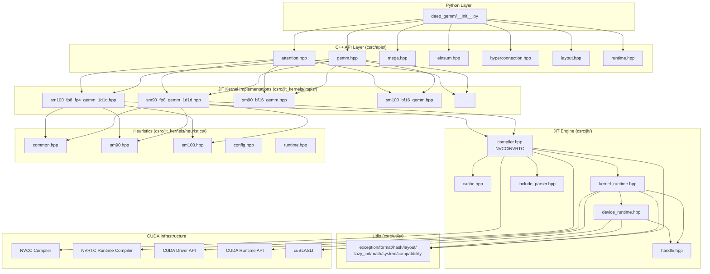
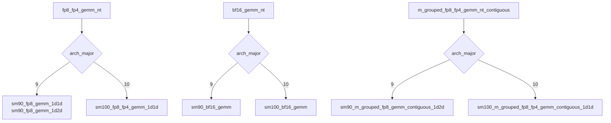
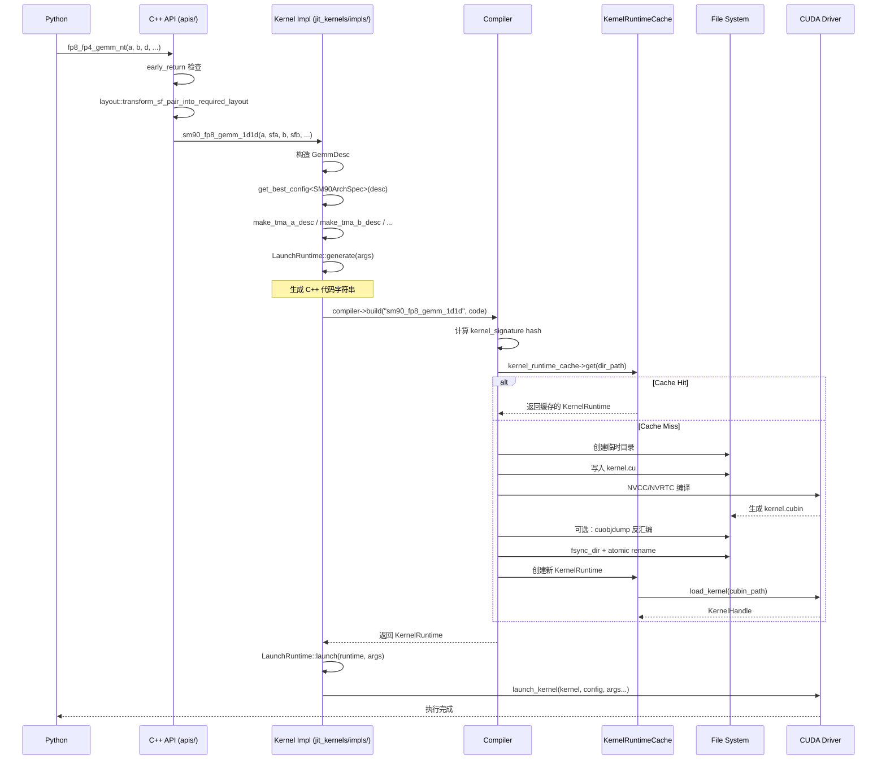
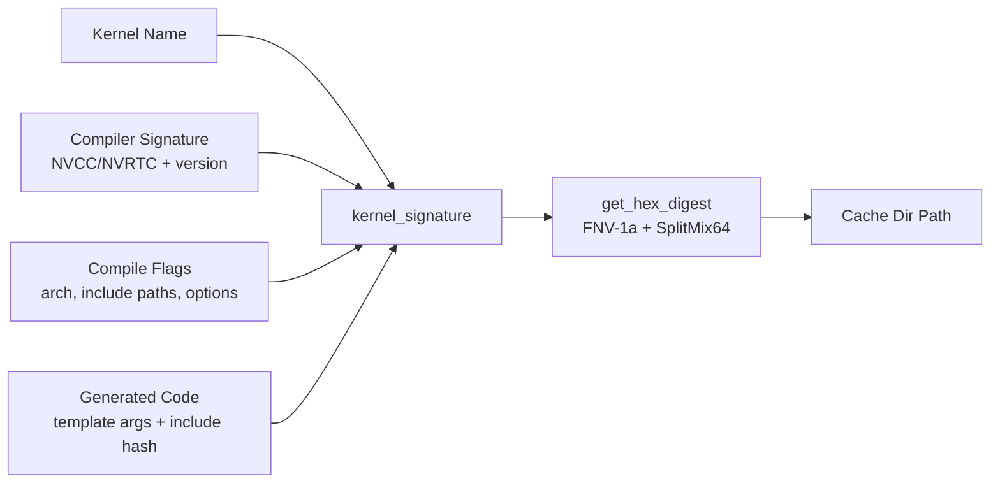
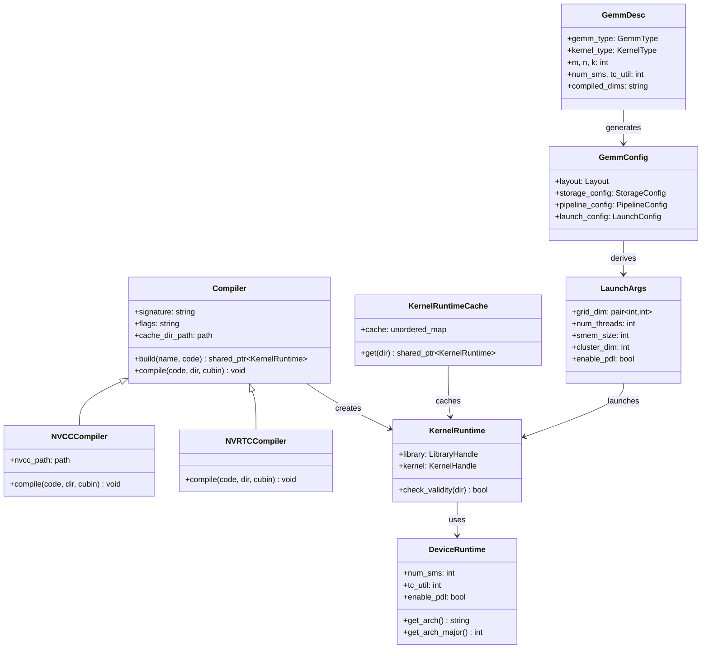

# DeepGEMM C++ 核心架构与 JIT 编译引擎深度分析

> 分析日期：2026-07-30  
> 代码库：`/Users/backyes/work/triton/DeepGEMM`  
> 目标受众：AI 系统研究人员、编译器工程师、芯片体系结构研究者

---

## 目录

1. [总体架构概览](#1-总体架构概览)
2. [C++ API 层架构](#2-c-api-层架构)
   - 2.1 [pybind11 入口与模块注册](#21-pybind11-入口与模块注册)
   - 2.2 [register_apis 模式](#22-register_apis-模式)
   - 2.3 [各 API 模块详解](#23-各-api-模块详解)
3. [JIT 编译管线](#3-jit-编译管线)
   - 3.1 [完整生命周期](#31-完整生命周期)
   - 3.2 [编译器抽象层](#32-编译器抽象层)
   - 3.3 [NVCC 编译器实现](#33-nvcc-编译器实现)
   - 3.4 [NVRTC 编译器实现](#34-nvrtc-编译器实现)
   - 3.5 [Include Parser 与依赖追踪](#35-include-parser-与依赖追踪)
4. [Kernel Caching 机制](#4kernel-caching-机制)
   - 4.1 [Cache Key 设计](#41-cache-key-设计)
   - 4.2 [Cache 目录管理](#42-cache-目录管理)
   - 4.3 [运行时 Cache](#43-运行时-cache)
5. [Kernel Runtime 与 Launch](#5kernel-runtime-与-launch)
   - 5.1 [KernelRuntime 加载](#51-kernelruntime-加载)
   - 5.2 [LaunchRuntime 模板](#52-launchruntime-模板)
   - 5.3 [TMA Descriptor 构建](#53-tma-descriptor-构建)
   - 5.4 [Kernel Launch 流程](#54-kernel-launch-流程)
6. [Device Runtime](#6device-runtime)
   - 6.1 [CUDA 设备管理](#61-cuda-设备管理)
   - 6.2 [cuBLASLt 集成](#62-cublslt-集成)
   - 6.3 [架构检测与 arch 字符串](#63-架构检测与-arch-字符串)
7. [Handle 管理与 CUDA Driver 抽象](#7handle-管理与-cuda-driver-抽象)
8. [Utility 层](#8utility-层)
   - 8.1 [compatibility.hpp](#81-compatibilityhpp)
   - 8.2 [exception.hpp](#82-exceptionhpp)
   - 8.3 [format.hpp](#83-formathpp)
   - 8.4 [hash.hpp](#84-hashhpp)
   - 8.5 [layout.hpp](#85-lyouthpp)
   - 8.6 [lazy_init.hpp](#86-lazy_inithpp)
   - 8.7 [math.hpp](#87-mathhpp)
   - 8.8 [system.hpp](#88-systemhpp)
9. [Heuristics 与自动调优](#9heuristics-与自动调优)
10. [错误处理体系](#10-错误处理体系)
11. [内存管理](#11-内存管理)
12. [关键设计洞察与架构评价](#12-关键设计洞察与架构评价)

---

## 1. 总体架构概览

DeepGEMM 的 C++ 层是一个精心设计的 **JIT (Just-In-Time) 编译框架**，其核心设计哲学是：

> **将 GEMM kernel 的编译延迟到运行时，通过模板实例化生成针对具体问题规模（problem size）优化的 CUDA kernel，同时通过多层缓存机制避免重复编译。**

整个 C++ 架构可以分为以下层次：



**关键模块职责一览：**

| 模块 | 文件 | 核心职责 |
|------|------|----------|
| Python API | `python_api.cpp` | pybind11 模块入口，注册所有 C++ API |
| GEMM API | `apis/gemm.hpp` | FP8/BF16 GEMM 的 4 种矩阵布局 (nt/nn/tn/tt) |
| Attention API | `apis/attention.hpp` | MQA logits 计算、paged KV cache |
| Mega API | `apis/mega.hpp` | MoE 对称通信 + 计算融合 |
| Einsum API | `apis/einsum.hpp` | 爱因斯坦求和约定 kernel |
| HyperConnection | `apis/hyperconnection.hpp` | TF32 HC prenorm GEMM |
| Layout API | `apis/layout.hpp` | Scaling factor 布局变换 |
| Runtime API | `apis/runtime.hpp` | SM 数量、PDL、编译维度控制 |
| JIT Compiler | `jit/compiler.hpp` | NVCC/NVRTC 抽象、编译、缓存 |
| Kernel Cache | `jit/cache.hpp` | 内存中的 KernelRuntime 缓存 |
| Kernel Runtime | `jit/kernel_runtime.hpp` | CUBIN 加载、kernel launch |
| Device Runtime | `jit/device_runtime.hpp` | 设备属性、cuBLASLt handle |
| Handle | `jit/handle.hpp` | CUDA Driver API 懒加载封装 |
| Include Parser | `jit/include_parser.hpp` | 头文件依赖解析与 hash |

---

## 2. C++ API 层架构

### 2.1 pybind11 入口与模块注册

`csrc/python_api.cpp` 是整个 C++ 扩展的入口点，极其精简：

```cpp
PYBIND11_MODULE(TORCH_EXTENSION_NAME, m) {
    m.doc() = "DeepGEMM C++ library";
    deep_gemm::attention::register_apis(m);
    deep_gemm::einsum::register_apis(m);
    deep_gemm::hyperconnection::register_apis(m);
    deep_gemm::gemm::register_apis(m);
    deep_gemm::layout::register_apis(m);
    deep_gemm::mega::register_apis(m);
    deep_gemm::runtime::register_apis(m);
}
```

**设计要点：**
- 使用 `TORCH_EXTENSION_NAME` 宏（由 `torch.utils.cpp_extension` 注入），确保与 PyTorch 的 `setuptools` 构建系统兼容
- 每个 API 模块是**自注册**的：只需实现 `register_apis(pybind11::module_&)` 函数
- 注册顺序无关，因为 pybind11 模块内部是符号表

### 2.2 register_apis 模式

所有 API 模块遵循统一的注册模式：

```cpp
namespace deep_gemm::xxx {

static void register_apis(pybind11::module_& m) {
#if DG_FP8_COMPATIBLE and DG_TENSORMAP_COMPATIBLE
    m.def("function_name", &function_impl,
          py::arg("arg1"), py::arg("arg2") = default_value, ...);
#endif
}
}
```

**关键设计特征：**

1. **条件编译守卫**：`#if DG_FP8_COMPATIBLE and DG_TENSORMAP_COMPATIBLE` 确保在不兼容的 CUDA/PyTorch 版本下优雅降级
2. **static 函数**：所有实现函数都是 `static`，避免符号冲突
3. **默认参数**：通过 `py::arg(...) = default_value` 实现 Python 侧可选参数
4. **别名机制**：如 `m.attr("fp8_gemm_nt") = m.attr("fp8_fp4_gemm_nt")` 实现向后兼容

### 2.3 各 API 模块详解

#### 2.3.1 gemm.hpp — 核心 GEMM API

这是最复杂的 API 模块，提供 **4 种矩阵布局 × 3 种精度类型 = 12+ 个变体**：

| 布局 | FP8/FP4 | BF16 | cuBLASLt |
|------|---------|------|----------|
| NT (default) | `fp8_fp4_gemm_nt` | `bf16_gemm_nt` | `cublaslt_gemm_nt` |
| NN | `fp8_fp4_gemm_nn` | `bf16_gemm_nn` | `cublaslt_gemm_nn` |
| TN | `fp8_fp4_gemm_tn` | `bf16_gemm_tn` | `cublaslt_gemm_tn` |
| TT | `fp8_fp4_gemm_tt` | `bf16_gemm_tt` | `cublaslt_gemm_tt` |

**架构分派逻辑：**



**核心数据流：**

```
Python Tensor → early_return 检查 → layout::transform_sf_pair_into_required_layout 
→ check_ab_fp8_fp4 (形状校验) → device_runtime->get_arch_major() 
→ 分派到具体 sm90/sm100 实现
```

**`early_return` 优化**：处理空问题（m=0 或 n=0）和 k=0 的退化情况，避免不必要的 kernel launch。

#### 2.3.2 attention.hpp — MQA Logits API

提供两种 MQA (Multi-Query Attention) logits 计算模式：

1. **连续 KV 模式** (`fp8_fp4_mqa_logits`)：KV 在内存中连续存储
2. **Paged KV Cache 模式** (`fp8_fp4_paged_mqa_logits`)：KV 分块存储，通过 block_table 索引

**关键设计：**
- 支持 FP4 和 FP8 两种精度，通过 `q_sf.has_value()` 区分
- 使用 `torch::from_blob` 从 fused KV cache 中零拷贝派生子张量
- 调度元数据 (`schedule_metadata`) 用于负载均衡

#### 2.3.3 mega.hpp — MoE 融合 API

Mega MoE 是 DeepGEMM 针对 Mixture-of-Experts 的创新设计：

```cpp
static void fp8_fp4_mega_moe(
    const torch::Tensor& y,
    const std::tuple<torch::Tensor, torch::Tensor>& l1_weights_,
    const std::tuple<torch::Tensor, torch::Tensor>& l2_weights_,
    const torch::Tensor& sym_buffer,  // 对称通信 buffer
    const std::vector<int64_t>& sym_buffer_ptrs,
    ...
);
```

**核心特性：**
- 使用对称 buffer (`sym_buffer`) 实现 all-to-all 通信与 GEMM 计算的 overlap
- `get_symm_buffer_size_for_mega_moe` 计算 buffer 布局，返回 `slice_input_buffers` lambda
- 仅支持 SM100 (Blackwell) 和 SwiGLU activation

#### 2.3.4 einsum.hpp — 爱因斯坦求和

目前支持硬编码的表达式：
- `"bmk,bnk->mn"` — batched GEMM
- `"bhr,hdr->bhd"` — attention 中的 QK^T
- `"bhd,hdr->bhr"` — attention 中的 weighted sum

**FP8 Einsum** 通过 `permute` 将任意维度映射到 `(batch, m, n, k)` 后复用 FP8 BMM。

#### 2.3.5 hyperconnection.hpp — TF32 HC Prenorm GEMM

为 HyperConnection 架构设计的特殊 GEMM：
- A: BF16, B: FP32, D: FP32
- 额外输入 `sqr_sum` 用于 pre-normalization
- 支持 `num_splits` 维度

#### 2.3.6 layout.hpp — Scaling Factor 布局变换

这是 JIT kernel 正确运行的前置步骤，将用户提供的 scaling factor 转换为 TMA 硬件要求的布局：

```cpp
static torch::Tensor transform_sf_into_required_layout(
    const torch::Tensor& sf,
    const int& mn, const int& k,
    const std::variant<std::tuple<int,int,int>, std::tuple<int,int>>& recipe,
    ...
);
```

**支持的变换路径：**

| 输入类型 | 架构 | 变换 |
|----------|------|------|
| FP32, gran_mn=1, gran_k=128 | SM90 | → MN-major TMA-aligned |
| FP32, gran_mn=128, gran_k=128 | SM90 | 仅校验 |
| FP32, gran_k=32/128 | SM100 | → INT8 UE8M0 packed, MN-major TMA-aligned |
| INT8, gran_mn=1, gran_k=32/128 | SM100 | 校验 TMA alignment |

#### 2.3.7 runtime.hpp — 运行时配置

提供对 JIT 引擎和 heuristics 的运行时控制：

```cpp
m.def("init", [&](const std::string& library_root_path, 
                 const std::string& cuda_home_path_by_python) {
    Compiler::prepare_init(library_root_path, cuda_home_path_by_python);
    KernelRuntime::prepare_init(cuda_home_path_by_python);
    IncludeParser::prepare_init(library_root_path);
});
```

**可配置参数：**
- `set_num_sms` / `get_num_sms`：控制使用的 SM 数量
- `set_tc_util` / `get_tc_util`：Tensor Core 利用率 (0-100)
- `set_pdl` / `get_pdl`：Programmatic Dependent Launch
- `set_ignore_compile_dims`：忽略编译维度（调试用）
- `set_block_size_multiple_of`：block size 对齐约束

---

## 3. JIT 编译管线

### 3.1 完整生命周期

DeepGEMM 的 JIT 编译是一个精心设计的 **5 阶段管线**：



### 3.2 编译器抽象层

`Compiler` 类是 JIT 编译的核心抽象：

```cpp
class Compiler {
    std::string signature, flags;
    std::filesystem::path cache_dir_path;
    
    std::shared_ptr<KernelRuntime> build(const std::string& name, 
                                          const std::string& code) const;
    virtual void compile(const std::string& code, 
                         const std::filesystem::path& dir_path,
                         const std::filesystem::path &cubin_path, ...) const = 0;
};
```

**静态配置（通过 `prepare_init` 设置）：**
- `library_root_path`：DeepGEMM 库根目录
- `library_include_path`：`library_root_path/include`
- `cuda_home`：CUDA 安装路径
- `cuobjdump_path`：`cuda_home/bin/cuobjdump`

**环境变量控制：**

| 环境变量 | 默认值 | 作用 |
|----------|--------|------|
| `DG_JIT_CACHE_DIR` | `~/.deep_gemm` | 缓存目录 |
| `DG_JIT_CPP_STANDARD` | 20 | C++ 标准 |
| `DG_JIT_DEBUG` | 0 | 调试输出 |
| `DG_JIT_DUMP_ASM` | 0 |  dump SASS |
| `DG_JIT_DUMP_PTX` | 0 | dump PTX |
| `DG_JIT_PTXAS_VERBOSE` | 0 | PTXAS 详细日志 |
| `DG_JIT_PTXAS_CHECK` | 0 | 检查 local memory |
| `DG_JIT_WITH_LINEINFO` | 0 | 包含行信息 |
| `DG_JIT_USE_NVRTC` | 0 | 使用 NVRTC 替代 NVCC |
| `DG_JIT_NVCC_COMPILER` | 自动检测 | NVCC 路径 |
| `DG_JIT_PRINT_COMPILER_COMMAND` | 0 | 打印编译命令 |
| `DG_JIT_PRINT_LOAD_TIME` | 0 | 打印加载时间 |

### 3.3 NVCC Compiler 实现

`NVCCCompiler` 通过外部进程调用 NVCC：

```cpp
class NVCCCompiler final: public Compiler {
    std::filesystem::path nvcc_path;
    
    void compile(...) const override {
        // 1. 写入 kernel.cu
        put(code_path, code);
        
        // 2. 在临时目录中编译（避免 cwd 文件污染）
        const auto command = fmt::format("cd {} && {} {} -cubin -o {} {}",
            compile_dir.c_str(), nvcc_path.c_str(), code_path.c_str(), 
            cubin_path.c_str(), flags);
        call_external_command(command);
        
        // 3. 可选：生成 PTX
        if (ptx_path.has_value()) { ... }
    }
};
```

**NVCC 编译 flags：**
```
-std=c++20 --diag-suppress=39,161,174,177,186,940
--ptxas-options=--register-usage-level=10
-I{library_include_path}
--gpu-architecture=sm_{arch}
--compiler-options=-fPIC,-O3,-fconcepts,-Wno-deprecated-declarations,-Wno-abi
-O3 --expt-relaxed-constexpr --expt-extended-lambda
```

**版本检测：** 通过正则 `release (\d+\.\d+)` 解析 NVCC 版本，要求 >= 12.3，推荐 >= 12.9。

### 3.4 NVRTC Compiler 实现

`NVRTCCompiler` 使用 CUDA Runtime Compilation API，避免进程创建开销：

```cpp
class NVRTCCompiler final: public Compiler {
    void compile(...) const override {
        // 1. 创建 NVRTC program
        nvrtcCreateProgram(&program, code.c_str(), "kernel.cu", 0, nullptr, nullptr);
        
        // 2. 编译
        nvrtcCompileProgram(program, num_options, options);
        
        // 3. 获取 CUBIN
        nvrtcGetCUBINSize(program, &cubin_size);
        nvrtcGetCUBIN(program, cubin_data.data());
        
        // 4. 写入文件
        put(cubin_path, cubin_data);
    }
};
```

**NVRTC 特有优化：**
- **PCH (Pre-Compiled Headers)**：NVRTC >= 12.8 时启用 `--pch`，显著加速编译
- **`-default-device`**：确保设备代码编译
- **`--device-int128`**：支持 124 位整数运算

### 3.5 Include Parser 与依赖追踪

`IncludeParser` 是 JIT 正确性的关键组件，它解析 kernel 代码中的 `#include <deep_gemm/*>` 指令，递归计算所有依赖头文件的 hash：

```cpp
class IncludeParser {
    std::unordered_map<std::string, std::optional<std::string>> cache;
    
    std::string get_hash_value(const std::string& code, bool exclude_code = true) {
        for (const auto& i: get_includes(code))
            ss << get_hash_value_by_path(library_include_path / i) << "$";
        return get_hex_digest(ss.str());
    }
};
```

**设计要点：**
- 只解析 `<deep_gemm/*>` 风格的 include（angle bracket）
- 递归计算依赖树，检测循环依赖（通过 `std::optional` 标记中间状态）
- 结果缓存避免重复计算
- 最终 hash 注入到生成的代码中：`// Includes' hash value: {hash}`

---

## 4. Kernel Caching 机制

### 4.1 Cache Key 设计

Cache key 是一个 **4 元组 hash**：

```cpp
const auto kernel_signature = fmt::format("{}$${}$${}$${}", 
    name,           // kernel 名称，如 "sm90_fp8_gemm_1d1d"
    signature,      // 编译器签名，如 "NVCC12.9"
    flags,          // 编译 flags
    code            // 生成的 C++ 代码
);
const auto dir_path = cache_dir_path / "cache" / 
    fmt::format("kernel.{}.{}", name, get_hex_digest(kernel_signature));
```

**Cache key 包含的维度：**



**Hash 算法** (`hash.hpp`)：
- 使用 **双种子 FNV-1a** 生成两个 64-bit 状态
- 通过 **SplitMix64** 混淆得到最终 128-bit hex digest
- 冲突概率极低（约 2^-64），适合缓存场景

### 4.2 Cache 目录管理

**目录结构：**
```
~/.deep_gemm/
├── tmp/                    # 临时目录（编译中）
│   └── {uuid}/
└── cache/                  # 最终缓存
    └── kernel.{name}.{hash}/
        ├── kernel.cu       # 源代码
        ├── kernel.cubin    # 编译产物
        ├── kernel.ptx      # 可选：PTX
        └── kernel.sass     # 可选：SASS
```

**原子性保证：**
1. 编译在 `tmp/{uuid}/` 中进行
2. 完成后 `fsync_dir` 确保数据落盘
3. `std::filesystem::rename` 是原子操作（同一文件系统内）
4. 如果多进程并发，只有一个 rename 成功，其他进程安全清理

**分布式文件系统兼容：**
- `fsync_path` 确保文件数据可见
- `fsync_dir` 递归 fsync 目录项
- `safe_remove_all` 处理 `skip_permission_denied`，避免分布式 FS 上的 segfault

### 4.3 运行时 Cache

`KernelRuntimeCache` 是内存中的二级缓存：

```cpp
class KernelRuntimeCache {
    std::unordered_map<std::string, std::shared_ptr<KernelRuntime>> cache;
    
    std::shared_ptr<KernelRuntime> get(const std::filesystem::path& dir_path) {
        // 1. 内存缓存命中
        if (cache.contains(dir_path)) return cache[dir_path];
        
        // 2. 文件系统校验
        if (KernelRuntime::check_validity(dir_path))
            return cache[dir_path] = std::make_shared<KernelRuntime>(dir_path);
        
        return nullptr;  // 需要重新编译
    }
};
```

**Cache 层级：**

```mermaid
flowchart TD
    A[build(name, code)] --> B{内存缓存命中?}
    B -->|Yes| C[返回缓存的 KernelRuntime]
    B -->|No| D{文件系统缓存命中?}
    D -->|Yes| E[加载 CUBIN → 创建 KernelRuntime]
    D -->|No| F[NVCC/NVRTC 编译]
    F --> G[写入文件系统]
    G --> E
    E --> H[存入内存缓存]
    H --> C
```

---

## 5. Kernel Runtime 与 Launch

### 5.1 KernelRuntime 加载

`KernelRuntime` 负责从 CUBIN 文件加载 kernel：

```cpp
class KernelRuntime {
    LibraryHandle library;
    KernelHandle kernel;
    
    explicit KernelRuntime(const std::filesystem::path& dir_path) {
        const auto cubin_path = dir_path / "kernel.cubin";
        
        // 方案1: CUDA 12.08+ Runtime API
        // cudaLibraryLoadFromFile → cudaLibraryGetKernel
        
        // 方案2: Driver API (默认)
        // cuModuleLoad → cuModuleGetFunction
        // 或 CUDA 12.4+: cuLibraryLoadFromFile → cuLibraryEnumerateKernels
        
        kernel = load_kernel(cubin_path, symbol_name, &library);
    }
};
```

**符号提取策略：**
- 默认通过 `cuobjdump -symbols` 解析 CUBIN
- 过滤 `STT_FUNC` + `STO_ENTRY` 类型的符号
- 排除非法符号：`vprintf`, `__instantiate_kernel`, `__internal`, `__assertfail`
- 要求恰好 1 个合法符号

### 5.2 LaunchRuntime 模板

`LaunchRuntime` 是一个 CRTP (Curiously Recurring Template Pattern) 模板类：

```cpp
template <typename Derived>
class LaunchRuntime {
    // 代码生成（静态多态）
    template <typename Args>
    static std::string generate(const Args& args) {
        auto code = Derived::generate_impl(args);
        code = fmt::format("// Includes' hash value: {}\n{}", 
                           include_hash, code);
        return code;
    }
    
    // 内核启动
    template <typename Args>
    static void launch(const std::shared_ptr<KernelRuntime>& runtime, 
                       const Args& args) {
        // 1. 获取当前 CUDA stream
        const auto stream = at::cuda::getCurrentCUDAStream();
        
        // 2. 构造 launch config
        auto config = construct_launch_config(kernel, stream, 
            smem_size, grid_dim, block_dim, cluster_dim, enable_pdl);
        
        // 3. 派生类实现具体 launch 逻辑
        Derived::launch_impl(kernel, config, args);
    }
};
```

**使用示例（SM90FP8Gemm1D1DRuntime）：**

```cpp
class SM90FP8Gemm1D1DRuntime final: public LaunchRuntime<SM90FP8Gemm1D1DRuntime> {
    struct Args {
        GemmDesc gemm_desc;
        GemmConfig gemm_config;
        LaunchArgs launch_args;
        void *gmem_a_ptr, *gmem_b_ptr, *grouped_layout, *tensor_map_buffer;
        CUtensorMap tensor_map_a_base, tensor_map_b_base;
        CUtensorMap tensor_map_sfa, tensor_map_sfb, tensor_map_cd;
    };
    
    static std::string generate_impl(const Args& args) {
        return fmt::format(R"(
            #include <deep_gemm/impls/sm90_fp8_gemm_1d1d.cuh>
            static void __instantiate_kernel() {{
                auto ptr = reinterpret_cast<void*>(&sm90_fp8_gemm_1d1d_impl<
                    {}, {}, {}, ...  // 编译时常量参数
                >);
            }};
        )", ...);
    }
    
    static void launch_impl(const KernelHandle& kernel, 
                           const LaunchConfigHandle& config, Args args) {
        launch_kernel(kernel, config,
            args.gmem_a_ptr, args.gmem_b_ptr,
            args.grouped_layout, args.tensor_map_buffer,
            args.gemm_desc.m, args.gemm_desc.n, args.gemm_desc.k,
            args.tensor_map_a_base, args.tensor_map_b_base,
            args.tensor_map_sfa, args.tensor_map_sfb, args.tensor_map_cd);
    }
};
```

### 5.3 TMA Descriptor 构建

TMA (Tensor Memory Accelerator) 是 Hopper+ 架构的关键硬件特性。DeepGEMM 通过 `runtime_utils.hpp` 提供完整的 TMA descriptor 构建：

```cpp
static CUtensorMap make_tma_2d_desc(
    const torch::Tensor& t,
    int gmem_inner_dim, int gmem_outer_dim,
    int smem_inner_dim, int smem_outer_dim,
    const int& gmem_outer_stride,
    const int& swizzle_mode, ...);
```

**TMA 配置参数：**
- `CU_TENSOR_MAP_INTERLEAVE_NONE`：无交错
- `CU_TENSOR_MAP_SWIZZLE_32B/64B/128B`：shared memory swizzle 模式
- `CU_TENSOR_MAP_L2_PROMOTION_L2_256B`：L2 提升
- `CU_TENSOR_MAP_FLOAT_OOB_FILL_NONE`：越界不填充

**Swizzle 模式映射：**

| swizzle_mode | 结果 |
|--------------|------|
| 0, 16 | `CU_TENSOR_MAP_SWIZZLE_NONE` |
| 32 | `CU_TENSOR_MAP_SWIZZLE_32B` |
| 64 | `CU_TENSOR_MAP_SWIZZLE_64B` |
| 128 | `CU_TENSOR_MAP_SWIZZLE_128B` |
| base=32, mode=128 | `CU_TENSOR_MAP_SWIZZLE_128B_ATOM_32B` (SM100) |

### 5.4 Kernel Launch 流程

```mermaid
flowchart TD
    A[LaunchRuntime::launch] --> B[获取当前 CUDA Stream]
    A --> C[读取 device_runtime->get_pdl()]
    B --> D[construct_launch_config]
    C --> D
    D --> E{smem_size > 0?}
    E -->|Yes| F[cudaFuncSetAttribute<br/>MaxDynamicSharedMemorySize]
    E -->|No| G[构建 gridDim/blockDim]
    F --> G
    G --> H{cluster_dim > 1?}
    H -->|Yes| I[添加 ClusterDimension 属性]
    H -->|No| J{enable_pdl?}
    I --> J
    J -->|Yes| K[添加 PDL 属性]
    J -->|No| L[launch_kernel]
    K --> L
```

**Launch 属性：**
- **Cluster Dimension**：Hopper+ 的 Thread Block Cluster 特性，支持 2-SM 协作
- **PDL (Programmatic Dependent Launch)**：kernel 间的程序化同步

---

## 6. Device Runtime

### 6.1 CUDA 设备管理

`DeviceRuntime` 封装了 CUDA 设备属性和状态：

```cpp
class DeviceRuntime {
    int num_sms = 0, tc_util = 0;
    bool enable_pdl = false;
    std::shared_ptr<cudaDeviceProp> cached_prop;
    
    // 架构检测
    std::pair<int, int> get_arch_pair();      // {major, minor}
    std::string get_arch(bool number_only, bool support_arch_family);
    int get_arch_major();                      // 9 (Hopper) or 10 (Blackwell)
    
    // SM 管理
    int get_num_sms();                         // 默认全部 SM
    void set_num_sms(int new_num_sms);
    
    // TC util
    int get_tc_util();                         // 默认 100%
    
    // PDL 控制
    bool get_pdl();
    void set_pdl(bool new_enable_pdl);
};
```

**arch 字符串映射：**

| GPU | major.minor | get_arch() | get_arch(number_only) | get_arch(x, true) |
|-----|-------------|------------|----------------------|-------------------|
| H100 | 9.0 | "90a" | "90" | "90a" |
| B200 | 10.0 | "100a" | "100" | "100f" |
| B300 | 10.1 | "100a" | "100" | "100f" |

### 6.2 cuBLASLt 集成

`DeviceRuntime` 同时管理 cuBLASLt handle 和 workspace：

```cpp
class DeviceRuntime {
    cublasLtHandle_t cublaslt_handle;
    torch::Tensor cublaslt_workspace;  // 32 MB
    
    cublasLtHandle_t get_cublaslt_handle() const;
    torch::Tensor get_cublaslt_workspace() const;
};
```

**两种 handle 模式：**
1. **自管理**（默认）：`cublasLtCreate` 创建独立 handle
2. **PyTorch 托管**：通过 `at::cuda::getCurrentCUDABlasLtHandle()` 获取（需 PyTorch >= 2.3）

**Workspace 模式：**
1. **持久化**（默认）：构造时分配 32MB tensor
2. **临时**：每次调用重新分配（用于 compute-sanitizer 测试）

### 6.3 架构检测与 arch 字符串

```cpp
std::string get_arch(const bool& number_only, const bool& support_arch_family) {
    const auto [major, minor] = get_arch_pair();
    if (major == 10 and minor != 1) {
        if (number_only) return "100";
        return support_arch_family ? "100f" : "100a";
    }
    return std::to_string(major * 10 + minor) + (number_only ? "" : "a");
}
```

**注意：** SM100 (Blackwell) 的 arch family 后缀 (`100f`) 仅在 NVCC/NVRTC >= 12.9 时支持。

---

## 7. Handle 管理与 CUDA Driver 抽象

`handle.hpp` 是 CUDA Driver API 的**懒加载封装层**：

```cpp
// 懒加载 CUDA driver
static void* get_driver_handle() {
    static void* handle = dlopen("libcuda.so.1", RTLD_LAZY | RTLD_LOCAL);
    return handle;
}

// 宏定义懒加载的 driver API
#define DECL_LAZY_CUDA_DRIVER_FUNCTION(name) \
    template <typename... Args> \
    static auto lazy_##name(Args&&... args) -> decltype(name(args...)) { \
        static FuncType func = nullptr; \
        if (func == nullptr) \
            func = reinterpret_cast<FuncType>(dlsym(get_driver_handle(), #name)); \
        return func(std::forward<Args>(args)...); \
    }
```

**懒加载的 Driver API：**
- `cuGetErrorName`, `cuGetErrorString`
- `cuFuncSetAttribute`
- `cuModuleLoad`, `cuModuleUnload`, `cuModuleGetFunction`
- `cuLibraryLoadFromFile`, `cuLibraryUnload`, `cuKernelGetFunction`
- `cuLaunchKernelEx`
- `cuTensorMapEncodeTiled`
- `cuLibraryGetKernelCount`, `cuLibraryEnumerateKernels` (CUDA 12.4+)

**双 API 后端：**

```cpp
#if CUDART_VERSION >= 12080 and defined(DG_JIT_USE_RUNTIME_API)
    // CUDA Runtime Unified API
    using LibraryHandle = cudaLibrary_t;
    using KernelHandle = cudaKernel_t;
    cudaLibraryLoadFromFile(...);
    cudaLaunchKernelExC(...);
#else
    // CUDA Driver API
    using LibraryHandle = CUlibrary;  // or CUmodule
    using KernelHandle = CUfunction;
    cuLibraryLoadFromFile(...);
    cuLaunchKernelEx(...);
#endif
```

---

## 8. Utility 层

### 8.1 compatibility.hpp

提供编译时特性检测宏：

```cpp
#define DG_FP8_COMPATIBLE (TORCH_VERSION_MAJOR > 2 or (TORCH_VERSION_MAJOR == 2 and TORCH_VERSION_MINOR >= 1))
#define DG_TENSORMAP_COMPATIBLE (CUDA_VERSION >= 12010)
#define DG_CUBLAS_GET_ERROR_STRING_COMPATIBLE (CUDART_VERSION >= 11042)
#define DG_CUBLASLT_ADVANCED_FEATURES_COMPATIBLE (CUDART_VERSION >= 11080)
```

### 8.2 exception.hpp

定义了统一的异常体系和检查宏：

```cpp
class DGException final : public std::exception {
    std::string message;
public:
    explicit DGException(const char *name, const char* file, 
                         const int line, const std::string& error);
};

// 检查宏
#define DG_HOST_ASSERT(cond) ...
#define DG_HOST_UNREACHABLE(reason) ...
#define DG_NVRTC_CHECK(cmd) ...
#define DG_CUDA_DRIVER_CHECK(cmd) ...
#define DG_CUDA_RUNTIME_CHECK(cmd) ...
#define DG_CUBLASLT_CHECK(cmd) ...
```

**错误传播路径：**
```
C++ 异常 → pybind11 自动转换 → Python RuntimeError
```

### 8.3 format.hpp

简单的 `fmt` 库封装：

```cpp
#define FMT_HEADER_ONLY
#include <fmt/base.h>
#include <fmt/format.h>
```

### 8.4 hash.hpp

提供 FNV-1a + SplitMix64 的 128-bit hash：

```cpp
static std::string get_hex_digest(const std::string& data) {
    const auto state_0 = fnv1a(data, 0xc6a4a7935bd1e995ull);
    const auto state_1 = fnv1a(data, 0x9e3779b97f4a7c15ull);
    // SplitMix64 混淆
    return hex(state_0) + hex(state_1);
}
```

### 8.5 layout.hpp

提供 tensor 布局检查和 scaling factor 校验：

```cpp
// Major type 检测
cute::UMMA::Major get_major_type_ab(const torch::Tensor& t);

// SF layout 校验
torch::Tensor check_sf_layout(const torch::Tensor& sf, 
    const int& mn, const int& k, const int& gran_mn, const int& gran_k, ...);

// Recipe 默认值
std::tuple<int, int, int> get_default_recipe(
    const torch::ScalarType& sfa_dtype, const torch::ScalarType& sfb_dtype);
```

### 8.6 lazy_init.hpp

通用的懒初始化模板：

```cpp
template <typename T>
class LazyInit {
    std::shared_ptr<T> ptr;
    std::function<std::shared_ptr<T>()> factory;
public:
    T* operator -> () {
        if (ptr == nullptr) ptr = factory();
        return ptr.get();
    }
};
```

**使用场景：**
- `LazyInit<Compiler>`：编译器实例
- `LazyInit<DeviceRuntime>`：设备运行时
- `LazyInit<HeuristicsRuntime>`：启发式运行时

### 8.7 math.hpp

提供数学常量和工具函数：

```cpp
constexpr auto kPackedFP4 = torch::kInt8;  // FP4 打包为 int8

template <typename T> static T ceil_div(const T& a, const T& b);
template <typename T> static constexpr T align(const T& a, const T& b);
static int get_tma_aligned_size(const int& x, const int& element_size);
```

### 8.8 system.hpp

系统级工具函数：

```cpp
// 环境变量读取
template <typename dtype_t>
static dtype_t get_env(const std::string& name, const dtype_t& default_value);

// 外部命令执行
static std::tuple<int, std::string> call_external_command(std::string command);

// 文件收集
static std::vector<std::filesystem::path> collect_files(const std::filesystem::path& root);

// 目录操作
static std::filesystem::path make_dirs(const std::filesystem::path& path);
static void safe_remove_all(const std::filesystem::path& path);

// UUID 生成
static std::string get_uuid();
```

---

## 9. Heuristics 与自动调优

DeepGEMM 的 heuristics 系统自动选择最优的 GEMM 配置：

```cpp
template <typename ArchSpec>
static GemmConfig get_best_config(const GemmDesc& desc) {
    // 1. 生成 layout 候选
    const auto layout_candidates = ArchSpec::get_layout_candidates(desc);
    
    // 2. 评估每个候选
    for (auto& candidate : layout_candidates) {
        auto info = ArchSpec::get_layout_info(desc, candidate);
        if (ArchSpec::compare(info, best_info)) best = candidate;
    }
    
    // 3. 推导其他配置
    auto storage_config = ArchSpec::get_storage_config(desc, layout);
    auto pipeline_config = ArchSpec::get_pipeline_config(desc, layout, storage_config);
    auto launch_config = ArchSpec::get_launch_config(desc, layout);
    
    return {layout, storage_config, pipeline_config, launch_config};
}
```

**配置维度：**

| 配置 | 参数 | 说明 |
|------|------|------|
| Layout | block_m, block_n, block_k, cluster_m, cluster_n | tile 大小和集群配置 |
| Storage | swizzle_a/b/cd_mode, load/store block | TMA swizzle 和访存模式 |
| Pipeline | smem_size, num_stages | shared memory 和流水线深度 |
| Launch | num_sms, num_threads, tma/math threads | 启动配置 |

**SM90 ArchSpec 特性：**
- `smem_capacity = 232448` (227 KB)
- block_m 候选：{16, 32, 64, 128, 256}（根据问题规模）
- block_k 固定：128 / element_size
- 支持 cluster size 2 (multicast)

---

## 10. 错误处理体系

DeepGEMM 使用 **异常 + 宏** 的错误处理策略：

```mermaid
graph TD
    A[错误发生] --> B{错误类型}
    B -->|主机断言失败| C[DGException<br/>Assertion]
    B -->|NVRTC 错误| D[DGException<br/>NVRTC]
    B -->|CUDA Driver 错误| E[DGException<br/>CUDA driver]
    B -->|CUDA Runtime 错误| F[DGException<br/>CUDA runtime]
    B -->|cuBLASLt 错误| G[DGException<br/>cuBLASLt]
    C --> H[what() 返回<br/>name + file:line + error]
    D --> H
    E --> H
    F --> H
    G --> H
    H --> I[pybind11 自动转换]
    I --> J[Python RuntimeError]
```

**关键设计：**
- 所有检查宏都包含 `__FILE__` 和 `__LINE__`，便于定位
- CUDA 错误码转换为可读字符串
- NVRTC 编译失败时打印完整 log
- 不支持 `cublasGetErrorString` 的旧版本使用 fallback 实现

---

## 11. 内存管理

### 11.1 GPU 内存分配

DeepGEMM 的 GPU 内存管理遵循 **"谁分配谁负责"** 原则：

| 内存类型 | 分配方式 | 生命周期 |
|----------|----------|----------|
| 输入/输出 tensor | Python 侧 (torch::empty) | Python GC |
| cuBLASLt workspace | DeviceRuntime 构造函数 | 与 DeviceRuntime 同生命周期 |
| TMA tensor map buffer | 各 kernel 函数内 (torch::empty) | 函数作用域 |
| Scaling factor 变换结果 | transform_sf_* 函数 | 返回给 Python |
| 对称通信 buffer (Mega) | Python 侧 | Python GC |

### 11.2 零拷贝视图

大量使用 `torch::from_blob` 创建零拷贝视图：

```cpp
// 从 fused KV cache 中派生子张量
kv_cache = torch::from_blob(
    fused_kv_cache.data_ptr(),
    {num_kv_blocks, block_kv, head_dim / 2},
    {kv_cache_stride_bytes, head_dim / 2, 1},
    torch::TensorOptions().dtype(kPackedFP4)
);
```

### 11.3 内存对齐

TMA 硬件要求 16-byte 对齐：

```cpp
static int get_tma_aligned_size(const int& x, const int& element_size) {
    constexpr int kNumTMAAlignmentBytes = 16;
    return align(x, kNumTMAAlignmentBytes / element_size);
}
```

---

## 12. 关键设计洞察与架构评价

### 12.1 设计亮点

1. **分层缓存策略**：内存缓存 + 文件系统缓存，兼顾速度和持久化
2. **原子性保证**：通过 `tmp → rename` 模式避免缓存损坏
3. **编译器无关抽象**：NVCC/NVRTC 可切换，适应不同部署环境
4. **CRTP 静态多态**：`LaunchRuntime<Derived>` 避免虚函数开销
5. **懒加载 Driver API**：`dlopen/dlsym` 避免启动时依赖
6. **环境变量驱动调试**：丰富的 `DG_JIT_*` 环境变量

### 12.2 架构权衡

| 设计决策 | 优势 | 代价 |
|----------|------|------|
| JIT 编译 | 针对具体问题规模优化 | 首次编译延迟 |
| 模板实例化 | 零运行时开销 | 编译时间长 |
| 文件系统缓存 | 跨进程共享 | 需要 fsync 保证一致性 |
| 硬编码表达式 | 高效 | 灵活性受限 |
| 双 API 后端 | 兼容性 | 代码复杂度 |

### 12.3 与传统 GEMM 库的对比

| 特性 | cuBLAS | CUTLASS | DeepGEMM |
|------|--------|---------|----------|
| 编译模式 | 预编译 | 预编译 | JIT |
| FP8 支持 | 有限 | 需要手动适配 | 原生 |
| Block Scale | 不支持 | 复杂 | 原生 |
| M-grouped GEMM | 不支持 | 需要自定义 | 原生 |
| MoE 融合 | 不支持 | 不支持 | 原生 (Mega) |

### 12.4 关键创新点

1. **compiled_dims 机制**：允许将 M/N/K 的某一维作为编译时常量，启用编译器优化
2. **Include Hash**：追踪头文件依赖变化，确保缓存正确性
3. **PDL 支持**：利用 Hopper+ 的 Programmatic Dependent Launch 实现 kernel 间同步
4. **UE8M0 Cast**：SM100 的 FP4 scale factor 特殊编码格式
5. **对称通信 buffer**：Mega MoE 中 all-to-all 与 GEMM 的深度融合

---

## 附录 A：关键数据结构关系图



## 附录 B：环境变量完整参考

| 环境变量 | 类型 | 默认值 | 描述 |
|----------|------|--------|------|
| `DG_JIT_CACHE_DIR` | string | `~/.deep_gemm` | JIT 缓存目录 |
| `DG_JIT_CPP_STANDARD` | int | 20 | C++ 标准版本 |
| `DG_JIT_DEBUG` | int | 0 | 调试模式（打印详细信息） |
| `DG_JIT_DUMP_ASM` | int | 0 | dump SASS 汇编 |
| `DG_JIT_DUMP_PTX` | int | 0 | dump PTX |
| `DG_JIT_DUMP_SASS` | int | 0 | dump SASS |
| `DG_JIT_PTXAS_VERBOSE` | int | 0 | PTXAS 详细输出 |
| `DG_JIT_PTXAS_CHECK` | int | 0 | 检查 local memory 使用 |
| `DG_JIT_WITH_LINEINFO` | int | 0 | 包含行信息 |
| `DG_JIT_USE_NVRTC` | int | 0 | 使用 NVRTC 替代 NVCC |
| `DG_JIT_NVCC_COMPILER` | string | 自动 | NVCC 编译器路径 |
| `DG_JIT_PRINT_COMPILER_COMMAND` | int | 0 | 打印编译命令 |
| `DG_JIT_PRINT_LOAD_TIME` | int | 0 | 打印 kernel 加载时间 |
| `DG_USE_PYTORCH_CUBLASLT_HANDLE` | int | 0 | 使用 PyTorch 的 cuBLASLt handle |
| `DG_USE_TEMP_CUBLASLT_WORKSPACE` | int | 0 | 使用临时 workspace |
| `DG_PRINT_CONFIGS` | int | 0 | 打印 heuristics 配置 |
| `DG_COMM_KERNEL_DEBUG` | int | 0 | Mega MoE debug 模式 |

---

*文档生成：基于 DeepGEMM v2.4.2 源码分析*
