# DeepGEMM CUDA 内核实现深度分析

> 本文档面向 AI 系统研究人员和芯片架构师，对 DeepGEMM 项目的 CUDA/GPU 内核实现进行全面的架构级分析。

---

## 目录

1. [项目概览与代码结构](#1-项目概览与代码结构)
2. [内核架构模式：Mainloop → Epilogue → Scheduler](#2-内核架构模式mainloop--epilogue--scheduler)
3. [SM90 vs SM100 架构差异](#3-sm90-vs-sm100-架构差异)
4. [TMA（Tensor Memory Accelerator）使用模式](#4-tmatensor-memory-accelerator使用模式)
5. [MMA 指令模式](#5-mma-指令模式)
6. [FP8/FP4 量化与缩放因子](#6-fp8fp4-量化与缩放因子)
7. [Grouped GEMM 实现](#7-grouped-gemm-实现)
8. [Mega MoE 内核](#8-mega-moe-内核)
9. [MQA Attention 实现](#9-mqa-attention-实现)
10. [启发式配置系统](#10-启发式配置系统)
11. [存储层次与数据移动优化](#11-存储层次与数据移动优化)
12. [总结](#12-总结)

---

## 1. 项目概览与代码结构

DeepGEMM 是一个针对 NVIDIA Hopper（SM90）和 Blackwell（SM100）架构的高性能 GEMM/MoE/Attention 内核库，核心设计哲学是 **JIT（Just-In-Time）编译 + 启发式配置选择**，为每个具体问题形状生成最优内核。

### 1.1 代码分层架构

```
deep_gemm/
├── common/          # 公共工具层（类型、数学、调度、TMA、架构工具）
├── mma/             # MMA 指令抽象（SM90 WGMMA / SM100 UMMA）
├── ptx/             # PTX 内联汇编封装（WGMMA、TCGen05、TMA、LD/ST）
├── impls/           # 内核实现（GEMM、MQA、MegaMoE）
├── scheduler/       # 块调度器（GEMM、MegaMoE、Paged MQA）
├── epilogue/        # 后处理（变换、SM100 TMEM→SMEM→GMEM 写回）
├── layout/          # 内存布局（MegaMoE workspace、对称缓冲）
├── comm/            # 通信原语（grid sync、NVLink barrier）
└── csrc/jit_kernels/# JIT C++ 端（启发式配置选择）
```

### 1.2 核心枚举类型

```cpp
enum class MmaKind { BF16 = 0, MXFP8FP4 = 1 };
enum class GemmType { Normal, MGroupedContiguous, MGroupedMasked, KGroupedContiguous, Batched, MGroupedContiguousWithPsumLayout };
enum class KernelType { Kernel1D1D = 0, Kernel1D2D = 1, KernelNoSF = 2 };
```

---

## 2. 内核架构模式：Mainloop → Epilogue → Scheduler

DeepGEMM 的所有内核遵循统一的 **生产者-消费者流水线** 架构，通过 `ClusterTransactionBarrier`（mbarrier）实现异步 TMA 与同步 MMA 的解耦。

### 2.1 通用内核数据流

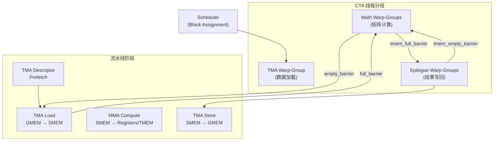

### 2.2 线程角色划分

每个 CTA 的线程被划分为不同角色，通过 `warp_idx` 区分：

| 角色 | 线程数 | 寄存器配额 | 职责 |
|------|--------|-----------|------|
| TMA 加载 warp | 32 (1 warp) | 24-40 regs | 发起 TMA 描述符预取、数据加载 |
| MMA 计算 warps | 128-256 | 232-240 regs | 执行 WGMMA/UMMA 指令 |
| Epilogue warps | 128+ | 动态 | TMEM 读取、STSM、TMA store |
| Dispatch warps (MoE) | 128+ | 动态 | EP dispatch/combine 通信 |

关键实现细节：
- **寄存器重配置**：`warpgroup_reg_dealloc` / `warpgroup_reg_alloc` 在 TMA 和 Math warps 间动态分配寄存器文件
- **SM90**：TMA 线程 128，Math 线程 128/256（BLOCK_M ≤ 64 时为 128，否则 256）
- **SM100**：固定 256 线程（32 TMA + 128 MMA + 128 Epilogue）

### 2.3 共享内存布局

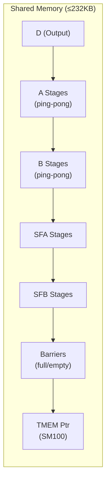

以 SM90 FP8 GEMM 1D1D 为例：
```
smem = TensorMap(optional) + D + [A × kNumStages] + [B × kNumStages] + [SFA × kNumStages] + [SFB × kNumStages] + Barriers
```

---

## 3. SM90 vs SM100 架构差异

### 3.1 核心架构对比

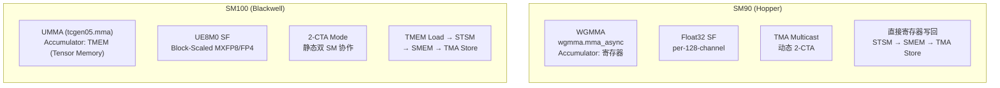

### 3.2 详细差异表

| 特性 | SM90 (Hopper) | SM100 (Blackwell) |
|------|--------------|-------------------|
| **MMA 指令** | `wgmma.mma_async` (WGMMA) | `tcgen05.mma` (UMMA) |
| **累加器存储** | 寄存器（float） | TMEM（Tensor Memory，2KB/SM） |
| **SF 数据格式** | float32（1D1D: per-128-chan） | UE8M0（block-scaled, packed uint32） |
| **SF 应用时机** | MMA 后乘法 | MMA 中硬件 block-scaling |
| **多 CTA 协作** | TMA Multicast（动态） | 2-CTA Mode（静态，双 SM） |
| **SF 加载** | TMA 直接加载 float | TMA → SMEM → UTCCP → TMEM |
| **SF 粒度** | 固定 per-128-channel | 32 或 128 可配（kGranKA/B） |
| **输出写回** | 寄存器 → STSM → TMA Store | TMEM Load → STSM → TMA Store |
| **Swap AB** | 不支持 | 支持（优化 m-grouped GEMM） |
| **TMEM 列分配** | N/A | 累加器 + SFA + SFB ≤ 512 cols |
| **UTCCP** | N/A | SMEM → TMEM 的 DMA 引擎 |

### 3.3 SM90 WGMMA 流水线

SM90 的 WGMMA 是典型的 **流水线异步 MMA**：

```cpp
// 1. 发射前 fence
warpgroup_fence_operand(accum[i]);  // 防止编译器重排
warpgroup_arrive();                   // wgmma.fence.sync.aligned

// 2. 发射 K 维度循环
for (k = 0; k < BLOCK_K / WGMMA::K; k++) {
    desc_a = make_smem_desc(smem_a + ...);
    desc_b = make_smem_desc(smem_b + ...);
    WGMMA::wgmma(desc_a, desc_b, accum, k);  // 异步发射
}

// 3. 提交并等待
warpgroup_commit_batch();     // wgmma.commit_group
warpgroup_fence_operand(accum[i]);
warpgroup_wait<0>();          // wgmma.wait_group 0
```

### 3.4 SM100 UMMA + TMEM 流水线

SM100 引入了 **TMEM** 作为 MMA 累加器，实现了计算与写回的完全解耦：

```cpp
// 1. TMEM 分配（一次性）
Allocator().allocate(kNumTmemCols, tmem_ptr_in_smem);

// 2. SF 通过 UTCCP 加载到 TMEM
cute_utccp_t::copy(sf_desc, kTmemStartColOfSFA + i * 4);

// 3. UMMA 发射（结果累加到 TMEM）
mma_t::fma(a_desc, b_desc, tmem_c_offset, scale_c, runtime_instr_desc, tmem_sfa, tmem_sfb);

// 4. 提交到 mbarrier
empty_barrier_arrive(is_last_k_block);  // tcgen05.commit

// 5. Epilogue: TMEM → 寄存器 → STSM → SMEM → TMA Store
SM100_TMEM_LOAD_32dp32b4x::copy(tmem_addr, values...);
st_shared(smem_ptr, values...);
SM90_TMA_STORE_2D::copy(&tensor_map_cd, smem_ptr, n_idx, m_idx);
```

### 3.5 SM100 的 Swap AB 优化

对于 m-grouped GEMM，SM100 支持 **Swap AB**（交换 A/B 矩阵角色）：
- 原因：m-grouped 布局中 A 必须是 K-major，但 UMMA 的 layout A/D 有 128 行对齐要求
- 方案：交换 A/B 角色，让 B（权重）作为 layout A/D，block_N 固定为 128
- 效果：避免 A 矩阵的 padding 浪费，提升内存效率

---

## 4. TMA（Tensor Memory Accelerator）使用模式

### 4.1 TMA 描述符与对齐

TMA 是 Hopper 引入的硬件加速数据搬运引擎，支持：
- **2D/3D 张量切片**：带 swizzle 的 block copy
- **Multicast**：单发射多 CTA 共享（SM90）
- **2-CTA Mode**：双 SM 硬件级同步（SM100）
- **Reduce/Add**：TMA store 时原子累加

```cpp
// TMA copy 函数签名
template <uint32_t BLOCK_INNER, uint32_t BLOCK_OUTER,
          uint32_t kSwizzleMode, typename dtype_t, bool kIs3DTMA>
void tma_copy(void const* desc_ptr, ClusterTransactionBarrier* barrier_ptr,
              dtype_t* smem_ptr, inner_idx, outer_idx, num_tma_multicast, batch_idx);
```

### 4.2 Swizzle 模式

Swizzle 是 TMA 的关键优化，用于避免 shared memory bank conflicts：

| kSwizzleMode | LayoutType | 说明 |
|-------------|-----------|------|
| 0 | INTERLEAVE | 无 swizzle（仅 SM90） |
| 16 | INTERLEAVE | 交错但无 swizzle |
| 32 | B32 | 32B swizzle atom |
| 64 | B64 | 64B swizzle atom |
| 128 | B128 | 128B swizzle atom（默认最优） |

**关键约束**：
- K-major 布局：swizzle 必须等于 `BLOCK_K * sizeof(dtype)`（通常 128B）
- MN-major 布局：swizzle 必须 ≥ 64B（32B 性能差）
- SM100 FP4：swizzle 必须为 128B

### 4.3 TMA 内部分块 Atom

```cpp
template <uint32_t BLOCK_INNER, uint32_t kSwizzleMode, typename dtype_t>
constexpr uint32_t get_inner_block_atom_size() {
    return kSwizzleMode == 0 ? BLOCK_INNER : kSwizzleMode / sizeof(dtype_t);
}
```

当启用 swizzle 时，TMA 每次搬运 `kSwizzleMode` 字节的内循环块，外层循环 `BLOCK_INNER / BLOCK_INNER_ATOM` 次。

### 4.4 TMA Multicast vs 2-CTA

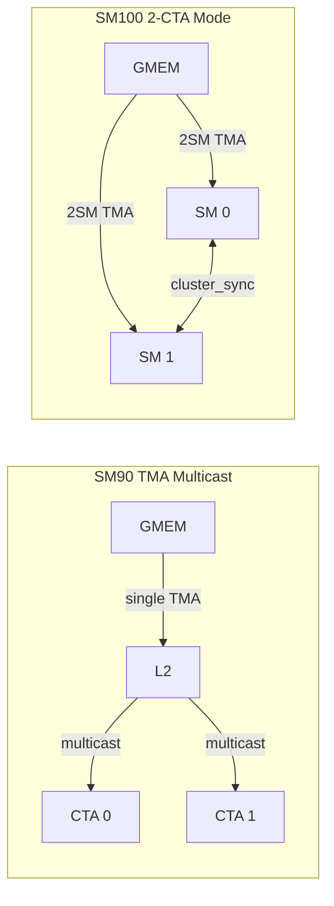

- **SM90 Multicast**：动态可关闭（`is_tma_multicast_valid`），通过 `SM90_TMA_LOAD_MULTICAST_2D` 实现
- **SM100 2-CTA**：静态绑定，通过 `SM100_TMA_2SM_LOAD_2D` 实现，leader CTA 发信号

### 4.5 TMA Store 写回

```cpp
// SM90: 使用 TMA reduce-add 实现累加写回
cute::SM90_TMA_REDUCE_ADD_2D::copy(&tensor_map_cd, smem_d, n_idx, m_idx);
cute::tma_store_arrive();

// SM100: 支持 2D/3D TMA store
using cute_tma_t = cute::conditional_t<kWithAccumulation,
    cute::SM90_TMA_REDUCE_ADD_2D, cute::SM90_TMA_STORE_2D>;
cute_tma_t::copy(&tensor_map_cd, smem_cd, n_idx, m_idx);
```

---

## 5. MMA 指令模式

### 5.1 WGMMA（SM90）指令选择

WGMMA 指令通过 CuTe 的 MMA 描述符选择：

```cpp
// FP8: 64×N×32, K=32, SS_TN (Shared-Shared, TN layout)
MMA_64xNx32_F32E4M3E4M3_SS_TN()

// BF16: 64×N×16, K=16, SS (支持 K/MN major)
MMA_64xNx16_F32BF16BF16_SS<MajorA, MajorB>()

// TF32: 64×N×8, K=8, RS (Register-Shared)
MMA_64xNx8_F32TF32TF32_RS_TN()
```

**关键参数**：
- **M = 64**：固定（对应 1 个 warpgroup 的 M 维度）
- **N = 8~256**：可配（步长 8）
- **K = 32/16/8**：由数据类型决定
- **kNumAccum = M × N / 128**：每个线程的 float 累加器数量

### 5.2 UMMA（SM100）指令选择

SM100 使用 `tcgen05.mma` 指令，通过指令描述符（`InstrDescriptorBlockScaled`）配置：

```cpp
// 非量化: tcgen05.mma.cta_group::1.kind::f16
// MXFP8/FP4: tcgen05.mma.cta_group::1.kind::mxf8f6f4.block_scale
// FP8: tcgen05.mma.cta_group::1.kind::f8f6f4
// WS (Warp Specialization): tcgen05.mma.ws.cta_group::1.kind::f16
```

**UMMA 形状约束**：
```
UMMA_M = 64  → UMMA_N ∈ [8, 256], step 8
UMMA_M = 128 → UMMA_N ∈ [16, 256], step 16
UMMA_M = 256 → UMMA_N ∈ [16, 256], step 16
UMMA_K = 32 (固定)
```

### 5.3 Shared Memory Descriptor 构建

WGMMA/UMMA 通过 **SmemDescriptor** 描述 shared memory 中的矩阵布局：

```cpp
// K-major 布局（A 矩阵典型）
// Atom: 8 × (kSwizzleMode bytes on K)
// SBO = num_non_contiguous × BLOCK_K × sizeof(dtype)
// LBO = 0 (K 维度仅 1 个 atom)
make_smem_desc(base_ptr, layout_type, LBO=0, SBO);

// MN-major 布局（B 矩阵典型）
// Atom: (kSwizzleMode bytes on MN) × 8
// SBO = num_non_contiguous × BLOCK_MN_ATOM × sizeof(dtype)
// LBO = BLOCK_K × BLOCK_MN_ATOM × sizeof(dtype)
make_smem_desc(base_ptr, layout_type, LBO, SBO);
```

### 5.4 MMA 累加器管理

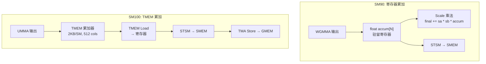

---

## 6. FP8/FP4 量化与缩放因子

### 6.1 量化类型系统

```cpp
enum class KernelType {
    Kernel1D1D = 0,   // A/B 都有 per-channel scaling
    Kernel1D2D = 1,   // A per-channel, B per-tile scaling
    KernelNoSF = 2    // 无 scaling factor（BF16）
};
```

### 6.2 1D1D Scaling（SM90 FP8）

每个 128 通道的 block 对应一个 float32 scaling factor：

```
A: [BLOCK_M, BLOCK_K] → SFA: [BLOCK_M, BLOCK_K/128] (per-row)
B: [BLOCK_N, BLOCK_K] → SFB: [BLOCK_N, BLOCK_K/128] (per-col)
```

**计算流程**：
```cpp
// 1. WGMMA 计算 int/raw 结果
WGMMA::wgmma(desc_a, desc_b, accum, k);

// 2. MMA 后应用 scaling
final_accum[i*4+0] += scale_a_0 * scale_b_0 * accum[i*4+0];
final_accum[i*4+1] += scale_a_0 * scale_b_1 * accum[i*4+1];
final_accum[i*4+2] += scale_a_1 * scale_b_0 * accum[i*4+2];
final_accum[i*4+3] += scale_a_1 * scale_b_1 * accum[i*4+3];
```

### 6.3 UE8M0 格式（SM100）

SM100 引入 **UE8M0**（8-bit exponent, 0 mantissa）作为 block-scaled 的 SF 格式：

```cpp
// UE8M0 SF 计算：仅保留指数部分
void get_e4m3_sf_and_sf_inv(const float2& amax, float2& sf, float2& sf_inv) {
    const float2 finfo_factor = {1.0 / 448.0, 1.0 / 448.0};
    const auto scaled = __fmul2_rn(amax, finfo_factor);
    const auto exp_x = fast_log2_ceil(scaled.x);
    sf.x = fast_pow2(exp_x);      // 2^ceil(log2(amax/448))
    sf_inv.x = fast_pow2(-exp_x); // 2^(-exp)
}
```

**UE8M0 特点**：
- 仅存储指数，硬件自动解析
- SF 在 MMA 指令内部应用（`block_scale` 模式）
- 支持 32 或 128 通道的 block 粒度（`kGranKA/B`）

### 6.4 UTCCP：SF 的 SMEM → TMEM 传输

SM100 使用 **UTCCP**（Unified Tensor Copy and Convert Pipeline）将 SF 从 SMEM 搬到 TMEM：

```cpp
// UTCCP 4x32dp128bit: 每次搬运 128 个 SF 元素到 TMEM
using cute_utccp_t = cute::SM100_UTCCP_4x32dp128bit_1cta;  // 1-CTA
using cute_utccp_t = cute::SM100_UTCCP_4x32dp128bit_2cta;  // 2-CTA

// 需要 warp-level transpose 使 SF 布局匹配 UTCCP 要求
utccp_required_smem_warp_transpose(smem_ptr);
cute_utccp_t::copy(sf_desc, tmem_col_offset);
```

### 6.5 FP4 支持

SM100 支持 FP4（E2M1）作为 B 矩阵：
- 存储格式：`float_e2m1_unpacksmem_t`（sub-byte 解包）
- MMA 指令：`tcgen05.mma.cta_group::1.kind::mxf4.block_scale`
- Swizzle 要求：必须 128B
- Scale vector：支持 `block32` 或 `scale_vec::2X` 模式

---

## 7. Grouped GEMM 实现

### 7.1 分组类型

```cpp
enum class GemmType {
    Normal,                              // 普通 GEMM
    MGroupedContiguous,                  // M 维度连续分组（指针跳转）
    MGroupedMasked,                      // M 维度 masked 分组（cumsum 边界）
    KGroupedContiguous,                  // K 维度连续分组（变长 K）
    Batched,                             // Batched GEMM
    MGroupedContiguousWithPsumLayout     // 带 partial sum 的连续分组
};
```

### 7.2 Scheduler 的块分配策略

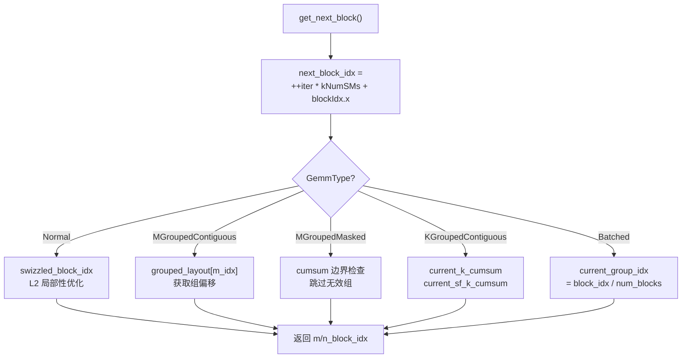

### 7.3 Swizzle 策略

为优化 L2 cache 命中率，Scheduler 实现了 **swizzled block ordering**：

```cpp
// 将 block_idx 重映射为 (group, in_group) 形式
const auto num_blocks_per_group = secondary_num_blocks * kNum1DBlocksPerGroup;
const auto group_idx = block_idx / num_blocks_per_group;
auto first_block_idx = group_idx * kNum1DBlocksPerGroup;
auto in_group_idx = block_idx % num_blocks_per_group;

// kNum1DBlocksPerGroup ∈ {8, 16}，选择使 SM 利用率最高的值
```

### 7.4 K-Grouped GEMM 的特殊处理

K-Grouped GEMM 支持每个 group 有不同的 K 维度：

```cpp
// TMA 描述符动态更新（tensormap.replace）
ptx::tensor_map_replace_global_addr_in_smem(smem_tensor_map_a, gmem_a_ptr + current_k_cumsum * shape_m);
ptx::tensor_map_replace_global_inner_dim_stride_in_smem(smem_tensor_map_a, current_shape_k, current_shape_k);
ptx::tensor_map_release_gpu();
ptx::tensor_map_acquire_gpu(gmem_tensor_map_a);
```

### 7.5 M-Grouped Contiguous（SM100 Swap AB）

SM100 对 m-grouped GEMM 强制使用 Swap AB：
- `block_n = 128`（UMMA layout A/D 的 M 维度）
- `block_m = mk_alignment_for_contiguous_layout`（由运行时决定，最大 240）
- 支持 2-CTA multicast（cluster_n = 2）

---

## 8. Mega MoE 内核

### 8.1 整体架构

Mega MoE 是 DeepGEMM 最复杂的内核，实现了 **EP（Expert Parallelism）的 dispatch/combine 与 GEMM 计算的全重叠**：

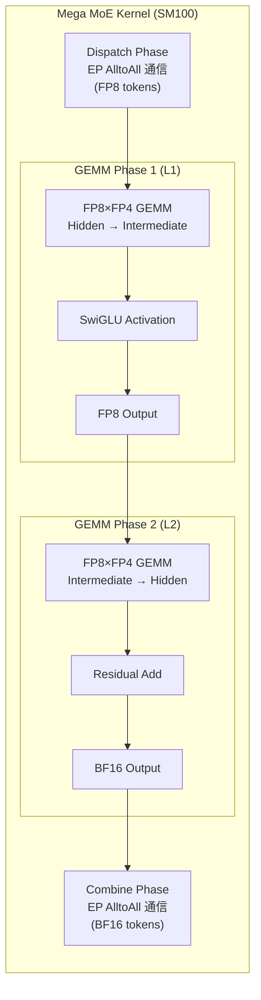

### 8.2 对称内存（SymBuffer）

Mega MoE 使用 **对称内存** 实现跨 rank 的零拷贝通信：

```cpp
template <uint32_t kNumRanks>
struct SymBuffer {
    int64_t base;                    // 本地基地址
    int64_t offsets[kNumMaxRanks];   // 各 rank 相对偏移
    uint32_t rank_idx;               // 当前 rank

    // 将本地指针映射到目标 rank 的地址空间
    template <typename ptr_t>
    ptr_t map(const ptr_t& ptr, const uint32_t& dst_rank_idx) const {
        int64_t mapped_ptr = offsets[dst_rank_idx] + reinterpret_cast<int64_t>(ptr);
        return *reinterpret_cast<ptr_t*>(&mapped_ptr);
    }
};
```

### 8.3 Mega MoE Scheduler

Mega MoE Scheduler 实现了 **两级分块（L1/L2）+ 专家波次（Expert Wave）** 的调度：

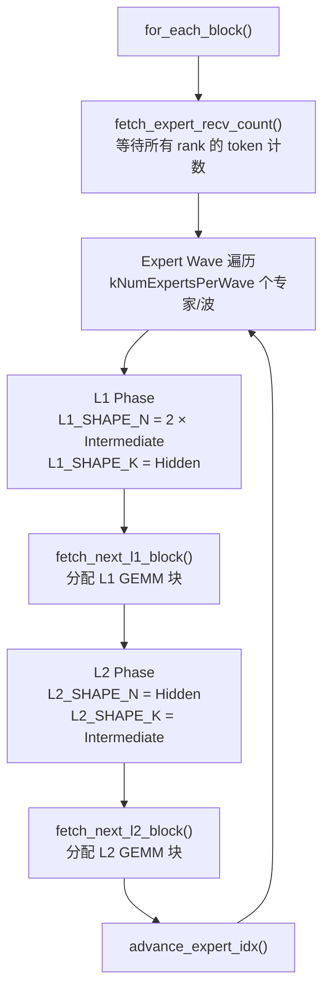

### 8.4 通信与计算重叠

```cpp
// Dispatch warps: 负责 EP 通信
if (warp_idx < kNumDispatchWarps) {
    // 1. 从远程 rank 拉取 token
    // 2. 写入本地 smem/gmem
    // 3. 更新 expert recv count
}

// Non-epilogue warps: 负责 MMA 发射
else if (warp_idx < kNumDispatchWarps + kNumMMANonEpilogueWarps) {
    // 1. 等待 token 到达（l1_arrival_count）
    // 2. 发射 UMMA 指令
}

// Epilogue warps: 负责结果写回 + Combine
else {
    // 1. TMEM → SMEM → GMEM
    // 2. 触发 Combine 通信
}
```

### 8.5 Grid Sync 与 NVLink Barrier

```cpp
// Grid Sync: 全局 CTA 同步（基于原子操作）
template <uint32_t kNumSMs, uint32_t kGridSyncIndex, typename sync_scope_t>
void grid_sync(const Workspace& workspace, sm_idx, thread_idx, sync_scope) {
    // SM 0 发起，其他 SM 递增计数器
    // 使用 release/acquire 语义保证内存可见性
    atomic_add_rel(count_ptr, sm_idx == 0 ? (kFinishSumTag - (kNumSMs - 1)) : 1);
    // 等待 tag 翻转
    while ((ld_acq(count_ptr) ^ old_value) & kFinishSumTag) == 0);
}

// NVLink Barrier: 跨 rank 同步
void nvlink_barrier(workspace, sym_buffer, sm_idx, thread_idx, ...) {
    grid_sync();                          // 本地同步
    if (sm_idx == 0) {
        red_add_rel_sys(signal_ptr, ±1);  // 远程原子信号
        while (ld_acq_sys(signal_ptr) != target);  // 等待
    }
    grid_sync();                          // 本地同步
}
```

---

## 9. MQA Attention 实现

### 9.1 非分页 MQA Logits

计算 `Q @ KV^T` 的 attention scores：

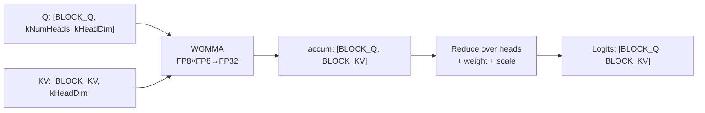

**关键实现**：
```cpp
// 矩阵乘法: [BLOCK_Q * kNumHeads, kHeadDim] @ [BLOCK_KV, kHeadDim]^T
WGMMA::wgmma(desc_kv, desc_q, accum, k);

// Head 维度归约 + 权重 + scaling
for (i = 0; i < BLOCK_Q; i++) {
    float sum[4] = {transform(0), transform(1), transform(2), transform(3)};
    for (j = 1; j < kNumHeads / 8; j++)
        for (k = 0; k < 4; k++) sum[k] += transform(j*4+k);
    v_0 = (sum[0] + sum[1]) * scale_kv_0;
    v_1 = (sum[2] + sum[3]) * scale_kv_1;
    // inter-thread reduction + store
}
```

### 9.2 分页 MQA Logits（PagedAttention 风格）

支持 **PagedAttention** 的 KV cache 布局：

```cpp
// Block table 映射逻辑 block → 物理 block
const auto physical_block_idx = block_table[logical_block_idx];
tma::copy<kHeadDim, BLOCK_KV, kHeadDim>(&tensor_map_kv, ..., 0, physical_block_idx * BLOCK_KV);
```

### 9.3 Split-KV 与调度

对于长 KV 序列，使用 **Split-KV** 并行化：

```cpp
// Metadata kernel: 计算每个 SM 的任务分配
template <uint32_t kAlignedBatchSize, uint32_t SPLIT_KV, uint32_t kNumSMs>
void smxx_paged_mqa_logits_metadata(batch_size, next_n, context_lens, schedule_metadata) {
    // 1. 计算每个 Q 的 KV segment 数
    // 2. Prefix sum 得到全局 segment 偏移
    // 3. 按 SM 均分 segments
    schedule_metadata[sm_idx * 2] = q_atom_idx;
    schedule_metadata[sm_idx * 2 + 1] = kv_split_idx;
}
```

### 9.4 Clean Logits Kernel

独立的 `smxx_clean_logits` 内核负责将无效位置填充为 `-inf`：

```cpp
// 1. 初始化 shared memory 为 -inf
for (i = threadIdx.x; i < BLOCK_KV; i += kNumWarps * 32)
    smem_buffer[i] = neg_inf;

// 2. 对无效区域 bulk copy -inf
if (right <= ks or ke <= left)
    SM90_BULK_COPY_S2G::copy(smem_buffer, logits + i * stride_logits + left, ...);

// 3. 处理对齐边界的逐元素写入
for (j = aligned_ks; j < ks; j++) logits[i * stride_logits + j] = neg_inf;
```

---

## 10. 启发式配置系统

### 10.1 配置选择流程

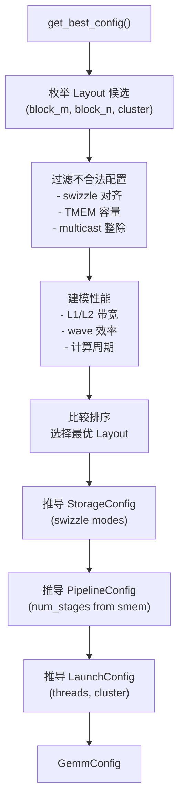

### 10.2 SM90 启发式规则

```cpp
// Block M 候选
if (Normal/Batched/KGrouped) block_m ∈ {64, 128, (256 if BF16)};
if (MGrouped) block_m = mk_alignment_for_contiguous_layout;

// Block N 候选
step = lcm(16, block_n_multiple_of);
start = (1D1D && FP32) ? 24 : step;  // 避免 bank conflict
end = (1D2D) ? 192 : (1D1D) ? 160 : 256;

// 关键过滤条件
- swizzle_mode % 64 == 0  (32B swizzle 性能差)
- num_stages >= 3 (小矩阵 >= 4)
- block_m > 128 && block_n > 128 → 拒绝（寄存器不足）
```

### 10.3 SM100 启发式规则

```cpp
// M-Grouped: 强制 Swap AB
swap_ab = true;
block_n = 128;  // UMMA layout A/D 的 M 维度
block_m = mk_alignment_for_contiguous_layout;  // 最大 240

// Normal: 双向 Swap AB 探索
for (swap_ab in {0, 1}) {
    if (swap_ab) {
        block_m_candidates: step 16, end 256
        block_n = 128;
    } else {
        block_m ∈ {32, 64, 128}
        block_n: step 32, end (k≤256) ? 128 : 256
    }
}

// TMEM 容量检查
if (2 * umma_n + tmem_sf_cols > 512) reject;

// Swizzle 要求
if (FP4) swizzle_requirement = 128;
else swizzle_requirement = 64;
```

### 10.4 性能建模

SM90 使用 **L1/L2 带宽周期模型**：

```cpp
// 数据移动量
num_bytes_l2_ab = expected_k * (block_m/cluster_n + block_n/cluster_m) * elem_size;
num_bytes_l1_tc = expected_k * (max(64, block_m) + block_n) * elem_size
                + block_m * block_n * elem_size_cd;

// 周期估算
num_l2_cycles = (num_bytes_l2_ab + num_bytes_l1_l2_cd) * num_blocks / l2_bw_per_cycle;
num_l1_cycles = (num_bytes_l1_ab + num_bytes_l1_tc + num_bytes_l1_l2_cd) * num_blocks / l1_bw_per_cycle;
num_cycles = max(num_l1_cycles, num_l2_cycles) / wave_efficiency;
```

SM100 使用 **多目标排序**：
1. 单 wave 优先
2. Multicast 优先
3. 更少 wave 数
4. 更高最后 wave 利用率
5. 更小 block 总面积

---

## 11. 存储层次与数据移动优化

### 11.1 寄存器管理

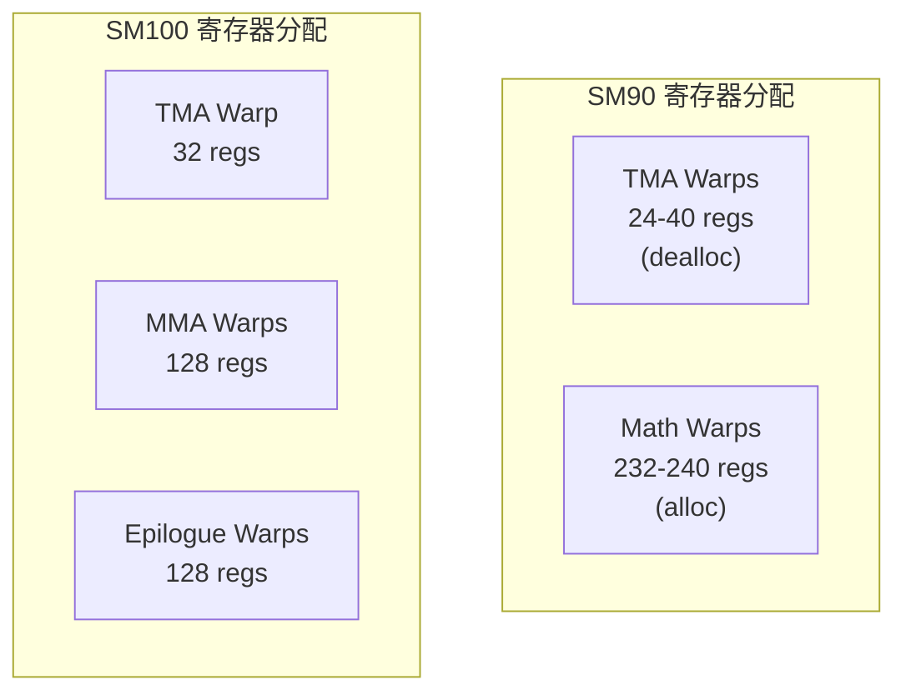

**寄存器重配置**通过 PTX 指令实现：
```cpp
// TMA warps 释放寄存器给 Math warps
cutlass::arch::warpgroup_reg_dealloc<40>();   // 仅保留 40 regs
cutlass::arch::warpgroup_reg_alloc<232>();    // 申请 232 regs
```

### 11.2 Shared Memory 优化

**Bank Conflict 避免**：
- 1D1D FP32 输出：block_n 从 24 开始（而非 16），避免 4-bank 冲突
- Swizzle 128B：确保 128 字节对齐，最大化 TMA 效率
- SFB 对齐：`aligned_smem_sfb_size = align(smem_sfb_size, 128)`

**TMEM 列对齐**：
```cpp
// TMEM 列数对齐到 32/64/128/256/512
template <uint32_t kNumCols>
constexpr uint32_t get_num_aligned_tmem_cols() {
    if (kNumCols <= 32) return 32;
    if (kNumCols <= 64) return 64;
    if (kNumCols <= 128) return 128;
    if (kNumCols <= 256) return 256;
    return 512;
}
```

### 11.3 数据移动流水线

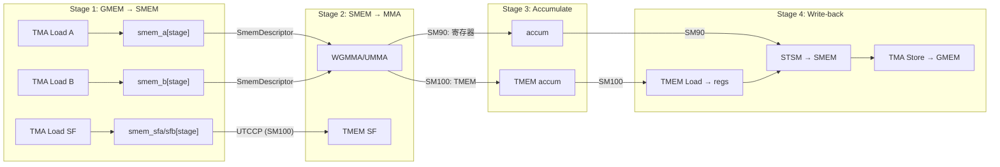

### 11.4 双缓冲与多缓冲

```cpp
// Pipeline stage 管理
auto get_pipeline = [=](iter_idx) -> tuple<stage, phase> {
    return {iter_idx % kNumStages, (iter_idx / kNumStages) & 1};
};

// full_barrier: TMA 写入完成 → MMA 可消费
// empty_barrier: MMA 消费完成 → TMA 可覆盖
full_barriers[stage]->wait(phase);     // MMA 等待 TMA
empty_barriers[stage]->wait(phase^1);  // TMA 等待 MMA
```

### 11.5 STSM 与 Vectorized Store

```cpp
// SM90: 256-bit STSM (4 × float32)
SM90_U32x4_STSM_T<float4>::copy(r0, r1, r2, r3, smem_dst);

// SM100: 128-bit STSM (8 × float32 → BF16)
SM100_U8x8_STSM_T<uint2>::copy(pack(v0,v1), pack(v2,v3), smem_dst);

// 向量化 shared memory 写入
st_shared(smem_ptr, values[0], values[1], values[2], values[3]);
```

---

## 12. 总结

### 12.1 设计哲学

1. **极致的 warp 专业化**：TMA / MMA / Epilogue 严格分离，寄存器动态分配
2. **全流水线覆盖**：TMA 延迟被 MMA 计算完全隐藏（persistent kernel）
3. **JIT + 启发式**：编译期生成最优内核，运行时选择最优配置
4. **硬件原生抽象**：直接操作 WGMMA/UMMA PTX 指令，避免 CuTe 抽象开销

### 12.2 关键创新点

| 创新 | 说明 |
|------|------|
| **1D1D FP8 Scaling** | MMA 后应用 float32 scaling，避免精度损失 |
| **UE8M0 Block Scaling** | SM100 硬件级 block-scaled MMA |
| **UTCCP SF Transpose** | 使用 DMA 引擎加速 SF 布局转换 |
| **TMEM 累加器流水线** | 计算与写回完全解耦 |
| **Swap AB for M-Grouped** | 避免 A 矩阵 padding，提升内存效率 |
| **Mega MoE 通信重叠** | EP dispatch/combine 与 GEMM 全重叠 |
| **Split-KV PagedAttention** | 长序列 KV cache 的负载均衡 |

### 12.3 性能关键路径

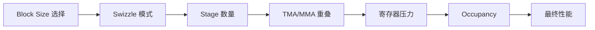

### 12.4 文件-功能映射速查

| 文件 | 核心功能 |
|------|---------|
| `common/types.cuh` | MmaKind, GemmType, KernelType 枚举 |
| `common/scheduler.cuh` | 块调度（swizzle, multicast, grouped） |
| `common/tma_copy.cuh` | TMA 2D/3D copy 封装 |
| `common/sm90_utils.cuh` | WGMMA descriptor, STSM, fence |
| `common/sm100_utils.cuh` | UMMA descriptor, UTCCP, TMEM |
| `mma/sm90.cuh` | FP8/BF16/TF32 MMA 指令选择 |
| `mma/sm100.cuh` | UMMA SmemDescriptor 构建 |
| `ptx/tcgen05.cuh` | tcgen05.mma 内联汇编 |
| `ptx/tma.cuh` | TMA PTX 指令（mbarrier, store, gather4） |
| `impls/sm90_fp8_gemm_1d1d.cuh` | SM90 FP8 GEMM 完整实现 |
| `impls/sm100_fp8_gemm_1d1d.cuh` | SM100 FP8 GEMM 完整实现 |
| `impls/sm100_fp8_fp4_mega_moe.cuh` | Mega MoE 内核 |
| `scheduler/mega_moe.cuh` | Mega MoE 两级调度 |
| `epilogue/sm100_store_cd.cuh` | TMEM → SMEM → GMEM 写回 |
| `layout/mega_moe.cuh` | Mega MoE workspace 布局 |
| `layout/sym_buffer.cuh` | 对称内存（跨 rank 映射） |
| `comm/barrier.cuh` | Grid sync + NVLink barrier |
| `csrc/jit_kernels/heuristics/*.hpp` | JIT 配置选择 |

---

> **文档版本**：基于 DeepGEMM 代码库完整分析生成  
> **分析日期**：2026-07-30  
> **目标读者**：AI 系统研究人员、GPU 内核开发者、芯片架构师
