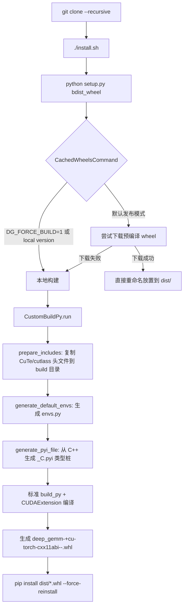
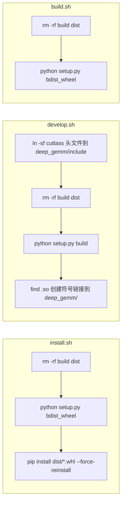
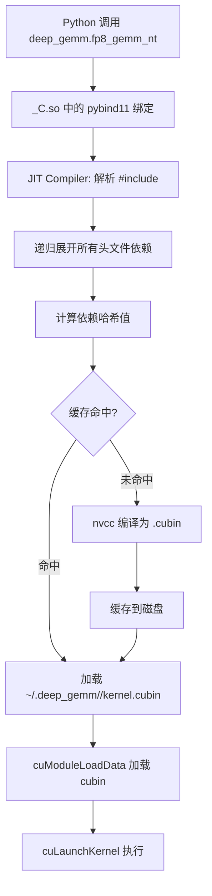
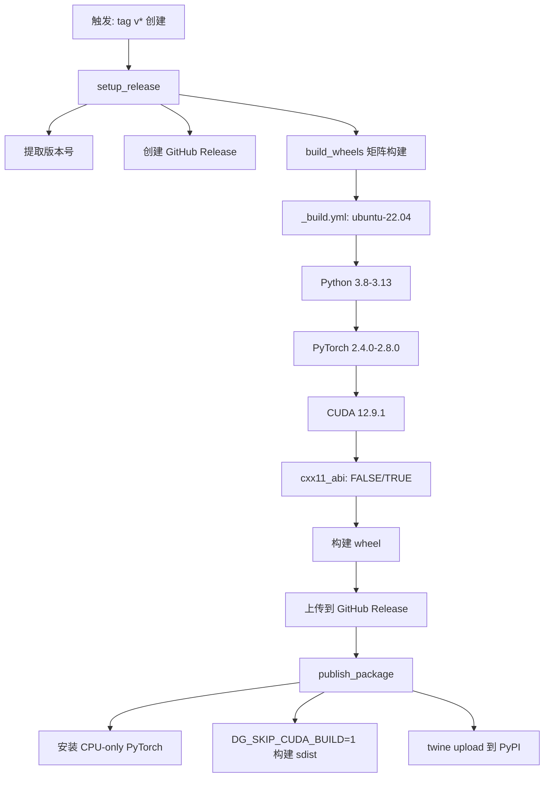
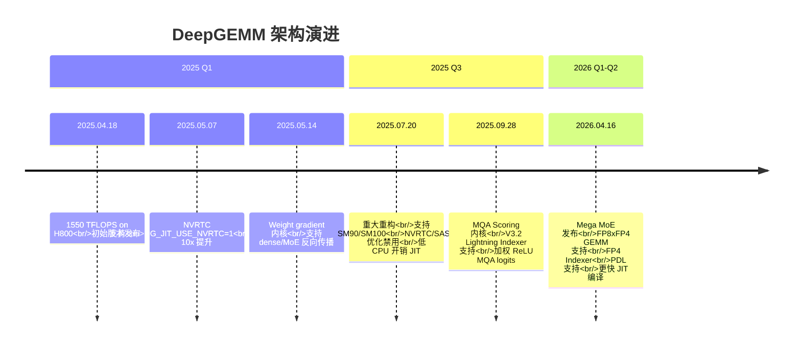

# DeepGEMM 构建系统与基础设施架构分析

> 本文档深入分析 DeepGEMM 项目的构建管线（Build Pipeline）、第三方集成、测试框架与 CI/CD 基础设施，面向 AI 系统与芯片研究人员，旨在揭示其工程架构设计决策与演进脉络。

---

## 目录

- [1. 项目概览与设计哲学](#1-项目概览与设计哲学)
- [2. 构建管线总览](#2-构建管线总览)
- [3. setup.py 深度剖析](#3-setuppy-深度剖析)
- [4. 构建脚本对比：installsh vs developsh vs buildsh](#4-构建脚本对比installsh-vs-developsh-vs-buildsh)
- [5. CMakeLists.txt 的角色](#5-cmakeliststxt-的角色)
- [6. JIT vs AOT 编译策略](#6-jit-vs-aot-编译策略)
- [7. 第三方库集成](#7-第三方库集成)
- [8. 环境变量体系](#8-环境变量体系)
- [9. 代码生成：.pyi Stub 生成](#9-代码生成pyi-stub-生成)
- [10. 测试架构](#10-测试架构)
- [11. CI/CD 基础设施](#11-cicd-基础设施)
- [12. 项目演进时间线](#12-项目演进时间线)
- [13. 关键工程洞察](#13-关键工程洞察)

---

## 1. 项目概览与设计哲学

DeepGEMM 是一个**统一的高性能 Tensor Core 内核库**，将现代 LLM 的关键计算原语（FP8/FP4/BF16 GEMM、融合 MoE、MQA scoring、HyperConnection）整合到单一 CUDA 代码库中。其核心设计哲学是：

> **"All kernels are compiled at runtime via a lightweight Just-In-Time (JIT) module, requiring no CUDA compilation during installation."**

这意味着：
- **安装阶段不编译 CUDA**（仅编译轻量 C++ JIT 宿主模块）
- **运行时按需 JIT 编译**具体 kernel 到 SASS
- 用户下载的 wheel 不含任何 `.cubin`，极大简化分发

---

## 2. 构建管线总览

### 2.1 端到端构建流程图



### 2.2 构建产物结构

```
deep_gemm-<version>+cu<cuda>-torch<torch>-cxx11abi<abi>-cp<py>-linux_x86_64.whl
└── deep_gemm/
    ├── __init__.py          # 入口，调用 _C.init()
    ├── _C.so                # 轻量 JIT 宿主（不含 kernel 代码）
    ├── _C.pyi               # 自动生成的类型桩
    ├── envs.py              # 构建时捕获的环境变量默认值
    ├── include/
    │   ├── deep_gemm/**/*   # 真实 kernel 头文件（JIT 编译时 include）
    │   ├── cute/**/*         # CUTLASS CuTe 子集
    │   └── cutlass/**/*     # CUTLASS 子集
    ├── utils/               # Python 工具函数
    ├── testing/             # 测试基础设施
    ├── legacy/              # Triton 遗留内核（A100）
    └── mega/                # Mega MoE 对称内存管理
```

---

## 3. setup.py 深度剖析

`setup.py` 是整个构建系统的核心，继承了 setuptools 的多个命令类进行定制。

### 3.1 全局配置与编译器标志

```python
cxx_flags = ['-std=c++17', '-O3', '-fPIC', '-Wno-psabi', '-Wno-deprecated-declarations',
             f'-D_GLIBCXX_USE_CXX11_ABI={int(torch.compiled_with_cxx11_abi())}']
```

**关键设计点**：
- C++17 用于构建宿主模块（JIT 编译器等），但 kernel 本身使用 C++20（通过 `DG_JIT_CPP_STANDARD` 控制）
- `_GLIBCXX_USE_CXX11_ABI` 与 PyTorch 保持一致，避免 ABI 不匹配导致的 `undefined symbol` 错误
- `DG_JIT_USE_RUNTIME_API` 可选启用 CUDA Runtime API 加载 kernel（需 CUDA >= 12.8）

### 3.2 源文件与依赖配置

```python
sources = ['csrc/python_api.cpp']  # 单一入口文件
build_include_dirs = [
    f'{CUDA_HOME}/include',
    f'{CUDA_HOME}/include/cccl',       # CUDA Core Compute Libraries
    'deep_gemm/include',               # 项目自身头文件
    'third-party/cutlass/include',     # CUTLASS
    'third-party/fmt/include',         # fmt 格式化库
]
build_libraries = ['cudart', 'nvrtc']  # CUDA Runtime + NVRTC
```

**注意**：`CUDA_HOME` 来自 `torch.utils.cpp_extension.CUDA_HOME`，即与 PyTorch 编译时一致的 CUDA 版本。

### 3.3 版本管理系统

```python
def get_package_version():
    # 从 deep_gemm/__init__.py 读取公开版本号
    public_version = ast.literal_eval(version_match.group(1))  # 如 '2.4.2'
    
    revision = ''
    if DG_USE_LOCAL_VERSION:
        # 检查 git 工作区是否干净
        # 干净: +<short_sha>  不干净: assert 失败
        revision = '+' + subprocess.check_output(['git', 'rev-parse', '--short', 'HEAD'])
    return f'{public_version}{revision}'
```

**版本策略**：
- **发布模式**（`DG_USE_LOCAL_VERSION=0`）：纯版本号 `2.4.2`，用于 PyPI 发布
- **本地模式**（`DG_USE_LOCAL_VERSION=1`，默认）：`2.4.2+abc1234`，要求 git 干净

### 3.4 CustomBuildPy — 自定义构建流程

```python
class CustomBuildPy(build_py):
    def run(self):
        self.prepare_includes()      # 1. 准备头文件
        self.generate_default_envs() # 2. 生成 envs.py
        self.generate_pyi_file()     # 3. 生成 .pyi 类型桩
        build_py.run(self)           # 4. 标准构建
```

#### prepare_includes()

```python
def prepare_includes(self):
    build_include_dir = os.path.join(self.build_lib, 'deep_gemm/include')
    for d in third_party_include_dirs:  # ['third-party/cutlass/include/cute', '.../cutlass']
        shutil.copytree(src_dir, dst_dir)  # 复制到 build 目录
```

**设计决策**：不修改源目录，所有第三方头文件复制到 `build_lib/deep_gemm/include/` 下，保持源目录干净。

#### generate_default_envs()

```python
def generate_default_envs(self):
    code = '# Pre-installed environment variables\n'
    code += 'persistent_envs = dict()\n'
    for name in ('DG_JIT_CACHE_DIR', 'DG_JIT_PRINT_COMPILER_COMMAND', 'DG_JIT_CPP_STANDARD'):
        code += f"persistent_envs['{name}'] = '{os.environ[name]}'\n" if name in os.environ else ''
```

**作用**：将构建时的关键环境变量"冻结"到 `envs.py`，运行时 `__init__.py` 会自动恢复这些默认值。

#### generate_pyi_file()

调用 `scripts/generate_pyi.py` 从 C++ 源码提取函数签名，生成 `_C.pyi` 类型桩，详见第 9 节。

### 3.5 CachedWheelsCommand — 智能 Wheel 下载

```python
class CachedWheelsCommand(_bdist_wheel):
    def run(self):
        if DG_FORCE_BUILD or DG_USE_LOCAL_VERSION:
            return super().run()  # 强制本地构建
        
        wheel_url, wheel_filename = get_wheel_url()
        try:
            # 尝试从 GitHub Release 下载（1 秒超时）
            urllib.request.urlopen(wheel_url, timeout=1)
            # 下载成功：直接重命名为 wheel 格式
        except (HTTPError, URLError):
            # 下载失败：回退到本地源码构建
            super().run()
```

#### Wheel URL 构造

```python
def get_wheel_url():
    wheel_filename = (
        f'deep_gemm-{deep_gemm_version}+cu{cuda_version}'
        f'-torch{torch_version}-cxx11abi{cxx11_abi}'
        f'-{python_version}-{platform_name}.whl'
    )
    # 示例: deep_gemm-2.4.2+cu129-torch2.8-cxx11abi0-cp312-linux_x86_64.whl
    wheel_url = f'https://github.com/DeepSeek-AI/DeepGEMM/releases/download/v{version}/{wheel_filename}'
```

**关键决策**：
- 使用 **PyTorch 编译时的 CUDA 版本**（`torch.version.cuda`），而非系统当前安装的 CUDA
- 区分 `cxx11_abi` 是因为 PyTorch 官方 wheel 未启用 C++11 ABI，但 NVIDIA 容器镜像（nvcr）中的 PyTorch 启用了

### 3.6 get_ext_modules — 条件性 CUDA 扩展

```python
def get_ext_modules():
    if DG_SKIP_CUDA_BUILD:
        return []  # 跳过 CUDA 构建（用于 PyPI 纯 Python 发布）
    return [CUDAExtension(name='deep_gemm._C', ...)]
```

---

## 4. 构建脚本对比：install.sh vs develop.sh vs build.sh



| 脚本 | 主要用途 | 产物 | 特点 |
|------|---------|------|------|
| `install.sh` | 生产部署 | `.whl` 安装到 site-packages | 完整安装流程 |
| `develop.sh` | 开发调试 | `build/` 目录 + 符号链接 | 不创建 wheel，直接链接 `.so` |
| `build.sh` | CI/CD 构建 | `.whl` 文件 | 仅构建不安装 |

### develop.sh 的特殊处理

```bash
# 创建符号链接，让 Python 能找到头文件
ln -sf $script_dir/third-party/cutlass/include/cutlass deep_gemm/include
ln -sf $script_dir/third-party/cutlass/include/cute deep_gemm/include

# 构建后创建 .so 符号链接
so_file=$(find build -name "*.so" -type f | head -n 1)
ln -sf "../$so_file" deep_gemm/
```

**注意**：这些符号链接被 `.gitignore` 忽略（`deep_gemm/include/cute`、`deep_gemm/include/cutlass`、`deep_gemm/*.so`），不会进入 git 历史。

---

## 5. CMakeLists.txt 的角色

```cmake
# NOTES: current just for CMake-based IDE (e.g. CLion) indexing, the real compilation is done via JIT
cmake_minimum_required(VERSION 3.10)
project(deep_gemm LANGUAGES CXX CUDA)
```

### 5.1 仅用于 IDE 索引

`CMakeLists.txt` **不参与实际编译**，仅为 CLion 等 CMake-based IDE 提供代码索引：

```cmake
# C++20/CUDA20 标准（与 kernel JIT 编译一致）
set(CMAKE_CXX_STANDARD 20)
set(CMAKE_CUDA_STANDARD 20)

# 主 Python API 入口（IDE 索引用）
pybind11_add_module(_C csrc/python_api.cpp)

# 关键：所有 kernel 头文件都 include 进来供索引
cuda_add_library(deep_gemm_indexing_cuda STATIC csrc/indexing/main.cu)
```

### 5.2 csrc/indexing/main.cu — 索引专用文件

```cpp
// GEMM kernels
#include <deep_gemm/impls/sm90_bf16_gemm.cuh>
#include <deep_gemm/impls/sm90_fp8_gemm_1d1d.cuh>
// ... 所有 kernel 头文件

int main() { return 0; }  // 空 main，仅用于编译索引
```

**设计意图**：让 IDE 能解析所有 kernel 定义的符号，提供代码补全和跳转，但**不生成任何可执行代码**。

### 5.3 与真实 JIT 构建的差异

| 特性 | CMakeLists.txt | 真实 JIT 构建 |
|------|---------------|--------------|
| 目的 | IDE 索引 | 运行时 kernel 编译 |
| 编译目标 | 无（仅索引） | `.cubin` 文件 |
| 编译器 | CMake 调用 nvcc | `Compiler` 类直接调用 nvcc |
| 输出 | 无 | `~/.deep_gemm/<hash>/kernel.cubin` |
| CUDA 架构 | `CUDA_ARCH_LIST` 变量 | 运行时自动检测 |

---

## 6. JIT vs AOT 编译策略

### 6.1 设计决策：全 JIT 编译

DeepGEMM 的核心创新是**完全不使用 AOT（Ahead-Of-Time）编译 CUDA kernel**：

```
传统 CUTLASS 流程：
  setup.py → nvcc 编译所有 SM arch → 链接巨大 .so → 分发 GB 级 wheel

DeepGEMM 流程：
  setup.py → 仅编译轻量 _C.so（< 1MB） → 分发 wheel
  运行时 → 首次调用 kernel → JIT 编译为 .cubin → 缓存到 ~/.deep_gemm/
```

### 6.2 JIT 编译流程



### 6.3 关键组件

- **IncludeParser**：递归解析 `#include <deep_gemm/*>` 指令，构建完整编译单元
- **KernelRuntimeCache**：内存中的 cubin 运行时缓存
- **磁盘缓存**：`~/.deep_gemm/<hash>/` 目录，跨进程共享编译结果
- **NVRTC 支持**：可选使用 `DG_JIT_USE_NVRTC=1` 启用，编译速度提升 10x 但可能有性能损失

### 6.4 为什么选择 JIT

1. **分发体积小**：wheel 仅 ~1MB，而非数百 MB 的 cubin 集合
2. **架构适配**：运行时检测 GPU 架构，只编译需要的 kernel
3. **迭代速度**：修改 kernel 代码无需重新安装，删除缓存即可
4. **实验灵活**：支持 `set_ignore_compile_dims`、`set_block_size_multiple_of` 等运行时调优

---

## 7. 第三方库集成

### 7.1 子模块管理

```gitmodules
[submodule "third-party/cutlass"]
    path = third-party/cutlass
    url = https://github.com/NVIDIA/cutlass.git
[submodule "third-party/fmt"]
    path = third-party/fmt
    url = https://github.com/fmtlib/fmt.git
```

**注意**：`tilelang_ops` 不是 git 子模块，而是直接包含在仓库中的代码。

### 7.2 CUTLASS — 核心依赖

DeepGEMM 使用 CUTLASS 4.0+ 的两个子集：

| 组件 | 用途 | 安装方式 |
|------|------|---------|
| **CuTe** (`cute/`) | Tensor 布局、拷贝原语、TMA 抽象 | 复制到 `deep_gemm/include/cute/` |
| **CUTLASS** (`cutlass/`) | MMA 描述、架构特性 | 复制到 `deep_gemm/include/cutlass/` |

**关键区别**：DeepGEMM **不使用** CUTLASS 的：
- 高层 GEMM 调度器（`device/gemm/`）
- 复杂的 epilogue 框架
- C++ 模板元编程代数

> "DeepGEMM leverages some concepts from CUTLASS and CuTe, but avoids heavy reliance on their templates or algebras."

### 7.3 fmt — 格式化库

```cpp
// 使用 fmt 进行编译时字符串格式化
flags = fmt::format("-std=c++{} --diag-suppress=39,161,...", 
                    get_env<int>("DG_JIT_CPP_STANDARD", 20));
```

用途：
- JIT 编译命令字符串格式化
- 日志输出
- 错误信息构建

### 7.4 tilelang_ops — Mega MoE 基线

```python
# tests/test_mega_moe.py
spec = importlib.util.spec_from_file_location(
    'tilelang_ops',
    os.path.join('..', 'third-party', 'tilelang_ops', '__init__.py'))
tilelang_ops = importlib.util.module_from_spec(spec)
```

**仅用于测试**：
- 提供 `swiglu_apply_weight_to_fp8` 函数
- 作为 Mega MoE 正确性验证的**非融合基线**
- 不是主构建依赖，加载失败仅跳过基线 benchmark

### 7.5 子模块状态

```
git submodule status:
  -f3fde58... third-party/cutlass  (- 表示未初始化)
  -553ec11...... third-party/fmt    (- 表示未初始化)
```

用户必须执行 `git submodule update --init` 才能获取这些依赖。

---

## 8. 环境变量体系

### 8.1 完整 DG_* 变量清单

| 变量 | 默认值 | 用途 | 影响范围 |
|------|--------|------|---------|
| `DG_JIT_DEBUG` | `0` | 打印 JIT 调试信息 | 编译阶段 |
| `DG_PRINT_CONFIGS` | `0` | 打印每个 shape 选择的配置 | 运行时 |
| `DG_JIT_CACHE_DIR` | `$HOME/.deep_gemm` | 编译缓存目录 | 磁盘缓存 |
| `DG_JIT_USE_NVRTC` | `0` | 使用 NVRTC 替代 NVCC | 编译器选择 |
| `DG_JIT_NVCC_COMPILER` | `CUDA_HOME/nvcc` | NVCC 路径 | 编译器选择 |
| `DG_JIT_CPP_STANDARD` | `20` | C++ 标准版本 | 编译器选择 |
| `DG_JIT_PRINT_COMPILER_COMMAND` | `0` | 打印编译命令 | 编译器输出 |
| `DG_JIT_PTXAS_VERBOSE` | `0` | 详细 PTXAS 输出 | 编译器输出 |
| `DG_JIT_PTXAS_CHECK` | `0` | 检查 local memory 使用 | 编译器输出 |
| `DG_JIT_PRINT_LOAD_TIME` | `0` | 打印 kernel 加载时间 | 编译器输出 |
| `DG_JIT_WITH_LINEINFO` | `0` | 嵌入源码行信息 | 调试分析 |
| `DG_JIT_DUMP_ASM` | `0` | 转储 PTX 和 SASS | 调试分析 |
| `DG_JIT_DUMP_PTX` | `0` | 转储 PTX | 调试分析 |
| `DG_JIT_DUMP_SASS` | `0` | 转储 SASS | 调试分析 |
| `DG_COMM_KERNEL_DEBUG` | `0` | Mega MoE 调试模式（zero buffer） | 内核调试 |
| `DG_USE_NVIDIA_TOOLS` | `0` | 跳过内部 profiling（配合 Nsight） | 性能分析 |
| `DG_SKIP_CUDA_BUILD` | `0` | 跳过 CUDA 扩展构建 | 构建选项 |
| `DG_FORCE_BUILD` | `0` | 强制本地构建 | 构建选项 |
| `DG_USE_LOCAL_VERSION` | `1` | 使用本地版本号 | 构建选项 |
| `DG_JIT_USE_RUNTIME_API` | `0` | 使用 CUDA Runtime API 加载 | 构建选项 |

### 8.2 运行时持久化机制

构建时捕获的环境变量会被"冻结"到 `envs.py`：

```python
# deep_gemm/envs.py (自动生成)
persistent_envs = dict()
persistent_envs['DG_JIT_CACHE_DIR'] = '/home/user/.deep_gemm'
# ... 仅包含构建时存在的变量
```

运行时恢复：

```python
# deep_gemm/__init__.py
from .envs import persistent_envs
for key, value in persistent_envs.items():
    if key not in os.environ:  # 不覆盖用户显式设置
        os.environ[key] = value
```

---

## 9. 代码生成：.pyi Stub 生成

### 9.1 生成流程

```mermaid
flowchart TD
    A[scripts/generate_pyi.py] --> B[build_cpp_function_index]
    B --> B1[扫描 csrc/ 下所有 .cpp/.h 文件]
    B1 --> B2[正则匹配函数签名]
    B2 --> B3[过滤非函数关键字 if/for/return]
    B3 --> B4[构建 func_name → signature 索引]
    
    A --> C[extract_m_def_statements]
    C --> C1[扫描 m.def(...)]
    C --> C2[BracketTracker 解析嵌套括号]
    C --> C3[提取 python_name, cpp_name, py::arg]
    
    A --> D[parse_mdef_and_attach_cpp_signatures]
    D --> D1[匹配 m.def 与 C++ 函数]
    D --> D2[提取返回值类型、参数列表]
    
    A --> E[cpp_type_to_python_type]
    E --> E1[std::vector<T> → list[T]]
    E --> E2[std::optional<T> → Optional[T]]
    E --> E3[torch::Tensor → torch.Tensor]
    E --> E4[bool/int/float/str 映射]
    
    A --> F[generate_pyi_file_content]
    F --> G[stubs/_C.pyi]
```

### 9.2 BracketTracker — 嵌套括号追踪

```python
class BracketTracker:
    def __init__(self):
        self.paren = 0      # ()
        self.bracket = 0    # []
        self.brace = 0      # {}
        self.angle = 0      # <> (仅顶层)
```

**关键**：正确处理模板参数中的逗号，如 `std::tuple<int, int>({128, 128})`。

### 9.3 类型映射表

| C++ 类型 | Python 类型 |
|---------|------------|
| `void` | `None` |
| `std::vector<T>` | `list[T]` |
| `std::optional<T>` | `Optional[T]` |
| `std::pair<T1, T2>` | `tuple[T1, T2]` |
| `std::tuple<...>` | `tuple[...]` |
| `std::string` / `char*` | `str` |
| `bool` | `bool` |
| `int` / `size_t` / `int64_t` | `int` |
| `float` / `double` | `float` |
| `torch::Tensor` | `torch.Tensor` |
| 其他 | `Any` |

### 9.4 默认值转换

```python
def cpp_default_to_python_default(cpp_default: str):
    if s == 'false': return 'False'
    if s == 'true': return 'True'
    if s in ('nullptr', 'NULL'): return 'None'
    # std::tuple<int, int>({128, 128}) → (128, 128)
    # std::vector<int>({1,2,3}) → [1, 2, 3]
```

---

## 10. 测试架构

### 10.1 测试文件组织

| 文件 | 覆盖范围 | kernel 类型 |
|------|---------|------------|
| `test_fp8_fp4.py` | 核心 GEMM 测试 | FP8/FP4 普通、M-grouped、K-grouped |
| `test_bf16.py` | BF16 GEMM | BF16 普通、M-grouped、K-grouped、cuBLASLt |
| `test_attention.py` | MQA Logits | FP8/FP4 MQA、Paged MQA、skip head mid |
| `test_einsum.py` | Einsum 内核 | BF16/FP8 einsum 变体 |
| `test_hyperconnection.py` | HyperConnection | TF32 HC prenorm GEMM |
| `test_layout.py` | SF 布局内核 | TMA-aligned transpose、UE8M0 packing |
| `test_mega_moe.py` | Mega MoE | 融合 EP dispatch + GEMM + SwiGLU |
| `test_legacy.py` | Triton 遗留内核 | A100 Triton M-grouped、K-grouped |
| `test_lazy_init.py` | 延迟初始化 | 多进程 CUDA 初始化 |
| `test_sanitizer.py` | 内存安全检查 | compute-sanitizer 封装 |
| `generators.py` | 测试数据生成 | 所有枚举器与生成器 |

### 10.2 测试模式

#### 数据生成器模式

```python
# generators.py 提供枚举器 + 生成器分离的设计

def enumerate_normal(dtype):
    """枚举所有测试参数组合"""
    for kernel_type in get_kernel_types(dtype):
        for quant_config in QuantConfig.get_list_from_dtype(dtype):
            for m in m_fwd_list:
                for n, k in nk_list:
                    yield kernel_type, quant_config, m, n, k, ...

def generate_normal(m, n, k, ...):
    """生成具体的测试张量"""
    a = torch.randn((m, k), dtype=torch.bfloat16)
    b = torch.randn((n, k), dtype=torch.bfloat16)
    # FP8/FP4 量化
    a = cast_fp8_fp4_with_major(a, ...)
    return a, b, c, d, ref_d
```

#### 数值验证模式

```python
# deep_gemm/testing/numeric.py
def calc_diff(x: torch.Tensor, y: torch.Tensor):
    """余弦相似度: 1 - 2*x·y/(|x|²+|y|²)"""
    x, y = x.double(), y.double()
    denominator = (x * x + y * y).sum()
    sim = 2 * (x * y).sum() / denominator
    return 1 - sim

# 容差标准
quant_config.max_diff()  # FP4: 0.02, FP4×FP8: 0.01, FP8: 0.001
```

#### 性能 Benchmark 模式

```python
# deep_gemm/testing/bench.py
def bench_kineto(fn, kernel_names, num_tests=30, ...):
    """使用 torch.profiler + Kineto 进行 GPU 内核计时"""
    # 1. L2 cache flush (8 GB memset)
    # 2. warmup + active profiling
    # 3. 解析 profiler 表格提取内核时间
```

**特点**：
- 默认 30 次测试取平均
- 8 GB L2 cache flush 确保冷缓存基准
- 支持多内核同时计时（返回 tuple）
- 自动跳过当 `DG_USE_NVIDIA_TOOLS=1`（配合外部 profiling 工具）

### 10.3 架构条件测试

```python
# tests/test_layout.py
@test_filter(lambda: get_arch_major() >= 10)
def test_fp8_bhd_hdr_bhr():
    """仅在 SM100+ 上运行"""
```

```python
# generators.py
def get_kernel_types(dtype):
    if dtype == torch.bfloat16:
        return (KernelType.KernelNoSF, )
    return (KernelType.Kernel1D2D, ) if get_arch_major() == 9 else (KernelType.Kernel1D1D, )
```

### 10.4 测试辅助基础设施

| 组件 | 用途 |
|------|------|
| `test_filter` | 条件性跳过测试（基于架构） |
| `ignore_env` | 临时忽略环境变量 |
| `bench` | CPU 端计时（L2 flush + 多次平均） |
| `bench_kineto` | GPU 端 Kineto profiling |
| `calc_diff` | 数值差异计算 |
| `count_bytes` | 张量字节数统计 |
| `get_arch_major` | 获取 GPU 架构版本 |

---

## 11. CI/CD 基础设施

### 11.1 GitHub Actions 工作流



### 11.2 构建矩阵

```yaml
matrix:
  os: [ubuntu-22.04]
  python-version: ["3.8", "3.9", "3.10", "3.11", "3.12", "3.13"]
  torch-version: ["2.4.0", "2.5.1", "2.6.0", "2.7.1", "2.8.0"]
  cuda-version: ["12.9.1"]
  cxx11_abi: ["FALSE", "TRUE"]
  exclude:
    - torch-version: "2.4.0"
      python-version: "3.13"  # PyTorch < 2.5 不支持 Python 3.13
```

**理论组合数**：5 Python × 5 PyTorch × 2 ABI - 1 exclude = **49 种配置**

### 11.3 关键 CI 配置

#### 磁盘空间管理

```yaml
- name: Free up disk space
  run: |
    sudo rm -rf /usr/share/dotnet
    sudo rm -rf /opt/ghc
    sudo rm -rf /opt/hostedtoolcache/CodeQL

- name: Set up swap space
  uses: pierotofy/set-swap-space@v1.0
  with:
    swap-size-gb: 10
```

#### 构建缓存

```yaml
- name: Restore build cache
  uses: actions/cache/restore@v4
  with:
    path: build.tar
    key: build-${{ inputs.release-version }}-${{ inputs.python-version }}-${{ inputs.cuda-version }}-${{ inputs.torch-version }}-${{ inputs.cxx11_abi }}-${{ github.run_number }}-${{ github.run_attempt }}
```

**缓存策略**：
- 将整个构建目录打包为 `build.tar`
- 超时（exit code 124）时保存缓存，下次继续
- 5 小时超时（GitHub 允许最大 6 小时）

#### 并行控制

```yaml
export MAX_JOBS=$([ "$MATRIX_CUDA_VERSION" == "129" ] && echo 1 || echo 2)
export NVCC_THREADS=2
```

**原因**：CUDA 12.9 的 nvcc 在 2 个并行 job 时会 OOM。

#### CUDA 架构列表

```bash
export TORCH_CUDA_ARCH_LIST="7.0 7.2 7.5 8.0 8.6 8.7 9.0+PTX"
```

**注意**：虽然 DeepGEMM 仅支持 SM90/SM100，但 CI 构建的 `_C.so` 包含更广泛的架构兼容性（可能用于未来扩展）。

### 11.4 手动触发工作流

`build.yml` 支持 `workflow_dispatch` 手动触发，可自定义：
- `runs-on`：运行器类型
- `python-version`：Python 版本
- `cuda-version`：CUDA 版本
- `torch-version`：PyTorch 版本
- `cxx11_abi`：C++11 ABI 设置
- `upload-to-release`：是否上传到 Release
- `use-local-version`：是否使用本地版本号

### 11.5 PyPI 发布

```yaml
- name: Build core package
  env:
    DG_USE_LOCAL_VERSION: "0"
    DG_SKIP_CUDA_BUILD: "1"
  run: python setup.py sdist --dist-dir=dist
```

**关键**：PyPI 发布使用 `DG_SKIP_CUDA_BUILD=1`，即**不包含任何 CUDA 代码**，仅发布 Python 包 + 头文件，用户安装后运行时 JIT 编译。

---

## 12. 项目演进时间线



### 12.1 关键架构变更

#### 2025.07.20 — 全面重构 (#112)

> "DeepGEMM now supports both SM90/SM100, and has a full refactor with a low-CPU-overhead JIT CPP module."

变更内容：
- **架构支持扩展**：从仅 SM90 扩展到 SM90 + SM100
- **JIT 重构**：NVRTC 和 SASS 后处理优化全部禁用
- **设计决策**：NVCC 12.9 自动进行 FFMA 交错，无需手动 SASS 优化
- **未来规划**：NVRTC 后续重新支持

#### 2025.05.07 — NVRTC 支持 (#94)

> "DeepGEMM now supports NVRTC with up to 10x compilation speedup!"

- 通过 `DG_JIT_USE_NVRTC=1` 启用
- 编译速度提升 10 倍
- 某些情况下可能有性能损失

#### 2026.04.16 — Mega MoE 与 FP4 (#304)

- **Mega MoE**：融合 EP dispatch + GEMM + SwiGLU + EP combine
- **FP8xFP4 GEMM**：支持 FP4 权重
- **FP4 Indexer**：FP4 MQA logits 支持
- **PDL**：Programmatic Dependent Launch
- **更快 JIT**：编译流程优化

### 12.2 版本号演进

从 git 历史可见：
- 早期版本未在 `__init__.py` 中标记
- `__version__ = '2.4.2'`（当前版本）
- 命名曾短暂改为 `ds-deep-gemm` 后 revert

---

## 13. 关键工程洞察

### 13.1 设计权衡

| 决策 | 优势 | 代价 |
|------|------|------|
| 全 JIT 编译 | 分发体积小、架构适配灵活 | 首次调用有编译延迟 |
| 运行时 cubin 缓存 | 跨进程共享、避免重复编译 | 磁盘空间占用 |
| 轻量 _C.so | 安装快速、兼容性好 | 功能受限（仅 JIT 宿主） |
| 单一 CUDA 宿主入口 | 简化构建、统一接口 | 所有 API 集中在一个模块 |
| 环境变量驱动 | 灵活配置、无需重新编译 | 文档负担、发现性差 |

### 13.2 与 CUTLASS 的对比

| 特性 | CUTLASS | DeepGEMM |
|------|---------|----------|
| 编译模式 | AOT（安装时编译） | JIT（运行时编译） |
| 分发大小 | 数百 MB | ~1 MB |
| 架构覆盖 | 编译时确定 | 运行时检测 |
| 模板复杂度 | 高（大量 C++ TMP） | 低（简化抽象） |
| 调度器 | 复杂多层 | 轻量启发式 |
| 第三方依赖 | 仅 CuTe | CuTe + fmt |

### 13.3 性能优化启示

1. **JIT 缓存策略**：通过内容哈希确保缓存一致性，避免手动清理
2. **L2 Cache Flush**：benchmark 时 8 GB memset 确保冷缓存基准
3. **架构条件测试**：`test_filter` + `get_arch_major()` 实现精准覆盖
4. **对称内存**：Mega MoE 使用 `torch.distributed._symmetric_memory` 实现零拷贝通信

### 13.4 潜在改进方向

1. **预编译缓存预热**：提供脚本预编译常用 shape 的 kernel
2. **编译进度指示**：长时间 JIT 编译时显示进度
3. **缓存大小管理**：`KernelRuntimeCache` 当前无容量限制
4. **离线编译模式**：支持无 GPU 环境下预生成 cubin

---

## 附录 A：构建产物清单

```
DeepGEMM/
├── build/                    # 构建临时目录（gitignore）
│   └── lib.linux-x86_64-3.12/
│       └── deep_gemm/
│           ├── include/      # 复制的 CuTe/cutlass 头文件
│           └── _C.cpython-312-x86_64-linux-gnu.so
├── dist/                     # 最终分发目录
│   └── deep_gemm-2.4.2+cu129-torch2.8-cxx11abi0-cp312-linux_x86_64.whl
├── stubs/                    # 生成的 .pyi 文件（gitignore）
│   └── _C.pyi
├── deep_gemm/
│   ├── include/              # 符号链接（开发模式）
│   │   ├── cute -> third-party/...
│   │   └── cutlass -> third-party/...
│   └── *.so                  # 符号链接（开发模式）
└── *.egg-info/               # 构建元数据
```

## 附录 B：环境变量速查

```bash
# 开发调试
export DG_JIT_DEBUG=1                    # 打印 JIT 调试信息
export DG_JIT_PRINT_COMPILER_COMMAND=1   # 显示编译命令
export DG_JIT_DUMP_SASS=1                # 转储 SASS 代码

# 性能分析
export DG_USE_NVIDIA_TOOLS=1             # 跳过内部 profiling
export DG_JIT_WITH_LINEINFO=1            # 嵌入行信息

# 构建控制
export DG_FORCE_BUILD=1                  # 强制本地构建
export DG_SKIP_CUDA_BUILD=1              # 跳过 CUDA 构建
export DG_JIT_USE_NVRTC=1                # 使用 NVRTC（更快编译）

# 缓存配置
export DG_JIT_CACHE_DIR=/tmp/dg_cache    # 自定义缓存目录
```

## 附录 C：测试执行命令

```bash
# 运行单个测试
python tests/test_fp8_fp4.py

# 运行 sanitizer（内存检查）
python tests/test_sanitizer.py --funcs test_fp8_fp4.test_gemm --tools memcheck

# 运行 Mega MoE（多进程）
torchrun --nproc_per_node=8 tests/test_mega_moe.py --num-processes 8

# 条件过滤测试
python tests/test_bf16.py  # 自动跳过 SM90 不支持的测试
```

---

*文档生成时间：2026-07-30*
*基于 DeepGEMM v2.4.2 (commit 7f2a703) 分析*
