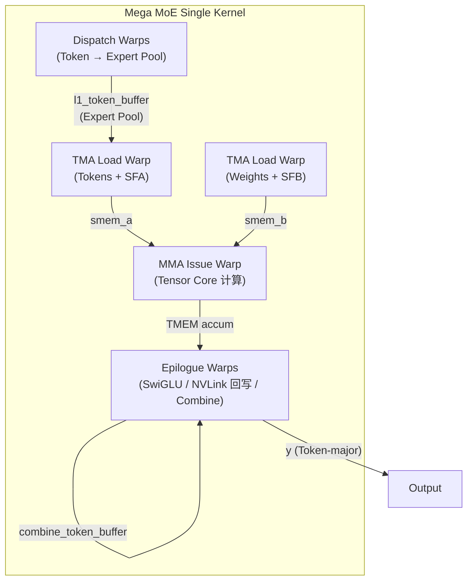
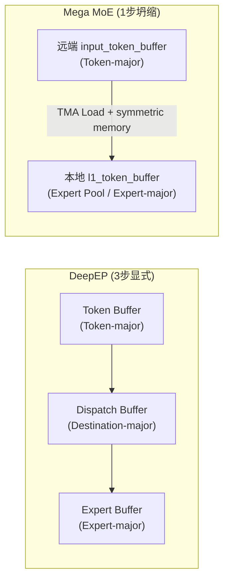
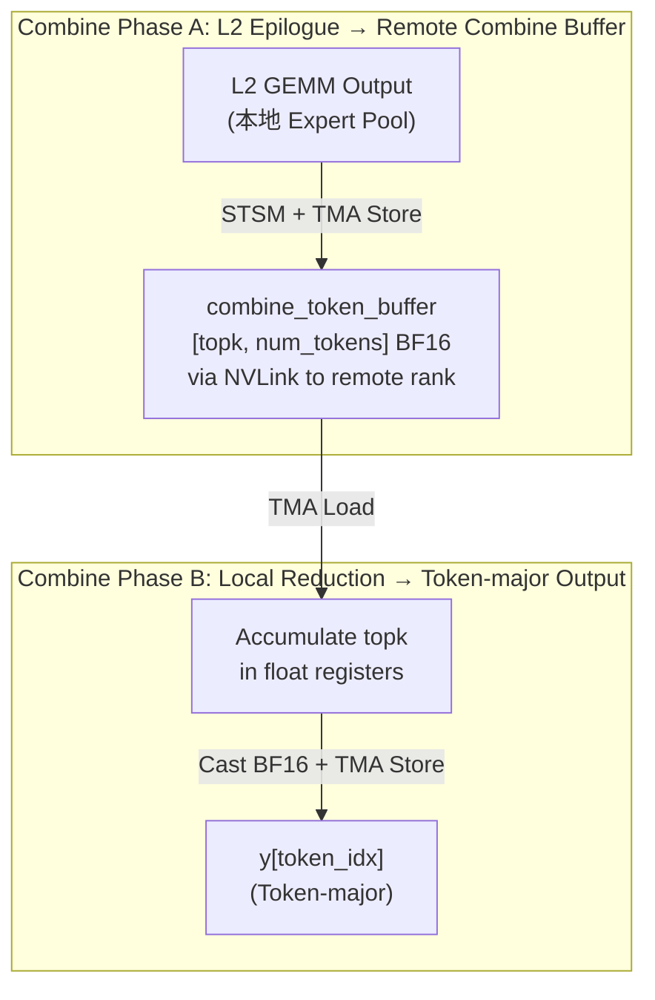
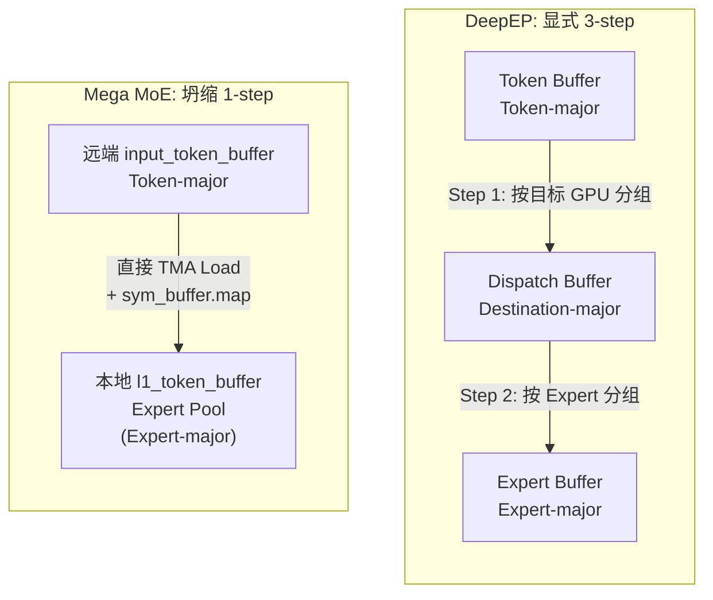
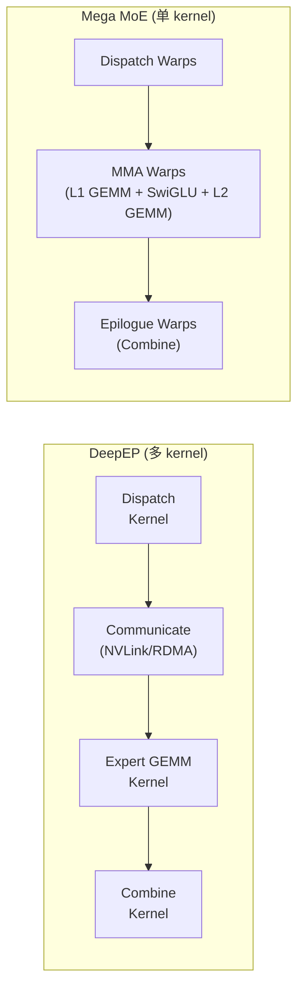

# Dispatch/Combine 在 DeepGEMM Mega MoE 内核中的实现与融合

## 概述

> *"Every MoE Layer must perform a dynamic data layout transformation."*
> —— 《Understanding GPU Microarchitecture from a Workload Perspective (3): DeepEP's First Principles》§1

DeepEP 将 MoE 的数据运动分解为 Dispatch（Token-major → Destination-major → Expert-major）与 Combine（Expert-major → Destination-major → Token-major）两个显式阶段。DeepGEMM 的 Mega MoE 内核在 Blackwell SM100 上将这两者**全部融合进单个 GPU Kernel**，借助 symmetric memory（NVLink）消除显式通信缓冲区，将"动态布局变换"转化为"直接远程读取 + 本地池化写入"。

本文逐行追踪 Mega MoE 内核中 Dispatch/Combine 的实现位置、数据流拓扑、以及博客所述 3-step 变换被"坍缩"的方式。

---

## 1. 博客概念回顾：Dispatch / Combine 三步变换

博客 §1.1 给出的抽象模型：

```
Router 输出:  Token → Expert  (topk_idx, topk_weights)

Dispatch:      Token-major → Destination-major → Expert-major
Combine:       Expert-major → Destination-major → Token-major
```

其中三个角色的 layout 需求：
| 角色 | 期望 Layout |
|------|-------------|
| Communication | Destination-major（按目标 GPU 组织） |
| Expert GEMM | Expert-major（连续的 [M, K] 矩阵） |
| Next Layer | Token-major（按 Token 组织） |

博客强调：*"This is not simple communication — it is a **dynamic data layout transformation**."*

---

## 2. Mega MoE 内核整体架构：三组 Warp Role

Mega MoE 将线程分为三组截然不同的 Warp 角色，在一个 kernel 内完成全部工作：

```cpp
// sm100_fp8_fp4_mega_moe.cuh:356-360
if (warp_idx < kNumDispatchWarps) {
    // Dispatch warps: 负责 Token 拉取与布局变换
} else if (warp_idx == kNumDispatchWarps) {
    // GEMM TMA load warp (tokens + SFA)
} else if (warp_idx == kNumDispatchWarps + 1) {
    // GEMM TMA load warp (weights + SFB)
} else if (warp_idx == kNumDispatchWarps + 2) {
    // GEMM MMA issue warp
} else if (warp_idx >= kNumDispatchWarps + kNumMMANonEpilogueWarps) {
    // Epilogue warps: 负责 GEMM 后处理 + Combine
}
```



---

## 3. Dispatch 在哪里？——融合进 Dispatch Warps

### 3.1 结论：Dispatch 不是独立步骤，而是 kernel 内的前半段

在 DeepEP 中，Dispatch 是一个独立的通信 kernel，显式产出 Dispatch Buffer（Destination-major）和 Expert Buffer（Expert-major）。

在 Mega MoE 中，**Dispatch 被坍缩为 kernel 内 Dispatch Warps 的一段协作逻辑**：

```cpp
// sm100_fp8_fp4_mega_moe.cuh:356-649
if (warp_idx < kNumDispatchWarps) {
    cutlass::arch::warpgroup_reg_dealloc<kNumDispatchRegisters>();

    // 1. 读取 topk_idx，按 expert 计数
    read_topk_idx([&](const uint32_t& token_topk_idx, const int& expert_idx) {
       atomicAdd_block(smem_expert_count + expert_idx, 1);
    });

    // 2. 全局 offset 分配 (atomicAdd on workspace)
    // ... ptx::atomic_add(workspace.get_expert_send_count_ptr(i), send_value)

    // 3. 将 src_token_topk_idx 写入远端 rank 的 workspace (NVLink)
    read_topk_idx([&](const uint32_t& token_topk_idx, const int& expert_idx) {
        const auto dst_rank_idx = expert_idx / kNumExpertsPerRank;
        const auto dst_slot_idx = atomicAdd_block(smem_expert_count + expert_idx, 1);
        const auto dst_ptr = workspace.get_src_token_topk_idx_ptr(
            expert_idx % kNumExpertsPerRank, sym_buffer.rank_idx, dst_slot_idx);
        *sym_buffer.map(dst_ptr, dst_rank_idx) = token_topk_idx;  // 远端写入！
    });

    // 4. Grid sync + NVLink barrier (跨 rank 同步)

    // 5. Pull token data: 从远端 rank 的 input_token_buffer 读到本地 l1_token_buffer
    ptx::tma_load_1d(
        pull_buffer.get_base_ptr(),
        sym_buffer.map(input_token_buffer.get_data_buffer(src_token_idx).get_base_ptr(),
                       current_rank_in_expert_idx),  // 远端地址
        pull_mbarrier, kHidden);

    // 6. 存储 topk_weights 与 src_metadata (供 Combine 使用)
    *workspace.get_token_src_metadata_ptr(pool_token_idx) =
        {current_rank_in_expert_idx, src_token_idx, src_topk_idx};
}
```

### 3.2 Dispatch 的数据流（坍缩版本）

博客的 3-step 变换在 Mega MoE 中被**坍缩为 1 步**：



**关键洞察**：Mega MoE 完全**跳过了 Destination-major 中间缓冲区**。Dispatch Warps 直接从远端 rank 的 Token-major buffer（`input_token_buffer`）通过 NVLink TMA load 写入本地按 Expert 分块的 pool buffer（`l1_token_buffer`）。"Destination" 信息被编码在：
- 远端 rank 选择：`sym_buffer.map(ptr, dst_rank_idx)`
- 本地 Expert 池偏移：`expert_pool_block_offset * BLOCK_M + token_idx_in_expert`

---

## 4. Token → Expert → Destination 变换的具体实现

### 4.1 topk_idx 的双重作用

`topk_idx` 是 Router 输出的 Token→Expert 映射，在 Mega MoE 中被两个阶段消费：

**Dispatch 阶段**（决定 Token 从哪来）：
```cpp
// sm100_fp8_fp4_mega_moe.cuh:372-376
expert_idx = static_cast<int>(
    __ldg(input_topk_idx_buffer.get_base_ptr<int64_t>() + i * kNumTopk + lane_idx));
if (expert_idx >= 0)
    process(i * kNumTopk + lane_idx, expert_idx);
```

**Combine 阶段**（决定结果写回哪）：
```cpp
// sm100_fp8_fp4_mega_moe.cuh:1183-1187
const auto src_metadata = *workspace.get_token_src_metadata_ptr(m_idx + m_idx_in_block);
const uint32_t dst_rank_idx = src_metadata.rank_idx;
const uint32_t dst_token_idx = src_metadata.token_idx;
const uint32_t dst_topk_idx = src_metadata.topk_idx;
```

### 4.2 topk_weights 的作用

`topk_weights` 在 L1 epilogue 中被用于**加权 SwiGLU 输出**：

```cpp
// sm100_fp8_fp4_mega_moe.cuh:984-1011
// Apply SwiGLU: silu(gate) * up
gate = __fmul2_rn(gate, {math::fast_rcp(denom.x), math::fast_rcp(denom.y)});
const auto up = __bfloat1622float2(bf16_up);
swiglu_values[i * 2 + k] = __fmul2_rn(__fmul2_rn(gate, up), weights);
//                                                              ^^^^^^
//                                            来自 topk_weights 的 gate weight
```

这对应博客 §1.2 中的语义恢复：
> *"Output(T0) = 0.73 × Expert2(T0) + 0.27 × Expert7(T0)"*

在 Mega MoE 中，这个权重被**提前应用到 L1 输出**（per-expert 加权），而 L2 输出到 combine buffer 时是 BF16 无权重，最终 Combine 只做 topk 累加。

---

## 5. Combine 在哪里？——融合进 Epilogue Warps

### 5.1 Combine 的两阶段实现

**阶段 A：L2 Epilogue 将结果写入远端 combine buffer**

```cpp
// sm100_fp8_fp4_mega_moe.cuh:1196-1202
const auto dst_token = combine_token_buffer.get_rank_buffer(dst_topk_idx)
                       .get_data_buffer(token_idx);
const auto dst_ptr = math::advance_ptr<float4>(...);
*sym_buffer.map(dst_ptr, dst_rank_idx) = packed;  // NVLink 写入远端
```

**阶段 B：本地 Combine 累加 + 写回 Token-major 输出**

```cpp
// sm100_fp8_fp4_mega_moe.cuh:1226-1356
// Combine: reduce top-k results and write back
for (uint32_t token_idx = sm_idx * kNumEpilogueWarps + epilogue_warp_idx;
     token_idx < num_tokens;
     token_idx += kNumSMs * kNumEpilogueWarps) {
    // 读取 topk_idx 确定该 token 有几个 expert 贡献
    const int stored_topk_slot_idx = lane_idx < kNumTopk ?
        static_cast<int>(__ldg(input_topk_idx_buffer.get_base_ptr<int64_t>()
                               + token_idx * kNumTopk + lane_idx)) : -1;

    // 遍历 topk，从 combine_token_buffer[slot_idx] 加载并累加
    for (uint32_t chunk = 0; chunk < kNumChunks; ++ chunk) {
        float2 reduced[kNumUint4PerLane * kNumElemsPerUint4] = {};
        while (do_reduce) {
            // Prefetch next top-k
            do_reduce = move_mask_and_load(load_stage_idx ^ 1);
            // Accumulate
            for (uint32_t j = 0; j < kNumUint4PerLane; ++ j)
                ptx::accumulate(reduced[j * kNumElemsPerUint4 + l], bf16_values[l]);
        }
        // Cast to BF16, TMA store 到 y[token_idx] (Token-major)
        ptx::tma_store_1d(
            math::advance_ptr(y, static_cast<uint64_t>(token_idx) * kNumHiddenBytes + ...),
            combine_store_buffer, kNumChunkBytes);
    }
}
```

### 5.2 Combine 数据流



---

## 6. Symmetric Memory 如何替代显式通信

### 6.1 核心机制

```cpp
// sym_buffer.cuh:34-37
template <typename ptr_t>
CUTLASS_DEVICE ptr_t map(const ptr_t& ptr, const uint32_t& dst_rank_idx) const {
    int64_t mapped_ptr = offsets[dst_rank_idx] + reinterpret_cast<int64_t>(ptr);
    return *reinterpret_cast<ptr_t*>(&mapped_ptr);
}
```

每个 GPU 持有一份 symmetric buffer，通过 `sym_buffer.map(ptr, dst_rank_idx)` 将本地指针映射到远端 rank 的 NVLink 可访问地址。

### 6.2 对比 DeepEP 的通信模型

| 维度 | DeepEP | Mega MoE |
|------|--------|----------|
| 通信缓冲区 | Dispatch Buffer / Receive Buffer / Expert Buffer | 无独立缓冲区 |
| 通信原语 | 显式 all-to-All / RDMA | `sym_buffer.map()` + TMA load/store |
| 同步 | FIFO + Barrier | NVLink barrier (`nvlink_barrier`) |
| 数据粒度 | Chunk（聚合后发送） | 单 Token TMA load |

博客 §4.3 描述的 *"GPU-centric communication fabric: NVLink + RDMA + GPU SM together form the data path"* 在 Mega MoE 中被推向极致：**SM 直接执行 TMA 指令访问远端显存**，无需独立通信 kernel。

### 6.3 三次 NVLink 同步点

```cpp
// sm100_fp8_fp4_mega_moe.cuh:430-436
comm::nvlink_barrier<kNumRanks, kNumSMs, kNumDispatchThreads,
                     kDispatchGridSyncIndex, kBeforeDispatchPullBarrierTag>(...);

// sm100_fp8_fp4_mega_moe.cuh:643-649
comm::nvlink_barrier<kNumRanks, kNumSMs, kNumDispatchThreads,
                     kDispatchGridSyncIndex, kAfterWorkspaceCleanBarrierTag>(...);

// sm100_fp8_fp4_mega_moe.cuh:1217-1221
comm::nvlink_barrier<kNumRanks, kNumSMs, kNumEpilogueThreads,
                     kEpilogueGridSyncIndex, kBeforeCombineReduceBarrierTag>(...);
```

对应三个阶段的跨 rank 同步：
1. **kBeforeDispatchPullBarrierTag**：确保所有 rank 写完 src_token_topk_idx 后再开始 pull
2. **kAfterWorkspaceCleanBarrierTag**：确保 workspace 清理完成后再进入 epilogue
3. **kBeforeCombineReduceBarrierTag**：确保所有 rank 写完 combine buffer 后再开始 reduce

---

## 7. 博客 3-step 变换的坍缩分析

### 7.1 变换路径对比



### 7.2 为什么可以坍缩？

1. **Symmetric memory 消除了"Destination"的物理边界**：远端 Token buffer 可通过 NVLink 直接访问，无需先搬到本地
2. **TMA 硬件支持 2D 跨步加载**：可以直接从远端 Token-major buffer 按 `src_token_idx` 索引加载，无需中间转置
3. **Expert Pool 布局天然是 Expert-major**：`l1_token_buffer` 按 `[num_max_pool_tokens, hidden]` 组织，每个 Expert 占据连续的 `ceil_div(num_tokens, BLOCK_M) * BLOCK_M` 个 slot

### 7.3 坍缩后的代价转移

| 被消除的 | 新增的 |
|---------|--------|
| Dispatch Buffer 分配 | Workspace 元数据（expert count, src_token_topk_idx） |
| Destination-major 中间布局 | `sym_buffer.map()` 地址计算 |
| 显式通信 kernel 启动开销 | NVLink barrier 同步 |
| 多次 HBM 读写 | TMA 直传（远端 HBM → 本地 SMEM） |

---

## 8. 什么被融合了？Mega MoE vs DeepEP 对比

### 8.1 融合全景图



### 8.2 详细功能对照

| 功能 | DeepEP | Mega MoE |
|------|--------|----------|
| Token → Expert 映射 | Dispatch kernel 显式排序 | Dispatch Warps 直接 pull |
| 跨节点通信 | RDMA all-to-All | `sym_buffer.map()` TMA |
| Expert GEMM | 独立 GEMM kernel | MMA Warps 内联 |
| 激活函数 | 独立 SwiGLU kernel | L1 Epilogue 内联 |
| Expert → Token 恢复 | Combine kernel 显式 reduce | Epilogue Warps 内联 |
| 通信-计算重叠 | Chunk 流水线 | Warp 角色间 barrier 同步 |

### 8.3 关键代码位置索引

| 博客概念 | Mega MoE 代码位置 | 说明 |
|---------|------------------|------|
| Token-major input | `input_token_buffer` (line 107-110) | FP8, `[num_max_tokens_per_rank, hidden]` |
| topk_idx 读取 | `read_topk_idx` lambda (line 363-380) | Dispatch Warps 消费 |
| Expert 计数 | `atomicAdd_block(smem_expert_count + expert_idx, 1)` (line 384) | Counting sort 的 count 阶段 |
| 全局 offset | `ptx::atomic_add(workspace.get_expert_send_count_ptr(i), ...)` (line 393) | Prefix sum + scatter |
| 远端写入 | `*sym_buffer.map(dst_ptr, dst_rank_idx) = token_topk_idx` (line 403) | NVLink 直接写入 |
| Token pull | `ptx::tma_load_1d(pull_buffer, sym_buffer.map(...), ...)` (line 546-550) | 远端 Token → 本地 SMEM |
| Expert Pool 存储 | `ptx::tma_store_1d(l1_token_buffer.get_data_buffer(pool_token_idx), ...)` (line 585-587) | SMEM → 本地 Expert Pool |
| L1 GEMM | `ptx::SM100_MMA_MXF8F6F4_2x1SM_SS::fma(...)` (line 853-856) | Tensor Core |
| SwiGLU | `swiglu_values[i * 2 + k] = __fmul2_rn(__fmul2_rn(gate, up), weights)` (line 1011) | L1 Epilogue |
| L2 GEMM | 同上 MMA issue (line 820-864) | 第二层 GEMM |
| Combine buffer 写入 | `*sym_buffer.map(dst_ptr, dst_rank_idx) = packed` (line 1202) | NVLink 回写 |
| Combine reduce | `ptx::accumulate(reduced[...], bf16_values[l])` (line 1321) | topk 累加 |
| Token-major 输出 | `ptx::tma_store_1d(math::advance_ptr(y, token_idx * kNumHiddenBytes), ...)` (line 1349-1350) | 最终输出 |

---

## 9. 核心结论

### 9.1 Dispatch/Combine 的命运

> *"Dispatch performs: Token-major → Destination-major → Expert-major"*

在 Mega MoE 中，这个 3-step 变换被**坍缩为 1 步**：
- **Token-major → Expert-major**：通过 `sym_buffer.map()` 直接远端 Token 读取 + 本地 Expert Pool 写入
- **Destination-major 被完全消除**：不再存在按 GPU 分组的中间缓冲区，"Destination" 被编码在 NVLink 地址映射中

### 9.2 融合的本质

Mega MoE 的融合不是简单的"把多个 kernel 拼在一起"，而是**利用 symmetric memory 重新定义了数据所有权**：

1. **数据不再"移动"，而是"被访问"**：Token 留在原 rank 的 buffer 中，远端 SM 通过 TMA 直接读取
2. **布局变换不再"分步执行"，而是"即时计算"**：从 Token-major 到 Expert-major 的映射在 Dispatch Warps 的寄存器中完成
3. **通信不再"独立阶段"，而是"计算 kernel 的内存操作"**：NVLink barrier 替代了显式通信 kernel 的启动/同步

### 9.3 与博客论点的呼应

> *"DeepEP represents MoE systems' evolution from 'communication optimization' to 'dataflow execution.'"* (§10)

Mega MoE 延续并深化了这一演化：
- DeepEP：将通信优化为 **dataflow pipeline**（Chunk → FIFO → Warp Specialization）
- Mega MoE：将 dataflow 进一步融合为 **single-kernel dataflow execution**（symmetric memory + TMA + Warp Role）

博客 §9 的总结精准预见了这一方向：
> *"System trends are further fusing Communication + Compute. In DeepGEMM, Mega MoE Kernel targets Blackwell SM100, fusing: Token Routing → Dispatch → Linear1 → Activation → Linear2 → Combine"*

---

## 附录：关键数据结构布局

### A.1 Symmetric Buffer 布局（每个 rank 一份）

```
┌─────────────────────────────────────────────────────────────┐
│ Workspace (barrier, expert count, src_token_topk_idx, ...)  │
├─────────────────────────────────────────────────────────────┤
│ input_token_buffer    [num_max_tokens_per_rank, hidden]     │  ← Token-major (FP8)
├─────────────────────────────────────────────────────────────┤
│ input_sf_buffer       [num_max_tokens_per_rank, hidden/128] │
├─────────────────────────────────────────────────────────────┤
│ input_topk_idx        [num_max_tokens_per_rank, num_topk]   │
├─────────────────────────────────────────────────────────────┤
│ input_topk_weights    [num_max_tokens_per_rank, num_topk]   │
├─────────────────────────────────────────────────────────────┤
│ l1_token_buffer       [num_max_pool_tokens, hidden]         │  ← Expert Pool (FP8)
├─────────────────────────────────────────────────────────────┤
│ l1_sf_buffer          [num_padded_sf_pool_tokens, hidden/128│
├─────────────────────────────────────────────────────────────┤
│ l1_topk_weights       [num_max_pool_tokens, 1]              │
├─────────────────────────────────────────────────────────────┤
│ l2_token_buffer       [num_max_pool_tokens, intermediate]   │  ← L1 输出 / L2 输入
├─────────────────────────────────────────────────────────────┤
│ l2_sf_buffer          [num_padded_sf_pool_tokens, ...]      │
├─────────────────────────────────────────────────────────────┤
│ combine_token_buffer  [num_topk, num_max_tokens_per_rank]   │  ← Combine 中间结果 (BF16)
└─────────────────────────────────────────────────────────────┘
```

### A.2 Expert Pool 内部布局

```
l1_token_buffer (Expert-major pool):
┌──────────────────────────────────────────┐
│ Expert 0: token_0, token_1, ..., token_n │  ← pool_block_offset = 0
│ Expert 1: token_0, token_1, ..., token_m │  ← pool_block_offset = ceil_div(n, BLOCK_M)
│ Expert 2: ...                            │
│ ...                                      │
└──────────────────────────────────────────┘
每个 Expert 的 slot 数对齐到 BLOCK_M（padding 用于 TMA 对齐）
```

---

*分析基于 DeepGEMM 源码（commit 待确认）与博客《Understanding GPU Microarchitecture from a Workload Perspective (3): DeepEP's First Principles》*
