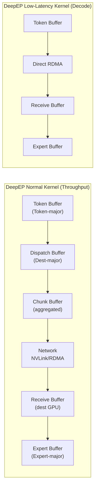
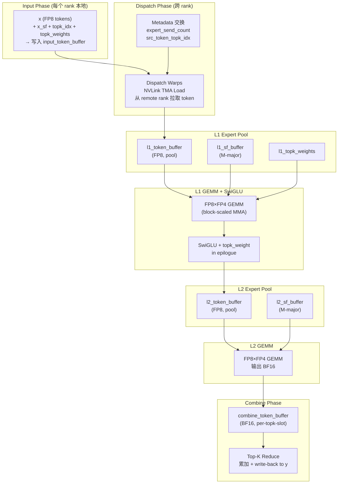
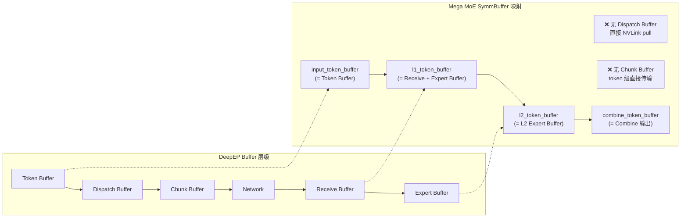

# DeepEP Buffer System 与 DeepGEMM SymmBuffer 映射分析

> 分析日期: 2026-07-30
> 目标: 将 DeepEP 博客描述的 Buffer System 映射到 DeepGEMM SymmBuffer 的具体实现

---

## 1. SymmBuffer 内部布局

### 1.1 内存分段总览

SymmBuffer 是一个**单一大块对称内存**（`symm_mem.empty(num_bytes, dtype=torch.int8, device='cuda')`），内部按功能划分为多个逻辑段。从 `csrc/apis/mega.hpp` 的 `get_symm_buffer_size_for_mega_moe` 函数可以看到完整布局：

```
SymmBuffer 内存布局 (从低地址到高地址):
┌─────────────────────────────────────────────────────────────┐
│  Workspace (元数据区)                                         │
│  ├─ Grid Sync Counters (32 bytes)                            │
│  ├─ Expert Send Count (num_experts × 8 bytes)                │
│  ├─ Expert Recv Count (num_ranks × num_experts_per_rank × 8) │
│  ├─ Expert Recv Count Sum (num_experts_per_rank × 8)         │
│  ├─ L1 Arrival Count (num_max_pool_blocks × 4)               │
│  ├─ L2 Arrival Mask (num_max_pool_blocks × 8)                │
│  ├─ Src Token-Topk Idx (dispatch pulling 用)                  │
│  └─ Token Src Metadata (combine write-back 用)                │
├─────────────────────────────────────────────────────────────┤
│  Input Token Buffer (FP8)                                     │
│  shape: [num_max_tokens_per_rank, hidden]                    │
├─────────────────────────────────────────────────────────────┤
│  Input SF Buffer (K-major, per-32 UE8M0)                      │
│  shape: [num_max_tokens_per_rank, hidden/128]                │
├─────────────────────────────────────────────────────────────┤
│  Input TopK Idx Buffer (int64)                               │
│  shape: [num_max_tokens_per_rank, num_topk]                  │
├─────────────────────────────────────────────────────────────┤
│  Input TopK Weights Buffer (float32)                         │
│  shape: [num_max_tokens_per_rank, num_topk]                  │
├─────────────────────────────────────────────────────────────┤
│  L1 Token Buffer (FP8, pool)                                  │
│  shape: [num_max_pool_tokens, hidden]                        │
├─────────────────────────────────────────────────────────────┤
│  L1 SF Buffer (M-major, UTCCP 128-aligned)                    │
│  shape: [num_padded_sf_pool_tokens, hidden/128]              │
├─────────────────────────────────────────────────────────────┤
│  L1 TopK Weights Buffer (per-pool-token)                      │
│  shape: [num_max_pool_tokens, 1]                             │
├─────────────────────────────────────────────────────────────┤
│  L2 Token Buffer (FP8, pool)                                  │
│  shape: [num_max_pool_tokens, intermediate_hidden]           │
├─────────────────────────────────────────────────────────────┤
│  L2 SF Buffer (M-major, UTCCP 128-aligned)                    │
│  shape: [num_padded_sf_pool_tokens, intermediate_hidden/128] │
├─────────────────────────────────────────────────────────────┤
│  Combine Token Buffer (BF16)                                  │
│  shape: [num_topk, num_max_tokens_per_rank, hidden]          │
└─────────────────────────────────────────────────────────────┘
```

### 1.2 代码证据：Buffer 分配

```cpp
// csrc/apis/mega.hpp: get_symm_buffer_size_for_mega_moe

// Workspace: barriers, counts, metadata
const auto workspace = layout::Workspace(nullptr, num_ranks, num_experts,
                                          num_max_tokens_per_rank, num_topk, block_m);

// Input buffers (Token Buffer 等价物)
const auto input_token_buffer = layout::Buffer(
    fp8_token_layout, 1, num_max_tokens_per_rank, workspace.get_end_ptr());
const auto input_sf_buffer = layout::Buffer(
    fp8_sf_layout, 1, num_max_tokens_per_rank, input_token_buffer.get_end_ptr());
const auto input_topk_idx_buffer = layout::Buffer(
    input_topk_idx_layout, 1, num_max_tokens_per_rank, input_sf_buffer.get_end_ptr());
const auto input_topk_weights_buffer = layout::Buffer(
    input_topk_weights_layout, 1, num_max_tokens_per_rank, input_topk_idx_buffer.get_end_ptr());

// L1 pool: 所有本地 expert 共享的 token pool
const auto l1_token_buffer = layout::Buffer(
    fp8_token_layout, 1, num_max_pool_tokens, input_topk_weights_buffer.get_end_ptr());
const auto l1_sf_buffer = layout::Buffer(
    fp8_sf_layout, 1, num_padded_sf_pool_tokens, l1_token_buffer.get_end_ptr());

// L2 pool: L1 输出 → L2 输入
const auto l2_token_buffer = layout::Buffer(
    fp8_intermediate_token_layout, 1, num_max_pool_tokens, l1_topk_weights_buffer.get_end_ptr());
const auto l2_sf_buffer = layout::Buffer(
    fp8_intermediate_sf_layout, 1, num_padded_sf_pool_tokens, l2_token_buffer.get_end_ptr());

// Combine buffer: BF16, 用于跨 rank 写回
const auto combine_token_buffer = layout::Buffer(
    bf16_token_layout, num_topk, num_max_tokens_per_rank, l2_sf_buffer.get_end_ptr());
```

### 1.3 Python 侧 View 映射

```python
# deep_gemm/mega/__init__.py
(self.x, self.x_sf,
 self.topk_idx, self.topk_weights,
 self.l1_acts, self.l1_acts_sf,
 self.l2_acts, self.l2_acts_sf) = slice_input_buffers(self.buffer)
```

注意：Python 侧只暴露了 8 个 view，**Combine Buffer 和 Workspace 不暴露给 Python**，仅供 kernel 内部使用。

---

## 2. SymmBuffer 段 → DeepEP Buffer 层映射

### 2.1 映射关系

| DeepEP Buffer 层 | SymmBuffer 对应段 | 说明 |
|---|---|---|
| **Token Buffer** | `input_token_buffer` + `input_sf_buffer` + `input_topk_idx_buffer` + `input_topk_weights_buffer` | Router 输出，Token-major 布局 |
| **Dispatch Buffer** | ❌ 无独立对应 | Mega MoE 没有显式的 Dispatch Buffer |
| **Chunk Buffer** | ❌ 无独立对应 | Mega MoE 没有显式的 Chunk 聚合 |
| **Receive Buffer** | `l1_token_buffer` / `l2_token_buffer` (pool) | 每个 rank 的 L1/L2 pool 即为 receive 目标 |
| **Expert Buffer (L1)** | `l1_token_buffer` + `l1_sf_buffer` + `l1_topk_weights_buffer` | Expert GEMM L1 输入 |
| **Expert Buffer (L2)** | `l2_token_buffer` + `l2_sf_buffer` | Expert GEMM L2 输入 |
| **Combine Buffer** | `combine_token_buffer` (BF16) | L2 输出写回 + top-k reduce |

### 2.2 关键差异：Dispatch/Chunk Buffer 的消失

DeepEP 的 **Normal Kernel** 有完整的 5 层 buffer：
```
Token → Dispatch → Chunk → Network → Receive → Expert
```

Mega MoE 的 buffer 层级：
```
Token(input) → [NVLink pull] → L1 pool → L1 GEMM+SwiGLU → L2 pool → L2 GEMM → Combine buffer → [NVLink write-back] → output
```

**核心洞察**: Mega MoE 通过 **symmetric memory + dispatch warp 直接 pull** 消除了显式的 Dispatch Buffer 和 Chunk Buffer。数据从 remote rank 的 `input_token_buffer` 直接通过 NVLink TMA load 拉到 local rank 的 `l1_token_buffer`，无需中间暂存。

---

## 3. Symmetric Memory 工作机制

### 3.1 什么是 Symmetric Memory

Symmetric Memory 是 PyTorch 2.x 引入的跨 rank 共享内存机制 (`torch.distributed._symmetric_memory`)。

```python
# deep_gemm/mega/__init__.py
import torch.distributed._symmetric_memory as symm_mem

# 1. 每个 rank 分配相同大小的 buffer
self.buffer = symm_mem.empty(num_bytes, dtype=torch.int8, device='cuda')

# 2. 通过 rendezvous 注册到进程组，获取所有 rank 的地址
self.handle = symm_mem.rendezvous(self.buffer, group=group)

# 3. 获取所有 rank 的 buffer 地址列表
sym_buffer.handle.buffer_ptrs  # List[int64], 长度 = num_ranks
```

### 3.2 SymBuffer 结构：地址映射核心

```cpp
// deep_gemm/include/deep_gemm/layout/sym_buffer.cuh
template <uint32_t kNumRanks = 72>
struct SymBuffer {
    int64_t base;                    // 本地 buffer 基地址
    int64_t offsets[kNumMaxRanks];   // 各 rank 相对于本地的偏移
    uint32_t rank_idx;               // 当前 rank 编号

    // 核心操作：将本地指针映射到目标 rank 的地址空间
    template <typename ptr_t>
    CUTLASS_DEVICE ptr_t map(const ptr_t& ptr, const uint32_t& dst_rank_idx) const {
        int64_t mapped_ptr = offsets[dst_rank_idx] + reinterpret_cast<int64_t>(ptr);
        return *reinterpret_cast<ptr_t*>(&mapped_ptr);
    }
};
```

**`map` 操作的本质**：同一个指针（如 `input_token_buffer` 中的某个地址）在不同 rank 的 symmetric memory 中指向**逻辑上对应的位置**。通过 `map(ptr, dst_rank)`，当前 rank 可以直接访问 dst_rank 的 buffer 中相同偏移处的数据。

### 3.3 为什么叫 "Symmetric"

"Symmetric" 的含义是**对称性**：

1. **大小对称**: 每个 rank 分配**完全相同大小**的 buffer
2. **布局对称**: 每个 rank 内部的 segment 布局**完全相同**
3. **访问对称**: 任何 rank 都可以通过相同的 offset 访问其他 rank 的对应位置

```
Rank 0 的 SymmBuffer          Rank 1 的 SymmBuffer
┌──────────────────┐          ┌──────────────────┐
│ Workspace        │          │ Workspace        │
├──────────────────┤          ├──────────────────┤
│ Input Token Buf  │◄────────►│ Input Token Buf  │  ← 相同 offset 访问
├──────────────────┤  NVLink  ├──────────────────┤
│ L1 Token Pool    │          │ L1 Token Pool    │
├──────────────────┤          ├──────────────────┤
│ L2 Token Pool    │          │ L2 Token Pool    │
├──────────────────┤          ├──────────────────┤
│ Combine Buf      │◄────────►│ Combine Buf      │
└──────────────────┘          └──────────────────┘
```

### 3.4 Cross-Rank Shared Memory 的含义

Cross-rank shared memory 不是真正的共享内存（物理上各 rank 的 GPU 显存独立），而是通过 **NVLink P2P 访问**实现的**逻辑共享**：

```cpp
// kernel 中跨 rank 读取 remote token 的示例
// sm100_fp8_fp4_mega_moe.cuh: 546-550
ptx::tma_load_1d(
    pull_buffer.get_base_ptr(),  // 本地 smem 目标
    sym_buffer.map(input_token_buffer.get_data_buffer(src_token_idx).get_base_ptr(),
                   current_rank_in_expert),  // 远程 rank 的 token 地址
    pull_mbarrier, kHidden);
```

这里 `sym_buffer.map(...)` 将本地 `input_token_buffer` 的指针映射到 `current_rank_in_expert` 的地址空间，然后通过 TMA (Tensor Memory Accelerator) 执行 NVLink 远程加载。

---

## 4. Token→Chunk→Network 聚合的处理

### 4.1 DeepEP 的做法

DeepEP Normal Kernel 显式聚合：
```
Token Stream → Chunk (多个 token 聚合) → NVLink/RDMA 传输
```
- Token = scheduling granularity
- Chunk = communication granularity
- 目的: 减少小数据包开销，提高带宽利用率

### 4.2 Mega MoE 的做法：无显式 Chunk

Mega Mo E **没有显式的 Chunk Buffer**。它的 dispatch 策略是：

```cpp
// sm100_fp8_fp4_mega_moe.cuh: 457-600
// Dispatch warps 按全局 token 索引轮转处理
for (uint32_t token_idx = sm_idx * kNumDispatchWarps + warp_idx; ; token_idx += kNumGlobalWarps) {
    // 1. 确定该 token 属于哪个 expert、来自哪个 rank
    // 2. 从 remote rank 的 input_token_buffer 直接 TMA load 到本地 smem
    // 3. 从 smem TMA store 到本地 l1_token_buffer (pool)
    // 4. 同时搬运 SF 和 topk_weights
    // 5. 写 arrival count 通知 epilogue
}
```

**关键区别**：
- DeepEP: Token 先聚合到 Chunk，然后 Chunk 整体发送
- Mega MoE: 每个 token 独立通过 NVLink pull，无聚合

### 4.3 为什么 Mega Mo E 不需要 Chunk

1. **Decode 场景为主**: Mega Mo E 面向 Blackwell SM100，主要优化 decode（小 batch），与 DeepEP Low-Latency Kernel 类似
2. **NVLink 带宽充足**: 节点内 NVLink 带宽极高（~900 GB/s），小数据包开销相对可接受
3. **Compute-Communication 融合**: 通过 persistent kernel + warp specialization，dispatch 和 GEMM 重叠执行，chunk 聚合的收益降低
4. **对称内存的直接访问**: symmetric memory 使得 remote access 像本地一样自然，无需显式 "发送-接收" 模型

---

## 5. Normal / Low-Latency Buffer 路径

### 5.1 Mega Mo E 的答案：单一路径

**Mega Mo E 没有独立的 Normal / Low-Latency buffer 路径**。它只有一套统一的 buffer 布局。

但从行为上看，Mega Mo E 更接近 DeepEP 的 **Low-Latency Kernel**：
- 无 Chunk 聚合
- 直接 NVLink pull（类似 Direct RDMA）
- Token 级粒度调度

### 5.2 代码证据

```python
# deep_gemm/mega/__init__.py
# 只有一个 SymmBuffer 类，没有 Normal/LowLatency 变体
class SymmBuffer:
    def __init__(self, group, num_experts,
                 num_max_tokens_per_rank, num_topk,
                 hidden, intermediate_hidden,
                 use_fp8_dispatch=True, activation='swiglu'):
        # 统一分配，无路径选择
```

```cpp
// csrc/apis/mega.hpp
// 只有一个 fp8_fp4_mega_moe 入口
static void fp8_fp4_mega_moe(...) {
    // 直接调用 sm100_fp8_fp4_mega_moe
    // 无 if (is_normal_kernel) 分支
}
```

---

## 6. Buffer 尺寸计算

### 6.1 关键参数

| 参数 | 含义 | 控制什么 |
|---|---|---|
| `num_max_tokens_per_rank` | 每个 rank 最大 token 数 | Input Token Buffer 和 Combine Buffer 的第一维 |
| `num_topk` | 每个 token 选择的 expert 数 | TopK Idx/Weights 的宽度，Combine Buffer 的 topk 维 |
| `hidden` | 模型隐藏维度 | Token 的 K 维度 |
| `intermediate_hidden` | FFN 中间维度 | L2 Token 的 K 维度 |
| `num_experts` | 全局 expert 总数 | Workspace 中 count 数组大小 |
| `num_ranks` | 进程数 | 影响 pool 容量计算 |

### 6.2 Pool 容量计算

```cpp
// deep_gemm/include/deep_gemm/layout/mega_moe.cuh
template <typename T>
CUTLASS_HOST_DEVICE constexpr T get_num_max_pool_tokens(
    T num_ranks, T num_max_tokens_per_rank, T num_topk,
    T num_experts_per_rank, T block_m) {
    // 最坏情况: 所有 rank 的所有 token 都路由到本地 expert
    const auto num_max_recv_tokens = num_ranks * num_max_tokens_per_rank;
    const auto num_max_experts_per_token = math::constexpr_min(num_topk, num_experts_per_rank);
    return math::constexpr_align(
        num_max_recv_tokens * num_max_experts_per_token + num_experts_per_rank * (block_m - 1),
        block_m);
}
```

**直觉理解**：
- 每个 rank 最多发 `num_max_tokens_per_rank` 个 token
- 每个 token 选 `num_topk` 个 expert
- 最坏情况所有 token 都选本地的 `num_experts_per_rank` 个 expert 之一
- 所以本地 pool 需要容纳 `num_ranks × num_max_tokens_per_rank × min(num_topk, num_experts_per_rank)` 个 token
- 再加上 per-expert 的 BLOCK_M 对齐 padding

### 6.3 SF Pool 容量

```cpp
template <typename T>
CUTLASS_HOST_DEVICE constexpr T get_num_padded_sf_pool_tokens(T num_max_pool_tokens, T block_m) {
    return (num_max_pool_tokens / block_m) * math::constexpr_align(block_m, 128);
}
```

SF 需要 128-aligned（UTCCP 硬件要求），所以每个 pool block 的 SF 需要 padding 到 128。

### 6.4 数值示例

以 test_mega_moe.py 默认参数为例：
- `num_max_tokens_per_rank = 8192`
- `num_topk = 6`
- `num_experts = 384`, `num_ranks = 8` → `num_experts_per_rank = 48`
- `hidden = 7168`, `intermediate_hidden = 3072`
- `block_m = 192`

```
num_max_pool_tokens = align(8 × 8192 × min(6, 48) + 48 × 191, 192)
                    = align(393,216 + 9,168, 192)
                    = 393,408 (约 384K tokens)

num_padded_sf_pool_tokens = (393,408 / 192) × align(192, 128)
                          = 2,049 × 256
                          = 524,544

Buffer 总大小 ≈ Workspace + Input(8192×7168 + ...) + L1 pool(393408×7168 + ...) + L2 pool + Combine
            ≈ 数十 GiB 级别
```

---

## 7. transform_weights_for_mega_moe 的作用

### 7.1 功能

```python
# deep_gemm/mega/__init__.py
def transform_weights_for_mega_moe(l1_weights, l2_weights):
    # L1: interleave gate/up, 然后 transpose SF for UTCCP
    l1_interleaved = _interleave_l1_weights(l1_weights)
    l1_weights = (l1_interleaved[0], _transpose_sf_for_utccp(l1_interleaved[1]))
    # L2: 只 transpose SF for UTCCP
    l2_weights = (l2_weights[0], _transpose_sf_for_utccp(l2_weights[1]))
    return l1_weights, l2_weights
```

### 7.2 L1 权重 Interleave

```python
def _interleave_l1_weights(l1_weights):
    # 原始布局: [gate: 0..N/2 | up: 0..N/2] (SwiGLU 的 gate 和 up 分开)
    # 目标布局: [gate: 0..7, up: 0..7, gate: 8..15, up: 8..15, ...] (8 粒度交错)
```

**为什么需要 interleave**：
- SwiGLU 激活函数: `output = silu(gate) * up`
- Epilogue 中 TMEM load 以 8 为一组读取
- Interleave 使得 gate/up 对在内存中相邻，SwiGLU 可以高效执行

### 7.3 SF Transpose (UTCCP)

```python
def _transpose_sf_for_utccp(sf):
    # 将 SF 从 K-major 转为 MN-major (4x32 transpose)
    # 满足 SM100 UTCCP (Universal Tensor Memory Copy with Transpose) 的硬件要求
```

**为什么需要 transpose SF**：
- SM100 的 block-scaled MMA 使用 UTCCP 指令将 SF 从 smem 搬到 TMEM
- UTCCP 要求 SF 是 MN-major 布局（4×32 粒度）
- 原始 SF 是 K-major（per-32 elements along K）
- 需要 transpose 以匹配 UTCCP 的 4×32 数据搬运模式

### 7.4 代码中的使用

```python
# tests/test_mega_moe.py
l1_weights = cast_grouped_weights_to_fp4(l1_weights)
l2_weights = cast_grouped_weights_to_fp4(l2_weights)
transformed_l1_weights, transformed_l2_weights = deep_gemm.transform_weights_for_mega_moe(
    l1_weights, l2_weights
)
# transformed_* 直接传入 kernel
deep_gemm.fp8_fp4_mega_moe(y, transformed_l1_weights, transformed_l2_weights, buffer, ...)
```

---

## 8. 完整数据流图

### 8.1 DeepEP Buffer 层级 (Mermaid)



### 8.2 Mega MoE SymmBuffer 数据流 (Mermaid)



### 8.3 对比图：DeepEP vs Mega MoE (Mermaid)



---

## 9. 核心洞察总结

### 9.1 SymmBuffer 的本质

SymmBuffer 是一个**以 pool 为中心的融合 buffer 架构**：

1. **Input 区**：每个 rank 的本地 Router 输出（Token Buffer 等价物）
2. **Pool 区**：所有本地 expert 共享的 token pool（Receive + Expert Buffer 融合）
3. **Combine 区**：L2 输出暂存 + top-k reduce（Combine Buffer）
4. **Workspace**：同步原语 + metadata

### 9.2 与 DeepEP 的根本差异

| 维度 | DeepEP | Mega MoE (SymmBuffer) |
|---|---|---|
| **Buffer 层级** | 5 层 (Token→Dispatch→Chunk→Receive→Expert) | 3 层 (Input→Pool→Combine) |
| **Dispatch 方式** | 显式 Dispatch Kernel + 中间 buffer | Warp 直接 NVLink pull，无中间 buffer |
| **Chunk 聚合** | 有（Normal Kernel） | 无（token 级） |
| **Normal/LL 分离** | 两套 kernel + buffer | 单一套 buffer |
| **内存模型** | 普通显存 + 显式 send/recv | Symmetric Memory + 地址映射 |
| **通信语义** | Push 模型（source 主动发送） | Pull 模型（destination 主动拉取） |

### 9.3 为什么 Mega Mo E 可以消除 Dispatch/Chunk Buffer

1. **Symmetric Memory 的地址对称性**：任何 rank 可以直接访问任何其他 rank 的 buffer，无需 "打包-发送-解包"
2. **Persistent Kernel + Warp Specialization**：dispatch warps 和 GEMM warps 同时运行，dispatch 可以按需实时 pull
3. **NVLink 的全连接拓扑**：节点内所有 GPU 两两直连，pull 和 send 的延迟差异不大
4. **Decode 场景为主**：小 batch 下 chunk 聚合无收益，直接 token 级传输更优

### 9.4 Pull vs Push 的范式转变

```
DeepEP (Push):
  Source GPU: "我要发 token X 给 Dest GPU" → 写入 Dest 的 Receive Buffer

Mega Mo E (Pull):
  Dest GPU: "我需要 token X 从 Source GPU" → 从 Source 的 Input Buffer 拉取
```

Pull 模型的优势：
- **接收方控制速率**：避免发送方过快导致接收方溢出
- **天然负载均衡**：处理快的 rank 可以多 pull
- **减少同步**：不需要全局 "发送完毕" 信号，只需 per-block arrival count

---

## 10. 代码索引

| 文件 | 关键内容 |
|---|---|
| `deep_gemm/mega/__init__.py` | SymmBuffer 类定义、Python 接口 |
| `csrc/apis/mega.hpp` | Buffer 尺寸计算、slice 函数、C++ 入口 |
| `deep_gemm/include/deep_gemm/layout/sym_buffer.cuh` | SymBuffer 结构（地址映射） |
| `deep_gemm/include/deep_gemm/layout/mega_moe.cuh` | Workspace、Buffer、Data 布局定义 |
| `deep_gemm/include/deep_gemm/impls/sm100_fp8_fp4_mega_moe.cuh` | 完整 kernel 实现（dispatch/GEMM/combine） |
| `csrc/jit_kernels/heuristics/mega_moe.hpp` | 配置计算（block size、pool 容量、pipeline） |
| `tests/test_mega_moe.py` | 使用示例、正确性验证 |

---

## 11. 参考源码片段

### 11.1 SymmBuffer 初始化

```python
# deep_gemm/mega/__init__.py
class SymmBuffer:
    def __init__(self, group, num_experts,
                 num_max_tokens_per_rank, num_topk,
                 hidden, intermediate_hidden,
                 use_fp8_dispatch=True, activation='swiglu'):
        # 1. 计算总字节数
        num_bytes, slice_input_buffers = _C.get_symm_buffer_size_for_mega_moe(
            group.size(), num_experts,
            num_max_tokens_per_rank, num_topk,
            hidden, intermediate_hidden,
            use_fp8_dispatch, activation
        )
        # 2. 分配对称内存
        self.buffer = symm_mem.empty(num_bytes, dtype=torch.int8, device='cuda')
        # 3. 注册到进程组
        self.handle = symm_mem.rendezvous(self.buffer, group=group)
        # 4. 创建 view
        (self.x, self.x_sf, self.topk_idx, self.topk_weights,
         self.l1_acts, self.l1_acts_sf, self.l2_acts, self.l2_acts_sf) = \
            slice_input_buffers(self.buffer)
```

### 11.2 跨 rank 访问

```cpp
// sm100_fp8_fp4_mega_moe.cuh: 546-550
// Dispatch warp 从 remote rank 拉取 token
ptx::tma_load_1d(
    pull_buffer.get_base_ptr(),  // 本地 smem
    sym_buffer.map(
        input_token_buffer.get_data_buffer(src_token_idx).get_base_ptr(),
        current_rank_in_expert     // 目标 rank
    ),
    pull_mbarrier, kHidden
);
```

### 11.3 Combine 写回

```cpp
// sm100_fp8_fp4_mega_moe.cuh: 1197-1202
// Epilogue warp 将 L2 输出写回 remote rank 的 combine buffer
const auto dst_token = combine_token_buffer
    .get_rank_buffer(dst_topk_idx)
    .get_data_buffer(dst_token_idx);
const auto dst_ptr = math::advance_ptr<float4>(
    dst_token.get_base_ptr(),
    n_idx * sizeof(nv_bfloat16) + (lane_idx % 16) * sizeof(float4));
*sym_buffer.map(dst_ptr, dst_rank_idx) = packed;
```

---

*分析基于 DeepGEMM 源码 (commit: 当前 main 分支) 与 DeepEP 博客文本*
