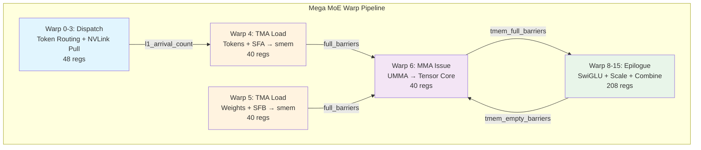
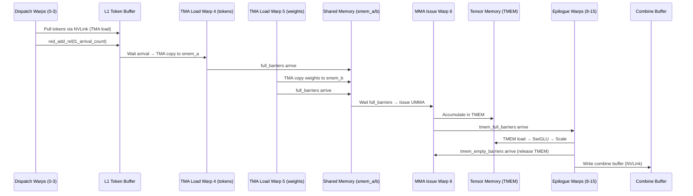
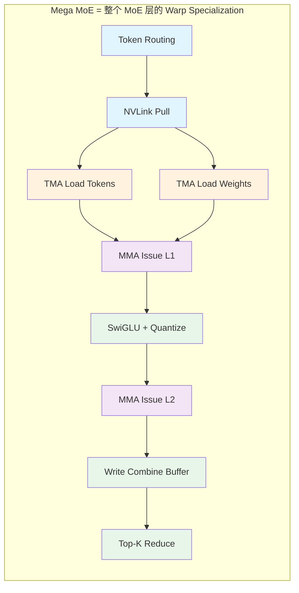

# Warp Specialization: DeepEP vs Mega MoE 深度对比分析

> 分析日期: 2026-07-30
> 目标: 剖析博客中描述的 DeepEP Warp Specialization 概念如何映射到 DeepGEMM Mega MoE 的实现

---

## 1. 核心结论 (TL;DR)

**Mega MoE 使用了 Warp Specialization，但其形态与 DeepEP 有本质区别：**

| 维度 | DeepEP | Mega MoE |
|------|--------|----------|
| 定位 | 纯通信 kernel | 通信+计算融合 kernel |
| Warp 分工 | IB Send / Forward / Receive | Dispatch / TMA Load / MMA Issue / Epilogue |
| 流水线 | Send → Forward → Receive | Pull → Load → MMA → Epilogue |
| 通信模式 | 显式转发 (需中间 GPU 中继) | 对称内存直读 (NVLink 直接访问) |
| 计算参与 | 无 | Tensor Core (UMMA) + SwiGLU + Combine |

**关键洞察**: Mega MoE 的 Warp Specialization 不是 DeepEP 的"通信阶段并行化"，而是**将整个 MoE 层 (Token Routing → Dispatch → Linear1 → Activation → Linear2 → Combine) 映射到不同的 Warp Group 上**。

---

## 2. DeepEP 的 Warp Specialization 回顾

博客 Section 5 描述的 DeepEP 模型:

```
Warp Group A: IB Sending        (GPU → NIC)
Warp Group B: IB-NVLink Forward (NIC → NVLink 中继)
Warp Group C: NVLink Receive    (NVLink → GPU Memory)
```

形成 **Send → Forward → Receive** 三阶段流水线，通过 FIFO 解耦。

**核心问题**: DeepEP 为什么需要 Forwarding?
- GPU-NIC 拓扑不对称: GPU0 → NIC1 可能需要 GPU0 → NVLink → GPU4 → PCIe → NIC1
- 需要 GPU SM 作为通信中继

---

## 3. Mega MoE 的 Warp 组织

### 3.1 线程块配置 (来自 `heuristics/mega_moe.hpp`)

```cpp
// 148-176 行
const int num_dispatch_threads = 128;      // 4 warps
const int num_non_epilogue_threads = 128;  // 4 warps (MMA issue + TMA load)
const int num_epilogue_threads = 256;      // 8 warps
// 总计: 512 threads = 16 warps per CTA
```

### 3.2 Warp 角色分配 (来自 `sm100_fp8_fp4_mega_moe.cuh`)

```cpp
// 356-877 行: 主 kernel 中的 warp 分派
if (warp_idx < kNumDispatchWarps) {
    // Warp 0-3: Dispatch warps (48 regs)
    cutlass::arch::warpgroup_reg_dealloc<kNumDispatchRegisters>();
    // ... token routing, expert counting, NVLink pull ...
} else if (warp_idx == kNumDispatchWarps) {
    // Warp 4: TMA load for tokens + SFA (40 regs)
    cutlass::arch::warpgroup_reg_dealloc<kNumNonEpilogueRegisters>();
} else if (warp_idx == kNumDispatchWarps + 1) {
    // Warp 5: TMA load for weights + SFB (40 regs)
    cutlass::arch::warpgroup_reg_dealloc<kNumNonEpilogueRegisters>();
} else if (warp_idx == kNumDispatchWarps + 2) {
    // Warp 6: MMA issue warp (40 regs)
    cutlass::arch::warpgroup_reg_dealloc<kNumNonEpilogueRegisters>();
} else if (warp_idx == kNumDispatchWarps + 3) {
    // Warp 7: 预留 (40 regs)
    cutlass::arch::warpgroup_reg_dealloc<kNumNonEpilogueRegisters>();
} else if (warp_idx >= kNumDispatchWarps + kNumMMANonEpilogueWarps) {
    // Warp 8-15: Epilogue warps (208 regs)
    cutlass::arch::warpgroup_reg_alloc<kNumEpilogueRegisters>();
    // ... SwiGLU, scaling, combine ...
}
```

### 3.3 Warp 角色总览

```
┌─────────────────────────────────────────────────────────────────┐
│                    Mega MoE CTA (512 threads)                    │
├──────────┬──────────┬──────────┬─────────────────────────────────┤
│ Warp 0-3 │ Warp 4-5 │ Warp 6-7 │ Warp 8-15                      │
│ Dispatch │ TMA Load │ MMA Issue│ Epilogue (8 warps = 2 WGs)     │
│ 4 warps  │ 2 warps  │ 2 warps  │ 8 warps                        │
│ 48 regs  │ 40 regs  │ 40 regs  │ 208 regs                       │
└──────────┴──────────┴──────────┴─────────────────────────────────┘
```

---

## 4. Mega MoE 的 Warp Specialization 流水线

### 4.1 完整流水线图



### 4.2 生产者-消费者关系



---

## 5. 与 DeepEP 的关键差异

### 5.1 对称内存消除了 Forwarding 需求

**DeepEP 的问题域:**
```
GPU0 要发送到 NIC1，但 NIC1 绑定在 GPU4 上
→ 需要 GPU0 → NVLink → GPU4 (Forward) → PCIe → NIC1
→ 需要 Warp Group B 做 Forwarding
```

**Mega MoE 的解决方案:**
```cpp
// sym_buffer.cuh - 对称内存映射
CUTLASS_DEVICE ptr_t map(const ptr_t& ptr, const uint32_t& dst_rank_idx) const {
    int64_t mapped_ptr = offsets[dst_rank_idx] + reinterpret_cast<int64_t>(ptr);
    return *reinterpret_cast<ptr_t*>(&mapped_ptr);
}
```

每个 rank 都有**对称的虚拟地址映射**，可以直接通过 NVLink 访问其他 rank 的内存，无需 GPU SM 做通信中继。

### 5.2 Dispatch Warps 的角色差异

| DeepEP | Mega MoE |
|--------|----------|
| IB Sending: GPU → NIC 组织 RDMA 包 | Dispatch: Token Routing + 直接从远端 Pull 数据 |
| 需要与 NIC 交互 | 纯 NVLink 操作，无 NIC 参与 |
| 发送 (Send) | 拉取 (Pull) - 接收端主动读取 |

```cpp
// Mega MoE Dispatch Warp 的核心操作 (441-599 行)
// 1. 读取远端 token 的 topk_idx
const uint32_t src_token_topk_idx = *workspace.get_src_token_topk_idx_ptr(
    current_expert_idx, current_rank_in_expert_idx, token_idx_in_rank);

// 2. TMA load token from remote rank into shared memory
ptx::tma_load_1d(
    pull_buffer.get_base_ptr(),
    sym_buffer.map(input_token_buffer.get_data_buffer(src_token_idx).get_base_ptr(),
                   current_rank_in_expert_idx),  // 远端 rank 的对称地址
    pull_mbarrier, kHidden);

// 3. 写入本地 L1 buffer
ptx::tma_store_1d(
    l1_token_buffer.get_data_buffer(pool_token_idx).get_base_ptr(),
    pull_buffer.get_base_ptr(), pull_buffer.get_num_bytes());
```

### 5.3 计算 Warp 的引入

DeepEP 没有计算，Mega MoE 引入了:

```cpp
// Warp 6: MMA Issue (763-872 行)
if (warp_idx == kNumDispatchWarps + 2) {
    // 只有 leader CTA 执行
    if (is_leader_cta) {
        // 创建 UMMA 指令描述符
        auto instr_desc = cute::UMMA::make_instr_desc_block_scaled<...>();
        
        // 持久化调度所有 block
        scheduler.for_each_block([&](...) {
            // 等待 TMEM empty barrier
            tmem_empty_barriers[accum_stage_idx]->wait(accum_phase ^ 1);
            
            // 等待 TMA load 完成
            full_barriers[stage_idx]->wait(phase);
            
            // UTCCP copy SFA/SFB to TMEM
            cute_utccp_t::copy(sf_desc, kTmemStartColOfSFA + i * 4);
            
            // Issue UMMA
            ptx::SM100_MMA_MXF8F6F4_2x1SM_SS::fma(
                b_desc, a_desc, accum_stage_idx * UMMA_N, ...);
            
            // Commit to empty barrier
            empty_barrier_arrive(k_block_idx == num_k_blocks - 1);
        });
    }
}
```

### 5.4 Epilogue Warp 的融合

```cpp
// Warp 8-15: Epilogue (877-1357 行)
// L1 Epilogue: SwiGLU + FP8 量化 + TMA Store
if (block_phase == sched::BlockPhase::Linear1) {
    // 1. TMEM Load
    cute::SM100_TMEM_LOAD_16dp256b1x::copy(tmem_addr, ...);
    
    // 2. SwiGLU: silu(gate) * up
    gate = __fmul2_rn(gate, {math::fast_rcp(denom.x), ...});
    swiglu_values[i * 2 + k] = __fmul2_rn(__fmul2_rn(gate, up), weights);
    
    // 3. Amax reduction + SF 计算
    math::get_e4m3_sf_and_sf_inv(amax_values[i], sf, sf_inv);
    
    // 4. Cast to FP8 + STSM store
    ptx::SM100_U8x4_STSM_T<__nv_fp8x4_e4m3>::copy(fp8x4_values, smem_ptr);
    
    // 5. TMA Store
    cute::SM90_TMA_STORE_2D::copy(&tensor_map_l1_output, ...);
}

// L2 Epilogue: BF16 写回远端 Combine Buffer
else {
    // 1. TMEM Load
    // 2. Store to shared memory
    // 3. Write to remote combine buffer via NVLink
    *sym_buffer.map(dst_ptr, dst_rank_idx) = packed;  // 对称内存写回
}

// Combine: Top-K reduce (1226-1356 行)
for (uint32_t token_idx = sm_idx * kNumEpilogueWarps + epilogue_warp_idx;
     token_idx < num_tokens;
     token_idx += kNumSMs * kNumEpilogueWarps) {
    // 加载所有 top-k 贡献
    // 累加: reduced += bf16_values[l]
    // Cast + TMA Store 到输出
}
```

---

## 6. Warp Specialization 的寄存器策略

Mega MoE 显式使用寄存器重分配来支持 Warp Specialization:

```cpp
// 343-349 行: 寄存器预算
constexpr uint32_t kNumDispatchRegisters = 48;      // Dispatch: 少
constexpr uint32_t kNumNonEpilogueRegisters = 40;   // MMA/TMA: 最少
constexpr uint32_t kNumEpilogueRegisters = 208;     // Epilogue: 最多
DG_STATIC_ASSERT(kNumDispatchRegisters * kNumDispatchThreads +
                 kNumNonEpilogueRegisters * kNumNonEpilogueThreads +
                 kNumEpilogueRegisters * kNumEpilogueThreads <= 64512,
                 "Too many registers");
```

**设计哲学:**
- Dispatch warps 需要中等寄存器 (48) 用于 token routing 逻辑
- MMA/TMA warps 需要最少寄存器 (40) 用于持久化调度
- Epilogue warps 需要大量寄存器 (208) 用于 SwiGLU 计算、amax reduction、FP8 量化

---

## 7. 通信与计算的并行化

### 7.1 时间线对比

```
DeepEP:
|---- IB Send ----|---- Forward ----|---- Receive ----|
     Warp A            Warp B            Warp C

Mega MoE:
|-- Dispatch --|-- TMA Load --|-- MMA Compute --|-- Epilogue --|
   Warp 0-3       Warp 4-5        Warp 6          Warp 8-15
      ↓              ↓               ↓                ↓
   NVLink        smem fill      Tensor Core      SwiGLU +
   Pull          (tokens+wt)    (UMMA)           Combine
```

### 7.2 流水线阶段同步

```cpp
// 331-335 行: Intra-SM Barrier 索引
constexpr uint32_t kDispatchBarrierIdx = 0;
constexpr uint32_t kDispatchWithEpilogueBarrierIdx = 1;
constexpr uint32_t kEpilogueFullBarrierIdx = 2;
constexpr uint32_t kEpilogueWGBarrierStartIdx = 3;

// 263-268 行: Barrier 分配
auto dispatch_barriers      = ...;  // kNumDispatchWarps 个
auto full_barriers          = ...;  // kNumStages 个 (TMA → MMA)
auto empty_barriers         = ...;  // kNumStages 个 (MMA → TMA)
auto tmem_full_barriers     = ...;  // kNumEpilogueStages 个 (MMA → Epilogue)
auto tmem_empty_barriers    = ...;  // kNumEpilogueStages 个 (Epilogue → MMA)
auto combine_barriers       = ...;  // kNumEpilogueWarps * 2 个
```

---

## 8. 总结: Warp Specialization 的演化

### 8.1 设计范式对比

| 维度 | DeepEP | Mega MoE |
|------|--------|----------|
| **问题** | 如何并行化通信阶段? | 如何融合通信+计算? |
| **Warp 角色** | 通信阶段 (Send/Fwd/Recv) | 计算+通信阶段 (Dispatch/Load/MMA/Epi) |
| **流水线深度** | 3 阶段 | 4+ 阶段 (含 2 层 GEMM) |
| **同步机制** | FIFO | mbarrier + TMEM barrier |
| **寄存器策略** | 未公开 | 显式重分配 (40/48/208) |
| **内存模型** | 非对称 (需显式 Send) | 对称内存 (直接远端访问) |

### 8.2 Mega MoE 的 Warp Specialization 本质



### 8.3 关键洞察

1. **Mega MoE 不是 DeepEP 的简单扩展** — 它是全新的 kernel 设计，Warp Specialization 服务于"通信+计算融合"而非"通信并行化"

2. **对称内存改变了通信范式** — 从"发送 (Send)"到"拉取 (Pull)"，消除了 Forwarding 需求

3. **Warp 分工更细** — 16 warps 各司其职: 4 dispatch + 2 TMA load + 2 MMA + 8 epilogue

4. **寄存器重分配是关键优化** — 不同 Warp Group 的寄存器需求差异大 (40 vs 208)，显式重分配释放更多寄存器给 Epilogue

5. **TMEM 作为计算流水线核心** — Tensor Memory 是 MMA Issue 和 Epilogue 之间的共享存储，通过 tmem_full/empty_barriers 解耦

---

## 9. 参考代码位置

| 文件 | 行号 | 内容 |
|------|------|------|
| `sm100_fp8_fp4_mega_moe.cuh` | 356-877 | Warp 角色分派主逻辑 |
| `sm100_fp8_fp4_mega_moe.cuh` | 343-349 | 寄存器预算 static_assert |
| `sm100_fp8_fp4_mega_moe.cuh` | 263-268 | Barrier 分配 |
| `sm100_fp8_fp4_mega_moe.cuh` | 441-599 | Dispatch Warp NVLink Pull |
| `sm100_fp8_fp4_mega_moe.cuh` | 763-872 | MMA Issue Warp |
| `sm100_fp8_fp4_mega_moe.cuh` | 877-1357 | Epilogue Warp |
| `heuristics/mega_moe.hpp` | 148-176 | 线程块配置 |
| `sym_buffer.cuh` | 34-36 | 对称内存映射 |
| `barrier.cuh` | 28-72 | NVLink barrier 实现 |

---

## 10. 附录: 完整 Warp 流水线 Mermaid 图

```mermaid
gantt
    title Mega MoE Warp Pipeline (单 CTA 视角)
    dateFormat X
    axisFormat %L

    section Dispatch (Warp 0-3)
    Token Routing + Expert Count :active, d1, 0, 10
    NVLink Pull (TMA Load)       :active, d2, after d1, 20
    Workspace Clean              :d3, after d2, 5

    section TMA Load (Warp 4-5)
    Wait L1 Arrival              :crit, t0, 5, 5
    TMA Copy Tokens+Weights      :active, t1, after d2, 15

    section MMA Issue (Warp 6)
    Wait full_barriers           :crit, m0, 15, 3
    Issue UMMA (L1)              :active, m1, after t1, 20
    Issue UMMA (L2)              :active, m2, after m1, 20

    section Epilogue (Warp 8-15)
    Wait tmem_full_barriers      :crit, e0, 20, 3
    SwiGLU + Quantize (L1)       :active, e1, after m1, 15
    Write Combine Buffer (L2)    :active, e2, after m2, 15
    Top-K Reduce + TMA Store     :active, e3, after e2, 10
```



---

*分析基于 DeepGEMM 源码: `/Users/backyes/work/triton/DeepGEMM/`*
*博客参考: `/tmp/deep_ep_blog_text.txt` Section 5*
