# FIFO Pipeline Analysis: From DeepEP's Streaming Concept to Mega MoE's Implementation

> **分析目标**：探究博客"FIFO: From Synchronous to Streaming Pipeline"概念如何映射到 DeepGEMM Mega MoE 的实现中。
>
> **核心问题**：Mega MoE 是否使用了 FIFO 队列？如何实现 stage 解耦？是同步还是流式执行？

---

## 1. TL;DR

| 问题 | 结论 |
|------|------|
| Mega MoE 是否使用 FIFO 队列？ | **是，但形式不同**——不使用显式 FIFO，而是用 **mbarrier-based producer-consumer** 实现等效 FIFO 语义 |
| Stage 解耦方式？ | **异步流式**——通过 `full_barriers` / `empty_barriers` 实现 double-buffering pipeline |
| barrier.cuh 的角色？ | **全局同步点**（grid_sync + nvlink_barrier），用于跨 SM/跨 rank 的 phase 切换，不是 FIFO |
| 是否"无需等待整个 Batch"？ | **是**——per-token / per-block 粒度流式处理，`l1_arrival_count` / `l2_arrival_mask` 实现细粒度依赖 |
| Symmetric Memory 如何改变 FIFO 模型？ | 消除了显式 Receive Buffer → Expert Buffer 的拷贝，**NVLink 直接远程读取**替代了 FIFO 队列 |

---

## 2. 博客核心概念回顾：FIFO 的流式本质

博客 Section 6 描述了 FIFO 的核心思想：

```
无 FIFO（同步）:
Send → Barrier → Forward → Barrier → Receive
      ↑ 必须等前一阶段全部完成

有 FIFO（流式）:
Send → FIFO → Forward → FIFO → Receive
      ↑ 每个阶段只关心自己的读写，无需等待整个 Batch
```

**FIFO 的本质**：将通信 pipeline 从同步执行转变为流式执行（streaming execution）。

在 DeepEP 中，这体现为：
- **Chunk Buffer** 作为显式 FIFO 队列
- Token 以 Chunk 为粒度流过各个阶段
- Warp Specialization 中不同 Warp Group 通过 FIFO 解耦

---

## 3. Mega MoE 的 Pipeline 架构

### 3.1 整体 Pipeline 结构

Mega MoE 将 MoE 的整个计算流程融合到**单个 kernel** 中：

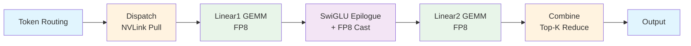

### 3.2 Warp Specialization 角色分配

Mega MoE 使用 **Warp Specialization** 将不同阶段分配给不同的 Warp：

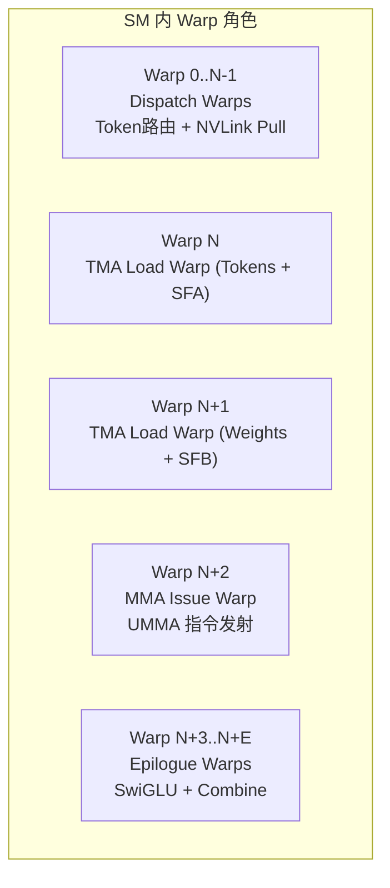

**关键代码**（`sm100_fp8_fp4_mega_moe.cuh`）：

```cpp
if (warp_idx < kNumDispatchWarps) {
    // Dispatch warps: Token 路由 + NVLink 远程拉取
} else if (warp_idx == kNumDispatchWarps) {
    // GEMM TMA load warp for tokens with SFA
} else if (warp_idx == kNumDispatchWarps + 1) {
    // GEMM TMA load warp for weights with SFB
} else if (warp_idx == kNumDispatchWarps + 2) {
    // GEMM MMA issue warp (only leader CTA)
} else if (warp_idx >= kNumDispatchWarps + kNumMMANonEpilogueWarps) {
    // Epilogue warps: SwiGLU + Combine
}
```

---

## 4. Mega MoE 中的"FIFO"机制

### 4.1 不是显式 FIFO，而是 mbarrier-based Producer-Consumer

Mega MoE **没有使用显式的 FIFO 队列数据结构**，而是通过 **CUTLASS 的 `ClusterTransactionBarrier`（mbarrier）** 实现了等效的 FIFO 语义：

```cpp
// Barrier 定义（sm100_fp8_fp4_mega_moe.cuh）
using Barrier = cutlass::arch::ClusterTransactionBarrier;

// 核心 barrier 数组
auto dispatch_barriers      = /* dispatch warps 的 pull mbarrier */;
auto full_barriers          = /* TMA load 完成信号 */;
auto empty_barriers         = /* consumer 释放信号（可重用 buffer）*/;
auto tmem_full_barriers     = /* Tensor Memory 累积完成 */;
auto tmem_empty_barriers    = /* Tensor Memory 可被重用 */;
auto combine_barriers       = /* Combine 阶段 double-buffering */;
```

### 4.2 Producer-Consumer 协议（等效 FIFO）

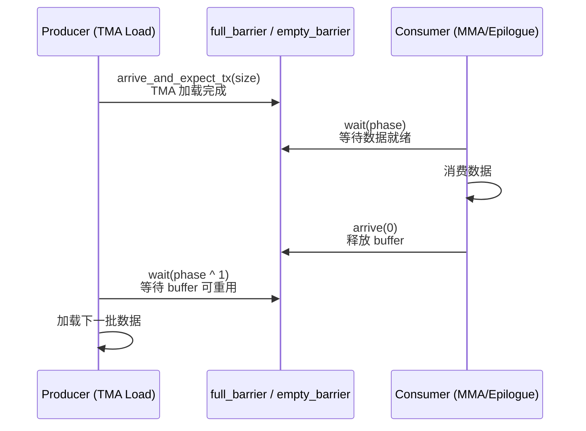

**关键代码**：

```cpp
// Producer (TMA Load Warp): 加载数据并 signal
full_barriers[stage_idx]->arrive_and_expect_tx(SMEM_A_SIZE_PER_STAGE * 2 + SF_BLOCK_M * sizeof(uint32_t) * 2);

// Consumer (MMA Issue Warp): 等待数据就绪
full_barriers[stage_idx]->wait(phase);

// Consumer 完成后释放 buffer
empty_barriers[stage_idx]->arrive(0u);

// Producer 等待 buffer 可重用
empty_barriers[stage_idx]->wait(phase ^ 1);
```

### 4.3 这就是 FIFO！

对比博客中的 FIFO 模型：

| DeepEP 显式 FIFO | Mega MoE 等效 FIFO |
|------------------|-------------------|
| Chunk Buffer（显式队列） | smem_a/smem_b/smem_cd（shared memory buffer） |
| 写入 FIFO | `full_barriers[i]->arrive_and_expect_tx()` |
| 从 FIFO 读取 | `full_barriers[i]->wait(phase)` |
| FIFO 空位可用 | `empty_barriers[i]->arrive()` + `wait(phase ^ 1)` |
| Chunk 粒度 | BLOCK 粒度（BLOCK_M × BLOCK_K） |

**结论**：Mega MoE 使用 **mbarrier + double-buffering** 实现了与 FIFO 完全等效的流式语义。

---

## 5. Stage 解耦机制详解

### 5.1 Dispatch → Linear1 的解耦

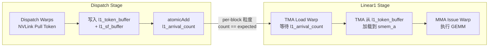

**关键代码**（`sm100_fp8_fp4_mega_moe.cuh`）：

```cpp
// Dispatch Warp: 每完成一个 token 的 pull，增加 arrival count
ptx::red_add_rel(
    workspace.get_l1_arrival_count_ptr(expert_pool_block_offset + token_idx_in_expert / BLOCK_M), 1);

// TMA Load Warp (Linear1): 等待整个 block 的 token 全部到达
if (block_phase == sched::BlockPhase::Linear1) {
    const auto ptr = workspace.get_l1_arrival_count_ptr(pool_block_idx);
    const auto expected = scheduler.template get_valid_m<false>();
    while (ptx::ld_acq(ptr) != expected);  // 自旋等待
}
```

### 5.2 Linear1 → Linear2 的解耦

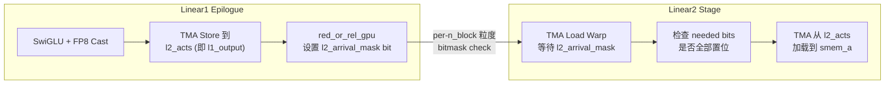

**关键代码**：

```cpp
// Linear1 Epilogue: 完成一个 n_block 后设置 arrival mask
ptx::red_or_rel_gpu(
    workspace.get_l2_arrival_mask_ptr(pool_block_idx),
    1ull << n_block_idx
);

// Linear2 TMA Load Warp: 等待所需的 L1 output 全部就绪
if (block_phase == sched::BlockPhase::Linear2) {
    const uint64_t needed = 3ull << (k_block_idx * 2);
    if ((cached_l2_arrival_mask & needed) != needed) {
        const auto ptr = workspace.get_l2_arrival_mask_ptr(pool_block_idx);
        do {
            cached_l2_arrival_mask = ptx::ld_acq_gpu(ptr);
        } while ((cached_l2_arrival_mask & needed) != needed);
    }
}
```

### 5.3 Linear2 → Combine 的解耦

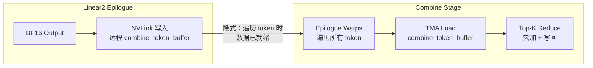

Combine 阶段使用 **double-buffering + mbarrier** 实现流式处理：

```cpp
// Combine: 2-slot double buffering
const auto combine_load_buffer = utils::PatternVisitor([&](const uint32_t& i) {
    return math::advance_ptr<uint4>(smem_buffer, (epilogue_warp_idx + i * kNumEpilogueWarps) * kNumChunkBytes);
});

// 加载 top-k 数据并等待
ptx::tma_load_1d(combine_load_buffer[i], src_ptr, combine_load_barriers[i], kNumChunkBytes);
ptx::mbarrier_arrive_and_set_tx(combine_load_barriers[i], kNumChunkBytes);
// ...
combine_load_barriers[load_stage_idx]->wait(combine_phase);
```

---

## 6. barrier.cuh 的角色分析

### 6.1 两个核心函数

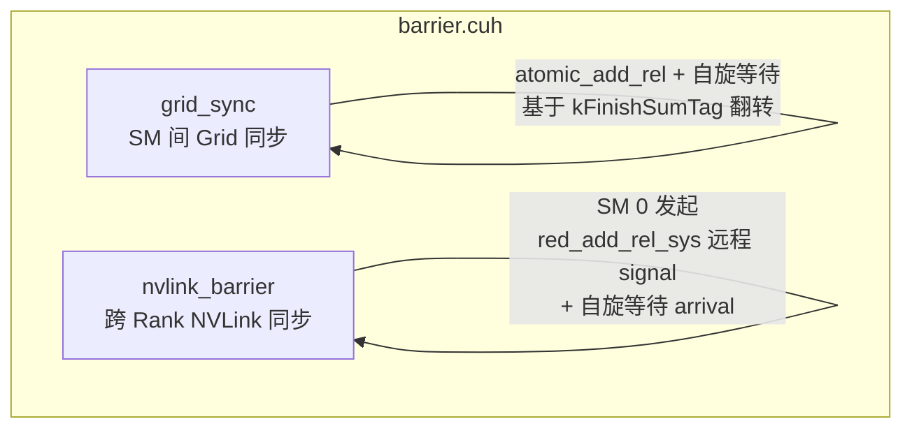

### 6.2 grid_sync：SM 间全局同步

```cpp
template <uint32_t kNumSMs, uint32_t kGridSyncIndex = 0, typename sync_scope_t>
CUTLASS_DEVICE void grid_sync(const layout::Workspace& workspace,
                              const uint32_t& sm_idx, const uint32_t& thread_idx,
                              const sync_scope_t& sync_scope) {
    static constexpr uint32_t kFinishSumTag = 0x80000000u;
    sync_scope();
    if (thread_idx == 0) {
        const auto count_ptr = workspace.get_grid_sync_count_ptr<kGridSyncIndex>();
        const auto old_value = ptx::atomic_add_rel(
            count_ptr, sm_idx == 0 ? (kFinishSumTag - (kNumSMs - 1)) : 1);
        uint32_t new_value;
        do {
            new_value = ptx::ld_acq(count_ptr);
        } while (((new_value ^ old_value) & kFinishSumTag) == 0);
    }
    sync_scope();
}
```

**这是一个 Barrier（同步），不是 FIFO！**

- 所有 SM 必须到达才能继续
- 基于 `kFinishSumTag` 翻转的 phase 检测
- 用于 **phase 切换点**，不是数据流传递

### 6.3 nvlink_barrier：跨 Rank 同步

```cpp
template <uint32_t kNumRanks, ...>
CUTLASS_DEVICE void nvlink_barrier(const layout::Workspace& workspace,
                                   const layout::SymBuffer<kNumRanks>& sym_buffer, ...) {
    // Grid sync before NVLink signaling
    if (sync_prologue)
        grid_sync<kNumSMs, kGridSyncIndex>(...);
    
    // NVLink cross-rank barrier, only SM 0 participates
    if (sm_idx == 0) {
        // Send signals to remote ranks
        if (thread_idx < kNumRanks)
            ptx::red_add_rel_sys(sym_buffer.map(signal_ptr, thread_idx), signal_sign ? -1 : 1);
        // Wait arrival (with 30s timeout)
        while (ptx::ld_acq_sys(signal_ptr) != target) { /* spin */ }
    }
    
    // Grid sync after NVLink completion
    if (sync_epilogue)
        grid_sync<kNumSMs, kGridSyncIndex>(...);
}
```

**这也是 Barrier（同步），不是 FIFO！**

### 6.4 barrier.cuh 的使用场景

| 使用点 | Tag | 用途 |
|--------|-----|------|
| Dispatch 完成后 | `kBeforeDispatchPullBarrierTag` | 确保所有 rank 的 metadata 就绪，开始 pull token |
| Combine 开始前 | `kBeforeCombineReduceBarrierTag` | 确保所有 rank 的 L2 output 写入完成 |
| Workspace 清理后 | `kAfterWorkspaceCleanBarrierTag` | 确保清理完成，kernel 安全退出 |

**结论**：`barrier.cuh` 提供的是**全局同步点**（synchronous barriers），用于跨 SM/跨 rank 的 **phase 边界同步**。它与 FIFO 是**互补关系**：
- **barrier.cuh**：粗粒度 phase 同步（kernel 级）
- **mbarrier (full/empty)**：细粒度数据流 FIFO（block 级）

---

## 7. 同步原语全景

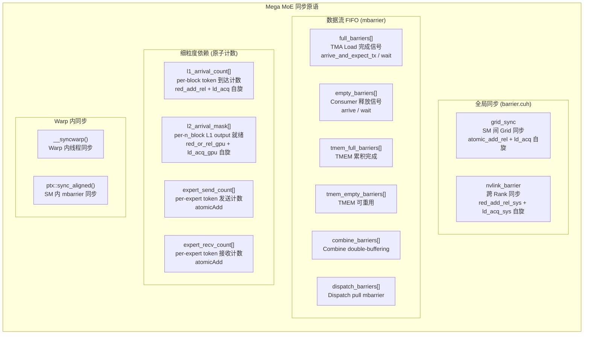

### 7.1 同步原语使用总结

| 原语 | 类型 | 粒度 | 用途 |
|------|------|------|------|
| `grid_sync` | Barrier | 所有 SM | Phase 切换 |
| `nvlink_barrier` | Barrier | 所有 Rank | 跨节点 phase 切换 |
| `full_barriers` | FIFO (mbarrier) | per-stage | TMA load 完成 |
| `empty_barriers` | FIFO (mbarrier) | per-stage | Buffer 释放 |
| `tmem_full/empty` | FIFO (mbarrier) | per-stage | TMEM 累积/释放 |
| `l1_arrival_count` | 原子计数 | per-block | Token 到达 |
| `l2_arrival_mask` | 原子位图 | per-n_block | L1 output 就绪 |
| `__syncwarp` | Warp sync | warp | Warp 内同步 |
| `ptx::sync_aligned` | mbarrier | SM 内 | SM 内跨 warp 同步 |

---

## 8. "无需等待整个 Batch"的流式行为

### 8.1 证据一：Per-Token 粒度 Dispatch

```cpp
// Dispatch Warps: 每个 token 独立处理，无需等待其他 token
constexpr uint32_t kNumGlobalWarps = kNumSMs * kNumDispatchWarps;
for (uint32_t token_idx = sm_idx * kNumDispatchWarps + warp_idx; ; token_idx += kNumGlobalWarps) {
    // 计算当前 token 属于哪个 expert
    while (token_idx >= expert_end_idx) {
        if (++ current_expert_idx >= kNumExpertsPerRank)
            break;
        // 更新 expert 范围...
    }
    if (current_expert_idx >= kNumExpertsPerRank)
        break;
    
    // 从远程 rank 拉取 token 数据
    ptx::tma_load_1d(pull_buffer.get_base_ptr(),
                     sym_buffer.map(input_token_buffer.get_data_buffer(src_token_idx).get_base_ptr(),
                                    current_rank_in_expert_idx),
                     pull_mbarrier, kHidden);
    
    // 写入本地 L1 buffer，增加 arrival count
    ptx::red_add_rel(
        workspace.get_l1_arrival_count_ptr(expert_pool_block_offset + token_idx_in_expert / BLOCK_M), 1);
}
```

**关键**：每个 token 独立被 pull，**不需要等待整个 Batch 的 token 就绪**。

### 8.2 证据二：Per-Block 粒度 GEMM 启动

```cpp
// TMA Load Warp (Linear1): 等待一个 block 的 token 全部到达就启动
if (block_phase == sched::BlockPhase::Linear1) {
    const auto ptr = workspace.get_l1_arrival_count_ptr(pool_block_idx);
    const auto expected = scheduler.template get_valid_m<false>();
    while (ptx::ld_acq(ptr) != expected);  // 只等当前 block
}
```

**关键**：只等待**当前 block** 的 token 到达，不是等待所有 token。

### 8.3 证据三：Per-N-Block 粒度 L2 启动

```cpp
// Linear2: 只等待当前 k_block 对应的 2 个 L1 output n_block
if (block_phase == sched::BlockPhase::Linear2) {
    const uint64_t needed = 3ull << (k_block_idx * 2);
    if ((cached_l2_arrival_mask & needed) != needed) {
        do {
            cached_l2_arrival_mask = ptx::ld_acq_gpu(ptr);
        } while ((cached_l2_arrival_mask & needed) != needed);
    }
}
```

**关键**：只等待**当前 k_block 所需的 2 个 n_block**，不是等待整个 expert 的所有 output。

### 8.4 流式行为总结

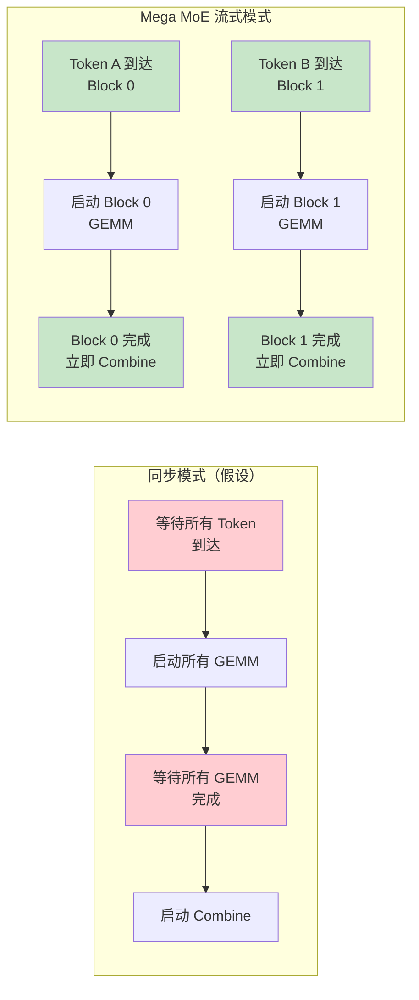

---

## 9. Symmetric Memory 如何改变 FIFO 模型

### 9.1 DeepEP 的显式 FIFO 模型

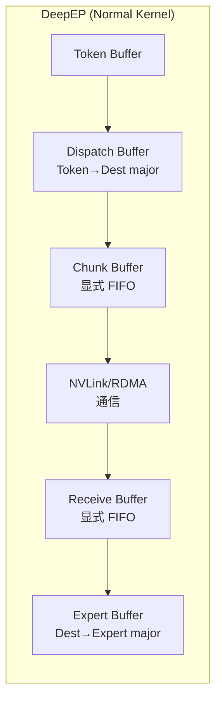

DeepEP 需要：
1. **Chunk Buffer**：显式 FIFO 队列，聚合 token 为 chunk
2. **Receive Buffer**：显式 FIFO 队列，接收远程 chunk
3. **多次数据拷贝**：Token → Dispatch → Chunk → Receive → Expert

### 9.2 Mega MoE 的 Symmetric Memory 模型

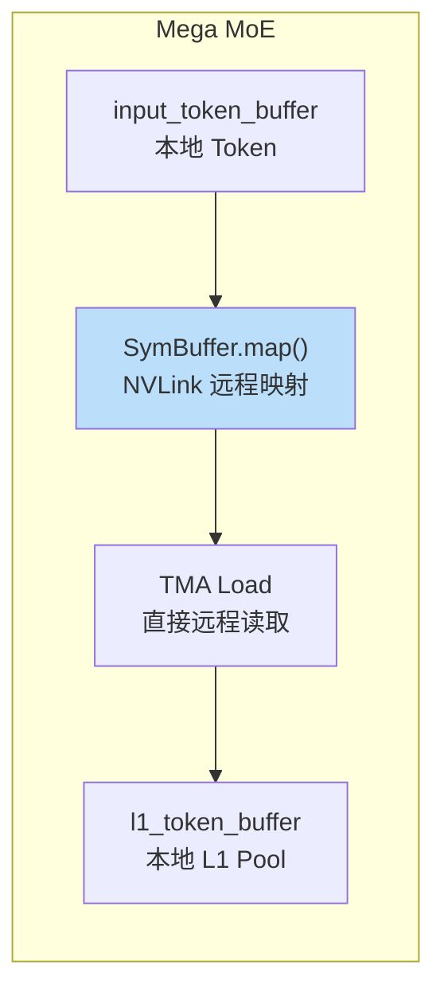

**关键代码**（`sym_buffer.cuh`）：

```cpp
template <uint32_t kNumRanks = kNumMaxRanks>
struct SymBuffer {
    int64_t base;
    int64_t offsets[kNumMaxRanks];
    uint32_t rank_idx;
    
    // 将本地指针映射到远程 rank 的地址空间
    template <typename ptr_t>
    CUTLASS_DEVICE ptr_t map(const ptr_t& ptr, const uint32_t& dst_rank_idx) const {
        int64_t mapped_ptr = offsets[dst_rank_idx] + reinterpret_cast<int64_t>(ptr);
        return *reinterpret_cast<ptr_t*>(&mapped_ptr);
    }
};
```

**使用方式**：

```cpp
// Dispatch Warp: 直接通过 NVLink 读取远程 rank 的 token
ptx::tma_load_1d(
    pull_buffer.get_base_ptr(),
    sym_buffer.map(input_token_buffer.get_data_buffer(src_token_idx).get_base_ptr(),
                   current_rank_in_expert_idx),  // 远程 rank
    pull_mbarrier, kHidden);
```

### 9.3 对比总结

| 维度 | DeepEP | Mega MoE |
|------|--------|----------|
| **FIFO 形式** | 显式 Chunk/Receive Buffer | 隐式 mbarrier + shared memory |
| **数据拷贝** | 多次（Token→Dispatch→Chunk→Receive→Expert） | **零拷贝**（NVLink 直接远程读取） |
| **通信粒度** | Chunk（多个 token 聚合） | **Per-Token**（单 token 粒度） |
| **Buffer 层级** | 多层（5+） | 少层（L1 Pool + L2） |
| **同步机制** | Warp Specialization + FIFO | Warp Specialization + mbarrier |
| **跨节点通信** | RDMA（显式） | NVLink（Symmetric Memory 隐式） |

**核心变化**：Symmetric Memory 使得 Mega MoE 可以**直接远程读取**，消除了 DeepEP 中显式 FIFO 队列的需求。FIFO 语义从"数据拷贝到本地队列"变为"通过地址映射直接访问"。

---

## 10. 完整 Pipeline 数据流图

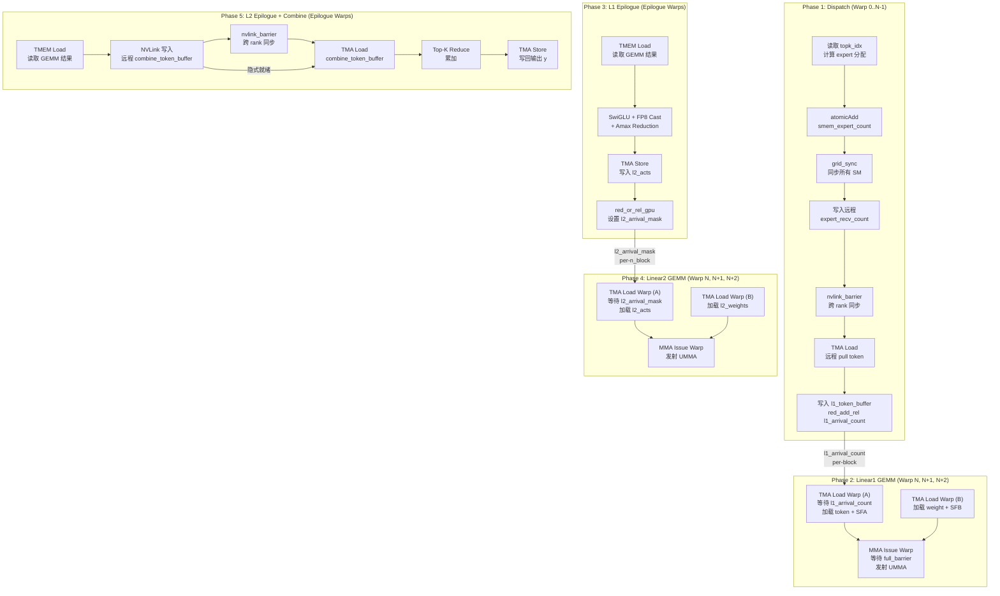

---

## 11. 核心结论

### 11.1 Mega MoE 是否使用了 FIFO？

**是的，但形式不同于 DeepEP 的显式 FIFO 队列。**

Mega MoE 使用 **mbarrier-based producer-consumer 协议** 实现了等效的 FIFO 语义：
- `full_barriers` / `empty_barriers` 构成 double-buffering pipeline
- Producer（TMA Load）通过 `arrive_and_expect_tx` 通知数据就绪
- Consumer（MMA/Epilogue）通过 `wait` 等待数据
- Consumer 完成后通过 `arrive` 释放 buffer

### 11.2 Stage 解耦是同步还是流式？

**流式（Streaming）**。

证据：
1. **Per-token 粒度**：Dispatch warps 独立处理每个 token
2. **Per-block 粒度**：GEMM 只等待当前 block 的数据
3. **Per-n_block 粒度**：L2 只等待当前 k_block 所需的 L1 output
4. **Double-buffering**：多个 stage 可以并行处理不同的 block

### 11.3 barrier.cuh 的角色

**barrier.cuh 提供的是全局同步点（synchronous barriers），不是 FIFO。**

- `grid_sync`：SM 间 Grid 同步
- `nvlink_barrier`：跨 Rank NVLink 同步
- 用于 **phase 边界**（dispatch → pull → combine → clean）

它与 FIFO 是**互补关系**：
- **barrier.cuh**：粗粒度 phase 同步
- **mbarrier (full/empty)**：细粒度数据流 FIFO

### 11.4 Symmetric Memory 对 FIFO 模型的影响

Symmetric Memory **消除了显式 FIFO 队列的需求**：

| DeepEP | Mega MoE |
|--------|----------|
| 显式 Chunk Buffer | 隐式 mbarrier + shared memory |
| 显式 Receive Buffer | NVLink 直接远程读取 |
| 多次数据拷贝 | 零拷贝 |
| Chunk 粒度通信 | Per-Token 粒度通信 |

### 11.5 与博客概念的映射

| 博客概念 | Mega MoE 实现 |
|----------|--------------|
| Send → FIFO → Forward | Dispatch → l1_token_buffer (mbarrier) → Linear1 |
| Forward → FIFO → Receive | Linear1 Epilogue → l2_acts (arrival_mask) → Linear2 |
| 每个阶段只关心自己的读写 | Warp Specialization + mbarrier producer-consumer |
| 无需等待整个 Batch | per-token/per-block 粒度流式处理 |
| FIFO 本质：同步→流式 | mbarrier double-buffering 实现流式 pipeline |

---

## 12. 关键代码索引

| 文件 | 行号 | 内容 |
|------|------|------|
| `sm100_fp8_fp4_mega_moe.cuh` | 263-268 | Barrier 数组定义 |
| `sm100_fp8_fp4_mega_moe.cuh` | 275-310 | Barrier 初始化 |
| `sm100_fp8_fp4_mega_moe.cuh` | 356-600 | Dispatch Warp 逻辑 |
| `sm100_fp8_fp4_mega_moe.cuh` | 655-718 | TMA Load Warp (Tokens) |
| `sm100_fp8_fp4_mega_moe.cuh` | 720-762 | TMA Load Warp (Weights) |
| `sm100_fp8_fp4_mega_moe.cuh` | 763-872 | MMA Issue Warp |
| `sm100_fp8_fp4_mega_moe.cuh` | 877-1357 | Epilogue Warps |
| `sm100_fp8_fp4_mega_moe.cuh` | 670-675 | l1_arrival_count 等待 |
| `sm100_fp8_fp4_mega_moe.cuh` | 680-690 | l2_arrival_mask 等待 |
| `sm100_fp8_fp4_mega_moe.cuh` | 596-598 | l1_arrival_count 增加 |
| `sm100_fp8_fp4_mega_moe.cuh` | 1100-1106 | l2_arrival_mask 设置 |
| `barrier.cuh` | 9-26 | grid_sync 实现 |
| `barrier.cuh` | 28-72 | nvlink_barrier 实现 |
| `sym_buffer.cuh` | 9-39 | SymBuffer 定义 |
| `mega_moe.cuh` | 32-168 | Workspace 布局 |
| `mega_moe.cuh` | 140-150 | l1_arrival_count / l2_arrival_mask 指针 |

---

## 13. 参考

- 博客原文：`/tmp/deep_ep_blog_text.txt` Section 6
- DeepGEMM 源码：`/Users/backyes/work/triton/DeepGEMM/`
- CUTLASS ClusterTransactionBarrier 文档
- NVIDIA SM100 / Blackwell 架构手册
