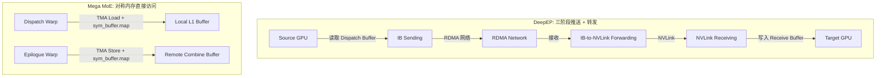
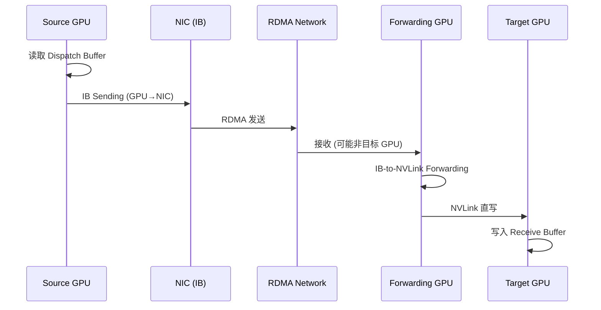
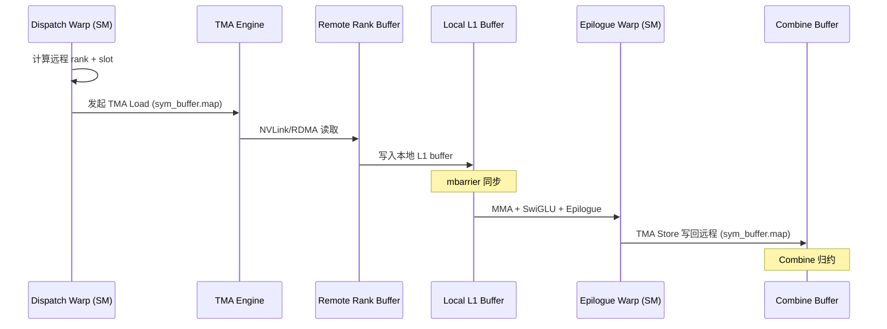

# 05_06: NVLink Scale-up + RDMA Scale-out — DeepEP 三阶段流水线 vs Mega MoE 对称内存

> 分析日期: 2026-07-30
> 源材料: DeepEP 博客 Section 4 + DeepGEMM Mega MoE 源码 (SM100 FP8/FP4)

---

## 1. 核心问题

DeepEP 博客 Section 4 描述了多节点 MoE 的 **Intra-node NVLink + Inter-node RDMA** 协调问题：
- Token 可能留在本地、同节点另一 GPU、或远端节点
- 单 Dispatch 包含两个通信域：Intra-node (NVLink) + Inter-node (RDMA)
- 三阶段流水线：Source GPU → IB Sending → RDMA Network → IB-to-NVLink Forwarding → NVLink Receiving → Target GPU

**Mega MoE 用 Symmetric Memory 重新解决了同一个问题，但架构完全不同。**

---

## 2. 结论摘要

| 维度 | DeepEP | Mega MoE |
|------|--------|----------|
| Intra-node 通信 | NVLink (显式) | NVLink (通过 Symmetric Memory) |
| Inter-node 通信 | RDMA (显式) | RDMA (通过 Symmetric Memory) |
| 流水线 | 三阶段 (Send → Forward → Receive) | 无阶段 — 直接远程访问 |
| 通信发起者 | GPU SM + NIC | GPU SM + TMA (通过 SymBuffer.map) |
| 数据组织 | Chunk Buffer + FIFO | 对称内存池 (Token Pool) |
| 同步机制 | FIFO + Barrier | NVLink Barrier + Grid Sync + mbarrier |
| 角色分工 | IB Sending / Forwarding / NVLink Receiving | Dispatch Warps / MMA Warps / Epilogue Warps |

**核心差异**: DeepEP 是 **"推送 + 转发"** 模型，Mega MoE 是 **"拉取 + 直接远程访问"** 模型。

---

## 3. Symmetric Memory 技术本质

### 3.1 什么是 Symmetric Memory

Symmetric Memory 是 PyTorch 提供的**分布式共享内存抽象**：

```python
# deep_gemm/mega/__init__.py
import torch.distributed._symmetric_memory as symm_mem

# 每个 rank 分配一块 buffer
self.buffer = symm_mem.empty(num_bytes, dtype=torch.int8, device='cuda')

# rendezvous 让 buffer 对所有 rank 可见
self.handle = symm_mem.rendezvous(self.buffer, group=group)
```

**技术本质**:
- 每个 rank 分配一块 **本地物理内存**
- 通过 `rendezvous` 注册到通信后端，使所有 rank 获得 **remote accessible pointer**
- 底层传输: **同节点 NVLink, 跨节点 RDMA (NCCL 自动选择)**
- 对 GPU kernel 来说，可以通过 **TMA (Tensor Memory Accelerator)** 直接发起远程 load/store

### 3.2 SymBuffer 结构 — 跨 rank 地址映射

```cpp
// deep_gemm/layout/sym_buffer.cuh
template <uint32_t kNumRanks = kNumMaxRanks>
struct SymBuffer {
    int64_t base;                    // 本地 buffer 基地址
    int64_t offsets[kNumMaxRanks];   // 各 rank 相对于本 rank 的偏移
    uint32_t rank_idx;               // 当前 rank 编号

    // 关键: 将本地指针映射为可远程访问的指针
    template <typename ptr_t>
    CUTLASS_DEVICE ptr_t map(const ptr_t& ptr, const uint32_t& dst_rank_idx) const {
        int64_t mapped_ptr = offsets[dst_rank_idx] + reinterpret_cast<int64_t>(ptr);
        return *reinterpret_cast<ptr_t*>(&mapped_ptr);
    }
};
```

**`map(ptr, dst_rank_idx)` 是 Mega MoE 跨 rank 访问的核心原语**:
- 输入: 本地 buffer 中的指针 + 目标 rank
- 输出: 可在目标 rank 上执行 TMA load/store 的远程虚拟地址
- 底层: 利用 NVLink/RDMA 的 **统一虚拟地址空间 (UVA)**

---

## 4. Mega MoE 的通信路径

### 4.1 Intra-node: NVLink (通过 Symmetric Memory)

Mega MoE **不显式区分** intra-node 和 inter-node。Symmetric Memory 抽象隐藏了传输层差异：

```cpp
// sm100_fp8_fp4_mega_moe.cuh — Dispatch Warp 拉取远程 token
const auto pull_buffer = smem_send_buffers.get_rank_buffer(warp_idx).get_data_buffer(0);

// 关键: 通过 sym_buffer.map 将本地 input_token_buffer 指针映射到远程 rank
ptx::tma_load_1d(
    pull_buffer.get_base_ptr(),                                          // 本地 smem 目标
    sym_buffer.map(input_token_buffer.get_data_buffer(src_token_idx)     // 远程 rank 源地址
                   .get_base_ptr(), current_rank_in_expert_idx),
    pull_mbarrier, kHidden);
```

**Intra-node 传输**: 当 `current_rank_in_expert_idx` 对应同节点 rank 时，TMA 通过 **NVLink** 完成远程 load。

### 4.2 Inter-node: RDMA (通过 Symmetric Memory)

同样的 `sym_buffer.map` + `tma_load_1d` 机制，当目标 rank 在远端节点时，底层自动走 **RDMA**：

```cpp
// 同一段代码，不同 dst_rank_idx → 不同底层传输
*sym_buffer.map(dst_ptr, dst_rank_idx) = token_topk_idx;  // 跨节点写 → RDMA
```

**关键**: Mega MoE 不需要像 DeepEP 那样显式管理 IB Sending / RDMA 网络 / NIC 绑定。

---

## 5. 三阶段流水线的消亡

### 5.1 DeepEP 三阶段流水线 (回顾)

```
Source GPU → IB Sending → RDMA Network → IB-to-NVLink Forwarding → NVLink Receiving → Target GPU
```

**为什么需要 Forwarding?** 因为 GPU-NIC 拓扑不对称：
- GPU0 要发送到 NIC1 绑定的远端 GPU
- 必须: GPU0 → NVLink → GPU4 → PCIe → NIC1 → RDMA → ...

### 5.2 Mega MoE: 无阶段直接访问

```
┌─────────────────────────────────────────────────────────┐
│                    Symmetric Memory                      │
│  ┌──────────┐    ┌──────────┐    ┌──────────┐          │
│  │ Rank 0   │◄──►│ Rank 1   │◄──►│ Rank N   │          │
│  │ Buffer   │ NVLink│ Buffer │ NVLink│ Buffer  │          │
│  └──────────┘    └──────────┘    └──────────┘          │
│       ▲              ▲              ▲                   │
│       │ TMA          │ TMA          │ TMA               │
│  ┌──────────┐    ┌──────────┐    ┌──────────┐          │
│  │ SM 0     │    │ SM 1     │    │ SM N     │          │
│  └──────────┘    └──────────┘    └──────────┘          │
└─────────────────────────────────────────────────────────┘
```

**Mega MoE 消除了 Forwarding 阶段**:
- 每个 rank 的 kernel 直接通过 `sym_buffer.map` 计算远程地址
- TMA 硬件直接执行跨 rank load/store
- 不需要 "GPU 作为通信中继" 的角色

### 5.3 对比 Mermaid 图



---

## 6. 跨 rank 读写的具体实现

### 6.1 Dispatch 阶段: 拉取远程 Token

```cpp
// sm100_fp8_fp4_mega_moe.cuh (line 544-598)

// 1. 读取源 token-topk 索引 (由远端 dispatch 通过 NVLink 写入)
const uint32_t src_token_topk_idx = *workspace.get_src_token_topk_idx_ptr(
    current_expert_idx, current_rank_in_expert_idx, token_idx_in_rank);

// 2. TMA load token 从远端 rank 到本地 smem
if (cute::elect_one_sync()) {
    ptx::tma_load_1d(
        pull_buffer.get_base_ptr(),
        sym_buffer.map(input_token_buffer.get_data_buffer(src_token_idx).get_base_ptr(),
                       current_rank_in_expert_idx),  // ← 远程 rank 地址
        pull_mbarrier, kHidden);
}

// 3. 加载并存储 SF (与 TMA token load 重叠)
const auto remote_sf_ptr = sym_buffer.map(
    input_sf_buffer.get_data_buffer(src_token_idx).get_base_ptr<uint32_t>(),
    current_rank_in_expert_idx);
// ... 直接读取 remote_sf_ptr

// 4. 存储到本地 L1 buffer
ptx::tma_store_1d(
    l1_token_buffer.get_data_buffer(pool_token_idx).get_base_ptr(),
    pull_buffer.get_base_ptr(), pull_buffer.get_num_bytes());
```

### 6.2 Combine 阶段: 写回远程 Buffer

```cpp
// sm100_fp8_fp4_mega_moe.cuh (line 1196-1202)

// 从 shared memory 读取
const auto packed = ptx::ld_shared(reinterpret_cast<float4*>(smem_ptr));

// 写入远端 combine buffer
const auto dst_token = combine_token_buffer.get_rank_buffer(dst_topk_idx)
                       .get_data_buffer(dst_token_idx);
const auto dst_ptr = math::advance_ptr<float4>(
    dst_token.get_base_ptr(),
    n_idx * sizeof(nv_bfloat16) + (lane_idx % 16) * sizeof(float4));
*sym_buffer.map(dst_ptr, dst_rank_idx) = packed;  // ← 远程 NVLink/RDMA 写
```

---

## 7. Barrier 与跨 rank 同步

### 7.1 NVLink Barrier 实现

```cpp
// deep_gemm/comm/barrier.cuh
template <uint32_t kNumRanks, uint32_t kNumSMs, uint32_t kNumThreads, ...>
CUTLASS_DEVICE void nvlink_barrier(const layout::Workspace& workspace,
                                   const layout::SymBuffer<kNumRanks>& sym_buffer,
                                   ...) {
    // 1. Grid sync (节点内所有 SM 同步)
    if (sync_prologue)
        grid_sync<kNumSMs, kGridSyncIndex>(workspace, sm_idx, thread_idx, sync_scope);

    // 2. NVLink 跨 rank barrier (仅 SM 0 参与)
    if (sm_idx == 0) {
        // 发送信号到远端 rank
        if (thread_idx < kNumRanks)
            ptx::red_add_rel_sys(sym_buffer.map(signal_ptr, thread_idx), signal_sign ? -1 : 1);

        // 等待所有 rank 到达
        if (thread_idx == 0) {
            ptx::red_add(counter_ptr, 1);
            while (ptx::ld_acq_sys(signal_ptr) != target) { /* spin */ }
        }
    }

    // 3. Grid sync (确保所有 SM 看到 barrier 完成)
    if (sync_epilogue)
        grid_sync<kNumSMs, kGridSyncIndex>(workspace, sm_idx, thread_idx, sync_scope);
}
```

### 7.2 三种 Barrier 类型

| Barrier | 作用 | 触发时机 |
|---------|------|----------|
| `grid_sync` | 节点内所有 SM 同步 | 每次跨 rank 操作前后 |
| `nvlink_barrier` | 跨 rank 全局同步 | Dispatch 前/后, Combine 前 |
| `mbarrier` | TMA 数据传输完成 | 每次 TMA load/store 完成 |

### 7.3 NVLink Barrier Tag 语义

```cpp
// sm100_fp8_fp4_mega_moe.cuh
constexpr uint32_t kBeforeDispatchPullBarrierTag = 1;      // Dispatch 拉取前
constexpr uint32_t kBeforeCombineReduceBarrierTag = 2;     // Combine 归约前
constexpr uint32_t kAfterWorkspaceCleanBarrierTag = 3;     // Workspace 清理后
```

---

## 8. GPU-Centric Communication Fabric 的演进

### 8.1 DeepEP 的 GPU-Centric Fabric

```
NVLink + RDMA + GPU SM → 共同构成数据路径
```

- GPU SM 发起通信 (不是 NIC 独立处理)
- GPU 作为 Forwarding 中继
- SM + NIC + NVLink 紧密耦合

### 8.2 Mega MoE 的演进: SM + TMA + SymBuffer

```
Symmetric Memory + TMA + GPU SM → 统一数据路径
```

```cpp
// Mega MoE 的通信由以下三者协作:
// 1. Dispatch Warps (GPU SM): 计算远程地址, 发起 TMA
// 2. TMA (Tensor Memory Accelerator): 执行实际数据传输
// 3. SymBuffer.map(): 提供远程地址映射

// 关键代码: SM 直接发起远程 TMA load
ptx::tma_load_1d(
    local_smem_ptr,
    sym_buffer.map(remote_ptr, dst_rank_idx),  // SM 计算远程地址
    mbarrier, size);
```

**变化**:
- **不再需要 GPU 作为 Forwarding 中继** — TMA 直接处理跨 rank 传输
- **不再需要显式 FIFO** — mbarrier 提供更细粒度的生产者-消费者同步
- **通信与计算更深度融合** — Dispatch Warps 同时做 token routing + 远程拉取

---

## 9. 完整数据流对比

### 9.1 DeepEP Normal Kernel 数据流



### 9.2 Mega MoE 数据流



---

## 10. 关键差异深度分析

### 10.1 为什么 Mega MoE 能消除三阶段?

**根本原因**: Symmetric Memory + TMA 提供了 **load-store 语义的远程访问**

| DeepEP | Mega MoE |
|--------|----------|
| RDMA 是 **消息传递** 语义 | Symmetric Memory 是 **load/store** 语义 |
| 需要显式 Send/Recv 操作 | 直接 `map(ptr, rank)` 后 TMA load/store |
| NIC 是独立参与者 | TMA 集成在 GPU SM 中 |
| 需要 Forwarding 解决拓扑问题 | UVA 统一地址空间消除拓扑差异 |

### 10.2 对称内存 vs 显式 RDMA 的权衡

| 维度 | 显式 RDMA (DeepEP) | 对称内存 (Mega MoE) |
|------|---------------------|---------------------|
| 控制粒度 | 精确 (可优化每个 packet) | 较粗 (依赖 TMA/NCCL) |
| 灵活性 | 高 (可自定义 protocol) | 较低 (受限于 SymMem API) |
| 实现复杂度 | 高 (三阶段 + FIFO + Warp 特化) | 低 (统一 load/store) |
| 性能上限 | 高 (可极致优化) | 高 (TMA 硬件加速) |
| 通用性 | 仅 MoE All-to-All | 通用分布式共享内存 |

### 10.3 Mega MoE 仍保留的 "GPU-Centric" 特征

1. **Dispatch Warps 发起通信**: 不是 passive receiver，而是主动 pull
2. **TMA 代替 NIC**: 通信引擎集成在 GPU 内
3. **SM 计算远程地址**: `sym_buffer.map` 在 SM 中执行
4. **mbarrier 硬件同步**: 不需要 CPU 介入

---

## 11. 代码结构映射表

| 概念 | DeepEP 实现 | Mega MoE 实现 |
|------|-------------|---------------|
| 跨 rank 发送 | `IB Sending` Warp Group | `sym_buffer.map` + TMA store |
| 跨 rank 接收 | `NVLink Receiving` Warp Group | `sym_buffer.map` + TMA load |
| 转发 | `IB-to-NVLink Forwarding` | **消除** (直接远程访问) |
| 流控 | FIFO (生产者-消费者) | mbarrier (TMA 完成通知) |
| 同步 | Barrier + 信号 | nvlink_barrier + grid_sync |
| 缓冲 | Chunk Buffer + Receive Buffer | Symmetric Buffer (Token Pool) |
| 路由 | Router → Dispatch Buffer | Router → topk_idx → sym_buffer |

---

## 12. 总结

### 12.1 Mega MoE 对 DeepEP 的继承

1. **GPU-Centric 通信**: SM 发起通信 (不是 NIC offload)
2. **NVLink + RDMA 统一**: 不区分 intra/inter-node
3. **Warp 特化**: Dispatch / MMA / Epilogue 分离
4. **异步流水线**: 通信与计算重叠

### 12.2 Mega MoE 对 DeepEP 的革新

1. **Symmetric Memory 替代显式 RDMA**: 用 load/store 语义替代消息传递
2. **消除三阶段**: 直接远程访问，无需 Forwarding
3. **TMA 替代手动 Copy**: 硬件加速远程 load/store
4. **mbarrier 替代 FIFO**: 更细粒度的生产者-消费者同步
5. **Pull 模型替代 Push 模型**: 消费方主动拉取，而非生产方推送

### 12.3 一句话总结

> **DeepEP 是 "通信运行时" — 显式管理 NVLink + RDMA 三阶段流水线。Mega MoE 是 "融合运行时" — 通过 Symmetric Memory 将通信隐式融入 GEMM 计算，用 TMA load/store 替代显式 Send/Forward/Receive。**

---

## 附录: 关键源码位置

| 文件 | 关键内容 |
|------|----------|
| `deep_gemm/mega/__init__.py` | `SymmBuffer` 类, `symm_mem.empty/rendezvous` |
| `csrc/apis/mega.hpp` | `get_symm_buffer_size_for_mega_moe`, buffer layout |
| `deep_gemm/layout/sym_buffer.cuh` | `SymBuffer::map()` — 跨 rank 地址映射 |
| `deep_gemm/comm/barrier.cuh` | `nvlink_barrier`, `grid_sync` |
| `deep_gemm/layout/mega_moe.cuh` | `Workspace` 结构, 内存布局 |
| `deep_gemm/impls/sm100_fp8_fp4_mega_moe.cuh` | 完整 kernel 实现 |
| `tests/test_mega_moe.py` | 多进程测试, `init_dist` + `spawn` |
