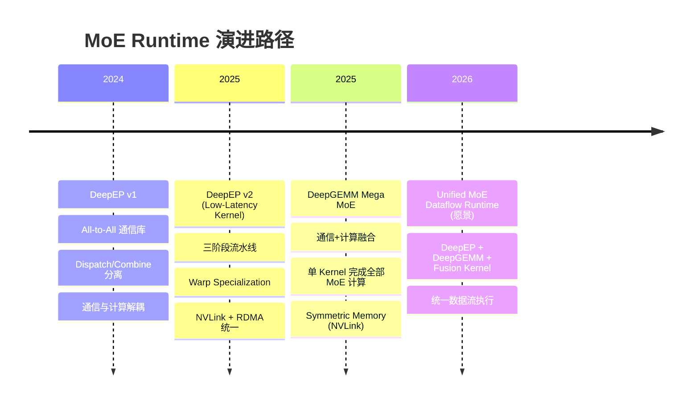
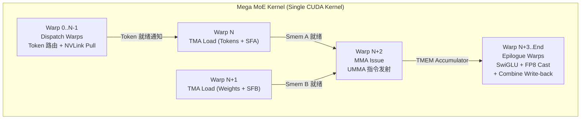
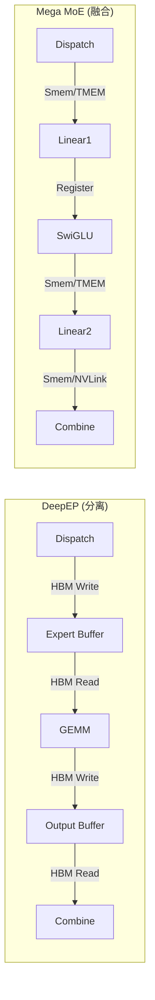

# 从 DeepEP 到 Mega MoE：MoE Runtime 演进分析

> 基于 DeepGEMM 源码的实证分析，验证博客中提出的演进叙事

## 1. 概述

博客《Understanding GPU Microarchitecture from a Workload Perspective (3): DeepEP's First Principles》第 9 节提出了 MoE Runtime 的演进路径：

```
DeepEP: Communication + Data Movement Runtime
   ↓
Mega MoE: Communication + Compute Fusion Runtime
   ↓
DeepEP + DeepGEMM + Fusion Kernel → Unified MoE Dataflow Runtime
```

本文档通过分析 DeepGEMM 中 Mega MoE 的实际实现（Blackwell SM100, FP8×FP4），验证这一演进叙事。

## 2. 演进时间线



## 3. Mega MoE 融合了什么？

### 3.1 完整操作清单

Mega MoE 在**单个 CUDA Kernel** 中融合了以下全部操作：

| 阶段 | 操作 | 代码位置 | 说明 |
|------|------|----------|------|
| **Token Routing** | 读取 topk_idx/topk_weights | `read_topk_idx` lambda | 解析 Router 输出的专家映射 |
| **Dispatch (通信)** | 跨 Rank 拉取 Token 数据 | `pull_buffer` + TMA load | NVLink/Symmetric Memory 远程读取 |
| **Linear1 (Gate/Up)** | FP8×FP4 GEMM | `SM100_MMA_MXF8F6F4_2x1SM_SS::fma` | UMMA 指令，2x1SM 多播 |
| **SwiGLU Activation** | silu(gate) × up × weight | L1 Epilogue | TMEM → Register → 激活 → FP8 重量化 |
| **Linear2 (Down)** | FP8×FP4 GEMM | `SM100_MMA_MXF8F6F4_2x1SM_SS::fma` | UMMA 指令，L1 输出直接作为 L2 输入 |
| **Combine (通信)** | 跨 Rank 写回 + Top-K Reduce | `combine_token_buffer` + TMA store | NVLink 远程写入 + 累加 |

### 3.2 融合 Kernel 的 Warp 角色分配



对应代码（`sm100_fp8_fp4_mega_moe.cuh`）：

```cpp
// 不同 warp 角色划分
if (warp_idx < kNumDispatchWarps) {
    // Dispatch warps: Token 路由 + 跨 Rank 拉取
    ...
} else if (warp_idx == kNumDispatchWarps) {
    // GEMM TMA load warp for tokens with SFA
    ...
} else if (warp_idx == kNumDispatchWarps + 1) {
    // GEMM TMA load warp for weights with SF
    ...
} else if (warp_idx == kNumDispatchWarps + 2) {
    // GEMM MMA issue warp (UMMA 指令发射)
    ...
} else if (warp_idx >= kNumDispatchWarps + kNumMMANonEpilogueWarps) {
    // Epilogue warps: SwiGLU + Combine
    ...
}
```

## 4. 什么没有被融合？

### 4.1 仍在 Kernel 外部的操作

| 操作 | 位置 | 原因 |
|------|------|------|
| **Router (Top-K 选择)** | Python 前置步骤 | 产生 topk_idx/topk_weights |
| **权重 FP4 转换** | `transform_weights_for_mega_moe()` | 一次性预处理 |
| **输入 FP8 量化** | `per_token_cast_to_fp8()` | 数据预处理 |
| **最终输出写回** | TMA store to `y` | Kernel 末尾，但非核心计算 |

### 4.2 权重预处理代码

```python
# deep_gemm/mega/__init__.py
def transform_weights_for_mega_moe(l1_weights, l2_weights):
    # L1: interleave gate/up, then transpose SF for UTCCP
    l1_interleaved = _interleave_l1_weights(l1_weights)
    l1_weights = (l1_interleaved[0], _transpose_sf_for_utccp(l1_interleaved[1]))
    # L2: only transpose SF for UTCCP
    l2_weights = (l2_weights[0], _transpose_sf_for_utccp(l2_weights[1]))
    return l1_weights, l2_weights
```

## 5. 通信+计算融合的实现路径

### 5.1 DeepEP 模式：分离式

```
[Router] → [DeepEP Dispatch] → [Expert Buffer] → [GEMM] → [DeepEP Combine] → [Output]
                ↑                    ↑                           ↑
            NVLink/RDMA          HBM 写入                    NVLink/RDMA
```

### 5.2 Mega MoE 模式：融合式

```
[Router] → [Mega MoE Kernel] → [Output]
                │
                ├─ Dispatch Warps: NVLink Pull → Smem → L1 Buffer (HBM local)
                ├─ MMA Warps: L1 Buffer → UMMA → TMEM
                ├─ Epilogue: TMEM → SwiGLU → FP8 Cast → L2 Buffer (HBM local)
                ├─ MMA Warps: L2 Buffer → UMMA → TMEM
                └─ Epilogue: TMEM → NVLink Write-back → Combine Reduce → Output
```

### 5.3 关键代码：Dispatch 阶段

```cpp
// sm100_fp8_fp4_mega_moe.cuh - Dispatch Warps
// 1. 统计每个 Expert 的 Token 数量
read_topk_idx([&](const uint32_t& token_topk_idx, const int& expert_idx) {
    atomicAdd_block(smem_expert_count + expert_idx, 1);
});

// 2. 计算全局偏移（跨 Rank 累加）
for (uint32_t i = thread_idx; i < kNumExperts; i += kNumDispatchThreads) {
    const uint64_t send_value = (1ull << 32) | static_cast<uint64_t>(smem_expert_count[i]);
    smem_expert_count[i] = static_cast<uint32_t>(
        ptx::atomic_add(workspace.get_expert_send_count_ptr(i), send_value));
}

// 3. 写入源 Token 索引到 Symmetric Buffer（跨 Rank 可见）
*sym_buffer.map(dst_ptr, dst_rank_idx) = token_topk_idx;

// 4. 从远程 Rank 拉取 Token 数据（TMA Load via NVLink）
ptx::tma_load_1d(
    pull_buffer.get_base_ptr(),
    sym_buffer.map(input_token_buffer.get_data_buffer(src_token_idx).get_base_ptr(),
                   current_rank_in_expert_idx),
    pull_mbarrier, kHidden);
```

### 5.4 关键代码：Combine 阶段

```cpp
// sm100_fp8_fp4_mega_moe.cuh - Combine (Epilogue Warps)
// 1. 从 combine_token_buffer 读取各 Top-K 专家结果
const auto src_ptr = math::advance_ptr<uint8_t>(
    combine_token_buffer.get_rank_buffer(slot_idx)
                        .get_data_buffer(token_idx).get_base_ptr(),
    chunk_byte_offset);
ptx::tma_load_1d(combine_load_buffer[i], src_ptr, combine_load_barriers[i], kNumChunkBytes);

// 2. 累加所有 Top-K 贡献
float2 reduced[kNumUint4PerLane * kNumElemsPerUint4] = {};
while (do_reduce) {
    do_reduce = move_mask_and_load(load_stage_idx ^ 1);
    combine_load_barriers[load_stage_idx]->wait(combine_phase);
    for (uint32_t j = 0; j < kNumUint4PerLane; ++ j) {
        const auto uint4_values = combine_load_buffer[load_stage_idx][j * 32 + lane_idx];
        const auto bf16_values = reinterpret_cast<const nv_bfloat162*>(&uint4_values);
        for (uint32_t l = 0; l < kNumElemsPerUint4; ++ l)
            ptx::accumulate(reduced[j * kNumElemsPerUint4 + l], bf16_values[l]);
    }
}

// 3. 写回最终输出
ptx::tma_store_1d(
    math::advance_ptr(y, static_cast<uint64_t>(token_idx) * kNumHiddenBytes + chunk_byte_offset),
    combine_store_buffer, kNumChunkBytes);
```

## 6. Linear1 / SwiGLU / Linear2 的具体位置

### 6.1 Linear1 (Gate/Up Projection)

**位置**: `sm100_fp8_fp4_mega_moe.cuh` 第 763-865 行

```cpp
// MMA Issue Warp - Linear1 Phase
if (block_phase == sched::BlockPhase::Linear1) {
    // 等待 Token 数据到达
    const auto ptr = workspace.get_l1_arrival_count_ptr(pool_block_idx);
    while (ptx::ld_acq(ptr) != expected);
    
    // 发射 UMMA 指令
    ptx::SM100_MMA_MXF8F6F4_2x1SM_SS::fma(
        b_desc, a_desc, accum_stage_idx * UMMA_N,
        k_block_idx > 0 or k > 0, runtime_instr_desc,
        kTmemStartColOfSFB, kTmemStartColOfSFA);
}
```

### 6.2 SwiGLU Activation

**位置**: `sm100_fp8_fp4_mega_moe.cuh` 第 931-1012 行

```cpp
// L1 Epilogue: SwiGLU in-place with weight application
if (block_phase == sched::BlockPhase::Linear1) {
    // 从 TMEM 加载 MMA 结果
    cute::SM100_TMEM_LOAD_16dp256b1x::copy(tmem_addr, values[0], ..., values[7]);
    
    // 应用 SwiGLU: silu(gate) * up * weight
    auto gate = __bfloat1622float2(bf16_gate);
    auto neg_gate_exp = make_float2(expf(-gate.x), expf(-gate.y));
    const auto denom = __fadd2_rn({1.0f, 1.0f}, neg_gate_exp);
    gate = __fmul2_rn(gate, {math::fast_rcp(denom.x), math::fast_rcp(denom.y)});
    const auto up = __bfloat1622float2(bf16_up);
    swiglu_values[i * 2 + k] = __fmul2_rn(__fmul2_rn(gate, up), weights);
    
    // 重量化为 FP8 并写回 Shared Memory
    const auto fp8x4_values = __nv_fp8x4_e4m3(make_float4(upper.x, upper.y, lower.x, lower.y));
    ptx::SM100_U8x4_STSM_T<__nv_fp8x4_e4m3>::copy(fp8x4_values, smem_ptr);
}
```

### 6.3 Linear2 (Down Projection)

**位置**: `sm100_fp8_fp4_mega_moe.cuh` 第 1108-1208 行

```cpp
// L2 Epilogue: BF16 output write-back via NVLink
} else {  // block_phase == BlockPhase::Linear2
    // 从 TMEM 加载 L2 MMA 结果
    cute::SM100_TMEM_LOAD_16dp256b1x::copy(tmem_addr, values[0], ..., values[7]);
    
    // 写入 Shared Memory (BF16)
    ptx::SM90_U32x4_STSM_T<uint32_t>::copy(
        math::cast_into_bf16_and_pack(values[0], values[1]), ...);
    
    // 通过 NVLink 写入远程 Rank 的 Combine Buffer
    const auto dst_token = combine_token_buffer.get_rank_buffer(dst_topk_idx)
                           .get_data_buffer(dst_token_idx);
    *sym_buffer.map(dst_ptr, dst_rank_idx) = packed;
}
```

## 7. Dispatch/Combine 在 Kernel 内 vs DeepEP 分离式

### 7.1 对比表

| 维度 | DeepEP | Mega MoE |
|------|--------|----------|
| **执行单元** | 独立 Kernel | 同一 Kernel 内不同 Warp |
| **通信方式** | NVLink/RDMA 显式 API | Symmetric Memory + TMA |
| **数据缓冲** | Expert Buffer (HBM) | L1/L2 Buffer (HBM local) |
| **同步机制** | 全局 Kernel 完成 | 内部 Barrier (mbarrier) |
| **中间数据** | 写回 HBM 再读取 | 留在 Smem/TMEM 流水线内 |

### 7.2 性能优势：消除中间内存写入



**关键收益**:
1. **L1 → L2 数据流**: SwiGLU 输出直接留在 Smem，无需写回 HBM
2. **Token 数据**: Dispatch 拉取直接写入 L1 Buffer，GEMM TMA 直接读取
3. **Combine 写回**: L2 输出通过 NVLink 直接写入远程 Combine Buffer

## 8. 性能收益分析

### 8.1 理论收益

| 优化点 | 节省 | 原因 |
|--------|------|------|
| **Kernel Launch Overhead** | ~10-20μs | 单 Kernel vs 多 Kernel |
| **HBM Bandwidth** | 消除中间写回 | L1→L2 数据流不经过 HBM |
| **Memory Capacity** | 减少 Buffer 占用 | 无需完整 Expert Buffer |
| **通信-计算重叠** | 更细粒度 | Warp 级流水线 |

### 8.2 测试代码中的性能计算

```python
# tests/test_mega_moe.py
# TFLOPS: 3 matmuls (L1 left, L1 right, L2), each 2 * M * N * K
tflops = safe_div(2 * num_recv_tokens * (hidden * intermediate_hidden * 3) / 1e12, t_fused)

# HBM bytes: weights (FP4 packed = 0.5 bytes) + activations (FP8 = 1 byte) + output (BF16 = 2 bytes)
num_hbm_bytes = (
    num_experts_per_rank * intermediate_hidden * 2 * hidden // 2 +  # L1 weights (FP4)
    num_experts_per_rank * hidden * intermediate_hidden // 2 +      # L2 weights (FP4)
    num_recv_tokens * hidden +                                      # L1 acts read (FP8)
    num_recv_tokens * intermediate_hidden +                         # L1 output write (FP8)
    num_recv_tokens * intermediate_hidden +                         # L2 acts read (FP8)
    num_recv_tokens * hidden * 2                                    # L2 output write (BF16)
)

# NVLink bytes: dispatch pull + combine write-back
num_nvlink_bytes = num_recv_tokens * hidden * 3
```

## 9. Mega MoE 是 DeepEP 的替代还是补充？

### 9.1 结论：**互补关系**

| 场景 | DeepEP | Mega MoE |
|------|--------|----------|
| **节点内 (Intra-node)** | ✅ 支持 | ✅ 优化 (Symmetric Memory) |
| **跨节点 (Inter-node)** | ✅ RDMA | ❌ 仅 NVLink |
| **训练/预填充** | ✅ Normal Kernel | ✅ 单 Kernel |
| **解码 (Decode)** | ✅ Low-Latency Kernel | ⚠️ 需适配 |
| **硬件要求** | SM90+ | SM100+ (Blackwell) |

### 9.2 代码证据：测试中的 Baseline 对比

```python
# tests/test_mega_moe.py
# Non-overlapped baseline: EP dispatch + GEMM + EP combine
def run_baseline():
    recv_x, _, recv_topk_weights, handle, _ = ep_buffer.dispatch(...)
    deep_gemm.m_grouped_fp8_fp4_gemm_nt_contiguous(recv_x, l1_weights, l1_y, ...)
    l1_y = tilelang_ops.swiglu_apply_weight_to_fp8(...)
    deep_gemm.m_grouped_fp8_fp4_gemm_nt_contiguous(l1_y, l2_weights, l2_y, ...)
    return ep_buffer.combine(l2_y, handle=handle)[0]

# Run fused mega MoE
def run_fused():
    deep_gemm.fp8_fp4_mega_moe(y, transformed_l1_weights, transformed_l2_weights, buffer, ...)
    return y
```

**关键发现**: 测试代码将 DeepEP + DeepGEMM 分离执行作为 baseline，Mega MoE 作为融合版本对比。

## 10. "Unified MoE Dataflow Runtime" 是什么？

### 10.1 博客原文

> Further evolution: DeepEP + DeepGEMM + Fusion Kernel → Unified MoE Dataflow Runtime

### 10.2 分析

**Mega MoE 是"Unified MoE Dataflow Runtime"的第一步，但不是最终形态**:

| 组件 | 当前状态 | 在 Mega MoE 中 |
|------|----------|----------------|
| **DeepEP** | 独立库 | ❌ 未集成（跨节点 RDMA） |
| **DeepGEMM** | FP8×FP4 GEMM | ✅ 融合（UMMA 指令） |
| **Fusion Kernel** | Mega MoE Kernel | ✅ 已实现 |

### 10.3 演进路径

```
Phase 1 (当前): Mega MoE
├── 节点内 NVLink 通信 + 计算融合
├── 单 Kernel 完成 MoE 全流水线
└── 依赖 Symmetric Memory (PyTorch)

Phase 2 (愿景): Unified MoE Dataflow Runtime
├── 集成 DeepEP 的跨节点 RDMA 能力
├── 统一调度器（通信 + 计算 + 内存）
├── 自适应选择通信路径（NVLink vs RDMA）
└── 全局最优的 Dataflow 执行
```

## 11. 核心发现总结

### 11.1 博客叙事验证

| 博客声明 | 代码验证 | 结论 |
|----------|----------|------|
| "Mega MoE fuses Token Routing → Dispatch → Linear1 → Activation → Linear2 → Combine" | ✅ 完全一致 | **准确** |
| "DeepEP: MoE Data Movement Runtime" | ✅ DeepEP 专注数据搬运 | **准确** |
| "Mega MoE: Communication + Compute Fusion Runtime" | ✅ 单 Kernel 融合 | **准确** |
| "System trends are further fusing Communication + Compute" | ✅ 代码体现 | **准确** |
| "DeepEP + DeepGEMM + Fusion Kernel → Unified MoE Dataflow Runtime" | ⚠️ 部分实现 | **愿景** |

### 11.2 关键洞察

1. **Mega MoE 是"单 Kernel MoE"**: 将 MoE 层的全部计算+通信封装到一个 CUDA Kernel
2. **Warp Specialization 延续**: 类似 DeepEP，Mega MoE 使用不同 Warp 处理不同阶段
3. **Symmetric Memory 是关键**: 利用 PyTorch 的 `torch.distributed._symmetric_memory` 实现跨 Rank 直接访问
4. **TMEM 加速**: 利用 Blackwell 的 Tensor Memory 实现 MMA 累加器与 Epilogue 的高效交互
5. **FP8→SwiGLU→FP8 流水线**: 在 Register 中完成激活和重量化，避免额外 HBM 访问

## 12. 代码文件索引

| 文件 | 作用 |
|------|------|
| `deep_gemm/mega/__init__.py` | Python API 入口 |
| `csrc/apis/mega.hpp` | C++ API 和 Buffer 管理 |
| `csrc/jit_kernels/impls/sm100_fp8_fp4_mega_moe.hpp` | JIT Kernel 实例化 |
| `deep_gemm/include/deep_gemm/impls/sm100_fp8_fp4_mega_moe.cuh` | CUDA Kernel 核心实现 |
| `deep_gemm/include/deep_gemm/scheduler/mega_moe.cuh` | 任务调度器 |
| `tests/test_mega_moe.py` | 正确性测试和性能基准 |

---

**分析日期**: 2026-07-30  
**代码版本**: DeepGEMM (Blackwell SM100 FP8×FP4 Mega MoE)  
**博客参考**: 《Understanding GPU Microarchitecture from a Workload Perspective (3): DeepEP's First Principles》Section 9
