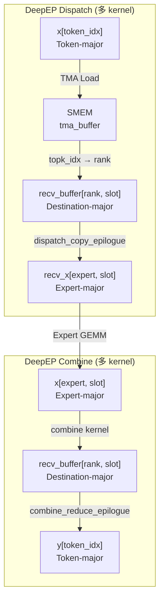
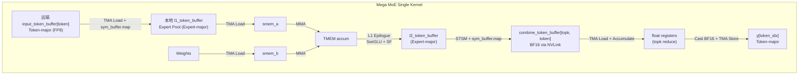
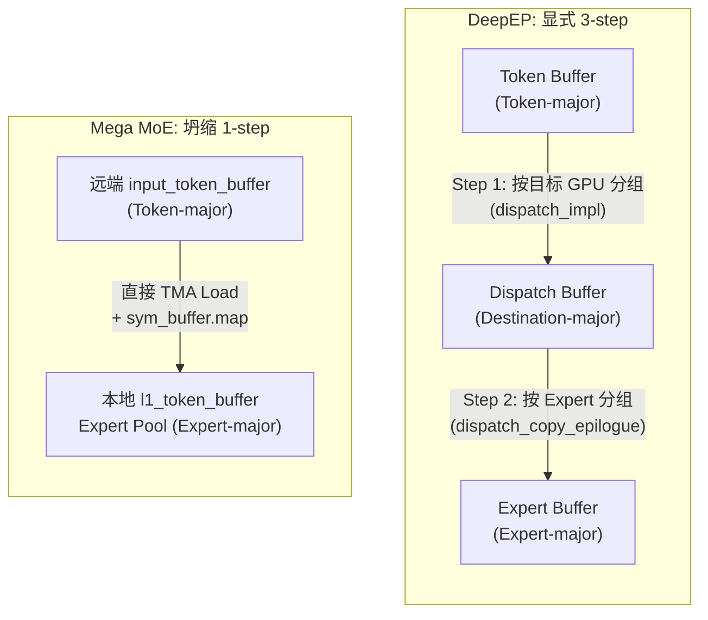
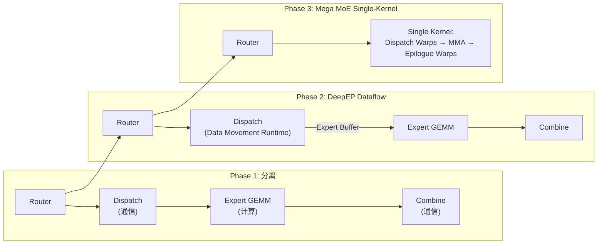

# Dispatch/Combine: 博客理论 ↔ DeepEP 源码 ↔ DeepGEMM Mega MoE 三方对比分析

## 概述

> *"Every MoE Layer must perform a dynamic data layout transformation."*
> —— 《Understanding GPU Microarchitecture from a Workload Perspective (3): DeepEP's First Principles》§1

本文对博客中提出的 **Dispatch/Combine 动态数据布局变换**概念，在 **DeepEP 源码**与 **DeepGEMM Mega MoE 源码**中进行三方对照分析。核心发现：

1. **DeepEP** 将 Dispatch/Combine 实现为**独立的通信 kernel**，显式产出 Destination-major 和 Expert-major 缓冲区
2. **Mega MoE** 将同一概念**坍缩为 kernel 内的 Warp 角色协作**，完全消除了 Destination-major 中间布局
3. 这一演化的根本驱动力是 **symmetric memory（NVLink）**：数据不再"被移动"，而是"被远端访问"

---

## 1. 博客概念回顾：Dispatch / Combine 三步变换

博客 §1.1-1.2 给出的抽象模型：

```
Router 输出:  Token → Expert  (topk_idx, topk_weights)

Dispatch:      Token-major → Destination-major → Expert-major
Combine:       Expert-major → Destination-major → Token-major
```

三个角色的 layout 需求：

| 角色 | 期望 Layout | 原因 |
|------|------------|------|
| Communication | Destination-major | 按目标 GPU 组织，便于连续发送 |
| Expert GEMM | Expert-major | 连续 [M, K] 矩阵供 Tensor Core |
| Next Layer | Token-major | 按 Token 组织，供下一层 Transformer |

博客强调的关键论断：

> *"This is not simple communication — it is a **dynamic data layout transformation**."*

> *"Combine is **data layout recovery + semantic recovery**: Output(T0) = 0.73 × Expert2(T0) + 0.27 × Expert7(T0)"*

---

## 2. DeepEP 实现：显式三步变换

### 2.1 Dispatch Kernel 结构

DeepEP 的 Dispatch 由两个 kernel 协作完成：

| Kernel | 文件 | 职责 |
|--------|------|------|
| `dispatch_impl` | `dispatch.cuh` | Token 读取 + 元数据通信 + NVLink/RDMA 发送 |
| `dispatch_copy_epilogue_impl` | `dispatch_copy_epilogue.cuh` | 接收端：Destination-major → Expert-major 重排 |

### 2.2 Dispatch 的 Token-major → Destination-major 阶段

`dispatch.cuh` 中 Dispatch Warps 的核心逻辑：

```cpp
// dispatch.cuh:280-394
for (int token_idx = token_start; token_idx < num_tokens; token_idx += token_stride) {
    // 1. TMA load token data from Token-major input
    ptx::tma_load_1d(tma_buffer.get_hidden_ptr(),
                     math::advance_ptr(x, token_i64_idx * kNumHiddenBytes), ...);

    // 2. Load top-k indices
    const auto dst_expert_idx = static_cast<int>(__ldg(topk_idx + token_idx * kNumTopk + lane_idx));
    stored_dst_rank_idx = dst_expert_idx / kNumExpertsPerRank;  // ← Destination 推导

    // 3. Deduplicate ranks and assign slots
    stored_dst_slot_idx = atomicAdd(workspace_layout.get_scaleup_atomic_sender_counter()
                                    + stored_dst_rank_idx, 1);

    // 4. TMA store to remote NVLink buffer (Destination-major slot)
    const auto dst_ptr = recv_buffer.get_token_buffer(stored_dst_slot_idx).get_base_ptr();
    ptx::tma_store_1d(gin.get_sym_ptr<team_t>(dst_ptr, stored_dst_rank_idx),
                      tma_buffer.get_base_ptr(), ...);

    // 5. Issue RDMA put for inter-node
    gin.put<team_t>(recv_buffer.get_token_buffer(stored_dst_slot_idx).get_base_ptr(),
                    send_buffer_ptr, ..., stored_dst_rank_idx);
}
```

**关键观察**：Dispatch 产出的 `recv_buffer` 是 **Destination-major** 布局——按 `(rank_idx, slot_idx)` 索引，每个 rank 的 token 连续存放。

### 2.3 Dispatch Copy Epilogue：Destination-major → Expert-major

`dispatch_copy_epilogue_impl` 在接收端执行第二步变换：

```cpp
// dispatch_copy_epilogue.cuh:70-143
for (int i = global_warp_idx; i < num_recv_tokens; i += kNumWarps * kNumSMs) {
    // 1. 计算当前 token 属于哪个 rank (Destination-major → rank boundary)
    while (i >= current_rank_end) {
        current_rank_idx += 1;
        current_rank_start = current_rank_end;
        current_rank_end = ptx::exchange(stored_psum_num_recv_tokens, stored_lane_idx);
    }
    const auto buffer_token = scaleup_buffer.get_rank_buffer(current_rank_idx)
                                              .get_token_buffer(i - current_rank_start);

    // 2. 读取目标 expert index
    dst_expert_idx = buffer_token.get_topk_idx_ptr()[lane_idx];
    dst_expert_idx = in_range ? dst_expert_idx - expert_start_idx : -1;

    // 3. 计算 Expert-major 目标地址
    if (kDoExpand) {
        dst_tensor_idx = atomicAdd(psum_num_recv_tokens_per_expert + dst_expert_idx, 1);
    }

    // 4. TMA store 到 Expert-major output buffer
    ptx::tma_store_1d(math::advance_ptr(recv_x, dst_tensor_idx * kNumHiddenBytes),
                      tma_buffer.get_hidden_ptr(), kNumHiddenBytes);
}
```

**关键观察**：这一步完成了 Destination-major → Expert-major 的转换，通过 `psum_num_recv_tokens_per_expert`（prefix sum）计算每个 expert 的写入偏移。

### 2.4 Combine Kernel：Expert-major → Destination-major → Token-major

`combine.cuh` 执行反向变换：

```cpp
// combine.cuh:86-213
for (int i = token_start_idx; i < token_end_idx; ++ i) {
    // 1. 读取源 metadata（Dispatch 时保存的 src_token_idx, src_rank）
    const int src_token_idx = __ldg(src_metadata + i * kMetadataStride) % kNumMaxTokensPerRank;
    const int src_rank_topk_idx = __ldg(src_metadata + i * kMetadataStride + 1);
    const int src_rank_idx = src_rank_topk_idx / kNumTopk;

    // 2. 定位 Expert-major 源数据
    const bool nvlink_bypass = gin.is_nvlink_accessible<team_t>(src_rank_idx);
    layout::TokenLayout master_token_buffer = [=]() {
        if (nvlink_bypass) {
            // 直接访问远端 NVLink buffer
            token_buffer.set_base_ptr(gin.get_sym_ptr<team_t>(..., src_rank_idx));
            return token_buffer;
        }
        return send_buffer.get_rank_buffer(src_rank_idx).get_token_buffer(src_token_idx);
    }();

    // 3. 加载 Expert-major 数据
    ptx::tma_load_1d(tma_buffer.get_base_ptr(),
                     math::advance_ptr(x, token_idx_in_tensor * kNumHiddenBytes), ...);

    // 4. TMA store 到远端 Destination-major recv_buffer
    ptx::tma_store_1d(master_token_buffer.get_base_ptr(), tma_buffer.get_base_ptr(), ...);

    // 5. 写 topk_weights（语义恢复的关键）
    master_token_buffer.get_topk_weights_ptr()[lane_idx] = value;
}
```

### 2.5 Combine Reduce Epilogue：Destination-major → Token-major

```cpp
// combine_reduce_epilogue.cuh:62-142
for (int token_idx = global_warp_idx; token_idx < num_combined_tokens; ...) {
    // 1. 读取 topk indices
    stored_dst_expert_idx = static_cast<int>(combined_topk_idx[token_idx * kNumTopk + lane_idx]);

    // 2. 去重 + 排序 topk slots
    compute_topk_slots(topk_slot_idx, reduce_valid_mask, ...);

    // 3. 从 comm_buffer 加载并累加 (reduce)
    combine_reduce<kHiddenVec, kUnrollFactor, kNumTokensInLayout>(
        lane_idx, topk_slot_idx, ...,
        /* Get source base */ [=](const int& slot_idx) {
            return comm_buffer.get_rank_buffer(slot_buffer).get_token_buffer(token_idx).get_base_ptr();
        }, ...);

    // 4. TMA store 到 Token-major output
    ptx::tma_store_1d(output_buffer.get_token_buffer(token_idx).get_base_ptr(),
                      tma_buffer.get_base_ptr(), kNumHiddenBytes);
}
```

### 2.6 DeepEP 数据流全景



---

## 3. DeepGEMM Mega MoE 实现：坍缩的一步变换

### 3.1 结论：Dispatch/Combine 不是独立步骤，而是 kernel 内的 Warp 角色

Mega MoE 将 Dispatch 和 Combine 全部融合进**单个 GPU kernel**，由不同的 Warp 角色协作完成：

```cpp
// sm100_fp8_fp4_mega_moe.cuh:329-353
if (warp_idx < kNumDispatchWarps) {
    // Dispatch warps: Token 拉取 + 布局变换
} else if (warp_idx == kNumDispatchWarps) {
    // GEMM TMA load warp (tokens + SFA)
} else if (warp_idx == kNumDispatchWarps + 1) {
    // GEMM TMA load warp (weights + SFB)
} else if (warp_idx == kNumDispatchWarps + 2) {
    // GEMM MMA issue warp
} else if (warp_idx >= kNumDispatchWarps + kNumMMANonEpilogueWarps) {
    // Epilogue warps: GEMM 后处理 + Combine
}
```

### 3.2 Dispatch Warps：Token-major → Expert-major（坍缩一步）

```cpp
// sm100_fp8_fp4_mega_moe.cuh:355-599
if (warp_idx < kNumDispatchWarps) {
    // Phase 1: 读取 topk_idx，按 expert 计数
    read_topk_idx([&](const uint32_t& token_topk_idx, const int& expert_idx) {
       atomicAdd_block(shared_storage.expert_token_count + expert_idx, 1);
    });

    // Phase 2: 全局 offset 分配 (atomicAdd on workspace)
    for (uint32_t i = thread_idx; i < kNumExperts; i += kNumDispatchThreads) {
        shared_storage.expert_token_count[i] = static_cast<uint32_t>(
            ptx::atomic_add(workspace.get_expert_send_count_ptr(i), send_value));
    }

    // Phase 3: 将 src_token_topk_idx 写入远端 rank 的 workspace
    read_topk_idx([&](const uint32_t& token_topk_idx, const int& expert_idx) {
        const auto dst_rank_idx = expert_idx / kNumExpertsPerRank;
        const auto dst_slot_idx = atomicAdd_block(shared_storage.expert_token_count + expert_idx, 1);
        const auto dst_ptr = workspace.get_src_token_topk_idx_ptr(
            expert_idx % kNumExpertsPerRank, sym_buffer.rank_idx, dst_slot_idx);
        *sym_buffer.map(dst_ptr, dst_rank_idx) = token_topk_idx;  // NVLink 远端写入！
    });

    // Phase 4: Grid sync + NVLink barrier

    // Phase 5: Pull token data: 从远端 rank 读到本地 l1_token_buffer
    const auto src_base_ptr = sym_buffer.map(
        buffer.input_token_buffer.get_data_buffer(src_token_idx).get_base_ptr(),
        current_rank_in_expert_idx);  // 远端地址
    const auto dst_base_ptr = buffer.l1_token_buffer
        .get_data_buffer(pool_token_idx % kNumRingTokens).get_base_ptr();
    ptx::tma_load_1d(pull_buffer.get_base_ptr(), src_base_ptr, ...);
    ptx::tma_store_1d(dst_base_ptr, pull_buffer.get_base_ptr(), ...);

    // Phase 6: 存储 topk_weights 与 src_metadata (供 Combine 使用)
    *workspace.get_token_src_metadata_ptr(pool_token_idx) =
        {current_rank_in_expert_idx, src_token_idx, src_topk_idx};
}
```

**关键洞察**：Mega MoE **完全跳过了 Destination-major 中间缓冲区**。Dispatch Warps 直接从远端 rank 的 Token-major buffer（`input_token_buffer`）通过 NVLink TMA load 写入本地按 Expert 分块的 pool buffer（`l1_token_buffer`）。

### 3.3 Epilogue Warps：Expert-major → Token-major（两阶段 Combine）

**阶段 A：L2 Epilogue 将结果写入远端 combine buffer**

```cpp
// sm100_fp8_fp4_mega_moe.cuh:1274-1299
// 读取 Dispatch 时保存的 metadata
const auto src_metadata = *workspace.get_token_src_metadata_ptr(pool_m_idx + m_idx_in_block);
dst_rank_idx = src_metadata.rank_idx;
dst_token_idx = src_metadata.token_idx;
dst_topk_idx = src_metadata.topk_idx;

// 从 SMEM 读取 GEMM 结果
const auto packed = ptx::ld_shared(reinterpret_cast<float4*>(smem_ptr));

// NVLink 写入远端 combine_token_buffer
const auto dst_token = buffer.combine_token_buffer.get_rank_buffer(dst_topk_idx)
                       .get_data_buffer(dst_token_idx);
const auto dst_ptr = math::advance_ptr<float4>(dst_token.get_base_ptr(), ...);
*sym_buffer.map(dst_ptr, dst_rank_idx) = packed;
```

**阶段 B：本地 Combine 累加 + 写回 Token-major 输出**

```cpp
// sm100_fp8_fp4_mega_moe.cuh:1361-1451
for (uint32_t token_idx = sm_idx * kNumEpilogueWarps + epilogue_warp_idx;
     token_idx < num_tokens;
     token_idx += kNumSMs * kNumEpilogueWarps) {
    // 读取 topk_idx 确定该 token 有几个 expert 贡献
    const int stored_topk_slot_idx = lane_idx < kNumTopk ?
        static_cast<int>(__ldg(buffer.input_topk_idx_buffer.get_base_ptr<int64_t>()
                               + token_idx * kNumTopk + lane_idx)) : -1;

    // 遍历 topk，从 combine_token_buffer[slot_idx] 加载并累加
    for (uint32_t chunk = 0; chunk < kNumChunks; ++ chunk) {
        float2 reduced[kNumUint4PerLane * kNumElemsPerUint4] = {};
        while (do_reduce) {
            do_reduce = move_mask_and_load(load_stage_idx ^ 1);  // Prefetch
            combine_load_barriers[load_stage_idx]->wait(combine_phase);
            for (uint32_t j = 0; j < kNumUint4PerLane; ++ j)
                ptx::accumulate(reduced[j * kNumElemsPerUint4 + l], bf16_values[l]);
        }
        // Cast to BF16, TMA store 到 y[token_idx] (Token-major)
        ptx::tma_store_1d(math::advance_ptr(y, token_idx * kNumHiddenBytes + chunk_byte_offset),
                          combine_store_buffer, kNumChunkBytes);
    }
}
```

### 3.4 Mega MoE 数据流全景



---

## 4. 三方对比：什么被保留？什么被消除？

### 4.1 变换路径对比



### 4.2 核心对比表

| 维度 | 博客抽象 | DeepEP 实现 | Mega MoE 实现 |
|------|---------|------------|--------------|
| **Dispatch 步骤** | Token → Destination → Expert | 2 个独立 kernel | kernel 内 Dispatch Warps |
| **Destination-major** | 显式中间布局 | `recv_buffer[rank, slot]` | **完全消除** |
| **Expert-major** | 显式 Expert Buffer | `recv_x[expert, slot]` | `l1_token_buffer[pool_token]` |
| **通信原语** | All-to-All / RDMA | NCCL `gin.put` + TMA | `sym_buffer.map()` + TMA |
| **Combine 步骤** | Expert → Destination → Token | 2 个独立 kernel | kernel 内 Epilogue Warps |
| **语义恢复** | 加权求和 | `combine_reduce_epilogue` 累加 | Epilogue 内联 `accumulate` |
| **同步机制** | Barrier | FIFO + `gpu_barrier` | NVLink barrier + `grid_sync` |

### 4.3 被消除的 vs 新增的

| 被消除的 (DeepEP → Mega MoE) | 新增的 |
|------------------------------|--------|
| Dispatch Buffer（Destination-major） | Workspace 元数据（expert count, src_token_topk_idx） |
| 独立的 `dispatch_copy_epilogue` kernel | `sym_buffer.map()` 地址计算 |
| 独立的 `combine` kernel | NVLink barrier 同步（3 次） |
| 独立的 `combine_reduce_epilogue` kernel | `TokenSrcMetadata`（rank, token, topk） |
| 显式通信 kernel 启动开销 | TMA 直传（远端 HBM → 本地 SMEM） |
| 多次 HBM 读写（中间缓冲区） | Warp 角色间 barrier 同步 |

### 4.4 什么被保留？

| 概念 | DeepEP | Mega MoE | 保留程度 |
|------|--------|----------|---------|
| topk_idx 作为路由核心 | `topk_idx[token, k]` | `input_topk_idx_buffer[token, k]` | 完全保留 |
| topk_weights 语义恢复 | `combine_reduce_epilogue` 累加 | L1 Epilogue 加权 + L2 累加 | 保留但拆分 |
| Counting Sort (Count → Prefix Sum → Scatter) | Notify Warps 计数 + `do_psum` | `atomicAdd` + workspace 全局 offset | 算法保留，实现简化 |
| 元数据保存（src_token, src_rank） | `src_metadata[token]` | `TokenSrcMetadata[pool_token]` | 完全保留 |
| Expert 对齐（alignment） | `kExpertAlignment` padding | `BLOCK_M` padding | 保留 |

---

## 5. 为什么可以坍缩？根本架构差异

### 5.1 Symmetric Memory 消除了"Destination"的物理边界

```cpp
// sym_buffer.cuh:34-37
template <typename ptr_t>
CUTLASS_DEVICE ptr_t map(const ptr_t& ptr, const uint32_t& dst_rank_idx) const {
    int64_t mapped_ptr = offsets[dst_rank_idx] + reinterpret_cast<int64_t>(ptr);
    return *reinterpret_cast<ptr_t*>(&mapped_ptr);
}
```

每个 GPU 持有一份 symmetric buffer，通过 `sym_buffer.map(ptr, dst_rank_idx)` 将本地指针映射到远端 rank 的 NVLink 可访问地址。

**关键区别**：
- **DeepEP**：数据必须从远端"搬到本地" → 需要 Destination-major 缓冲区暂存
- **Mega MoE**：远端 SM 通过 TMA "直接读取" → 数据留在原处，无需中间缓冲区

### 5.2 TMA 硬件支持跨步加载

TMA（Tensor Memory Accelerator）支持 2D 跨步加载，可以直接从远端 Token-major buffer 按 `src_token_idx` 索引加载，无需中间转置。

### 5.3 Expert Pool 布局天然是 Expert-major

```cpp
// Mega MoE Expert Pool 布局
l1_token_buffer[expert_idx][token_in_expert]:
┌──────────────────────────────────────────┐
│ Expert 0: token_0, token_1, ..., token_n │  ← pool_block_offset = 0
│ Expert 1: token_0, token_1, ..., token_m │  ← pool_block_offset = ceil_div(n, BLOCK_M)
│ Expert 2: ...                            │
└──────────────────────────────────────────┘
```

每个 Expert 的 slot 数对齐到 `BLOCK_M`（padding 用于 TMA 对齐），天然形成 Expert-major 布局。

### 5.4 根本架构差异总结

| DeepEP | Mega MoE |
|--------|----------|
| **数据移动范式**：Token 从源 GPU 搬到目标 GPU | **数据访问范式**：Token 留在原处，远端 SM 直接读取 |
| **通信是独立阶段**：Dispatch Kernel → GEMM Kernel → Combine Kernel | **通信是计算 kernel 的内存操作**：TMA load/store |
| **多 kernel 协作**：4+ 个 kernel | **单 kernel 执行**：Warp 角色协作 |
| **中间缓冲区是必需的**：Dispatch Buffer, Receive Buffer | **中间缓冲区被消除**：只有 Expert Pool |
| **适用于 NVLink + RDMA 混合拓扑** | **主要面向 NVLink 全连接** |

---

## 6. 与其他报告的交叉引用

### 6.1 与 Buffer System（报告 02）的关系

博客 §2 描述的 Buffer 层级：

```
Token Buffer → Dispatch Buffer → Chunk Buffer → NVLink/RDMA Pipeline → Receive Buffer → Expert Buffer
```

在 Mega MoE 中，这一层级被**重构**为：

```
input_token_buffer (远端) → l1_token_buffer (本地 Expert Pool) → l2_token_buffer → combine_token_buffer → y
```

关键变化：
- **Chunk Buffer 被消除**：Mega MoE 不使用 Chunk 聚合，而是单 Token TMA load
- **Ring Buffer 引入**：`l1_token_buffer` 使用 `kNumRingTokens` 大小的 ring buffer 复用
- **Combine Buffer 保留**：`combine_token_buffer[topk, num_tokens]` 是 Mega MoE 特有的中间缓冲区

### 6.2 与 Metadata（报告 05）的关系

博客 §7 描述的两种 Metadata：

| Metadata 类型 | DeepEP | Mega MoE |
|--------------|--------|----------|
| **Layout Metadata**（Where?） | `psum_num_recv_tokens_per_expert` | `expert_token_count` + workspace `expert_send_count` |
| **Identity Metadata**（Who?） | `recv_src_metadata[token]` | `TokenSrcMetadata{pool_token}` |

Mega MoE 的 `TokenSrcMetadata` 是 DeepEP `recv_src_metadata` 的简化版本：

```cpp
// mega_moe.cuh:39-43
struct TokenSrcMetadata {
    uint32_t rank_idx;   // 源 rank
    uint32_t token_idx;  // 源 token
    uint32_t topk_idx;   // 源 topk slot
};
```

### 6.3 与 Warp Specialization（报告 03）的关系

博客 §5 描述的 Warp 角色分工：

```
Warp Group A: IB Sending → Warp Group B: IB-NVLink Forwarding → Warp Group C: NVLink Receiving
```

在 Mega MoE 中，Warp Specialization 演化为更细粒度的角色：

| Warp Role | 职责 | 对应 DeepEP 概念 |
|-----------|------|-----------------|
| Dispatch Warps | Token 拉取 + 元数据通信 | Notify + Dispatch Warps |
| TMA Load Warp (Tokens) | Expert Pool → SMEM 加载 | 无直接对应 |
| TMA Load Warp (Weights) | Weight → SMEM 加载 | 无直接对应 |
| MMA Issue Warp | Tensor Core 计算 | 无直接对应 |
| Epilogue Warps | SwiGLU + Combine 回写 | Combine Warps |

### 6.4 与 Normal vs Low-Latency（报告 04）的关系

DeepEP 区分 Normal（Chunk 聚合）和 Low-Latency（单 Token 直传）两种模式。Mega MoE 只有一种模式，但更接近 Low-Latency 的理念：
- 单 Token TMA load（无 Chunk 聚合）
- 最小化中间缓冲区
- 以 latency 优化为导向

---

## 7. 关键代码位置索引

### 7.1 DeepEP Dispatch/Combine

| 功能 | 文件 | 行号 |
|------|------|------|
| Dispatch 主 kernel | `dispatch.cuh` | 32-400 |
| Notify Warps 计数 | `dispatch.cuh` | 79-258 |
| Dispatch Warps Token 读取 | `dispatch.cuh` | 280-394 |
| NVLink TMA store | `dispatch.cuh` | 373-378 |
| RDMA put | `dispatch.cuh` | 389-391 |
| Dispatch Copy Epilogue | `dispatch_copy_epilogue.cuh` | 23-200 |
| Destination → Expert 变换 | `dispatch_copy_epilogue.cuh` | 112-143 |
| Combine 主 kernel | `combine.cuh` | 29-243 |
| Expert → Destination 变换 | `combine.cuh` | 86-213 |
| Combine Reduce Epilogue | `combine_reduce_epilogue.cuh` | 25-143 |
| topk 累加 | `combine_reduce_epilogue.cuh` | 97-116 |
| TokenLayout 定义 | `layout.cuh` | 179-249 |
| BufferLayout 定义 | `layout.cuh` | 252-300 |

### 7.2 Mega MoE Dispatch/Combine

| 功能 | 文件 | 行号 |
|------|------|------|
| Dispatch Warps 入口 | `sm100_fp8_fp4_mega_moe.cuh` | 329-599 |
| topk_idx 读取 | `sm100_fp8_fp4_mega_moe.cuh` | 336-353 |
| Expert 计数 | `sm100_fp8_fp4_mega_moe.cuh` | 356-358 |
| 全局 offset 分配 | `sm100_fp8_fp4_mega_moe.cuh` | 362-367 |
| 远端 src_token_topk_idx 写入 | `sm100_fp8_fp4_mega_moe.cuh` | 371-377 |
| Token pull (TMA load) | `sm100_fp8_fp4_mega_moe.cuh` | 545-556 |
| Expert Pool 存储 | `sm100_fp8_fp4_mega_moe.cuh` | 533-544 |
| src_metadata 保存 | `sm100_fp8_fp4_mega_moe.cuh` | 587-588 |
| L1 Epilogue (SwiGLU) | `sm100_fp8_fp4_mega_moe.cuh` | 1100-1156 |
| L2 Epilogue → combine buffer | `sm100_fp8_fp4_mega_moe.cuh` | 1260-1301 |
| Combine reduce | `sm100_fp8_fp4_mega_moe.cuh` | 1361-1451 |
| Token-major 输出 | `sm100_fp8_fp4_mega_moe.cuh` | 1445-1449 |
| SymBuffer::map | `sym_buffer.cuh` | 34-37 |
| TokenSrcMetadata | `mega_moe.cuh` | 39-43 |

---

## 8. 核心结论

### 8.1 Dispatch/Combine 的命运

> *"Dispatch performs: Token-major → Destination-major → Expert-major"*

在 Mega MoE 中，这个 3-step 变换被**坍缩为 1 步**：
- **Token-major → Expert-major**：通过 `sym_buffer.map()` 直接远端 Token 读取 + 本地 Expert Pool 写入
- **Destination-major 被完全消除**：不再存在按 GPU 分组的中间缓冲区，"Destination" 被编码在 NVLink 地址映射中

### 8.2 融合的本质

Mega MoE 的融合不是简单的"把多个 kernel 拼在一起"，而是**利用 symmetric memory 重新定义了数据所有权**：

1. **数据不再"移动"，而是"被访问"**：Token 留在原 rank 的 buffer 中，远端 SM 通过 TMA 直接读取
2. **布局变换不再"分步执行"，而是"即时计算"**：从 Token-major 到 Expert-major 的映射在 Dispatch Warps 的寄存器中完成
3. **通信不再"独立阶段"，而是"计算 kernel 的内存操作"**：NVLink barrier 替代了显式通信 kernel 的启动/同步

### 8.3 博客论点的验证与深化

博客 §9 精准预见了这一演化方向：

> *"System trends are further fusing Communication + Compute. In DeepGEMM, Mega MoE Kernel targets Blackwell SM100, fusing: Token Routing → Dispatch → Linear1 → Activation → Linear2 → Combine"*

三方对比验证了博客的核心论断：

| 博客论断 | 验证结果 |
|---------|---------|
| "Every MoE Layer must perform a dynamic data layout transformation" | ✅ 正确，但变换的实现方式可以完全不同 |
| "This is not simple communication — it is a dynamic data layout transformation" | ✅ DeepEP 和 Mega MoE 都实现了布局变换，只是路径不同 |
| "Combine is data layout recovery + semantic recovery" | ✅ Mega MoE 通过 `TokenSrcMetadata` + `accumulate` 实现 |
| "DeepEP represents MoE systems' evolution from 'communication optimization' to 'dataflow execution'" | ✅ Mega MoE 延续并深化了这一演化 |

### 8.4 演化的终极形态



---

## 附录：关键数据结构对照

### A.1 DeepEP Buffer 布局

```
recv_buffer (Destination-major):
┌─────────────────────────────────────────────────┐
│ Rank 0: token_0, token_1, ..., token_n         │
│ Rank 1: token_0, token_1, ..., token_m         │
│ ...                                              │
│ Rank K: token_0, token_1, ..., token_p         │
└─────────────────────────────────────────────────┘

recv_x (Expert-major, after dispatch_copy_epilogue):
┌─────────────────────────────────────────────────┐
│ Expert 0: token_0, token_1, ..., token_n       │
│ Expert 1: token_0, token_1, ..., token_m       │
│ ...                                              │
└─────────────────────────────────────────────────┘
```

### A.2 Mega MoE Symmetric Buffer 布局

```
┌─────────────────────────────────────────────────────────────┐
│ Workspace (barrier, expert count, src_token_topk_idx, ...)  │
├─────────────────────────────────────────────────────────────┤
│ input_token_buffer    [num_max_tokens_per_rank, hidden]     │  ← Token-major (FP8)
├─────────────────────────────────────────────────────────────┤
│ input_topk_idx        [num_max_tokens_per_rank, num_topk]   │
├─────────────────────────────────────────────────────────────┤
│ input_topk_weights    [num_max_tokens_per_rank, num_topk]   │
├─────────────────────────────────────────────────────────────┤
│ l1_token_buffer       [num_max_pool_tokens, hidden]         │  ← Expert Pool (FP8)
├─────────────────────────────────────────────────────────────┤
│ l2_token_buffer       [num_max_pool_tokens, intermediate]   │  ← L1 输出 / L2 输入
├─────────────────────────────────────────────────────────────┤
│ combine_token_buffer  [num_topk, num_max_tokens_per_rank]   │  ← Combine 中间结果 (BF16)
└─────────────────────────────────────────────────────────────┘
```

### A.3 变换路径对比（最终版）

```
DeepEP:
  Token-major ──[dispatch_impl]──→ Destination-major ──[dispatch_copy_epilogue]──→ Expert-major
  Expert-major ──[combine]──→ Destination-major ──[combine_reduce_epilogue]──→ Token-major

Mega MoE:
  远端 Token-major ──[Dispatch Warps + sym_buffer.map]──→ 本地 Expert-major
  本地 Expert-major ──[Epilogue Warps + sym_buffer.map]──→ combine_token_buffer ──[Epilogue Warps]──→ Token-major
```

---

*分析基于：*
- *博客《Understanding GPU Microarchitecture from a Workload Perspective (3): DeepEP's First Principles》*
- *DeepEP 源码：`deep_ep/include/deep_ep/impls/dispatch.cuh`, `combine.cuh`, `dispatch_copy_epilogue.cuh`, `combine_reduce_epilogue.cuh`, `common/layout.cuh`*
- *DeepGEMM 源码：`deep_gemm/include/deep_gemm/impls/sm100_fp8_fp4_mega_moe.cuh`, `layout/sym_buffer.cuh`, `layout/mega_moe.cuh`*
- *交叉引用：`05_01_dispatch_combine.md`（DeepGEMM-only 分析）*
