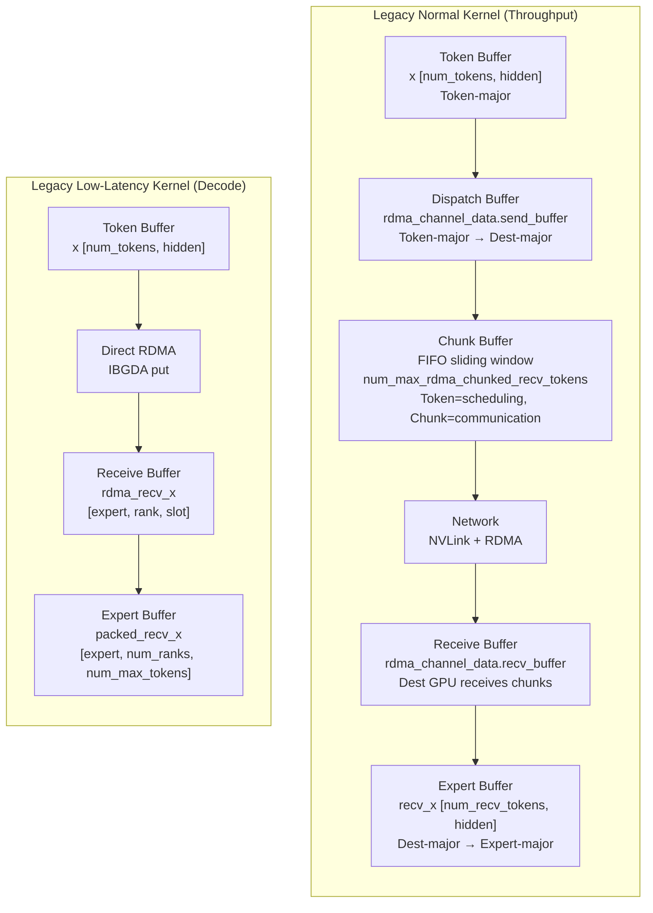
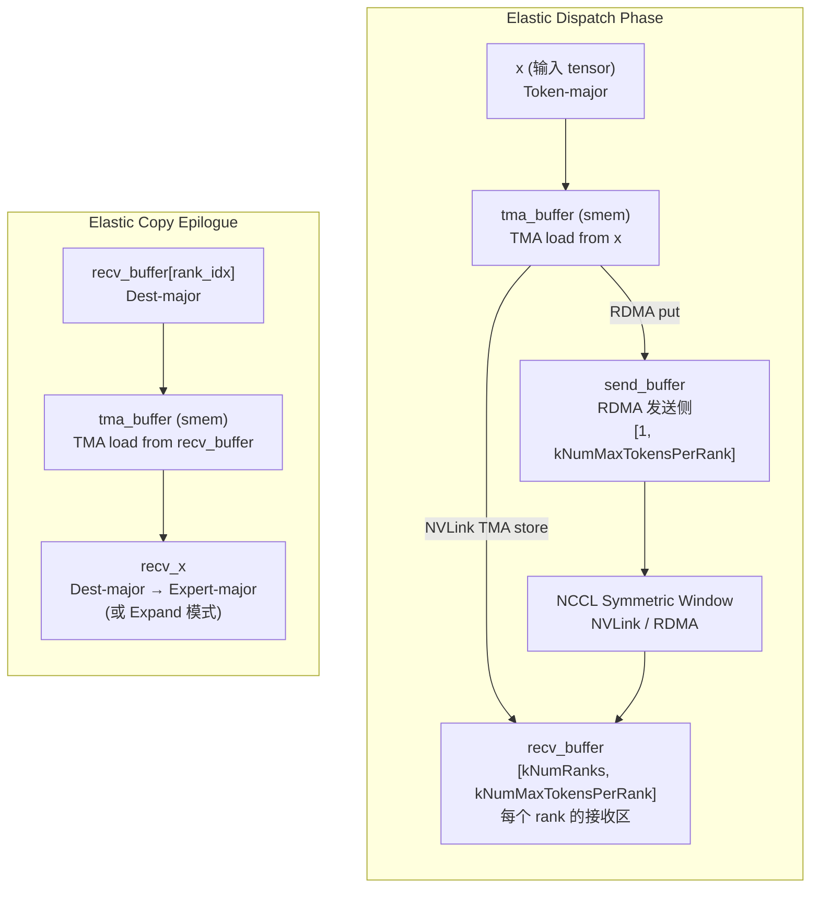
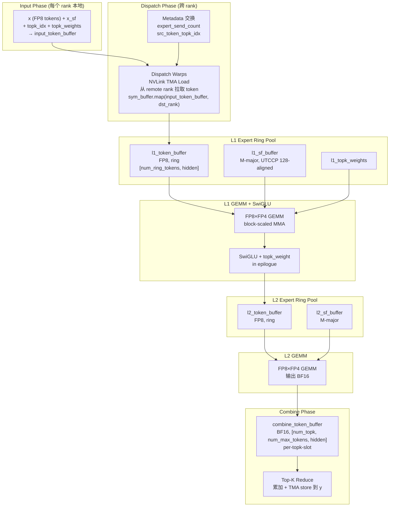
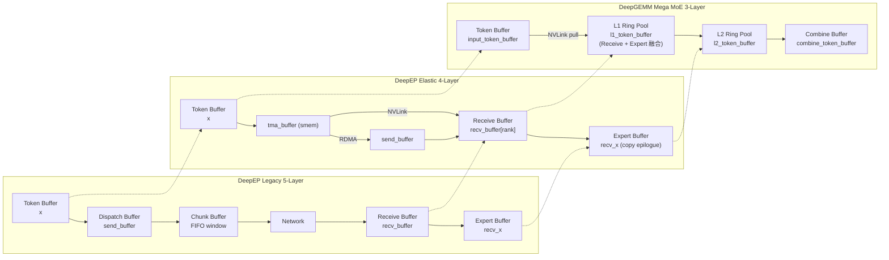

# DeepEP 5-Layer Buffer ↔ DeepEP 源码 ↔ DeepGEMM SymmBuffer 三方映射分析

> 分析日期: 2026-07-30
> 目标: 将博客描述的 5-Layer Buffer 模型精确映射到 DeepEP 实际源码和 DeepGEMM Mega MoE 实现
> 关联文档: [05_02_buffer_symmbuffer.md](05_02_buffer_symmbuffer.md)

---

## 1. Blog 原文：5-Layer Buffer 模型

博客第 2 节 "DeepEP Buffer System: Data Flow Organization Under Different Kernels" 原文描述：

### 2.1 Normal Kernel: Throughput-Optimized Complete Pipeline

> **Data path**: `Token Buffer → Dispatch Buffer → Chunk Buffer → NVLink / RDMA Pipeline → Receive Buffer → Expert Buffer`

逐层原文定义：

1. **Token Buffer**: "Stores Router output. Layout: Token-major."
2. **Dispatch Buffer**: "First layout transformation: Token-major → Destination-major."
3. **Chunk Buffer**: "Critically important. The network is unsuitable for single-Token sends — produces small packets, high startup overhead, low bandwidth utilization. Tokens are aggregated: `Token Stream → Chunk → Network Transfer`. Token is the **scheduling granularity**; Chunk is the **communication granularity**."
4. **Receive Buffer**: "Destination GPU receives Chunks from multiple GPUs."
5. **Expert Buffer**: "Final transformation: Destination-major → Expert-major, forming Expert GEMM input."

### 2.2 Low-Latency Kernel: Decode-Oriented Short Path

> Decode: small batch, few Tokens, single-Token latency sensitive. Waiting for Chunk aggregation increases latency.
> Low-Latency Kernel reduces intermediate layers:
> `Token Buffer → Direct RDMA → Receive Buffer → Expert Buffer`
> Goal: minimize end-to-end Token latency.

### 2.3 核心概念：Token vs Chunk 双粒度

| 粒度 | 角色 | 操作 |
|---|---|---|
| **Token** | scheduling granularity | Router 输出、GEMM 计算 |
| **Chunk** | communication granularity | 网络传输（NVLink/RDMA） |

---

## 2. DeepEP 源码实现：5-Layer Buffer 的精确映射

### 2.1 Legacy Buffer 系统（最贴近博客描述）

Legacy 系统（`csrc/kernels/legacy/`）是博客描述的最直接对应。从 `internode.cu` 可以看到完整的 buffer 分配：

```cpp
// csrc/kernels/legacy/internode.cu: 526-530
// RDMA symmetric layout: 每个 channel 有 send/recv 两套 buffer
auto rdma_channel_data = SymBuffer<uint8_t>(
    rdma_buffer_ptr, num_max_rdma_chunked_recv_tokens * num_bytes_per_token,
    kNumRDMARanks, channel_id, num_channels);
auto rdma_channel_meta = SymBuffer<int>(
    rdma_buffer_ptr, LEGACY_NUM_MAX_NVL_PEERS * 2 + 2,
    kNumRDMARanks, channel_id, num_channels);
```

```cpp
// csrc/kernels/legacy/internode.cu: 545-560
// NVL buffer layouts: 每个 channel 也有 send/recv
auto nvl_channel_x = AsymBuffer<uint8_t>(ws_rr_buffer_ptr,
    num_max_nvl_chunked_recv_tokens * num_bytes_per_token,
    LEGACY_NUM_MAX_NVL_PEERS, channel_id, num_channels, rs_wr_rank)
    .advance_also(rs_wr_buffer_ptr);
```

#### Legacy 的 5-Layer 对应关系

| Blog Buffer 层 | Legacy 源码对应 | 代码位置 |
|---|---|---|
| **Token Buffer** | `x` (输入 tensor, `[num_tokens, hidden]`) | `internode.cu:458` |
| **Dispatch Buffer** | `rdma_channel_data.send_buffer(rdma_rank)` / `nvl_channel_x` | `internode.cu:631, 545` |
| **Chunk Buffer** | `num_max_rdma_chunked_send_tokens` 控制的 FIFO 窗口 | `internode.cu:480, 527` |
| **Receive Buffer** | `rdma_channel_data.recv_buffer(rdma_rank)` / `nvl_channel_x` (recv 侧) | `internode.cu:527, 545` |
| **Expert Buffer** | `recv_x` (输出 tensor, 按 expert 重排) | `internode.cu:453` |

#### Chunk 机制的核心代码

```cpp
// csrc/kernels/legacy/internode.cu: 647-648
// Wait the remote buffer to be released
while (is_token_in_rank_uint64 != 0 and
       rdma_tail_idx - cached_rdma_channel_head >= num_max_rdma_chunked_recv_tokens) {
    // 等待 chunk 窗口释放
}
```

**关键洞察**: Legacy 的 Chunk 是一个 **FIFO 滑动窗口**（`head`/`tail` 控制），Token 累积到一定数量后作为一个 Chunk 发送。`num_max_rdma_chunked_recv_tokens` 定义了接收端 Chunk 缓冲区容量。

### 2.2 Elastic Buffer 系统（当前主力）

Elastic 系统（`deep_ep/buffers/elastic.py` + `csrc/kernels/elastic/`）是 DeepEP 的演进版本，核心变化是用 NCCL Symmetric Window 替代 NVSHMEM，用 TMA 替代手动 copy。

#### Buffer 布局定义

```cpp
// deep_ep/include/deep_ep/common/layout.cuh: 251-311
template <bool kWithMBarrier>
struct BufferLayout {
    TokenLayout token_layout;
    int num_ranks;
    int num_max_tokens_per_rank;
    void* base;

    // 每个 rank 的 buffer 大小
    int64_t get_num_bytes_per_rank() const {
        return num_max_tokens_per_rank * get_num_bytes_per_token();
    }

    // 总 buffer 大小 = per_rank * num_ranks
    int64_t get_num_bytes() const {
        return get_num_bytes_per_rank() * num_ranks;
    }
};
```

#### Dispatch Kernel 中的 Buffer 使用

```cpp
// deep_ep/include/deep_ep/impls/dispatch.cuh: 263-268
// Buffer layouts
const auto token_layout = layout::TokenLayout(kNumHiddenBytes, ...);
auto tma_buffer = layout::BufferLayout<true>(token_layout, kNumDispatchWarps, 1, ...);
auto recv_buffer = layout::BufferLayout<false>(token_layout, kNumRanks, kNumMaxTokensPerRank, buffer);
auto send_buffer = layout::BufferLayout<false>(token_layout, 1, kNumMaxTokensPerRank,
                                               recv_buffer.get_buffer_end_ptr());
```

**Elastic 的内存布局**：
```
buffer (全局)
├─ recv_buffer: [kNumRanks, kNumMaxTokensPerRank]  ← 所有 rank 的接收 buffer
└─ send_buffer: [1, kNumMaxTokensPerRank]          ← RDMA 发送 buffer（仅 scale-out）
```

#### Elastic 的 5-Layer 映射

| Blog Buffer 层 | Elastic 源码对应 | 代码证据 |
|---|---|---|
| **Token Buffer** | `x` (输入 tensor) | `dispatch.cuh:33` — kernel 参数 |
| **Dispatch Buffer** | `send_buffer` (RDMA 发送侧) / `tma_buffer` (smem 中转) | `dispatch.cuh:267` — `send_buffer` 用于 RDMA put |
| **Chunk Buffer** | ❌ **无显式 Chunk Buffer** | Elastic 用 `kNumDispatchWarps` 并行 + TMA 直接传输 |
| **Receive Buffer** | `recv_buffer.get_rank_buffer(rank_idx)` | `dispatch.cuh:268` — 每个 rank 的接收区 |
| **Expert Buffer** | `recv_x` (copy epilogue 输出) | `dispatch_copy_epilogue.cuh:139` — TMA store 到 `recv_x` |

#### Elastic 消除 Chunk 的关键机制

Elastic 通过以下方式消除了显式 Chunk Buffer：

1. **Warp-level 并行**: 每个 dispatch warp 独立处理一个 token，无需等待 Chunk 聚合
2. **TMA 硬件加速**: 单 token 即可发起 TMA store，硬件处理小数据包
3. **NCCL Symmetric Window**: `gin.put<team_t>()` 直接写入远端 `recv_buffer`，无需中间暂存

```cpp
// deep_ep/include/deep_ep/impls/dispatch.cuh: 373-378
// Issue TMA NVLink stores: 单 token 直接发送到远端
const auto dst_ptr = stored_dst_slot_idx >= 0 ?
    gin.get_sym_ptr<team_t>(recv_buffer.get_token_buffer(stored_dst_slot_idx).get_base_ptr(),
                           stored_dst_rank_idx) : nullptr;
if (dst_ptr != nullptr)
    ptx::tma_store_1d(dst_ptr, tma_buffer.get_base_ptr(), tma_buffer.get_num_bytes<false>());
```

### 2.3 Low-Latency Kernel 的 Buffer 路径

```cpp
// csrc/kernels/legacy/internode_ll.cu: 260-262
// 直接 RDMA put 到远端 rdma_recv_x，无中间 buffer
const auto dst_ptr = reinterpret_cast<uint64_t>(rdma_recv_x) +
    dst_expert_local_idx * num_ranks * num_max_dispatch_tokens_per_rank * num_bytes_per_msg +
    rank * num_max_dispatch_tokens_per_rank * num_bytes_per_msg + slot_idx * num_bytes_per_msg;
nvshmemi_ibgda_put_nbi_warp(dst_ptr, src_ptr, num_bytes_per_msg, dst_rank, ...);
```

**Low-Latency 路径映射**：

| Blog Buffer 层 | Low-Latency 源码对应 |
|---|---|
| **Token Buffer** | `x` (输入 tensor) |
| **Dispatch Buffer** | ❌ 无（直接 cast + send） |
| **Chunk Buffer** | ❌ 无（单 token 直接发送） |
| **Receive Buffer** | `rdma_recv_x[expert][rank][slot]` |
| **Expert Buffer** | `packed_recv_x` (按 expert 组织) |

```cpp
// csrc/kernels/legacy/internode_ll.cu: 129-136
// 接收端 buffer 结构: [num_local_experts, num_ranks, num_max_tokens_per_rank]
__global__ void dispatch(void* packed_recv_x,
                         void* packed_recv_x_scales,
                         int* packed_recv_src_info,
                         int64_t* packed_recv_layout_range,
                         int* packed_recv_count,
                         ...
                         void* rdma_recv_x,  // ← Receive Buffer
                         int* rdma_recv_count,
                         void* rdma_x,       // ← Token Buffer (send 侧)
                         ...);
```

---

## 3. DeepGEMM Mega MoE：SymmBuffer 的实现

### 3.1 SymmBuffer 整体布局

```cpp
// deep_gemm/include/deep_gemm/layout/mega_moe.cuh: 331-443
struct MegaMoEBuffer {
    Workspace workspace;
    Buffer input_token_buffer, input_sf_buffer, input_topk_idx_buffer, input_topk_weights_buffer;
    Buffer shared_l1_token_buffer, shared_l1_sf_buffer, shared_l2_token_buffer, shared_l2_sf_buffer;
    Buffer l1_token_buffer, l1_sf_buffer, l1_topk_weights_buffer;
    Buffer l2_token_buffer, l2_sf_buffer;
    Buffer combine_token_buffer;
};
```

**内存布局（从低到高）**：
```
SymmBuffer (单一大块对称内存)
┌─────────────────────────────────────────────────────────────┐
│  Workspace                                                   │
│  ├─ Grid Sync Counters (128 bytes)                           │
│  ├─ Expert Send Count (num_experts × 8)                      │
│  ├─ Expert Recv Count (num_ranks × num_experts_per_rank × 8) │
│  ├─ Expert Recv Count Sum                                     │
│  ├─ L1/L2 Full/Empty Ring Counts                             │
│  ├─ Src Token-Topk Idx (dispatch pulling 用)                  │
│  └─ Token Src Metadata (combine write-back 用)                │
├─────────────────────────────────────────────────────────────┤
│  Input Token Buffer (FP8, [num_max_tokens_per_rank, hidden])  │
├─────────────────────────────────────────────────────────────┤
│  Input SF Buffer (per-32 UE8M0)                               │
├─────────────────────────────────────────────────────────────┤
│  Input TopK Idx Buffer (int64)                                │
├─────────────────────────────────────────────────────────────┤
│  Input TopK Weights Buffer (float32)                          │
├─────────────────────────────────────────────────────────────┤
│  Shared Expert Buffers (L1/L2)                                │
├─────────────────────────────────────────────────────────────┤
│  L1 Token Buffer (FP8, ring, [num_ring_tokens, hidden])       │
├─────────────────────────────────────────────────────────────┤
│  L1 SF Buffer (M-major, UTCCP 128-aligned)                    │
├─────────────────────────────────────────────────────────────┤
│  L1 TopK Weights Buffer (per-pool-token)                      │
├─────────────────────────────────────────────────────────────┤
│  L2 Token Buffer (FP8, ring)                                  │
├─────────────────────────────────────────────────────────────┤
│  L2 SF Buffer (M-major)                                       │
├─────────────────────────────────────────────────────────────┤
│  Combine Token Buffer (BF16, [num_topk, num_max_tokens, hidden])│
└─────────────────────────────────────────────────────────────┘
```

### 3.2 Dispatch 阶段的 Buffer 使用

```cpp
// sm100_fp8_fp4_mega_moe.cuh: 533-555
// Dispatch warp 从 remote rank 的 input_token_buffer 直接拉取
const auto src_base_ptr = sym_buffer.map(
    buffer.input_token_buffer.get_data_buffer(src_token_idx).get_base_ptr(),
    current_rank_in_expert_idx);  // ← 映射到 remote rank 地址空间
const auto dst_base_ptr = buffer.l1_token_buffer.get_data_buffer(pool_token_idx % kNumRingTokens).get_base_ptr();

// TMA load from remote, store to local L1 ring buffer
for (uint32_t i = 0; i < kNumChunks; ++ i) {
    ptx::tma_load_1d(pull_buffer.get_base_ptr(),
                     math::advance_ptr(src_base_ptr, i * kNumBytesPerPull),
                     pull_mbarrier, kNumBytesPerPull);
    ptx::mbarrier_arrive_and_set_tx(pull_mbarrier, kNumBytesPerPull);
    issue_and_wait_pull_store(i);
}
```

### 3.3 Combine 阶段的 Buffer 使用

```cpp
// sm100_fp8_fp4_mega_moe.cuh: 1294-1299
// Epilogue warp 将 L2 输出写回 remote rank 的 combine buffer
const auto dst_token = buffer.combine_token_buffer
    .get_rank_buffer(dst_topk_idx)
    .get_data_buffer(dst_token_idx);
const auto dst_ptr = math::advance_ptr<float4>(
    dst_token.get_base_ptr(),
    n_idx * sizeof(nv_bfloat16) + (lane_idx % 16) * sizeof(float4));
*sym_buffer.map(dst_ptr, dst_rank_idx) = packed;  // ← NVLink write-back
```

```cpp
// sm100_fp8_fp4_mega_moe.cuh: 1386-1449
// Combine: 从 combine_token_buffer 读取 top-k 结果，reduce 后写回 y
for (uint32_t token_idx = sm_idx * kNumEpilogueWarps + epilogue_warp_idx;
     token_idx < num_tokens; token_idx += kNumSMs * kNumEpilogueWarps) {
    // 读取 top-k slot indices
    const int stored_topk_slot_idx = lane_idx < kNumTopk ?
        static_cast<int>(__ldg(buffer.input_topk_idx_buffer.get_base_ptr<int64_t>() + ...)) : -1;

    // 对每个 chunk: 加载 top-k → accumulate → cast → store
    for (uint32_t chunk = 0; chunk < kNumChunks; ++ chunk) {
        // 加载所有 top-k 贡献
        while (move_mask_and_load(load_stage_idx)) {
            combine_load_barriers[load_stage_idx]->wait(combine_phase);
            for (uint32_t j = 0; j < kNumUint4PerLane; ++ j)
                ptx::accumulate(reduced[j * kNumElemsPerUint4 + l], bf16_values[l]);
        }
        // Cast + TMA store 到输出 y
        ptx::tma_store_1d(math::advance_ptr(y, token_idx * kNumHiddenBytes + chunk_byte_offset),
                         combine_store_buffer, kNumChunkBytes);
    }
}
```

### 3.4 SymmBuffer 的 5-Layer 映射

| Blog Buffer 层 | SymmBuffer 对应段 | 代码证据 |
|---|---|---|
| **Token Buffer** | `input_token_buffer` + `input_sf_buffer` + `input_topk_idx_buffer` + `input_topk_weights_buffer` | `mega_moe.cuh:387-398` |
| **Dispatch Buffer** | ❌ **无独立对应** | dispatch warps 直接 NVLink pull |
| **Chunk Buffer** | ❌ **无独立对应** | token 级直接传输，无聚合 |
| **Receive Buffer** | `l1_token_buffer` (ring pool) | `mega_moe.cuh:413-414` — 接收目标 |
| **Expert Buffer (L1)** | `l1_token_buffer` + `l1_sf_buffer` + `l1_topk_weights_buffer` | `mega_moe.cuh:413-424` |
| **Expert Buffer (L2)** | `l2_token_buffer` + `l2_sf_buffer` | `mega_moe.cuh:426-431` |
| **Combine Buffer** | `combine_token_buffer` (BF16) | `mega_moe.cuh:433-435` |

---

## 4. 三方对比表

### 4.1 Buffer 层级对比

| 维度 | DeepEP Legacy | DeepEP Elastic | DeepGEMM Mega MoE |
|---|---|---|---|
| **Buffer 层级** | 5 层 (Token→Dispatch→Chunk→Receive→Expert) | 4 层 (无显式 Chunk) | 3 层 (Input→Pool→Combine) |
| **Token Buffer** | `x` (输入 tensor) | `x` (输入 tensor) | `input_token_buffer` |
| **Dispatch Buffer** | `rdma_channel_data.send_buffer` | `send_buffer` (仅 RDMA) | ❌ 无 |
| **Chunk Buffer** | `num_max_rdma_chunked_recv_tokens` FIFO | ❌ 无 | ❌ 无 |
| **Receive Buffer** | `rdma_channel_data.recv_buffer` | `recv_buffer[rank]` | `l1_token_buffer` (ring pool) |
| **Expert Buffer** | `recv_x` (按 expert 重排) | `recv_x` (copy epilogue) | `l1/l2_token_buffer` |
| **Combine Buffer** | `recv_x` (combine 输出) | `recv_x` (combine 输出) | `combine_token_buffer` (BF16) |
| **Normal/LL 分离** | 两套 kernel + buffer | 两套 kernel + buffer | 单一套 buffer |
| **通信模型** | Push (source 主动发送) | Push (source 主动发送) | **Pull** (dest 主动拉取) |
| **内存模型** | NVSHMEM symmetric | NCCL Symmetric Window | Symmetric Memory + 地址映射 |
| **Chunk 聚合** | 有 (FIFO 滑动窗口) | 无 (warp 并行 + TMA) | 无 (token 级 pull) |

### 4.2 通信范式对比

```
DeepEP Legacy (Push):
  Source GPU: "我要发 token X 给 Dest GPU"
    → 写入本地 send_buffer
    → RDMA/NVLink put 到 Dest 的 recv_buffer
    → Dest 从 recv_buffer 读取

DeepEP Elastic (Push + TMA):
  Source GPU: "我要发 token X 给 Dest GPU"
    → TMA store 直接写入 Dest 的 recv_buffer (NVLink)
    → 或写入本地 send_buffer + RDMA put (scale-out)

DeepGEMM Mega MoE (Pull):
  Dest GPU: "我需要 token X 从 Source GPU"
    → TMA load 从 Source 的 input_token_buffer 直接拉取
    → 写入本地 l1_token_buffer (ring pool)
```

### 4.3 关键差异总结

| 差异点 | DeepEP | Mega MoE |
|---|---|---|
| **Dispatch 方式** | 显式 Dispatch Kernel + 中间 buffer | Warp 直接 NVLink pull，无中间 buffer |
| **Chunk 聚合** | Legacy 有（Normal Kernel） | 无（token 级） |
| **Receive/Expert 分离** | 两个独立 buffer | 融合为 ring pool |
| **Normal/LL 分离** | 两套 kernel + buffer | 单一套 buffer |
| **通信方向** | Push | Pull |
| **地址映射** | NVSHMEM 物理地址 | SymBuffer.map() 逻辑映射 |
| **同步粒度** | Chunk 级 (FIFO) | Token 级 (arrival count) |

---

## 5. Buffer 与其他子系统的交叉引用

### 5.1 Buffer ↔ Dispatch/Combine (Agent 1)

**Dispatch 是 Buffer 的写入者**：

```cpp
// dispatch.cuh: 362-378
// Dispatch warp 将 token 写入 send_buffer 或远端 recv_buffer
auto send_buffer_ptr = send_buffer.get_token_buffer(token_idx).get_base_ptr();
if constexpr (not kIsScaleupNVLink) {
    ptx::tma_store_1d(send_buffer_ptr, tma_buffer.get_base_ptr(), ...);  // → send_buffer
}
// NVLink: 直接写入远端 recv_buffer
ptx::tma_store_1d(dst_ptr, tma_buffer.get_base_ptr(), ...);
```

**Combine 是 Buffer 的读取者**：

```cpp
// combine.cuh: 96-106
// Combine warp 从 recv_buffer 读取 token，写回 send_buffer 或远端
layout::TokenLayout master_token_buffer = [=]() {
    if (nvlink_bypass) {
        auto token_buffer = recv_buffer.get_rank_buffer(...).get_token_buffer(src_token_idx);
        token_buffer.set_base_ptr(gin.get_sym_ptr<team_t>(token_buffer.get_base_ptr(), src_rank_idx));
        return token_buffer;
    }
    return send_buffer.get_rank_buffer(src_rank_idx).get_token_buffer(src_token_idx);
}();
```

**Mega MoE 的融合**：

```cpp
// sm100_fp8_fp4_mega_moe.cuh: 533-598
// Dispatch pull + L1 buffer 写入 在同一 kernel 内完成
const auto src_base_ptr = sym_buffer.map(
    buffer.input_token_buffer.get_data_buffer(src_token_idx).get_base_ptr(),
    current_rank_in_expert_idx);
const auto dst_base_ptr = buffer.l1_token_buffer.get_data_buffer(pool_token_idx % kNumRingTokens).get_base_ptr();
// TMA load from remote → TMA store to local L1
```

### 5.2 Buffer ↔ Chunk Streaming (Agent 9)

**Legacy 的 Chunk Streaming**：

```cpp
// internode.cu: 526-530
// Chunk 是一个 FIFO 滑动窗口
auto rdma_channel_data = SymBuffer<uint8_t>(
    rdma_buffer_ptr, num_max_rdma_chunked_recv_tokens * num_bytes_per_token, ...);
// head/tail 控制 chunk 的发送和释放
```

**Elastic 的替代**：

Elastic 用 **warp 并行 + TMA** 替代 Chunk Streaming：
- 每个 warp 独立处理 token，无需等待 Chunk 聚合
- TMA store 直接发起，硬件处理流水线

**Mega MoE 的替代**：

Mega MoE 用 **token 级 pull + ring buffer** 替代 Chunk Streaming：
- Dispatch warps 按全局 token 索引轮转处理
- 每个 token 独立通过 NVLink pull
- Ring buffer 的 full/empty count 控制流式传输

```cpp
// sm100_fp8_fp4_mega_moe.cuh: 526-531
// Ring buffer 空位检查 (替代 Chunk FIFO)
const auto l1_empty_count_target = (pool_block_idx / kNumRingBlocks) * kNumL1BlockNs;
if (l1_empty_count_target > 0) {
    const auto empty_ptr = workspace.get_l1_empty_count_ptr(pool_block_idx % kNumRingBlocks);
    while (ptx::ld_acq(empty_ptr) < l1_empty_count_target);  // 等待空位
}
```

### 5.3 Buffer ↔ FIFO (Agent 4)

**Legacy FIFO 机制**：

```cpp
// internode.cu: 565-567
__shared__ int rdma_send_channel_tail[kNumRDMARanks];
__shared__ uint32_t rdma_send_channel_window[kNumRDMARanks];
// FIFO head/tail 控制 chunk 发送窗口
```

**Elastic 的替代**：

Elastic 用 **NCCL Symmetric Window + GPU Barrier** 替代 FIFO：
- `comm::gpu_barrier<kIsScaleupNVLink, ...>()` 提供全局同步
- 无需显式 FIFO，依赖 NCCL 的流控

**Mega MoE 的 Ring Buffer**：

```cpp
// mega_moe.cuh: 98-111
// L1/L2 ring buffer 的 full/empty count
num_bytes += num_ring_blocks * sizeof(uint32_t);  // L1 full count
num_bytes += num_ring_blocks * sizeof(uint32_t);  // L1 empty count
num_bytes += num_ring_blocks * sizeof(uint32_t);  // L2 full count
num_bytes += num_ring_blocks * sizeof(uint32_t);  // L2 empty count
```

```cpp
// sm100_fp8_fp4_mega_moe.cuh: 593-596
// 写入完成后增加 full count
ptx::red_add_rel(workspace.get_l1_full_count_ptr(pool_block_idx % kNumRingBlocks),
                 is_last_token ? BLOCK_M - (token_idx_in_expert % BLOCK_M) : 1u);
```

---

## 6. Buffer 层级 Mermaid 图

### 6.1 DeepEP Legacy 5-Layer Buffer (Mermaid)



### 6.2 DeepEP Elastic Buffer (Mermaid)



### 6.3 DeepGEMM SymmBuffer (Mermaid)



### 6.4 三方对比 Mermaid (Mermaid)



---

## 7. 核心洞察

### 7.1 Buffer 演化的主线

```
Legacy (5 层)  →  Elastic (4 层)  →  Mega MoE (3 层)
   ↓                 ↓                  ↓
Chunk 有            Chunk 无            Chunk 无
Dispatch 有         Dispatch 弱          Dispatch 无
Receive/Expert 分离  Receive/Expert 分离   Receive/Expert 融合
Push 模型           Push 模型            Pull 模型
```

### 7.2 为什么 Mega MoE 可以消除 Dispatch/Chunk Buffer

1. **Symmetric Memory 的地址对称性**: 任何 rank 可以直接访问任何其他 rank 的 buffer，无需 "打包-发送-解包"
2. **Persistent Kernel + Warp Specialization**: dispatch warps 和 GEMM warps 同时运行，dispatch 可以按需实时 pull
3. **NVLink 的全连接拓扑**: 节点内所有 GPU 两两直连，pull 和 send 的延迟差异不大
4. **Decode 场景为主**: 小 batch 下 chunk 聚合无收益，直接 token 级传输更优

### 7.3 Pull vs Push 的范式转变

| 维度 | Push (DeepEP) | Pull (Mega MoE) |
|---|---|---|
| **控制权** | Source 决定何时发送 | Dest 决定何时拉取 |
| **速率控制** | 发送方可能溢出接收方 | 接收方天然控制速率 |
| **负载均衡** | 需要额外机制 | 天然均衡（处理快的 rank 多 pull） |
| **同步** | 全局 "发送完毕" 信号 | per-block arrival count |
| **Buffer 层级** | 需要 Dispatch Buffer 暂存 | 无需中间 buffer |

### 7.4 Ring Buffer vs FIFO

| 维度 | Legacy FIFO | Mega MoE Ring Buffer |
|---|---|---|
| **粒度** | Chunk 级 | Token 级 |
| **同步** | head/tail 原子操作 | full/empty count |
| **容量** | `num_max_rdma_chunked_recv_tokens` | `num_ring_tokens` (per expert) |
| **复用** | 单次使用 | 环形复用 |
| **与 GEMM 集成** | 分离 | 紧密集成 (full count 触发 GEMM) |

---

## 8. 代码索引

| 文件 | 关键内容 |
|---|---|
| `deep_ep/buffers/elastic.py` | ElasticBuffer Python 类 |
| `deep_ep/buffers/legacy.py` | Legacy Buffer Python 类 |
| `deep_ep/include/deep_ep/common/layout.cuh` | TokenLayout, BufferLayout, WorkspaceLayout |
| `csrc/kernels/legacy/buffer.cuh` | Legacy SymBuffer / AsymBuffer |
| `csrc/kernels/legacy/internode.cu` | Legacy internode dispatch (5-Layer 完整实现) |
| `csrc/kernels/legacy/internode_ll.cu` | Legacy low-latency dispatch |
| `csrc/kernels/elastic/dispatch.hpp` | Elastic dispatch 启动逻辑 |
| `deep_ep/include/deep_ep/impls/dispatch.cuh` | Elastic dispatch kernel (buffer 使用) |
| `deep_ep/include/deep_ep/impls/dispatch_copy_epilogue.cuh` | Elastic copy epilogue (Expert Buffer 生成) |
| `deep_ep/include/deep_ep/impls/combine.cuh` | Elastic combine kernel (buffer 使用) |
| `deep_gemm/include/deep_gemm/layout/sym_buffer.cuh` | SymBuffer 地址映射 |
| `deep_gemm/include/deep_gemm/layout/mega_moe.cuh` | MegaMoEBuffer 完整布局 |
| `deep_gemm/mega/__init__.py` | SymmBuffer Python 类 |
| `deep_gemm/include/deep_gemm/impls/sm100_fp8_fp4_mega_moe.cuh` | Mega MoE kernel (dispatch/GEMM/combine) |

---

## 9. 参考源码片段

### 9.1 Legacy 5-Layer 完整数据流

```cpp
// internode.cu: 631-632
// Token → Dispatch Buffer (send_buffer)
auto send_buffer = lane_id == rdma_rank ?
    rdma_channel_data.recv_buffer(lane_id) :    // 本地: recv_buffer 复用
    rdma_channel_data.send_buffer(lane_id);       // 远端: send_buffer

// internode.cu: 647-648
// Chunk: FIFO 滑动窗口控制
while (rdma_tail_idx - cached_rdma_channel_head >= num_max_rdma_chunked_recv_tokens);

// internode.cu: 617-624
// Network: RDMA put 到远端 recv_buffer
nvshmemi_ibgda_put_nbi_warp<true>(..., rdma_channel_meta.recv_buffer(rdma_rank), ...);

// internode.cu: 453
// Expert Buffer: recv_x (输出 tensor)
__global__ void dispatch(int4* recv_x, float* recv_x_scales, ...);
```

### 9.2 Elastic Buffer 分配

```cpp
// dispatch.cuh: 263-268
const auto token_layout = layout::TokenLayout(kNumHiddenBytes, ...);
auto tma_buffer = layout::BufferLayout<true>(token_layout, kNumDispatchWarps, 1, ...);
auto recv_buffer = layout::BufferLayout<false>(token_layout, kNumRanks, kNumMaxTokensPerRank, buffer);
auto send_buffer = layout::BufferLayout<false>(token_layout, 1, kNumMaxTokensPerRank,
                                               recv_buffer.get_buffer_end_ptr());
```

### 9.3 Mega MoE SymmBuffer 分配

```cpp
// mega_moe.cuh: 387-435
input_token_buffer = Buffer(input_token_layout, 1, num_max_tokens_per_rank, workspace.get_end_ptr());
input_sf_buffer = Buffer(input_sf_layout, 1, num_max_tokens_per_rank, input_token_buffer.get_end_ptr());
input_topk_idx_buffer = Buffer(input_topk_idx_layout, 1, num_max_tokens_per_rank, ...);
input_topk_weights_buffer = Buffer(input_topk_weights_layout, 1, num_max_tokens_per_rank, ...);
l1_token_buffer = Buffer(input_token_layout, 1, num_ring_tokens, ...);
l1_sf_buffer = Buffer(input_sf_layout, 1, num_sf_ring_tokens, ...);
l2_token_buffer = Buffer(intermediate_token_layout, 1, num_ring_tokens, ...);
l2_sf_buffer = Buffer(intermediate_sf_layout, 1, num_sf_ring_tokens, ...);
combine_token_buffer = Buffer(bf16_token_layout, num_topk, num_max_tokens_per_rank, ...);
```

### 9.4 Mega MoE Dispatch Pull

```cpp
// sm100_fp8_fp4_mega_moe.cuh: 533-555
const auto src_base_ptr = sym_buffer.map(
    buffer.input_token_buffer.get_data_buffer(src_token_idx).get_base_ptr(),
    current_rank_in_expert_idx);
const auto dst_base_ptr = buffer.l1_token_buffer.get_data_buffer(pool_token_idx % kNumRingTokens).get_base_ptr();
for (uint32_t i = 0; i < kNumChunks; ++ i) {
    ptx::tma_load_1d(pull_buffer.get_base_ptr(),
                     math::advance_ptr(src_base_ptr, i * kNumBytesPerPull),
                     pull_mbarrier, kNumBytesPerPull);
    ptx::mbarrier_arrive_and_set_tx(pull_mbarrier, kNumBytesPerPull);
    issue_and_wait_pull_store(i);
}
```

### 9.5 Mega MoE Combine Write-back

```cpp
// sm100_fp8_fp4_mega_moe.cuh: 1294-1299
const auto dst_token = buffer.combine_token_buffer
    .get_rank_buffer(dst_topk_idx)
    .get_data_buffer(dst_token_idx);
const auto dst_ptr = math::advance_ptr<float4>(
    dst_token.get_base_ptr(),
    n_idx * sizeof(nv_bfloat16) + (lane_idx % 16) * sizeof(float4));
*sym_buffer.map(dst_ptr, dst_rank_idx) = packed;
```

---

*分析基于 DeepEP 源码 (legacy + elastic) 与 DeepGEMM Mega MoE 源码，对照博客文本 Section 2*
