# Warp Specialization 三方对比: 博客理论 ↔ DeepEP 源码 ↔ DeepGEMM Mega MoE

> 分析日期: 2026-07-30
> 目标: 验证博客 Section 5 的 Warp Specialization 描述是否与 DeepEP 源码一致，并对比 DeepGEMM Mega MoE 的实现

---

## 1. 核心结论 (TL;DR)

**博客描述的 "Send → Forward → Receive" 三阶段 Warp Specialization 在 DeepEP 源码中部分成立，但需要重要修正：**

| 维度 | 博客描述 | 实际 DeepEP 源码 | DeepGEMM Mega MoE |
|------|---------|-----------------|-------------------|
| **Warp 角色数** | 3 (Send/Forward/Receive) | **4** (Notify + Scaleout + Forward + 隐式接收) | **4+** (Dispatch + TMA Load + MMA Issue + Epilogue) |
| **流水线** | Send → Forward → Receive | Notify → Scaleout Send → Forward → (接收隐含) | Dispatch → TMA Load → MMA → Epilogue |
| **定位** | 纯通信 kernel | 纯通信 kernel (多节点) | 通信+计算融合 kernel |
| **关键差异** | 未提及 Notify warps | Notify warps 负责元数据同步 | 无 Notify，Dispatch 兼具计数+拉取 |

**关键洞察**: 博客描述的是 DeepEP **hybrid (多节点)** 模式下的 Warp Specialization。单节点 (scale-up only) 模式只有 Notify + Dispatch 两种 warp 角色。

---

## 2. 博客原文: Warp Specialization 描述

博客 Section 5 原文:

> **5. Warp Specialization: Pipelined Execution Inside the Communication Kernel**
>
> Warp Specialization in DeepEP is **not** about GPU role assignment or SMs dedicated to compute/communication. It is primarily used for **parallelizing different stages within the communication Kernel**.
>
> Different Warp Groups handle:
> - Warp Group A: IB Sending
> - Warp Group B: IB-NVLink Forwarding
> - Warp Group C: NVLink Receiving
>
> Forming: **Send → Forward → Receive**

博客 Section 4.2 进一步说明:

> Normal Kernel divides into three roles:
> Source GPU → IB Sending → RDMA Network → IB-to-NVLink Forwarding → NVLink Receiving → Target GPU

**分析**: 博客将 Warp Specialization 描述为通信 kernel 内部的三阶段流水线并行化，核心目的是解决 GPU-NIC 拓扑不对称问题。

---

## 3. DeepEP 实际实现: Warp 角色分析

### 3.1 单节点模式 (dispatch.cuh / combine.cuh)

**文件**: `deep_ep/include/deep_ep/impls/dispatch.cuh`

```cpp
// 21-30 行: 模板参数定义两种 warp 角色
template <bool kIsScaleupNVLink,
          bool kDoCPUSync,
          bool kReuseSlotIndices,
          int kNumSMs,
          int kNumNotifyWarps, int kNumDispatchWarps,  // ← 只有两种 warp 角色
          int kNumRanks, ...>
__global__ void __launch_bounds__(kNumThreads, 1)
dispatch_impl(...) {
    // ...
    // 79 行: warp 分派
    if (warp_idx < kNumNotifyWarps) {
        // Notify warps: 元数据计数、前缀和、peer 通知
        // - atomicAdd 统计 expert_count / rank_count
        // - full-grid reduction
        // - 写入 peer 的 rank_expert_count
        // - 计算 prefix sum
    } else {
        // Dispatch warps: 数据搬运
        // - TMA load token from global memory
        // - TMA store to send buffer
        // - NVLink store (tma_store_1d to sym_ptr)
        // - RDMA put (gin.put)
    }
}
```

**单节点模式 Warp 角色:**

```
┌───────────────────────────────────────────────────────────────┐
│              DeepEP Scale-up Only CTA                          │
├────────────────────────────┬──────────────────────────────────┤
│ Notify Warps               │ Dispatch Warps                   │
│ (warp_idx < kNumNotifyWarps)│ (warp_idx >= kNumNotifyWarps)    │
├────────────────────────────┼────────────────────────────────┤
│ • Expert/Rank 计数          │ • TMA Load tokens              │
│ • Prefix sum 计算           │ • TMA Store to send buffer     │
│ • Peer 元数据同步           │ • NVLink Store (对称内存)       │
│ • Host workspace 写入       │ • RDMA Put (若非 NVLink 可达)   │
└────────────────────────────┴──────────────────────────────────┘
```

**注意**: 单节点模式下**没有 Forward warps**，因为所有 GPU 通过 NVLink 直接可达。

### 3.2 多节点 Hybrid 模式 (hybrid_dispatch.cuh) — 关键发现

**文件**: `deep_ep/include/deep_ep/impls/hybrid_dispatch.cuh`

```cpp
// 16-32 行: 模板参数定义**三种**数据路径 warp 角色
template <bool kDoCPUSync,
          bool kReuseSlotIndices,
          int kNumSMs,
          int kNumNotifyWarps, int kNumScaleoutWarps, int kNumForwardWarps,  // ← 三种!
          int kNumScaleoutRanks, int kNumScaleupRanks,
          int kNumHiddenBytes, int kNumSFPacks,
          int kNumMaxTokensPerRank,
          int kNumExperts, int kNumTopk, int kExpertAlignment,
          int kNumQPs, int64_t kNumTimeoutCycles,
          int kNumNotifyThreads = kNumNotifyWarps * 32,
          int kNumScaleoutSendThreads = kNumScaleoutWarps * 32,
          int kNumForwardThreads = kNumForwardWarps * 32,
          int kNumThreads = kNumNotifyThreads + kNumScaleoutSendThreads + kNumForwardThreads>
__global__ void __launch_bounds__(kNumThreads, 1)
hybrid_dispatch_impl(...) {
```

**Hybrid Dispatch 的 Warp 分派:**

```cpp
// 107 行: 三种 warp 角色
if (warp_idx < kNumNotifyWarps) {
    // ====== Notify Warps ======
    // 功能: 元数据收集与同步
    // 1. atomicAdd 统计 expert_count / rank_count
    // 2. full-grid reduction
    // 3. 写入 scale-out peers 的 rank_expert_count (RDMA)
    // 4. 写入 scale-up peers 的 rank_expert_count (NVLink)
    // 5. 计算 prefix sum

} else if (warp_idx < kNumNotifyWarps + kNumScaleoutWarps) {
    // ====== Scaleout Warps (IBGDA/RDMA Sending) ======
    // 功能: 跨节点数据发送
    // 389 行:
    for (int token_idx = channel_idx; token_idx < num_tokens; token_idx += kNumChannels) {
        // TMA load token
        // TMA store to scaleout_send_buffer
        // gin.put<ncclTeamTagRail>(..., stored_dst_scaleout_rank_idx)  // IBGDA!
        // Issue scale-out tail update
    }

} else {
    // ====== Forward Warps (NVLink Forwarding) ======
    // 功能: 从 scale-out 接收 buffer 转发到 scale-up 目标
    // 484 行: "Forward tokens from scale-out ranks"
    const int forward_warp_idx = warp_idx - (kNumNotifyWarps + kNumScaleoutWarps);
    // ...
    // 538 行: 从 scaleout_recv_buffer 读取
    for (int slot_idx = start_slot_idx; slot_idx < end_slot_idx; ++ slot_idx) {
        const auto token_buffer = recv_buffer.get_token_buffer(slot_idx);
        // TMA load into shared memory
        // TMA store to scaleup_buffer (NVLink sym_ptr)
    }
}
```

**Hybrid Dispatch Warp 角色完整视图:**

```
┌─────────────────────────────────────────────────────────────────────────────────┐
│                    DeepEP Hybrid Dispatch CTA                                    │
├──────────────────┬──────────────────────────┬───────────────────────────────────┤
│ Notify Warps     │ Scaleout Warps           │ Forward Warps                     │
│ (元数据同步)      │ (IBGDA/RDMA 跨节点发送)   │ (NVLink 节点内转发)                │
├──────────────────┼──────────────────────────┼───────────────────────────────────┤
│ • Expert 计数     │ • Token TMA Load         │ • 从 scaleout_recv 读取           │
│ • Rank 计数       │ • Send buffer 写入        │ • TMA Load → smem                 │
│ • Prefix sum     │ • IBGDA put (RDMA)       │ • TMA Store → scaleup_buffer     │
│ • Peer 元数据同步  │ • Tail update            │ • 按 scale-up rank 分发            │
│ • Grid sync      │ • Channel 流控            │ • Linked list 索引维护             │
└──────────────────┴──────────────────────────┴───────────────────────────────────┘
```

### 3.3 Hybrid Combine 的 Warp 角色

**文件**: `deep_ep/include/deep_ep/impls/hybrid_combine.cuh`

```cpp
// 25 行: 两种 warp 角色
int kNumWarps = kNumScaleupWarps + kNumForwardWarps;

// 106 行: warp 分派
if (warp_idx < kNumScaleupWarps) {
    // ====== Scaleup Warps (节点内发送) ======
    // 功能: 从本地 buffer 发送到 scale-up peers
    // 241 行: TMA load from global memory
    // 328 行: TMA store to remote scale-up buffer
    // 127 行: update_tails (通知 forward warps)

} else {
    // ====== Forward Warps (节点间转发) ======
    // 功能: 从 scale-up buffer 转发到 scale-out peers
    const auto forward_warp_idx = warp_idx - kNumScaleupWarps;
    // 467 行: TMA load from scaleup_buffer
    // 477 行: TMA store to scaleout_send_buffer
    // 484 行: gin.put<ncclTeamTagRail> (RDMA)
}
```

**注意**: Hybrid Combine 还使用了**寄存器重分配**:

```cpp
// 101-103 行
const bool kAdjustRegisters = (kNumChannelsPerSM == 4 or kNumChannelsPerSM == 8) and not kUseExpandedLayout;
constexpr int kNumRegistersForScaleupWarps = 40;      // 少
constexpr int kNumRegistersForForwardWarps = 256 - kNumRegistersForScaleupWarps;  // 多 (216)
```

---

## 4. DeepGEMM Mega MoE 的 Warp Specialization

### 4.1 线程配置

**文件**: `DeepGEMM/csrc/jit_kernels/heuristics/mega_moe.hpp`

```cpp
// 205-206 行
const int num_dispatch_threads = 128;      // 4 warps
const int num_non_epilogue_threads = 128;  // 4 warps (TMA load + MMA issue)
// num_epilogue_threads 由 heuristics 决定 (通常 256 = 8 warps)
```

### 4.2 Warp 角色分派

**文件**: `DeepGEMM/deep_gemm/include/deep_gemm/impls/sm100_fp8_fp4_mega_moe.cuh`

```cpp
// 44-49 行: warp 角色定义
uint32_t kNumDispatchWarps = kNumDispatchThreads / 32,           // 4 warps
uint32_t kNumMMANonEpilogueWarps = kNumNonEpilogueThreads / 32, // 4 warps
uint32_t kNumEpilogueWarps = kNumEpilogueThreads / 32,           // 8 warps
uint32_t kNumEpilogueWarpgroups = kNumEpilogueWarps / 4,        // 2 WGs
uint32_t kNumThreads = kNumDispatchThreads + kNumNonEpilogueThreads + kNumEpilogueThreads;
// 总计: 512 threads = 16 warps per CTA

// 328 行: warp 分派主逻辑
if (warp_idx < kNumDispatchWarps) {
    // ====== Warp 0-3: Dispatch Warps (48 regs) ======
    cutlass::arch::warpgroup_reg_dealloc<kNumDispatchRegisters>();
    // 功能:
    // 1. Expert token 计数 (atomicAdd)
    // 2. Grid sync 后写入 expert count
    // 3. NVLink Pull: TMA load tokens from remote rank
    // 4. red_add_rel 更新 l1_arrival_count

} else if (warp_idx == kNumDispatchWarps) {
    // ====== Warp 4: TMA Load for Tokens + SFA (40 regs) ======
    cutlass::arch::warpgroup_reg_dealloc<kNumNonEpilogueRegisters>();
    // TMA copy tokens from L1 → smem_a
    // TMA copy SFA (scale factor A)

} else if (warp_idx == kNumDispatchWarps + 1) {
    // ====== Warp 5: TMA Load for Weights + SFB (40 regs) ======
    cutlass::arch::warpgroup_reg_dealloc<kNumNonEpilogueRegisters>();
    // TMA copy weights from global → smem_b
    // TMA copy SFB (scale factor B)

} else if (warp_idx == kNumDispatchWarps + 2) {
    // ====== Warp 6: MMA Issue (40 regs) ======
    cutlass::arch::warpgroup_reg_dealloc<kNumNonEpilogueRegisters>();
    // 创建 UMMA 指令描述符
    // 等待 full_barriers
    // UTCCP copy SFA/SFB to TMEM
    // Issue UMMA to Tensor Core
    // Commit to empty barrier

} else if (warp_idx == kNumDispatchWarps + 3) {
    // ====== Warp 7: 预留 (40 regs) ======
    cutlass::arch::warpgroup_reg_dealloc<kNumNonEpilogueRegisters>();

} else if (warp_idx >= kNumDispatchWarps + kNumMMANonEpilogueWarps) {
    // ====== Warp 8-15: Epilogue (208 regs) ======
    cutlass::arch::warpgroup_reg_alloc<kNumEpilogueRegisters>();
    // L1 Epilogue:
    //   - TMEM Load
    //   - SwiGLU: silu(gate) * up
    //   - Amax reduction + SF 计算
    //   - Cast to FP8 + STSM store
    //   - TMA Store
    // L2 Epilogue:
    //   - TMEM Load
    //   - Write to remote combine buffer (NVLink)
    // Combine:
    //   - Top-K reduce
    //   - TMA Store to output
}
```

### 4.3 Mega MoE Warp 角色视图

```
┌───────────────────────────────────────────────────────────────────────────────┐
│                   Mega MoE CTA (512 threads = 16 warps)                       │
├──────────┬──────────┬──────────┬─────────────────────────────────────────────┤
│Warp 0-3  │Warp 4-5  │Warp 6-7  │Warp 8-15                                   │
│Dispatch  │TMA Load  │MMA Issue │Epilogue (8 warps = 2 WGs)                  │
│4 warps   │2 warps   │2 warps   │8 warps                                     │
│48 regs   │40 regs   │40 regs   │208 regs                                    │
├──────────┼──────────┼──────────┼─────────────────────────────────────────────┤
│• Expert  │• Tokens  │• UMMA    │• TMEM Load                                 │
│  count   │  + SFA   │  issue   │• SwiGLU (L1)                               │
│• NVLink  │• Weights │• UTCCP   │• FP8 Quant (L1)                            │
│  Pull    │  + SFB   │• Barrier │• Write Combine Buffer (L2)                  │
│• Grid    │• Barrier │  manage  │• Top-K Reduce                              │
│  sync    │  update  │          │• TMA Store                                 │
└──────────┴──────────┴──────────┴─────────────────────────────────────────────┘
```

---

## 5. 三方对比: 博客 ↔ DeepEP ↔ DeepGEMM

### 5.1 Warp 角色映射

| 博客描述 | DeepEP 单节点 | DeepEP Hybrid | DeepGEMM Mega MoE |
|---------|--------------|---------------|------------------|
| **IB Sending** | Dispatch warps (NVLink store + RDMA put) | Scaleout warps (IBGDA put) | Dispatch warps (NVLink Pull) |
| **IB-NVLink Forwarding** | ❌ 不存在 | Forward warps (scaleout → scaleup) | ❌ 不存在 |
| **NVLink Receiving** | 隐含在 Dispatch 中 | 隐含 (Forward 直接写入目标) | Dispatch warps (主动拉取) |
| **Notify/元数据** | Notify warps (未提及) | Notify warps (未提及) | Dispatch warps (融合) |
| **计算 (MMA)** | ❌ 无 | ❌ 无 | MMA Issue warps |
| **计算 (Epilogue)** | ❌ 无 | ❌ 无 | Epilogue warps |

### 5.2 流水线图对比

```mermaid
graph TB
    subgraph "博客描述的 DeepEP (3 阶段)"
        A_blog[IB Sending<br/>Warp Group A] --> B_blog[IB-NVLink Forwarding<br/>Warp Group B] --> C_blog[NVLink Receiving<br/>Warp Group C]
    end

    subgraph "DeepEP 单节点 (2 角色)"
        A1[Notify Warps<br/>元数据同步] 
        A2[Dispatch Warps<br/>NVLink Store + RDMA Put]
        A1 --> A2
    end

    subgraph "DeepEP Hybrid (3+1 角色)"
        B1[Notify Warps<br/>Expert/Rank 计数 + Prefix Sum]
        B2[Scaleout Warps<br/>IBGDA RDMA 跨节点发送]
        B3[Forward Warps<br/>NVLink 节点内转发]
        B1 --> B2 --> B3
    end

    subgraph "DeepGEMM Mega MoE (4 角色)"
        C1[Dispatch Warps 0-3<br/>Expert Count + NVLink Pull]
        C2[TMA Load Warps 4-5<br/>Tokens + Weights → smem]
        C3[MMA Issue Warp 6<br/>UMMA → Tensor Core]
        C4[Epilogue Warps 8-15<br/>SwiGLU + Combine]
        C1 --> C2 --> C3 --> C4
    end

    style A_blog fill:#e1f5fe
    style B_blog fill:#e1f5fe
    style C_blog fill:#e1f5fe
    style B2 fill:#ffebee
    style B3 fill:#fff3e0
    style C1 fill:#e1f5fe
    style C2 fill:#fff3e0
    style C3 fill:#f3e5f5
    style C4 fill:#e8f5e9
```



### 5.3 博客描述 vs 源码差异分析

| 差异点 | 博客描述 | 实际源码 | 评价 |
|-------|---------|---------|------|
| **Warp 角色数量** | 3 (Send/Forward/Receive) | 4 (Notify + Scaleout + Forward + 隐式接收) | 博客忽略了 Notify warps |
| **Receive 独立存在** | Warp Group C 专门接收 | 接收被 Forward warps 隐含完成 | 博客过度简化 |
| **Notify warps** | 未提及 | 关键的元数据同步角色 | 重要遗漏 |
| **IB vs IBGDA** | 写 "IB Sending" | 实际用 IBGDA (GPU-initiated RDMA) | 术语不够精确 |
| **流水线方向** | Send → Forward → Receive | Notify → Send → Forward (→ 接收) | 博客忽略了 Notify 阶段 |

**结论**: 博客描述基本正确但过度简化。实际 DeepEP Hybrid 模式有 **4 种 warp 角色** (Notify + Scaleout + Forward + 隐式接收)，Notify warps 是元数据同步的关键。

---

## 6. DeepEP vs DeepGEMM: Warp Specialization 本质差异

### 6.1 设计哲学对比

| 维度 | DeepEP | DeepGEMM Mega MoE |
|------|--------|-------------------|
| **问题** | 如何并行化通信阶段? | 如何融合通信+计算? |
| **Warp 角色** | 通信阶段 (Notify/Send/Forward) | 计算+通信阶段 (Dispatch/Load/MMA/Epi) |
| **流水线深度** | 3-4 阶段 (通信) | 4+ 阶段 (通信+2层GEMM+Epilogue) |
| **同步机制** | FIFO + timeout_while + barrier | mbarrier + TMEM barrier + grid_sync |
| **寄存器策略** | 显式重分配 (40/216) | 显式重分配 (40/48/208) |
| **内存模型** | 非对称 (需显式 Send) | 对称内存 (直接远端访问) |
| **通信范式** | Push (发送端主动) | Pull (接收端主动读取) |

### 6.2 通信范式差异: Push vs Pull

**DeepEP (Push 范式):**
```cpp
// hybrid_dispatch.cuh 449 行: Scaleout warp 主动发送
gin.put<ncclTeamTagRail>(
    scaleout_recv_buffer.get_token_buffer(stored_dst_slot_idx).get_base_ptr(),
    scaleout_send_buffer.get_token_buffer(token_idx).get_base_ptr(),
    tma_buffer.get_num_bytes<false>(),
    stored_dst_scaleout_rank_idx,  // ← 指定目标 rank
    ncclGinOptFlagsAggregateRequests);
```

**DeepGEMM (Pull 范式):**
```cpp
// sm100_fp8_fp4_mega_moe.cuh 430 行: Dispatch warp 主动拉取
for (uint32_t token_idx = sm_idx * kNumDispatchWarps + warp_idx; ; token_idx += kNumGlobalWarps) {
    // 读取远端 token 的 topk_idx
    const uint32_t src_token_topk_idx = *workspace.get_src_token_topk_idx_ptr(...);
    // TMA load token from remote rank into local
    ptx::tma_load_1d(pull_buffer.get_base_ptr(),
                     sym_buffer.map(input_token_buffer.get_data_buffer(src_token_idx).get_base_ptr(),
                                    current_rank_in_expert_idx),  // ← 映射远端地址
                     pull_mbarrier, kHidden);
}
```

### 6.3 对称内存消除了 Forwarding 需求

**DeepEP 为什么需要 Forwarding?**
```
GPU0 要发送到 NIC1，但 NIC1 绑定在 GPU4 上
→ 需要 GPU0 → NVLink → GPU4 (Forward) → PCIe → NIC1
→ 需要 Forward warps 做通信中继
```

**DeepGEMM 为什么不需要 Forwarding?**
```cpp
// sym_buffer.cuh - 对称内存映射
CUTLASS_DEVICE ptr_t map(const ptr_t& ptr, const uint32_t& dst_rank_idx) const {
    int64_t mapped_ptr = offsets[dst_rank_idx] + reinterpret_cast<int64_t>(ptr);
    return *reinterpret_cast<ptr_t*>(&mapped_ptr);
}
```

每个 rank 都有**对称的虚拟地址映射**，可以直接通过 NVLink 访问其他 rank 的内存，无需 GPU SM 做通信中继。

---

## 7. 与其他机制的关联分析

### 7.1 Warp Spec ↔ NVLink/RDMA (Agent 6)

| 机制 | DeepEP | DeepGEMM |
|------|--------|----------|
| **NVLink 使用** | Forward warps 做节点内转发 | Dispatch warps 直接读取远端 |
| **RDMA 使用** | Scaleout warps (IBGDA put) | 无 (纯 NVLink) |
| **GPU-NIC 拓扑** | 需要 Forward warps 解决不对称 | 不涉及 NIC |

### 7.2 Warp Spec ↔ FIFO (Agent 4)

**博客 Section 6 描述:**
> With FIFO: Send → FIFO → Forward → FIFO → Receive

**实际 DeepEP 实现:**
- 使用 `timeout_while` + `ld_acquire_sys` 实现 FIFO 语义
- Scaleout warps 写入 `scaleout_channel_signaled_tail`
- Forward warps 轮询 tail 更新

```cpp
// hybrid_dispatch.cuh 500 行: Forward warp 等待数据到达
comm::timeout_while<kNumTimeoutCycles>([&](const bool& is_last_check) {
    const uint32_t arrived_or_finished =
        stored_scaleout_tail_idx > stored_scaleout_old_tail_idx or stored_finish_flag > 0;
    if (ptx::exchange(arrived_or_finished, recv_scaleout_rank_idx))
        return true;
    // ...
    if (lane_idx < kNumScaleoutRanks) {
        const auto signaled_tail = ptx::ld_acquire_sys<int64_t>(
            workspace_layout.get_scaleout_channel_signaled_tail_ptr(channel_idx, lane_idx));
        math::unpack2<int, int64_t>(signaled_tail, stored_finish_flag, stored_scaleout_tail_idx);
    }
    __syncwarp();
    return false;
});
```

**DeepGEMM 的 FIFO 替代:**
- 使用 `mbarrier` + `full_barriers` / `empty_barriers`
- 使用 `tmem_full_barriers` / `tmem_empty_barriers`
- 更硬件化的同步机制

### 7.3 Warp Spec ↔ Intra/Inter-node (Agent 6)

| 模式 | DeepEP | DeepGEMM |
|------|--------|----------|
| **Intra-node (单节点)** | Notify + Dispatch (2 角色) | Dispatch + TMA + MMA + Epilogue |
| **Inter-node (多节点)** | Notify + Scaleout + Forward (3+1 角色) | 不涉及 (单节点设计) |
| **Hybrid (混合)** | 完整 4 角色 | N/A |

---

## 8. 寄存器策略对比

### 8.1 DeepEP Hybrid Combine 寄存器分配

```cpp
// hybrid_combine.cuh 101-103 行
const bool kAdjustRegisters = (kNumChannelsPerSM == 4 or kNumChannelsPerSM == 8) and not kUseExpandedLayout;
constexpr int kNumRegistersForScaleupWarps = 40;      // 节点内发送: 少
constexpr int kNumRegistersForForwardWarps = 256 - kNumRegistersForScaleupWarps;  // 节点间转发: 多 (216)
```

### 8.2 DeepGEMM Mega MoE 寄存器分配

```cpp
// sm100_fp8_fp4_mega_moe.cuh 315-322 行
constexpr bool kUseMoreEpilogueRegisters = kNumExpertsPerRank <= 64;
constexpr uint32_t kNumDispatchRegisters = kUseMoreEpilogueRegisters ? 48 : 96;
constexpr uint32_t kNumNonEpilogueRegisters = kUseMoreEpilogueRegisters ? 40 : 88;
constexpr uint32_t kNumEpilogueRegisters = kUseMoreEpilogueRegisters ? 208 : 160;
DG_STATIC_ASSERT(kNumDispatchRegisters * kNumDispatchThreads +
                 kNumNonEpilogueRegisters * kNumNonEpilogueThreads +
                 kNumEpilogueRegisters * kNumEpilogueThreads <= 64512,
                 "Too many registers");
```

### 8.3 寄存器策略对比表

| Warp 角色 | DeepEP | DeepGEMM | 分析 |
|-----------|--------|----------|------|
| **通信发送** | 40 regs (Scaleup) | 48 regs (Dispatch) | DeepGEMM 稍多 (需要 token routing) |
| **通信转发** | 216 regs (Forward) | N/A | DeepEP 需要大量寄存器处理转发逻辑 |
| **计算 (MMA)** | N/A | 40 regs | 最少，纯 issue 指令 |
| **计算 (Epilogue)** | N/A | 208 regs | 最多，SwiGLU + 量化 + Combine |

---

## 9. 完整流水线 Mermaid 图

### 9.1 DeepEP Hybrid Dispatch 流水线

```mermaid
gantt
    title DeepEP Hybrid Dispatch Warp Pipeline (单 CTA 视角)
    dateFormat X
    axisFormat %L

    section Notify Warps
    Expert/Rank 计数 (atomicAdd)    :active, n1, 0, 10
    Full-grid reduction            :active, n2, after n1, 8
    Peer 元数据同步 (RDMA+NVLink)   :active, n3, after n2, 15
    Prefix sum 计算                 :active, n4, after n3, 5

    section Scaleout Warps
    Wait metadata                  :crit, s0, 10, 5
    Token TMA Load                 :active, s1, after n4, 10
    Send buffer 写入 + IBGDA put    :active, s2, after s1, 20
    Tail update                    :s3, after s2, 3

    section Forward Warps
    Wait tail update               :crit, f0, 25, 5
    Scaleout recv → smem           :active, f1, after f0, 10
    TMA Store → scaleup buffer     :active, f2, after f1, 10
    Linked list 维护                :f3, after f2, 5
```



### 9.2 DeepGEMM Mega MoE 流水线

```mermaid
gantt
    title Mega MoE Warp Pipeline (单 CTA 视角)
    dateFormat X
    axisFormat %L

    section Dispatch (Warp 0-3)
    Expert token 计数 (atomicAdd)   :active, d1, 0, 10
    Grid sync + expert count 写入   :active, d2, after d1, 8
    NVLink Pull (TMA Load)         :active, d3, after d2, 20

    section TMA Load (Warp 4-5)
    Wait L1 arrival                :crit, t0, 10, 5
    TMA Copy Tokens+Weights → smem :active, t1, after d3, 15

    section MMA Issue (Warp 6)
    Wait full_barriers             :crit, m0, 15, 3
    Issue UMMA (L1)                :active, m1, after t1, 20
    Issue UMMA (L2)                :active, m2, after m1, 20

    section Epilogue (Warp 8-15)
    Wait tmem_full_barriers        :crit, e0, 20, 3
    SwiGLU + Quantize (L1)         :active, e1, after m1, 15
    Write Combine Buffer (L2)      :active, e2, after m2, 15
    Top-K Reduce + TMA Store       :active, e3, after e2, 10
```



---

## 10. 总结: Warp Specialization 的演化

### 10.1 三种形态对比

| 形态 | 代表 | Warp 角色 | 核心目的 |
|------|------|----------|---------|
| **通信并行化** | DeepEP Hybrid | Notify/Send/Forward/Receive | 解决 GPU-NIC 拓扑不对称 |
| **计算+通信融合** | DeepGEMM Mega MoE | Dispatch/TMA/MMA/Epilogue | 消除中间 buffer，减少内存 traffic |
| **纯计算** | 传统 GEMM | MMA/Epilogue | 最大化 Tensor Core 利用率 |

### 10.2 关键洞察

1. **博客描述基本正确但过度简化** — 实际 DeepEP Hybrid 有 4 种 warp 角色 (Notify + Scaleout + Forward + 隐式接收)，Notify warps 是元数据同步的关键

2. **Warp Specialization 的目的不同**:
   - DeepEP: 通信阶段并行化 (解决拓扑不对称)
   - DeepGEMM: 通信+计算融合 (消除中间 buffer)

3. **对称内存改变了通信范式** — 从 "Push + Forward" 到 "Pull"，消除了 Forwarding 需求

4. **寄存器重分配是关键优化** — 两种实现都使用显式寄存器重分配，但策略不同

5. **同步机制演化** — 从 DeepEP 的 FIFO + timeout_while 到 DeepGEMM 的 mbarrier + TMEM barrier

### 10.3 演化路径

```
DeepEP (通信并行化)  →  DeepGEMM (通信+计算融合)  →  未来 (全融合 MoE Runtime)
   │                        │                           │
   ├─ Notify warps          ├─ Dispatch warps           ├─ 统一调度
   ├─ Scaleout warps        ├─ TMA Load warps          ├─ 硬件同步
   ├─ Forward warps         ├─ MMA Issue warps         ├─ 动态 Warp 分配
   └─ FIFO 解耦             └─ TMEM 解耦               └─ 全硬件化
```

---

## 11. 参考代码位置

### DeepEP

| 文件 | 行号 | 内容 |
|------|------|------|
| `hybrid_dispatch.cuh` | 16-32 | 三种 warp 角色模板参数定义 |
| `hybrid_dispatch.cuh` | 107 | warp 分派主逻辑 |
| `hybrid_dispatch.cuh` | 329-460 | Scaleout warps (IBGDA 发送) |
| `hybrid_dispatch.cuh` | 464-659 | Forward warps (NVLink 转发) |
| `hybrid_combine.cuh` | 101-103 | 寄存器重分配策略 |
| `hybrid_combine.cuh` | 106-351 | Scaleup warps (节点内发送) |
| `hybrid_combine.cuh` | 351-621 | Forward warps (节点间转发) |
| `dispatch.cuh` | 21-30 | 单节点模式 warp 角色定义 |
| `dispatch.cuh` | 79 | 单节点 warp 分派 |

### DeepGEMM

| 文件 | 行号 | 内容 |
|------|------|------|
| `sm100_fp8_fp4_mega_moe.cuh` | 44-49 | warp 角色定义 |
| `sm100_fp8_fp4_mega_moe.cuh` | 315-322 | 寄存器预算 static_assert |
| `sm100_fp8_fp4_mega_moe.cuh` | 328-700 | Dispatch warps |
| `sm100_fp8_fp4_mega_moe.cuh` | 735-793 | TMA Load warps |
| `sm100_fp8_fp4_mega_moe.cuh` | 794-872 | MMA Issue warp |
| `sm100_fp8_fp4_mega_moe.cuh` | 877+ | Epilogue warps |
| `mega_moe.hpp` | 205-206 | 线程块配置 |

---

*分析基于 DeepEP 源码: `/Users/backyes/work/claude_workspace/deepgemm_research/deep_ep/`*
*分析基于 DeepGEMM 源码: `/Users/backyes/work/claude_workspace/deepgemm_research/DeepGEMM/`*
*博客参考: `/tmp/deep_ep_blog_text.txt` Section 5*
