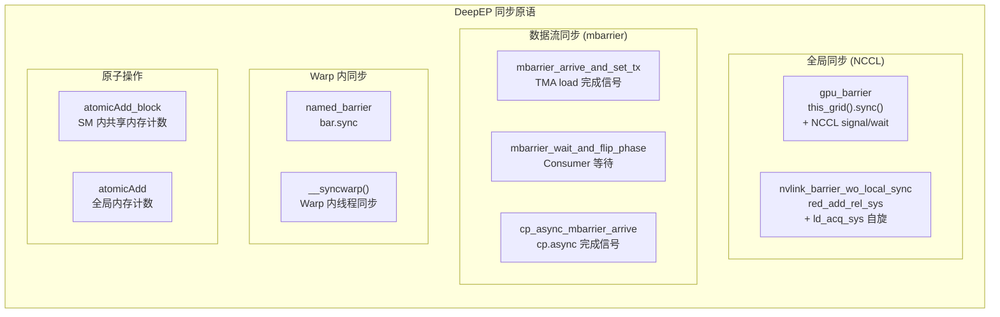
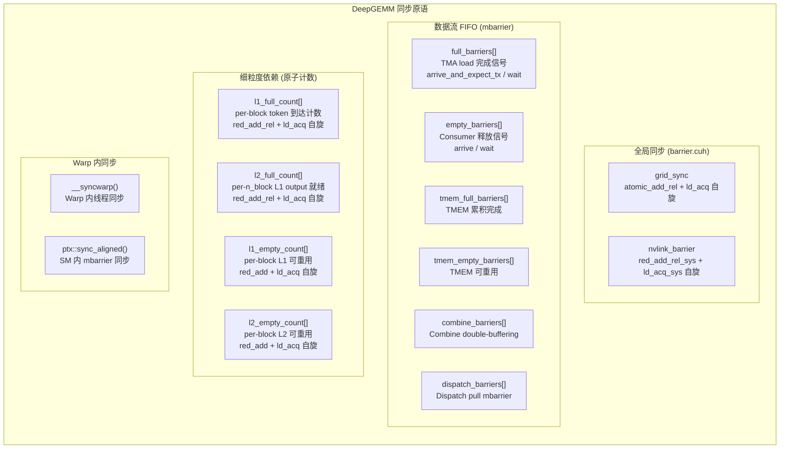
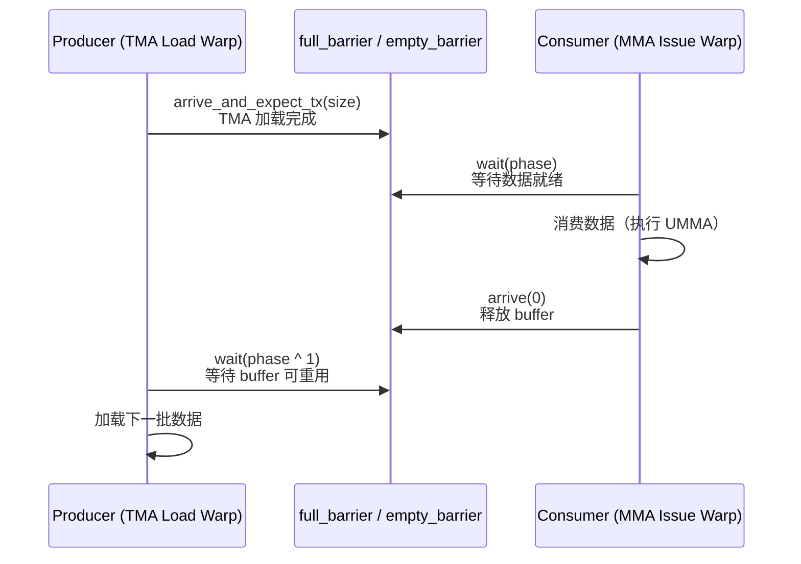
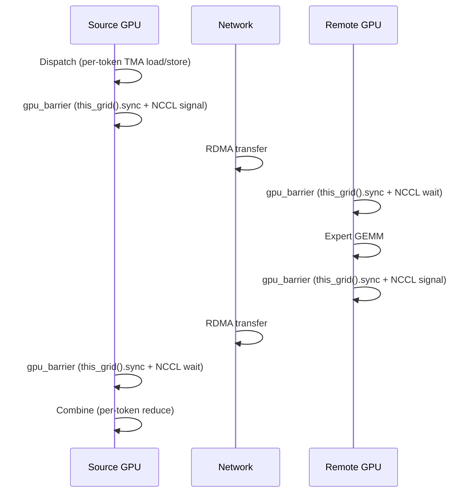
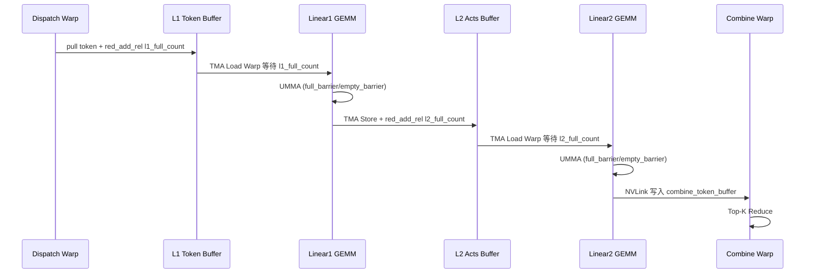
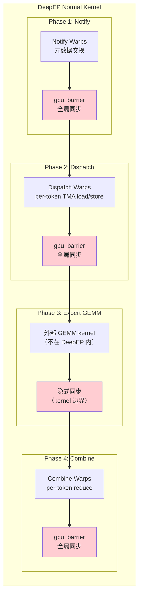
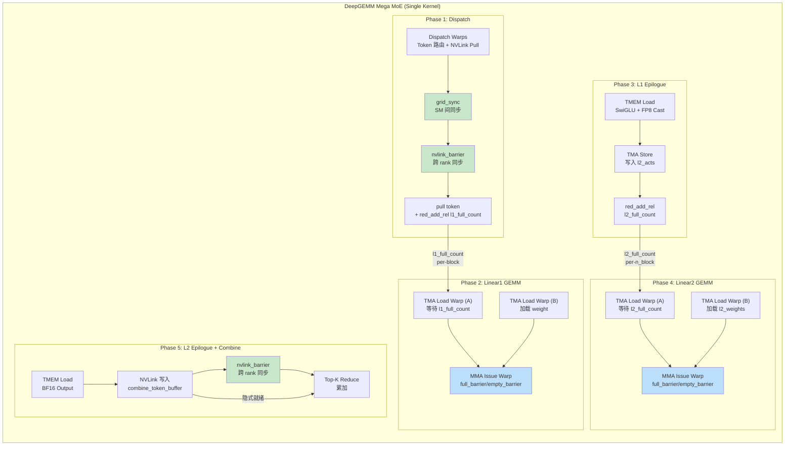

# FIFO Pipeline 深度对比分析：博客理论 ↔ DeepEP 源码 ↔ DeepGEMM Mega MoE 源码

> **分析目标**：探究博客"FIFO: From Synchronous to Streaming Pipeline"概念在 DeepEP 和 DeepGEMM 两个代码库中的实际同步机制实现。
>
> **核心问题**：
> 1. DeepEP 是否使用了 FIFO？其同步原语是什么？
> 2. DeepGEMM Mega MoE 的同步机制是什么？
> 3. 两者的同步模式有何本质差异？
> 4. FIFO 概念如何与 Warp Spec、Chunk Streaming、Normal vs Low-Latency 关联？

---

## 1. TL;DR

| 问题 | 结论 |
|------|------|
| DeepEP 是否使用 FIFO？ | **否**——使用 **NCCL Barrier + mbarrier** 的同步模式，无显式 FIFO 队列 |
| DeepGEMM 是否使用 FIFO？ | **是，但形式不同**——使用 **mbarrier + double-buffering** 实现等效 FIFO 语义 |
| 两者同步原语差异？ | DeepEP: `this_grid().sync()` + NCCL signal/wait；DeepGEMM: `atomic_add_rel` + `ld_acq` 自旋 |
| FIFO 本质？ | 两者都实现了**流式执行**，但同步机制完全不同 |
| 博客理论是否准确？ | **部分准确**——博客描述的 FIFO 模型更贴近 DeepGEMM 的实现，而非 DeepEP |

---

## 2. 博客核心概念回顾：FIFO 的流式本质

博客 Section 6 描述了 FIFO 的核心思想：

### 2.1 博客原文描述

```
无 FIFO（同步）:
Send → Barrier → Forward → Barrier → Receive
      ↑ 必须等前一阶段全部完成

有 FIFO（流式）:
Send → FIFO → Forward → FIFO → Receive
      ↑ 每个阶段只关心自己的读写，无需等待整个 Batch
```

**FIFO 的本质**：将通信 pipeline 从同步执行转变为流式执行（streaming execution）。

### 2.2 博客的关键断言

| 博客断言 | 含义 |
|----------|------|
| "无需等待整个 Batch" | Chunk 粒度流式处理 |
| "每个阶段只关心自己的读写" | Stage 解耦 |
| "FIFO 队列" | 显式或隐式的生产者-消费者缓冲 |
| "同步→流式" | Barrier → FIFO 的转变 |

---

## 3. DeepEP 实现分析：NCCL-Based 同步模式

### 3.1 DeepEP 的同步原语全景

DeepEP **没有使用显式 FIFO 队列**，而是采用 **NCCL Barrier + mbarrier** 的混合同步模式：



### 3.2 gpu_barrier：DeepEP 的核心同步机制

DeepEP 的 `gpu_barrier` 是整个同步体系的基石：

```cpp
// deep_ep/include/deep_ep/common/comm.cuh
template <bool kIsScaleupNVLink, int kNumScaleoutRanks, int kNumScaleupRanks,
          int kNumSMs, int kNumThreads, int kNumQPs,
          int64_t kNumTimeoutCycles, int kTag = kDeviceBarrierTag,
          bool kFlushStores = true, bool kSyncAtStart = true, bool kSyncAtEnd = true>
__forceinline__ __device__ void gpu_barrier(const handle::NCCLGin& gin,
                                            const layout::WorkspaceLayout& workspace,
                                            const int& scaleout_rank_idx, const int& scaleup_rank_idx,
                                            const int& sm_idx, const int& thread_idx,
                                            bool do_scaleout = true, bool do_scaleup = true) {
    // 1. TMA store 刷新（确保数据全局可见）
    if constexpr (kFlushStores) {
        ptx::tma_store_commit();
        ptx::tma_store_wait();
        __syncwarp();
    }

    // 2. 所有 SM 到达同步点
    if constexpr (kSyncAtStart) {
        cooperative_groups::this_grid().sync();  // ← 全局 SM 同步
    }

    // 3. 跨 rank 同步（scaleup/scaleout）
    if (do_scaleup and do_scaleout) {
        if (sm_idx == 0) {
            scaleup_barrier_wo_local_sync<...>(...);  // NVLink barrier
        } else {
            scaleout_barrier_wo_local_sync<...>(...);  // RDMA barrier
        }
    }

    // 4. 所有 SM 再次同步
    if constexpr (kSyncAtEnd)
        cooperative_groups::this_grid().sync();  // ← 全局 SM 同步
}
```

**关键特征**：
- 使用 `cooperative_groups::this_grid().sync()` 实现 SM 间同步
- 跨 rank 同步使用 NCCL 的 `signal/wait` 机制
- **这是一个全局 Barrier，不是 FIFO！**

### 3.3 mbarrier：DeepEP 的数据流同步

DeepEP 使用 `mbarrier` 实现 TMA load/store 的 producer-consumer 协议：

```cpp
// deep_ep/include/deep_ep/common/ptx.cuh

// mbarrier 初始化
__forceinline__ __device__ void mbarrier_init_with_fence(mbarrier* ptr, const int& arrive_count = 1) {
    asm volatile("mbarrier.init.shared::cta.b64 [%1], %0;" ::
                 "r"(arrive_count), "r"(static_cast<uint32_t>(__cvta_generic_to_shared(ptr))));
    asm volatile("fence.mbarrier_init.release.cluster;" ::);
}

// arrive + expect_tx（生产者：数据加载完成）
__forceinline__ __device__ void mbarrier_arrive_and_set_tx(mbarrier* ptr, const int& num_bytes) {
    asm volatile("mbarrier.arrive.expect_tx.shared::cta.b64 _, [%1], %0; \n\t" ::
                 "r"(num_bytes), "r"(static_cast<uint32_t>(__cvta_generic_to_shared(ptr))));
}

// wait + phase flip（消费者：等待数据就绪）
__forceinline__ __device__ void mbarrier_wait_and_flip_phase(mbarrier* ptr, arrival_phase& phase) {
    asm volatile(
        "{\n\t"
        ".reg .pred       P1; \n\t"
        "LAB_WAIT: \n\t"
        "mbarrier.try_wait.parity.shared::cta.b64 P1, [%0], %1, %2; \n\t"
        "@P1 bra DONE; \n\t"
        "bra     LAB_WAIT; \n\t"
        "DONE: \n\t"
        "}" ::
        "r"(static_cast<uint32_t>(__cvta_generic_to_shared(ptr))),
        "r"(phase), "r"(0x989680));
    phase ^= 1;
}
```

### 3.4 Dispatch 中的同步模式

```cpp
// deep_ep/include/deep_ep/impls/dispatch.cuh

// 1. 初始 barrier：确保所有 rank 就绪
comm::gpu_barrier<kIsScaleupNVLink, 1, kNumRanks,
                  kNumSMs, kNumThreads, kNumQPs, kNumTimeoutCycles, comm::kDispatchTag0, false, false, true>(
    gin, workspace_layout, 0, rank_idx, sm_idx, thread_idx);

// 2. 主循环：per-token 处理
for (int token_idx = token_start; token_idx < num_tokens; token_idx += token_stride) {
    // TMA load token 数据
    ptx::tma_load_1d(tma_buffer.get_hidden_ptr(), ..., mbarrier_ptr, kNumHiddenBytes);
    
    // 等待 TMA load 完成
    ptx::mbarrier_arrive_and_set_tx(mbarrier_ptr, kNumHiddenBytes);
    ptx::mbarrier_wait_and_flip_phase(mbarrier_ptr, phase);
    
    // TMA store 到远程/本地
    ptx::tma_store_1d(dst_ptr, tma_buffer.get_base_ptr(), ...);
    ptx::tma_store_commit();
}

// 3. 最终 barrier：确保所有数据到达
comm::gpu_barrier<kIsScaleupNVLink, 1, kNumRanks,
                  kNumSMs, kNumThreads, kNumQPs, kNumTimeoutCycles, comm::kDispatchTag1, true, true, false>(
    gin, workspace_layout, 0, rank_idx, sm_idx, thread_idx);
```

### 3.5 DeepEP 的同步模式总结

| 同步原语 | 用途 | 粒度 |
|----------|------|------|
| `gpu_barrier` | 全局 SM + 跨 rank 同步 | 所有 SM |
| `mbarrier` | TMA load/store producer-consumer | per-warp |
| `named_barrier` | Warp group 内同步 | Warp group |
| `__syncwarp` | Warp 内线程同步 | Warp |
| `atomicAdd` | 元数据计数 | 全局/共享内存 |

**关键结论**：DeepEP 使用 **Barrier 主导** 的同步模式，mbarrier 仅用于 TMA 内部的数据就绪检测，**不构成 FIFO 队列**。

---

## 4. DeepGEMM Mega MoE 实现分析：mbarrier-Based 流式模式

### 4.1 DeepGEMM 的同步原语全景

DeepGEMM 使用 **mbarrier + double-buffering** 实现等效 FIFO 语义：



### 4.2 grid_sync：SM 间全局同步

```cpp
// deep_gemm/include/deep_gemm/comm/barrier.cuh
template <uint32_t kNumSMs, uint32_t kGridSyncIndex = 0, typename sync_scope_t>
CUTLASS_DEVICE void grid_sync(const layout::Workspace& workspace,
                              const uint32_t& sm_idx, const uint32_t& thread_idx,
                              const sync_scope_t& sync_scope) {
    static constexpr uint32_t kFinishSumTag = 0x80000000u;
    sync_scope();
    if (thread_idx == 0) {
        const auto count_ptr = workspace.get_grid_sync_count_ptr<kGridSyncIndex>();
        const auto old_value = ptx::atomic_add_rel(
            count_ptr, sm_idx == 0 ? (kFinishSumTag - (kNumSMs - 1)) : 1);
        uint32_t new_value;
        do {
            new_value = ptx::ld_acq(count_ptr);
        } while (((new_value ^ old_value) & kFinishSumTag) == 0);
    }
    sync_scope();
}
```

**与 DeepEP 的对比**：
- DeepEP 使用 `cooperative_groups::this_grid().sync()`（硬件支持的 grid sync）
- DeepGEMM 使用 `atomic_add_rel` + `ld_acq` 自旋（软件实现的 grid sync）
- 两者功能相同，但 DeepGEMM 的实现更灵活（支持多 index、超时检测）

### 4.3 nvlink_barrier：跨 Rank 同步

```cpp
// deep_gemm/include/deep_gemm/comm/barrier.cuh
template <uint32_t kNumRanks, uint32_t kNumSMs, uint32_t kNumThreads, uint32_t kGridSyncIndex, uint32_t kTag, typename sync_scope_t>
CUTLASS_DEVICE void nvlink_barrier(const layout::Workspace& workspace,
                                   const layout::SymBuffer<kNumRanks>& sym_buffer,
                                   const uint32_t& sm_idx, const uint32_t& thread_idx,
                                   const sync_scope_t& sync_scope,
                                   const bool& sync_prologue = true,
                                   const bool& sync_epilogue = true) {
    // 1. Grid sync before NVLink signaling
    if (sync_prologue)
        grid_sync<kNumSMs, kGridSyncIndex>(workspace, sm_idx, thread_idx, sync_scope);

    // 2. NVLink cross-rank barrier, only SM 0 participates
    if (sm_idx == 0) {
        auto* counter_ptr = workspace.get_nvl_barrier_counter_ptr();
        const auto status = (*counter_ptr) & 3;
        const auto signal_phase = status & 1, signal_sign = status >> 1;
        auto* signal_ptr = workspace.get_nvl_barrier_signal_ptr(signal_phase);

        // Send signals to remote ranks
        if (thread_idx < kNumRanks)
            ptx::red_add_rel_sys(sym_buffer.map(signal_ptr, thread_idx), signal_sign ? -1 : 1);
        sync_scope();

        // Update status and wait arrival
        if (thread_idx == 0) {
            ptx::red_add(counter_ptr, 1);
            const int target = signal_sign ? 0 : static_cast<int>(kNumRanks);
            while (ptx::ld_acq_sys(signal_ptr) != target) { /* spin */ }
        }
    }

    // 3. Grid sync after NVLink completion
    if (sync_epilogue)
        grid_sync<kNumSMs, kGridSyncIndex>(workspace, sm_idx, thread_idx, sync_scope);
}
```

### 4.4 mbarrier-based Producer-Consumer（等效 FIFO）

DeepGEMM 的核心创新是使用 **mbarrier + double-buffering** 实现 FIFO 语义：

```cpp
// deep_gemm/include/deep_gemm/impls/sm100_fp8_fp4_mega_moe.cuh

// Barrier 定义
using Barrier = cutlass::arch::ClusterTransactionBarrier;

// 核心 barrier 数组
Barrier full_barriers[kNumStages];      // TMA load 完成信号
Barrier empty_barriers[kNumStages];     // Consumer 释放信号
Barrier tmem_full_barriers[kNumEpilogueStages];  // TMEM 累积完成
Barrier tmem_empty_barriers[kNumEpilogueStages]; // TMEM 可重用
Barrier combine_barriers[kNumEpilogueWarps * 2]; // Combine double-buffering
Barrier dispatch_barriers[kNumDispatchWarps];   // Dispatch pull mbarrier
```

**Producer-Consumer 协议**：



**关键代码**：

```cpp
// Producer (TMA Load Warp): 加载数据并 signal
shared_storage.full_barriers[stage_idx].arrive_and_expect_tx(
    sizeof(SharedStorage::smem_a[0]) * 2 + sizeof(SharedStorage::smem_sfa[0]) * 2);

// Consumer (MMA Issue Warp): 等待数据就绪
shared_storage.full_barriers[stage_idx].wait(phase);

// Consumer 完成后释放 buffer
shared_storage.empty_barriers[stage_idx].arrive(0u);

// Producer 等待 buffer 可重用
shared_storage.empty_barriers[stage_idx].wait(phase ^ 1);
```

### 4.5 细粒度依赖：原子计数实现流式

DeepGEMM 使用 **原子计数** 实现 per-block 粒度的流式处理：

```cpp
// Dispatch Warp: 每完成一个 token 的 pull，增加 arrival count
ptx::red_add_rel(
    workspace.get_l1_full_count_ptr(pool_block_idx % kNumRingBlocks), 
    is_last_token ? BLOCK_M - (token_idx_in_expert % BLOCK_M) : 1u
);

// TMA Load Warp (Linear1): 等待整个 block 的 token 全部到达
if (task_info.block_phase == sched::BlockPhase::Linear1) {
    const auto ptr = workspace.get_l1_full_count_ptr(block_idx);
    const auto num_expected_tokens = BLOCK_M * (pool_block_idx / kNumRingBlocks + 1);
    while (ptx::ld_acq(ptr) != num_expected_tokens);  // 自旋等待
}

// Linear2: 等待所需的 L1 output 全部就绪
if (task_info.block_phase == sched::BlockPhase::Linear2) {
    const auto ptr = workspace.get_l2_full_count_ptr(block_idx);
    const auto num_expected_blocks = (L2_SHAPE_K / BLOCK_N) * 2 * (pool_block_idx / kNumRingBlocks + 1);
    while (ptx::ld_acq(ptr) != num_expected_blocks);
}
```

### 4.6 DeepGEMM 的同步模式总结

| 同步原语 | 用途 | 粒度 | 类型 |
|----------|------|------|------|
| `grid_sync` | SM 间 Grid 同步 | 所有 SM | Barrier |
| `nvlink_barrier` | 跨 Rank NVLink 同步 | 所有 Rank | Barrier |
| `full_barriers` | TMA load 完成信号 | per-stage | FIFO (mbarrier) |
| `empty_barriers` | Consumer 释放信号 | per-stage | FIFO (mbarrier) |
| `tmem_full/empty` | TMEM 累积/释放 | per-stage | FIFO (mbarrier) |
| `l1_full_count` | Token 到达计数 | per-block | 原子计数 |
| `l2_full_count` | L1 output 就绪 | per-n_block | 原子计数 |
| `l1_empty_count` | L1 可重用 | per-block | 原子计数 |
| `l2_empty_count` | L2 可重用 | per-block | 原子计数 |
| `__syncwarp` | Warp 内同步 | warp | Warp sync |
| `ptx::sync_aligned` | SM 内跨 warp 同步 | SM 内 | mbarrier |

**关键结论**：DeepGEMM 使用 **mbarrier + double-buffering** 实现了与 FIFO 完全等效的流式语义，同时使用原子计数实现细粒度依赖。

---

## 5. 对比分析：DeepEP vs DeepGEMM

### 5.1 同步机制对比

| 维度 | DeepEP | DeepGEMM Mega MoE |
|------|--------|-------------------|
| **全局 SM 同步** | `this_grid().sync()` | `atomic_add_rel` + `ld_acq` 自旋 |
| **跨 Rank 同步** | NCCL signal/wait | `red_add_rel_sys` + `ld_acq_sys` 自旋 |
| **数据流同步** | mbarrier（TMA 内部） | mbarrier + double-buffering（FIFO） |
| **细粒度依赖** | 无 | 原子计数（l1/l2 count） |
| **FIFO 形式** | 无显式 FIFO | 隐式 mbarrier + shared memory |
| **Buffer 层级** | 多层（Token→Dispatch→Chunk→Receive→Expert） | 少层（L1 Pool + L2） |
| **通信粒度** | Chunk（多 token 聚合） | Per-Token（单 token 粒度） |
| **跨节点通信** | RDMA（显式） | NVLink（Symmetric Memory 隐式） |

### 5.2 同步原语实现对比

| 原语 | DeepEP 实现 | DeepGEMM 实现 |
|------|-------------|---------------|
| **Grid Sync** | `cooperative_groups::this_grid().sync()` | `atomic_add_rel` + `ld_acq` 自旋 |
| **NVLink Barrier** | `red_add_rel_sys` + `ld_acq_sys` 自旋 | `red_add_rel_sys` + `ld_acq_sys` 自旋 |
| **mbarrier arrive** | `mbarrier.arrive.expect_tx.shared::cta.b64` | `ClusterTransactionBarrier.arrive_and_expect_tx` |
| **mbarrier wait** | `mbarrier.try_wait.parity.shared::cta.b64` | `ClusterTransactionBarrier.wait` |
| **原子操作** | `atomicAdd_block`, `atomicAdd` | `ptx::atomic_add_rel`, `ptx::red_add_rel` |

### 5.3 时序图对比

**DeepEP 的同步模式（Barrier 主导）**：



**DeepGEMM 的流式模式（FIFO 主导）**：



### 5.4 FIFO 语义对比

| DeepEP（无显式 FIFO） | DeepGEMM（等效 FIFO） |
|----------------------|----------------------|
| Chunk Buffer（显式队列） | smem_a/smem_b/smem_cd（shared memory buffer） |
| 写入 Chunk Buffer | `full_barriers[i].arrive_and_expect_tx()` |
| 从 Chunk Buffer 读取 | `full_barriers[i].wait(phase)` |
| Chunk Buffer 空位可用 | `empty_barriers[i].arrive()` + `wait(phase ^ 1)` |
| Chunk 粒度 | BLOCK 粒度（BLOCK_M × BLOCK_K） |

---

## 6. 跨引用分析：FIFO 与其他概念的关系

### 6.1 FIFO 与 Warp Specialization（Agent 3）

| 概念 | 关系 |
|------|------|
| **Warp Specialization** | 将不同阶段分配给不同 Warp 角色 |
| **FIFO** | 实现 Warp 角色之间的数据传递 |
| **协同** | Warp Spec 是"角色分离"，FIFO 是"角色间通信" |

**DeepEP 中的体现**：
- Notify Warps：元数据通知
- Dispatch Warps：数据搬运
- 两者通过 `gpu_barrier` 同步（**不是 FIFO**）

**DeepGEMM 中的体现**：
- Dispatch Warps：Token 路由 + NVLink Pull
- TMA Load Warps：数据加载
- MMA Issue Warp：矩阵乘法
- Epilogue Warps：后处理 + Combine
- 各角色通过 `full_barriers/empty_barriers` 解耦（**FIFO 语义**）

### 6.2 FIFO 与 Chunk Streaming（Agent 9）

| 概念 | 关系 |
|------|------|
| **Chunk Streaming** | 数据以 Chunk 粒度流过 pipeline |
| **FIFO** | Chunk Streaming 的底层实现机制 |
| **区别** | Chunk Streaming 强调"粒度"，FIFO 强调"解耦" |

**DeepEP 的 Chunk Streaming**：
- Token 聚合为 Chunk 后通信
- Chunk Buffer 作为显式 FIFO 队列
- 但同步仍依赖 `gpu_barrier`

**DeepGEMM 的 Chunk Streaming**：
- Per-Token 粒度（更细粒度）
- mbarrier + double-buffering 实现流式
- 无需等待整个 Batch

### 6.3 FIFO 与 Normal vs Low-Latency（Agent 7）

| 模式 | DeepEP Normal | DeepEP Low-Latency | DeepGEMM |
|------|---------------|-------------------|----------|
| **Chunk** | 关键 | 减少 | Per-Token |
| **Pipeline** | 深 | 浅 | 深（融合 kernel） |
| **FIFO 形式** | Chunk Buffer | 无 | mbarrier + smem |
| **同步** | Barrier 主导 | Barrier 主导 | FIFO 主导 |

**关键洞察**：
- DeepEP 的 Normal/Low-Latency 都使用 **Barrier 主导** 的同步
- DeepGEMM 通过 **FIFO 主导** 的同步实现了 Normal 模式的流式处理
- DeepGEMM 没有 Low-Latency 模式，因为它通过 per-token 粒度天然实现了低延迟

---

## 7. 核心结论

### 7.1 博客理论的准确性评估

| 博客断言 | DeepEP | DeepGEMM | 评估 |
|----------|--------|----------|------|
| "Send → FIFO → Forward" | ❌ 无 FIFO | ✅ mbarrier FIFO | 部分准确 |
| "无需等待整个 Batch" | ❌ Barrier 等待 | ✅ per-token 流式 | 部分准确 |
| "每个阶段只关心自己的读写" | ❌ Barrier 同步 | ✅ mbarrier 解耦 | 部分准确 |
| "FIFO 本质：同步→流式" | ❌ 仍为同步 | ✅ 流式 | 部分准确 |

**结论**：博客描述的 FIFO 模型更贴近 **DeepGEMM** 的实现，而非 DeepEP。DeepEP 使用的是 **Barrier 主导** 的同步模式，而非 FIFO。

### 7.2 同步机制的本质差异

| 维度 | DeepEP | DeepGEMM |
|------|--------|----------|
| **同步范式** | Barrier（全局同步） | FIFO（局部解耦） |
| **数据流** | 显式拷贝 + Barrier | 零拷贝 + mbarrier |
| **粒度** | Chunk（粗粒度） | Per-Token（细粒度） |
| **延迟** | 高（Barrier 等待） | 低（流式处理） |
| **吞吐** | 高（Chunk 聚合） | 高（细粒度流水线） |

### 7.3 设计哲学对比

**DeepEP 的设计哲学**：
- **通信与计算分离**：Dispatch/Combine 是独立 kernel
- **Chunk 聚合**：减少通信次数，提高带宽利用率
- **Barrier 同步**：简单可靠，但引入全局等待

**DeepGEMM 的设计哲学**：
- **通信与计算融合**：单个 kernel 完成所有操作
- **Per-Token 粒度**：最小化延迟
- **FIFO 解耦**：各阶段独立运行，无需全局同步

### 7.4 同步原语选择的原因

| 因素 | DeepEP | DeepGEMM |
|------|--------|----------|
| **硬件代际** | SM90（Hopper） | SM100（Blackwell） |
| **通信硬件** | NCCL + RDMA | NVLink + Symmetric Memory |
| **Kernel 模式** | 多 kernel 协作 | 单 kernel 融合 |
| **同步需求** | 跨 kernel barrier | 跨 stage FIFO |
| **mbarrier 用途** | TMA 内部同步 | FIFO 实现 |

---

## 8. 完整 Pipeline 数据流图

### 8.1 DeepEP 的 Barrier 主导 Pipeline



### 8.2 DeepGEMM 的 FIFO 主导 Pipeline



---

## 9. 关键代码索引

### 9.1 DeepEP 关键代码

| 文件 | 行号 | 内容 |
|------|------|------|
| `comm.cuh` | 208-264 | `gpu_barrier` 实现 |
| `comm.cuh` | 88-129 | `nvlink_barrier_wo_local_sync` |
| `comm.cuh` | 131-181 | `gin_barrier_wo_local_sync` |
| `ptx.cuh` | 56-90 | `mbarrier` 初始化、arrive、wait |
| `ptx.cuh` | 124-148 | TMA load/store |
| `dispatch.cuh` | 73-76 | 初始 barrier |
| `dispatch.cuh` | 270-394 | Dispatch 主循环（mbarrier 使用） |
| `dispatch.cuh` | 397-400 | 最终 barrier |
| `combine.cuh` | 77-80 | 初始 barrier |
| `combine.cuh` | 239-242 | 最终 barrier |

### 9.2 DeepGEMM 关键代码

| 文件 | 行号 | 内容 |
|------|------|------|
| `barrier.cuh` | 21-44 | `grid_sync` 实现 |
| `barrier.cuh` | 46-89 | `nvlink_barrier` 实现 |
| `sm100_fp8_fp4_mega_moe.cuh` | 79-80 | Barrier 类型定义 |
| `sm100_fp8_fp4_mega_moe.cuh` | 196-203 | Barrier 数组定义 |
| `sm100_fp8_fp4_mega_moe.cuh` | 237-268 | Barrier 初始化 |
| `sm100_fp8_fp4_mega_moe.cuh` | 692-704 | l1/l2_full_count 等待 |
| `sm100_fp8_fp4_mega_moe.cuh` | 706-733 | TMA Load Warp (Tokens) |
| `sm100_fp8_fp4_mega_moe.cuh` | 757-792 | TMA Load Warp (Weights) |
| `sm100_fp8_fp4_mega_moe.cuh` | 859-911 | MMA Issue Warp |
| `sm100_fp8_fp4_mega_moe.cuh` | 987-1191 | L1 Epilogue |
| `sm100_fp8_fp4_mega_moe.cuh` | 1192-1305 | L2 Epilogue + Combine |

---

## 10. 参考

- 博客原文：`/tmp/deep_ep_blog_text.txt` Section 6
- DeepEP 源码：`/Users/backyes/work/claude_workspace/deepgemm_research/deep_ep/`
- DeepGEMM 源码：`/Users/backyes/work/claude_workspace/deepgemm_research/DeepGEMM/`
- 前置分析：`docs/05_04_fifo_pipeline.md`
- CUTLASS ClusterTransactionBarrier 文档
- NVIDIA SM90 / SM100 架构手册
