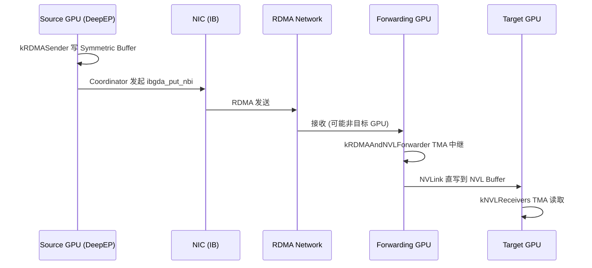
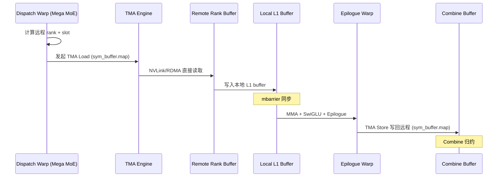

# 06_06: NVLink Scale-up + RDMA Scale-out — DeepEP 三阶段流水线 vs DeepGEMM 对称内存

> 分析日期: 2026-07-30
> 源材料: DeepEP 博客 Section 4 + DeepEP 源码 (legacy internode/internode_ll/intranode) + DeepGEMM Mega MoE 源码 (SM100 FP8/FP4)
> 三向对比: **博客理论** ↔ **DeepEP 源码** ↔ **DeepGEMM Mega MoE 源码**

---

## 1. 核心问题

DeepEP 博客 Section 4 描述了多节点 MoE 的 **Intra-node NVLink + Inter-node RDMA** 协调问题：
- Token 可能留在本地、同节点另一 GPU、或远端节点
- 单 Dispatch 包含两个通信域：Intra-node (NVLink) + Inter-node (RDMA)
- 三阶段流水线：Source GPU → IB Sending → RDMA Network → IB-to-NVLink Forwarding → NVLink Receiving → Target GPU

**DeepGEMM Mega MoE 用 Symmetric Memory 重新解决了同一个问题，但架构完全不同。**

---

## 2. 博客声明: 三阶段流水线

### 2.1 博客原文引用

> **4.2 Three-Stage Pipeline & Role Division**
>
> In multi-GPU nodes, GPUs and NICs are not one-to-one bound. GPU0 to NIC1 may need `GPU0 → NVLink → GPU4 → PCIe → NIC1`. Communication becomes:
> `GPU → NVLink domain → NIC → RDMA → NVLink domain → GPU`.
>
> Normal Kernel divides into three roles:
> **Source GPU → IB Sending → RDMA Network → IB-to-NVLink Forwarding → NVLink Receiving → Target GPU**
>
> - **IB Sending**: GPU memory → NIC (reads Dispatch Buffer, organizes RDMA packets)
> - **IB-to-NVLink Forwarding**: Solves NIC-GPU topology mismatch. GPU acts as communication relay: `Receive from NIC → Forward through NVLink → Target GPU`
> - **NVLink Receiving**: Target GPU receives from NVLink, writes to Receive Buffer

### 2.2 博客核心声明总结

| 博客声明 | 含义 |
|----------|------|
| GPU-NIC 拓扑不对称 | GPU0 发送到 NIC1 需要经过另一 GPU 中继 |
| 三阶段流水线 | IB Sending → RDMA → Forwarding → NVLink Receiving |
| GPU-centric fabric | NVLink + RDMA + GPU SM 共同构成数据路径 |
| 动态调度 | Multi-Channel, Dynamic Warp Allocation, Chunk Streaming |
| Low-Latency 绕过 Forwarding | GPU → Direct RDMA → GPU |

---

## 3. DeepEP 实现: 三阶段流水线的代码验证

### 3.1 WarpRole 枚举 — 三阶段的直接证据

```cpp
// csrc/kernels/legacy/internode.cu, line 487
enum class WarpRole {
    kRDMASender,              // IB Sending 阶段
    kRDMASenderCoordinator,   // RDMA 发送协调
    kRDMAAndNVLForwarder,     // IB-to-NVLink Forwarding 阶段
    kForwarderCoordinator,    // Forwarder 协调
    kNVLReceivers             // NVLink Receiving 阶段
};
```

**代码直接对应博客三阶段**:
- `kRDMASender` = IB Sending (GPU → NIC)
- `kRDMAAndNVLForwarder` = IB-to-NVLink Forwarding (NIC → NVLink 中继)
- `kNVLReceivers` = NVLink Receiving (NVLink → GPU)

### 3.2 角色分配逻辑

```cpp
// csrc/kernels/legacy/internode.cu, line 499-514
const auto role_meta = [=]() -> std::pair<WarpRole, int> {
    if (is_forwarder) {
        if (warp_id < LEGACY_NUM_MAX_NVL_PEERS) {
            return {WarpRole::kRDMAAndNVLForwarder, (warp_id + channel_id) % LEGACY_NUM_MAX_NVL_PEERS};
        } else {
            return {WarpRole::kForwarderCoordinator, warp_id - LEGACY_NUM_MAX_NVL_PEERS};
        }
    } else if (warp_id < kNumDispatchRDMASenderWarps) {
        return {WarpRole::kRDMASender, -1};
    } else if (warp_id == kNumDispatchRDMASenderWarps) {
        return {WarpRole::kRDMASenderCoordinator, -1};
    } else {
        return {WarpRole::kNVLReceivers, (warp_id + channel_id - kNumDispatchRDMASenderWarps) % LEGACY_NUM_MAX_NVL_PEERS};
    }
}();
```

**关键设计**: `is_forwarder = sm_id % 2 == 0` — 偶数 SM 做 Forwarder，奇数 SM 做 Sender/Receiver。

### 3.3 Stage 1: IB Sending (kRDMASender)

```cpp
// csrc/kernels/legacy/internode.cu, line 587-757
if (warp_role == WarpRole::kRDMASender) {
    // 获取 token 任务范围
    get_channel_task_range(num_tokens, num_channels, channel_id, token_start_idx, token_end_idx);

    // 遍历 token 并拷贝到 symmetric send buffer
    for (token_idx = token_start_idx; token_idx < token_end_idx; ++token_idx) {
        // 读取 RDMA rank 存在性
        // 拷贝 x, x_scales, source meta, topk_idx, topk_weights 到 send buffer
        UNROLLED_WARP_COPY(5, lane_id, hidden_int4, 0, x + token_idx * hidden_int4, ld_nc_global, st_broadcast);

        // 释放事务槽 (流控)
        acquire_lock(rdma_send_channel_lock + lane_id);
        // ... 窗口管理 ...
        release_lock(rdma_send_channel_lock + lane_id);
    }
}
```

**IB Sending 核心操作**:
1. 读取 Dispatch Buffer (源 token)
2. 写入 Symmetric RDMA Buffer (GPU 显存中的 RDMA 可访问区域)
3. 不直接操作 NIC，由 Coordinator 发起实际 RDMA

### 3.4 Stage 1.5: RDMA Sender Coordinator — 发起实际 RDMA

```cpp
// csrc/kernels/legacy/internode.cu, line 758-848
} else if (warp_role == WarpRole::kRDMASenderCoordinator) {
    // 迭代所有 RDMA ranks
    while (__any_sync(0xffffffff, num_tokens_to_send > 0)) {
        for (int i = 0; i < kNumRDMARanks; ++i) {
            // 实际发起 RDMA send
            if (dst_rdma_rank != rdma_rank) {
                nvshmemi_ibgda_put_nbi_warp<true>(
                    dst_ptr, src_ptr, num_bytes_per_msg,
                    translate_dst_rdma_rank<kLowLatencyMode>(dst_rdma_rank, nvl_rank),
                    channel_id, lane_id, 0);
            }
            // 更新 tail
            nvshmemi_ibgda_amo_nonfetch_add(rdma_channel_tail.buffer(rdma_rank), ...);
        }
    }
}
```

**关键 API**: `nvshmemi_ibgda_put_nbi_warp` — IBGDA (InfiniBand GPU Direct Async) 的 non-blocking put 操作。

### 3.5 Stage 2: IB-to-NVLink Forwarding (kRDMAAndNVLForwarder)

```cpp
// csrc/kernels/legacy/internode.cu, line 849-1013
} else if (warp_role == WarpRole::kRDMAAndNVLForwarder) {
    const auto dst_nvl_rank = target_rank;

    // 1. 等待 RDMA meta 数据到达
    while (true) {
        auto meta_0 = ld_volatile_global(rdma_channel_meta.recv_buffer(lane_id) + dst_nvl_rank);
        // ... 等待 4 个 meta 字段就绪 ...
        if (meta_0 < 0 and meta_1 < 0 and meta_2 < 0 and meta_3 < 0) {
            // 通知 NVL ranks
            st_relaxed_sys_global(nvl_channel_prefix_start.buffer() + lane_id, -start_sum - 1);
            st_relaxed_sys_global(nvl_channel_prefix_end.buffer() + lane_id, -end_sum - 1);
            break;
        }
    }

    // 2. 从 RDMA buffer 转发 token 到 NVL
    while (__any_sync(0xffffffff, num_tokens_to_recv_from_rdma > 0)) {
        // 轮询源 RDMA rank
        src_rdma_rank = (src_rdma_rank + 1) % kNumRDMARanks;

        // 遍历 RDMA buffer 中的 token
        for (int i = src_rdma_head; i < src_rdma_tail; ++i) {
            auto shifted = rdma_channel_data.recv_buffer(src_rdma_rank) + rdma_slot_idx * num_bytes_per_token;
            auto src_meta = ld_nc_global(reinterpret_cast<SourceMeta*>(shifted + hidden_bytes + scale_bytes));

            // 检查是否属于目标 NVL rank
            bool is_in_dst_nvl_rank = src_meta.is_token_in_nvl_rank(dst_nvl_rank);
            if (not is_in_dst_nvl_rank) continue;

            // TMA load from RDMA buffer, TMA store to NVL buffer
            if (elect_one_sync()) {
                tma_load_1d(tma_buffer, shifted, tma_mbarrier, num_bytes_per_token, false);
                mbarrier_arrive_and_expect_tx(tma_mbarrier, num_bytes_per_token);
            }
            mbarrier_wait(tma_mbarrier, tma_phase);
            if (elect_one_sync())
                tma_store_1d(tma_buffer, dst_shifted, num_bytes_per_token);
        }
    }
}
```

**Forwarding 核心操作**:
1. 等待 RDMA 数据到达 (GPU 显存中的 RDMA buffer)
2. 读取 SourceMeta 判断目标 NVL rank
3. TMA load from RDMA buffer → TMA store to NVLink buffer
4. **GPU 作为通信中继** — 这正是博客描述的 "IB-to-NVLink Forwarding"

### 3.6 Stage 3: NVLink Receiving (kNVLReceivers)

```cpp
// csrc/kernels/legacy/internode.cu, line 1061-1196
} else {
    // NVL consumers
    int src_nvl_rank = target_rank;

    // 1. 等待 NVL channel prefix 数据
    while (lane_id < kNumRDMARanks) {
        start_offset = ld_volatile_global(nvl_channel_prefix_start.buffer() + lane_id);
        end_offset = ld_volatile_global(nvl_channel_prefix_end.buffer() + lane_id);
        if (start_offset < 0 and end_offset < 0) {
            start_offset = -start_offset - 1, end_offset = -end_offset - 1;
            break;
        }
    }

    // 2. 从 NVL buffer 读取 token
    while (num_tokens_to_recv > 0) {
        // 等待数据到达
        if (cached_channel_head_idx != cached_channel_tail_idx)
            break;
        cached_channel_tail_idx = ld_acquire_sys_global(nvl_channel_tail.buffer());

        // 拷贝数据
        for (int chunk_idx = 0; chunk_idx < num_recv_tokens; ++chunk_idx, --num_tokens_to_recv) {
            auto shifted = nvl_channel_x.buffer() + token_idx_in_buffer * num_bytes_per_token;

            // TMA load from NVL buffer, TMA store to recv_x
            if (elect_one_sync()) {
                tma_load_1d(tma_buffer, shifted, tma_mbarrier, tma_load_bytes);
                mbarrier_arrive_and_expect_tx(tma_mbarrier, tma_load_bytes);
            }
            mbarrier_wait(tma_mbarrier, tma_phase);
            if (elect_one_sync()) {
                tma_store_1d(tma_buffer, recv_x + recv_token_idx * hidden_int4, hidden_bytes, false);
            }
        }
    }
}
```

**NVLink Receiving 核心操作**:
1. 等待 Forwarder 写入 NVL buffer
2. TMA load from NVLink buffer
3. TMA store 到目标 recv_x (最终输出)

### 3.7 Combine 阶段: 反向三阶段

```cpp
// csrc/kernels/legacy/internode.cu, line 1746
enum class WarpRole { kNVLSender, kNVLAndRDMAForwarder, kRDMAReceiver, kCoordinator };
```

**Combine 是 Dispatch 的反向**:
- `kNVLSender` = NVLink 发送方 (原 Target GPU 变为 Source)
- `kNVLAndRDMAForwarder` = NVL-RDMA 转发 (原 Forwarder 角色反转)
- `kRDMAReceiver` = RDMA 接收方 (原 Source GPU 变为 Target)

---

## 4. DeepGEMM 实现: Symmetric Memory 消除三阶段

### 4.1 SymBuffer 结构 — 跨 rank 地址映射

```cpp
// deep_gemm/include/deep_gemm/layout/sym_buffer.cuh
template <uint32_t kNumRanks = kNumMaxRanks>
struct SymBuffer {
    int64_t base;                    // 本地 buffer 基地址
    int64_t offsets[kNumMaxRanks];   // 各 rank 相对于本 rank 的偏移
    uint32_t rank_idx;               // 当前 rank 编号

    // 关键: 将本地指针映射为可远程访问的指针
    template <typename ptr_t>
    CUTLASS_DEVICE ptr_t map(const ptr_t& ptr, const uint32_t& dst_rank_idx) const {
        if constexpr (kNumRanks == 1)
            return ptr;

        int64_t mapped_ptr = offsets[dst_rank_idx] + reinterpret_cast<int64_t>(ptr);
        return *reinterpret_cast<ptr_t*>(&mapped_ptr);
    }
};
```

**`map(ptr, dst_rank_idx)` 是 Mega MoE 跨 rank 访问的核心原语**:
- 输入: 本地 buffer 中的指针 + 目标 rank
- 输出: 可在目标 rank 上执行 TMA load/store 的远程虚拟地址
- 底层: 利用 NVLink/RDMA 的 **统一虚拟地址空间 (UVA)**

### 4.2 Dispatch 阶段: 直接远程拉取 (无 Forwarding)

```cpp
// deep_gemm/include/deep_gemm/impls/sm100_fp8_fp4_mega_moe.cuh, line 533-556

// 1. 读取源 token-topk 索引 (由远端 dispatch 通过 NVLink 写入)
const uint32_t src_token_topk_idx = *workspace.get_src_token_topk_idx_ptr(
    current_expert_idx, current_rank_in_expert_idx, token_idx_in_rank);

// 2. 通过 sym_buffer.map 计算远程地址
const auto src_base_ptr = sym_buffer.map(
    buffer.input_token_buffer.get_data_buffer(src_token_idx).get_base_ptr(),
    current_rank_in_expert_idx);  // ← 远程 rank 地址

// 3. TMA load token 从远端 rank 到本地 smem
if (cute::elect_one_sync()) {
    for (uint32_t i = 0; i < kNumChunks; ++ i) {
        ptx::tma_load_1d(
            pull_buffer.get_base_ptr(),
            math::advance_ptr(src_base_ptr, i * kNumBytesPerPull),
            pull_mbarrier, kNumBytesPerPull
        );
        ptx::mbarrier_arrive_and_set_tx(pull_mbarrier, kNumBytesPerPull);
    }
}
```

**关键差异**: Mega MoE 的 Dispatch Warp **直接**通过 `sym_buffer.map` 计算远程地址，然后 TMA load — **无需 Forwarding GPU 中继**。

### 4.3 Combine 阶段: 直接远程写回 (无 Forwarding)

```cpp
// deep_gemm/include/deep_gemm/impls/sm100_fp8_fp4_mega_moe.cuh, line 1293-1299

// 从 shared memory 读取
const auto packed = ptx::ld_shared(reinterpret_cast<float4*>(smem_ptr));

// 写入远端 combine buffer
const auto dst_token = buffer.combine_token_buffer.get_rank_buffer(dst_topk_idx)
                       .get_data_buffer(dst_token_idx);
const auto dst_ptr = math::advance_ptr<float4>(
    dst_token.get_base_ptr(),
    n_idx * sizeof(nv_bfloat16) + (lane_idx % 16) * sizeof(float4));

*sym_buffer.map(dst_ptr, dst_rank_idx) = packed;  // ← 远程 NVLink/RDMA 写
```

**关键差异**: Mega MoE 的 Epilogue Warp **直接**通过 `sym_buffer.map` 写回远程 combine buffer — **无需 Forwarding GPU 中继**。

### 4.4 跨 rank 同步: NVLink Barrier

```cpp
// deep_gemm/include/deep_gemm/comm/barrier.cuh
template <uint32_t kNumRanks, uint32_t kNumSMs, uint32_t kNumThreads, ...>
CUTLASS_DEVICE void nvlink_barrier(const layout::Workspace& workspace,
                                   const layout::SymBuffer<kNumRanks>& sym_buffer, ...) {
    // 1. Grid sync (节点内所有 SM 同步)
    if (sync_prologue)
        grid_sync<kNumSMs, kGridSyncIndex>(workspace, sm_idx, thread_idx, sync_scope);

    // 2. NVLink 跨 rank barrier (仅 SM 0 参与)
    if (sm_idx == 0) {
        // 发送信号到远端 rank
        if (thread_idx < kNumRanks)
            ptx::red_add_rel_sys(sym_buffer.map(signal_ptr, thread_idx), signal_sign ? -1 : 1);

        // 等待所有 rank 到达
        if (thread_idx == 0) {
            ptx::red_add(counter_ptr, 1);
            while (ptx::ld_acq_sys(signal_ptr) != target) { /* spin */ }
        }
    }

    // 3. Grid sync (确保所有 SM 看到 barrier 完成)
    if (sync_epilogue)
        grid_sync<kNumSMs, kGridSyncIndex>(workspace, sm_idx, thread_idx, sync_scope);
}
```

**关键机制**: `sym_buffer.map(signal_ptr, thread_idx)` — 直接写远程 rank 的信号量，无需 Forwarding。

---

## 5. 核心对比: DeepEP vs DeepGEMM

### 5.1 通信路径对比

| 阶段 | DeepEP | DeepGEMM Mega MoE |
|------|--------|-------------------|
| **Source → NIC** | `kRDMASender` Warp 写 Symmetric Buffer + Coordinator 发起 `ibgda_put_nbi` | **无** — SM 直接 TMA load/store |
| **NIC → Network** | RDMA 网络传输 | RDMA 网络传输 (底层自动) |
| **NIC → Forward GPU** | `kRDMAAndNVLForwarder` Warp TMA 中继 | **无** — 直接远程访问 |
| **Forward GPU → Target GPU** | NVLink 直写 | **无** — 直接远程访问 |
| **Target GPU 接收** | `kNVLReceivers` Warp TMA 读取 | Dispatch Warp 直接 TMA load |

### 5.2 通信语义对比

| 维度 | DeepEP | DeepGEMM Mega MoE |
|------|--------|-------------------|
| **通信模型** | 推送 + 转发 (Push + Forward) | 拉取 + 直接远程访问 (Pull + Direct Access) |
| **RDMA 语义** | 消息传递 (ibgda_put_nbi) | load/store (TMA) |
| **地址空间** | 对称 buffer (SymBuffer) | 统一虚拟地址 (UVA + SymBuffer.map) |
| **Forwarding** | 显式 GPU 中继 | **消除** — TMA 直接跨 rank |
| **同步机制** | FIFO (生产者-消费者) | mbarrier (TMA 完成通知) |
| **角色分工** | IB Sender / Forwarder / NVL Receiver | Dispatch Warps / MMA Warps / Epilogue Warps |

### 5.3 数据组织对比

| 维度 | DeepEP | DeepGEMM Mega MoE |
|------|--------|-------------------|
| **发送缓冲** | Chunk Buffer (RDMA Symmetric Buffer) | input_token_buffer (Symmetric Memory) |
| **接收缓冲** | Receive Buffer (NVL Buffer) | l1_token_buffer (本地 Ring Buffer) |
| **Combine 缓冲** | Dispatch Buffer (反向) | combine_token_buffer (Symmetric Memory) |
| **流控** | FIFO head/tail + 窗口管理 | mbarrier + full_count/empty_count |
| **路由信息** | SourceMeta (per-token) | src_token_topk_idx (per-token) |

### 5.4 Mermaid 流水线对比图

```mermaid
graph TB
    subgraph DeepEP["DeepEP: 三阶段推送 + 转发"]
        S[Source GPU<br/>kRDMASender] -->|写 Symmetric Buffer| SB[Symmetric RDMA Buffer]
        SB -->|ibgda_put_nbi| NIC[NIC / RDMA]
        NIC -->|RDMA 网络| NET[RDMA Network]
        NET -->|接收| FWD[Forwarding GPU<br/>kRDMAAndNVLForwarder]
        FWD -->|TMA load + TMA store| NVL[NVL Buffer]
        NVL -->|NVLink| RECV[Target GPU<br/>kNVLReceivers]
        RECV -->|TMA store| T[Receive Buffer]
    end

    subgraph MegaMoE["Mega MoE: 对称内存直接访问"]
        D[Dispatch Warp] -->|sym_buffer.map + TMA load| LB[Local L1 Buffer]
        LB -->|直接远程访问| R[Remote input_token_buffer]
        L[Epilogue Warp] -->|sym_buffer.map + TMA store| C[Remote combine_token_buffer]
    end
```



### 5.5 完整数据流对比 (Sequence Diagram)





---

## 6. 为什么 Mega MoE 能消除三阶段?

### 6.1 根本原因: Symmetric Memory + TMA 提供 load/store 语义的远程访问

| DeepEP | Mega MoE |
|--------|----------|
| RDMA 是 **消息传递** 语义 | Symmetric Memory 是 **load/store** 语义 |
| 需要显式 Send/Recv 操作 | 直接 `map(ptr, rank)` 后 TMA load/store |
| NIC 是独立参与者 | TMA 集成在 GPU SM 中 |
| 需要 Forwarding 解决拓扑问题 | UVA 统一地址空间消除拓扑差异 |

### 6.2 技术演进链

```
DeepEP (2025)                          Mega MoE (2026)
─────────────────────────────────────────────────────────────────
IBGDA (GPU Direct Async)         →     Symmetric Memory (PyTorch)
显式 RDMA put_nbi                →     TMA load/store (硬件自动选择 NVLink/RDMA)
GPU SM 发起 RDMA                 →     TMA 硬件引擎发起传输
对称 buffer (手动管理偏移)        →     SymBuffer.map (统一地址空间)
三阶段 (Send→Forward→Receive)    →    单阶段 (直接远程访问)
```

### 6.3 对称内存 vs 显式 RDMA 的权衡

| 维度 | 显式 RDMA (DeepEP) | 对称内存 (Mega MoE) |
|------|---------------------|---------------------|
| 控制粒度 | 精确 (可优化每个 packet) | 较粗 (依赖 TMA/NCCL) |
| 灵活性 | 高 (可自定义 protocol) | 较低 (受限于 SymMem API) |
| 实现复杂度 | 高 (三阶段 + FIFO + Warp 特化) | 低 (统一 load/store) |
| 性能上限 | 高 (可极致优化) | 高 (TMA 硬件加速) |
| 通用性 | 仅 MoE All-to-All | 通用分布式共享内存 |
| 拓扑感知 | 需要显式 Forwarding | UVA 自动处理 |

---

## 7. 跨引用: 与其他 Agent 分析的关联

### 7.1 与 Warp Specialization (Agent 3) 的关系

**DeepEP 的 Warp 特化直接对应三阶段流水线**:
- Warp Group A: `kRDMASender` = IB Sending
- Warp Group B: `kRDMAAndNVLForwarder` = Forwarding
- Warp Group C: `kNVLReceivers` = NVLink Receiving

```cpp
// DeepEP: 5 种 Warp 角色
enum class WarpRole {
    kRDMASender,              // Stage 1: IB Sending
    kRDMASenderCoordinator,   // Stage 1.5: RDMA 协调
    kRDMAAndNVLForwarder,     // Stage 2: Forwarding
    kForwarderCoordinator,    // Stage 2.5: Forwarder 协调
    kNVLReceivers             // Stage 3: NVLink Receiving
};
```

**Mega MoE 的 Warp 特化与通信无关**:
- Dispatch Warps: 计算远程地址 + TMA load (通信)
- MMA Warps: GEMM 计算 (计算)
- Epilogue Warps: TMA store 写回 (通信)

**关键差异**: DeepEP 的 Warp 特化是 **通信阶段特化**，Mega MoE 的 Warp 特化是 **通信-计算特化**。

### 7.2 与 Normal vs Low-Latency (Agent 7) 的关系

**DeepEP Low-Latency 模式绕过 Forwarding**:

```cpp
// csrc/kernels/legacy/internode_ll.cu, line 253-278
// Issue IBGDA sends (直接 RDMA, 无 Forwarding)
if (dst_expert_idx >= 0) {
    const auto dst_rank = dst_expert_idx / num_local_experts;
    const auto dst_ptr = reinterpret_cast<uint64_t>(rdma_recv_x) + ...;
    const auto dst_p2p_ptr = nvshmemi_get_p2p_ptr(dst_ptr, rank, dst_rank);

    if (dst_p2p_ptr == 0) {
        // 跨节点: 直接 RDMA (无 Forwarding)
        nvshmemi_ibgda_put_nbi_warp(dst_ptr, src_ptr, num_bytes_per_msg, dst_rank, ...);
    } else {
        // 同节点: 直接 P2P 写 (无 Forwarding)
        UNROLLED_WARP_COPY(8, lane_id, num_int4_per_msg, dst_int4_ptr, src_int4_ptr, ld_nc_global, st_na_global);
    }
}
```

**Low-Latency 模式的核心优化**:
- 跳过 Forwarding 阶段 (GPU → Direct RDMA → GPU)
- 每个 token 独立发送 (不聚合 Chunk)
- 减少端到端延迟

**Mega MoE 天然无 Forwarding**:
- 无论 Intra-node 还是 Inter-node，都是 `sym_buffer.map` + TMA load/store
- 不需要区分 Normal/Low-Latency 的通信路径

### 7.3 与 Intra-node / Inter-node 的关系

**DeepEP 显式区分 Intra/Inter-node**:

```cpp
// csrc/kernels/legacy/internode.cu
// Inter-node: RDMA 网络
nvshmemi_ibgda_put_nbi_warp<true>(dst_ptr, src_ptr, ...);

// csrc/kernels/legacy/intranode.cu
// Intra-node: NVLink 直写
barrier_block<kNumRanks>(barrier_signal_ptrs, rank);
```

**Mega MoE 不区分 Intra/Inter-node**:
- `sym_buffer.map(ptr, dst_rank_idx)` 统一处理
- 底层自动选择 NVLink (同节点) 或 RDMA (跨节点)

```cpp
// Mega MoE: 同一段代码，不同 dst_rank_idx → 不同底层传输
const auto src_base_ptr = sym_buffer.map(
    buffer.input_token_buffer.get_data_buffer(src_token_idx).get_base_ptr(),
    current_rank_in_expert_idx);  // 同节点 → NVLink, 跨节点 → RDMA
```

---

## 8. GPU-Centric Communication Fabric 的演进

### 8.1 DeepEP 的 GPU-Centric Fabric

```
NVLink + RDMA + GPU SM → 共同构成数据路径
```

- GPU SM 发起通信 (不是 NIC 独立处理)
- GPU 作为 Forwarding 中继
- SM + NIC + NVLink 紧密耦合

### 8.2 Mega MoE 的演进: SM + TMA + SymBuffer

```
Symmetric Memory + TMA + GPU SM → 统一数据路径
```

```cpp
// Mega MoE 的通信由以下三者协作:
// 1. Dispatch Warps (GPU SM): 计算远程地址, 发起 TMA
// 2. TMA (Tensor Memory Accelerator): 执行实际数据传输
// 3. SymBuffer.map(): 提供远程地址映射

// 关键代码: SM 直接发起远程 TMA load
ptx::tma_load_1d(
    local_smem_ptr,
    sym_buffer.map(remote_ptr, dst_rank_idx),  // SM 计算远程地址
    mbarrier, size);
```

**变化**:
- **不再需要 GPU 作为 Forwarding 中继** — TMA 直接处理跨 rank 传输
- **不再需要显式 FIFO** — mbarrier 提供更细粒度的生产者-消费者同步
- **通信与计算更深度融合** — Dispatch Warps 同时做 token routing + 远程拉取

---

## 9. 代码结构映射表

| 概念 | DeepEP 实现 | Mega MoE 实现 |
|------|-------------|---------------|
| 跨 rank 发送 | `kRDMASender` + `ibgda_put_nbi` | `sym_buffer.map` + TMA store |
| 跨 rank 接收 | `kNVLReceivers` TMA load | `sym_buffer.map` + TMA load |
| 转发 | `kRDMAAndNVLForwarder` TMA 中继 | **消除** (直接远程访问) |
| 流控 | FIFO head/tail + 窗口管理 | mbarrier + full_count/empty_count |
| 同步 | Barrier + 信号 | nvlink_barrier + grid_sync |
| 缓冲 | Chunk Buffer + Receive Buffer | Symmetric Buffer (Token Pool) |
| 路由 | Router → Dispatch Buffer | Router → topk_idx → sym_buffer |
| Intra-node | intranode.cu (NVLink) | sym_buffer.map (自动 NVLink) |
| Inter-node | internode.cu (RDMA) | sym_buffer.map (自动 RDMA) |
| Low-Latency | internode_ll.cu (绕过 Forwarding) | 天然无 Forwarding |

---

## 10. 总结

### 10.1 Mega MoE 对 DeepEP 的继承

1. **GPU-Centric 通信**: SM 发起通信 (不是 NIC offload)
2. **NVLink + RDMA 统一**: 不区分 intra/inter-node
3. **Warp 特化**: Dispatch / MMA / Epilogue 分离
4. **异步流水线**: 通信与计算重叠

### 10.2 Mega MoE 对 DeepEP 的革新

1. **Symmetric Memory 替代显式 RDMA**: 用 load/store 语义替代消息传递
2. **消除三阶段**: 直接远程访问，无需 Forwarding
3. **TMA 替代手动 Copy**: 硬件加速远程 load/store
4. **mbarrier 替代 FIFO**: 更细粒度的生产者-消费者同步
5. **Pull 模型替代 Push 模型**: 消费方主动拉取，而非生产方推送

### 10.3 一句话总结

> **DeepEP 是 "通信运行时" — 显式管理 NVLink + RDMA 三阶段流水线。Mega MoE 是 "融合运行时" — 通过 Symmetric Memory 将通信隐式融入 GEMM 计算，用 TMA load/store 替代显式 Send/Forward/Receive。**

---

## 附录 A: 关键源码位置

### DeepEP 源码

| 文件 | 关键内容 | 行号 |
|------|----------|------|
| `csrc/kernels/legacy/internode.cu` | `WarpRole` 枚举 (三阶段证据) | 487 |
| `csrc/kernels/legacy/internode.cu` | 角色分配逻辑 | 499-514 |
| `csrc/kernels/legacy/internode.cu` | `kRDMASender` (IB Sending) | 587-757 |
| `csrc/kernels/legacy/internode.cu` | `kRDMASenderCoordinator` (RDMA 发起) | 758-848 |
| `csrc/kernels/legacy/internode.cu` | `kRDMAAndNVLForwarder` (Forwarding) | 849-1013 |
| `csrc/kernels/legacy/internode.cu` | `kNVLReceivers` (NVLink Receiving) | 1061-1196 |
| `csrc/kernels/legacy/internode.cu` | Combine WarpRole (反向三阶段) | 1746 |
| `csrc/kernels/legacy/internode_ll.cu` | Low-Latency 绕过 Forwarding | 253-278 |
| `csrc/kernels/legacy/intranode.cu` | Intra-node NVLink 通信 | 全文 |
| `csrc/kernels/legacy/ibgda_device.cuh` | IBGDA (RDMA) 底层 API | 全文 |
| `deep_ep/include/deep_ep/common/comm.cuh` | `get_qp_mode`, NVLink 检测 | 全文 |
| `deep_ep/include/deep_ep/common/handle.cuh` | NCCL Gin handle, `is_nvlink_accessible` | 全文 |
| `deep_ep/buffers/elastic.py` | NVLink/RDMA 检测 | 全文 |
| `deep_ep/utils/envs.py` | `get_nvlink_gbs`, `get_rdma_gbs` | 全文 |

### DeepGEMM 源码

| 文件 | 关键内容 | 行号 |
|------|----------|------|
| `deep_gemm/include/deep_gemm/layout/sym_buffer.cuh` | `SymBuffer::map()` — 跨 rank 地址映射 | 全文 |
| `deep_gemm/include/deep_gemm/comm/barrier.cuh` | `nvlink_barrier`, `grid_sync` | 全文 |
| `deep_gemm/include/deep_gemm/layout/mega_moe.cuh` | `MegaMoEBuffer` 结构, combine_token_buffer | 330-445 |
| `deep_gemm/include/deep_gemm/impls/sm100_fp8_fp4_mega_moe.cuh` | Dispatch TMA load (直接远程访问) | 533-556 |
| `deep_gemm/include/deep_gemm/impls/sm100_fp8_fp4_mega_moe.cuh` | Epilogue TMA store (直接远程写回) | 1293-1299 |
| `deep_gemm/include/deep_gemm/impls/sm100_fp8_fp4_mega_moe.cuh` | Combine 归约 + 写回 | 1300+ |

---

## 附录 B: 关键 API 对比

### DeepEP RDMA API

```cpp
// IBGDA (InfiniBand GPU Direct Async)
nvshmemi_ibgda_put_nbi_warp<true>(
    dst_ptr, src_ptr, num_bytes,
    dst_rdma_rank, channel_id, lane_id, slot_idx);

// NVLink barrier
barrier_block<kNumRanks>(barrier_signal_ptrs, rank);

// NVLink P2P 访问
st_release_sys_global(reinterpret_cast<int*>(dst_p2p_ptr), cnt);
```

### DeepGEMM Symmetric Memory API

```cpp
// SymBuffer 地址映射
sym_buffer.map(ptr, dst_rank_idx);

// TMA load/store (硬件自动选择 NVLink/RDMA)
ptx::tma_load_1d(dst_ptr, src_ptr, mbarrier, size);
ptx::tma_store_1d(dst_ptr, src_ptr, size);

// NVLink barrier (跨 rank 同步)
ptx::red_add_rel_sys(sym_buffer.map(signal_ptr, thread_idx), value);
```

---

## 附录 C: 三阶段流水线的完整 Mermaid 图

```mermaid
graph LR
    subgraph Stage1["Stage 1: IB Sending"]
        S1[Source GPU SM] -->|写 Dispatch Buffer| SB[Symmetric RDMA Buffer]
        SB -->|ibgda_put_nbi_warp| NIC1[NIC]
    end

    subgraph Stage2["Stage 2: RDMA Network"]
        NIC1 -->|RDMA 网络| NIC2[Remote NIC]
    end

    subgraph Stage3["Stage 3: IB-to-NVLink Forwarding"]
        NIC2 -->|接收| FWD[Forwarding GPU SM]
        FWD -->|TMA load from RDMA Buffer| TMA1[TMA Engine]
        TMA1 -->|TMA store to NVL Buffer| NVL[NVLink Buffer]
    end

    subgraph Stage4["Stage 4: NVLink Receiving"]
        NVL -->|NVLink| RECV[Target GPU SM]
        RECV -->|TMA load| TMA2[TMA Engine]
        TMA2 -->|TMA store| RB[Receive Buffer]
    end

    Stage1 --> Stage2 --> Stage3 --> Stage4
```



---

## 附录 D: Mega MoE 直接远程访问的 Mermaid 图

```mermaid
graph LR
    subgraph Pull["Dispatch: 直接远程拉取"]
        D[Dispatch Warp] -->|sym_buffer.map| ADDR[地址计算]
        ADDR -->|TMA load| TMA1[TMA Engine]
        TMA1 -->|NVLink/RDMA| R1[Remote input_token_buffer]
        R1 -->|数据| L1[l1_token_buffer]
    end

    subgraph Compute["计算"]
        L1 -->|MMA| GEMM[GEMM + SwiGLU]
    end

    subgraph Push["Combine: 直接远程写回"]
        GEMM -->|Epilogue| E[Epilogue Warp]
        E -->|sym_buffer.map| ADDR2[地址计算]
        ADDR2 -->|TMA store| TMA2[TMA Engine]
        TMA2 -->|NVLink/RDMA| C[Remote combine_token_buffer]
    end

    Pull --> Compute --> Push
```


