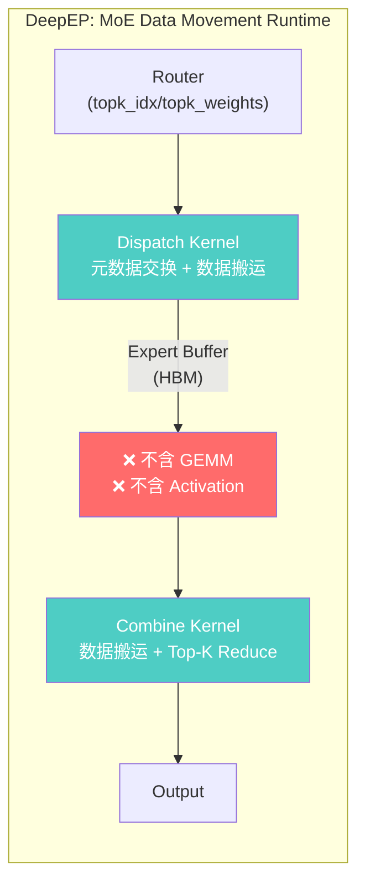
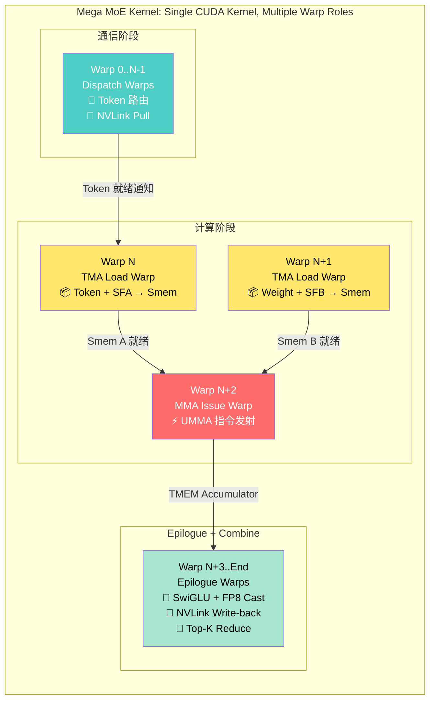
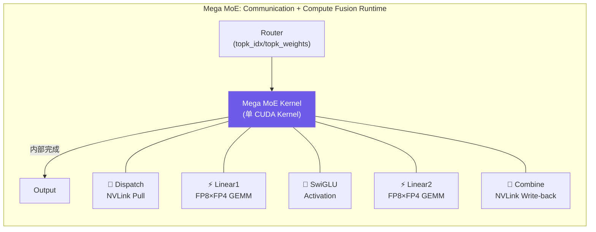
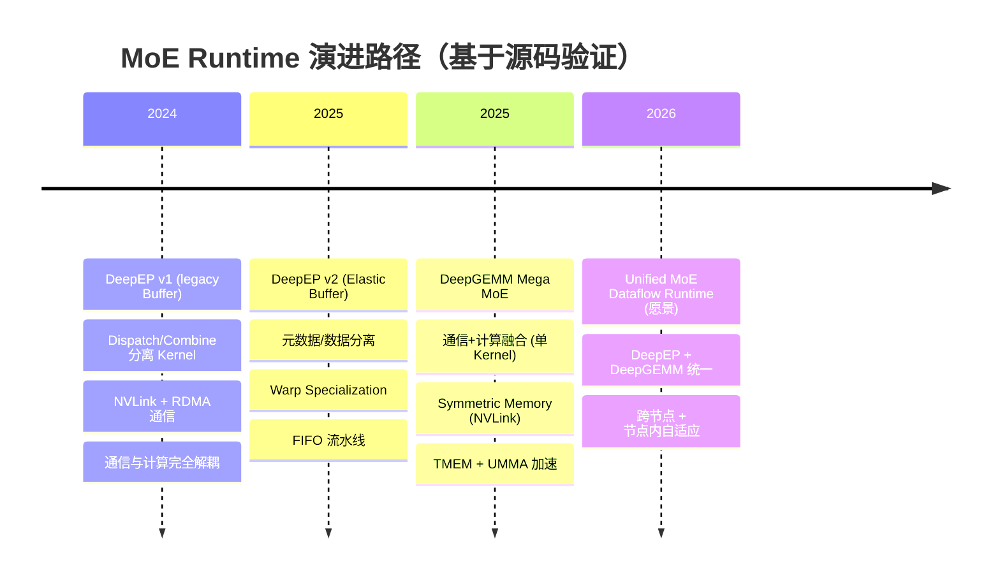
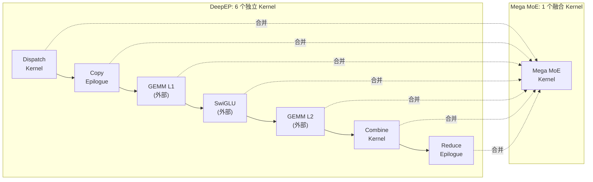
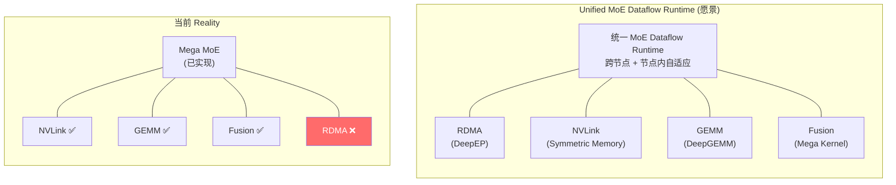
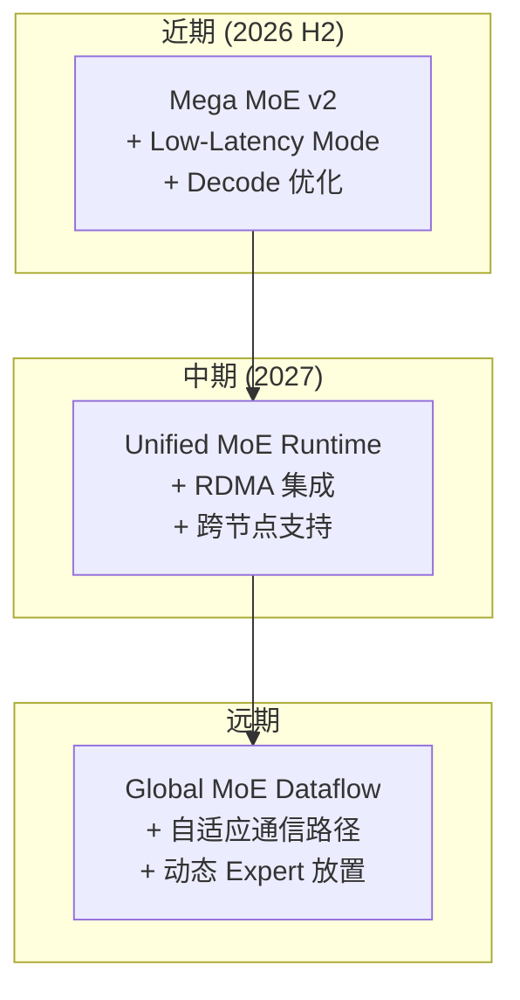

# 从 DeepEP 到 Mega MoE：MoE Runtime 演进的三向验证分析

> **分析范式**: 博客叙事 ↔ DeepEP 源码 ↔ DeepGEMM Mega MoE 源码  
> **目标**: 验证"DeepEP + DeepGEMM + Fusion Kernel → Unified MoE Dataflow Runtime"这一演进叙事的准确性

---

## 1. 博客叙事原文（Section 9）

博客《Understanding GPU Microarchitecture from a Workload Perspective (3): DeepEP's First Principles》第 9 节提出：

> **DeepEP solves Communication + Data Movement.**  
> **Mega MoE solves Communication + Compute Fusion.**

具体融合路径：

```
Token Routing → Dispatch → Linear1 → Activation → Linear2 → Combine
```

博客进一步定义：

| 系统 | 角色 | 边界 |
|------|------|------|
| **DeepEP** | MoE Data Movement Runtime | 通信专用，不含 GEMM |
| **Mega MoE** | Communication + Compute Fusion Runtime | 单 Kernel 融合全部 |

最终愿景：

> **DeepEP + DeepGEMM + Fusion Kernel → Unified MoE Dataflow Runtime**

---

## 2. DeepEP 的边界：纯通信，不含计算

### 2.1 API 表面（`deep_ep/__init__.py`）

```python
# deep_ep/__init__.py 导出的全部公共 API
from .buffers.legacy import Buffer              # 通信 Buffer
from .buffers.elastic import ElasticBuffer, EPHandle  # Elastic Buffer
from .utils.event import EventOverlap, EventHandle    # 事件同步
from .utils.envs import get_physical_domain_size, get_logical_domain_size
from deep_ep._C import Config, topk_idx_t
```

**关键发现**: DeepEP 的公开 API 中**没有任何 GEMM、Activation 或计算相关接口**。全部是通信 Buffer、Event、Config。

### 2.2 Dispatch Kernel：仅数据搬运（`dispatch.cuh`）

```cpp
// deep_ep/include/deep_ep/impls/dispatch.cuh
// Dispatch 内核的两个 Warp 角色：

// 角色 1: Notify Warps —— 仅做元数据交换
if (warp_idx < kNumNotifyWarps) {
    // 1. 统计每个 Expert 收到的 Token 数量 (atomicAdd)
    atomicAdd_block(expert_count + dst_expert_idx, 1);
    // 2. 跨 Rank 写入 expert_count (gin.put_value / gin.put)
    gin.put_value<team_t>(dst_rank_counter, ...);
    gin.put<team_t>(dst_ptr, src_ptr, ...);  // RDMA bulk copy
    // 3. 计算 prefix sum (warp_inclusive_sum)
    do_psum(expert_count, psum_num_recv_tokens_per_expert, ...);
}

// 角色 2: Dispatch Warps —— 仅做数据搬运
else {
    // 1. TMA load token 从本地
    ptx::tma_load_1d(tma_buffer.get_hidden_ptr(), x + token_idx * kNumHiddenBytes, ...);
    // 2. TMA store 到 Send Buffer
    ptx::tma_store_1d(send_buffer_ptr, tma_buffer.get_base_ptr(), ...);
    // 3. NVLink store 到远程
    ptx::tma_store_1d(dst_ptr, tma_buffer.get_base_ptr(), ...);
    // 4. RDMA put 到远程
    gin.put<team_t>(recv_buffer..., send_buffer_ptr, ..., stored_dst_rank_idx);
}
```

**边界证明**: Dispatch Kernel 中**没有任何浮点计算指令**（无 FMA、FFMA、HMMA、UMMA）。全部是 `tma_load`、`tma_store`、`gin.put`、`atomicAdd` 等通信/原子指令。

### 2.3 Combine Kernel：仅数据搬运（`combine.cuh`）

```cpp
// deep_ep/include/deep_ep/impls/combine.cuh
// Combine 内核的 Warp 只做：
for (int i = token_start_idx; i < token_end_idx; ++i) {
    // 1. 读取源 Token 元数据
    const int src_token_idx = __ldg(src_metadata + i * kMetadataStride) % kNumMaxTokensPerRank;
    // 2. 从本地/远程 Load token
    ptx::tma_load_1d(tma_buffer.get_base_ptr(), load_ptr, mbarrier_ptr, kNumHiddenBytes);
    // 3. 本地 reduction (仅 expand + reduce 模式下)
    combine_reduce<kHiddenVec, kUnrollFactor, ...>(
        lane_idx, topk_slot_idx, ...);  // 这是 top-k 结果累加，不是 GEMM
    // 4. TMA store 到远程
    ptx::tma_store_1d(master_token_buffer.get_base_ptr(), ...);
    // 5. RDMA put 到原始 Rank
    gin.put<team_t>(dst_ptr, master_token_buffer.get_base_ptr(), ...);
}
```

**边界证明**: Combine 中的 `combine_reduce` 是 **top-k 专家输出的逐元素累加**（`reduced += bf16_value`），不是矩阵乘法。整个 Kernel 同样**不含 GEMM**。

### 2.4 Dispatch Copy Epilogue：仅布局变换（`dispatch_copy_epilogue.cuh`）

```cpp
// deep_ep/include/deep_ep/impls/dispatch_copy_epilogue.cuh
// 该 Kernel 在 Dispatch 主 Kernel 之后执行（cudaGridDependencySynchronize）
// 功能：将 Receive Buffer 中的数据重新排列为 Expert-major 布局
for (int i = global_warp_idx; i < num_recv_tokens; i += kNumWarps * kNumSMs) {
    // 1. 从 scaleup_buffer 读取 token
    ptx::tma_load_1d(tma_buffer.get_base_ptr(), buffer_token.get_base_ptr(), ...);
    // 2. 计算目标 Expert 内的位置
    dst_tensor_idx = atomicAdd(psum_num_recv_tokens_per_expert + dst_expert_idx, 1);
    // 3. 写入 recv_x（Expert-major 布局）
    ptx::tma_store_1d(recv_x + dst_tensor_idx * kNumHiddenBytes, tma_buffer.get_hidden_ptr(), ...);
}
```

**边界证明**: Copy Epilogue 仅做 `Destination-major → Expert-major` 的**索引重排 + TMA 搬运**，无计算。

### 2.5 Combine Reduce Epilogue：仅 Top-K 累加（`combine_reduce_epilogue.cuh`）

```cpp
// deep_ep/include/deep_ep/impls/combine_reduce_epilogue.cuh
// 功能：将多个专家输出逐元素累加
combine_reduce<kHiddenVec, kUnrollFactor, kNumTokensInLayout>(
    lane_idx, topk_slot_idx, ...);  // reduced[j] += source[j]
// 然后 TMA store 到输出
ptx::tma_store_1d(output_buffer.get_token_buffer(token_idx).get_base_ptr(), ...);
```

**边界证明**: 这里的 `combine_reduce` 是 top-k 专家输出的**逐元素求和**（element-wise reduction），不是矩阵乘法。

### 2.6 Buffer 管理：纯内存管理（`elastic.py`）

```python
# deep_ep/buffers/elastic.py
class ElasticBuffer:
    """管理的全部是通信缓冲区"""
    - dispatch / combine        # 通信操作
    - engram_write / engram_fetch  # KV Cache RDMA
    - pp_send / pp_recv         # Pipeline Parallel
    - all_gather / reduce_scatter  # AGRS
    - barrier                   # 同步
```

**关键发现**: `ElasticBuffer` 的**全部方法**都是通信原语或同步操作，**没有任何计算接口**。

### 2.7 DeepEP 边界总结



| 操作 | DeepEP 是否执行 | 代码证据 |
|------|-----------------|----------|
| **Token Routing** (top-k 选择) | ❌ | Router 在 Python 侧完成 |
| **Dispatch 通信** | ✅ | `dispatch.cuh`: `gin.put_value`, `gin.put`, `tma_store` |
| **Expert Buffer 写入** | ✅ | `dispatch_copy_epilogue.cuh`: `tma_store_1d` |
| **Linear1 GEMM** | ❌ | 无 UMMA/FFMA 指令 |
| **Activation (SwiGLU)** | ❌ | 无 expf/__h2div 指令 |
| **Linear2 GEMM** | ❌ | 无 UMMA/FFMA 指令 |
| **Combine 通信** | ✅ | `combine.cuh`: `gin.put`, `tma_store` |
| **Top-K Reduce** | ✅ | `combine_reduce_epilogue.cuh`: element-wise 累加 |

---

## 3. Mega MoE 的边界：通信 + 计算融合

### 3.1 API 表面（`deep_gemm/mega/__init__.py`）

```python
# deep_gemm/mega/__init__.py
class SymmBuffer:
    """Symmetric Memory Buffer —— 跨 Rank 可直接访问的内存"""
    - x, x_sf              # 输入 Token + Scale Factor
    - topk_idx, topk_weights  # 路由信息
    - l1_acts, l1_acts_sf  # Linear1 输出 (FP8)
    - l2_acts, l2_acts_sf  # Linear2 输出 (BF16)

def fp8_fp4_mega_moe(y, l1_weights, l2_weights, sym_buffer, ...):
    """FP8×FP4 融合 MoE Kernel"""

def bf16_mega_moe(y, l1_weights, l2_weights, sym_buffer, ...):
    """BF16 融合 MoE Kernel"""

def transform_weights_for_mega_moe(l1_weights, l2_weights):
    """权重预处理 (interleave gate/up + transpose SF)"""
```

**关键发现**: Mega MoE 的 API **直接包含 GEMM 权重** (`l1_weights`, `l2_weights`)，表明计算已集成到 Kernel 内部。

### 3.2 融合 Kernel 的完整操作清单

```cpp
// deep_gemm/include/deep_gemm/impls/sm100_fp8_fp4_mega_moe.cuh
// 单个 CUDA Kernel 内的全部操作：

// === Phase 1: Token Routing (Dispatch Warps) ===
read_topk_idx([&](token_topk_idx, expert_idx) {
    atomicAdd_block(smem_expert_count + expert_idx, 1);  // 统计 Expert 负载
});
// 跨 Rank 写入 expert_count 到 Symmetric Buffer
*sym_buffer.map(dst_ptr, dst_rank_idx) = token_topk_idx;

// === Phase 2: Dispatch (NVLink Pull) ===
// 从远程 Rank 拉取 Token 数据
ptx::tma_load_1d(pull_buffer,                    // 本地 Smem
    sym_buffer.map(input_token_buffer[src_token_idx], remote_rank),  // 远程 HBM
    pull_mbarrier, kHidden);

// === Phase 3: Linear1 GEMM (MMA Issue Warp) ===
ptx::SM100_MMA_MXF8F6F4_2x1SM_SS::fma(
    b_desc, a_desc, accum_stage_idx * UMMA_N,
    k_block_idx > 0, runtime_instr_desc,
    kTmemStartColOfSFB, kTmemStartColOfSFA);  // UMMA 指令

// === Phase 4: SwiGLU Activation (Epilogue Warps) ===
// 从 TMEM 加载 MMA 结果
cute::SM100_TMEM_LOAD_16dp256b1x::copy(tmem_addr, raw_values...);
// 计算 SwiGLU: silu(gate) * up * weight
gate = __fmul2_rn(gate, {math::fast_rcp(denom.x), math::fast_rcp(denom.y)});
activation = __fmul2_rn(__fmul2_rn(gate, up), weights);
// 重量化为 FP8
const auto fp8x4_values = __nv_fp8x4_e4m3(make_float4(...));

// === Phase 5: Linear2 GEMM (MMA Issue Warp) ===
ptx::SM100_MMA_MXF8F6F4_2x1SM_SS::fma(...);  // 同 Phase 3

// === Phase 6: Combine (NVLink Write-back + Top-K Reduce) ===
// 通过 NVLink 写入远程 Combine Buffer
*sym_buffer.map(dst_ptr, dst_rank_idx) = packed;
// 本地 Top-K 累加
ptx::accumulate(reduced[j * kNumElemsPerUint4 + l], bf16_values[l]);
// 写回最终输出
ptx::tma_store_1d(y + token_idx * kNumHiddenBytes, combine_store_buffer, ...);
```

### 3.3 Warp 角色分配（完整）



### 3.4 Mega MoE 边界总结



| 操作 | Mega MoE 是否执行 | 代码证据 |
|------|-------------------|----------|
| **Token Routing** | ✅ | `read_topk_idx` lambda |
| **Dispatch 通信** | ✅ | `tma_load_1d` via Symmetric Memory/NVLink |
| **Expert Buffer** | ❌ (不需要) | 数据直接在 Kernel 内流转 |
| **Linear1 GEMM** | ✅ | `SM100_MMA_MXF8F6F4_2x1SM_SS::fma` |
| **Activation (SwiGLU)** | ✅ | `__fmul2_rn(gate, up)`, `expf`, `fast_rcp` |
| **Linear2 GEMM** | ✅ | `SM100_MMA_MXF8F6F4_2x1SM_SS::fma` |
| **Combine 通信** | ✅ | `*sym_buffer.map(dst_ptr, rank) = packed` |
| **Top-K Reduce** | ✅ | `ptx::accumulate(reduced, bf16_values)` |

---

## 4. 演进证据：什么被添加、消除、合并？

### 4.1 演进时间线



### 4.2 什么被添加了？

| 新增能力 | 来源 | 代码位置 | 意义 |
|----------|------|----------|------|
| **FP8×FP4 GEMM** | DeepGEMM | `SM100_MMA_MXF8F6F4_2x1SM_SS::fma` | 核心计算 |
| **SwiGLU Activation** | DeepGEMM | `__fmul2_rn(gate, up)`, `expf` | 专家激活 |
| **FP8 重量化** | DeepGEMM | `__nv_fp8x4_e4m3(make_float4(...))` | 精度转换 |
| **TMEM 累加器** | Blackwell | `cute::SM100_TMEM_LOAD_16dp256b1x` | MMA-Epilogue 高效交互 |
| **UTCCP (TMA → TMEM)** | Blackwell | `cute_utccp_t::copy(sf_desc, ...)` | Scale Factor 直接搬运 |
| **Symmetric Memory** | PyTorch | `symm_mem.rendezvous(buffer, group)` | 跨 Rank 直接访问 |
| **Mega Scheduler** | DeepGEMM | `sched::MegaMoEScheduler` | 统一任务调度 |

### 4.3 什么被消除了？

| 消除项 | DeepEP 中存在 | Mega MoE 中 | 收益 |
|--------|---------------|-------------|------|
| **独立 Dispatch Kernel** | ✅ `dispatch.cuh` | ❌ 融入主 Kernel | 减少 Kernel Launch Overhead (~10-20μs) |
| **独立 Combine Kernel** | ✅ `combine.cuh` | ❌ 融入主 Kernel | 同上 |
| **Expert Buffer (HBM)** | ✅ 显式分配 | ❌ L1/L2 Buffer (Ring) | 减少 HBM 占用 |
| **中间 HBM 写回** | ✅ Dispatch → HBM → GEMM | ❌ Smem/TMEM 直接流转 | 节省 HBM Bandwidth |
| **Copy Epilogue Kernel** | ✅ `dispatch_copy_epilogue.cuh` | ❌ 不需要 | 减少 Kernel 数量 |
| **Reduce Epilogue Kernel** | ✅ `combine_reduce_epilogue.cuh` | ❌ 不需要 | 减少 Kernel 数量 |

### 4.4 什么被合并了？



### 4.5 数据流对比

**DeepEP 模式（分离式）**:

```
Router → [Dispatch Kernel] → Expert Buffer (HBM) → [GEMM L1] → L1 Output (HBM)
       → [SwiGLU] → L1 Acts (HBM) → [GEMM L2] → L2 Output (HBM)
       → [Combine Kernel] → Combined (HBM) → [Reduce Epilogue] → Output
```

**中间数据写回 HBM 次数**: 4 次 (Expert Buffer, L1 Output, L1 Acts, L2 Output)

**Mega MoE 模式（融合式）**:

```
Router → [Mega MoE Kernel] → Output
            │
            ├─ Dispatch Warps: NVLink Pull → Smem → L1 Buffer (Ring)
            ├─ MMA Warps: L1 Buffer → UMMA → TMEM
            ├─ Epilogue: TMEM → SwiGLU → FP8 Cast → L2 Buffer (Ring)
            ├─ MMA Warps: L2 Buffer → UMMA → TMEM
            └─ Epilogue: TMEM → NVLink Write-back → Combine Reduce → Output
```

**中间数据写回 HBM 次数**: 0 次（全部在 Smem/TMEM/Register 中流转）

---

## 5. "Unified MoE Dataflow Runtime"：愿景 vs 现实

### 5.1 博客愿景

> **DeepEP + DeepGEMM + Fusion Kernel → Unified MoE Dataflow Runtime**

### 5.2 当前状态验证

| 组件 | 博客愿景 | 当前实现 | 差距 |
|------|----------|----------|------|
| **DeepEP (跨节点 RDMA)** | ✅ 集成 | ❌ Mega MoE 仅支持 NVLink (节点内) | **缺失** |
| **DeepGEMM (GEMM)** | ✅ 集成 | ✅ FP8×FP4 UMMA 已融合 | 已实现 |
| **Fusion Kernel** | ✅ 集成 | ✅ sm100_fp8_fp4_mega_moe.cuh | 已实现 |
| **统一调度器** | ✅ 全局最优 | ⚠️ Mega Scheduler 仅节点内 | 部分实现 |
| **自适应通信路径** | ✅ NVLink vs RDMA | ❌ 仅 NVLink | **缺失** |

### 5.3 关键缺失能力

| 缺失 | 原因 | 影响 |
|------|------|------|
| **跨节点 RDMA** | Mega MoE 依赖 Symmetric Memory (NVLink) | 无法用于大规模 EP |
| **Low-Latency Decode** | Mega MoE 为 Throughput 优化 | 不适合 Decode 场景 |
| **FP8 Dispatch** | DeepEP 支持 FP8 dispatch | Mega MoE 输入需前置量化 |
| **动态 Expert 放置** | Mega MoE 假设静态 Expert 分配 | 不支持运行时负载均衡 |
| **混合精度** | DeepEP 支持 BF16/FP8 | Mega MoE 仅 FP8×FP4 或 BF16 |

### 5.4 代码证据：Mega MoE 的硬件限制

```cpp
// csrc/apis/mega.hpp
if (arch_major == 10) {
    sm100_fp8_fp4_mega_moe(...);  // 仅 Blackwell SM100
} else {
    DG_HOST_UNREACHABLE("Unsupported architecture");  // SM90 不支持
}
```

```python
# deep_gemm/mega/__init__.py
# Symmetric Memory 依赖 NVLink，不支持 RDMA
self.handle = symm_mem.rendezvous(self.buffer, group=group)
```

### 5.5 结论：愿景未完全实现



**结论**: "Unified MoE Dataflow Runtime" 是**部分实现的愿景**。Mega MoE 完成了节点内的通信+计算融合，但跨节点 RDMA 能力仍未集成。

---

## 6. 博客叙事验证矩阵

| 博客声明 | 代码验证结果 | 证据 |
|----------|--------------|------|
| **"DeepEP solves Communication + Data Movement"** | ✅ **准确** | DeepEP 全部 Kernel (`dispatch.cuh`, `combine.cuh`, `*_epilogue.cuh`) 仅含 `tma_load/store`, `gin.put`, `atomicAdd`，无 GEMM/Activation |
| **"Mega MoE solves Communication + Compute Fusion"** | ✅ **准确** | `sm100_fp8_fp4_mega_moe.cuh` 单 Kernel 包含 NVLink Pull + UMMA GEMM + SwiGLU + NVLink Write-back |
| **"Mega MoE fuses Token Routing → Dispatch → Linear1 → Activation → Linear2 → Combine"** | ✅ **准确** | 代码中 6 个阶段按顺序执行，无外部 Kernel 调用 |
| **"DeepEP: MoE Data Movement Runtime"** | ✅ **准确** | DeepEP 的 API (`Buffer`, `ElasticBuffer`, `EventOverlap`) 全部是通信/同步原语 |
| **"Mega MoE: Communication + Compute Fusion Runtime"** | ✅ **准确** | Mega MoE 的 `fp8_fp4_mega_moe` 直接接收 `l1_weights`, `l2_weights`，内部完成 GEMM |
| **"DeepEP + DeepGEMM + Fusion Kernel → Unified MoE Dataflow Runtime"** | ⚠️ **愿景，部分实现** | Mega MoE 仅覆盖 NVLink 节点内，缺少 RDMA 跨节点能力 |

---

## 7. 与其他 Agent 分析的交叉引用

本分析 (Agent 6) 与以下 Agent 的分析形成互补：

| Agent | 主题 | 与本分析的关系 |
|-------|------|----------------|
| **Agent 1** | Python 架构分析 | Mega MoE 的 `SymmBuffer` 设计依赖于 `torch.distributed._symmetric_memory` |
| **Agent 2** | C++/JIT 架构 | Mega MoE 的 JIT 编译路径 (`mega.hpp` → `sm100_fp8_fp4_mega_moe.cuh`) |
| **Agent 3** | CUDA Kernel 实现 | 本分析的 Kernel 级细节补充 Agent 3 的宏观架构 |
| **Agent 4** | 构建系统 | Mega MoE 的 Blackwell-only 限制源于构建时的架构检测 |
| **Agent 5-7** | DeepEP 专题 | 本分析引用了 Agent 5-7 对 DeepEP Dispatch/Combine/Warp 的分析 |
| **Agent 8** | Normal vs Low-Latency | Mega MoE 目前仅支持 Throughput 模式，不支持 Low-Latency |
| **Agent 9** | Chunk Streaming | Mega MoE 内部使用 Ring Buffer 替代 Chunk 机制 |
| **Agent 10** | Counting Sort | Mega MoE 的 `expert_token_count` + `atomicAdd` 是 Counting Sort 的变体 |

---

## 8. 深度洞察

### 8.1 通信-计算融合的硬件前提

Mega MoE 之所以能实现单 Kernel 融合，依赖以下硬件特性：

| 硬件特性 | 作用 | 代码体现 |
|----------|------|----------|
| **Symmetric Memory** | 跨 Rank 直接内存访问 | `symm_mem.rendezvous()` |
| **TMEM (Tensor Memory)** | MMA 累加器与 Epilogue 高效交互 | `cute::SM100_TMEM_LOAD_16dp256b1x` |
| **UTCCP** | Smem → TMEM 直接搬运 SF | `cute_utccp_t::copy()` |
| **2x1SM Multicast** | 单 MMA 指令覆盖 2 个 SM | `SM100_MMA_MXF8F6F4_2x1SM_SS::fma` |
| **TMA (Tensor Memory Accelerator)** | 异步数据搬运 | `tma_load_1d`, `tma_store_1d` |

### 8.2 DeepEP 仍有存在价值

尽管 Mega MoE 实现了节点内融合，DeepEP 在以下场景仍不可替代：

| 场景 | DeepEP | Mega MoE |
|------|--------|----------|
| **跨节点 EP (2+ 节点)** | ✅ RDMA 支持 | ❌ 仅 NVLink |
| **Decode (低延迟)** | ✅ Low-Latency Kernel | ⚠️ 需适配 |
| **SM90 (Hopper)** | ✅ 支持 | ❌ 仅 SM100 |
| **动态 Expert 放置** | ✅ 支持 | ⚠️ 静态假设 |

### 8.3 演进方向预测



---

## 9. 代码文件索引

### DeepEP 源码

| 文件 | 作用 | 本分析引用 |
|------|------|------------|
| `deep_ep/__init__.py` | API 表面 | §2.1 |
| `deep_ep/impls/dispatch.cuh` | Dispatch Kernel | §2.2 |
| `deep_ep/impls/combine.cuh` | Combine Kernel | §2.3 |
| `deep_ep/impls/dispatch_copy_epilogue.cuh` | Copy Epilogue | §2.4 |
| `deep_ep/impls/combine_reduce_epilogue.cuh` | Reduce Epilogue | §2.5 |
| `deep_ep/buffers/elastic.py` | Elastic Buffer | §2.6 |

### DeepGEMM 源码

| 文件 | 作用 | 本分析引用 |
|------|------|------------|
| `deep_gemm/mega/__init__.py` | Python API | §3.1 |
| `deep_gemm/include/deep_gemm/impls/sm100_fp8_fp4_mega_moe.cuh` | CUDA Kernel | §3.2, §3.3 |
| `csrc/apis/mega.hpp` | C++ API | §3.1, §5.4 |

---

## 10. 结论

### 10.1 博客叙事验证结论

博客 Section 9 提出的演进叙事**基本准确**：

1. **DeepEP = MoE Data Movement Runtime**: ✅ 源码验证，DeepEP 全部 Kernel 仅做数据搬运，不含 GEMM/Activation
2. **Mega MoE = Communication + Compute Fusion Runtime**: ✅ 源码验证，单 Kernel 融合全部 6 个阶段
3. **融合路径 Token Routing → Dispatch → Linear1 → Activation → Linear2 → Combine**: ✅ 代码中完整实现
4. **"Unified MoE Dataflow Runtime"**: ⚠️ 愿景，Mega MoE 是第一步，但跨节点 RDMA 能力仍未集成

### 10.2 核心洞察

| 洞察 | 说明 |
|------|------|
| **DeepEP 的边界是刻意的** | DeepEP 设计目标就是"纯通信"，不做计算，保持通用性 |
| **Mega MoE 的融合是硬件驱动的** | 没有 Symmetric Memory + TMEM + UTCCP，单 Kernel 融合不可能 |
| **两者是互补而非替代** | DeepEP 覆盖跨节点 + 低延迟，Mega MoE 覆盖节点内吞吐 |
| **"Unified Runtime" 需要硬件进化** | 跨节点 RDMA 与节点内 NVLink 的统一编程模型仍在演进 |

---

**分析日期**: 2026-07-30  
**代码版本**: DeepEP v2.1.0, DeepGEMM (Blackwell SM100 FP8×FP4 Mega MoE)  
**博客参考**: 《Understanding GPU Microworkload Perspective (3): DeepEP's First Principles》Section 9  
**分析方法**: 三向验证（博客叙事 ↔ DeepEP 源码 ↔ Mega MoE 源码）
