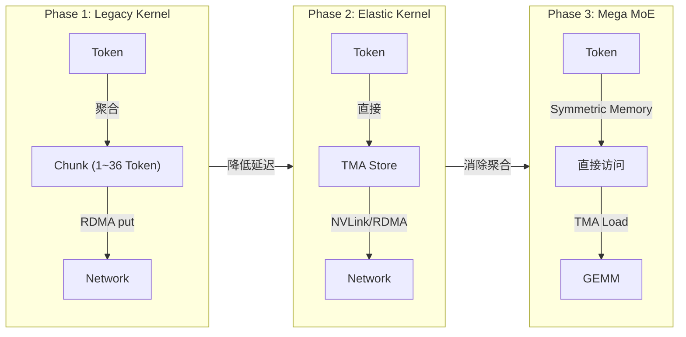

# Chunk Streaming 三方对比分析: 博客理论 ↔ DeepEP 源码 ↔ DeepGEMM Mega MoE

> 分析日期: 2026-07-30
> 分析目标: 从源码层面验证博客中 "Chunk Streaming" 概念，并与 Mega MoE 实现做三方对比
> 源码版本: DeepEP (legacy + elastic) / DeepGEMM (Blackwell SM100)

---

## 1. 核心结论摘要

**博客描述的 "Chunk Streaming" 在 DeepEP 中仅存在于 Legacy Kernel，现代 Elastic Kernel 已改为 Token 级 TMA Store；Mega MoE 则通过 Symmetric Memory 彻底消除了 Chunk 聚合需求。**

| 维度 | 博客理论模型 | DeepEP Legacy | DeepEP Elastic | Mega MoE |
|------|-------------|---------------|----------------|----------|
| 调度粒度 | Token | Token | Token | Token |
| 通信粒度 | Chunk (多 Token 聚合) | Chunk (固定 N Token) | **Token (单 Token TMA Store)** | **Token (单 Token TMA Load)** |
| 聚合机制 | Token Stream → Chunk → Network | 等待 Chunk 填满后 RDMA put | 无聚合，逐 Token 发送 | 无聚合，逐 Token 拉取 |
| Chunk 大小 | 未指定 | 1~36 Token (按 rank 数配置) | N/A | N/A |
| 流式行为 | Chunk 流过无需等 Batch | FIFO + Channel Tail | 逐 Token 异步发送 | Arrival Counter |
| 等待策略 | Chunk 填满 | `num_tokens_processed < chunked_send` | 无等待 | `arrival_count == BLOCK_M` |

---

## 2. 博客理论: Chunk 概念的定义

### 2.1 原始描述

博客第 2.1 节 "Normal Kernel: Throughput-Optimized Complete Pipeline" 中定义:

```
Token Buffer → Dispatch Buffer → Chunk Buffer → NVLink / RDMA Pipeline → Receive Buffer → Expert Buffer
```

关键定义:

> **"The network is unsuitable for single-Token sends — produces small packets, high startup overhead, low bandwidth utilization. Tokens are aggregated: Token Stream → Chunk → Network Transfer"**

> **"Token is the scheduling granularity; Chunk is the communication granularity"**

> **"Chunks flow through without waiting for entire Batch"**

### 2.2 博客模型的核心抽象

```
┌─────────────────────────────────────────────────────────────────┐
│                    博客: Chunk Streaming 模型                     │
│                                                                 │
│  Token Stream ──[聚合]──> Chunk ──[网络]──> Chunk Buffer        │
│  (调度粒度)      聚合       (通信粒度)    传输                   │
│                                                                 │
│  • Token: 调度器决策单位 (Router 输出)                           │
│  • Chunk: 网络传输单位 (多 Token 打包)                           │
│  • Chunk Buffer: 聚合/解聚缓冲区                                 │
│  • 流式: Chunk 流过网络，无需等待整个 Batch                       │
└─────────────────────────────────────────────────────────────────┘
```

---

## 3. DeepEP 实现: 源码层面的 Chunk 机制

### 3.1 关键发现: Chunk 仅存在于 Legacy Kernel

**重要**: DeepEP 有两个版本的 Kernel:

1. **Legacy Kernel** (`csrc/kernels/legacy/internode.cu`): 使用 Chunk 聚合机制
2. **Elastic Kernel** (`deep_ep/include/deep_ep/impls/dispatch.cuh`): **不使用 Chunk**，改为逐 Token TMA Store

博客描述与 Legacy Kernel 高度吻合，但现代 Elastic Kernel 已经演化到更细粒度的 Token 级传输。

### 3.2 Legacy Kernel 的 Chunk 大小配置

`csrc/legacy/config.hpp` 定义了 Chunk 相关的参数:

```cpp
// csrc/legacy/config.hpp
struct Config {
    int num_sms;
    int num_max_nvl_chunked_send_tokens;   // NVLink 发送 Chunk 大小
    int num_max_nvl_chunked_recv_tokens;   // NVLink 接收 Chunk 大小
    int num_max_rdma_chunked_send_tokens;  // RDMA 发送 Chunk 大小
    int num_max_rdma_chunked_recv_tokens;  // RDMA 接收 Chunk 大小
    // ...
};
```

`deep_ep/buffers/legacy.py` 给出了具体的 Chunk 大小配置 (按 rank 数):

```python
# deep_ep/buffers/legacy.py - Dispatch Config
config_map = {
    2:   Config(num_sms, 24, 256,  6, 128),
    4:   Config(num_sms,  6, 256,  6, 128),
    8:   Config(num_sms,  6, 256,  6, 128),
    16:  Config(num_sms, 36, 288, 20, 128),
    24:  Config(num_sms, 32, 288,  8, 128),
    32:  Config(num_sms, 32, 288,  8, 128),
    64:  Config(num_sms, 32, 288,  8, 128),
    96:  Config(num_sms, 20, 480, 12, 128),
    128: Config(num_sms, 20, 560, 12, 128),
    # Config 参数顺序: (num_sms, nvl_send, nvl_recv, rdma_send, rdma_recv)
}
```

**Chunk 大小分析**:

| 规模 | NVLink Send Chunk | NVLink Recv Chunk | RDMA Send Chunk | RDMA Recv Chunk |
|------|-------------------|-------------------|-----------------|-----------------|
| 2 ranks | 24 Token | 256 Token | 6 Token | 128 Token |
| 8 ranks | 6 Token | 256 Token | 6 Token | 128 Token |
| 32 ranks | 32 Token | 288 Token | 8 Token | 128 Token |
| 128 ranks | 20 Token | 560 Token | 12 Token | 128 Token |

**设计规律**:
- **Send Chunk 远小于 Recv Chunk**: Send 是 "每次最多发多少"，Recv 是 "环形缓冲区多大"
- **Send Chunk 通常 1~36 Token**: 这是一个很小的数字，说明 "Chunk" 并非大聚合
- **RDMA Send 普遍 ≤ NVLink Send**: RDMA 启动开销更大，但 Chunk 反而更小 (因为 RDMA 带宽更高)

### 3.3 Legacy Kernel 的 Chunk 发送机制

`csrc/kernels/legacy/internode.cu` 的核心发送逻辑:

```cpp
// csrc/kernels/legacy/internode.cu - RDMA Chunk 发送
// 等待足够 Token 积累或全部处理完成
auto num_tokens_processed = processed_tail - synced_last_issued_tail;
if (num_tokens_processed != synced_num_tokens_to_send and
    num_tokens_processed < num_max_rdma_chunked_send_tokens)
    continue;  // 积累更多 Token

// 发起 RDMA send: 一次发送一个 Chunk
auto num_tokens_to_issue = min(num_tokens_processed, num_max_rdma_chunked_send_tokens);
EP_DEVICE_ASSERT(num_tokens_to_issue >= 0);

// 执行 RDMA put
nvshmemi_ibgda_put_nbi_warp<true>(
    dst_ptr, src_ptr,
    num_bytes_per_token * num_tokens_to_issue,  // Chunk 总字节数
    translate_dst_rdma_rank(dst_rdma_rank, nvl_rank),
    channel_id, lane_id, 0
);
```

**关键逻辑**:
1. 等待直到 `num_tokens_processed >= chunked_send_size` **或者** 所有 Token 都已就绪
2. 每次 RDMA put 发送 `min(已处理, chunk_size)` 个 Token
3. 更新 channel tail 通知接收方

### 3.4 Legacy Kernel 的 NVLink Chunk 发送

```cpp
// csrc/kernels/legacy/internode.cu - NVLink Chunk 发送 (Combine 阶段)
// Iterate over all tokens and send by chunks
int current_rdma_idx = channel_id % kNumRDMARanks;
while (true) {
    // 检查接收方缓冲区是否有空间
    int num_used_slots = cached_channel_tail_idx - cached_channel_head_idx;
    is_lane_ready = num_max_nvl_chunked_recv_tokens_per_rdma - num_used_slots
                    >= num_max_nvl_chunked_send_tokens;

    // 计算本次发送的 Token 数
    int num_tokens_in_chunk = __shfl_sync(0xffffffff,
        min(num_max_nvl_chunked_send_tokens, token_end_idx - token_start_idx),
        current_rdma_idx);

    // Send by chunk: 逐 Token 写入 NVLink 对称缓冲区
    for (int chunk_idx = 0; chunk_idx < num_tokens_in_chunk; ++chunk_idx, ++token_idx) {
        int dst_slot_idx = (cached_channel_tail_idx++) % num_max_nvl_chunked_recv_tokens_per_rdma;
        // TMA load from local + TMA store to remote
        tma_load_1d(tma_buffer, shifted_x, tma_mbarrier, hidden_bytes);
        tma_store_1d(tma_buffer, shifted_x_buffers, num_bytes_per_token, false);
    }
}
```

### 3.5 Elastic Kernel: 无 Chunk 的 Token 级发送

现代 Elastic Kernel (`dispatch.cuh`) **完全摒弃了 Chunk 概念**:

```cpp
// deep_ep/include/deep_ep/impls/dispatch.cuh - 逐 Token 发送
// Iterate all tokens
const auto token_start = dispatch_warp_idx * kNumSMs + sm_idx;
const auto token_stride = kNumDispatchWarps * kNumSMs;
for (int token_idx = token_start; token_idx < num_tokens; token_idx += token_stride) {
    // 1. TMA load token from global to shared memory
    ptx::tma_load_1d(tma_buffer.get_hidden_ptr(),
                     math::advance_ptr(x, token_i64_idx * kNumHiddenBytes),
                     mbarrier_ptr, kNumHiddenBytes);

    // 2. TMA store to send buffer (per-token)
    ptx::tma_store_1d(send_buffer_ptr, tma_buffer.get_base_ptr(),
                      tma_buffer.get_num_bytes<false>());

    // 3. Issue TMA NVLink store (per-token, directly to remote)
    ptx::tma_store_1d(dst_ptr, tma_buffer.get_base_ptr(),
                      tma_buffer.get_num_bytes<false>());

    // 4. Issue RDMA put (per-token, for non-NVLink ranks)
    gin.put<team_t>(recv_buffer.get_token_buffer(stored_dst_slot_idx).get_base_ptr(),
                    send_buffer_ptr, tma_buffer.get_num_bytes<false>(), stored_dst_rank_idx);
}
```

**关键差异**: 现代 Elastic Kernel 的循环变量 `token_idx` 每次递增 1，每次操作处理 **一个 Token**，没有任何聚合逻辑。

### 3.6 为什么 Elastic Kernel 可以不用 Chunk？

| 因素 | Legacy (需要 Chunk) | Elastic (无需 Chunk) |
|------|---------------------|---------------------|
| 发送 API | `nvshmemi_ibgda_put_nbi_warp` (RDMA) | `gin.put<team_t>` (NCCL) + TMA Store |
| 启动开销 | 每次 RDMA put 有固定开销 | TMA Store 硬件流水线化 |
| 缓冲区模型 | 环形缓冲区 (slot 复用) | 直接写入目标地址 |
| 流控机制 | Channel Head/Tail | NCCL 内部流控 |
| 小包惩罚 | 高 (RDMA 小 packet 效率低) | 低 (TMA + NVLink burst) |

---

## 4. DeepGEMM Mega MoE: Token 级直接访问

### 4.1 Symmetric Memory: 消除 Chunk 需求的硬件基础

Mega MoE 使用 `torch.distributed._symmetric_memory` 创建跨 GPU 可直接访问的对称内存:

```python
# deep_gemm/mega/__init__.py
class SymmBuffer:
    def __init__(self, group, num_experts, num_max_tokens_per_rank, ...):
        self.buffer = symm_mem.empty(num_bytes, dtype=torch.int8, device='cuda')
        self.handle = symm_mem.rendezvous(self.buffer, group=group)
```

### 4.2 Dispatch: 逐 Token TMA Load

```cpp
// sm100_fp8_fp4_mega_moe.cuh - Dispatch Warp 主循环
constexpr uint32_t kNumGlobalWarps = kNumSMs * kNumDispatchWarps;
for (uint32_t token_idx = sm_idx * kNumDispatchWarps + warp_idx;
     ; token_idx += kNumGlobalWarps) {

    // 确定当前 token 属于哪个 expert、来自哪个 rank
    const uint32_t src_token_topk_idx = *workspace.get_src_token_topk_idx_ptr(
        current_expert_idx, current_rank_in_expert_idx, token_idx_in_rank);
    const uint32_t src_token_idx = src_token_topk_idx / kNumTopk;

    // Hidden bytes 分成 kNumChunks 个 pull (但这是 TMA 传输分块，非通信聚合)
    constexpr uint32_t kNumChunks = kHidden / kNumBytesPerPull;

    // TMA load token from remote rank via Symmetric Memory
    const auto src_base_ptr = sym_buffer.map(
        buffer.input_token_buffer.get_data_buffer(src_token_idx).get_base_ptr(),
        current_rank_in_expert_idx);

    if (cute::elect_one_sync()) {
        for (uint32_t i = 0; i < kNumChunks; ++ i) {
            ptx::tma_load_1d(
                pull_buffer.get_base_ptr(),
                math::advance_ptr(src_base_ptr, i * kNumBytesPerPull),
                pull_mbarrier, kNumBytesPerPull  // 每次拉取 kNumBytesPerPull 字节
            );
        }
    }

    // 写入本地 L1 Ring Buffer
    ptx::tma_store_1d(
        buffer.l1_token_buffer.get_data_buffer(pool_token_idx % kNumRingTokens).get_base_ptr(),
        pull_buffer.get_base_ptr(), pull_buffer.get_num_bytes());

    // 通知 GEMM Warp: 一个 Token 已就绪
    ptx::red_add_rel(workspace.get_l1_full_count_ptr(pool_block_idx % kNumRingBlocks),
                     is_last_token ? BLOCK_M - (token_idx_in_expert % BLOCK_M) : 1u);
}
```

### 4.3 关键发现: `kNumChunks` 的真实含义

Mega MoE 代码中确实存在 `kNumChunks`，但**与 DeepEP 的通信 Chunk 完全不同**:

```cpp
// Mega MoE 的 kNumChunks: TMA 传输分块 (硬件层面)
constexpr uint32_t kNumChunks = kHidden / kNumBytesPerPull;
// 例如: kHidden=7168, kNumBytesPerPull=16 => kNumChunks=448
```

**这里的 "Chunk" 含义**: 将一个 Token 的 Hidden 维度分成多次 TMA 传输，因为单次 TMA 有最大传输大小限制 (`kNumBytesPerPull`，通常 16 Bytes)。这是 **硬件传输分块**，不是 **通信聚合**。

### 4.4 计算启动: Arrival Counter 机制

```cpp
// GEMM TMA Load Warp - 等待 BLOCK_M 个 Token 到达即开始计算
if (block_phase == sched::BlockPhase::Linear1) {
    const auto ptr = workspace.get_l1_full_count_ptr(pool_block_idx % kNumRingBlocks);
    const auto expected = scheduler.template get_valid_m<false>();
    while (ptx::ld_acq(ptr) != expected);  // 自旋等待 BLOCK_M 个 Token 到达
}
```

**与 DeepEP 的区别**:
- DeepEP: 等待 Chunk 填满 → 转发 → 接收
- Mega MoE: 等待 BLOCK_M 个 Token 到达 → 开始 GEMM

---

## 5. 三方对比: 通信粒度演进

### 5.1 通信粒度对比表

| 维度 | DeepEP Legacy | DeepEP Elastic | Mega MoE |
|------|---------------|----------------|----------|
| **调度粒度** | Token | Token | Token |
| **通信粒度** | Chunk (1~36 Token) | Token | Token |
| **聚合单元** | `num_max_*_chunked_send_tokens` | 无 | 无 |
| **发送触发** | Chunk 填满 或 Batch 完成 | 逐 Token | 逐 Token |
| **发送 API** | `nvshmemi_ibgda_put_nbi_warp` | `gin.put` + TMA Store | TMA Load (pull) |
| **缓冲区模型** | 环形 Slot 缓冲区 | 直接写入目标 | Symmetric Memory 直接访问 |
| **接收通知** | Channel Tail 更新 | NCCL Barrier | Arrival Counter |
| **接收缓冲** | `num_max_*_chunked_recv_tokens` Slot | `num_max_tokens_per_rank` | `kNumRingTokens` Ring Buffer |

### 5.2 数据流对比

```mermaid
flowchart TB
    subgraph A["DeepEP Legacy: Chunk 聚合"]
        T1[Token Stream] -->|"积累 N 个"| CB[Chunk Buffer]
        CB -->|"RDMA put (Chunk)"| NET[Network]
        NET -->|"RDMA recv"| RB[Receive Buffer]
        RB -->|解聚| EB[Expert Buffer]
    end

    subgraph B["DeepEP Elastic: Token 级"]
        T2[Token Stream] -->|"逐 Token"| TMA[TMA Store]
        TMA -->|"NVLink / RDMA"| RB2[Recv Buffer]
        RB2 -->|直接| EB2[Expert Buffer]
    end

    subgraph C["Mega MoE: Symmetric Memory"]
        T3[Token Stream] -->|"逐 Token"| SM[Symmetric Memory]
        SM -->|"TMA Load (pull)"| LB[L1 Ring Buffer]
        LB -->|"arrival == BLOCK_M"| GEMM[GEMM Compute]
    end
```



### 5.3 时间线对比

```
DeepEP Legacy:
  Token:  T0  T1  T2  T3  T4  T5  T6  T7  T8  T9
           │   │   │   │   │   │   │   │   │   │
  Chunk:   ├───[Chunk0: T0-T5]───├───[Chunk1: T6-T9]───│
           │                       │                   │
  RDMA:   ──────[put Chunk0]──────────[put Chunk1]───────

DeepEP Elastic:
  Token:  T0  T1  T2  T3  T4  T5  T6  T7  T8  T9
           │   │   │   │   │   │   │   │   │   │
  TMA:   [store][store][store][store][store][store]...
           │   │   │   │   │   │   │   │   │   │
  NVLink: ──[T0]─[T1]─[T2]─[T3]─[T4]─[T5]─[T6]─[T7]─...

Mega MoE:
  Token:  T0  T1  T2  T3  T4  T5  T6  T7  T8  T9
           │   │   │   │   │   │   │   │   │   │
  TMA:   [load][load][load][load][load][load]...
           │   │   │   │   │   │   │   │   │   │
  L1:    [T0][T1][T2][T3]│[T4][T5][T6][T7]│
                          │                 │
  GEMM:  ────等待 BLOCK_M=4 ────│────等待 BLOCK_M=4 ────
               [GEMM Block0]      [GEMM Block1]
```

---

## 6. 为什么需要/不需要 Chunk: 硬件视角

### 6.1 RDMA 为什么需要 Chunk (Legacy)

```
RDMA 小 Packet 传输的问题:
┌──────────────────────────────────────────────────────┐
│  Packet Header: ~40 Bytes (IB Transport Header)       │
│  Payload: 128 Bytes (1 Token × 128 dim × FP8)        │
│  Efficiency: 128 / (128 + 40) = 76%                  │
│                                                       │
│  Chunk (8 Tokens):                                    │
│  Payload: 1024 Bytes                                  │
│  Efficiency: 1024 / (1024 + 40) = 96.2%              │
└──────────────────────────────────────────────────────┘
```

Legacy Kernel 使用 `nvshmemi_ibgda_put_nbi_warp` 直接操作 RDMA，每次 put 有固定的 header 开销，因此需要聚合。

### 6.2 NVLink 为什么可以不用 Chunk (Elastic)

```
NVLink 传输特性:
┌──────────────────────────────────────────────────────┐
│  • 无 per-packet header 开销                          │
│  • Burst 传输效率高，不依赖 packet 大小                │
│  • TMA 硬件自动处理地址计算和传输调度                  │
│  • 多个 TMA 请求可以流水线化执行                      │
│  • 直接内存访问，无 startup overhead                   │
└──────────────────────────────────────────────────────┘
```

Elastic Kernel 使用 NCCL `gin.put` + TMA Store，底层是 NVLink 直接内存访问，没有小包惩罚。

### 6.3 Symmetric Memory 为什么彻底不需要 Chunk (Mega MoE)

```
Symmetric Memory 传输特性:
┌──────────────────────────────────────────────────────┐
│  • NVLink 直接内存访问 (无 RDMA 跳转)                 │
│  • TMA Load (pull 模式): 接收方主动拉取               │
│  • 无 per-packet 开销                                 │
│  • 硬件保证传输效率，与 packet 大小无关                │
│  • 多个 TMA 请求可以流水线化执行                      │
└──────────────────────────────────────────────────────┘
```

---

## 7. Buffer 架构对比

### 7.1 DeepEP Legacy Buffer 结构

```cpp
// csrc/legacy/config.hpp - Buffer 大小计算
size_t get_rdma_buffer_size_hint(int64_t hidden_bytes, int num_ranks) const {
    size_t num_bytes = 0;
    // 元数据缓冲区
    num_bytes += num_channels * num_rdma_ranks * (...) * sizeof(int);
    // 数据缓冲区: 以 chunked_recv_tokens 为基准
    num_bytes += num_channels * num_rdma_ranks
                 * num_max_rdma_chunked_recv_tokens * hidden_bytes * 2;  // ×2 for send/recv
    // 元数据: SourceMeta, topk_idx, topk_weights, scales
    num_bytes += num_channels * num_rdma_ranks
                 * num_max_rdma_chunked_recv_tokens * internode::get_source_meta_bytes() * 2;
    // ...
}
```

**Buffer 结构**:
```
RDMA Buffer (per channel, per rank):
┌─────────────────────────────────────────────────────────┐
│  Channel 0                                               │
│  ┌─────────────────────────────────────────────────────┐ │
│  │ Slot 0 │ Slot 1 │ ... │ Slot (chunked_recv-1)      │ │
│  │ Token  │ Token  │     │ Token                      │ │
│  └─────────────────────────────────────────────────────┘ │
│  Head/Tail 指针管理环形缓冲区                              │
│  Channel 1                                               │
│  ┌─────────────────────────────────────────────────────┐ │
│  │ Slot 0 │ Slot 1 │ ... │ Slot (chunked_recv-1)      │ │
│  └─────────────────────────────────────────────────────┘ │
└─────────────────────────────────────────────────────────┘
```

### 7.2 DeepEP Elastic Buffer 结构

```cpp
// deep_ep/include/deep_ep/common/layout.cuh
template <bool kWithMBarrier>
struct BufferLayout {
    TokenLayout token_layout;
    int num_ranks;
    int num_max_tokens_per_rank;  // 无 chunk 概念

    int64_t get_num_bytes_per_rank() const {
        return num_max_tokens_per_rank * get_num_bytes_per_token();
    }

    int64_t get_num_bytes() const {
        return get_num_bytes_per_rank() * num_ranks;
    }
};
```

**Buffer 结构**:
```
Elastic Buffer:
┌─────────────────────────────────────────────────────────┐
│  Rank 0: Token 0 | Token 1 | ... | Token (max-1)       │
│  Rank 1: Token 0 | Token 1 | ... | Token (max-1)       │
│  ...                                                     │
│  Send Buffer: Token 0 | Token 1 | ... | Token (max-1)   │
└─────────────────────────────────────────────────────────┘
```

### 7.3 Mega MoE Buffer 结构

```cpp
// sm100_fp8_fp4_mega_moe.cuh
const auto buffer = layout::MegaMoEBuffer(
    sym_buffer.get_base_ptr(),
    kHidden, kIntermediateHidden,
    kNumRanks, kNumExperts,
    kNumMaxTokensPerRank, kNumTopk,
    kNumRingTokens, kNumSFRingTokens,
    /*with_sf=*/ true, kNumSharedExperts
);
```

**Buffer 结构**:
```
Mega MoE Buffer (Symmetric Memory):
┌─────────────────────────────────────────────────────────┐
│  Input Token Buffer (per rank)                           │
│  ┌─────────────────────────────────────────────────────┐ │
│  │ Rank 0: T0 | T1 | ... | T(max-1)                   │ │
│  │ Rank 1: T0 | T1 | ... | T(max-1)                   │ │
│  │ ...                                                  │ │
│  └─────────────────────────────────────────────────────┘ │
│                                                          │
│  L1 Ring Buffer (local, per SM)                          │
│  ┌─────────────────────────────────────────────────────┐ │
│  │ Ring Token 0 | Ring Token 1 | ... | Ring Token (R-1)│ │
│  │ (BLOCK_M 个 Token 一个 Block)                        │ │
│  └─────────────────────────────────────────────────────┘ │
└─────────────────────────────────────────────────────────┘
```

---

## 8. Normal vs Low-Latency: Chunk 策略差异

### 8.1 博客描述

| 维度 | Normal Kernel | Low-Latency Kernel |
|------|---------------|--------------------|
| 场景 | Training / Prefill | Decode |
| 目标 | 最大化吞吐 | 最小化延迟 |
| Chunk | **关键** | **减少** |
| 流水线 | 深 | 浅 |
| 通信路径 | NVLink + RDMA 协调 | 直连 RDMA |

### 8.2 源码验证

**Legacy Low-Latency Kernel** (`csrc/legacy/config.hpp`):

```cpp
// LowLatencyLayout: 无 Chunk 概念，直接 Token 级传输
struct LowLatencyLayout {
    size_t total_bytes = 0;
    LowLatencyBuffer buffers[2];  // odd/even for ping-pong

    LowLatencyLayout(void* rdma_buffer, int num_max_dispatch_tokens_per_rank,
                     int hidden, int num_ranks, int num_experts) {
        // Message sizes: 单 Token 消息大小
        size_t num_bytes_per_dispatch_msg = sizeof(int4) +
            std::max(hidden * sizeof(nv_bfloat16), hidden + num_scales * sizeof(float));

        // Send buffer: 直接按 Token 数分配
        size_t dispatch_send_buffer_bytes = num_max_dispatch_tokens_per_rank
                                            * num_bytes_per_dispatch_msg;
        // Recv buffer: 按 expert × token 分配
        size_t dispatch_recv_data_buffer_bytes = num_experts * num_max_dispatch_tokens_per_rank
                                                 * num_bytes_per_dispatch_msg;
    }
};
```

**关键发现**: Low-Latency Kernel **完全没有 Chunk 概念**，直接以 Token 为单位发送。这与博客 "Low-Latency Kernel 减少 Chunk" 的描述一致 — 实际上是 **彻底消除** Chunk。

### 8.3 为什么 Low-Latency 可以不用 Chunk？

```
Decode 场景特点:
┌──────────────────────────────────────────────────────┐
│  • 每个 Request 只有 1~几个 Token                     │
│  • 等待 Chunk 填满的延迟不可接受                       │
│  • 单 Token 延迟 >> 带宽利用率                         │
│  • 直接 RDMA 发送，无需 NVLink 转发                    │
└──────────────────────────────────────────────────────┘
```

---

## 9. 流式行为对比: "Flow Through Without Waiting"

### 9.1 DeepEP Legacy: Channel Tail 流式

```cpp
// csrc/kernels/legacy/internode.cu - 发送端
// 更新 channel tail，通知接收方数据已就绪
if (lane_id == dst_rdma_rank) {
    last_issued_tail += num_tokens_to_issue;
    nvshmemi_ibgda_amo_nonfetch_add(rdma_channel_tail.buffer(rdma_rank),
                                    num_tokens_to_issue, ...);
}

// 接收端 - 等待 tail 更新
while (true) {
    auto meta_0 = ld_volatile_global(rdma_channel_meta.recv_buffer(lane_id) + dst_nvl_rank);
    // ... 检查是否有新数据到达 ...
    if (数据就绪) break;
}
```

### 9.2 Mega MoE: Arrival Counter 流式

```cpp
// sm100_fp8_fp4_mega_moe.cuh - Dispatch 端
// 每写入一个 Token，增加 arrival count
ptx::red_add_rel(workspace.get_l1_full_count_ptr(pool_block_idx % kNumRingBlocks),
                 is_last_token ? BLOCK_M - (token_idx_in_expert % BLOCK_M) : 1u);

// GEMM 端 - 等待 BLOCK_M 个 Token 到达
if (block_phase == sched::BlockPhase::Linear1) {
    const auto ptr = workspace.get_l1_full_count_ptr(pool_block_idx % kNumRingBlocks);
    const auto expected = scheduler.template get_valid_m<false>();
    while (ptx::ld_acq(ptr) != expected);  // 自旋等待
}
```

### 9.3 流式行为对比

| 维度 | DeepEP Legacy | Mega MoE |
|------|---------------|----------|
| 通知单位 | Chunk (N Token) | Token (1 Token) |
| 通知机制 | Channel Tail (RDMA atomic) | Arrival Counter (NVLink red_add) |
| 等待单位 | Chunk | BLOCK_M Token |
| 触发条件 | Chunk 填满 | BLOCK_M Token 到达 |
| 计算启动 | 收到完整 Chunk | 收到 BLOCK_M Token |

---

## 10. 演进路径总结

### 10.1 Chunk 概念的演化



### 10.2 通信粒度演进

```
RDMA 时代 (Legacy):
  Token (调度) → Chunk (通信) → Chunk Buffer → Token (计算)
  通信粒度 > 调度粒度，需要聚合

NVLink + NCCL 时代 (Elastic):
  Token (调度) = Token (通信) → Recv Buffer → Token (计算)
  通信粒度 = 调度粒度，无需聚合

Symmetric Memory 时代 (Mega MoE):
  Token (调度) = Token (通信) = Token (计算)
  通信完全透明，Token 即一切
```

### 10.3 设计哲学对比

| 系统 | 设计哲学 | 核心约束 |
|------|----------|----------|
| DeepEP Legacy | **适配网络硬件**: 聚合小包以匹配 RDMA 特性 | RDMA per-packet 开销 |
| DeepEP Elastic | **适配拓扑**: NVLink + RDMA 统一流控 | 拓扑不对称 |
| Mega MoE | **通信适配计算**: Symmetric Memory 使通信透明 | NVLink 直接访问 |

---

## 11. 关键问题回答

### Q1: 博客描述的 "Chunk Streaming" 在源码中是否存在？

**答案**: 部分存在。
- **Legacy Kernel**: 完全吻合，有明确的 Chunk 大小配置和聚合机制
- **Elastic Kernel**: 不存在，已改为 Token 级 TMA Store
- **Mega MoE**: 不存在，使用 Symmetric Memory 直接访问

### Q2: Chunk 的实际大小是多少？

**答案**: 根据 `deep_ep/buffers/legacy.py`:
- **NVLink Send**: 1~36 Token (按 rank 数动态配置)
- **NVLink Recv**: 256~720 Token (环形缓冲区大小)
- **RDMA Send**: 6~20 Token
- **RDMA Recv**: 128 Token (固定)

### Q3: 为什么现代 Kernel 不再需要 Chunk？

**答案**: 硬件演进:
1. **Legacy**: 直接操作 RDMA (`nvshmemi_ibgda_put_nbi_warp`)，每次 put 有 header 开销
2. **Elastic**: 使用 NCCL + TMA Store，NVLink 无 per-packet 开销
3. **Mega MoE**: Symmetric Memory + TMA Load，直接内存访问

### Q4: Mega MoE 的 `kNumChunks` 是通信 Chunk 吗？

**答案**: 不是。Mega MoE 的 `kNumChunks = kHidden / kNumBytesPerPull` 是将一个 Token 的 Hidden 维度分成多次 TMA 传输，是 **硬件传输分块**，不是 **通信聚合**。

### Q5: "Flow through without waiting for entire Batch" 如何实现？

**答案**:
- **DeepEP Legacy**: Channel Tail 机制，发送端每完成一个 Chunk 就更新 Tail，接收端自旋检查
- **Mega MoE**: Arrival Counter 机制，每写入一个 Token 就增加 Counter，GEMM 端等待 BLOCK_M 个 Token 到达即开始计算

---

## 12. 代码引用索引

| 文件 | 行号 | 内容 |
|------|------|------|
| `csrc/legacy/config.hpp` | 24-51 | Chunk 大小配置结构体 |
| `csrc/legacy/config.hpp` | 75-99 | RDMA Buffer 大小计算 |
| `deep_ep/buffers/legacy.py` | 233-260 | Dispatch Chunk 配置表 |
| `deep_ep/buffers/legacy.py` | 263-290 | Combine Chunk 配置表 |
| `csrc/kernels/legacy/internode.cu` | 796-847 | RDMA Chunk 发送逻辑 |
| `csrc/kernels/legacy/internode.cu` | 1833-1927 | NVLink Chunk 发送逻辑 |
| `csrc/kernels/legacy/internode.cu` | 649-663 | Chunk 缓冲区满等待 |
| `deep_ep/include/deep_ep/impls/dispatch.cuh` | 277-394 | Elastic Token 级发送 (无 Chunk) |
| `deep_ep/include/deep_ep/common/layout.cuh` | 251-311 | BufferLayout (无 Chunk) |
| `DeepGEMM/.../sm100_fp8_fp4_mega_moe.cuh` | 430-599 | Mega MoE Dispatch Token 级拉取 |
| `DeepGEMM/.../sm100_fp8_fp4_mega_moe.cuh` | 517-519 | kNumChunks 定义 (TMA 分块) |
| `DeepGEMM/.../sm100_fp8_fp4_mega_moe.cuh` | 593-596 | Arrival Counter 通知 |

---

## 13. 总结

### 13.1 博客理论与源码的对应关系

| 博客描述 | 源码验证 | 结论 |
|----------|----------|------|
| "Token 是调度粒度" | ✅ 所有 Kernel 都以 Token 为调度单位 | 准确 |
| "Chunk 是通信粒度" | ⚠️ 仅 Legacy Kernel 成立 | 部分准确 |
| "Token Stream → Chunk → Network" | ✅ Legacy Kernel 准确 | 准确 (Legacy) |
| "Chunks flow through without waiting" | ✅ Channel Tail 机制 | 准确 |

### 13.2 核心洞察

1. **Chunk 是特定硬件约束下的产物**: 直接操作 RDMA 时，小包传输效率低，需要聚合
2. **硬件演进消除 Chunk**: NVLink + TMA + Symmetric Memory 使 Token 级传输成为可能
3. **Mega MoE 的 "Chunk" 是不同概念**: `kNumChunks` 是 TMA 传输分块，非通信聚合
4. **流式行为本质相同**: 无论是 Chunk 还是 Token，核心都是 "无需等待整个 Batch"

### 13.3 演进方向

```
通信粒度演进:
  Chunk (1~36 Token) → Token → (未来) 完全透明

设计哲学演进:
  适配网络硬件 → 适配拓扑 → 通信适配计算

最终目标:
  Token → Compute (通信完全透明)
```
