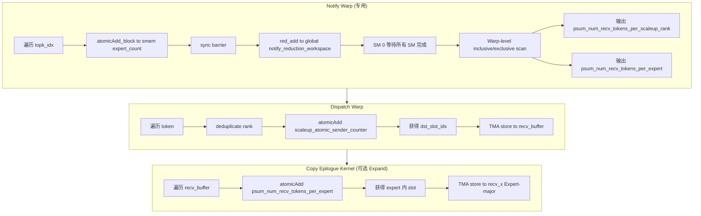
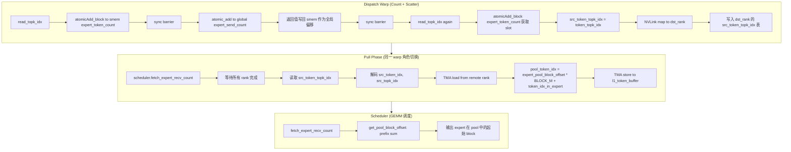

# 06.10 Counting Sort / Bucketization 三方对比分析：博客 ↔ DeepEP ↔ DeepGEMM Mega MoE

> 分析日期: 2026-07-30
> 目标: 验证博客中 "Count → Prefix Sum → Scatter" 概念在 DeepEP 和 DeepGEMM Mega MoE 两个代码库中的具体实现，并进行三方对比

---

## 1. 核心结论

**是的，Count → Prefix Sum → Scatter 在两个代码库中都存在**，但实现策略有显著差异：

| 维度 | DeepEP | DeepGEMM Mega MoE |
|------|--------|-------------------|
| **Count 位置** | Notify Warp（专用） | Dispatch Warp（与 scatter 共用） |
| **Prefix Sum 策略** | 两级：SM 内 smem atomic → 全局 reduction → SM 0 warp-level scan | 两级：SM 内 smem atomic → SM 间 global atomic（64-bit 编码） |
| **Scatter 产物** | `dst_buffer_slot_idx`（目标 rank 的 slot 位置） | `src_token_topk_idx`（源 token 索引表，供 pull 使用） |
| **数据移动** | TMA store 直接写入目标 rank 对称内存 | NVLink pull：目标 rank 主动拉取 |
| **连续 layout 产生** | `dispatch_copy_epilogue` 中的 expand 模式 | Pull 阶段写入 pool buffer |

**关键演化**：
- DeepEP 的 Counting Sort 是 **通信准备**（为 NVLink/RDMA 准备目标地址）
- Mega MoE 的 Counting Sort 是 **计算准备**（为 Tensor Core 准备 scatter 索引表）
- Mega MoE 的 Counting Sort 产物（scatter 索引表）**同时服务于通信和计算**

---

## 2. 博客原文引用

> **7.1 Does Sort Exist?**
>
> Yes, but not traditional sorting. Core process: **Count → Prefix Sum → Scatter**
>
> Essentially **Counting Sort / Bucketization**. Goal: produce contiguous layout, not sort by size.

博客的核心洞察：
1. **不是传统排序**，而是 Counting Sort / Bucketization
2. **目标：产生连续 layout**，而非按大小排序
3. 核心流程：Count（统计每个 expert 的 token 数）→ Prefix Sum（计算每个 expert 的起始偏移）→ Scatter（将 token 写入对应位置）

---

## 3. DeepEP 实现分析

### 3.1 整体架构

DeepEP 的 Counting Sort 分布在 **两个 kernel** 中：

```
┌─────────────────────────────────────────────────────────────────────────────┐
│                    dispatch_impl (主 Dispatch Kernel)                        │
│                                                                             │
│  ┌──────────────────────────────────────────────────────────────────────┐   │
│  │ Notify Warp (warp_idx < kNumNotifyWarps)                             │   │
│  │                                                                      │   │
│  │  Step 1: COUNT          Step 2: PREFIX SUM         Step 3: 输出      │   │
│  │  ┌──────────────┐       ┌───────────────────┐      ┌──────────────┐  │   │
│  │  │ atomicAdd to │  ──▶  │ SM 0 warp-level   │──▶  │ psum_num_    │  │   │
│  │  │ smem expert_ │       │ inclusive/exclusive│     │ recv_tokens_ │  │   │
│  │  │ count[expert]│       │ scan              │      │ per_expert   │  │   │
│  │  └──────────────┘       └───────────────────┘      └──────────────┘  │   │
│  └──────────────────────────────────────────────────────────────────────┘   │
│                                                                             │
│  ┌──────────────────────────────────────────────────────────────────────┐   │
│  │ Dispatch Warp (warp_idx >= kNumNotifyWarps)                          │   │
│  │                                                                      │   │
│  │  Step 4: SCATTER                                                     │   │
│  │  ┌──────────────────────────────────────────────────────────────┐    │   │
│  │  │ atomicAdd(scaleup_atomic_sender_counter + dst_rank_idx, 1)   │    │   │
│  │  │ → 获得 dst_slot_idx                                           │    │   │
│  │  │ → TMA store 到目标 rank 的对称内存                              │    │   │
│  │  └──────────────────────────────────────────────────────────────┘    │   │
│  └──────────────────────────────────────────────────────────────────────┘   │
└─────────────────────────────────────────────────────────────────────────────┘
                                      │
                                      ▼
┌─────────────────────────────────────────────────────────────────────────────┐
│              dispatch_copy_epilogue_impl (Copy Epilogue Kernel)              │
│                                                                             │
│  Step 5: EXPAND MODE SCATTER (可选)                                         │
│  ┌──────────────────────────────────────────────────────────────────────┐   │
│  │ atomicAdd(psum_num_recv_tokens_per_expert + dst_expert_idx, 1)       │   │
│  │ → 获得 expert 内的 slot 位置                                          │   │
│  │ → TMA store 到 recv_x（Expert-major layout）                          │   │
│  └──────────────────────────────────────────────────────────────────────┘   │
└─────────────────────────────────────────────────────────────────────────────┘
```

### 3.2 Step 1: COUNT — Notify Warp 本地计数

**文件**: `deep_ep/include/deep_ep/impls/dispatch.cuh`，line 92-108

```cpp
// Atomic add on shared memory
EP_STATIC_ASSERT(kNumTopk <= 32, "Insufficient lanes");
const auto global_warp_idx = warp_idx * kNumSMs + sm_idx;
for (int i = global_warp_idx; i < num_tokens; i += kNumNotifyWarps * kNumSMs) {
    // Expert choice can not be redundant
    const auto dst_expert_idx = lane_idx < kNumTopk ?
        static_cast<int>(__ldg(topk_idx + i * kNumTopk + lane_idx)) : -1;
    if (dst_expert_idx >= 0)
        atomicAdd_block(expert_count + dst_expert_idx, 1);

    // Rank choice should do deduplication here
    const auto dst_rank_idx = dst_expert_idx >= 0 ? dst_expert_idx / kNumExpertsPerRank : -1;
    if (ptx::deduplicate(dst_rank_idx, lane_idx) and dst_rank_idx >= 0)
        atomicAdd_block(rank_count + dst_rank_idx, 1);
}
ptx::named_barrier<kNumNotifyThreads>(kNotifyBarrierIndex);
```

**机制**：
- `expert_count` 和 `rank_count` 是 smem 数组，大小为 `kNumRanks + kNumExperts`
- 每个 SM 的 notify warp 遍历本地 token 的 topk_idx
- 对每个 `(token, expert)` pair，执行 `atomicAdd_block(expert_count + dst_expert_idx, 1)`
- Rank 维度需要 **deduplication**（一个 token 的多个 expert 可能落在同一 rank）
- 结果：`expert_count[i]` = 本 SM 发给 expert i 的 token 数量

### 3.3 Step 2: PREFIX SUM — 跨 SM 聚合 + Warp-level Scan

**文件**: `deep_ep/include/deep_ep/impls/dispatch.cuh`，line 110-257

#### Level 1: 全局 Reduction（line 110-115）

```cpp
// Do full-grid reduction
#pragma unroll
for (int i = thread_idx; i < kNumRanks + kNumExperts; i += kNumNotifyThreads) {
    const int64_t counter = (1ll << 32ll) | rank_expert_count[i];
    ptx::red_add(workspace_layout.get_notify_reduction_workspace_ptr() + i, counter);
}
```

**机制**：
- 每个 SM 将本地计数通过 `red_add` 原子加到全局 workspace
- 64-bit 编码：高 32-bit 是 SM 完成计数，低 32-bit 是 token 数

#### Level 2: SM 0 Warp-level Scan（line 232-257）

```cpp
// Do prefix sum by the warps
const auto do_psum = [=](const int* count, int* out, const int n, const int is_exclusive) {
    int psum = 0;
    #pragma unroll
    for (int i = 0; i < math::ceil_div(n + is_exclusive, 32); ++ i) {
        const auto idx = i * 32 + lane_idx;
        const auto mem_idx = idx - is_exclusive;
        const auto value = (0 <= mem_idx and mem_idx < n) ? count[mem_idx] : 0;
        const auto sum = psum + ptx::warp_inclusive_sum(value, lane_idx);

        // Store into global memory
        if (idx < n + is_exclusive)
            out[idx] = sum;

        // Update `psum` by using the last lane's value
        psum = ptx::exchange(sum, 31);
    }
};
if (warp_idx == 0) {
    // Inclusive prefix sum
    do_psum(rank_count, psum_num_recv_tokens_per_scaleup_rank, kNumRanks, 0);
} else if (warp_idx == 1) {
    // Exclusive prefix sum for later expanding
    do_psum(expert_count, psum_num_recv_tokens_per_expert, kNumExpertsPerRank, 1);
}
```

**机制**：
- 使用 **warp-level inclusive scan**（`ptx::warp_inclusive_sum`）
- Warp 0 做 rank 维度的 inclusive prefix sum
- Warp 1 做 expert 维度的 exclusive prefix sum（用于 expand 模式）
- 输出：`psum_num_recv_tokens_per_scaleup_rank` 和 `psum_num_recv_tokens_per_expert`

### 3.4 Step 3: SCATTER — Dispatch Warp 分配目标 Slot

**文件**: `deep_ep/include/deep_ep/impls/dispatch.cuh`，line 336-351

```cpp
// Deduplicate ranks and assign slots
int stored_dst_slot_idx = -1;
if constexpr (kReuseSlotIndices) {
    if (lane_idx < kNumTopk)
        stored_dst_slot_idx = __ldg(dst_buffer_slot_idx + token_idx * kNumTopk + lane_idx);
    stored_dst_slot_idx = stored_dst_slot_idx >= 0 ?
        (stored_dst_slot_idx - rank_idx * kNumMaxTokensPerRank) : -1;
} else {
    if (ptx::deduplicate(stored_dst_rank_idx, lane_idx) and stored_dst_rank_idx >= 0)
        stored_dst_slot_idx = atomicAdd(workspace_layout.get_scaleup_atomic_sender_counter() + stored_dst_rank_idx, 1);
    if (lane_idx < kNumTopk) {
        const auto value = stored_dst_slot_idx >= 0 ?
            rank_idx * kNumMaxTokensPerRank + stored_dst_slot_idx : -1;
        dst_buffer_slot_idx[token_idx * kNumTopk + lane_idx] = value;
    }
}
```

**机制**：
- 对每个 token 的 top-k 选择，去重后通过 `atomicAdd` 获取目标 rank 内的 slot 索引
- `scaleup_atomic_sender_counter` 是全局原子计数器，每个 rank 一个
- 结果写入 `dst_buffer_slot_idx`，用于后续 TMA store 寻址

### 3.5 Step 4: 数据移动 — TMA Store 到目标 Rank

**文件**: `deep_ep/include/deep_ep/impls/dispatch.cuh`，line 371-393

```cpp
// Issue TMA NVLink stores
const auto dst_ptr = stored_dst_slot_idx >= 0 ?
    gin.get_sym_ptr<team_t>(recv_buffer.get_token_buffer(stored_dst_slot_idx).get_base_ptr(), stored_dst_rank_idx) :
    nullptr;
if (dst_ptr != nullptr)
    ptx::tma_store_1d(dst_ptr, tma_buffer.get_base_ptr(), tma_buffer.get_num_bytes<false>());
ptx::tma_store_commit();

// Issue RDMA put
if constexpr (not kIsScaleupNVLink) {
    ptx::tma_store_wait<1>();
    if (stored_dst_slot_idx >= 0 and dst_ptr == nullptr) {
        gin.put<team_t>(recv_buffer.get_token_buffer(stored_dst_slot_idx).get_base_ptr(),
                        send_buffer_ptr, tma_buffer.get_num_bytes<false>(), stored_dst_rank_idx);
    }
}
```

### 3.6 Step 5: Expand Mode Scatter（Copy Epilogue Kernel）

**文件**: `deep_ep/include/deep_ep/impls/dispatch_copy_epilogue.cuh`，line 120-122

```cpp
} else if (kDoExpand and not kCachedMode and dst_expert_idx >= 0) {
    dst_tensor_idx = atomicAdd(psum_num_recv_tokens_per_expert + dst_expert_idx, 1);
}
```

**机制**：
- 在 expand 模式下，token 需要按 expert 连续排列
- 使用 `psum_num_recv_tokens_per_expert` 作为原子计数器
- `atomicAdd` 返回 expert 内的 slot 位置
- 最终通过 TMA store 写入 `recv_x`（Expert-major layout）

---

## 4. DeepGEMM Mega MoE 实现分析

### 4.1 整体架构

Mega MoE 的 Counting Sort 完全在 **一个 kernel** 内的 dispatch warp 中完成：

```
┌─────────────────────────────────────────────────────────────────────────────┐
│                    sm100_fp8_fp4_mega_moe_impl                               │
│                                                                             │
│  ┌──────────────────────────────────────────────────────────────────────┐   │
│  │ Dispatch Warp (warp_idx < kNumDispatchWarps)                         │   │
│  │                                                                      │   │
│  │  Step 1: COUNT          Step 2: PREFIX SUM         Step 3: SCATTER   │   │
│  │  ┌──────────────┐       ┌───────────────────┐      ┌──────────────┐  │   │
│  │  │ atomicAdd to │  ──▶  │ atomicAdd to      │──▶  │ atomicAdd to │  │   │
│  │  │ smem_expert  │       │ global expert_    │      │ get dst slot │  │   │
│  │  │ _count[expert]│      │ send_count →      │      │ write src_   │  │   │
│  │  │              │       │ get global offset │      │ token_topk_idx│  │   │
│  │  └──────────────┘       └───────────────────┘      └──────────────┘  │   │
│  └──────────────────────────────────────────────────────────────────────┘   │
│                                                                             │
│  ┌──────────────────────────────────────────────────────────────────────┐   │
│  │ Pull Warp (同一 dispatch warp，角色切换)                               │   │
│  │                                                                      │   │
│  │  Step 4: PULL + 连续化                                                │   │
│  │  ┌──────────────────────────────────────────────────────────────┐    │   │
│  │  │ 读取 scatter 表 → TMA pull token → 写入 pool buffer          │    │   │
│  │  │ (expert_pool_block_offset 决定 pool 中的位置)                 │    │   │
│  │  └──────────────────────────────────────────────────────────────┘    │   │
│  └──────────────────────────────────────────────────────────────────────┘   │
│                                                                             │
│  ┌──────────────────────────────────────────────────────────────────────┐   │
│  │ Scheduler (GEMM 调度)                                                │   │
│  │                                                                      │   │
│  │  Step 5: POOL BLOCK OFFSET (Prefix Sum)                              │   │
│  │  ┌──────────────────────────────────────────────────────────────┐    │   │
│  │  │ get_pool_block_offset: 对 stored_num_tokens_per_expert       │    │   │
│  │  │ 做 prefix sum → expert 在 pool 中的起始 block 位置            │    │   │
│  │  └──────────────────────────────────────────────────────────────┘    │   │
│  └──────────────────────────────────────────────────────────────────────┘   │
└─────────────────────────────────────────────────────────────────────────────┘
```

### 4.2 Step 1: COUNT — Dispatch Warp 本地计数

**文件**: `deep_gemm/include/deep_gemm/impls/sm100_fp8_fp4_mega_moe.cuh`，line 355-359

```cpp
// Count experts' tokens
read_topk_idx([&](const uint32_t& token_topk_idx, const int& expert_idx) {
   atomicAdd_block(shared_storage.expert_token_count + expert_idx, 1);
});
ptx::sync_aligned(kNumDispatchThreads, kDispatchBarrierIdx);
```

**机制**：
- `expert_token_count` 是 smem 数组，大小为 `kNumExperts`
- 每个 SM 的 dispatch warp 遍历本地 token 的 topk_idx
- 对每个 `(token, expert)` pair，执行 `atomicAdd_block`
- 结果：`expert_token_count[i]` = 本 SM 发给 expert i 的 token 数量

### 4.3 Step 2: PREFIX SUM — 跨 SM 聚合得到全局偏移

**文件**: `deep_gemm/include/deep_gemm/impls/sm100_fp8_fp4_mega_moe.cuh`，line 361-368

```cpp
// Get SM offset (~6.5 us)
#pragma unroll
for (uint32_t i = thread_idx; i < kNumExperts; i += kNumDispatchThreads) {
    const uint64_t send_value = (1ull << 32) | static_cast<uint64_t>(shared_storage.expert_token_count[i]);
    shared_storage.expert_token_count[i] = static_cast<uint32_t>(
        ptx::atomic_add(workspace.get_expert_send_count_ptr(i), send_value));
}
ptx::sync_aligned(kNumDispatchThreads, kDispatchBarrierIdx);
```

**机制**：
- `expert_send_count` 是 global 数组（在 workspace 中），每个 entry 是 64-bit
- 高 32-bit 存储 "完成信号"（SM count），低 32-bit 存储 "累计 token 数"
- `atomic_add` 返回值 = 该 SM 在全局序列中的 **起始偏移**
- 结果写回 `expert_token_count[i]`，此时它不再是计数，而是 **本 SM 在全局 scatter 中的起始 offset**

### 4.4 Step 3: SCATTER — 写入源 token-topk 索引

**文件**: `deep_gemm/include/deep_gemm/impls/sm100_fp8_fp4_mega_moe.cuh`，line 370-377

```cpp
// Write source indices (~2 us with 512 tokens)
read_topk_idx([&](const uint32_t& token_topk_idx, const int& expert_idx) {
    const auto dst_rank_idx = expert_idx / kNumExpertsPerRank;
    const auto dst_slot_idx = atomicAdd_block(shared_storage.expert_token_count + expert_idx, 1);
    const auto dst_ptr = workspace.get_src_token_topk_idx_ptr(
        expert_idx % kNumExpertsPerRank, sym_buffer.rank_idx, dst_slot_idx);
    *sym_buffer.map(dst_ptr, dst_rank_idx) = token_topk_idx;
});
```

**机制**：
- 再次遍历本地 token 的 topk_idx
- `atomicAdd_block(expert_token_count + expert_idx, 1)` 返回当前可用的 slot index
- 将 `token_topk_idx`（编码了 src_token_idx + src_topk_idx）写入目标 rank 的 `src_token_topk_idx` 表
- 写入通过 NVLink（`sym_buffer.map`）直达目标 rank 的对称内存

### 4.5 Step 4: PULL + 连续化

**文件**: `deep_gemm/include/deep_gemm/impls/sm100_fp8_fp4_mega_moe.cuh`，line 511-598

```cpp
// Read source token-topk index (written by remote dispatch via NVLink)
const uint32_t src_token_topk_idx = *workspace.get_src_token_topk_idx_ptr(
    current_expert_idx, current_rank_in_expert_idx, token_idx_in_rank);
const uint32_t src_token_idx = src_token_topk_idx / kNumTopk;
const uint32_t src_topk_idx = src_token_topk_idx % kNumTopk;

// TMA load token from remote rank into shared memory
ptx::tma_load_1d(
    pull_buffer.get_base_ptr(),
    sym_buffer.map(input_token_buffer.get_data_buffer(src_token_idx).get_base_ptr(),
                   current_rank_in_expert_idx),
    pull_mbarrier, kHidden);

// Store token to local L1 buffer via TMA
const uint32_t pool_token_idx = expert_pool_block_offset * BLOCK_M + token_idx_in_expert;
ptx::tma_store_1d(
    l1_token_buffer.get_data_buffer(pool_token_idx).get_base_ptr(),
    pull_buffer.get_base_ptr(), pull_buffer.get_num_bytes());
```

### 4.6 Step 5: POOL BLOCK OFFSET — Scheduler 中的 Prefix Sum

**文件**: `deep_gemm/include/deep_gemm/scheduler/mega_moe.cuh`，line 235-243

```cpp
CUTLASS_DEVICE uint32_t get_pool_block_offset(const uint32_t& expert_idx) const {
    uint32_t num_blocks = 0;
    #pragma unroll
    for (uint32_t i = 0; i < kNumExpertsPerLane; ++ i) {
        if (i * 32 + ptx::get_lane_idx() < expert_idx)
            num_blocks += math::ceil_div(stored_num_tokens_per_expert[i], BLOCK_M);
    }
    return __reduce_add_sync(0xffffffff, num_blocks);
}
```

**机制**：
- 对 `stored_num_tokens_per_expert` 做 prefix sum
- 输入：每个 expert 的 token 数
- 输出：该 expert 在 pool 中的起始 block 位置
- 用途：GEMM 计算时确定 token 在 pool buffer 中的位置

---

## 5. 核心对比

### 5.1 Count 阶段对比

| 维度 | DeepEP | DeepGEMM Mega MoE |
|------|--------|-------------------|
| **执行 Warp** | Notify Warp（专用，与 dispatch 分离） | Dispatch Warp（与 scatter 共用） |
| **计数维度** | Expert + Rank（两个维度） | 仅 Expert（Rank 通过 expert_idx / kNumExpertsPerRank 隐式计算） |
| **去重策略** | Rank 维度需要 `ptx::deduplicate` | 无需去重（每个 expert 独立计数） |
| **计数器位置** | smem（`rank_expert_count`） | smem（`expert_token_count`） |
| **原子操作** | `atomicAdd_block` | `atomicAdd_block` |

### 5.2 Prefix Sum 阶段对比

| 维度 | DeepEP | DeepGEMM Mega MoE |
|------|--------|-------------------|
| **策略** | 三级：SM 内 atomic → 全局 reduction → SM 0 warp-level scan | 两级：SM 内 atomic → SM 间 global atomic |
| **全局聚合** | `ptx::red_add` 到全局 workspace，SM 0 等待所有 SM 完成后统一 scan | `ptx::atomic_add` 直接到 global `expert_send_count`，返回值即全局偏移 |
| **编码方式** | 64-bit：高 32-bit = SM 完成计数，低 32-bit = token 数 | 64-bit：高 32-bit = SM 完成计数，低 32-bit = token 数 |
| **输出** | `psum_num_recv_tokens_per_scaleup_rank`（inclusive）+ `psum_num_recv_tokens_per_expert`（exclusive） | `expert_token_count` 复用为全局起始偏移 |
| **执行者** | SM 0 的 Warp 0 和 Warp 1 | 所有 SM 的 dispatch warp 并行 |

### 5.3 Scatter 阶段对比

| 维度 | DeepEP | DeepGEMM Mega MoE |
|------|--------|-------------------|
| **Scatter 产物** | `dst_buffer_slot_idx`（目标 rank 内的 slot 位置） | `src_token_topk_idx`（源 token 索引表） |
| **原子操作** | `atomicAdd(scaleup_atomic_sender_counter + dst_rank_idx, 1)` | `atomicAdd_block(expert_token_count + expert_idx, 1)` |
| **数据移动方式** | **Push**：源 rank 通过 TMA store 直接写入目标 rank | **Pull**：目标 rank 根据 scatter 表主动拉取 |
| **写入目标** | 目标 rank 的 `recv_buffer` | 目标 rank 的 `src_token_topk_idx` 表 |
| **寻址** | `rank_idx * kNumMaxTokensPerRank + slot_idx` | `expert_idx % kNumExpertsPerRank, sym_buffer.rank_idx, slot_idx` |

### 5.4 连续 Layout 产生对比

| 维度 | DeepEP | DeepGEMM Mega MoE |
|------|--------|-------------------|
| **产生位置** | `dispatch_copy_epilogue` kernel（expand 模式） | Pull 阶段（同一 kernel 内） |
| **Layout 类型** | Expert-major（`recv_x[expert_idx][token_idx]`） | Expert-major（`pool_buffer[expert_block_offset + token_idx]`） |
| **Offset 计算** | `atomicAdd(psum_num_recv_tokens_per_expert + dst_expert_idx, 1)` | `expert_pool_block_offset * BLOCK_M + token_idx_in_expert` |
| **与 GEMM 关系** | 分离：copy epilogue → 外部 GEMM | 融合：pool buffer 直接供 Tensor Core 消费 |

---

## 6. Mermaid 流程图

### 6.1 DeepEP Counting Sort 流程



### 6.2 DeepGEMM Mega MoE Counting Sort 流程



---

## 7. 与 Metadata、Dispatch/Combine、Buffer 的交叉引用

### 7.1 与 Metadata（Agent 5）的关系

| 概念 | DeepEP | Mega MoE |
|------|--------|----------|
| **Top-K 索引** | `topk_idx[token][k]` → 路由决策 | `topk_idx[token][k]` → 路由决策 |
| **源 Metadata** | `src_token_global_idx`（rank * max_tokens + token_idx） | `TokenSrcMetadata{rank_idx, token_idx, topk_idx}` |
| **Scatter 索引表** | 无（直接用 slot_idx） | `src_token_topk_idx[expert][rank][slot]` |
| **用途** | Combine 时反向寻址 | Pull 时寻址 + Combine 时反向寻址 |

**关键洞察**：
- DeepEP 的 Metadata 是 **源 → 目标** 的映射（`src_token_global_idx` 随 token 发送）
- Mega MoE 的 Metadata 是 **目标 → 源** 的映射（`src_token_topk_idx` 在目标端构建）
- 这种差异反映了 **Push vs Pull** 通信范式的不同

### 7.2 与 Dispatch/Combine（Agent 1）的关系

| 概念 | DeepEP | Mega MoE |
|------|--------|----------|
| **Dispatch 输出** | `recv_buffer`（Destination-major） | `src_token_topk_idx` 表 + `pool_buffer`（Expert-major） |
| **Combine 输入** | `recv_x`（Expert-major，由 copy epilogue 产生） | `pool_buffer`（Expert-major，由 pull 产生） |
| **Combine 寻址** | `recv_src_metadata`（源 rank + slot） | `TokenSrcMetadata`（源 rank + token + topk） |
| **反向 Scatter** | Combine kernel 读取 `src_metadata` 反向寻址 | Combine 阶段读取 `TokenSrcMetadata` 写回 |

### 7.3 与 Buffer（Agent 2）的关系

| 概念 | DeepEP | Mega MoE |
|------|--------|----------|
| **接收 Buffer** | `recv_buffer`（对称内存，按 rank 分区） | `src_token_topk_idx` 表（workspace） |
| **Expert Buffer** | `recv_x`（Expert-major，外部 GEMM 消费） | `l1_token_buffer`（pool buffer，Expert-major） |
| **Buffer 布局** | Token-major → Destination-major → Expert-major | Token-major → Scatter 表 → Expert-major (pool) |
| **连续化时机** | Copy Epilogue（分离 kernel） | Pull Phase（同一 kernel 内） |

---

## 8. 关键演化总结

### 8.1 从 DeepEP 到 Mega MoE 的范式转变

```
DeepEP (Push 范式):
  Source Rank → Count → Prefix Sum → Scatter → TMA Store → Dest Rank's Buffer
                                                      ↓
                                             Copy Epilogue (Expand)
                                                      ↓
                                              Expert Buffer (GEMM Input)

Mega MoE (Pull 范式):
  Source Rank → Count → Prefix Sum → Scatter → Write Scatter Table (Dest Rank)
                                                      ↓
                                              Pull Phase (Dest Rank)
                                                      ↓
                                              Pool Buffer (GEMM Input)
```

### 8.2 为什么 Mega MoE 选择 Pull 范式？

1. **计算融合**：Pull 阶段与 GEMM 在同一 kernel，避免 kernel launch overhead
2. **SM 利用率**：Dispatch warp 在 pull 阶段继续工作，不浪费 SM
3. **内存层级**：Pool buffer 直接写入 L1/L2 ring buffer，供 Tensor Core 消费
4. **避免 Write Conflict**：Push 模式下多个源 rank 写入同一目标 rank 需要同步；Pull 模式下目标 rank 独占写入

### 8.3 Counting Sort 的两种原子策略

| 策略 | DeepEP | Mega MoE |
|------|--------|----------|
| **Prefix Sum 实现** | SM 0 集中 scan（warp-level） | 分布式 atomic to global |
| **优点** | 简单，无需全局同步 | 并行度高，延迟低 |
| **缺点** | SM 0 成为瓶颈 | 全局 atomic 竞争 |
| **适用场景** | 中等规模 expert 数 | 大规模 expert 数（需要更高并行度） |

---

## 9. 代码位置索引

### DeepEP

| 代码位置 | 行号 | 功能 |
|----------|------|------|
| `dispatch.cuh` | 92-108 | COUNT: `atomicAdd_block(expert_count + dst_expert_idx, 1)` |
| `dispatch.cuh` | 110-115 | 全局 Reduction: `ptx::red_add(notify_reduction_workspace)` |
| `dispatch.cuh` | 232-257 | PREFIX SUM: `do_psum` warp-level scan |
| `dispatch.cuh` | 336-351 | SCATTER: `atomicAdd(scaleup_atomic_sender_counter)` |
| `dispatch.cuh` | 371-393 | 数据移动: TMA store + RDMA put |
| `dispatch_copy_epilogue.cuh` | 120-122 | EXPAND SCATTER: `atomicAdd(psum_num_recv_tokens_per_expert)` |
| `layout.cuh` | 10-177 | Workspace/Buffer/Token Layout 定义 |
| `elastic.py` | 38-57 | EPHandle: `psum_num_recv_tokens_per_scaleup_rank`, `psum_num_recv_tokens_per_expert` |

### DeepGEMM Mega MoE

| 代码位置 | 行号 | 功能 |
|----------|------|------|
| `sm100_fp8_fp4_mega_moe.cuh` | 355-359 | COUNT: `atomicAdd_block(expert_token_count + expert_idx, 1)` |
| `sm100_fp8_fp4_mega_moe.cuh` | 361-368 | PREFIX SUM: `atomic_add(expert_send_count)` |
| `sm100_fp8_fp4_mega_moe.cuh` | 370-377 | SCATTER: `atomicAdd_block(expert_token_count)` 返回 slot |
| `sm100_fp8_fp4_mega_moe.cuh` | 511-598 | PULL + 连续化: TMA load + pool buffer store |
| `scheduler/mega_moe.cuh` | 235-243 | POOL BLOCK OFFSET: `get_pool_block_offset` prefix sum |
| `layout/mega_moe.cuh` | 40-44 | `TokenSrcMetadata` 结构定义 |
| `layout/mega_moe.cuh` | 226-232 | `get_src_token_topk_idx_ptr` scatter 表访问 |

---

## 10. 核心发现总结

1. **Count → Prefix Sum → Scatter 在两个代码库中都存在**，但实现策略不同
2. **DeepEP 使用分离的 Notify Warp 做 Count**，Mega MoE 使用 Dispatch Warp 统一做 Count + Scatter
3. **Prefix Sum 策略差异**：DeepEP 是 SM 0 集中 scan，Mega MoE 是分布式 global atomic
4. **Scatter 方向相反**：DeepEP 是 Push（源 → 目标），Mega MoE 是 Pull（目标 → 源）
5. **连续 Layout 产生时机不同**：DeepEP 在 copy epilogue，Mega MoE 在 pull phase
6. **Mega MoE 多一层 Prefix Sum**：Scheduler 中的 `get_pool_block_offset` 为 GEMM 计算 pool 中的 block 位置
7. **数据结构与博客一致**：`expert_token_count`（计数+prefix sum）、`src_token_topk_idx`（scatter 索引）

---

## 附录：关键数据结构对比

### DeepEP

```cpp
// smem 中的计数数组（Notify Warp 使用）
int* rank_count = rank_expert_count;        // [kNumRanks]
int* expert_count = rank_expert_count + kNumRanks;  // [kNumExperts]

// global workspace 中的 reduction 数组
int64_t* notify_reduction_workspace;        // [kNumRanks + kNumExperts]

// 输出 prefix sum
int* psum_num_recv_tokens_per_scaleup_rank; // [kNumRanks] (inclusive)
int* psum_num_recv_tokens_per_expert;       // [kNumExpertsPerRank] (exclusive)

// scatter 使用的全局原子计数器
int* scaleup_atomic_sender_counter;         // [kNumRanks]
```

### DeepGEMM Mega MoE

```cpp
// smem 中的计数数组（Dispatch Warp 使用）
uint32_t expert_token_count[kNumExperts];   // 计数 → 全局偏移（复用）

// global workspace 中的 expert count
uint64_t* expert_send_count;                // [kNumExperts] (64-bit 编码)
uint64_t* expert_recv_count;                // [kNumRanks][kNumExpertsPerRank]
uint64_t* expert_recv_count_sum;            // [kNumExpertsPerRank]

// scatter 索引表
uint32_t* src_token_topk_idx;               // [kNumExpertsPerRank][kNumRanks][max_recv_tokens]

// combine 使用的源 metadata
TokenSrcMetadata* token_src_metadata;       // [num_max_pool_tokens]
```
