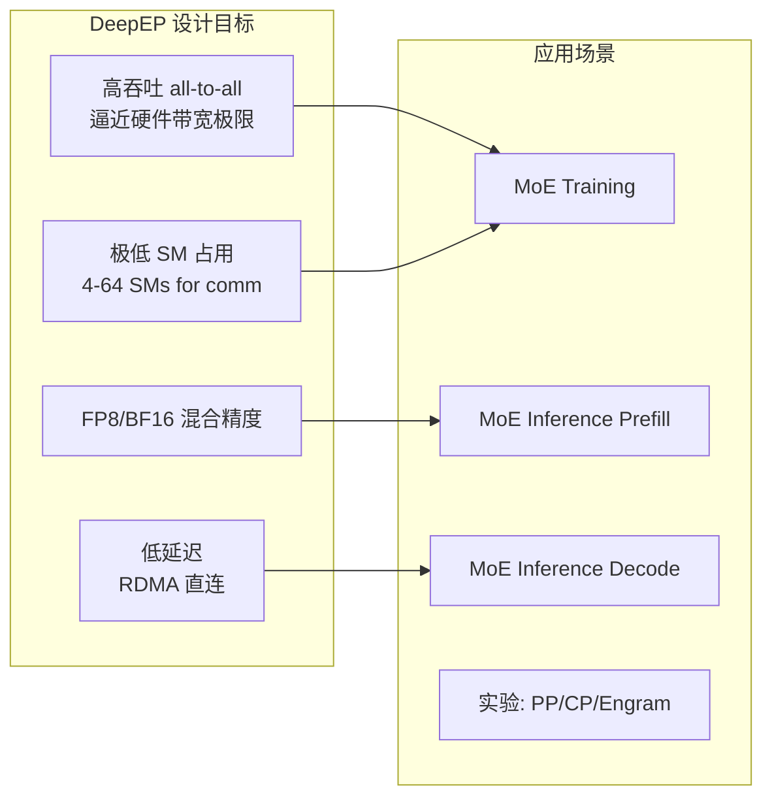
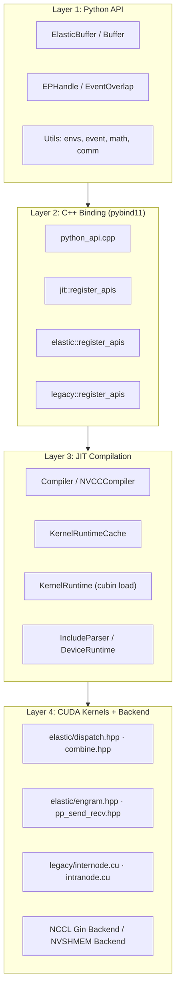
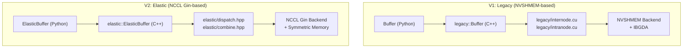
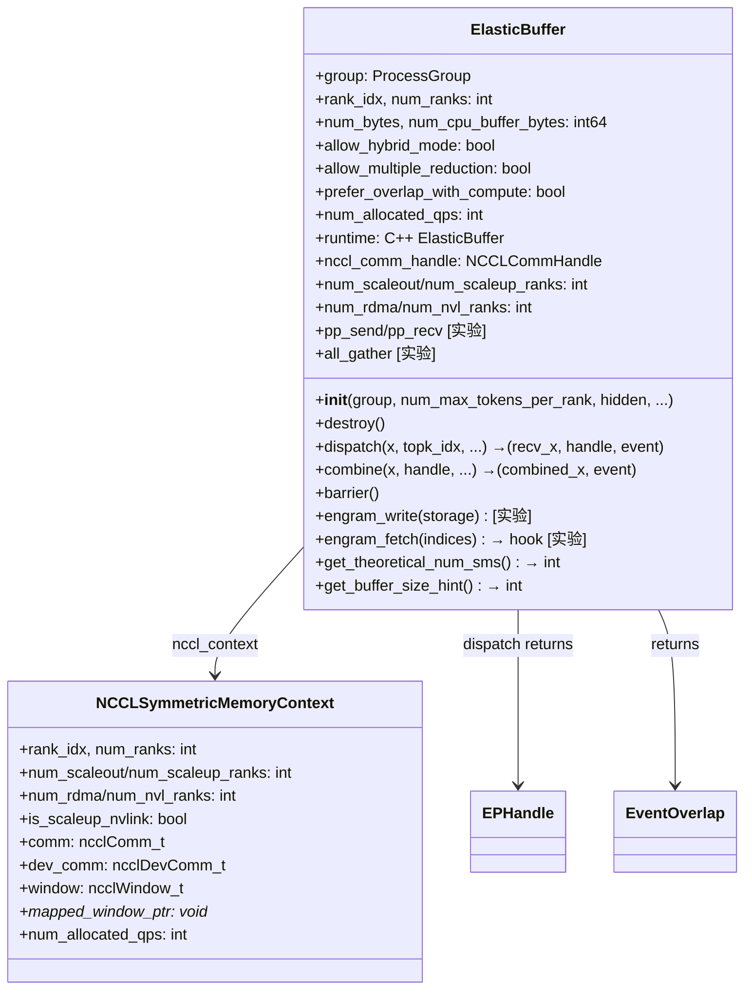
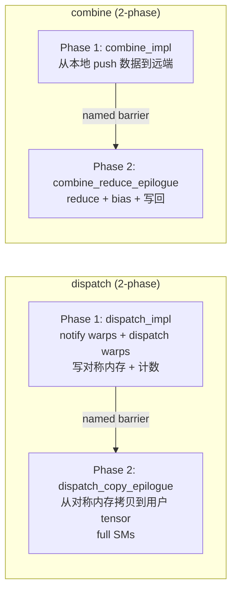
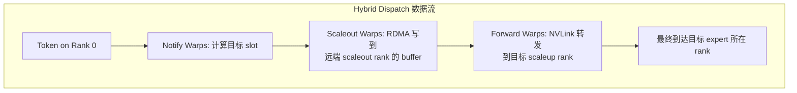
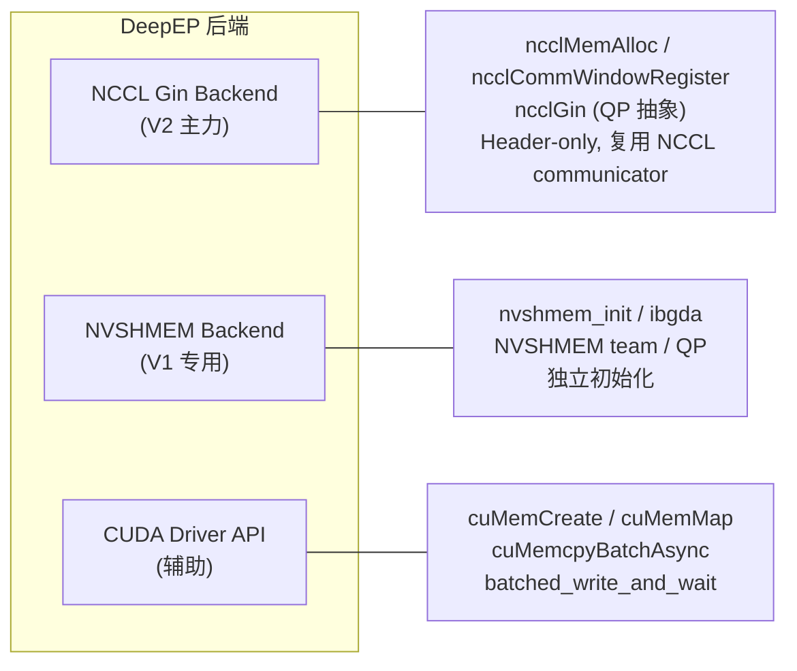
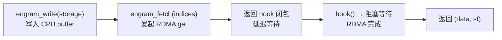
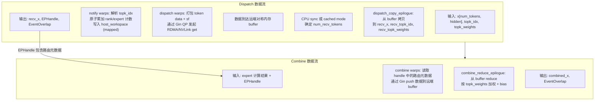

# DeepEP 整体架构分析

> 本文档是对 DeepEP（DeepEveryParallel）通信库的独立架构分析，聚焦其作为 MoE Data Movement Runtime 的系统设计。
> 分析基于 DeepEP v2.1.0 源码，覆盖 Python API → C++ binding → JIT 编译 → CUDA kernel 全链路。

---

## 1. 项目定位：DeepEP 是什么

DeepEP 是一个**面向 MoE（Mixture of Experts）的数据搬运运行时（Data Movement Runtime）**，核心定位为：

- **高性能 Expert Parallelism（EP）all-to-all 通信库**：提供 dispatch（token 路由到对应 expert 所在 rank）与 combine（expert 输出 reduce 回原 rank）两个基本原语
- **低精度支持**：原生 FP8 dispatch + BF16 combine
- **极低 SM 占用**：通信 kernel 仅占用极少 SM（4-64 个），将计算资源留给 GEMM
- **实验性扩展**：PP send/recv、Engram（RDMA 远程内存访问）、CP、AGRS

DeepEP 的设计哲学是**通信 kernel 不应与计算争抢 SM**。这与传统集合通信库（NCCL）的设计目标有本质区别——NCCL 追求通用性与全吞吐，DeepEP 追求"刚好够用"的通信能力 + 最小 SM 开销。



---

## 2. 架构分层总览

DeepEP 采用经典的四层架构，从上到下依次为：



### 2.1 Layer 1：Python API 层

入口文件 `deep_ep/__init__.py` 在 import 时完成三件关键事情：

1. **NCCL 版本校验**（`check_nccl_so`）：读取 `/proc/self/maps` 检查运行时加载的 `libnccl.so` 是否唯一，并与链接时的 NCCL 二进制对比，防止 PyTorch 自带 NCCL 与系统 NCCL 冲突
2. **JIT 运行时初始化**（`init_jit`）：调用 `_C.init_jit(library_root, cuda_home, nccl_root)` 设置编译器路径
3. **导出符号**：`ElasticBuffer`、`Buffer`、`EPHandle`、`EventOverlap`、`Config`、`topk_idx_t`

```python
# __init__.py 核心初始化流程
check_nccl_so()          # 1. 确保 NCCL 版本一致
init_jit()                # 2. 初始化 JIT 编译器路径
from .buffers.legacy import Buffer          # V1
from .buffers.elastic import ElasticBuffer, EPHandle  # V2
from .utils.event import EventOverlap
```

### 2.2 Layer 2：C++ Binding 层

`csrc/python_api.cpp` 是唯一的 pybind11 模块入口，注册四个类别的 API：

| 注册函数 | 命名空间 | 功能 |
|---------|---------|------|
| `is_sm90_compiled` | 全局 | 是否编译 SM90 特性 |
| `register_apis(m)` | `jit` | `init_jit` |
| `register_apis(m)` | `elastic` | ElasticBuffer 全套方法 |
| `register_apis(m)` | `legacy` | Buffer 全套方法 |

### 2.3 Layer 3：JIT 编译层

详见第 6 节。

### 2.4 Layer 4：CUDA Kernel + 后端层

详见第 5、7 节。

---

## 3. V1 vs V2 架构对比（Legacy vs Elastic）

DeepEP 存在两套完整实现，代表两种截然不同的设计哲学：



### 3.1 核心设计差异

| 维度 | V1 (Legacy) | V2 (Elastic) |
|------|------------|--------------|
| **后端** | NVSHMEM + IBGDA | NCCL Gin (Header-only) |
| **内存模型** | 显式 NVLink buffer + RDMA buffer | NCCL Symmetric Memory (统一 VA) |
| **Buffer 大小** | 较小 | 较大（README 明示） |
| **SM 占用** | 20-24 SMs (normal) | 4-64 SMs (分析式计算) |
| **QP 数量** | 手动配置 | 分析式自动计算 (17 / 65 / 129) |
| **Scale 能力** | EP ≤ 160 | EP 可达 2048 |
| **Config 调优** | 查表法 (config_map) | 无需 auto-tuning |
| **0 SM RDMA EP** | 支持 (low_latency mode) | 不再支持 |
| **通信模式** | 显式 internode/intranode 分支 | hybrid/direct 统一 |

### 3.2 V1 Legacy 架构细节

`legacy::Buffer` 的核心设计：

- **双缓冲结构**：NVLink buffer（节点内）+ RDMA buffer（节点间），物理分离
- **NVSHMEM team 管理**：通过 `NVSHMEM_IBGDA_NUM_RC_PER_PE` 配置 QP 数，`NVSHMEM_QP_DEPTH` 控制 WQ 深度
- **IPC handle 交换**：`sync()` 阶段交换 device_id、IPC handle、NVSHMEM unique_id
- **Low-latency mode**：基于 IBGDA 的 RDMA 直连，双 buffer ping-pong（只能同时持有 2 个结果 tensor）
- **Config 查表**：`get_dispatch_config(num_ranks)` 和 `get_combine_config(num_ranks)` 是硬编码映射表

```cpp
// V1 的 Config 查表是硬编码的
config_map = {
    2: Config(Buffer.num_sms, 24, 256, 6, 128),
    4: Config(Buffer.num_sms, 6, 256, 6, 128),
    8: Config(Buffer.num_sms, 6, 256, 6, 128),
    16: Config(Buffer.num_sms, 36, 288, 20, 128),
    // ... 一直到 160
}
```

### 3.3 V2 Elastic 架构细节

`elastic::ElasticBuffer` 的核心设计（详见第 4 节）：

- **统一 Symmetric Memory**：通过 NCCL Gin 的 `ncclWindow_t` 实现跨 rank 对称内存
- **逻辑/物理域分离**：物理域（RDMA ranks × NVLink ranks）→ 逻辑域（scaleout × scaleup）
- **分析式 SM/QP 计算**：基于带宽建模自动推导最优 SM 数
- **Hybrid 模式**：scaleout 走 RDMA，scaleup 走 NVLink，分层 reduce

---

## 4. 核心抽象

### 4.1 ElasticBuffer（V2 核心）

`ElasticBuffer` 是 V2 的统一接口，封装了所有 EP 操作：



#### 内存布局

ElasticBuffer 的内存布局是理解其设计的核心：

```
[Workspace (2MB-aligned)] [GPU Buffer] [CPU Buffer (可选)]
         ↑ mapped_window_ptr
```

- **Workspace**：存放 barrier signals、rank/expert 接收计数、channel metadata、PP 信号、AGRS 信号
- **GPU Buffer**：dispatch/combine 的 send/recv 区域
- **CPU Buffer**：Engram 存储区（可选，位于 GPU buffer 之后）

`SymmetricMemory` 的三种实现：

| 类型 | 类 | 用途 |
|------|---|------|
| 纯 GPU | `GPUSymmetricMemory` | `ncclMemAlloc`，默认模式 |
| GPU + CPU | `ElasticSymmetricMemory` | CUDA Driver API `cuMemCreate`，连续 VA |
| GPU + 多 CPU (Hybrid) | `HybridElasticSymmetricMemory` | 各 rank CPU segment 通过 POSIX FD import |

### 4.2 EPHandle（通信句柄）

`EPHandle` 是 dispatch 返回的**路由元数据**，combine 消费它来完成反向 reduce：

```python
class EPHandle:
    do_expand: bool                    # 是否使用 expand 布局
    num_experts: int
    expert_alignment: int              # expert token 对齐
    num_max_tokens_per_rank: int
    num_sms: int
    topk_idx: Tensor                   # [num_tokens, num_topk]，克隆的 expert 索引
    psum_num_recv_tokens_per_scaleup_rank: Tensor  # scaleup rank 前缀和
    psum_num_recv_tokens_per_expert: Tensor        # expert 前缀和
    num_unaligned_recv_tokens_perpert: Tensor      # expand 模式下未对齐计数
    recv_src_metadata: Tensor          # [num_recv_tokens, topk+2]，源 token 索引 + slot
    dst_buffer_slot_idx: Tensor        # 目标 buffer slot
    token_metadata_at_forward          # hybrid 模式元数据
    channel_linked_list                # hybrid 模式链表
    num_recv_tokens: int
    num_expanded_tokens: int
```

EPHandle 支持 **cached mode**：当 gating decision 不变时，可复用 handle 跳过 layout 重算与 CPU sync，这对 inference decoding 场景至关重要。

### 43. EventOverlap（事件重叠）

`EventOverlap` 封装了 CUDA event，提供通信-计算重叠的 Python 友好接口：

```python
# 典型用法：先做不依赖 recv_x 的计算，再等待通信完成
recv_x, ..., handle, event = buffer.dispatch(...)

with event:                    # __exit__ 时 current_stream_wait()
    do_other_compute()         # 与通信重叠执行

# 退出 with 后，recv_x 安全可用
recv_x = forward_experts(recv_x, ...)
```

内部机制：
- `event.current_stream_wait()`：compute stream 等待 comm stream 上的 event
- `record_stream()`：确保 tensor 在 compute/comm 两个 stream 上的访问安全
- `EP_AVOID_RECORD_STREAM` 环境变量可切换为 manual tensor tracking（CUDA graph 兼容）
- `hook_after_wait`：支持 deterministic dispatch 的 post-wait sort

---

## 5. Kernel 组织

### 5.1 目录结构

```
csrc/kernels/
├── elastic/                    # V2 kernels
│   ├── api.hpp                 # kernel 总入口 (launch 函数)
│   ├── dispatch.hpp            # dispatch + dispatch_copy_epilogue
│   ├── combine.hpp             # combine + combine_reduce_epilogue
│   ├── engram.hpp              # Engram fetch (实验)
│   ├── pp_send_recv.hpp        # PP send/recv (实验)
│   ├── barrier.hpp             # GPU barrier
│   └── utils.hpp               # kernel utilities
├── legacy/                     # V1 kernels
│   ├── api.cuh                 # V1 kernel 入口
│   ├── internode.cu            # 节点间 (RDMA + NVLink)
│   ├── intranode.cu            # 节点内 (NVLink)
│   ├── buffer.cuh              # V1 buffer 管理
│   ├── compiled.cuh            # V1 编译配置
│   ├── ibgda_device.cuh        # IBGDA low-latency
│   ├── launch.cuh              # V1 launch 逻辑
│   ├── layout.cu               # V1 layout 计算
│   └── utils.cuh               # V1 utilities
└── backend/                    # 后端抽象
    ├── api.cuh                 # nvshmem / nccl / cuda_driver API
    ├── symmetric.hpp           # SymmetricMemory 分配器
    ├── cuda_driver.cu          # CUDA Driver API 封装
    ├── nccl.cu                 # NCCL 初始化/销毁
    └── nvshmem.cu              # NVSHMEM 初始化/销毁
```

### 5.2 Elastic Kernel 结构

每个 Elastic kernel 由两个阶段组成（以 dispatch 为例）：



#### Dispatch 的 warp 角色分配

| Warp 角色 | 数量 | 职责 |
|----------|------|------|
| Notify warps | 4 (kNumNotifyWarps) | 原子累加 rank/expert 接收计数，通知对端 |
| Dispatch warps | 自动计算 | 通过 Gin QP 执行 RDMA/NVLink 数据传输 |
| Scaleout warps | num_channels_per_sm | hybrid 模式：跨节点 forwarding |
| Forward warps | num_channels_per_sm | hybrid 模式：节点内转发 |

#### Channel 与 QP 的映射

```cpp
// comm::get_qp_mode: 决定每个 SM 的每个 channel 使用哪个 QP
if (kNumSMs <= kNumAvailableQPs) {
    // SM 少：每个 SM 独占 QP，channel 间 round-robin
    // e.g., 3 SMs, 10 QPs: SM0→{0,3,6,9}, SM1→{1,4,7}, SM2→{2,5,8}
} else {
    // SM 多：所有 SM 共享所有 QP
    qp_idx = kQPStartIdx + (global_channel_idx % kNumAvailableQPs)
}
```

### 5.3 Hybrid vs Direct 模式

Elastic 内核根据 `num_scaleout_ranks` 自动选择：

| 条件 | 模式 | 内核 |
|------|------|------|
| `num_scaleout_ranks == 1` | Direct | `dispatch_impl` / `combine_impl` |
| `num_scaleout_ranks > 1` | Hybrid | `hybrid_dispatch_impl` / `hybrid_combine_impl` |

Hybrid 模式的分层通信：
1. **Scaleup 层**（NVLink）：节点内各 GPU 先做局部 reduce
2. **Scaleout 层**（RDMA）：跨节点 forwarding，每个 channel 负责一个 scaleout peer 的数据转发



---

## 6. JIT 编译管线

DeepEP 的 JIT 系统是其"安装时无需 CUDA 编译"的关键。整个管线设计精巧：

```mermaid
flowchart TB
    subgraph Init["初始化阶段"]
        I1["__init__.py: init_jit()"]
        I2["jit::init(library_root, cuda_home, nccl_root)"]
        I3["Compiler::prepare_init()"]
        I4["IncludeParser::prepare_init()"]
        I5["DeviceRuntime::prepare_init()"]
        I1 --> I2 --> I3 & I4 & I5
    end

    subgraph Build["内核构建阶段"]
        B1["generate_impl(args) → 生成 kernel.cu 源码"]
        B2["计算 kernel_signature = name$$sig$$flags$$code"]
        B3["计算 cache 路径: ~/.deep_ep/cache/kernel.{name}.{hash}/"]
        B4{"KernelRuntimeCache 命中?"}
        B5["是: 返回缓存的 KernelRuntime"]
        B6["否: NVCCCompiler::compile() → kernel.cubin"]
        B7["cuobjdump 反汇编 → kernel.sass (可选)"]
        B8["原子 rename tmp_dir → cache_dir"]
        B9["KernelRuntime 加载 cubin"]
        B1 --> B2 --> B3 --> B4
        B4 -->|Yes| B5
        B4 -->|No| B6 --> B7 --> B8 --> B9
    end

    subgraph Launch["内核启动阶段"]
        L1["construct_launch_config()"]
        L2["launch_kernel(kernel, config, args...)"]
        L1 --> L2
    end

    Init --> Build --> Launch
```

### 6.1 源码生成（Code Generation）

每个 kernel 的源码是**运行时生成**的，通过模板参数实现编译期优化：

```cpp
// dispatch.hpp 生成的 kernel.cu 示例
#include <deep_ep/impls/dispatch.cuh>
using namespace deep_ep::elastic;
static void __instantiate_kernel() {
    auto ptr = reinterpret_cast<void*>(&dispatch_impl<
        true,    // is_scaleup_nvlink
        false,   // do_cpu_sync
        false,   // reuse_slot_indices
        12,      // num_sms
        4,       // num_notify_warps
        28,      // num_dispatch_warps
        16,      // num_scaleup_ranks
        14336,   // num_hidden_bytes (7168*2)
        0,       // num_sf_packs
        2048,    // num_max_tokens_per_rank
        256,     // num_experts
        8,       // num_topk
        128,     // expert_alignment
        65,      // num_qps
        cycles   // num_timeout_cycles
    >);
}
```

**关键设计**：所有可变参数都变成模板参数，NVCC 可做激进优化（循环展开、分支消除、常量传播）。

### 6.2 缓存机制

缓存签名由四部分构成：

```
kernel_signature = "{name}$${signature}$${flags}$${code}"
```

- `name`：kernel 名称（dispatch, combine, ...）
- `signature`：编译器版本（NVCC12.9）
- `flags`：编译标志
- `code`：生成的源码

缓存目录结构：

```
~/.deep_ep/
├── cache/
│   └── kernel.dispatch.{hex_digest}/
│       ├── kernel.cu        # 生成的源码
│       ├── kernel.cubin     # 编译产物
│       └── kernel.sass      # 可选的反汇编
└── tmp/                     # 临时目录（原子 rename 用）
```

**分布式文件系统安全**：
- 先编译到 `tmp/{uuid}/`，再原子 `rename` 到 cache 目录
- `fsync_dir()` 确保 data + directory entry 可见
- 多 rank 并发时，若 rename 失败则复用已有目录

### 6.3 Include Hash 机制

`IncludeParser` 解析生成代码中的所有 `#include <deep_ep/*>`，递归计算头文件内容的哈希值。当任何头文件改变时，哈希变化 → cache miss → 重新编译。这保证了头文件修改后的正确重建。

---

## 7. 后端抽象层

### 7.1 三种后端



### 7.2 NCCL Gin 后端（核心创新）

NCCL Gin 是 NCCL 内部的一个**轻量级 GDAKI 接口**，DeepEP V2 的全部通信都构建其上：

| 特性 | 说明 |
|------|------|
| Header-only | 只需 `nccl.h` + `nccl_device.h`，无额外链接 |
| Communicator 复用 | 直接复用 PyTorch 的 NCCL communicator |
| QP 抽象 | `ncclGin` handle + `ncclGinRequest_t` |
| Resource Sharing | CTA 级 / GPU 级 QP 共享模式 |
| Symmetric Memory | `ncclWindow_t` 提供跨 rank 对称内存视图 |

**Gin 的使用模式**：
```cpp
// 1. 获取 Gin handle（per-warp）
const auto [qp_idx, sharing_mode] = comm::get_qp_mode<...>(sm_idx, channel_idx, is_notify);
const auto gin = handle::NCCLGin(nccl_dev_comm, nccl_window, qp_idx, sharing_mode);

// 2. 发起 RDMA 请求
ncclGinRequest_t req;
gin.get(dst_ptr, src_ptr, size, dst_rank, req);  // RDMA get

// 3. 等待完成
gin.wait(req);
```

### 7.3 Symmetric Memory 分配

`symmetric.hpp` 定义了三种 `SymmetricMemory` 实现：

| 场景 | 类 | 分配方式 |
|------|---|---------|
| 纯 GPU | `GPUSymmetricMemory` | `ncclMemAlloc` |
| GPU + CPU (单节点) | `ElasticSymmetricMemory` | `cuMemCreate` + `cuMemMap` |
| GPU + CPU (Hybrid) | `HybridElasticSymmetricMemory` | POSIX FD import + `cuMemImportFromShareableHandle` |

Hybrid 模式的 CPU segment 跨 rank 共享通过 **POSIX file descriptor** 实现：
1. 每个 rank 创建 NUMA-local CPU allocation → export 为 FD
2. `dist.all_gather_object` 交换 (pid, fd)
3. 远端 rank 通过 `pidfd_open` + `pidfd_getfd` 导入 FD
4. `cuMemImportFromShareableHandle` 导入 CUDA 并 map 到本地 VA

### 7.4 CUDA Driver API

`cuda_driver` 命名空间提供两个关键原语：
- `batched_write`：批量 CUDA 信号写入
- `batched_wait`：批量 CUDA 信号等待（用于 AGRS session 同步）

这些使用 CUDA Driver 的 virtual address management 能力，直接操作 symmetric memory 上的信号量。

---

## 8. 性能特征

### 8.1 README 性能数据

基于 V3 配置（8K tokens/batch, 7168 hidden, top-8 experts, FP8 dispatch, BF16 combine）：

| Arch | NIC | Topo | Dispatch BW | Combine BW | #SMs |
|------|-----|------|------------|------------|------|
| SM90 | CX7 | EP 8×2 | 90 GB/s (RDMA) | 81 GB/s (RDMA) | 12 |
| SM90 | CX7 | EP 8×4 | 61 GB/s (RDMA) | 61 GB/s (RDMA) | 6 |
| SM100 | CX7 | EP 8×2 | 90 GB/s (RDMA) | 91 GB/s (RDMA) | 12 |
| SM100 | N/A | EP 8 | 726 GB/s (NVLink) | 740 GB/s (NVLink) | 64 (Max) |
| SM100 | N/A | EP 8 | 643 GB/s (NVLink) | 675 GB/s (NVLink) | 24 (Min) |

### 8.2 V2 vs V1 对比

- **峰值性能提升**：最高 1.3x
- **SM 节省**：最高 4x（V3 训练从 24 SM 降到 4-6 SM）

### 8.3 性能分析

这些数字揭示了 DeepEP 的设计权衡：

1. **RDMA 场景 90 GB/s**：接近 CX7 100Gb/s 的理论带宽（~100 GB/s），说明 kernel 效率极高
2. **NVLink 726 GB/s**：接近 H100 NVLink 理论带宽（~900 GB/s），效率 ~80%
3. **SM 数与带宽的 trade-off**：
   - 64 SM → 726 GB/s（峰值带宽）
   - 24 SM → 643 GB/s（~89% 峰值，节省 62.5% SM）
4. **Hybrid 模式 61-90 GB/s**：受限于 RDMA 带宽，但 SM 占用仅 6-12

---

## 9. SM 占用哲学

DeepEP 的核心设计哲学是**"通信不应与计算争抢 SM"**。这体现在多个层面：

### 9.1 分析式 SM 计算

`get_theoretical_num_sms()` 基于带宽建模：

```python
# 核心公式（简化）
# 假设 balanced gate，计算 expected top-k 数量
num_expected_topk = num_groups * (1 - C(num_experts - num_experts//num_groups, num_topk) / C(num_experts, num_topk))

# 计算各层流量
sm_read += 1 / num_expected_topk
sm_write += ...
rdma_traffic += ...
nvlink_traffic += ...

# SM 数 = ceil(max(sm_read/sm_read_bw, sm_write/sm_write_bw, rdma_traffic/rdma_bw, nvlink_traffic/nvlink_bw))
```

### 9.2 SM 分配的运行时决策

```cpp
// dispatch.hpp: 根据共享内存消耗计算每个 SM 的 channel 数
num_channels_per_sm = min(
    (smem_bytes - notify_smem_bytes) / dispatch_token_layout_size,
    32 - kNumNotifyWarps
);
num_channels_per_sm = min(
    smem_bytes / combine_token_layout_size,
    num_channels_per_sm
);
num_channels_per_sm = min(num_channels_per_sm / 2, kNumMaxChannelsPerSM);
```

### 9.3 `prefer_overlap_with_compute` 标志

当该标志开启时，kernel 倾向于使用更少的 SM 和更多的 channel（最多 4 channels/SM），通过时间换空间的方式让出 SM 给计算。

### 9.4 与 NCCL 的对比

| 维度 | NCCL | DeepEP |
|------|------|--------|
| SM 策略 | 尽可能多占用 SM | 分析式最小化 SM |
| 带宽目标 | 饱和硬件带宽 | 饱和硬件带宽（同等） |
| 计算影响 | 可能影响 GEMM | 几乎不影响 GEMM |
| 适用场景 | 通用集合通信 | MoE all-to-all 专用 |

---

## 10. 实验性特性

### 10.1 Engram（0 SM RDMA 远程内存访问）

Engram 提供**远程 CPU 内存的 RDMA 读取**能力，用于 KV cache 等场景：



- **0 SM 哲学**：RDMA get 由 NIC 直接完成，不占用 SM
- **CPU buffer**：通过 `HybridElasticSymmetricMemory` 分配 NUMA-local CPU 内存
- **FP8 支持**：支持 FP8 storage + globally-replicated scaling factors

### 10.2 PP Send/Recv（0 SM Pipeline Parallelism）

基于 NVLink 的 pipeline parallelism 原语：

```python
buffer.pp_set_config(num_max_tensor_bytes, num_max_inflight_tensors)
buffer.pp_send(t, dst_rank_idx, num_sms=0)  # 0 = 全部 SM
buffer.pp_recv(t, src_rank_idx, num_sms=0)
```

- 仅支持 ring 上的 prev/next rank
- 使用 `num_max_inflight_tensors * 2 * 2` 的 buffer 空间（send/recv × prev/next）

### 10.3 AGRS（All-Gather Reduce-Scatter）

基于 NVLink symmetric memory 的 all-gather 实现：

```python
buffer.agrs_set_config(num_max_session_bytes, num_max_all_gathers)
buffer.create_agrs_session()
t = buffer.agrs_get_inplace_tensor(shape, dtype)  # zero-copy
gathered, handle = buffer.all_gather(t)
handle()  # wait for data arrival
buffer.destroy_agrs_session()
```

实现使用 `cudaMemcpyBatchAsync`（CUDA 13+）+ signal-based session 同步。

### 10.4 CP（Context Parallelism）

README 提到 "0 SM CP (with Copy Engine)"，使用 copy engine 而非 SM 完成数据传输。

---

## 11. 环境变量体系

DeepEP 提供了丰富的环境变量用于调试与调优：

| 类别 | 关键变量 | 作用 |
|------|---------|------|
| 通用 | `EP_BUFFER_DEBUG` | buffer 初始化调试 |
| 通用 | `EP_SUPPRESS_NCCL_CHECK` | 跳过 NCCL 版本校验 |
| 通用 | `EP_AVOID_RECORD_STREAM` | 避免 CUDA graph 不兼容的 record_stream |
| 网络 | `EP_NIC_NAME` | NIC 名称（默认 mlx5_0） |
| 网络 | `EP_OVERRIDE_RDMA_SL` | 覆盖 RDMA 服务级别 |
| 网络 | `EP_DISABLE_GIN` | 禁用 NCCL Gin 后端 |
| JIT | `EP_JIT_CACHE_DIR` | 编译缓存目录（默认 ~/.deep_ep） |
| JIT | `EP_JIT_CPP_STANDARD` | C++ 标准（默认 20） |
| JIT | `EP_JIT_NVCC_COMPILER` | NVCC 路径 |
| JIT | `EP_JIT_DUMP_PTX/SASS` | 导出编译产物 |
| JIT | `EP_JIT_PTXAS_CHECK` | 检查 local memory 使用 |
| 构建 | `DISABLE_SM90_FEATURES` | 禁用 SM90 特性 |
| 构建 | `EP_NCCL_ROOT_DIR` | NCCL 安装路径 |

**持久化环境变量**（构建时烘焙到包中）：`EP_JIT_CACHE_DIR`、`EP_JIT_PRINT_COMPILER_COMMAND`、`EP_NUM_TOPK_IDX_BITS`、`EP_NCCL_ROOT_DIR`。

---

## 12. 数据流全景

以 V2 的 dispatch + combine 为例，完整数据流如下：



---

## 13. 关键设计洞察

### 13.1 为什么用 NCCL Gin 而非原生 RDMA

1. **Communicator 复用**：直接复用 PyTorch 已创建的 NCCL communicator，无需独立初始化
2. **Header-only**：无需链接额外库，部署简单
3. **QP 抽象**：Gin 提供比 raw GDAKI 更高层的接口，自动处理 QP 共享与资源管理
4. **与 NCCL 协同**：复用 NCCL 的 transport 层、congestion control、adaptive routing

### 13.2 为什么 V2 buffer 更大

V2 的 buffer 需要同时容纳：
- Scaleup recv buffer（节点内）
- Scaleout send buffer（跨节点发送）
- Scaleout recv buffer（跨节点接收，含 channel 元数据 padding）

Hybrid 模式下的分层通信需要多份中间 buffer，但换来了**可扩展性**（EP2048）和**SM 节省**。

### 13.3 Cached Mode 的意义

Inference decoding 场景中，gating decision 可能在多轮迭代间不变。Cached mode 允许：
- 跳过 layout 重算（`topk_idx` 解析、prefix sum）
- 跳过 CPU sync（直接复用 handle 中的计数）
- 减少 CPU-GPU 交互延迟

这对低延迟 decoding 至关重要。

### 13.4 Deterministic Mode

DeepEP 支持 deterministic dispatch：
- 对 `recv_src_metadata[:, 0]`（源 token 全局索引）排序
- 根据排序结果重排 `recv_x`, `recv_sf`, `recv_topk_weights`, `recv_topk_idx`
- Expand 模式：按 expert 分组排序，更新 slot 指针

---

## 14. 总结

DeepEP 是一个设计精良的 MoE 通信运行时，其核心优势在于：

1. **极致的 SM 效率**：4-64 SM 即可饱和硬件带宽
2. **统一的架构**：V2 的 ElasticBuffer 统一了 high-throughput / low-latency / hybrid / direct 多种模式
3. **运行时 JIT**：安装时无需编译，自动缓存编译产物
4. **分析式调参**：SM 数、QP 数均自动计算，无需 auto-tuning
5. **NCCL Gin 创新**：利用 NCCL 内部接口实现轻量级高性能通信

其代价是 buffer 占用增大、0 SM RDMA low-latency 模式不再支持，但这些 trade-off 在大规模 MoE 训练场景下是合理的。

---

## 附录：关键文件索引

| 文件 | 职责 |
|------|------|
| `deep_ep/__init__.py` | 包入口，NCCL 检查，JIT 初始化 |
| `csrc/python_api.cpp` | pybind11 模块注册 |
| `deep_ep/buffers/elastic.py` | V2 ElasticBuffer Python 接口 |
| `deep_ep/buffers/legacy.py` | V1 Buffer Python 接口 |
| `csrc/elastic/buffer.hpp` | V2 C++ 核心实现 |
| `csrc/legacy/buffer.hpp` | V1 C++ 核心实现 |
| `csrc/jit/compiler.hpp` | JIT 编译器（NVCC） |
| `csrc/jit/cache.hpp` | KernelRuntimeCache |
| `csrc/jit/kernel_runtime.hpp` | CUBIN 加载与符号解析 |
| `csrc/jit/launch_runtime.hpp` | Launch 框架（CRTP） |
| `csrc/jit/include_parser.hpp` | 头文件依赖哈希 |
| `csrc/jit/device_runtime.hpp` | GPU 属性查询 |
| `csrc/kernels/elastic/dispatch.hpp` | V2 dispatch 内核 |
| `csrc/kernels/elastic/combine.hpp` | V2 combine 内核 |
| `csrc/kernels/elastic/engram.hpp` | Engram fetch 内核 |
| `csrc/kernels/elastic/pp_send_recv.hpp` | PP send/recv 内核 |
| `csrc/kernels/backend/symmetric.hpp` | SymmetricMemory 分配器 |
| `csrc/kernels/backend/api.cuh` | 后端 API 抽象 |
| `deep_ep/include/deep_ep/common/layout.cuh` | Workspace/Buffer 布局 |
| `deep_ep/include/deep_ep/common/comm.cuh` | Gin 通信原语 |
| `deep_ep/include/deep_ep/impls/dispatch.cuh` | dispatch_impl 定义 |
| `deep_ep/utils/event.py` | EventOverlap 封装 |
| `deep_ep/utils/envs.py` | 环境检测与分布式初始化 |
| `tests/elastic/test_ep.py` | EP 正确性与性能测试 |
