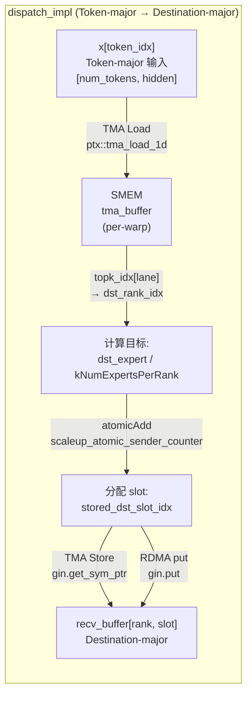
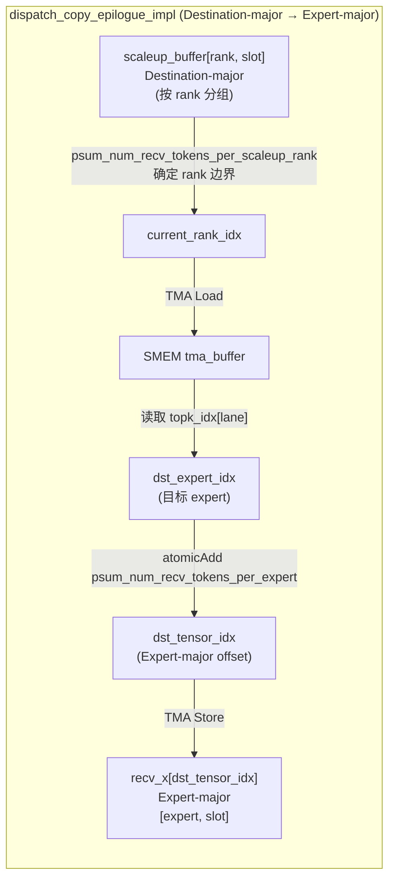
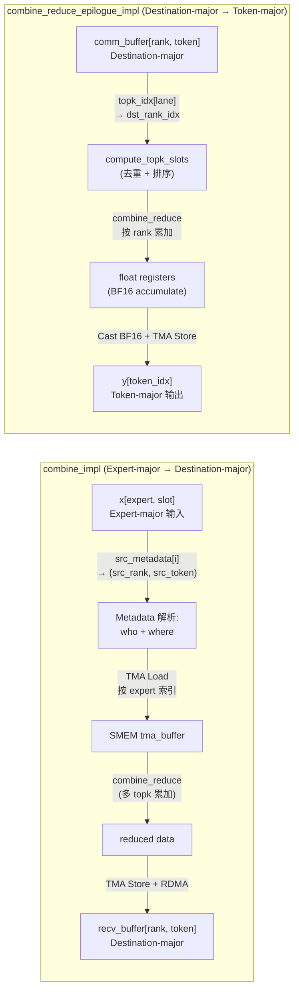
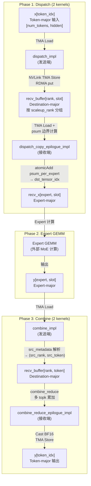

# DeepEP Dispatch/Combine 实现 vs 博客第一性原理描述：深度对比分析

## 概述

> *"Every MoE Layer must perform a dynamic data layout transformation."*
> —— 《Understanding GPU Microarchitecture from a Workload Perspective (3): DeepEP's First Principles》§1

本文针对博客中提出的 **Dispatch/Combine 动态数据布局变换** 第一性原理描述，在 **DeepEP 源码** 中进行逐行对照分析。核心发现：

1. **博客描述高度准确**：Token-major → Destination-major → Expert-major 的三步变换在 DeepEP 中确实存在
2. **博客简化了实现细节**：DeepEP 实际用 **4 个 kernel** 完成这一变换，而非博客暗示的 2 步
3. **博客未提及的关键机制**：Expand 模式、Metadata 系统、Hybrid 模式、Zero Padding
4. **变换的"方向性"被低估**：博客强调了布局变换，但低估了 Metadata 在 Combine 中的核心作用

---

## 1. 博客概念回顾：Dispatch / Combine 三步变换

博客 §1.1-1.2 给出的抽象模型原文：

> **Communication Phase Wants Destination-major**
> GPU communication asks: which GPU should this data go to? Communication needs data organized by destination for contiguous sends.

> **Expert GEMM Wants Expert-major**
> Expert GEMM wants data organized by Expert — a continuous [M, K] matrix for Tensor Core.

> **Therefore, Dispatch performs: Token-major → Destination-major → Expert-major**
> This is not simple communication — it is a dynamic data layout transformation.

> **Combine: Expert-major Back to Token-major**
> After Expert computation, output remains Expert-major. The next layer needs Token-major. Combine reverses: Expert-major → Destination-major → Token-major.
> While recovering Router semantics: Output(T0) = 0.73 × Expert2(T0) + 0.27 × Expert7(T0)
> Combine is data layout recovery + semantic recovery.

博客总结的三个角色 layout 需求：

| 角色 | 期望 Layout | 原因 |
|------|------------|------|
| Communication | Destination-major | 按目标 GPU 组织，便于连续发送 |
| Expert GEMM | Expert-major | 连续 [M, K] 矩阵供 Tensor Core |
| Next Layer | Token-major | 按 Token 组织，供下一层 Transformer |

---

## 2. DeepEP Dispatch 实现：Token-major → Destination-major

### 2.1 核心 Kernel：`dispatch_impl`

文件：`deep_ep/include/deep_ep/impls/dispatch.cuh`

DeepEP 的 Dispatch 由 **两个 kernel** 协作完成博客描述的"一步"变换：

| Kernel | 文件 | 职责 | 对应博客步骤 |
|--------|------|------|-------------|
| `dispatch_impl` | `dispatch.cuh` | Token 读取 + 元数据通信 + NVLink/RDMA 发送 | Token-major → Destination-major |
| `dispatch_copy_epilogue_impl` | `dispatch_copy_epilogue.cuh` | 接收端：Destination-major → Expert-major 重排 | Destination-major → Expert-major |

### 2.2 Dispatch Warps 的核心数据流

`dispatch.cuh` 中 Dispatch Warps（`warp_idx >= kNumNotifyWarps`）的核心逻辑：

```cpp
// dispatch.cuh:280-394
// Iterate all tokens
const auto token_start = dispatch_warp_idx * kNumSMs + sm_idx;
const auto token_stride = kNumDispatchWarps * kNumSMs;
for (int token_idx = token_start; token_idx < num_tokens; token_idx += token_stride) {
    // ========== Step 1: Token-major 读取 ==========
    // Issue data TMA: 从 Token-major 输入 x[token_idx] 加载到 SMEM
    ptx::tma_load_1d(tma_buffer.get_hidden_ptr(),
                     math::advance_ptr(x, token_i64_idx * kNumHiddenBytes),
                     mbarrier_ptr, kNumHiddenBytes);

    // Issue SF TMA or cp.async: 加载 scaling factors
    ptx::cp_async_ca(gmem_src_ptr + (k * 32 + lane_idx) * sf_hidden_stride,
                     smem_dst_ptr + k * 32 + lane_idx);

    // ========== Step 2: 计算 Destination ==========
    // Load top-k indices: 推导目标 rank
    const auto dst_expert_idx = static_cast<int>(__ldg(topk_idx + token_idx * kNumTopk + lane_idx));
    stored_dst_rank_idx = dst_expert_idx >= 0 ? dst_expert_idx / kNumExpertsPerRank : -1;

    // ========== Step 3: 分配 Destination-major slot ==========
    // Deduplicate ranks and assign slots: 去重 + atomic 分配 slot
    if (ptx::deduplicate(stored_dst_rank_idx, lane_idx) and stored_dst_rank_idx >= 0)
        stored_dst_slot_idx = atomicAdd(workspace_layout.get_scaleup_atomic_sender_counter()
                                        + stored_dst_rank_idx, 1);
    // 保存 slot 索引供后续使用
    dst_buffer_slot_idx[token_idx * kNumTopk + lane_idx] =
        rank_idx * kNumMaxTokensPerRank + stored_dst_slot_idx;

    // ========== Step 4: 写入 Destination-major 缓冲区 ==========
    // TMA store to send buffer (RDMA path)
    auto send_buffer_ptr = send_buffer.get_token_buffer(token_idx).get_base_ptr();
    ptx::tma_store_1d(send_buffer_ptr, tma_buffer.get_base_ptr(), ...);

    // Issue TMA NVLink stores: 写入远端 NVLink buffer
    const auto dst_ptr = stored_dst_slot_idx >= 0 ?
        gin.get_sym_ptr<team_t>(recv_buffer.get_token_buffer(stored_dst_slot_idx).get_base_ptr(),
                                stored_dst_rank_idx) : nullptr;
    ptx::tma_store_1d(dst_ptr, tma_buffer.get_base_ptr(), ...);

    // Issue RDMA put: 跨节点发送
    gin.put<team_t>(recv_buffer.get_token_buffer(stored_dst_slot_idx).get_base_ptr(),
                    send_buffer_ptr, tma_buffer.get_num_bytes<false>(), stored_dst_rank_idx);
}
```

### 2.3 Buffer 布局定义

`layout.cuh` 中的关键布局定义揭示了 Destination-major 的物理结构：

```cpp
// layout.cuh:252-311
template <bool kWithMBarrier>
struct BufferLayout {
    TokenLayout token_layout;
    int num_ranks;               // ← 第一维：rank
    int num_max_tokens_per_rank; // ← 第二维：slot per rank

    // 按 rank 获取子缓冲区
    BufferLayout get_rank_buffer(const int& rank_idx) const {
        return BufferLayout(token_layout, 1, num_max_tokens_per_rank,
                            base + get_num_bytes_per_rank() * rank_idx);
    }

    // 按 token 索引
    TokenLayout get_token_buffer(const int& token_idx) const {
        return TokenLayout(...,
                           base + token_layout.get_num_bytes<kWithMBarrier>() * token_idx);
    }
};
```

Dispatch 中 recv_buffer 的初始化：

```cpp
// dispatch.cuh:266-268
auto recv_buffer = layout::BufferLayout<false>(token_layout, kNumRanks,
                                               kNumMaxTokensPerRank, buffer);
recv_buffer = recv_buffer.get_rank_buffer(rank_idx);  // 本地 rank 的接收缓冲区
```

**结论**：`recv_buffer[rank_idx][slot_idx]` 是 **Destination-major** 布局——按 `(rank_idx, slot_idx)` 二维索引，每个 rank 的 token 连续存放。

### 2.4 Dispatch 数据流图



---

## 3. Dispatch Copy Epilogue：Destination-major → Expert-major

### 3.1 为什么需要单独的 Kernel？

博客将 Dispatch 描述为"一步"变换，但 DeepEP 实际用 **两个 kernel** 完成：

1. **`dispatch_impl`**：发送端 kernel，负责 Token 读取 + NVLink/RDMA 发送
2. **`dispatch_copy_epilogue_impl`**：接收端 kernel，负责布局重排

这两个 kernel 通过 **PDL（Programmatic Launch Dependency）** 链接：

```cpp
// dispatch.cuh:402-403
// Trigger the copy epilogue kernel
cudaTriggerProgrammaticLaunchCompletion();
```

```cpp
// dispatch_copy_epilogue.cuh:60
// Will block until the main dispatch kernel has finished and all data are visible
cudaGridDependencySynchronize();
```

### 3.2 Copy Epilogue 的核心变换逻辑

```cpp
// dispatch_copy_epilogue.cuh:70-143
for (int i = global_warp_idx; i < num_recv_tokens; i += kNumWarps * kNumSMs) {
    // ========== Step 1: Destination-major → rank 边界计算 ==========
    // 确定当前 token 属于哪个 rank
    while (i >= current_rank_end) {
        current_rank_idx += 1;
        current_rank_start = current_rank_end;
        current_rank_end = ptx::exchange(stored_psum_num_recv_tokens, stored_lane_idx);
    }
    // 定位到 Destination-major 缓冲区中的 token
    const auto buffer_token = scaleup_buffer.get_rank_buffer(current_rank_idx)
                                              .get_token_buffer(i - current_rank_start);

    // ========== Step 2: TMA Load Destination-major 数据 ==========
    ptx::tma_load_1d(tma_buffer.get_base_ptr(), buffer_token.get_base_ptr(),
                     mbarrier_ptr, tma_buffer.get_num_bytes<false>());

    // ========== Step 3: 读取目标 expert index ==========
    int dst_expert_idx = buffer_token.get_topk_idx_ptr()[lane_idx];
    const auto in_range = expert_start_idx <= dst_expert_idx and dst_expert_idx < expert_end_idx;
    dst_expert_idx = in_range ? dst_expert_idx - expert_start_idx : -1;

    // ========== Step 4: 计算 Expert-major 目标地址 ==========
    if (kDoExpand) {
        // Expand 模式：每个 expert 一个 slot，atomic 分配
        dst_tensor_idx = atomicAdd(psum_num_recv_tokens_per_expert + dst_expert_idx, 1);
    } else {
        // Non-expand 模式：按位置顺序写入
        dst_tensor_idx = i;
    }

    // ========== Step 5: TMA Store 到 Expert-major 输出 ==========
    ptx::tma_store_1d(math::advance_ptr(recv_x, dst_tensor_idx * kNumHiddenBytes),
                      tma_buffer.get_hidden_ptr(), kNumHiddenBytes);
}
```

### 3.3 Copy Epilogue 数据流图



### 3.4 Expand vs Non-Expand 模式

博客未提及的一个重要区别：

| 模式 | 写入策略 | 输出布局 |
|------|---------|---------|
| **Non-expand** | `dst_tensor_idx = i`（按接收顺序） | 保持 Destination-major 顺序，仅做元数据重排 |
| **Expand** | `atomicAdd(psum + expert, 1)`（按 expert 分组） | 真正的 Expert-major，每个 expert 的 token 连续 |

Expand 模式下还包含 **Zero Padding** 逻辑（`kDoZeroPadding`），用于对齐 expert 边界：

```cpp
// dispatch_copy_epilogue.cuh:232-322
// Zero padding: clear the alignment gaps between experts in the expanded output
if constexpr (kDoZeroPadding and kDoExpand) {
    // 计算每个 expert 的 padding 量
    wave_num_pads_per_lane = kExpertAlignment - (wave_num_experts_per_lane % kExpertAlignment);
    // TMA store zero 到 padding 位置
    ptx::tma_store_1d(math::advance_ptr(recv_x, dst_tensor_idx * kNumHiddenBytes),
                      tma_buffer.get_hidden_ptr(), kNumHiddenBytes);
}
```

---

## 4. DeepEP Combine 实现：Expert-major → Destination-major → Token-major

### 4.1 Combine 也由两个 Kernel 完成

| Kernel | 文件 | 职责 | 对应博客步骤 |
|--------|------|------|-------------|
| `combine_impl` | `combine.cuh` | Expert-major 读取 + NVLink/RDMA 发送 + topk_weights 写入 | Expert-major → Destination-major |
| `combine_reduce_epilogue_impl` | `combine_reduce_epilogue.cuh` | Destination-major 接收 + topk 累加 + Token-major 输出 | Destination-major → Token-major |

### 4.2 Combine 主 Kernel 核心逻辑

```cpp
// combine.cuh:86-213
int num_tokens_per_warp = math::ceil_div(num_reduced_tokens, kNumSMs * kNumWarps);
const int token_start_idx = num_tokens_per_warp * global_warp_idx;
const int token_end_idx = min(token_start_idx + num_tokens_per_warp, num_reduced_tokens);

for (int i = token_start_idx; i < token_end_idx; ++ i) {
    // ========== Step 1: 读取 Dispatch 时保存的 Metadata ==========
    constexpr int kMetadataStride = 2 + kNumTopk;
    const int src_token_idx = __ldg(src_metadata + i * kMetadataStride) % kNumMaxTokensPerRank;
    const int src_rank_topk_idx = __ldg(src_metadata + i * kMetadataStride + 1);
    const int src_rank_idx = src_rank_topk_idx / kNumTopk;
    const int src_topk_idx = src_rank_topk_idx % kNumTopk;

    // ========== Step 2: 定位 Expert-major 源数据 ==========
    const bool nvlink_bypass = gin.is_nvlink_accessible<team_t>(src_rank_idx);
    layout::TokenLayout master_token_buffer = [=]() {
        if (nvlink_bypass) {
            // NVLink 直通：直接访问远端 buffer
            auto token_buffer = recv_buffer.get_rank_buffer(kUseRankLayout ? rank_idx : src_topk_idx)
                                            .get_token_buffer(src_token_idx);
            token_buffer.set_base_ptr(gin.get_sym_ptr<team_t>(token_buffer.get_base_ptr(), src_rank_idx));
            return token_buffer;
        }
        // RDMA 路径：使用本地 send_buffer
        return send_buffer.get_rank_buffer(src_rank_idx).get_token_buffer(src_token_idx);
    }();

    // ========== Step 3: 加载 Expert-major 数据 ==========
    // 三种模式分支：
    // 1. no_local_reduce: 无本地 reduce，直接 TMA load + store
    // 2. kAllowMultipleReduction: 本地 reduce（多个 topk 贡献）
    // 3. kDoExpandedSend: 展开发送（每个 topk 单独发送）

    if (no_local_reduce) {
        const auto load_ptr = math::advance_ptr(x, token_idx_in_tensor * kNumHiddenBytes);
        ptx::tma_load_1d(tma_buffer.get_base_ptr(), load_ptr, mbarrier_ptr, kNumHiddenBytes);
        ptx::tma_store_1d(master_token_buffer.get_base_ptr(), tma_buffer.get_base_ptr(), kNumHiddenBytes);
    } else if constexpr (kAllowMultipleReduction) {
        // 本地 reduce：从多个 topk slot 加载并累加
        combine_reduce<kHiddenVec, kUnrollFactor, ...>(
            lane_idx, topk_slot_idx, static_cast<combine_vec_t*>(tma_buffer.get_base_ptr()),
            /* Get source base */ [=](const int& slot_idx) {
                return math::advance_ptr<combine_vec_t>(x, slot_idx * kNumHiddenBytes);
            }, ...);
        ptx::tma_store_1d(master_token_buffer.get_base_ptr(), tma_buffer.get_base_ptr(), kNumHiddenBytes);
    }

    // ========== Step 4: 写 topk_weights（语义恢复的关键） ==========
    if (not kDoExpandedSend and topk_weights != nullptr and lane_idx < kNumTopk) {
        master_token_buffer.get_topk_weights_ptr()[lane_idx] = value;
    }

    // ========== Step 5: RDMA 发送 ==========
    if (not kDoExpandedSend and not nvlink_bypass) {
        gin.put<team_t>(dst_ptr, master_token_buffer.get_base_ptr(),
                        master_token_buffer.get_num_bytes<false>(), src_rank_idx);
    }
}
```

### 4.3 Combine Reduce Epilogue：Destination-major → Token-major

```cpp
// combine_reduce_epilogue.cuh:62-142
for (int token_idx = global_warp_idx; token_idx < num_combined_tokens; token_idx += kNumWarps * kNumSMs) {
    // ========== Step 1: 读取 topk indices ==========
    if (lane_idx < kNumTopk) {
        stored_dst_expert_idx = static_cast<int>(combined_topk_idx[token_idx * kNumTopk + lane_idx]);
        stored_dst_rank_idx = stored_dst_expert_idx >= 0 ?
            stored_dst_expert_idx / (kNumScaleoutRanks == 1 ? kNumExpertsPerRank : kNumExpertsPerScaleout) : -1;
    }

    // ========== Step 2: 去重 + 排序 topk slots ==========
    auto reduce_valid_mask = should_deduplicate ?
        ptx::gather(ptx::deduplicate(deduplicate_key, lane_idx) and stored_dst_rank_idx >= 0) :
        ptx::gather(stored_dst_rank_idx >= 0);
    compute_topk_slots(topk_slot_idx, reduce_valid_mask, ...);

    // ========== Step 3: 从 comm_buffer 加载并累加 (reduce) ==========
    combine_reduce<kHiddenVec, kUnrollFactor, kNumTokensInLayout>(
        lane_idx, topk_slot_idx, static_cast<combine_vec_t*>(tma_buffer.get_base_ptr()),
        /* Get source base */ [=](const int& slot_idx) {
            return static_cast<combine_vec_t*>(
                comm_buffer.get_rank_buffer(slot_idx).get_token_buffer(token_idx).get_base_ptr());
        },
        /* Wait buffer release */ [=]() { ptx::tma_store_wait(); },
        /* Bias 0/1 */ ...);

    // ========== Step 4: TMA store 到 Token-major 输出 ==========
    ptx::tma_store_1d(output_buffer.get_token_buffer(token_idx).get_base_ptr(),
                      tma_buffer.get_base_ptr(), kNumHiddenBytes);

    // ========== Step 5: 写 topk_weights ==========
    combined_topk_weights[token_idx * kNumTopk + lane_idx] = value;
}
```

### 4.4 Combine 数据流图



---

## 5. EPHandle Metadata 系统

### 5.1 博客对 Metadata 的描述

博客 §7 提出了两种 Metadata 抽象：

> **Layout Metadata: Where Should Data Go?**
> Expert2: 3 tokens → offset=0
> Expert3: 5 tokens → offset=3
> Then: dst = prefix[expert]++ completes contiguous writes.

> **Identity Metadata: Who Is This Data?**
> Position 100 → Token17 → Expert2 → weight=0.73
> During Combine: Token17 = 0.73 × Expert2 + 0.27 × Expert7

### 5.2 DeepEP 的 EPHandle 实际数据结构

`elastic.py` 中的 `EPHandle` 类完整实现了博客描述的 Metadata 概念：

```python
class EPHandle:
    """
    Communication handle returned by `ElasticBuffer.dispatch`.
    Can be reused as a cached handle in subsequent `ElasticBuffer.dispatch` calls to skip layout recomputation,
    and is consumed by `ElasticBuffer.combine` to reverse the token routing.
    """
    def __init__(self,
                 do_expand: bool,
                 num_experts: int, expert_alignment: int,
                 num_max_tokens_per_rank: int,
                 num_sms: int,
                 topk_idx: torch.Tensor,                    # ← Identity: 每个 token 选择了哪些 expert
                 num_recv_tokens: int,
                 num_expanded_tokens: int,
                 num_recv_tokens_per_expert_list: list,      # ← Layout: 每个 expert 接收了多少 token
                 psum_num_recv_tokens_per_scaleup_rank: torch.Tensor,  # ← Layout: rank 维度的 prefix sum
                 psum_num_recv_tokens_per_expert: torch.Tensor,        # ← Layout: expert 维度的 prefix sum
                 num_unaligned_recv_tokens_per_expert: torch.Tensor,    # ← Layout: 未对齐的 expert count
                 recv_src_metadata: torch.Tensor,             # ← Identity: 源 token 信息
                 dst_buffer_slot_idx: torch.Tensor,           # ← Layout: 目标 buffer slot
                 token_metadata_at_forward: Optional[torch.Tensor],
                 channel_linked_list: Optional[torch.Tensor]):
```

### 5.3 Metadata 的生成时机

| Metadata | 生成位置 | 用途 |
|----------|---------|------|
| `psum_num_recv_tokens_per_scaleup_rank` | `dispatch_impl` Notify Warps | 确定每个 rank 的 token 边界 |
| `psum_num_recv_tokens_per_expert` | `dispatch_impl` Notify Warps | 确定每个 expert 的写入偏移 |
| `dst_buffer_slot_idx` | `dispatch_impl` Dispatch Warps | 记录每个 token 的目标 slot |
| `recv_src_metadata` | `dispatch_copy_epilogue_impl` | **Combine 的核心输入**：记录源 (rank, token, topk) |
| `topk_idx` | 用户输入 / `dispatch` 克隆 | 路由信息 |
| `num_unaligned_recv_tokens_per_expert` | `dispatch_impl` Notify Warps | Expand 模式的 padding 计算 |

### 5.4 `recv_src_metadata` 的详细结构

这是 Combine 的**关键 Metadata**，在 `dispatch_copy_epilogue_impl` 中生成：

```cpp
// dispatch_copy_epilogue.cuh:188-207
constexpr int kMetadataStride = 2 + kNumTopk;
if constexpr (not kCachedMode) {
    if (ptx::elect_one_sync()) {
        // 第一列：源 token 全局索引 (src_rank * max_tokens + src_token)
        recv_src_metadata[i * kMetadataStride + 0] = *tma_buffer.get_src_token_global_idx_ptr();
        // 第二列：源 rank * topk + master_topk_lane (打包)
        if constexpr (kNumScaleoutRanks == 1) {
            recv_src_metadata[i * kMetadataStride + 1] = current_rank_idx * kNumTopk + master_src_topk_idx;
        } else {
            recv_src_metadata[i * kMetadataStride + 1] = (i - current_rank_start) * kNumTopk + master_src_topk_idx;
        }
    }
    // 第 3~3+topk 列：Expand 模式下的目标 tensor indices
    if (kDoExpand and lane_idx < kNumTopk)
        recv_src_metadata[i * kMetadataStride + 2 + lane_idx] = dst_tensor_idx;
}
```

**`recv_src_metadata` 每行结构**（`kMetadataStride = 2 + kNumTopk`）：

| 偏移 | 含义 | 类型 |
|------|------|------|
| `+0` | `src_token_global_idx`（源 rank × max_tokens + 源 token） | Identity |
| `+1` | `src_rank * topk + master_topk_lane`（打包的源 rank 和 topk slot） | Identity |
| `+2 ~ +2+topk-1` | `dst_tensor_idx[lane]`（Expand 模式下每个 topk 的目标位置） | Layout |

### 5.5 Metadata 在 Combine 中的使用

Combine kernel 通过解析 `recv_src_metadata` 实现**反向路由**：

```cpp
// combine.cuh:88-93
constexpr int kMetadataStride = 2 + kNumTopk;
const int src_token_idx = __ldg(src_metadata + i * kMetadataStride) % kNumMaxTokensPerRank;
const int src_rank_topk_idx = __ldg(src_metadata + i * kMetadataStride + 1);
const int src_rank_idx = src_rank_topk_idx / kNumTopk;      // ← 解包源 rank
const int src_topk_idx = src_rank_topk_idx % kNumTopk;      // ← 解包源 topk slot
```

---

## 6. 完整数据流全景

### 6.1 DeepEP 的 4-Kernel 流水线



### 6.2 缓冲区生命周期

```
时间 ──────────────────────────────────────────────────────────────────→

[dispatch_impl]          [dispatch_copy_epilogue_impl]
     │                           │
     ├─ Notify Warps: 计数        ├─ 读取 Destination-major
     │  + prefix sum              │   (scaleup_buffer[rank])
     │                            ├─ 重排为 Expert-major
     ├─ Dispatch Warps:           │   (recv_x[expert])
     │  TMA Load token            ├─ 写 src_metadata
     │  → NVLink/RDMA send        │   (供 Combine 使用)
     │                            │
     ▼                            ▼
  recv_buffer ──────────────→ recv_x
  (Destination-major)         (Expert-major)
        ▲                           │
        │                           ▼
        │                     Expert GEMM
        │                           │
        │                           ▼
        │                     y[expert, slot]
        │                     (Expert-major)
        │                           │
        │                           ▼
        │                    [combine_impl]
        │                           │
        │                           ├─ 读 src_metadata
        │                           ├─ TMA Load expert data
        │                           ├─ 写 topk_weights
        │                           └─ NVLink/RDMA send
        │                           │
        └───────────────────────────┘
                    │
                    ▼
        [combine_reduce_epilogue_impl]
                    │
                    ├─ 读 topk_idx
                    ├─ 按 rank 去重 + 排序
                    ├─ combine_reduce 累加
                    └─ TMA Store → y[token]
                                   │
                                   ▼
                              y[token_idx]
                              (Token-major)
```

---

## 7. 博客描述 vs DeepEP 实现：准确性评估

### 7.1 博客准确的部分

| 博客描述 | DeepEP 实现 | 评估 |
|---------|------------|------|
| "Dispatch performs: Token-major → Destination-major → Expert-major" | `dispatch_impl` 产出 Destination-major，`dispatch_copy_epilogue` 产出 Expert-major | **✅ 准确** |
| "Combine reverses: Expert-major → Destination-major → Token-major" | `combine_impl` 读 Expert-major 写 Destination-major，`combine_reduce_epilogue` 产出 Token-major | **✅ 准确** |
| "This is not simple communication — it is a dynamic data layout transformation" | 4 个 kernel 协作完成布局变换 + 通信 | **✅ 准确** |
| "Combine is data layout recovery + semantic recovery" | `combine_reduce_epilogue` 既做布局恢复（Destination→Token）又做语义恢复（topk 加权累加） | **✅ 准确** |
| "Communication wants Destination-major" | `recv_buffer[rank, slot]` 确实是按 rank 分组 | **✅ 准确** |
| "Expert GEMM wants Expert-major" | `recv_x[expert, slot]` 确实是按 expert 分组 | **✅ 准确** |

### 7.2 博客简化或遗漏的部分

| 博客描述 | DeepEP 实际 | 差异分析 |
|---------|------------|---------|
| "Dispatch" 暗示单一步骤 | 实际是 **2 个 kernel**（`dispatch_impl` + `dispatch_copy_epilogue_impl`） | 博客将发送和接收端合并描述 |
| "Combine" 暗示单一步骤 | 实际是 **2 个 kernel**（`combine_impl` + `combine_reduce_epilogue_impl`） | 博客将发送和接收端合并描述 |
| 未提及 Expand/Non-expand 模式 | DeepEP 有两种模式，Expand 模式才产生真正的 Expert-major 布局 | **重要遗漏**：Non-expand 模式下接收端不改变布局 |
| 未提及 Hybrid 模式（Scale-up + Scale-out） | DeepEP 支持 NVLink scale-up + RDMA scale-out 混合拓扑 | 博客仅描述单节点场景 |
| 未提及 Zero Padding | Expand 模式下 expert 对齐需要 padding | 实现细节 |
| 未提及 Metadata 的 `src_metadata` 结构 | Combine 依赖 `recv_src_metadata` 做反向路由 | **关键遗漏**：博客描述了 Metadata 概念但未给出具体结构 |
| 未提及 `psum_num_recv_tokens_per_scaleup_rank` 的双重作用 | 既用于 Copy Epilogue 的 rank 边界计算，又用于 Combine 的 token 计数 | 博客描述了 prefix sum 但未提及 rank 维度 |
| 未提及 PDL（Programmatic Launch Dependency） | `dispatch_impl` 通过 `cudaTriggerProgrammaticLaunchCompletion` 触发 Copy Epilogue | 实现细节 |
| "Chunk Buffer" 概念 | 博客 §2.1 描述的 Chunk Buffer 在 Elastic Dispatch 中不存在 | **博客与 Elastic 模式不匹配**：Chunk 是 Legacy Normal Kernel 的概念 |

### 7.3 博客与 DeepEP Elastic 模式的不一致

博客 §2.1 描述的 Buffer 层级：

```
Token Buffer → Dispatch Buffer → Chunk Buffer → NVLink / RDMA Pipeline → Receive Buffer → Expert Buffer
```

**重要发现**：这个描述更匹配 DeepEP 的 **Legacy Normal Kernel**（已弃用），而非当前的 **Elastic 模式**：

| 博客概念 | Legacy Normal Kernel | Elastic 模式（当前） |
|---------|---------------------|---------------------|
| Chunk Buffer | 存在（Chunk 聚合发送） | **不存在**（单 token 直传） |
| Dispatch Buffer | 存在（中间暂存） | **不存在**（直写 recv_buffer） |
| Token Buffer → Dispatch Buffer | 显式拷贝 | 直接 TMA Load |

DeepEP Elastic 模式的数据路径更接近博客 §2.2 描述的 **Low-Latency Kernel**：

```
Token Buffer → Direct TMA Load → NVLink/RDMA → Receive Buffer → Expert-major Output
```

### 7.4 准确性评估总结

| 维度 | 评分 | 说明 |
|------|------|------|
| **核心概念准确性** | ⭐⭐⭐⭐⭐ | Token→Destination→Expert 三步变换完全正确 |
| **实现细节完整性** | ⭐⭐⭐ | 简化了 4-kernel 流水线为 2 步 |
| **模式覆盖度** | ⭐⭐ | 未覆盖 Expand/Non-expand、Hybrid 等关键模式 |
| **Metadata 描述** | ⭐⭐⭐ | 概念正确但缺乏具体结构描述 |
| **Buffer 系统匹配** | ⭐⭐ | 描述的 Buffer 层级与 Elastic 模式不完全匹配 |
| **演化趋势预判** | ⭐⭐⭐⭐ | §9 对 Mega MoE 融合的预判准确 |

---

## 8. 关键代码位置索引

### 8.1 Dispatch 相关

| 功能 | 文件 | 行号 | 对应博客概念 |
|------|------|------|-------------|
| Dispatch 主 kernel | `dispatch.cuh` | 32-400 | Token → Destination |
| Notify Warps 计数 + prefix sum | `dispatch.cuh` | 79-258 | Layout Metadata 生成 |
| Dispatch Warps Token 读取 | `dispatch.cuh` | 280-394 | Token-major 读取 |
| NVLink TMA store | `dispatch.cuh` | 373-378 | Destination-major 写入 |
| RDMA put | `dispatch.cuh` | 389-391 | 跨节点发送 |
| PDL 触发 Copy Epilogue | `dispatch.cuh` | 402-403 | kernel 间同步 |
| Dispatch Copy Epilogue | `dispatch_copy_epilogue.cuh` | 23-200 | Destination → Expert |
| rank 边界计算 | `dispatch_copy_epilogue.cuh` | 70-80 | psum_num_recv_tokens_per_scaleup_rank |
| Expert offset 计算 | `dispatch_copy_epilogue.cuh` | 112-123 | psum_num_recv_tokens_per_expert |
| src_metadata 生成 | `dispatch_copy_epilogue.cuh` | 188-207 | Identity Metadata |
| Zero Padding | `dispatch_copy_epilogue.cuh` | 232-322 | Expert 对齐 |

### 8.2 Combine 相关

| 功能 | 文件 | 行号 | 对应博客概念 |
|------|------|------|-------------|
| Combine 主 kernel | `combine.cuh` | 29-243 | Expert → Destination |
| src_metadata 解析 | `combine.cuh` | 88-93 | Identity Metadata 使用 |
| Expert-major 读取 | `combine.cuh` | 127-143 | Expert 数据加载 |
| topk 累加（本地 reduce） | `combine.cuh` | 144-176 | 语义恢复 |
| Combine Reduce Epilogue | `combine_reduce_epilogue.cuh` | 25-143 | Destination → Token |
| topk 去重 + 排序 | `combine_reduce_epilogue.cuh` | 73-95 | 多贡献者合并 |
| combine_reduce 累加 | `combine_reduce_epilogue.cuh` | 97-116 | 语义恢复（加权求和） |
| Token-major 输出 | `combine_reduce_epilogue.cuh` | 119-125 | 布局恢复 |

### 8.3 数据结构

| 功能 | 文件 | 行号 | 对应博客概念 |
|------|------|------|-------------|
| EPHandle 定义 | `elastic.py` | 25-98 | 完整 Metadata 容器 |
| TokenLayout 定义 | `layout.cuh` | 179-249 | Token 内存布局 |
| BufferLayout 定义 | `layout.cuh` | 252-311 | Rank × Token 二维布局 |
| WorkspaceLayout | `layout.cuh` | 10-177 | 共享工作区 |
| dispatch C++ 入口 | `dispatch.hpp` | 141-230 | JIT 编译 + launch |
| combine C++ 入口 | `combine.hpp` | 114-193 | JIT 编译 + launch |

---

## 9. 核心结论

### 9.1 博客第一性原理的有效性

博客提出的 **"Dispatch/Combine 是动态数据布局变换"** 的第一性原理描述在 DeepEP 源码中得到了**高度验证**：

1. **Token-major → Destination-major → Expert-major** 的三步变换确实存在
2. **Destination-major** 对应 `recv_buffer[rank, slot]` 布局
3. **Expert-major** 对应 `recv_x[expert, slot]` 布局
4. **Combine 的反转** 确实通过 Metadata（`src_metadata`）实现

### 9.2 博客的简化之处

博客为了可读性做了以下简化，不影响核心正确性：

1. **4 kernel → 2 step**：将 `dispatch_impl` + `dispatch_copy_epilogue` 合并为 "Dispatch"
2. **未区分 Expand/Non-expand**：Non-expand 模式下 Copy Epilogue 不改变布局
3. **未区分 Normal/Latency/Hybrid**：Elastic 模式统一了这些变体
4. **Metadata 概念化**：正确提出了 Layout/Identity Metadata 但未给出具体结构

### 9.3 博客未预见的关键机制

| 机制 | 博客提及 | DeepEP 实现 |
|------|---------|------------|
| **Expand 模式** | ❌ | 每个 expert 一个 slot，真正的 Expert-major |
| **PDL 链式 kernel** | ❌ | `cudaTriggerProgrammaticLaunchCompletion` |
| **Hybrid 拓扑** | ❌ | Scale-up NVLink + Scale-out RDMA 混合 |
| **Zero Padding** | ❌ | Expert 对齐的 padding 清零 |
| **Cached Mode** | ❌ | 复用 handle 跳过布局重计算 |
| **src_metadata 打包** | ❌ | `(src_rank * topk + topk_lane)` 打包编码 |

### 9.4 最终评价

> **博客的第一性原理描述是准确的，但它是"概念地图"而非"实现蓝图"。**

博客成功地：
- ✅ 抓住了 MoE 通信的本质：**动态数据布局变换**
- ✅ 正确识别了三个角色的 layout 需求
- ✅ 准确描述了 Dispatch/Combine 的对称性
- ✅ 预见了 Mega MoE 的融合趋势

博客未覆盖的：
- ❌ 4-kernel 流水线的具体实现
- ❌ Metadata 的精确结构（`src_metadata` 的打包编码）
- ❌ Expand/Non-expand 模式的本质区别
- ❌ Elastic 模式与 Legacy Normal 模式的关键差异

---

## 附录：关键数据结构对照

### A.1 recv_buffer 物理布局（Destination-major）

```
recv_buffer (kNumScaleupRanks × kNumMaxTokensPerRank):
┌─────────────────────────────────────────────────┐
│ Rank 0: token_0, token_1, ..., token_n         │  ← psum[0]..psum[1]
│ Rank 1: token_0, token_1, ..., token_m         │  ← psum[1]..psum[2]
│ ...                                              │
│ Rank K: token_0, token_1, ..., token_p         │  ← psum[K-1]..psum[K]
└─────────────────────────────────────────────────┘
每个 token 包含: [hidden_data | sf_data | topk_idx | topk_weights | src_token_global_idx]
```

### A.2 recv_x 物理布局（Expert-major, Expand 模式）

```
recv_x (sum of aligned expert counts):
┌─────────────────────────────────────────────────┐
│ Expert 0: token_0, token_1, ..., token_n       │  ← offset = psum_exp[0]
│   padding: 0, 0, ..., 0                        │  ← expert_alignment padding
│ Expert 1: token_0, token_1, ..., token_m       │  ← offset = psum_exp[1]
│   padding: 0, 0, ..., 0                        │
│ ...                                              │
└─────────────────────────────────────────────────┘
```

### A.3 src_metadata 结构（每行 kMetadataStride = 2 + kNumTopk 个 int）

```
recv_src_metadata[i] = [
    src_token_global_idx,       // [0] = src_rank * max_tokens + src_token
    src_rank_topk_packed,       // [1] = src_rank * topk + master_topk_lane
    dst_tensor_idx_0,           // [2] = topk lane 0 的目标位置 (expand)
    dst_tensor_idx_1,           // [3] = topk lane 1 的目标位置
    ...
    dst_tensor_idx_topk-1       // [2+topk-1] = 最后一个 topk lane
]
```

### A.4 变换路径最终对照

```
博客描述:
  Dispatch: Token-major → Destination-major → Expert-major
  Combine:  Expert-major → Destination-major → Token-major

DeepEP 实际实现:
  dispatch_impl:
    Token-major ──[TMA Load + NVLink/RDMA]──→ Destination-major (recv_buffer[rank, slot])
  dispatch_copy_epilogue_impl:
    Destination-major ──[psum + atomicAdd]──→ Expert-major (recv_x[expert, slot])
  combine_impl:
    Expert-major ──[src_metadata + TMA Load + NVLink/RDMA]──→ Destination-major (recv_buffer[rank, token])
  combine_reduce_epilogue_impl:
    Destination-major ──[topk 累加 + Cast BF16]──→ Token-major (y[token])
```

---

*分析基于：*
- *博客《Understanding GPU Microarchitecture from a Workload Perspective (3): DeepEP's First Principles》（`/tmp/deep_ep_blog_text.txt`）*
- *DeepEP 源码：`deep_ep/include/deep_ep/impls/dispatch.cuh`, `combine.cuh`, `dispatch_copy_epilogue.cuh`, `combine_reduce_epilogue.cuh`, `common/layout.cuh`*
- *DeepEP Python 接口：`deep_ep/buffers/elastic.py`*
- *DeepEP C++ 运行时：`csrc/kernels/elastic/dispatch.hpp`, `combine.hpp`*
- *DeepEP 测试：`tests/elastic/test_ep.py`*
- *交叉引用：`06_01_dispatch_combine.md`（DeepEP vs Mega MoE 三方对比）*
