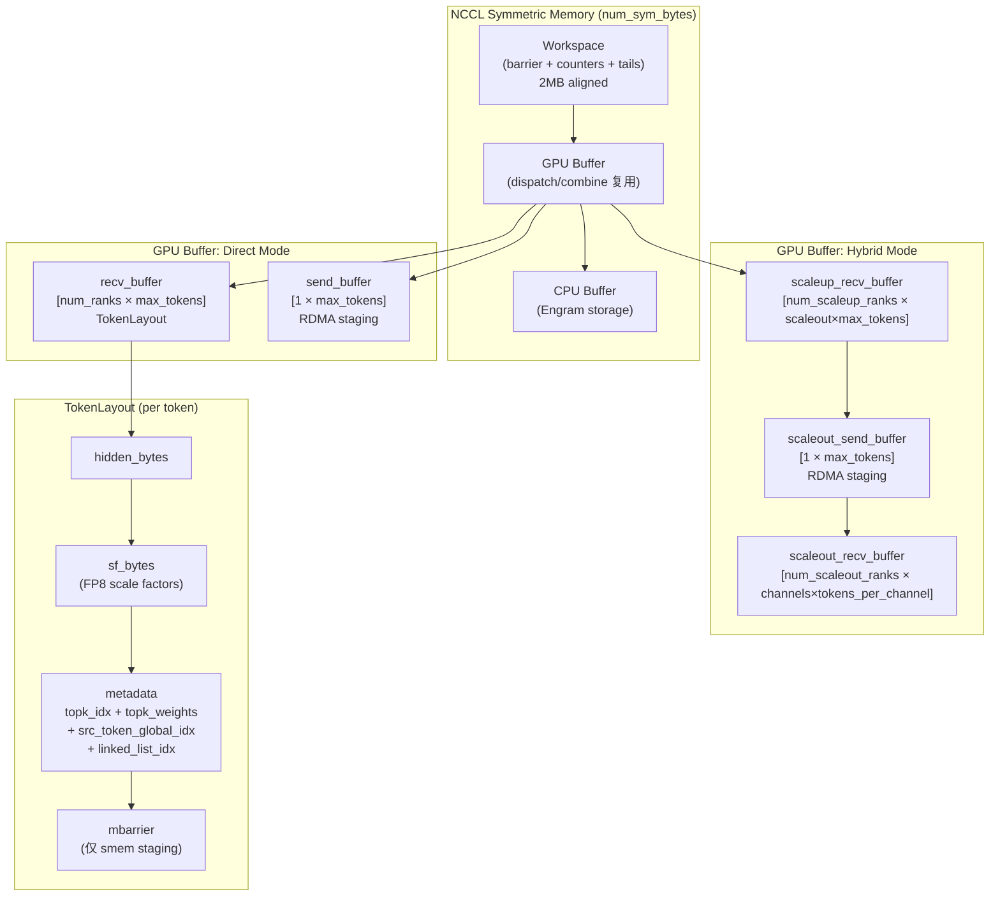
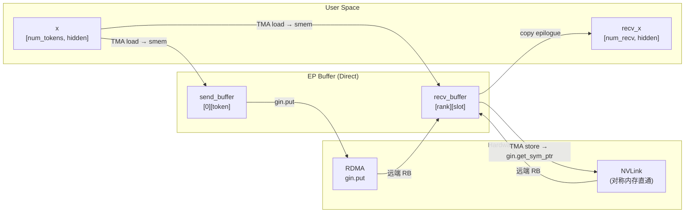
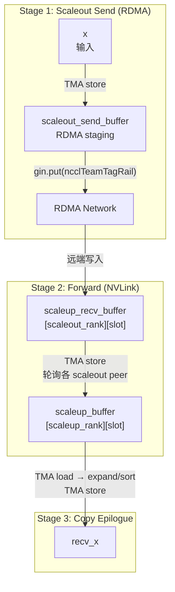

# DeepEP Buffer 系统深度分析：代码实证 vs 博客"第一性原理"模型

> 分析日期：2026-07-30
> 代码版本：DeepEP main branch
> 博客来源：*Understanding GPU Microarchitecture from a Workload Perspective (3): DeepEP's First Principles*

---

## 0. 摘要

博客中提出的 5 层 Buffer 模型（Token Buffer → Dispatch Buffer → Chunk Buffer → NVLink/RDMA → Receive Buffer → Expert Buffer）是一个**教学简化模型**。在实际的 DeepEP 代码实现中，Buffer 的组织方式与该模型存在显著差异。本文通过直接引用 `csrc/elastic/buffer.hpp`、`deep_ep/include/deep_ep/common/layout.cuh`、`deep_ep/include/deep_ep/impls/dispatch.cuh` 等核心代码，逐层还原真实的 Buffer 架构，并评估博客模型的准确性。

**核心结论**：
- 博客的 5 层模型捕获了数据流的**逻辑阶段**，但混淆了"用户输入/输出 Buffer"与"EP 内部通信 Buffer"的边界
- 实际实现中不存在独立的"Chunk Buffer"——chunk 是通信 kernel 的**调度粒度**而非独立 Buffer 段
- ElasticBuffer 的真实布局由 `BufferLayout<kWithMBarrier>` 模板参数化，分为 **Direct 模式**（3 段）和 **Hybrid 模式**（4 段）
- Legacy Buffer（NVSHMEM）与 Elastic Buffer（NCCL Gin）在组织哲学上根本不同：前者是"通道环形队列"，后者是"rank-token 二维数组"

---

## 1. 博客原文引用：5 层 Buffer 模型

博客 section 2.1 对 Normal Kernel 数据路径的描述：

> **Data path:**
> `Token Buffer → Dispatch Buffer → Chunk Buffer → NVLink / RDMA Pipeline → Receive Buffer → Expert Buffer`
>
> **Token Buffer**: Stores Router output. Layout: Token-major.
>
> **Dispatch Buffer**: First layout transformation: Token-major → Destination-major.
>
> **Chunk Buffer**: Critically important. The network is unsuitable for single-Token sends — produces small packets, high startup overhead, low bandwidth utilization. Tokens are aggregated: `Token Stream → Chunk → Network Transfer`. Token is the **scheduling granularity**; Chunk is the **communication granularity**.
>
> **Receive Buffer**: Destination GPU receives Chunks from multiple GPUs.
>
> **Expert Buffer**: Final transformation: Destination-major → Expert-major, forming Expert GEMM input.

博客 section 2.2 对 Low-Latency Kernel 的描述：

> **Low-Latency Kernel reduces intermediate layers:**
> `Token Buffer → Direct RDMA → Receive Buffer → Expert Buffer`
>
> Goal: minimize **end-to-end Token latency**.

---

## 2. ElasticBuffer 内部结构：真实内存布局

### 2.1 整体内存排布

代码位置：`csrc/elastic/buffer.hpp:19-34`

```cpp
class ElasticBuffer {
    // Buffer bytes = GPU buffer + CPU buffer (excludes workspace)
    // Memory layout: [[[Workspace] GPU buffer] CPU buffer]
    int64_t num_buffer_bytes;
    int64_t num_gpu_buffer_bytes;
    int64_t num_cpu_buffer_bytes;
    void* buffer;
    void *workspace;
    void *host_workspace, *mapped_host_workspace;
    // ...
};
```

**关键洞察**：整体内存排布是 `[[Workspace] GPU buffer] CPU buffer]`，其中：
- **Workspace**：位于最前端，用于 barrier、notify reduction、rank/expert 计数器等元数据
- **GPU buffer**：实际通信数据区（dispatch/combine 交替复用同一段）
- **CPU buffer**：仅用于 Engram（远程 KV cache 存储）

> **与博客对比**：博客完全没有提及 Workspace。实际上 Workspace 占据独立空间，且被所有 kernel 共享使用。

### 2.2 构造函数中的分配逻辑

代码位置：`csrc/elastic/buffer.hpp:81-140`

```cpp
ElasticBuffer(...) {
    // Workspace is aligned to 2 MB so that it sits cleanly at the front of the GPU segment
    const auto num_workspace_bytes = math::align<int64_t>(
        layout::WorkspaceLayout::get_num_bytes(), symmetric::kNumAlignmentBytes);

    // Create NCCL symmetric memory context
    // Symmetric memory layout: [[[Workspace] GPU buffer] CPU buffer]
    const auto num_sym_bytes = num_workspace_bytes + num_buffer_bytes;
    this->nccl_context = std::make_shared<nccl::NCCLSymmetricMemoryContext>(
        nccl_comm, cpu_comm, num_ranks, rank_idx,
        num_sym_bytes, num_cpu_buffer_bytes, ...);

    // Assign workspaces and buffers
    workspace = this->nccl_context->mapped_window_ptr;
    workspace_layout_wo_expert = std::make_shared<layout::WorkspaceLayout>(
        workspace, nccl_context->num_scaleout_ranks, nccl_context->num_scaleup_ranks, 0);
    buffer = static_cast<uint8_t*>(workspace) + num_workspace_bytes;
    CUDA_RUNTIME_CHECK(cudaMemset(workspace, 0, num_workspace_bytes));

    // Allocate host workspaces
    CUDA_RUNTIME_CHECK(cudaMallocHost(&host_workspace, layout::WorkspaceLayout::get_num_bytes(), cudaHostAllocMapped));
    CUDA_RUNTIME_CHECK(cudaHostGetDevicePointer(&mapped_host_workspace, host_workspace, 0));
    std::memset(host_workspace, 0, layout::WorkspaceLayout::get_num_bytes());
}
```

**关键分配规则**：
1. `workspace` 从 `mapped_window_ptr`（NCCL 对称内存窗口起始）开始
2. `buffer` = `workspace + num_workspace_bytes`（2 MB 对齐）
3. `host_workspace` 是额外分配的 CUDA host-mapped 内存，用于 CPU 侧同步读取计数器
4. 整个 `num_sym_bytes = num_workspace_bytes + num_buffer_bytes` 注册到 NCCL 对称内存

---

## 3. Buffer 段映射：博客模型 vs 实际实现

### 3.1 BufferLayout 模板：核心组织单元

代码位置：`deep_ep/include/deep_ep/common/layout.cuh:251-311`

```cpp
template <bool kWithMBarrier>
struct BufferLayout {
    TokenLayout token_layout;
    int num_ranks;
    int num_max_tokens_per_rank;
    void* base;

    __forceinline__ __device__ __host__
    BufferLayout(const TokenLayout& token_layout,
                 const int& num_ranks,
                 const int& max_num_tokens_per_rank,
                 void* base = nullptr) :
        token_layout(token_layout),
        num_ranks(num_ranks), num_max_tokens_per_rank(max_num_tokens_per_rank),
        base(base) {}

    int64_t get_num_bytes_per_rank() const {
        return num_max_tokens_per_rank * get_num_bytes_per_token();
    }

    int64_t get_num_bytes() const {
        return get_num_bytes_per_rank() * num_ranks;
    }

    BufferLayout get_rank_buffer(const int& rank_idx) const {
        return BufferLayout(token_layout,
                            1, num_max_tokens_per_rank,
                            static_cast<int8_t*>(base) + get_num_bytes_per_rank() * rank_idx);
    }

    TokenLayout get_token_buffer(const int& token_idx, const bool& global = false) const {
        EP_UNIFIED_ASSERT(num_ranks == 1 or global);
        return TokenLayout(token_layout.num_hidden_bytes, token_layout.num_sf_bytes,
                           token_layout.num_topk, token_layout.with_metadata,
                           static_cast<int8_t*>(base) + token_layout.get_num_bytes<kWithMBarrier, int64_t>() * token_idx);
    }
};
```

**BufferLayout 的维度含义**：
```
BufferLayout = [num_ranks] × [num_max_tokens_per_rank] × [TokenLayout]
```
- 第一维 `num_ranks`：每个 rank 一个"逻辑通道"
- 第二维 `num_max_tokens_per_rank`：每个 rank 最多接收的 token 数
- 第三维 `TokenLayout`：每个 token 的字节布局

### 3.2 TokenLayout：单个 token 的内部结构

代码位置：`deep_ep/include/deep_ep/common/layout.cuh:179-249`

```cpp
struct TokenLayout {
    int num_hidden_bytes, num_sf_bytes;
    bool with_metadata;
    int num_topk, num_metadata_bytes;
    void* base;

    __forceinline__ __device__ __host__
    TokenLayout(const int& num_hidden_bytes, const int& num_sf_bytes,
                const int& num_topk, const bool& with_metadata, void* base = nullptr) :
        num_hidden_bytes(num_hidden_bytes),
        num_sf_bytes(num_sf_bytes),
        with_metadata(with_metadata),
        num_topk(num_topk),
        num_metadata_bytes(num_topk * (sizeof(int) + sizeof(float)) +
                           (with_metadata ? (1 + num_topk) * sizeof(int) : 0)),
        base(base) {}

    template <bool kWithMBarrier, typename dtype_t = int>
    __forceinline__ __device__ __host__ dtype_t get_num_bytes() const {
        const auto num_bytes = math::align(num_hidden_bytes, ptx::kNumTMAAlignBytes) +
                               math::align(num_sf_bytes, ptx::kNumTMAAlignBytes) +
                               math::align(num_metadata_bytes, ptx::kNumTMAAlignBytes) +
                               math::align<int>(kWithMBarrier ? sizeof(ptx::mbarrier) : 0, ptx::kNumTMAAlignBytes);
        return static_cast<dtype_t>(num_bytes);
    }

    void* get_hidden_ptr() const { return get_base_ptr(); }
    sf_pack_t* get_sf_ptr() const {
        return math::advance_ptr<sf_pack_t>(base, math::align(num_hidden_bytes, ptx::kNumTMAAlignBytes));
    }
    int* get_topk_idx_ptr() const { return get_metadata_ptr(); }
    float* get_topk_weights_ptr() const {
        return math::advance_ptr<float>(get_metadata_ptr(), num_topk * sizeof(int));
    }
    int* get_src_token_global_idx_ptr() const {
        return math::advance_ptr<int>(get_topk_weights_ptr(), num_topk * sizeof(float));
    }
    int* get_linked_list_idx_ptr() const {
        return get_src_token_global_idx_ptr() + 1;
    }
    ptx::mbarrier* get_mbarrier_ptr() const {
        return math::advance_ptr<ptx::mbarrier>(get_metadata_ptr(), math::align(num_metadata_bytes, ptx::kNumTMAAlignBytes));
    }
};
```

**TokenLayout 内存排布**：
```
[hidden_bytes | SF_bytes | metadata_bytes | mbarrier?]
     ↓              ↓            ↓
   hidden     scale factors   topk_idx[num_topk]
                              topk_weights[num_topk]
                              src_token_global_idx
                              linked_list_idx[num_topk]
```

> **关键发现**：每个 token 自带 topk_idx、topk_weights 等 metadata。这意味着 Buffer 不是纯数据区，而是"数据+元数据"交错的打包结构。博客中的"Layout Transformation"实际上是在 kernel 中通过 TMA store 到不同 slot 完成的。

### 3.3 Direct 模式的 Buffer 段分配（单节点 / scaleout_ranks == 1）

代码位置：`csrc/elastic/buffer.hpp:586-613`

```cpp
static int64_t get_dispatch_buffer_size(const int& num_max_tokens_per_rank,
                                        const int& hidden, const int& num_sf_packs, const int& num_topk,
                                        const int& elem_size,
                                        const int& num_scaleout_ranks, const int& num_scaleup_ranks,
                                        const bool& is_scaleup_nvlink) {
    const auto num_ranks = num_scaleup_ranks * num_scaleout_ranks;
    const auto token_layout = get_dispatch_token_layout(hidden, elem_size, num_sf_packs, num_topk);

    if (num_scaleout_ranks == 1) {
        // Direct dispatch
        const auto send_buffer_layout = layout::BufferLayout<false>(
            token_layout, is_scaleup_nvlink ? 0 : 1, num_max_tokens_per_rank);
        const auto recv_buffer_layout = layout::BufferLayout<false>(
            token_layout, num_ranks, num_max_tokens_per_rank);
        return send_buffer_layout.get_num_bytes() + recv_buffer_layout.get_num_bytes();
    }
    // ...
}
```

**Direct 模式 Buffer 结构**：
```
GPU buffer = [recv_buffer (num_ranks × max_tokens) | send_buffer (1 × max_tokens)]
```

代码位置：`deep_ep/include/deep_ep/impls/dispatch.cuh:264-268`（实际 kernel 中的使用）

```cpp
// Buffer layouts
const auto token_layout = layout::TokenLayout(kNumHiddenBytes, kNumSFPacks * sizeof(sf_pack_t), kNumTopk, true);
const auto tma_buffer = layout::BufferLayout<true>(token_layout, kNumDispatchWarps, 1,
    math::advance_ptr<int>(smem, kNumSmemBytesForNotify)).get_rank_buffer(dispatch_warp_idx).get_token_buffer(0);
auto recv_buffer = layout::BufferLayout<false>(token_layout, kNumRanks, kNumMaxTokensPerRank, buffer);
auto send_buffer = layout::BufferLayout<false>(token_layout, 1, kNumMaxTokensPerRank, recv_buffer.get_buffer_end_ptr());
recv_buffer = recv_buffer.get_rank_buffer(rank_idx);
```

**Direct 模式 kernel 数据流**：
```
输入 x (用户 Tensor)
    ↓ TMA load
smem tma_buffer (warp 本地 staging)
    ↓ TMA store
recv_buffer[dst_rank][dst_slot]  (NVLink 直达目标 rank 的对称内存)
    ↓ gin.put (RDMA)
recv_buffer[...]  (对于 NVLink 不可达的 rank，先写入 send_buffer 再 RDMA)
```

### 3.4 Hybrid 模式的 Buffer 段分配（多节点 / scaleout_ranks > 1）

代码位置：`csrc/elastic/buffer.hpp:601-613`

```cpp
else {
    // Hybrid dispatch
    const auto scaleup_recv_buffer = layout::BufferLayout<false>(
        token_layout, num_scaleup_ranks, num_scaleout_ranks * num_max_tokens_per_rank);
    const auto scaleout_send_buffer = layout::BufferLayout<false>(
        token_layout, 1, num_max_tokens_per_rank);
    const auto scaleout_recv_buffer = layout::BufferLayout<false>(
        token_layout, num_scaleout_ranks,
        /* kNumChannels * kNumMaxTokensPerChannel */ num_max_tokens_per_rank + kNumMaxChannels);
    return scaleup_recv_buffer.get_num_bytes() +
           scaleout_send_buffer.get_num_bytes() +
           scaleout_recv_buffer.get_num_bytes();
}
```

**Hybrid 模式 Buffer 结构**：
```
GPU buffer = [scaleup_recv_buffer | scaleout_send_buffer | scaleout_recv_buffer]
```

代码位置：`deep_ep/include/deep_ep/impls/hybrid_dispatch.cuh:92-97`（kernel 实际使用）

```cpp
// All the buffers
auto scaleup_buffer = layout::BufferLayout<false>(
    token_layout, kNumScaleupRanks, kNumScaleoutRanks * kNumMaxTokensPerRank, buffer);
auto scaleout_send_buffer = layout::BufferLayout<false>(
    token_layout, 1, kNumMaxTokensPerRank, scaleup_buffer.get_buffer_end_ptr());
auto scaleout_recv_buffer = layout::BufferLayout<false>(
    token_layout, kNumScaleoutRanks, kNumChannels * kNumMaxTokensPerChannel, scaleout_send_buffer.get_buffer_end_ptr());
```

**Hybrid 模式 kernel 数据流（三阶段流水线）**：
```
输入 x
    ↓ (scaleout warps)
scaleout_send_buffer → gin.put(RDMA) → 远端 scaleout_recv_buffer
    ↓ (forward warps 轮询各 scaleout peer)
scaleout_recv_buffer → TMA store → scaleup_buffer[dst_scaleup_rank][slot]
    ↓ (copy epilogue)
scaleup_buffer → recv_x (用户 Tensor)
```

---

## 4. V1 (Legacy) vs V2 (Elastic) Buffer 组织对比

### 4.1 Legacy Buffer：NVSHMEM 通道环形队列

代码位置：`csrc/legacy/buffer.hpp:22-81`

```cpp
struct Buffer {
    // Low-latency mode buffer
    int low_latency_buffer_idx = 0;
    bool low_latency_mode = false;

    // NVLink Buffer
    int64_t num_nvl_bytes;
    void* buffer_ptrs[LEGACY_NUM_MAX_NVL_PEERS] = {nullptr};
    void** buffer_ptrs_gpu = nullptr;

    // NVSHMEM Buffer
    int64_t num_rdma_bytes;
    void* rdma_buffer_ptr = nullptr;

    // Workspace
    void* workspace = nullptr;

    // Host-side MoE info
    volatile int* moe_recv_counter = nullptr;
    int* moe_recv_counter_mapped = nullptr;
    volatile int* moe_recv_expert_counter = nullptr;
    volatile int* moe_recv_rdma_counter = nullptr;
    // ...
};
```

代码位置：`csrc/legacy/config.hpp:53-73`（NVL buffer size hint）

```cpp
size_t get_nvl_buffer_size_hint(size_t hidden_bytes, int num_ranks) const {
    const int num_channels = num_sms / 2;
    size_t num_bytes = 0;
    num_bytes += num_channels * num_nvl_ranks * (2 * num_rdma_ranks + 3) * sizeof(int);  // metadata
    num_bytes += num_channels * num_nvl_ranks * num_max_nvl_chunked_recv_tokens * hidden_bytes;  // data
    num_bytes += num_channels * num_nvl_ranks * num_max_nvl_chunked_recv_tokens * internode::get_source_meta_bytes();
    num_bytes += num_channels * num_nvl_ranks * num_max_nvl_chunked_recv_tokens * kNumMaxTopK * sizeof(topk_idx_t);
    num_bytes += num_channels * num_nvl_ranks * num_max_nvl_chunked_recv_tokens * kNumMaxTopK * sizeof(float);
    num_bytes += num_channels * num_nvl_ranks * num_max_nvl_chunked_recv_tokens * kNumMaxScales * sizeof(float);
    return num_bytes;
}
```

**Legacy NVLink Buffer 布局**：
```
num_nvl_bytes = Σ_channels Σ_ranks [
    metadata (start/end/head/tail)
    + data[num_max_nvl_chunked_recv_tokens]
    + source_meta[...]
    + topk_idx[...]
    + topk_weights[...]
    + scales[...]
]
```

**Legacy 的关键特征**：
1. **通道分离**：每个 channel 有独立的 queue head/tail，形成环形缓冲
2. **chunk 显式化**：`num_max_nvl_chunked_recv_tokens` 是实际的 chunk 大小参数
3. **IPC 共享**：通过 `buffer_ptrs[LEGACY_NUM_MAX_NVL_PEERS]` 直接打开对端内存
4. **NVSHMEM 分配**：RDMA buffer 通过 `nvshmem::alloc()` 分配

### 4.2 Elastic Buffer：NCCL Gin 对称内存

**Elastic 的关键特征**：
1. **模板化布局**：`BufferLayout<kWithMBarrier>` 编译期确定排布
2. **对称内存**：通过 NCCL Symmetric Memory (`ncclWinAllocate`) 注册
3. **rank × token 二维索引**：`buffer[rank_idx][token_idx]` 直接寻址，无环形队列
4. **TMA 硬件加速**：利用 Tensor Memory Accelerator 做全局内存拷贝
5. **mbarrier 同步**：每个 token slot 自带 mbarrier，支持异步等待

### 4.3 对比表

| 维度 | Legacy (V1) | Elastic (V2) |
|------|-------------|--------------|
| 通信后端 | NVSHMEM (`nvshmem_*`) | NCCL Gin (`ncclDevComm` + `ncclWindow`) |
| 内存注册 | `nvshmem::alloc` | `ncclWinAllocate` (Symmetric) |
| Buffer 组织 | 通道环形队列 (head/tail) | rank × token 二维数组 |
| Chunk 概念 | 显式 `num_max_*_chunked_*_tokens` | 隐式（warp 轮询 tokens） |
| 同步机制 | `nvshmem` barrier + 显式 flag | mbarrier + NCCL barrier + atomic counter |
| 元数据位置 | 与 data 交错在同一 queue | TokenLayout 内 data 后紧跟 metadata |
| 拓扑感知 | 固定 8 NVLink peers | 动态 scaleout/scaleup 逻辑域 |
| CPU 同步 | `moe_recv_counter` (host-mapped) | `host_workspace` (mapped) + `encode_decode_positive` |

---

## 5. BufferLayout 模板深度解析

### 5.1 rank_buffer vs token_buffer

```cpp
// 获取某个 rank 的子 BufferLayout（维度退化为 1 × num_max_tokens_per_rank）
BufferLayout get_rank_buffer(const int& rank_idx) const {
    return BufferLayout(token_layout,
                        1, num_max_tokens_per_rank,
                        static_cast<int8_t*>(base) + get_num_bytes_per_rank() * rank_idx);
}

// 获取某个 token 的 TokenLayout（维度退化为单个 token）
TokenLayout get_token_buffer(const int& token_idx, const bool& global = false) const {
    EP_UNIFIED_ASSERT(num_ranks == 1 or global);
    return TokenLayout(token_layout.num_hidden_bytes, token_layout.num_sf_bytes,
                       token_layout.num_topk, token_layout.with_metadata,
                       static_cast<int8_t*>(base) + token_layout.get_num_bytes<kWithMBarrier, int64_t>() * token_idx);
}
```

**维度链**：
```
BufferLayout(num_ranks, max_tokens)
    ├── .get_rank_buffer(i) → BufferLayout(1, max_tokens)
    │       └── .get_token_buffer(j) → TokenLayout(single token)
    └── .get_channel_buffer<kTokensPerChannel>(c) → BufferLayout(num_ranks, max_tokens)
            // 注意：channel 不是降维，而是 stride 访问
```

### 5.2 kWithMBarrier 模板参数

`kWithMBarrier` 控制是否在 TokenLayout 末尾预留 mbarrier 空间：
- **`BufferLayout<true>`**（smem 中的 TMA staging buffer）：需要 mbarrier 做 load/store 同步
- **`BufferLayout<false>`**（global memory 中的 recv/send buffer）：不需要 mbarrier

代码位置：`deep_ep/include/deep_ep/common/layout.cuh:201-208`

```cpp
template <bool kWithMBarrier, typename dtype_t = int>
__forceinline__ __device__ __host__ dtype_t get_num_bytes() const {
    const auto num_bytes = math::align(num_hidden_bytes, ptx::kNumTMAAlignBytes) +
                           math::align(num_sf_bytes, ptx::kNumTMAAlignBytes) +
                           math::align(num_metadata_bytes, ptx::kNumTMAAlignBytes) +
                           math::align<int>(kWithMBarrier ? sizeof(ptx::mbarrier) : 0, ptx::kNumTMAAlignBytes);
    return static_cast<dtype_t>(num_bytes);
}
```

### 5.3 Channel Buffer 的 stride 访问

```cpp
template <int kNumTokensPerChannel>
__forceinline__ __device__ __host__
BufferLayout get_channel_buffer(const int& channel_idx) const {
    EP_UNIFIED_ASSERT(num_max_tokens_per_rank % kNumTokensPerChannel == 0);
    return BufferLayout(token_layout,
                        num_ranks, num_max_tokens_per_rank,
                        static_cast<int8_t*>(base) + get_num_bytes_per_token() * kNumTokensPerChannel * channel_idx);
}
```

> **重要**：`get_channel_buffer` 返回的 BufferLayout 仍然保持 `num_ranks × num_max_tokens_per_rank` 维度，但 base 指针偏移了 `kNumTokensPerChannel * channel_idx`。这意味着 channel 是**交错排布**而非连续分块的——第 `kNumTokensPerChannel * c` 个 token 属于 channel c。

---

## 6. WorkspaceLayout：元数据专用空间

### 6.1 整体结构

代码位置：`deep_ep/include/deep_ep/common/layout.cuh:10-177`

```cpp
struct WorkspaceLayout {
    void* workspace;
    int num_ranks;
    int num_scaleout_ranks, num_scaleup_ranks;
    int num_experts, num_experts_per_rank;

    static constexpr int kNumMaxRanks = 1024;
    static constexpr int kNumMaxExperts = 2048;
    static constexpr int kNumMaxExpertsPerRank = 256;
    static constexpr int kNumMaxInflightAGRS = 32;
    static constexpr int64_t kNumBarrierSignalBytes = 16;

    static int64_t get_num_bytes() {
        int64_t num_bytes = 0;
        num_bytes += kNumBarrierSignalBytes;                                    // NVLink barrier
        num_bytes += (kNumMaxRanks + kNumMaxExperts) * sizeof(int64_t);        // Notify reduction
        num_bytes += kNumMaxRanks * sizeof(int64_t) * 2;                       // Scaleup rank count
        num_bytes += kNumMaxExperts * sizeof(int64_t) * 2;                     // Scaleup expert count
        num_bytes += kNumMaxRanks * sizeof(int);                                // Scaleup atomic sender
        num_bytes += kNumMaxRanks * sizeof(int) * 2;                           // Scaleout rank count
        num_bytes += kNumMaxExperts * sizeof(int) * 2;                         // Scaleout expert count
        num_bytes += kNumMaxRanks * kNumMaxChannels * sizeof(int64_t);         // Scaleout channel tails
        num_bytes += kNumMaxRanks * kNumMaxChannels * sizeof(int);             // Channel scaleup tails
        num_bytes += 2 * 2 * sizeof(int64_t);                                   // PP counts
        num_bytes += (kNumMaxInflightAGRS + 1) * kNumMaxRanks * sizeof(int);    // AGRS signals
        return num_bytes;
    }
    // ...
};
```

### 6.2 Workspace 各段用途

| 偏移段 | 用途 | 消费者 |
|--------|------|--------|
| `nvl_barrier_counter` (16B) | NVLink 全局 barrier | `gpu_barrier` |
| `notify_reduction_workspace` | SM 间原子加归约 | notify warps |
| `scaleup_rank_expert_count` | scaleup 域 rank/expert 接收计数 | notify + copy epilogue |
| `scaleup_atomic_sender_counter` | 发送端 slot 原子分配 | dispatch warps |
| `scaleout_rank_expert_count` | scaleout 域 rank/expert 接收计数 | hybrid notify warps |
| `scaleout_channel_signaled_tail` | scaleout channel 完成通知 | forward warps |
| `channel_scaleup_tail` | channel → scaleup 链表尾 | copy epilogue |
| `pp_send/recv_count` | Pipeline Parallel 计数 | PP kernel |
| `agrs_recv/session_signal` | All-Gather Reduce-Scatter 会话 | AGRS kernel |

### 6.3 host_workspace 的双重映射

```cpp
// Allocate host workspaces
CUDA_RUNTIME_CHECK(cudaMallocHost(&host_workspace, layout::WorkspaceLayout::get_num_bytes(), cudaHostAllocMapped));
CUDA_RUNTIME_CHECK(cudaHostGetDevicePointer(&mapped_host_workspace, host_workspace, 0));
```

**设计意图**：
- `host_workspace`：CPU 端虚拟地址，用于 `cudaDeviceSynchronize()` 后读取计数器
- `mapped_host_workspace`：GPU 端虚拟地址，用于 GPU kernel 写入
- 两者指向同一物理内存（zero-copy），实现 CPU 无锁轮询

---

## 7. 代码实证：Buffer 分配与使用的完整链路

### 7.1 dispatch 调用链

```
Python: buffer.dispatch(x, topk_idx, topk_weights, ...)
    ↓
C++: ElasticBuffer::dispatch (csrc/elastic/buffer.hpp:702)
    ├── 计算 num_sms, num_qps
    ├── 分配 psum_num_recv_tokens_per_scaleup_rank
    ├── 分配 psum_num_recv_tokens_per_expert
    ├── 分配 dst_buffer_slot_idx (non-hybrid) 或 [num_channels][num_scaleout][max_tokens_per_channel][topk] (hybrid)
    ├── 分配 token_metadata_at_forward (hybrid only)
    ├── 分配 channel_linked_list (hybrid only)
    ├── 清理 host_workspace 计数器
    ├── launch_dispatch(...) → dispatch_impl kernel
    │       ├── notify warps: 统计 expert/rank 接收数 → 写 workspace
    │       ├── dispatch warps: TMA load x → TMA store recv_buffer/send_buffer → gin.put (RDMA)
    │       └── cudaTriggerProgrammaticLaunchCompletion (触发 epilogue)
    ├── CPU 等待 host_workspace 计数器 (do_cpu_sync)
    ├── 分配 recv_x, recv_sf, recv_topk_idx, recv_topk_weights, recv_src_metadata
    └── launch_dispatch_copy_epilogue → dispatch_copy_epilogue_impl
            ├── 从 scaleup_buffer TMA load → smem
            ├── expand 模式: atomicAdd psum expert 计数器 → 分配 slot
            └── TMA store → recv_x
```

### 7.2 combine 调用链

```
Python: buffer.combine(x, handle, topk_weights, ...)
    ↓
C++: ElasticBuffer::combine (csrc/elastic/buffer.hpp:1180)
    ├── launch_combine(...) → combine_impl kernel
    │       ├── 读取 src_metadata 获取 (src_token_idx, src_rank_idx, src_topk_idx)
    │       ├── NVLink bypass: TMA store 到对端 scaleup_buffer
    │       ├── RDMA: TMA store 到 send_buffer → gin.put
    │       └── barrier
    ├── 分配 combined_x, combined_topk_weights
    └── launch_combine_reduce_epilogue → combine_reduce_epilogue_impl
            ├── 从 comm_buffer TMA load 多个 rank 的数据
            ├── combine_reduce: 本地归约 (allow_multiple_reduction)
            ├── 加 bias_0, bias_1
            └── TMA store → combined_x
```

---

## 8. 博客模型准确性评估

### 8.1 映射关系

| 博客术语 | 实际代码对应 | 准确性 |
|----------|--------------|--------|
| **Token Buffer** | 用户输入 Tensor `x`（不在 EP Buffer 内） | 部分准确——逻辑上是，但物理上不属于 EP Buffer |
| **Dispatch Buffer** | `recv_buffer` / `scaleup_buffer`（按目标 rank 索引） | 准确——Destination-major 布局 |
| **Chunk Buffer** | 不存在独立 Buffer；chunk 是 warp 调度策略 | **不准确**——chunk 是通信粒度，不是独立存储段 |
| **NVLink/RDMA Pipeline** | `gin.put<team_t>()` / `tma_store_1d()` + NCCL 对称内存 | 准确——但"Pipeline"是 gin 硬件抽象 |
| **Receive Buffer** | `recv_buffer`（与 Dispatch Buffer 同段） | **混淆**——Dispatch/Receive 是同一 Buffer 的两面 |
| **Expert Buffer** | 用户输出 Tensor `recv_x`（不在 EP Buffer 内） | 部分准确——逻辑上是，但物理上是 copy epilogue 的输出 |

### 8.2 博客简化了什么

1. **合并了 Dispatch Buffer 与 Receive Buffer**：
   - 博客描述为两个独立段
   - 实际是 `recv_buffer` 同一块内存，发送端 TMA store 到对端 `recv_buffer` 的某个 slot，接收端从同一 `recv_buffer` 读取

2. **虚构了 "Chunk Buffer"**：
   - 博客暗示存在一个独立的 chunk 聚合区
   - 实际 chunk 是 warp 的调度单位（每次处理 `kNumTokensPerChannel` 个 token），数据始终驻留在 rank × token 的二维数组中

3. **未区分 user Tensor 与 EP internal Buffer**：
   - Token Buffer (x) 和 Expert Buffer (recv_x) 是用户分配的 Tensor
   - EP Buffer 只包含 workspace + GPU buffer + CPU buffer

4. **忽略了 Workspace**：
   - Workspace 是独立的元数据区，承担 barrier、counter、notify 等关键功能
   - 博客模型完全没有体现这个"控制平面"

5. **未区分 Direct 与 Hybrid 模式**：
   - Hybrid 模式下存在 3 个独立 Buffer 段（scaleup_recv / scaleout_send / scaleout_recv）
   - 博客的线性流水线描述无法体现三阶段流水

### 8.3 博客捕捉到了什么

1. **Token 是调度粒度**：kernel 中 `for (int token_idx = token_start; token_idx < num_tokens; token_stride)` 确实以 token 为单位迭代
2. **Destination-major 布局**：`recv_buffer.get_rank_buffer(dst_rank).get_token_buffer(slot)` 确实是按目标 rank 索引
3. **通信粒度 vs 调度粒度分离**：chunk（warp 批量）确实是通信硬件高效利用的关键

---

## 9. Mermaid 图：真实 Buffer 层级结构

### 9.1 ElasticBuffer 物理布局



### 9.2 dispatch 数据流



### 9.3 Hybrid dispatch 三阶段流水



---

## 10. 总结

### 10.1 博客模型的教学价值

博客的 5 层模型作为**第一性原理抽象**具有以下价值：
- 清晰分离了"调度粒度 (Token)"与"通信粒度 (Chunk)"
- 突出了 Layout Transformation 的核心地位
- 为理解 Normal vs Low-Latency 的 trade-off 提供了框架

### 10.2 实际实现的复杂性

实际代码中的 Buffer 系统远比博客复杂：
1. **模板元编程**：`BufferLayout<kWithMBarrier>` 编译期多态
2. **拓扑自适应**：Direct vs Hybrid 两种完全不同的分段策略
3. **数据元数据打包**：TokenLayout 内 data + metadata 交错
4. **双层同步**：Workspace 控制面 + Buffer 数据面
5. **SM 间协作**：notify warps / dispatch warps / forward warps 各司其职

### 10.3 核心洞察

> **DeepEP Buffer 的本质不是"多层转换"，而是一个 rank × token 的二维对称内存数组，通过 TMA + NCCL Gin 硬件原语实现零拷贝的布局变换。**

博客描述的"Token → Dispatch → Chunk → Network → Receive → Expert"流水线实际上是以下代码路径的**逻辑抽象**：

```
用户 x → smem staging → recv_buffer[rank][slot] (NVLink/RDMA) → smem staging → 用户 recv_x
         ↑ TMA load          ↑ TMA store / gin.put        ↑ TMA load     ↑ TMA store
```

中间两步（smem staging）是同一个 `recv_buffer` 的两面，而非两个独立 Buffer。

---

## 附录：关键文件索引

| 文件 | 核心内容 |
|------|----------|
| `csrc/elastic/buffer.hpp` | ElasticBuffer C++ 类，分配逻辑，buffer size 计算 |
| `deep_ep/include/deep_ep/common/layout.cuh` | BufferLayout, TokenLayout, WorkspaceLayout |
| `deep_ep/include/deep_ep/impls/dispatch.cuh` | Direct dispatch kernel，Buffer 使用 |
| `deep_ep/include/deep_ep/impls/hybrid_dispatch.cuh` | Hybrid dispatch kernel，三阶段流水 |
| `deep_ep/include/deep_ep/impls/dispatch_copy_epilogue.cuh` | Copy epilogue，Buffer → 用户 Tensor |
| `deep_ep/include/deep_ep/impls/combine.cuh` | Combine kernel，数据回传 |
| `deep_ep/include/deep_ep/impls/hybrid_combine.cuh` | Hybrid combine kernel |
| `deep_ep/include/deep_ep/impls/combine_reduce_epilogue.cuh` | Reduce epilogue，归约 + bias |
| `csrc/legacy/buffer.hpp` | Legacy Buffer (NVSHMEM) |
| `csrc/legacy/config.hpp` | Legacy Config + LowLatencyLayout |
| `deep_ep/buffers/elastic.py` | Python 封装 |
| `tests/elastic/test_ep.py` | 测试用例，Buffer 使用模式 |
