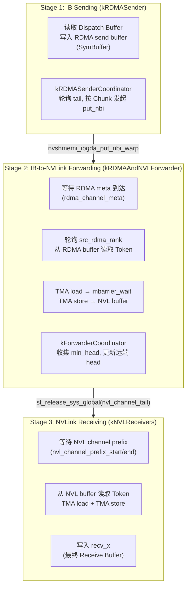
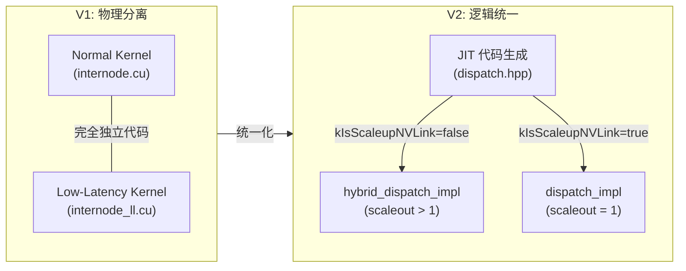

# DeepEP Normal vs Low-Latency 双模式深度分析：从 Blog 第一性原理到代码实现

> 分析日期: 2026-07-30
> 分析目标: 以 Blog "First Principles" 章节 3 的理论描述为准绳，逐行对照 DeepEP V1 (Legacy) 与 V2 (Elastic) 的实际代码实现，评估理论描述与工程实现的对应关系，并重点分析 V2 的"统一化"如何重构两种模式的边界。

---

## 1. Blog 理论：两种通信哲学的经典描述

> 来源: `/tmp/deep_ep_blog_text.txt` 第 3 节 "Normal vs Low-Latency: Two Communication Philosophies"

### 1.1 原文引用与对比表

Blog 对两种模式的经典描述如下：

| 维度 | Normal Kernel | Low-Latency Kernel |
|------|--------------|-------------------|
| **主场景** | Training / Prefill | Decode |
| **优化目标** | 最大化吞吐 (Maximize throughput) | 最小化延迟 (Minimize latency) |
| **核心矛盾** | 带宽 (Bandwidth) | 延迟 (Latency) |
| **Chunk** | 关键 (Critical) | 减少 (Reduced) |
| **流水线** | 深 (Deep pipeline) | 浅 (Shallow pipeline) |
| **通信路径** | NVLink + RDMA 协调 (coordination) | Direct RDMA |

### 1.2 Normal Kernel: 通信流水线 (Communication Pipelining)

Blog 原文：

> "In multi-GPU nodes, GPUs and NICs are not one-to-one bound. GPU0 to NIC1 may need **GPU0 → NVLink → GPU4 → PCIe → NIC1**. Communication becomes: **Source GPU → IB Sending → RDMA Network → IB-to-NVLink Forwarding → NVLink Receiving → Target GPU**."

> "Normal Kernel divides into three roles: **Source GPU → IB Sending → RDMA Network → IB-to-NVLink Forwarding → NVLink Receiving → Target GPU**."

核心要点：
- **三阶段流水线**: IB Sending → IB-to-NVLink Forwarding → NVLink Receiving
- **Chunk 聚合**: Token 流 → Chunk → 网络传输（Token 是调度粒度，Chunk 是通信粒度）
- **Forwarding 角色**: 解决 NIC-GPU 拓扑不对称问题

### 1.3 Low-Latency Kernel: 短路径 (Short Path)

Blog 原文：

> "Decode: small batch, few Tokens, single-Token latency sensitive. Waiting for Chunk aggregation increases latency. Low-Latency Kernel reduces intermediate layers: **Token Buffer → Direct RDMA → Receive Buffer → Expert Buffer**."

核心要点：
- **旁路 Forwarding**: 跳过 NVLink 中继
- **浅流水线**: 减少 Stage 以降低单 Token 延迟
- **Chunk 减少**: 不等待 Token 聚合

---

## 2. DeepEP V1 (Legacy) Normal 模式: `internode.cu`

### 2.1 架构总览

V1 Normal 模式采用**物理分离**的双文件设计：

```
deep_ep/buffers/legacy.py
  └── Buffer(low_latency_mode=False)
        ├── notify_dispatch<kLowLatencyMode=false>   ──┐
        ├── dispatch<kLowLatencyMode=false>            ├── internode.cu
        ├── cached_notify<kLowLatencyMode=false>       │
        └── combine<kLowLatencyMode=false>             ──┘
        └── (intranode.cu: NVLink only 路径)
```

**模式选择 API：**

```python
# deep_ep/buffers/legacy.py:37-93
class Buffer:
    def __init__(self,
                 group,
                 num_nvl_bytes: int = 0,
                 num_rdma_bytes: int = 0,
                 low_latency_mode: bool = False,  # ← False = Normal 模式
                 num_qps_per_rank: int = 24,
                 allow_nvlink_for_low_latency_mode: bool = True,
                 ...):
        self.low_latency_mode = low_latency_mode
        self.runtime = _C.Buffer(self.rank, self.group_size,
                                 num_nvl_bytes, num_rdma_bytes,
                                 low_latency_mode, ...)  # 传入 C++ 运行时
```

### 2.2 Dispatch Kernel: 5 Warp 角色与三阶段流水线

`internode.cu` 的 dispatch kernel 是 Normal 模式最核心、最复杂的实现，拥有 **5 种 Warp 角色**，形成完整的三阶段流水线。

#### (1) Warp 角色枚举

```cpp
// csrc/kernels/legacy/internode.cu:487
enum class WarpRole {
    kRDMASender,              // RDMA 发送者：从源 GPU 读取 Dispatch Buffer，写入 RDMA send buffer
    kRDMASenderCoordinator,   // RDMA 发送协调者：轮询 RDMA tail，按 Chunk 发起 put_nbi
    kRDMAAndNVLForwarder,     // RDMA+NVL 转发者：从 RDMA buffer 读取，通过 NVLink 转发到目标 GPU
    kForwarderCoordinator,    // 转发协调者：收集各 Forwarder 的 head 最小值，更新远端 RDMA head
    kNVLReceivers             // NVLink 接收者：从 NVL 读取，写入 recv_x（最终 Receive Buffer）
};
```

#### (2) Warp 角色分配逻辑

```cpp
// csrc/kernels/legacy/internode.cu:499-516
const auto num_channels = num_sms / 2, channel_id = sm_id / 2;
const bool is_forwarder = sm_id % 2 == 0;  // 偶数 SM 是 Forwarder，奇数 SM 是 Sender/Receiver

const auto role_meta = [=]() -> std::pair<WarpRole, int> {
    if (is_forwarder) {
        if (warp_id < LEGACY_NUM_MAX_NVL_PEERS) {
            return {WarpRole::kRDMAAndNVLForwarder, (warp_id + channel_id) % LEGACY_NUM_MAX_NVL_PEERS};
        } else {
            return {WarpRole::kForwarderCoordinator, warp_id - LEGACY_NUM_MAX_NVL_PEERS};
        }
    } else if (warp_id < kNumDispatchRDMASenderWarps) {
        return {WarpRole::kRDMASender, -1};
    } else if (warp_id == kNumDispatchRDMASenderWarps) {
        return {WarpRole::kRDMASenderCoordinator, -1};
    } else {
        return {WarpRole::kNVLReceivers, (warp_id + channel_id - kNumDispatchRDMASenderWarps) % LEGACY_NUM_MAX_NVL_PEERS};
    }
};
```

**关键设计：**
- `num_sms / 2` 个 channel，每个 channel 由 2 个 SM 服务（1 个 Forwarder + 1 个 Sender/Receiver）
- Forwarder SM 中的 warp 0-7 是 `kRDMAAndNVLForwarder`（每个负责一个目标 NVL rank）
- Sender/Receiver SM 中的 warp 0-6 是 `kRDMASender`，warp 7 是 `kRDMASenderCoordinator`，其余是 `kNVLReceivers`

#### (3) 三阶段流水线 Mermaid 图



#### (4) Chunk 聚合机制（Normal 模式核心）

```cpp
// csrc/kernels/legacy/internode.cu:527-529
// RDMA symmetric layout: Chunk 是通信粒度
auto rdma_channel_data = SymBuffer<uint8_t>(
    rdma_buffer_ptr,
    num_max_rdma_chunked_recv_tokens * num_bytes_per_token,  // ← Chunk 大小
    kNumRDMARanks, channel_id, num_channels);
```

Coordinator 按 Chunk 粒度发送，而非单 Token：

```cpp
// csrc/kernels/legacy/internode.cu:809-817
// 等待 Sender 完成一定数量的 Token 写入
auto num_tokens_processed = processed_tail - synced_last_issued_tail;
if (num_tokens_processed != synced_num_tokens_to_send
    and num_tokens_processed < num_max_rdma_chunked_send_tokens)
    continue;  // 未达到 Chunk 阈值，继续等待

// 按 Chunk 粒度发送
auto num_tokens_to_issue = min(num_tokens_processed, num_max_rdma_chunked_send_tokens);
nvshmemi_ibgda_put_nbi_warp<true>(dst_ptr, src_ptr, num_bytes_per_msg, ...);
```

#### (5) Forwarding 详细机制

Forwarding 是 Normal 模式最独特的部分——解决 NIC-GPU 拓扑不对称问题：

```cpp
// csrc/kernels/legacy/internode.cu:909-1013
} else if (warp_role == WarpRole::kRDMAAndNVLForwarder) {
    // 1. 等待 RDMA meta 到达（包含各 NVL rank 的 token 数前缀和）
    while (true) {
        auto meta_0 = ld_volatile_global(rdma_channel_meta.recv_buffer(lane_id) + dst_nvl_rank);
        auto meta_1 = ld_volatile_global(rdma_channel_meta.recv_buffer(lane_id) + LEGACY_NUM_MAX_NVL_PEERS + dst_nvl_rank);
        // meta_0, meta_1 < 0 表示数据已到达（编码为 -value - 1）
        if (meta_0 < 0 and meta_1 < 0 and meta_2 < 0 and meta_3 < 0) {
            int start_sum = -meta_0 - 1, end_sum = -meta_1 - 1;
            // 通知 NVL ranks
            st_relaxed_sys_global(nvl_channel_prefix_start.buffer() + lane_id, -start_sum - 1);
            st_relaxed_sys_global(nvl_channel_prefix_end.buffer() + lane_id, -end_sum - 1);
            break;
        }
    }

    // 2. 轮询 src_rdma_rank（round-robin），从 RDMA buffer 读取 Token
    while (__any_sync(0xffffffff, num_tokens_to_recv_from_rdma > 0)) {
        // 找到下一个有数据的 src_rdma_rank
        src_rdma_rank = (src_rdma_rank + 1) % kNumRDMARanks;
        if (__shfl_sync(0xffffffff, num_tokens_to_recv_from_rdma, src_rdma_rank) > 0) {
            if (lane_id == src_rdma_rank and cached_rdma_channel_head == cached_rdma_channel_tail)
                cached_rdma_channel_tail = ld_acquire_sys_global(rdma_channel_tail.buffer(src_rdma_rank));
            ...
        }

        // 3. 遍历每个 Token，通过 TMA 转发到 NVL buffer
        for (int i = src_rdma_head; i < src_rdma_tail; ++i) {
            auto rdma_slot_idx = i % num_max_rdma_chunked_recv_tokens;
            auto shifted = rdma_channel_data.recv_buffer(src_rdma_rank) + rdma_slot_idx * num_bytes_per_token;
            auto src_meta = ld_nc_global(reinterpret_cast<SourceMeta*>(shifted + hidden_bytes + scale_bytes));
            if (not is_in_dst_nvl_rank) continue;

            // TMA load from RDMA buffer, TMA store to NVL buffer
            int dst_slot_idx = (cached_nvl_channel_tail++) % num_max_nvl_chunked_recv_tokens;
            tma_load_1d(tma_buffer, shifted, tma_mbarrier, num_bytes_per_token, false);
            mbarrier_arrive_and_expect_tx(tma_mbarrier, num_bytes_per_token);
            mbarrier_wait(tma_mbarrier, tma_phase);
            tma_store_1d(tma_buffer, dst_shifted, num_bytes_per_token);
        }
    }
}
```

### 2.3 Combine Kernel: 4 Warp 角色与反向流水线

Combine 是 Dispatch 的反向操作，同样有复杂的 Warp 角色：

```cpp
// csrc/kernels/legacy/internode.cu:1746
enum class WarpRole { kNVLSender, kNVLAndRDMAForwarder, kRDMAReceiver, kCoordinator };
```

| 角色 | 功能 |
|------|------|
| `kNVLSender` | 从本地 x 读取，通过 NVL 发送到 Forwarder |
| `kNVLAndRDMAForwarder` | 从 NVL 接收，通过 RDMA 发送到目标 GPU |
| `kRDMAReceiver` | 从 RDMA 接收，写入本地 buffer |
| `kCoordinator` | 协调 RDMA 接收进度 |

### 2.4 `kLowLatencyMode` 模板参数的编译期分支

同一个 `internode.cu` 文件通过 `kLowLatencyMode` 模板参数同时服务于两种模式：

```cpp
// csrc/kernels/legacy/internode.cu:87-95
template <bool kLowLatencyMode>
__forceinline__ __device__ int translate_dst_rdma_rank(const int dst_rdma_rank, const int nvl_rank) {
    // Low-Latency: 每个 GPU 独立 RDMA rank (dst_rdma_rank * 8 + nvl_rank)
    // Normal: 同一 node 的 GPU 共享 RDMA rank (dst_rdma_rank)
    return kLowLatencyMode ? (dst_rdma_rank * LEGACY_NUM_MAX_NVL_PEERS + nvl_rank) : dst_rdma_rank;
}

template <bool kLowLatencyMode>
__forceinline__ __device__ void nvshmem_sync_with_same_gpu_idx(const nvshmem_team_t& rdma_team) {
    // Low-Latency: 仅同步 RDMA team（减少同步开销）
    // Normal: 全局同步
    kLowLatencyMode ? void(nvshmem_sync(rdma_team)) : nvshmem_sync_all();
}
```

**关键差异：**
- Normal 模式：`nvshmem_sync_all()` — 全局 barrier
- Low-Latency 模式：`nvshmem_sync(rdma_team)` — 仅 RDMA team 同步

---

## 3. DeepEP V1 (Legacy) Low-Latency 模式: `internode_ll.cu`

### 3.1 架构总览

Low-Latency 模式使用**完全独立的 kernel 文件** `internode_ll.cu`：

```
deep_ep/buffers/legacy.py
  └── Buffer(low_latency_mode=True)
        └── internode_ll.cu
              ├── clean_low_latency_buffer
              ├── dispatch (发送+接收一体化)
              ├── combine  (发送+接收一体化)
              ├── query_mask_buffer / update_mask_buffer / clean_mask_buffer
```

### 3.2 核心差异：无 Warp 角色分离

与 Normal 的 5 种 Warp 角色不同，Low-Latency 模式**几乎没有 Warp 角色分离**：

```cpp
// csrc/kernels/legacy/internode_ll.cu:128-155
template <bool kUseFP8, bool kUseUE8M0, int kHidden>
__global__ __launch_bounds__(1024, 1) void dispatch(...) {
    const auto sm_id = static_cast<int>(blockIdx.x);
    const auto warp_id = thread_id / 32, lane_id = get_lane_id();
    const auto warp_group_id = warp_id / num_warps_per_group;
    const auto sub_warp_id = warp_id % num_warps_per_group;
    const auto responsible_expert_idx = sm_id * num_warp_groups + warp_group_id;

    // 只有 2 种 Warp 角色:
    // 1. warp_id < num_warps - 1: FP8 cast + IBGDA send
    // 2. warp_id == num_warps - 1: 读取 topk_idx, 统计 per-expert 计数
    if (warp_id < num_warps - 1) {
        // 发送阶段
    } else if (warp_id == num_warps - 1) {
        // 计数阶段
    }
}
```

### 3.3 单 Token 直接发送（无 Chunk 聚合）

```cpp
// csrc/kernels/legacy/internode_ll.cu:202-278
for (int token_idx = sm_id; token_idx < num_tokens; token_idx += num_sms) {
    const auto x_int4 = static_cast<const int4*>(x) + token_idx * hidden_bf16_int4;
    const auto rdma_x_src_idx = reinterpret_cast<int*>(static_cast<uint8_t*>(rdma_x) + token_idx * num_bytes_per_msg);

    // FP8 cast（如果启用）
    for (int i = thread_id; i < hidden_bf16_int4; i += num_threads) {
        auto int4_value = __ldg(x_int4 + i);
        if constexpr (kUseFP8) {
            // 计算 local amax, scale
            calculate_fp8_scales(amax, scale, scale_inv, round_scale);
            // Cast into send buffer
            rdma_x_vec[i] = int2_value;
        }
    }
    asm volatile("bar.sync 1, %0;" ::"r"(num_threads));

    // 直接通过 IBGDA 发送，无 Forwarding，无 Chunk 聚合
    if (dst_expert_idx >= 0) {
        int slot_idx = lane_id == 0 ? atomicAdd(atomic_counter_per_expert + dst_expert_idx, 1) : 0;
        slot_idx = __shfl_sync(0xffffffff, slot_idx, 0);
        const auto dst_rank = dst_expert_idx / num_local_experts;
        const auto dst_ptr = reinterpret_cast<uint64_t>(rdma_recv_x) + ...;
        const auto dst_p2p_ptr = nvshmemi_get_p2p_ptr(dst_ptr, rank, dst_rank);
        if (not is_rank_masked<true>(mask_buffer_ptr, dst_rank)) {
            if (dst_p2p_ptr == 0) {
                nvshmemi_ibgda_put_nbi_warp(dst_ptr, src_ptr, num_bytes_per_msg, dst_rank, ...);
            } else {
                // P2P 直接写入
                UNROLLED_WARP_COPY(8, lane_id, num_int4_per_msg, dst_int4_ptr, src_int4_ptr, ld_nc_global, st_na_global);
            }
        }
    }
}
```

### 3.4 接收端：按 Expert 组织

```cpp
// csrc/kernels/legacy/internode_ll.cu:362-370
// 接收端按 Expert 组织，而非按 Rank（与 Normal 不同）
const auto rdma_recv_x_uint8 = static_cast<uint8_t*>(rdma_recv_x) +
    local_expert_idx * num_ranks * num_max_dispatch_tokens_per_rank * num_bytes_per_msg +
    src_rank * num_max_dispatch_tokens_per_rank * num_bytes_per_msg;
const auto recv_x_int4 = static_cast<int4*>(packed_recv_x) +
    local_expert_idx * num_ranks * num_max_dispatch_tokens_per_rank * hidden_int4;
```

### 3.5 超时与 Mask 机制（低延迟场景独有）

```cpp
// csrc/kernels/legacy/internode_ll.cu:383-408
if (sub_warp_id == 1 and lane_id == 0) {
    auto start_time = clock64();
    uint64_t wait_recv_cost = 0;
    if (not is_rank_masked(mask_buffer_ptr, src_rank)) {
        // 等待 Token 到达，带超时检测
        while ((num_recv_tokens = ld_acquire_sys_global(rdma_recv_count + ...)) == 0
               && (wait_recv_cost = clock64() - start_time) <= LEGACY_NUM_TIMEOUT_CYCLES)
            ;
    }
    // 超时则 mask 该 rank（低延迟场景的容错机制）
    if (wait_recv_cost > LEGACY_NUM_TIMEOUT_CYCLES) {
        printf("Warning: DeepEP timeout for dispatch receive, rank %d, ...", rank, ...);
        if (mask_buffer_ptr == nullptr) trap();
        atomicExch(mask_buffer_ptr + src_rank, 1);
    }
}
```

### 3.6 V1 双内核对比总结

| 维度 | Normal (`internode.cu`) | Low-Latency (`internode_ll.cu`) |
|------|------------------------|--------------------------------|
| **Warp 角色** | 5 种 (Sender/Coordinator/Forwarder/Coord/Receiver) | 2 种 (发送 warp + 计数 warp) |
| **通信粒度** | Chunk (多 Token 聚合) | 单 Token |
| **Forwarding** | 有 (GPU 作为 NVLink 中继) | 无 (Direct RDMA) |
| **同步机制** | `nvshmem_sync_all()` + barrier_block | `nvshmem_sync(rdma_team)` + atomic |
| **Buffer 结构** | 双 Buffer (NVL + RDMA) | 单 RDMA Buffer |
| **消息格式** | Token + SourceMeta + Scales | Token + Scales (更紧凑) |
| **错误处理** | 无 | Mask buffer + 超时检测 |
| **SM 使用** | 固定 20 (默认) | 动态 (num_sms) |
| **接收端组织** | 按 Rank | 按 Expert |
| **Kernel 结构** | 发送/接收分离 | 发送+接收一体化 (phases) |

---

## 4. DeepEP V2 (Elastic) 统一化：ElasticBuffer 如何重构两种模式

### 4.1 架构总览

V2 通过 **JIT 编译 + 模板参数** 实现逻辑统一：

```
deep_ep/buffers/elastic.py
  └── ElasticBuffer
        ├── dispatch_impl<kIsScaleupNVLink=false>  → hybrid_dispatch.cuh (多节点 = Normal 等价)
        ├── dispatch_impl<kIsScaleupNVLink=true>   → dispatch.cuh (单节点 NVLink only = Low-Latency 等价)
        └── (num_scaleout_ranks == 1 时自动选择 direct)
```

### 4.2 统一机制：模板参数 `kIsScaleupNVLink`

```cpp
// csrc/kernels/elastic/dispatch.hpp:53-78
static std::string generate_impl(const Args& args) {
    std::string header_name, func_name;
    if (args.num_scaleout_ranks == 1) {
        // 单节点模式 (类似 Low-Latency 场景)
        header_name = "dispatch";
        func_name = fmt::format("dispatch_impl<{}, {}, ...>",
            args.is_scaleup_nvlink,  // ← true = NVLink only
            ...);
    } else {
        // 跨节点模式 (类似 Normal 场景)
        header_name = "hybrid_dispatch";
        func_name = fmt::format("hybrid_dispatch_impl<{}, {}, ...>",
            args.num_scaleout_warps, args.num_forward_warps,  // ← 有 forwarding warps
            ...);
    }
}
```

**关键模板参数：**

```cpp
// deep_ep/include/deep_ep/impls/dispatch.cuh:17-30
template <bool kIsScaleupNVLink,      // ← 核心模式开关
          bool kDoCPUSync,
          bool kReuseSlotIndices,
          int kNumSMs,
          int kNumNotifyWarps, int kNumDispatchWarps,
          int kNumRanks,
          int kNumHiddenBytes, int kNumSFPacks,
          int kNumMaxTokensPerRank,
          int kNumExperts, int kNumTopk, int kExpertAlignment,
          int kNumQPs, int64_t kNumTimeoutCycles,
          ...>
__global__ void dispatch_impl(...)
```

### 4.3 Normal 等价：`hybrid_dispatch_impl` (scaleout > 1)

当 `num_scaleout_ranks > 1` 时，V2 使用 `hybrid_dispatch_impl`，对应 Blog 的 Normal 模式：

#### (1) 三阶段 Warp 角色

```cpp
// deep_ep/include/deep_ep/impls/hybrid_dispatch.cuh:14-32
template <..., int kNumScaleoutWarps, int kNumForwardWarps,  // ← Forward warps
          int kNumScaleoutRanks, int kNumScaleupRanks, ...>
__global__ void hybrid_dispatch_impl(...) {
    // Warp 角色:
    // 1. Notify warps: 元数据交换
    // 2. Scaleout warps: RDMA 发送
    // 3. Forward warps: NVLink 转发 ← 对应 Normal 的 Forwarding
}
```

#### (2) Forwarding 机制

```cpp
// deep_ep/include/deep_ep/impls/hybrid_dispatch.cuh:88-97
auto scaleup_buffer = layout::BufferLayout<false>(
    token_layout, kNumScaleupRanks, kNumScaleoutRanks * kNumMaxTokensPerRank, buffer);
auto scaleout_send_buffer = layout::BufferLayout<false>(
    token_layout, 1, kNumMaxTokensPerRank, scaleup_buffer.get_buffer_end_ptr());
auto scaleout_recv_buffer = layout::BufferLayout<false>(
    token_layout, kNumScaleoutRanks, kNumChannels * kNumMaxTokensPerChannel, ...);
```

**与 V1 Normal 的对应关系：**
- `scaleout_send_buffer` → V1 的 RDMA send buffer
- `scaleup_buffer` → V1 的 NVLink receive buffer
- `Forward warps` → V1 的 `kRDMAAndNVLForwarder`

#### (3) Chunk 机制

```cpp
// deep_ep/include/deep_ep/impls/hybrid_dispatch.cuh:24-27
int kNumChannelsPerSM = kNumScaleoutWarps,
int kNumChannels = kNumScaleoutWarps * kNumSMs,
int kNumMaxTokensPerChannel = math::constexpr_ceil_div(kNumMaxTokensPerRank, kNumChannels),
int kScaleoutUpdateInterval = 6,           // ← Chunk 更新间隔
int kNumSlotsPerForwardChunk = kScaleoutUpdateInterval,  // ← Chunk 大小
```

### 4.4 Low-Latency 等价：`dispatch_impl` (scaleout = 1)

当 `num_scaleout_ranks == 1` 时，V2 使用 `dispatch_impl`，对应 Blog 的 Low-Latency 模式：

#### (1) 无 Forwarding

```cpp
// deep_ep/include/deep_ep/impls/dispatch.cuh:362-393
// Issue TMA NVLink stores (直接写入，无转发)
const auto dst_ptr = stored_dst_slot_idx >= 0 ?
    gin.get_sym_ptr<team_t>(recv_buffer.get_token_buffer(stored_dst_slot_idx).get_base_ptr(), stored_dst_rank_idx) :
    nullptr;
if (dst_ptr != nullptr)
    ptx::tma_store_1d(dst_ptr, tma_buffer.get_base_ptr(), tma_buffer.get_num_bytes<false>());

// Issue RDMA put (仅对非 NVLink 可达的 rank)
if constexpr (not kIsScaleupNVLink) {
    if (stored_dst_slot_idx >= 0 and dst_ptr == nullptr) {
        gin.put<team_t>(recv_buffer.get_token_buffer(stored_dst_slot_idx).get_base_ptr(),
                        send_buffer_ptr, tma_buffer.get_num_bytes<false>(), stored_dst_rank_idx);
    }
}
```

**关键差异：**
- `kIsScaleupNVLink = true`: 纯 NVLink，无 RDMA
- `kIsScaleupNVLink = false`: NVLink + RDMA，但**无 Forwarding warps**

#### (2) 单 Token 粒度

```cpp
// deep_ep/include/deep_ep/impls/dispatch.cuh:278-292
// 每个 Token 独立处理，无 Chunk 聚合
const auto token_start = dispatch_warp_idx * kNumSMs + sm_idx;
const auto token_stride = kNumDispatchWarps * kNumSMs;
for (int token_idx = token_start; token_idx < num_tokens; token_idx += token_stride) {
    // Issue data TMA (单 Token)
    if (ptx::elect_one_sync()) {
        ptx::tma_load_1d(tma_buffer.get_hidden_ptr(),
                         math::advance_ptr(x, token_i64_idx * kNumHiddenBytes),
                         mbarrier_ptr, kNumHiddenBytes);
    }
    // ...
}
```

### 4.5 V2 统一化的本质

V2 的统一不是"消灭"两种模式，而是通过以下机制让两种模式共享同一套代码骨架：

| 统一机制 | 具体实现 |
|---------|---------|
| **JIT 编译** | 模板参数在编译期确定，运行时零开销 |
| **模板参数 `kIsScaleupNVLink`** | 控制是否走 NVLink 路径 |
| **`num_scaleout_ranks` 判断** | 决定使用 `dispatch_impl` 还是 `hybrid_dispatch_impl` |
| **带宽模型** | `get_theoretical_num_sms` 自动决策 SM 数量 |
| **Buffer 统一** | ElasticBuffer 统一内存管理，不再分离 NVL/RDMA Buffer |

---

## 5. SM 数量计算：`get_theoretical_num_sms` 带宽模型

### 5.1 核心算法

```python
# deep_ep/buffers/elastic.py:729-834
@weak_lru(maxsize=None)
def get_theoretical_num_sms(self, num_experts: int, num_topk: int,
                            num_scaleout_topk: int = 0,
                            rdma_gbs: float = 0, nvlink_gbs: float = 0,
                            sm_read_gbs: float = 200, sm_write_gbs: float = 50) -> int:
    """
    基于带宽模型估算 dispatch/combine kernel 的最优 SM 数量。
    假设 balanced gate distribution。
    """
    # 1. 获取带宽
    if rdma_gbs == 0 and self.num_rdma_ranks > 1:
        rdma_gbs = get_rdma_gbs()
    if nvlink_gbs == 0:
        nvlink_gbs = get_nvlink_gbs()

    # 2. 计算期望 top-k scale-out/scale-up ranks
    def get_expected_topk(num_groups: int) -> float:
        return num_groups * (1 - math.comb(num_experts - num_experts // num_groups, num_topk)
                                / math.comb(num_experts, num_topk))

    num_expected_scaleout_topk = get_expected_topk(self.num_scaleout_ranks) if self.num_scaleout_ranks > 1 else 0
    num_expected_topk = get_expected_topk(self.num_ranks)

    # 3. 计算各类型流量
    sm_read, sm_write = 0, 0
    rdma_traffic, nvlink_traffic = 0, 0

    sm_read += 1 / num_expected_topk  # 读取 tokens

    if self.num_scaleout_ranks > 1:
        # Hybrid 模式 (Normal 等价)
        sm_write += 1 / num_expected_topk
        sm_write += (1 / num_expected_topk) * (num_expected_scaleout_topk / self.num_scaleout_ranks)
        rdma_traffic += (1 / num_expected_topk) * (num_expected_scaleout_topk * (1 - 1 / self.num_scaleout_ranks))
        sm_read += num_expected_scaleout_topk / num_expected_topk  # Forward warps
        sm_write += 1  # Issue scaleup
        nvlink_traffic += 1 - (1 / self.num_scaleup_ranks)
    else:
        # Direct 模式 (Low-Latency 等价)
        if self.num_rdma_ranks > 1:
            sm_write += 1 / num_expected_topk
        sm_write += self.num_nvlink_ranks / self.num_ranks
        nvlink_traffic += self.num_nvlink_ranks / self.num_ranks * (1 - 1 / self.num_nvlink_ranks)
        rdma_traffic += (self.num_ranks - self.num_nvlink_ranks) / self.num_ranks

    # 4. 找到瓶颈
    if self.num_scaleout_ranks > 1 and (rdma_traffic / rdma_gbs) > (nvlink_traffic / nvlink_gbs):
        bounded_traffic, bounded_gbs = rdma_traffic, rdma_gbs
    else:
        bounded_traffic, bounded_gbs = nvlink_traffic, nvlink_gbs

    # 5. 计算 SM 数量
    num_device_sms = torch.cuda.get_device_properties('cuda').multi_processor_count
    num_sms = num_device_sms  # 无流量时默认全部 SM
    if bounded_traffic > 0:
        num_sms = max(
            bounded_gbs / bounded_traffic * sm_read / sm_read_gbs,
            bounded_gbs / bounded_traffic * sm_write / sm_write_gbs,
        )
    num_sms = align(max(4, math.ceil(num_sms * 1.25)), 2)
    num_sms = num_sms if self.prefer_overlap_with_compute else max(num_sms, 64)
    num_sms = min(num_sms, num_device_sms)
    return num_sms
```

### 5.2 算法核心思想

该算法的核心是**带宽平衡模型**：

```
所需 SM 数 = 瓶颈带宽 / 单 Token 流量 × 每 SM 读写需求 / 每 SM 带宽能力
```

关键参数：
- `sm_read_gbs = 200`: 每 SM HBM 读取带宽 (GB/s)
- `sm_write_gbs = 50`: 每 SM HBM 写入带宽 (GB/s)
- `rdma_gbs`: RDMA 物理带宽 (如 90 GB/s)
- `nvlink_gbs`: NVLink 物理带宽 (如 726 GB/s)

### 5.3 与 V1 的对比

| 维度 | V1 (Legacy) | V2 (Elastic) |
|------|-----------|-------------|
| **SM 决策** | 手动配置 / auto-tuning | 解析模型自动计算 |
| **参数** | `num_sms=20` 固定 | `get_theoretical_num_sms` 动态 |
| **调优** | 需要 bench 搜索最优 | 无需调优 |
| **典型值** | 20 (Normal), 动态 (LL) | 6-64 (取决于拓扑) |

---

## 6. 性能数据：从 README 到实测

### 6.1 V2 性能数据 (README)

> 来源: `/Users/backyes/work/claude_workspace/deepgemm_research/DeepEP/README.md` 第 41-59 行

| Arch | NIC type | Topo | Dispatch Bottleneck Bandwidth | Combine Bottleneck Bandwidth | #SMs |
|------|----------|------|-------------------------------|------------------------------|------|
| SM90 | CX7 | EP 8 x 2 | **90 GB/s (RDMA)** | 81 GB/s (RDMA) | 12 |
| SM90 | CX7 | EP 8 x 4 | 61 GB/s (RDMA) | 61 GB/s (RDMA) | 6 |
| SM100 | CX7 | EP 8 x 2 | **90 GB/s (RDMA)** | 91 GB/s (RDMA) | 12 |
| SM100 | N/A | EP 8 | **726 GB/s (NVLink)** | 740 GB/s (NVLink) | 64 (Max perf) |
| SM100 | N/A | EP 8 | 643 GB/s (NVLink) | 675 GB/s (NVLink) | 24 (Min #SM) |

**关键观察：**
- **RDMA 带宽**: 90 GB/s (接近 CX7 单端口理论带宽 ~100 GB/s)
- **NVLink 带宽**: 726 GB/s (接近 H100 NVLink 理论带宽 ~900 GB/s)
- **SM 效率**: V2 用 12 SM 达到 90 GB/s RDMA，而 V1 需要 20 SM

### 6.2 V2 相对 V1 的提升

README 原文：

> "Comparing with V1, **V2 achieves up to 1.3x peak performance, while saving up to 4x SM count**."

> "For V3-like legacy training, SM usage reduced from 24 to 4 - 6 while maintaining equivalent or better performance"

---

## 7. 代码证据：模式选择与 Kernel 差异

### 7.1 V1 模式选择的代码证据

```python
# tests/legacy/test_internode.py:324-330 (Normal 模式测试)
num_sms = 24
num_qps_per_rank = max(num_sms, ll_num_experts // num_ranks if args.test_ll_compatibility else 0)
buffer = deep_ep.Buffer(group,
                        num_nvl_bytes=nvl_buffer_size,
                        num_rdma_bytes=rdma_buffer_size,
                        low_latency_mode=args.test_ll_compatibility,  # ← False = Normal
                        num_qps_per_rank=num_qps_per_rank,
                        ...)
```

```python
# tests/legacy/test_low_latency.py:263-270 (Low-Latency 模式测试)
buffer = deep_ep.Buffer(group,
                        num_rdma_bytes=num_rdma_bytes,
                        low_latency_mode=True,  # ← True = Low-Latency
                        num_qps_per_rank=num_experts // num_ranks,
                        allow_nvlink_for_low_latency_mode=not args.disable_nvlink,
                        ...)
```

### 7.2 V2 模式选择的代码证据

V2 **没有显式的 `low_latency_mode` 参数**，而是通过拓扑自动推断：

```python
# README.md:148-162
_buffer = ElasticBuffer(
    group,
    num_max_tokens_per_rank=num_max_tokens_per_rank,
    hidden=hidden,
    num_topk=num_topk,
    use_fp8_dispatch=use_fp8_dispatch,
)

# V2 analytically calculates the optimal SM count — no more auto-tuning needed
_num_comm_sms = _buffer.get_theoretical_num_sms(num_experts, num_topk)
```

V2 内部通过 `num_scaleout_ranks` 自动选择 kernel：

```cpp
// csrc/kernels/elastic/dispatch.hpp:53-78
if (args.num_scaleout_ranks == 1) {
    header_name = "dispatch";          // ← 单节点，类似 Low-Latency
} else {
    header_name = "hybrid_dispatch";   // ← 多节点，类似 Normal
}
```

### 7.3 V1 与 V2 的 API 对比

| 维度 | V1 (Legacy) | V2 (Elastic) |
|------|-----------|-------------|
| **Buffer 类** | `deep_ep.Buffer` | `deep_ep.ElasticBuffer` |
| **模式参数** | `low_latency_mode=True/False` | 无（自动推断） |
| **Buffer 大小** | 手动指定 `num_nvl_bytes`, `num_rdma_bytes` | 自动通过 MoE settings 计算 |
| **SM 数量** | 手动指定 `num_sms` | 自动通过 `get_theoretical_num_sms` |
| **后端** | NVSHMEM (IBGDA) | NCCL Gin |
| **Dispatch API** | `buffer.dispatch(...)`, `buffer.low_latency_dispatch(...)` | 统一 `buffer.dispatch(...)` |
| **Combine API** | `buffer.combine(...)`, `buffer.low_latency_combine(...)` | 统一 `buffer.combine(...)` |

---

## 8. 准确性评估：Blog 描述在 V2 时代的适用性

### 8.1 Blog 描述的准确度（对 V1）

Blog 对 V1 的描述**高度准确**：

| Blog 描述 | V1 代码证据 | 匹配度 |
|----------|-----------|-------|
| "三阶段流水线: IB Sending → Forwarding → NVLink Receiving" | `internode.cu` 的 5 Warp 角色 | 精确 |
| "Chunk 是通信粒度" | `num_max_rdma_chunked_send_tokens`, `num_max_rdma_chunked_recv_tokens` | 精确 |
| "Forwarding 解决 NIC-GPU 拓扑不对称" | `kRDMAAndNVLForwarder` 角色 | 精确 |
| "Low-Latency 旁路 Forwarding" | `internode_ll.cu` 无 Forwarding 角色 | 精确 |
| "Low-Latency Chunk 减少" | `internode_ll.cu` 单 Token 直接发送 | 精确 |

### 8.2 Blog 描述在 V2 时代的适用性

Blog 的描述在 V2 时代**仍然具有指导意义，但需要重新解读**：

#### (1) 仍然有效的核心概念

| 核心概念 | V2 对应 | 有效性 |
|---------|--------|--------|
| **Forwarding 的必要性** | `hybrid_dispatch_impl` 的 `kNumForwardWarps` | 仍然成立 |
| **Chunk 聚合对吞吐的增益** | `kScaleoutUpdateInterval`, `kNumSlotsPerForwardChunk` | 仍然成立 |
| **单 Token 发送对延迟的优势** | `dispatch_impl` 的 Token-by-Token 处理 | 仍然成立 |
| **NVLink + RDMA 协同** | `hybrid_dispatch_impl` 的 scaleout + scaleup buffer | 仍然成立 |

#### (2) 需要更新的认知

| 旧认知 (Blog/V1) | V2 现实 | 差异 |
|----------------|--------|------|
| "两种模式是独立的 kernel" | V2 是同一套 JIT 代码，模板参数分化 | 从"物理分离"到"逻辑统一" |
| "Low-Latency 不需要 Chunk" | V2 的 direct mode 仍可能有内部 buffering | Chunk 粒度更灵活 |
| "Normal 用 NVSHMEM，Low-Latency 也用 NVSHMEM" | V2 统一使用 NCCL Gin 后端 | 后端统一 |
| "SM 数量固定/手动调优" | V2 通过带宽模型自动计算 | 自动化 |
| "Low-Latency 仅用于 Decode" | V2 的 direct mode 也可用于训练 (单节点 EP) | 场景扩展 |

#### (3) V2 统一化带来的范式转变



**核心转变：**
- V1: **运行时二选一** — `low_latency_mode` 参数决定使用哪套 kernel
- V2: **编译期自动分化** — `num_scaleout_ranks` 和 `kIsScaleupNVLink` 模板参数在 JIT 编译时确定

### 8.3 最终评估结论

| 评估维度 | 结论 |
|---------|------|
| **Blog 对 V1 的描述** | 精确，可直接对照代码验证 |
| **Blog 的核心概念** | 仍然有效，Forwarding/Chunk/流水线 仍是设计核心 |
| **Blog 的"两模式"框架** | 在 V2 中演化为"同一套代码的两种编译路径" |
| **V2 的统一化意义** | 从"用户选择模式"到"系统自动适配拓扑" |
| **性能影响** | V2 用更少 SM 达到更高带宽，但核心通信哲学未变 |

**总结：** Blog 对 Normal vs Low-Latency 的描述是 DeepEP 设计的**第一性原理**，V2 的实现并未推翻这一框架，而是通过 JIT 编译和带宽模型将其**工程化、自动化、统一化**。理解 Blog 的理论框架是理解 V2 代码的关键入口。

---

## 附录 A: 关键常量定义

```cpp
// csrc/kernels/legacy/compiled.cuh:5-18
#define LEGACY_NUM_MAX_NVL_PEERS 8
#define LEGACY_NUM_MAX_RDMA_PEERS 20
#define LEGACY_NUM_WORKSPACE_BYTES (32 * 1024 * 1024)
#define LEGACY_NUM_MAX_LOCAL_EXPERTS 1024
#define LEGACY_NUM_BUFFER_ALIGNMENT_BYTES 128
#define LEGACY_LOW_LATENCY_SEND_PHASE 1
#define LEGACY_LOW_LATENCY_RECV_PHASE 2
#define LEGACY_FINISHED_SUM_TAG 1024
#define LEGACY_NUM_WAIT_NANOSECONDS 500
#define LEGACY_NUM_CPU_TIMEOUT_SECS 100
#define LEGACY_NUM_TIMEOUT_CYCLES 200000000000ull  // 200G cycles ~= 100s
```

## 附录 B: 文件路径索引

| 文件 | 作用 |
|------|------|
| `csrc/kernels/legacy/internode.cu` | V1 Normal/Low-Latency internode kernel (双模板) |
| `csrc/kernels/legacy/internode_ll.cu` | V1 Low-Latency 独立 kernel |
| `csrc/kernels/legacy/intranode.cu` | V1 NVLink only kernel |
| `csrc/kernels/legacy/api.cuh` | V1 API 声明 |
| `csrc/kernels/legacy/compiled.cuh` | V1 常量定义 |
| `csrc/kernels/elastic/dispatch.hpp` | V2 JIT 代码生成 |
| `deep_ep/include/deep_ep/impls/dispatch.cuh` | V2 direct dispatch kernel |
| `deep_ep/include/deep_ep/impls/hybrid_dispatch.cuh` | V2 hybrid dispatch kernel |
| `deep_ep/buffers/elastic.py` | V2 ElasticBuffer Python 接口 |
| `deep_ep/buffers/legacy.py` | V1 Buffer Python 接口 |
| `tests/legacy/test_internode.py` | V1 Normal 测试 |
| `tests/legacy/test_low_latency.py` | V1 Low-Latency 测试 |
| `README.md` | 性能数据 |
