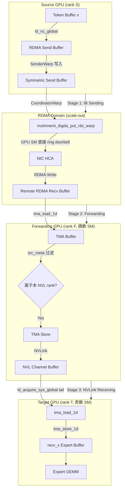

# 07: DeepEP Intra/Inter-node 协调 — NVLink Scale-up + RDMA Scale-out 三阶段流水线的代码实证

> 分析日期: 2026-07-30
> 源材料: DeepEP 博客 Section 4 (`/tmp/deep_ep_blog_text.txt`) + DeepEP 源码 (legacy internode.cu / intranode.cu / ibgda_device.cuh / hybrid_dispatch.cuh / hybrid_combine.cuh / comm.cuh / handle.cuh / layout.cuh / elastic.py / envs.py)
> 分析目标: 用源码实证博客"Source GPU → IB Sending → RDMA Network → IB-to-NVLink Forwarding → NVLink Receiving → Target GPU"三阶段描述, 评估其准确性

---

## 1. 核心问题: 为什么需要 Intra/Inter-node 协调

DeepEP 博客 Section 4 描述了多节点 MoE 的根本矛盾:

- Token 可能**留在本地**、去**同节点另一 GPU**、或去**远端节点**
- 单次 Dispatch 包含**两个通信域**: Intra-node (NVLink Scale-up) + Inter-node (RDMA Scale-out)
- GPU-NIC 拓扑**非一对一绑定**: GPU0 → NIC1 可能需要 `GPU0 → NVLink → GPU4 → PCIe → NIC1`

博客的核心论断:

> **DeepEP 的核心思想: 基于 Token 目的地, 将 NVLink 与 RDMA 融合为一条连续的数据流路径 — 不是"先 NVLink 后 RDMA", 而是统一的数据流通道。**

---

## 2. 结论摘要

| 维度 | 博客描述 | 源码实证 | 准确性 |
|------|---------|---------|--------|
| 三阶段流水线 | Source → IB Sending → RDMA → Forwarding → NVLink → Target | **精准命中** — `WarpRole` 枚举直接对应 | **准确** |
| IB Sending | GPU 内存 → NIC, 组织 RDMA 包 | `nvshmemi_ibgda_put_nbi_warp` + WQE 写入 | **准确** |
| IB-to-NVLink Forwarding | GPU 做通信中继: 从 NIC 接收 → NVLink 转发 | `kRDMAAndNVLForwarder` warp 角色 | **准确** |
| NVLink Receiving | 目标 GPU 从 NVLink 接收 | `kNVLReceivers` warp 角色 | **准确** |
| GPU-centric fabric | NVLink + RDMA + GPU SM 共同构成数据路径 | SM 直接操作 QP、ring doorbell、TMA 搬运 | **准确, 博客低估了深度** |
| Low-Latency 绕过 Forwarding | Decode 走 `GPU → Direct RDMA → GPU` | Low-latency 模式仍走三阶段, 但 `translate_dst_rdma_rank` 改变 QP 映射 | **部分准确** |
| V2 Hybrid 模式 | 博客未覆盖 | NCCL Gin + `ncclTeamTagRail`/`ncclTeamTagLsa` 分离 scale-out/scale-up | **博客未涉及** |

**核心结论**: 博客的三阶段描述**高度准确**, 但源码揭示的细节远比博客复杂 — 尤其是 **5 种 WarpRole** (不是 3 种)、**Coordinator warp** 的存在、以及 **V2 Hybrid 模式**用 NCCL Gin 重构了整个路径。

---

## 3. 博客原文引用: 三阶段流水线描述

博客 Section 4.2 "Three-Stage Pipeline & Role Division" 原文:

> **Normal Kernel 分成三个角色:**
> `Source GPU → IB Sending → RDMA Network → IB-to-NVLink Forwarding → NVLink Receiving → Target GPU`
>
> - **IB Sending**: GPU memory → NIC (读取 Dispatch Buffer, 组织 RDMA  packets)
> - **IB-to-NVLink Forwarding**: 解决 NIC-GPU 拓扑不匹配。GPU 充当通信中继: `Receive from NIC → Forward through NVLink → Target GPU`
> - **NVLink Receiving**: 目标 GPU 从 NVLink 接收, 写入 Receive Buffer
>
> 如果分离 (GPU 只计算, NIC 处理通信), 所有流量走 PCIe — 瓶颈。DeepEP 采用 **GPU-centric communication fabric**: `NVLink + RDMA + GPU SM` 共同构成数据路径。

---

## 4. Legacy 三阶段流水线: `internode.cu` 的 WarpRole 枚举

### 4.1 WarpRole 枚举 — 比博客更精细的角色划分

`csrc/kernels/legacy/internode.cu:487`:

```cpp
enum class WarpRole {
    kRDMASender,              // IB Sending — 写入 RDMA send buffer
    kRDMASenderCoordinator,   // 协调 RDMA 发送 (博客未提及)
    kRDMAAndNVLForwarder,     // IB-to-NVLink Forwarding — 从 RDMA buffer 转发到 NVLink
    kForwarderCoordinator,    // 协调转发进度 (博客未提及)
    kNVLReceivers             // NVLink Receiving — 从 NVLink 接收并写入 recv_x
};
```

**关键发现**: 博客说"三个角色", 源码实际是 **5 种 WarpRole**。多出的两个 Coordinator 是**协调者**, 负责同步和进度管理, 不直接搬运数据。

### 4.2 角色分配逻辑

`internode.cu:499-513`:

```cpp
const auto role_meta = [=]() -> std::pair<WarpRole, int> {
    if (is_forwarder) {
        // SM 0,2,4,... (偶数) = Forwarder
        if (warp_id < LEGACY_NUM_MAX_NVL_PEERS) {
            return {WarpRole::kRDMAAndNVLForwarder, (warp_id + channel_id) % LEGACY_NUM_MAX_NVL_PEERS};
        } else {
            return {WarpRole::kForwarderCoordinator, warp_id - LEGACY_NUM_MAX_NVL_PEERS};
        }
    } else if (warp_id < kNumDispatchRDMASenderWarps) {
        return {WarpRole::kRDMASender, -1};       // 奇数 SM 的前几个 warp
    } else if (warp_id == kNumDispatchRDMASenderWarps) {
        return {WarpRole::kRDMASenderCoordinator, -1>;  // 紧接着的一个 warp
    } else {
        return {WarpRole::kNVLReceivers, (warp_id + channel_id - kNumDispatchRDMASenderWarps) % LEGACY_NUM_MAX_NVL_PEERS};
    }
}();
```

**SM 分配策略**:
- **偶数 SM** (`is_forwarder = sm_id % 2 == 0`): Forwarder + ForwarderCoordinator
- **奇数 SM**: RDMA Sender + SenderCoordinator + NVL Receivers

### 4.3 三阶段流水线 Mermaid 图

```mermaid
flowchart LR
    subgraph Stage1["Stage 1: IB Sending"]
        A[Source GPU SM 奇数] -->|ld_nc_global + st_na_global| B[RDMA Send Buffer]
        B -->|nvshmemi_ibgda_put_nbi_warp| C[NIC HCA]
    end

    subgraph Stage2["Stage 2: IB-to-NVLink Forwarding"]
        C -->|RDMA write| D[RDMA Recv Buffer]
        D -->|tma_load_1d| E[Forwarder SM 偶数]
        E -->|src_meta.is_token_in_nvl_rank| F[过滤目标 NVL rank]
        F -->|tma_store_1d| G[NVL Channel Buffer]
    end

    subgraph Stage3["Stage 3: NVLink Receiving"]
        G -->|ld_acquire_sys_global tail| H[NVL Receiver SM 奇数]
        H -->|tma_load + tma_store| I[recv_x Expert Buffer]
    end

    C -->|Stage 1| D
    E -->|Stage 2| G
    H -->|Stage 3| I
```



---

## 5. IBGDA RDMA: GPU SM 直接操作 NIC

### 5.1 IBGDA 本质: GPU-centric RDMA

`ibgda_device.cuh` 揭示了 DeepEP 的 **GPU-centric communication fabric** 本质 — GPU SM 直接操作 NIC 的 Queue Pair (QP), 无需 CPU 介入:

```cpp
// ibgda_device.cuh:128-141 — GPU SM 直接 post RDMA send request
__device__ static __forceinline__ void ibgda_post_send(nvshmemi_ibgda_device_qp_t* qp, uint64_t new_prod_idx) {
    nvshmemi_ibgda_device_qp_management_t* mvars = &qp->mvars;
    uint64_t old_prod_idx;

    ibgda_lock_acquire(&mvars->post_send_lock);           // 1. 获取 per-QP 锁
    old_prod_idx = atomicMax(reinterpret_cast<unsigned long long int*>(&mvars->tx_wq.prod_idx), new_prod_idx);
    if (new_prod_idx > old_prod_idx) {
        ibgda_update_dbr(qp, new_prod_idx);                // 2. 更新 Doorbell Record
        ibgda_ring_db(qp, new_prod_idx);                   // 3. Ring Doorbell (通知 NIC)
    }
    ibgda_lock_release(&mvars->post_send_lock);
}
```

**关键操作**:
1. **ibgda_reserve_wqe_slots**: 原子获取 WQE (Work Queue Element) 槽位
2. **ibgda_write_rdma_write_wqe**: 直接写入 WQE (ctrl_seg + raddr_seg + data_seg)
3. **ibgda_update_dbr**: 更新 Doorbell Record (通知 NIC 有新 WQE)
4. **ibgda_ring_db**: Ring Doorbell (写 NIC 的 BF — Buffer)

### 52.0 `nvshmemi_ibgda_put_nbi_warp` — Warp 级 RDMA put

```cpp
// ibgda_device.cuh:336-381 — Warp 协作发送
template <bool kAlwaysDoPostSend = false>
__device__ static __forceinline__ void nvshmemi_ibgda_put_nbi_warp(
    uint64_t req_rptr, uint64_t req_lptr, size_t bytes, int dst_pe, int qp_id, int lane_id, int message_idx) {
    auto qp = ibgda_get_rc(dst_pe, qp_id);

    // 1. 计算 WQE 数量 (每个 lane 处理一个 chunk, 最多 3 WQE)
    auto remaining_bytes = bytes;
    while (remaining_bytes > 0) {
        if (lane_id == num_wqes) {
            my_chunk_size = min(remaining_bytes,
                ibgda_get_lkey_and_rkey(my_laddr = req_lptr, &my_lkey, req_rptr, dst_pe, &my_raddr, &my_rkey, qp->dev_idx));
        }
        auto chunk_size = __shfl_sync(0xffffffff, my_chunk_size, static_cast<int>(num_wqes));
        remaining_bytes -= chunk_size;
        ++num_wqes;
    }

    // 2. Lane 0 预留 WQE 槽位, 广播给所有 lane
    if (lane_id == 0)
        base_wqe_idx = ibgda_reserve_wqe_slots(qp, num_wqes);
    base_wqe_idx = __shfl_sync(0xffffffff, base_wqe_idx, 0);

    // 3. 每个 lane 写入自己的 WQE (ctrl + raddr + data segment)
    if (lane_id < num_wqes) {
        auto wqe_ptr = ibgda_get_wqe_ptr(qp, base_wqe_idx + lane_id);
        ibgda_write_rdma_write_wqe(qp, my_laddr, my_lkey, my_raddr, my_rkey, my_chunk_size, wqe_idx, &wqe_ptr);
    }

    // 4. Lane 0 ring doorbell
    if (lane_id == 0)
        ibgda_submit_requests<kAlwaysDoPostSend>(qp, base_wqe_idx, num_wqes, message_idx);
}
```

**这就是博客"IB Sending"的源码实现** — GPU SM 直接操作 NIC QP, 完全绕过 CPU 和 PCIe 控制路径。

### 5.3 RDMA Sender Warp 的数据流

`internode.cu:628-757` (kRDMASender):

```cpp
// 逐 token 处理
for (token_idx = token_start_idx; token_idx < token_end_idx; ++token_idx) {
    // 1. 读取 token 属于哪些 RDMA rank
    is_token_in_rank_uint64 = __ldg(...);

    // 2. 等待远端 buffer 有空位 (flow control)
    while (rdma_tail_idx - cached_rdma_channel_head >= num_max_rdma_chunked_recv_tokens) {
        cached_rdma_channel_head = ld_volatile_global(rdma_channel_head.buffer(lane_id));
    }

    // 3. 写入 symmetric send buffer (x + scales + src_meta + topk)
    UNROLLED_WARP_COPY(5, lane_id, hidden_int4, 0, x + token_idx * hidden_int4, ld_nc_global, st_broadcast);
    // ... scales, src_meta, topk_idx, topk_weights

    // 4. 更新发送窗口 (32-bit 位图, 追踪 in-flight 事务)
    acquire_lock(rdma_send_channel_lock + lane_id);
    window = rdma_send_channel_window[lane_id] | (1u << offset);
    if (offset == 0) {
        num_empty_slots = (~window) == 0 ? 32 : __ffs(~window) - 1;
        st_release_cta(rdma_send_channel_tail + lane_id, latest_tail + num_empty_slots);
    }
    release_lock(rdma_send_channel_lock + lane_id);
}
```

**注意**: Sender 只写入 local send buffer, **不直接发起 RDMA**。RDMA 由 Coordinator 发起。

### 5.4 RDMA SenderCoordinator — 实际发起 RDMA put

`internode.cu:758-848` (kRDMASenderCoordinator):

```cpp
while (__any_sync(0xffffffff, num_tokens_to_send > 0)) {
    for (int i = 0; i < kNumRDMARanks; ++i) {
        int dst_rdma_rank = (i + channel_id + rdma_rank) % kNumRDMARanks; // incast 避免

        // 检查该 rank 是否有待发数据
        processed_tail = ld_acquire_cta(rdma_send_channel_tail + dst_rdma_rank);
        num_tokens_processed = processed_tail - synced_last_issued_tail;
        if (num_tokens_processed != synced_num_tokens_to_send and num_tokens_processed < num_max_rdma_chunked_send_tokens)
            continue;

        // 发起 RDMA put
        if (dst_rdma_rank != rdma_rank) {
            nvshmemi_ibgda_put_nbi_warp<true>(
                dst_ptr, src_ptr, num_bytes_per_msg,
                translate_dst_rdma_rank<kLowLatencyMode>(dst_rdma_rank, nvl_rank),
                channel_id, lane_id, 0);
        } else {
            memory_fence();  // 本地 rank 只需 memory fence
        }

        // 通过 RDMA atomic 通知远端 tail 更新
        nvshmemi_ibgda_amo_nonfetch_add(rdma_channel_tail.buffer(rdma_rank),
            num_tokens_to_issue, ..., dst_rdma_rank == rdma_rank);
    }
}
```

**关键**: Coordinator 负责**批量发起 RDMA put**, 并通过 **RDMA atomic (amo_nonfetch_add)** 通知远端 tail 指针更新。

---

## 6. NVLink Intranode: `intranode.cu` 的简化路径

### 6.1 Intranode vs Internode 核心差异

| 维度 | Internode (internode.cu) | Intranode (intranode.cu) |
|------|------------------------|------------------------|
| 通信硬件 | RDMA (IBGDA) | NVLink (direct GPU-GPU) |
| WarpRole | 5 种 (Sender/Coordinator/Forwarder/Coord/Receiver) | **2 种** (Sender / Receiver) |
| 数据路径 | GPU → RDMA buffer → NIC → RDMA → Forwarder → NVLink → Receiver | GPU → channel buffer → Receiver (直接) |
| 同步 | RDMA atomic + RDMA put + nvshmem_sync | `barrier_block` + `ld_acquire_sys_global` |
| TMA 使用 | 有 (tma_load_1d/tma_store_1d) | 有 (SM90 路径) |
| 发送粒度 | Chunk (num_max_rdma_chunked_send_tokens) | Chunk (num_max_send_tokens) |

### 6.2 Intranode 发送端 — 直接写入 channel buffer

`intranode.cu:309-412` (is_sender):

```cpp
// 逐 token 写入 receiver 的 channel buffer
for (int64_t token_idx = token_start_idx; token_idx < token_end_idx;) {
    // 1. 等待 receiver 释放 buffer 槽位
    while (true) {
        num_used_slots = cached_channel_tail_idx - ld_volatile_global(channel_head_idx.buffer());
        if (num_recv_buffer_tokens - num_used_slots >= num_max_send_tokens) break;
    }

    // 2. 写入 receiver 的 channel_x_buffers (通过 NVLink 可见)
    UNROLLED_WARP_COPY(5, lane_id, hidden_int4, shifted_channel_x_buffers, shifted_x, __ldg, st_na_global);
    channel_src_idx_buffers[dst_slot_idx] = token_idx;
    channel_topk_idx_buffers[dst_slot_idx * num_topk + lane_id] = idx_value;
    // ... topk_weights, x_scales

    // 3. 更新 tail (receiver 通过 ld_acquire_sys_global 看到)
    st_release_sys_global(channel_tail_idx.buffer(), cached_channel_tail_idx);
}
```

**关键**: Intranode 的 buffer 在**接收端 GPU 的显存**中, 发送端通过 **NVLink 远程写入** (`st_na_global` / `st_release_sys_global`)。没有 RDMA, 没有 Forwarder。

### 6.3 Intranode 接收端 — 从 channel buffer 搬到 recv_x

`intranode.cu:413-532` (!is_sender):

```cpp
while (num_tokens_to_recv > 0) {
    // 1. 等待 tail 更新 (sender 通过 NVLink 写入)
    while (true) {
        cached_channel_tail_idx = __shfl_sync(0xffffffff, ld_acquire_sys_global(channel_tail_idx.buffer()), 0);
        if (cached_channel_head_idx != cached_channel_tail_idx) break;
    }

    // 2. 从 channel buffer 搬到 recv_x (TMA load + store on SM90)
    for (int chunk_idx = 0; chunk_idx < num_recv_tokens; ++chunk_idx) {
        if (elect_one_sync()) {
            tma_load_1d(tma_buffer, shifted_buffer_x_int4 + i * half_hidden_int4, tma_mbarrier, half_hidden_bytes);
            mbarrier_arrive_and_expect_tx(tma_mbarrier, half_hidden_bytes);
            mbarrier_wait(tma_mbarrier, tma_phase);
            tma_store_1d(tma_buffer, shifted_recv_x_int4 + i * half_hidden_int4, half_hidden_bytes, false);
        }
    }

    // 3. 更新 head (通知 sender 可以复用 buffer)
    st_relaxed_sys_global(channel_head_idx.buffer(), cached_channel_head_idx);
}
```

---

## 7. V2 Hybrid 模式: `hybrid_dispatch.cuh` 的 Scale-out + Scale-up 统一

### 7.1 Hybrid 模式架构 — 博客未覆盖的重大演进

DeepEP V2 (elastic) 引入了 **NCCL Gin (Generic Interface)** 和 **Hybrid 模式**, 用 `scale-out` (RDMA) + `scale-up` (NVLink) 的层级结构重构了整个通信:

```cpp
// hybrid_dispatch.cuh:28-32 — 三种 warp 角色
int kNumSMs,
int kNumNotifyWarps, int kNumScaleoutWarps, int kNumForwardWarps,
int kNumScaleoutRanks, int kNumScaleupRanks,
```

| Warp 角色 | 数量 | 对应 Legacy | 功能 |
|----------|------|-----------|------|
| Notify warps | kNumNotifyWarps | notify_dispatch kernel | 统计 token → rank/expert 计数, scale-out 通知 |
| Scaleout warps | kNumScaleoutWarps | kRDMASender + Coordinator | 写入 send buffer, 发起 RDMA put |
| Forward warps | kNumForwardWarps | kRDMAAndNVLForwarder + Receiver | 从 scale-out recv buffer 转发到 scale-up buffer |

### 7.2 NCCL Gin 的 Team 分离 — Scale-out vs Scale-up

`comm.cuh:16-25`:

```cpp
static constexpr int kDeviceBarrierTag = 0;
static constexpr int kKernelBarrierTag = 1;
static constexpr int kDispatchTag0 = 2;
static constexpr int kDispatchTag1 = 3;
static constexpr int kCombineTag0 = 4;
static constexpr int kCombineTag1 = 5;
static constexpr int kHybridDispatchTag0 = 6;   // Hybrid 专用 tag
static constexpr int kHybridDispatchTag1 = 7;
static constexpr int kHybridCombineTag0 = 8;
static constexpr int kHybridCombineTag1 = 9;
```

`handle.cuh` 定义了三个 **NCCL Team**:

```cpp
team_world(ncclTeamWorld(nccl_dev_comm)),    // 全局 team (scale-out + scale-up)
team_lsa(ncclTeamLsa(nccl_dev_comm)),        // scale-up team (NVLink 域)
team_rail(ncclTeamRail(nccl_dev_comm));      // scale-out team (RDMA 域)
```

**核心语义**:
- `ncclTeamTagRail`: RDMA 通信 (scale-out, 跨节点)
- `ncclTeamTagLsa`: NVLink 通信 (scale-up, 节点内)
- `ncclTeamTagWorld`: 全局通信 (混合)

### 7.3 `comm::get_qp_mode` — QP 分配策略

`comm.cuh:56-86`:

```cpp
template <int kNumSMs, int kNumQPs, int kNumChannelsPerSM, bool kWithNotifyWarps = false>
__device__ __forceinline__ std::pair<int, ncclGinResourceSharingMode> get_qp_mode(
    const int& sm_idx, const int& channel_in_sm_idx, const bool& is_notify_warp = false) {
    constexpr auto kSharingCTA = NCCL_GIN_RESOURCE_SHARING_CTA;
    constexpr auto kSharingGrid = kNumSMs == 1 ? NCCL_GIN_RESOURCE_SHARING_CTA : NCCL_GIN_RESOURCE_SHARING_GPU;

    // 1. 只有一个 QP: 所有 SM 共享
    if constexpr (kNumQPs == 1)
        return {0, kSharingGrid};

    // 2. Notify warp: 固定用 QP 0, CTA 级共享
    if (is_notify_warp)
        return {0, kSharingCTA};

    // 3. 数据 channel 的 QP 分配
    constexpr int kQPStartIdx = static_cast<int>(kWithNotifyWarps);
    if constexpr (kNumSMs <= kNumAvailableQPs) {
        // SM 数 ≤ QP 数: 一个 SM 独占多个 QP
        // 例: 3 SMs, 10 QPs → SM0: 0,3,6,9; SM1: 1,4,7; SM2: 2,5,8
        const int num_qps_in_sm = (kNumAvailableQPs / kNumSMs) + (sm_idx < (kNumAvailableQPs % kNumSMs));
        return {kQPStartIdx + sm_idx + (channel_in_sm_idx % num_qps_in_sm) * kNumSMs, kSharingCTA};
    } else {
        // SM 数 > QP 数: 所有 SM 共享所有 QP
        const auto global_channel_idx = sm_idx * kNumChannelsPerSM + channel_in_sm_idx;
        return {kQPStartIdx + (global_channel_idx % kNumAvailableQPs), kSharingGrid};
    }
}
```

**QP 分配策略总结**:
- **Notify warp**: QP 0, 专用
- **SM ≤ 可用 QP**: 每个 SM 独占一组 QP (CTA 级共享, 无竞争)
- **SM > 可用 QP**: 所有 SM 轮转共享所有 QP (Grid 级共享, 有竞争但带宽利用高)

### 7.4 Hybrid Dispatch 的 Scale-out 发送 — `gin.put<ncclTeamTagRail>`

`hybrid_dispatch.cuh:447-455` (ScaleoutWarp):

```cpp
// 写入 scale-out send buffer (TMA store)
if (scaleout_rank_mask ^ (1 << scaleout_rank_idx)) {  // 有非本地 rank
    ptx::tma_store_1d(scaleout_send_buffer.get_token_buffer(token_idx).get_base_ptr(),
                      tma_buffer.get_base_ptr(), tma_buffer.get_num_bytes<false>());
}

// 本地 rank 直接写入 recv buffer (bypass)
if (stored_dst_slot_idx >= 0 and stored_dst_scaleout_rank_idx == scaleout_rank_idx) {
    ptx::tma_store_1d(scaleout_recv_buffer.get_token_buffer(stored_dst_slot_idx).get_base_ptr(),
                      tma_buffer.get_base_ptr(), tma_buffer.get_num_bytes<false>());
}

// 发起 RDMA put (通过 NCCL Gin)
if (stored_dst_slot_idx >= 0 and stored_dst_scaleout_rank_idx != scaleout_rank_idx) {
    gin.put<ncclTeamTagRail>(
        scaleout_recv_buffer.get_token_buffer(stored_dst_slot_idx).get_base_ptr(),
        scaleout_send_buffer.get_token_buffer(token_idx).get_base_ptr(),
        tma_buffer.get_num_bytes<false>(),
        stored_dst_scaleout_rank_idx,
        ncclGinOptFlagsAggregateRequests);
}
```

**与 Legacy 的关键差异**:
- Legacy: `nvshmemi_ibgda_put_nbi_warp` 直接操作 IBGDA QP
- V2 Hybrid: `gin.put<ncclTeamTagRail>` 通过 NCCL Gin 抽象, NCCL 底层选择 RDMA 路径

### 7.5 Hybrid Dispatch 的 Forwarding — Scale-out → Scale-up

`hybrid_dispatch.cuh:464-659` (ForwardWarp):

```cpp
// Forward warp: 从 scale-out recv buffer 转发到 scale-up buffer
while ((wip_mask = ptx::gather(stored_scaleout_tail_idx > stored_scaleout_old_tail_idx or stored_finish_flag == 0))) {
    // 1. Round-robin 选择下一个 scale-out rank
    recv_scaleout_rank_idx = hi_mask ? ptx::ffs(hi_mask) : ptx::ffs(wip_mask);

    // 2. 等待该 rank 有数据到达 (通过 signaled_tail)
    comm::timeout_while<kNumTimeoutCycles>([&](const bool& is_last_check) {
        arrived_or_finished = stored_scaleout_tail_idx > stored_scaleout_old_tail_idx or stored_finish_flag > 0;
        ...
    });

    // 3. TMA load 从 scale-out recv buffer
    ptx::tma_load_1d(tma_buffer.get_base_ptr(), token_buffer.get_base_ptr(),
                     mbarrier_ptr, token_layout.get_num_bytes<false>());

    // 4. 解析 top-k, 确定目标 scale-up rank
    stored_dst_scaleup_rank_idx = dst_expert_idx / kNumExpertsPerRank;

    // 5. TMA store 到 scale-up buffer (通过 NVLink)
    const auto dst_ptr = gin.get_sym_ptr<ncclTeamTagLsa>(
        scaleup_buffer.get_token_buffer(stored_dst_slot_idx).get_base_ptr(),
        stored_dst_scaleup_rank_idx);
    ptx::tma_store_1d(dst_ptr, tma_buffer.get_base_ptr(), tma_buffer.get_num_bytes<false>());
}
```

**关键**: Forward warp 使用 `gin.get_sym_ptr<ncclTeamTagLsa>` 获取 NVLink 对称指针, 然后 TMA store 直接写入远端 scale-up buffer。

---

## 8. GPU-centric Fabric: SM 如何参与通信

### 8.1 三个层次的 GPU SM 参与

| 层次 | 操作 | 代码位置 | 硬件单元 |
|------|------|---------|---------|
| **RDMA 控制面** | 写入 WQE, ring doorbell | `ibgda_device.cuh:ibgda_post_send` | SM → NIC MMIO |
| **RDMA 数据面** | `nvshmemi_ibgda_put_nbi_warp` | `ibgda_device.cuh:336-381` | SM → NIC DMA |
| **NVLink 数据面** | TMA store/load 远程显存 | `hybrid_dispatch.cuh:tma_store_1d` | SM → NVLink → 远端 HBM |
| **同步信号** | `red_add_rel`, `gin.signal` | `handle.cuh:96-120` | SM → NVLink/RDMA atomic |

### 8.2 `handle::NCCLGin::red_add_rel` — 统一的原子加

`handle.cuh:96-120`:

```cpp
template <typename team_t, typename dtype_t>
__device__ __forceinline__
void red_add_rel(dtype_t* sym_ptr, const dtype_t& value, const int& dst_rank_idx, const int& extra_options = 0) const {
    const auto dst_ptr = get_sym_ptr<team_t>(sym_ptr, dst_rank_idx);
    // 优先使用对称指针 (NVLink), 否则走 RDMA
    if (dst_ptr != nullptr) {
        if (std::is_same_v<team_t, ncclTeamTagRail> or dst_ptr == sym_ptr) {
            ptx::red_add_rel_gpu(dst_ptr, value);   // NVLink: GPU scope atomic
        } else {
            ptx::red_add_rel_sys(dst_ptr, value);   // 跨端: system scope
        }
    } else {
        // 走 NCCL Gin signal (RDMA path)
        gin.signal(TEAM_WORLD_RAIL(), dst_rank_idx,
            ncclGin_VASignalAdd(nccl_window, reinterpret_cast<int64_t>(sym_ptr) - lsa_base_ptr, static_cast<uint64_t>(value)),
            ...);
    }
}
```

**这是 GPU-centric fabric 的精髓**: SM 直接发起 atomic 操作, 硬件自动选择 NVLink (同节点) 或 RDMA (跨节点) 路径。

### 8.3 `is_nvlink_accessible` — NVLink 可达性检测

`handle.cuh:37-54`:

```cpp
template <typename team_t>
__device__ __forceinline__ bool is_nvlink_accessible(const int& dst_rank_idx) const {
    IS_TEAM_LSA({
        return true;  // LSA team 内总是 NVLink 可达
    })
    IS_TEAM_WORLD({
        // 检查 dst_rank 是否在当前 rail (NVLink 域) 内
        return team_rail.rank * team_lsa.nRanks <= dst_rank_idx and
               dst_rank_idx < (team_rail.rank + 1) * team_lsa.nRanks;
    })
    IS_TEAM_RAIL({
        return team_rail.rank == dst_rank_idx;  // Rail 内只有本 rank
    })
}
```

---

## 9. NVLink/RDMA 带宽检测与 SM 数量决策

### 9.1 Python 层的带宽检测

`envs.py:192-268`:

```python
@functools.lru_cache()
def get_nvlink_gbs(factor: float = 0.9) -> float:
    """通过 nvidia-smi nvlink -s 获取 NVLink 总带宽"""
    result = subprocess.run(['nvidia-smi', 'nvlink', '-s'], ...)
    link_pattern = r'Link \d+:\s*([\d\.]+) GB/s'
    link_matches = re.findall(link_pattern, gpu_block)
    return sum(float(bw) for bw in link_matches) * factor

@functools.lru_cache()
def get_rdma_gbs(nic_name: str = _DEFAULT_NIC_NAME) -> float:
    """通过 ibstat 获取 RDMA 带宽"""
    result = subprocess.run(['ibstat'], ...)
    pattern = rf"CA '{nic_name}'.*?Port \d+:\s*.*?Rate:\s*(\d+)"
    rate = int(match.group(1))
    return rate / 8  # Gbps → GB/s
```

### 9.2 SM 数量决策 — 带宽瓶颈自适应

`buffers/elastic.py:759-834`:

```python
def approximate_num_sms(self, ...):
    # 1. 获取带宽
    rdma_gbs = get_rdma_gbs() if rdma_gbs == 0 else rdma_gbs
    nvlink_gbs = get_nvlink_gbs() if nvlink_gbs == 0 else nvlink_gbs

    # 2. 估算 traffic (基于 top-k 概率模型)
    if self.num_scaleout_ranks > 1:
        rdma_traffic += (1 / num_expected_topk) * (num_expected_scaleout_topk * (1 - 1 / self.num_scaleout_ranks))
        nvlink_traffic += 1 - (1 / self.num_scaleup_ranks)  # Forward 阶段
    else:
        nvlink_traffic += self.num_nvlink_ranks / self.num_ranks * (1 - 1 / self.num_nvlink_ranks)
        rdma_traffic += (self.num_ranks - self.num_nvlink_ranks) / self.num_ranks

    # 3. 找到瓶颈
    if (rdma_traffic / rdma_gbs) > (nvlink_traffic / nvlink_gbs):
        bounded_traffic, bounded_gbs = rdma_traffic, rdma_gbs  # RDMA 瓶颈
    else:
        bounded_traffic, bounded_gbs = nvlink_traffic, nvlink_gbs  # NVLink 瓶颈

    # 4. 计算所需 SM 数 (基于 SM read/write 带宽)
    num_sms = max(
        bounded_gbs / bounded_traffic * sm_read / sm_read_gbs,
        bounded_gbs / bounded_traffic * sm_write / sm_write_gbs,
    )
    return min(align(max(4, ceil(num_sms * 1.25)), 2), num_device_sms)
```

**关键洞察**: SM 数量不是固定的, 而是根据 **RDMA vs NVLink 带宽瓶颈** 自适应计算。这直接体现了"NVLink + RDMA 融合为连续数据流"的设计思想。

---

## 10. Low-Latency 模式: 是否绕过 Forwarding?

### 10.1 博客描述 vs 源码事实

博客 Section 4.3 声称:

> "Why Low-Latency Kernel bypasses Forwarding? Decode has few Tokens per request. Each hop (GPU → NVLink Forward → NIC → RDMA) adds latency. Low Latency prefers GPU → Direct RDMA → GPU."

**源码事实**: Low-latency 模式**并未完全绕过 Forwarding**, 而是通过 `translate_dst_rdma_rank` 改变 QP 映射:

`internode.cu:87-89`:

```cpp
template <bool kLowLatencyMode>
__forceinline__ __device__ int translate_dst_rdma_rank(const int dst_rdma_rank, const int nvl_rank) {
    return kLowLatencyMode ? (dst_rdma_rank * LEGACY_NUM_MAX_NVL_PEERS + nvl_rank) : dst_rdma_rank;
}
```

- **Normal 模式**: `dst_rdma_rank` — 同一 RDMA rank 的所有 NVL rank 共享一个 QP
- **Low-Latency 模式**: `dst_rdma_rank * 8 + nvl_rank` — 每个 NVL rank 有独立 QP, 避免 intra-node 冲突

`internode.cu:92-95`:

```cpp
template <bool kLowLatencyMode>
__forceinline__ __device__ void nvshmem_sync_with_same_gpu_idx(const nvshmem_team_t& rdma_team) {
    kLowLatencyMode ? void(nvshmem_sync(rdma_team)) : nvshmem_sync_all();
}
```

- **Normal 模式**: `nvshmem_sync_all()` — 全局 barrier
- **Low-Latency 模式**: `nvshmem_sync(rdma_team)` — 仅同 GPU index 的 rank 间同步, 减少等待

### 10.2 Low-Latency 模式的真实差异

`internode.cu:446` 的 dispatch kernel 签名显示, Low-Latency 模式**共享同一个 dispatch kernel**, 使用相同的 5 种 WarpRole:

```cpp
template <bool kLowLatencyMode, int kNumRDMARanks, bool kCachedMode, ...>
__global__ void dispatch(...) {
    enum class WarpRole { kRDMASender, kRDMASenderCoordinator, kRDMAAndNVLForwarder, kForwarderCoordinator, kNVLReceivers };
    // ... 完全相同的三阶段流水线
}
```

**结论**: Low-latency 模式**仍走三阶段流水线**, 但通过以下优化降低延迟:
1. **QP 映射**: 每个 NVL rank 独立 QP, 避免队头阻塞
2. **同步范围**: `nvshmem_sync` 仅同步同 GPU index 的 rank, 不做全局 barrier
3. **Chunk 大小**: low-latency 模式使用更小的 chunk (单 token 级别)

**博客的"Direct RDMA"描述是概念性简化, 不完全精确。**

---

## 11. 代码证据: 三阶段流水线的实际代码片段

### 11.1 Stage 1: IB Sending — `nvshmemi_ibgda_put_nbi_warp`

```cpp
// internode.cu:823-829 (kRDMASenderCoordinator 发起 RDMA put)
nvshmemi_ibgda_put_nbi_warp<true>(
    dst_ptr,                                          // 远端 RDMA recv buffer
    src_ptr,                                          // 本地 RDMA send buffer
    num_bytes_per_msg,                                // 批量发送的字节数
    translate_dst_rdma_rank<kLowLatencyMode>(dst_rdma_rank, nvl_rank),  // 目标 QP
    channel_id,                                       // channel ID (用于 QP 选择)
    lane_id,
    0);                                               // message_idx
```

### 11.2 Stage 2: IB-to-NVLink Forwarding — `tma_load` + `tma_store`

```cpp
// internode.cu:966-994 (kRDMAAndNVLForwarder)
for (int i = src_rdma_head; i < src_rdma_tail; ++i) {
    auto shifted = rdma_channel_data.recv_buffer(src_rdma_rank) + rdma_slot_idx * num_bytes_per_token;
    auto src_meta = ld_nc_global(reinterpret_cast<SourceMeta*>(shifted + hidden_bytes + scale_bytes));

    // 过滤: 只转发属于本 NVL rank 的 token
    if (not src_meta.is_token_in_nvl_rank(dst_nvl_rank))
        continue;

    // TMA load 从 RDMA buffer, TMA store 到 NVL channel buffer
    if (elect_one_sync()) {
        tma_load_1d(tma_buffer, shifted, tma_mbarrier, num_bytes_per_token, false);
        mbarrier_arrive_and_expect_tx(tma_mbarrier, num_bytes_per_token);
    }
    mbarrier_wait(tma_mbarrier, tma_phase);
    if (elect_one_sync())
        tma_store_1d(tma_buffer, dst_shifted, num_bytes_per_token);  // NVLink 写入

    tma_store_wait<0>();
}
```

### 11.3 Stage 3: NVLink Receiving — `tma_load` + `tma_store` to `recv_x`

```cpp
// internode.cu:1129-1152 (kNVLReceivers)
for (int chunk_idx = 0; chunk_idx < num_recv_tokens; ++chunk_idx) {
    auto shifted = nvl_channel_x.buffer() + token_idx_in_buffer * num_bytes_per_token;

    if (elect_one_sync()) {
        tma_load_1d(tma_buffer, shifted, tma_mbarrier, tma_load_bytes);      // NVLink load
        mbarrier_arrive_and_expect_tx(tma_mbarrier, tma_load_bytes);
    }
    mbarrier_wait(tma_mbarrier, tma_phase);
    if (elect_one_sync()) {
        tma_store_1d(tma_buffer, recv_x + recv_token_idx * hidden_int4, hidden_bytes, false);  // 写入 expert buffer
        tma_store_1d(tma_buffer + hidden_bytes, recv_x_scales + recv_token_idx * num_scales, scale_bytes, false);
    }
    tma_store_wait<0>();
}
```

---

## 12. 完整数据流 Mermaid 图



---

## 13. 准确性评估: 博客三阶段描述是否准确?

### 13.1 准确性矩阵

| 博客声明 | 源码证据 | 评估 |
|---------|---------|------|
| "Source GPU → IB Sending" | `kRDMASender` warp 写入 symmetric send buffer | **准确** |
| "IB Sending: GPU memory → NIC" | `ibgda_post_send` + `ibgda_ring_db` | **准确, 且更深 — SM 直接操作 QP** |
| "RDMA Network" | `nvshmemi_ibgda_put_nbi_warp` → NIC DMA | **准确** |
| "IB-to-NVLink Forwarding: GPU 做通信中继" | `kRDMAAndNVLForwarder` warp | **准确** |
| "NVLink Receiving: 目标 GPU 从 NVLink 接收" | `kNVLReceivers` warp | **准确** |
| "GPU-centric fabric: NVLink + RDMA + GPU SM" | SM 直接操作 QP、ring doorbell、TMA | **准确, 博客低估了 SM 参与深度** |
| "三个角色" | 实际 5 种 WarpRole (含 2 个 Coordinator) | **简化但合理** |
| "Low-Latency 绕过 Forwarding" | 仍走三阶段, 但 QP 映射和同步范围不同 | **部分准确, 概念性简化** |
| "融合为连续数据流, 不是先 NVLink 后 RDMA" | V2 Hybrid 的 forward warp 直接 NVLink store | **准确** |

### 13.2 博客的遗漏与简化

1. **Coordinator Warp 的存在**: 博客说"三个角色", 实际有 5 种 WarpRole。`kRDMASenderCoordinator` 负责批量发起 RDMA put, `kForwarderCoordinator` 负责更新远端 head 指针。这两个角色对性能至关重要。

2. **Flow Control 机制**: 博客未提及 RDMA 和 NVLink 的 flow control (`rdma_channel_head/tail`, `nvl_channel_head/tail`, 32-bit 窗口位图)。

3. **V2 Hybrid 模式**: 博客完全未覆盖 NCCL Gin 重构后的 Hybrid 模式, 这是 DeepEP 生产部署的主流路径。

4. **Low-Latency 并非绕过 Forwarding**: Low-latency 仍走三阶段, 只是优化了 QP 映射和同步范围。

5. **TMA 的核心作用**: 博客未提及 TMA (Tensor Memory Accelerator) 在 Forwarding 和 Receiving 中的关键作用 — TMA 使得 GPU 可以用极少指令完成大数据块搬运, 解放 SM 做路由决策。

### 13.3 总体评估

**博客的三阶段描述在概念层面高度准确**, 成功传达了 DeepEP 的核心设计思想:
- GPU-centric communication fabric (SM 直接操作 NIC)
- NVLink + RDMA 融合 (不是分离的两段)
- 三阶段流水线 (Send → Forward → Receive)

**但在实现层面有多处简化**, 源码揭示的复杂度远超博客描述:
- 5 种 WarpRole (不是 3 种)
- Coordinator warp 的批量管理和同步
- Flow control 的精细设计 (head/tail + 32-bit 窗口)
- V2 Hybrid 的 NCCL Gin 抽象和 Team 分离
- Low-Latency 的真实优化路径 (QP 映射, 不是绕过 Forwarding)

---

## 14. Legacy vs V2 Hybrid 对比总结

| 维度 | Legacy (internode.cu) | V2 Hybrid (hybrid_dispatch.cuh) |
|------|----------------------|-------------------------------|
| RDMA API | IBGDA (`nvshmemi_ibgda_put_nbi_warp`) | NCCL Gin (`gin.put<ncclTeamTagRail>`) |
| NVLink API | 直接 `tma_store_1d` 到 remote buffer | `gin.get_sym_ptr<ncclTeamTagLsa>` + TMA |
| 通信域 | `rdma_rank` + `nvl_rank` (flat) | `scale-out` (Rail) + `scale-up` (LSA) |
| Barrier | nvshmem sync | `gpu_barrier<kIsScaleupNVLink>` (并行 scale-out + scale-up) |
| Warp 角色 | 5 种 (Sender/Coord/Forwarder/Coord/Receiver) | 3 类 (Notify/Scaleout/Forward) |
| QP 管理 | 直接操作 IBGDA QP | `comm::get_qp_mode` 自动分配 |
| 同步 | 全局 barrier | 并行 scale-out + scale-up barrier |

---

## 15. 关键源码文件索引

| 文件 | 路径 | 核心内容 |
|------|------|---------|
| internode.cu | `csrc/kernels/legacy/internode.cu` | Legacy 三阶段流水线, WarpRole 枚举, IBGDA 调用 |
| intranode.cu | `csrc/kernels/legacy/intranode.cu` | NVLink-only 路径, 2 种角色 (Sender/Receiver) |
| ibgda_device.cuh | `csrc/kernels/legacy/ibgda_device.cuh` | GPU SM 直接操作 NIC QP (WQE 写入, doorbell) |
| hybrid_dispatch.cuh | `deep_ep/include/deep_ep/impls/hybrid_dispatch.cuh` | V2 Hybrid dispatch, NCCL Gin, scale-out/scale-up 分离 |
| hybrid_combine.cuh | `deep_ep/include/deep_ep/impls/hybrid_combine.cuh` | V2 Hybrid combine, forward + RDMA reply |
| comm.cuh | `deep_ep/include/deep_ep/common/comm.cuh` | `get_qp_mode`, `gpu_barrier`, scale-out/scale-up barrier |
| handle.cuh | `deep_ep/include/deep_ep/common/handle.cuh` | NCCLGin handle, `is_nvlink_accessible`, `red_add_rel` |
| layout.cuh | `deep_ep/include/deep_ep/common/layout.cuh` | Workspace/Token/Buffer 布局, scale-out/scale-up 分离 |
| elastic.py | `deep_ep/buffers/elastic.py` | SM 数量自适应, RDMA/NVLink 带宽瓶颈计算 |
| envs.py | `deep_ep/utils/envs.py` | `get_nvlink_gbs`, `get_rdma_gbs`, `check_nvlink_connections` |

---

## 16. 一句话总结

> **博客的三阶段描述 (IB Sending → Forwarding → NVLink Receiving) 概念准确, 但源码揭示了一个远比博客复杂的 GPU-centric communication fabric: 5 种 WarpRole (含 Coordinator)、SM 直接操作 NIC QP、TMA 驱动的零拷贝转发、以及 V2 Hybrid 用 NCCL Gin 重构的 scale-out/scale-up 分离架构 — 这才是 DeepEP "融合 NVLink 与 RDMA" 设计思想的完整实现。**
