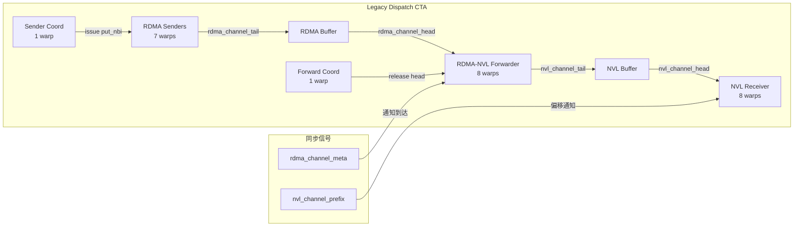
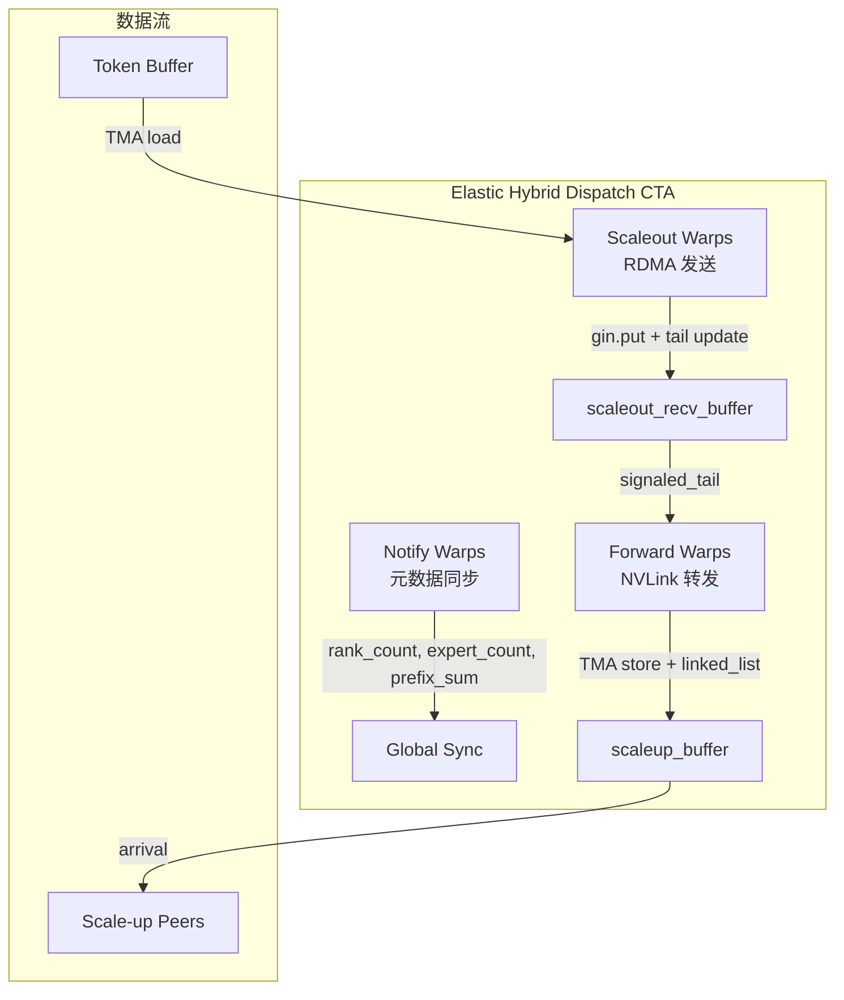
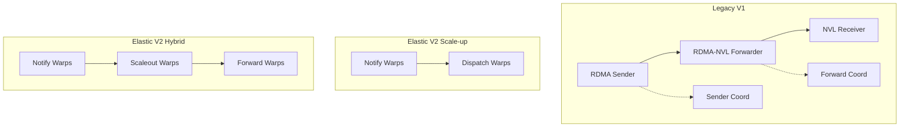

# DeepEP Warp Specialization 深度分析: 博客描述 vs 源码实现

> 分析日期: 2026-07-30
> 目标: 逐层剖析博客 Section 5 的 "Send → Forward → Receive" 三阶段描述，对照 Legacy (V1) 和 Elastic (V2) 两代实现，评估其准确性

---

## 1. 核心结论 (TL;DR)

**博客描述的 "Send → Forward → Receive" 是 DeepEP Warp Specialization 的抽象原型，但存在关键简化：**

| 维度 | 博客描述 | Legacy (V1) 实际 | Elastic V2 实际 |
|------|---------|-----------------|----------------|
| **Warp 角色数** | 3 (Send/Forward/Receive) | **5** (含 Coordinator) | **3** (Notify/Scaleout/Forward) |
| **流水线** | Send → Forward → Receive | Send → Coordinator → Forward → Coordinator → Receive | Notify → Scaleout Send → Forward |
| **Coordinator** | 未提及 | **显式存在** (关键!) | 隐式 (Notify 部分承担) |
| **元数据阶段** | 未提及 | 隐含在 SM0 | **独立 Notify Warps** |
| **方向** | 仅 Dispatch | Dispatch + Combine 双向 | Dispatch + Combine 双向 |

**关键洞察**:
1. 博客描述的是 **Dispatch 方向** 的数据流，忽略了 Combine 是反向的 (NVL Send → Forward → RDMA Receive)
2. **Coordinator Warps** 是流水线中的关键角色，负责流控和同步，博客完全未提及
3. V2 Elastic 将元数据同步独立为 **Notify Warps**，这是比 V1 更清晰的 Warp Specialization 设计

---

## 2. 博客原文: Warp Specialization 描述

博客 Section 5 原文:

> **5. Warp Specialization: Pipelined Execution Inside the Communication Kernel**
>
> Warp Specialization in DeepEP is **not** about GPU role assignment or SMs dedicated to compute/communication. It is primarily used for **parallelizing different stages within the communication Kernel**.
>
> Different Warp Groups handle:
> - Warp Group A: IB Sending
> - Warp Group B: IB-NVLink Forwarding
> - Warp Group C: NVLink Receiving
>
> Forming: **Send → Forward → Receive**

博客 Section 4.2 进一步说明:

> Normal Kernel divides into three roles:
> Source GPU → IB Sending → RDMA Network → IB-to-NVLink Forwarding → NVLink Receiving → Target GPU

**分析**: 博客将 Warp Specialization 定位为通信 kernel 内部的流水线并行化，核心目的是解决 GPU-NIC 拓扑不对称问题 (GPU0 → NIC1 需要经 NVLink 转发)。

---

## 3. Legacy (V1) 实现: WarpRole 枚举

### 3.1 Dispatch WarpRole (5 种角色)

**文件**: `csrc/kernels/legacy/internode.cu` (487 行)

```cpp
enum class WarpRole {
    kRDMASender,              // RDMA 发送
    kRDMASenderCoordinator,   // RDMA 发送协调
    kRDMAAndNVLForwarder,     // RDMA-NVL 转发
    kForwarderCoordinator,    // 转发协调
    kNVLReceivers             // NVL 接收
};
```

**角色分派逻辑** (499-513 行):

```cpp
const auto role_meta = [=]() -> std::pair<WarpRole, int> {
    if (is_forwarder) {
        if (warp_id < LEGACY_NUM_MAX_NVL_PEERS) {
            return {WarpRole::kRDMAAndNVLForwarder, (warp_id + channel_id) % LEGACY_NUM_MAX_NVL_PEERS};
        } else {
            return {WarpRole::kForwarderCoordinator, warp_id - LEGACY_NUM_MAX_NVL_PEERS};
        }
    } else if (warp_id < kNumDispatchRDMASenderWarps) {
        return {WarpRole::kRDMASender, -1};
    } else if (warp_id == kNumDispatchRDMASenderWarps) {
        return {WarpRole::kRDMASenderCoordinator, -1};
    } else {
        return {WarpRole::kNVLReceivers, (warp_id + channel_id - kNumDispatchRDMASenderWarps) % LEGACY_NUM_MAX_NVL_PEERS};
    }
}();
```

**Warp 数量约束** (452 行):

```cpp
__launch_bounds__(((kNumDispatchRDMASenderWarps + 1 + LEGACY_NUM_MAX_NVL_PEERS) * 32), 1)
// 即: (7 + 1 + 8) * 32 = 512 threads per CTA
```

### 3.2 Dispatch 5 角色详解

```
┌─────────────────────────────────────────────────────────────────────────────────────────┐
│                    DeepEP Legacy Dispatch CTA (1 SM per channel)                         │
├────────────────┬─────────────────┬─────────────────────┬───────────────┬────────────────┤
│ RDMA Senders   │ Sender Coord    │ RDMA-NVL Forwarders │ Forward Coord │ NVL Receivers  │
│ (7 warps)      │ (1 warp)        │ (8 warps)           │ (1 warp)      │ (8 warps)      │
├────────────────┼─────────────────┼─────────────────────┼───────────────┼────────────────┤
│ • Token 遍历    │ • 流控窗口维护   │ • RDMA buf 消费      │ • Head 协调   │ • NVL buf 消费  │
│ • 数据打包      │ • Issue put_nbi │ • NVL buf 生产       │ • RDMA release│ • 数据解包      │
│ • RDMA buf 生产 │ • Tail 同步     │ • TMA load/store    │ • 流控        │ • TopK 写入     │
│ • 窗口流控      │                 │ • Round-robin       │               │ • TMA store     │
└────────────────┴─────────────────┴─────────────────────┴───────────────┴────────────────┘
         │                 │               │                   │              │
         └────── Producer ─┘               └───── Producer ────┘              │
                (RDMA buffer)                  (NVL buffer)                   │
                                     Consumer ─────────────────────────────────┘
```

### 3.3 Combine WarpRole (4 种角色)

**文件**: `csrc/kernels/legacy/internode.cu` (1746 行)

```cpp
enum class WarpRole {
    kNVLSender,          // NVL 发送
    kNVLAndRDMAForwarder, // NVL-RDMA 转发
    kRDMAReceiver,       // RDMA 接收
    kCoordinator         // 协调
};
```

**Combine 是 Dispatch 的反向**:

```
Dispatch: RDMA Send → Forward → NVL Receive
Combine:  NVL Send → Forward → RDMA Receive
```

---

## 4. 转发机制: 代码级分析

### 4.1 RDMA→NVL 转发 (kRDMAAndNVLForwarder)

**文件**: `csrc/kernels/legacy/internode.cu` (849-1013 行)

```cpp
} else if (warp_role == WarpRole::kRDMAAndNVLForwarder) {
    // RDMA consumers and NVL producers
    const auto dst_nvl_rank = target_rank;

    // 1. 等待 RDMA 元数据到达
    int num_tokens_to_recv_from_rdma = 0, src_rdma_channel_prefix = 0;
    if (lane_id < kNumRDMARanks) {
        while (true) {
            auto meta_0 = ld_volatile_global(rdma_channel_meta.recv_buffer(lane_id) + dst_nvl_rank);
            auto meta_1 = ld_volatile_global(rdma_channel_meta.recv_buffer(lane_id) + LEGACY_NUM_MAX_NVL_PEERS + dst_nvl_rank);
            // ... 等待 4 个 meta 都为负值 (编码后的计数)
            if (meta_0 < 0 and meta_1 < 0 and meta_2 < 0 and meta_3 < 0) {
                int start_sum = -meta_0 - 1, end_sum = -meta_1 - 1;
                st_relaxed_sys_global(nvl_channel_prefix_start.buffer() + lane_id, -start_sum - 1);
                st_relaxed_sys_global(nvl_channel_prefix_end.buffer() + lane_id, -end_sum - 1);
                break;
            }
        }
    }

    // 2. Round-robin 从各 RDMA rank 取数据转发
    int src_rdma_rank = sm_id % kNumRDMARanks;
    while (__any_sync(0xffffffff, num_tokens_to_recv_from_rdma > 0)) {
        // 轮询找下一个有数据的 RDMA rank
        src_rdma_rank = (src_rdma_rank + 1) % kNumRDMARanks;
        if (__shfl_sync(0xffffffff, num_tokens_to_recv_from_rdma, src_rdma_rank) > 0) { ... }

        // 3. 从 RDMA buffer 读取并写入 NVL buffer
        for (int i = src_rdma_head; i < src_rdma_tail; ++i) {
            auto rdma_slot_idx = i % num_max_rdma_chunked_recv_tokens;
            auto shifted = rdma_channel_data.recv_buffer(src_rdma_rank) + rdma_slot_idx * num_bytes_per_token;
            auto src_meta = ld_nc_global(reinterpret_cast<SourceMeta*>(shifted + hidden_bytes + scale_bytes));

            // 检查是否属于目标 NVL rank
            if (not src_meta.is_token_in_nvl_rank(dst_nvl_rank))
                continue;

            // 4. TMA load from RDMA buffer, TMA store to NVL buffer
            int dst_slot_idx = (cached_nvl_channel_tail++) % num_max_nvl_chunked_recv_tokens;
            auto dst_shifted = nvl_channel_x.buffer() + dst_slot_idx * num_bytes_per_token;

            if (elect_one_sync()) {
                tma_load_1d(tma_buffer, shifted, tma_mbarrier, num_bytes_per_token, false);
                mbarrier_arrive_and_expect_tx(tma_mbarrier, num_bytes_per_token);
            }
            __syncwarp();
            mbarrier_wait(tma_mbarrier, tma_phase);
            if (elect_one_sync())
                tma_store_1d(tma_buffer, dst_shifted, num_bytes_per_token);
        }
    }
}
```

**转发核心逻辑**:

```
RDMA Buffer (per rank) → TMA Load → Shared Memory → TMA Store → NVL Buffer (per rank)
                                ↓
                       检查 SourceMeta.is_token_in_nvl_rank(dst_nvl_rank)
                       只转发属于本 NVL rank 的 tokens
```

### 4.2 Coordinator 的关键作用

**kForwarderCoordinator** (1019-1060 行):

```cpp
} else if (warp_role == WarpRole::kForwarderCoordinator) {
    // Forward warp coordinator
    if (target_rank > 0) return;  // 只有第一个 forwarder SM 的 coordinator 工作

    // 清理共享内存
    for (int i = lane_id; i < kNumRDMARanks * LEGACY_NUM_MAX_NVL_PEERS; i += 32)
        forward_channel_head[i % LEGACY_NUM_MAX_NVL_PEERS][i / LEGACY_NUM_MAX_NVL_PEERS] = 0;
    sync_forwarder_smem();

    while (true) {
        // 找所有 forwarder 的最小 head
        int min_head = std::numeric_limits<int>::max();
        for (int i = 0; i < LEGACY_NUM_MAX_NVL_PEERS; ++i)
            if (not forward_channel_retired[i])
                min_head = min(min_head, forward_channel_head[i][target_rdma]);

        // 更新远端 RDMA head (释放 RDMA buffer 空间)
        if (min_head >= last_head + num_max_rdma_chunked_send_tokens and lane_id < kNumRDMARanks) {
            nvshmemi_ibgda_amo_nonfetch_add(rdma_channel_head.buffer(rdma_rank),
                                            min_head - last_head,
                                            translate_dst_rdma_rank<kLowLatencyMode>(lane_id, nvl_rank),
                                            channel_id + num_channels,
                                            lane_id == rdma_rank);
            last_head = min_head;
        }
        __nanosleep(LEGACY_NUM_WAIT_NANOSECONDS);  // 让出 SM 给其他 warps
    }
}
```

**Coordinator 的核心职责**:
1. **Head 协调**: 收集所有 forwarder 的进度，取最小值
2. **RDMA 空间释放**: 通知远端 RDMA head 更新，释放已消费的 buffer 槽位
3. **流控**: 防止 RDMA buffer 溢出

---

## 5. Elastic V2 实现: Warp 角色

### 5.1 Scale-up Only 模式 (dispatch.cuh)

**文件**: `deep_ep/include/deep_ep/impls/dispatch.cuh`

```cpp
// 21-29 行: 模板参数定义
template <bool kIsScaleupNVLink,
          bool kDoCPUSync,
          bool kReuseSlotIndices,
          int kNumSMs,
          int kNumNotifyWarps, int kNumDispatchWarps,  // ← 两种 warp 角色
          int kNumRanks, ...>
__global__ void __launch_bounds__(kNumThreads, 1)
dispatch_impl(...) {
    // 79 行: warp 分派
    if (warp_idx < kNumNotifyWarps) {
        // ====== Notify Warps ======
        // 1. atomicAdd 统计 expert_count / rank_count
        // 2. full-grid reduction
        // 3. 写入 peer 的 rank_expert_count
        // 4. 计算 prefix sum
        // 5. 写入 host workspace
    } else {
        // ====== Dispatch Warps ======
        // 1. TMA load token from global memory
        // 2. TMA store to send buffer
        // 3. NVLink store (tma_store_1d to sym_ptr)
        // 4. RDMA put (gin.put, 若非 NVLink 可达)
    }
}
```

**Scale-up Only Warp 角色**:

```
┌───────────────────────────────────────────────────────────────┐
│              DeepEP Scale-up Only CTA                          │
├────────────────────────────┬──────────────────────────────────┤
│ Notify Warps               │ Dispatch Warps                   │
│ (warp_idx < kNumNotifyWarps)│ (warp_idx >= kNumNotifyWarps)    │
├────────────────────────────┼────────────────────────────────┤
│ • Expert/Rank 计数          │ • TMA Load tokens              │
│ • Prefix sum 计算           │ • TMA Store to send buffer     │
│ • Peer 元数据同步           │ • NVLink Store (对称内存)       │
│ • Host workspace 写入       │ • RDMA Put (若非 NVLink 可达)   │
└────────────────────────────┴────────────────────────────────┘
```

**注意**: Scale-up Only 模式下**没有 Forward warps**，因为所有 GPU 通过 NVLink 直接可达。

### 5.2 Hybrid 模式 (hybrid_dispatch.cuh) — 三种角色

**文件**: `deep_ep/include/deep_ep/impls/hybrid_dispatch.cuh`

```cpp
// 16-32 行: 模板参数定义**三种**数据路径 warp 角色
template <bool kDoCPUSync,
          bool kReuseSlotIndices,
          int kNumSMs,
          int kNumNotifyWarps, int kNumScaleoutWarps, int kNumForwardWarps,  // ← 三种!
          int kNumScaleoutRanks, int kNumScaleupRanks,
          ...>
__global__ void __launch_bounds__(kNumThreads, 1)
hybrid_dispatch_impl(...) {
```

**线程配置** (29-32 行):

```cpp
int kNumNotifyThreads = kNumNotifyWarps * 32,
int kNumScaleoutSendThreads = kNumScaleoutWarps * 32,
int kNumForwardThreads = kNumForwardWarps * 32,
int kNumThreads = kNumNotifyThreads + kNumScaleoutSendThreads + kNumForwardThreads
```

**Warp 分派** (107-158, 329-464, 465-659 行):

```cpp
if (warp_idx < kNumNotifyWarps) {
    // ====== Notify Warps ======
    // 功能: 元数据收集与同步
    // 1. atomicAdd 统计 expert_count / rank_count
    // 2. full-grid reduction
    // 3. 写入 scale-out peers 的 rank_expert_count (RDMA)
    // 4. 写入 scale-up peers 的 rank_expert_count (NVLink)
    // 5. 计算 prefix sum

} else if (warp_idx < kNumNotifyWarps + kNumScaleoutWarps) {
    // ====== Scaleout Warps (IBGDA/RDMA Sending) ======
    // 功能: 跨节点数据发送
    for (int token_idx = channel_idx; token_idx < num_tokens; token_idx += kNumChannels) {
        // TMA load token
        // TMA store to scaleout_send_buffer
        gin.put<ncclTeamTagRail>(..., stored_dst_scaleout_rank_idx);  // IBGDA!
        // Issue scale-out tail update
    }

} else {
    // ====== Forward Warps (NVLink Forwarding) ======
    // 功能: 从 scale-out 接收 buffer 转发到 scale-up 目标
    const int forward_warp_idx = warp_idx - (kNumNotifyWarps + kNumScaleoutWarps);
    // ...
    // Forward tokens from scale-out ranks
    for (int slot_idx = start_slot_idx; slot_idx < end_slot_idx; ++slot_idx) {
        const auto token_buffer = recv_buffer.get_token_buffer(slot_idx);
        // TMA load into shared memory
        // TMA store to scaleup_buffer (NVLink sym_ptr)
    }
}
```

**Hybrid Dispatch Warp 角色完整视图**:

```
┌─────────────────────────────────────────────────────────────────────────────────┐
│                    DeepEP Hybrid Dispatch CTA                                    │
├──────────────────┬──────────────────────────┬───────────────────────────────────┤
│ Notify Warps     │ Scaleout Warps           │ Forward Warps                     │
│ (元数据同步)      │ (IBGDA/RDMA 跨节点发送)   │ (NVLink 节点内转发)                │
├──────────────────┼──────────────────────────┼─────────────────────────────────┤
│ • Expert 计数     │ • Token TMA Load         │ • 从 scaleout_recv 读取           │
│ • Rank 计数       │ • Send buffer 写入        │ • TMA Load → smem                 │
│ • Prefix sum     │ • IBGDA put (RDMA)       │ • TMA Store → scaleup_buffer     │
│ • Peer 元数据同步  │ • Tail update            │ • 按 scale-up rank 分发            │
│ • Grid sync      │ • Channel 流控            │ • Linked list 索引维护             │
└──────────────────┴──────────────────────────┴─────────────────────────────────┘
```

---

## 6. Hybrid Combine Warp 角色

**文件**: `deep_ep/include/deep_ep/impls/hybrid_combine.cuh`

```cpp
// 25 行: 两种 warp 角色
int kNumWarps = kNumScaleupWarps + kNumForwardWarps;

// 106 行: warp 分派
if (warp_idx < kNumScaleupWarps) {
    // ====== Scaleup Warps (节点内发送) ======
    // 功能: 从本地 buffer 发送到 scale-up peers
    // 241 行: TMA load from global memory
    // 328 行: TMA store to remote scale-up buffer
    // 127 行: update_tails (通知 forward warps)

} else {
    // ====== Forward Warps (节点间转发) ======
    // 功能: 从 scale-up buffer 转发到 scale-out peers
    const auto forward_warp_idx = warp_idx - kNumScaleupWarps;
    // 467 行: TMA load from scaleup_buffer
    // 477 行: TMA store to scaleout_send_buffer
    // 484 行: gin.put<ncclTeamTagRail> (RDMA)
}
```

**寄存器重分配** (101-103 行):

```cpp
const bool kAdjustRegisters = (kNumChannelsPerSM == 4 or kNumChannelsPerSM == 8) and not kUseExpandedLayout;
constexpr int kNumRegistersForScaleupWarps = 40;      // 少
constexpr int kNumRegistersForForwardWarps = 256 - kNumRegistersForScaleupWarps;  // 多 (216)
```

**注意**: Hybrid Combine 的 "Forward" 是**反向**的 — 从 scale-up 节点内转发到 scale-out 跨节点，与 Dispatch 的 Forward 方向相反。

---

## 7. Producer-Consumer 关系

### 7.1 Legacy Dispatch 流水线

```
┌──────────────────────────────────────────────────────────────────────────────────────────┐
│                          Legacy Dispatch Pipeline                                         │
│                                                                                          │
│  ┌──────────────┐    RDMA Buffer    ┌──────────────────┐    NVL Buffer    ┌────────────┐│
│  │ RDMA Senders │ ───────────────→  │ RDMA-NVL Forwarder│ ──────────────→  │ NVL Receiver││
│  │ (Producer)   │   (per rank)      │ (Consumer/Prod)   │  (per rank)      │ (Consumer)  ││
│  └──────────────┘                   └──────────────────┘                  └────────────┘│
│         ↑                               ↑                                     ↑        │
│         │                               │                                     │        │
│  ┌──────────────┐                ┌──────────────┐                      ┌────────────┐  │
│  │ Sender Coord │                │ Forward Coord│                      │ (implicit) │  │
│  │ (流控/Issue) │                │ (Head 协调)  │                      │            │  │
│  └──────────────┘                └──────────────┘                      └────────────┘  │
└──────────────────────────────────────────────────────────────────────────────────────────┘
```

**同步机制**:
- **RDMA Buffer**: `rdma_channel_tail` (生产者写), `rdma_channel_head` (消费者读, Coordinator 释放)
- **NVL Buffer**: `nvl_channel_tail` (Forwarder 写), `nvl_channel_head` (Receiver 读)
- **元数据**: `rdma_channel_meta` (Sender 写, Forwarder 读), `nvl_channel_prefix_start/end` (Forwarder 写, Receiver 读)

### 7.2 Elastic Hybrid Dispatch 流水线

```
┌──────────────────────────────────────────────────────────────────────────────────────────┐
│                       Elastic Hybrid Dispatch Pipeline                                    │
│                                                                                          │
│  ┌────────────┐                                                    ┌─────────────────┐  │
│  │ Notify     │ ──────────────────────────────────────────────────→ │ (Barrier/Sync)  │  │
│  │ Warps      │  (元数据: rank_count, expert_count, prefix sum)     │                 │  │
│  └────────────┘                                                    └─────────────────┘  │
│                                                                                          │
│  ┌────────────────┐   scaleout_send_buffer   ┌─────────────────┐   scaleup_buffer  ┌────┐│
│  │ Scaleout Warps │ ──────────────────────→  │  Forward Warps   │ ───────────────→ │Done││
│  │ (RDMA Producer)│   (per channel)          │ (NVL Producer)   │  (per rank)       │    ││
│  └────────────────┘                          └─────────────────┘                   └────┘│
│         ↑                                          ↑                                    │
│         │                                          │                                    │
│  ┌────────────────┐                        ┌─────────────────┐                          │
│  │ scaleout_tail  │                        │  scaleup_tail   │                          │
│  │ (signaled)     │                        │  (linked list)  │                          │
│  └────────────────┘                        └─────────────────┘                          │
└──────────────────────────────────────────────────────────────────────────────────────────┘
```

**同步机制**:
- **Scaleout Channel**: `scaleout_channel_signaled_tail` (Scaleout Warp 写, Forward Warp 读)
- **Scaleup Channel**: `channel_scaleup_tail` (Forward Warp 写, 通知 Combine Scaleup Warp)
- **Linked List**: Forward Warp 维护 per-rank 的 linked list 索引，Combine 按 list 消费

### 7.3 数据传递代码证据

**Legacy: Forwarder 读取 RDMA meta** (857-897 行):

```cpp
if (lane_id < kNumRDMARanks) {
    while (true) {
        auto meta_0 = ld_volatile_global(rdma_channel_meta.recv_buffer(lane_id) + dst_nvl_rank);
        auto meta_1 = ld_volatile_global(rdma_channel_meta.recv_buffer(lane_id) + LEGACY_NUM_MAX_NVL_PEERS + dst_nvl_rank);
        auto meta_2 = ld_volatile_global(rdma_channel_meta.recv_buffer(lane_id) + LEGACY_NUM_MAX_NVL_PEERS * 2);
        auto meta_3 = ld_volatile_global(rdma_channel_meta.recv_buffer(lane_id) + LEGACY_NUM_MAX_NVL_PEERS * 2 + 1);
        if (meta_0 < 0 and meta_1 < 0 and meta_2 < 0 and meta_3 < 0) {
            // 解码: -value - 1 编码
            int start_sum = -meta_0 - 1, end_sum = -meta_1 - 1;
            st_relaxed_sys_global(nvl_channel_prefix_start.buffer() + lane_id, -start_sum - 1);
            st_relaxed_sys_global(nvl_channel_prefix_end.buffer() + lane_id, -end_sum - 1);
            break;
        }
    }
}
```

**Legacy: Forwarder 写入 NVL buffer** (982-994 行):

```cpp
int dst_slot_idx = (cached_nvl_channel_tail++) % num_max_nvl_chunked_recv_tokens;
auto dst_shifted = nvl_channel_x.buffer() + dst_slot_idx * num_bytes_per_token;

if (elect_one_sync()) {
    tma_load_1d(tma_buffer, shifted, tma_mbarrier, num_bytes_per_token, false);
    mbarrier_arrive_and_expect_tx(tma_mbarrier, num_bytes_per_token);
}
__syncwarp();
mbarrier_wait(tma_mbarrier, tma_phase);
if (elect_one_sync())
    tma_store_1d(tma_buffer, dst_shifted, num_bytes_per_token);
```

**Elastic: Scaleout Warp 发送** (448-455 行):

```cpp
// Issue IBGDA requests
if (stored_dst_slot_idx >= 0 and stored_dst_scaleout_rank_idx != scaleout_rank_idx) {
    gin.put<ncclTeamTagRail>(
            scaleout_recv_buffer.get_token_buffer(stored_dst_slot_idx).get_base_ptr(),
            scaleout_send_buffer.get_token_buffer(token_idx).get_base_ptr(),
            tma_buffer.get_num_bytes<false>(),
            stored_dst_scaleout_rank_idx,
            ncclGinOptFlagsAggregateRequests);
}
```

**Elastic: Forward Warp 转发** (546-597 行):

```cpp
// TMA load into shared memory
if (ptx::elect_one_sync()) {
    ptx::tma_load_1d(tma_buffer.get_base_ptr(), token_buffer.get_base_ptr(),
                     mbarrier_ptr, token_layout.get_num_bytes<false>());
    ptx::mbarrier_arrive_and_set_tx(mbarrier_ptr, token_layout.get_num_bytes<false>());
    ptx::mbarrier_wait_and_flip_phase(mbarrier_ptr, phase);
}

// Issue TMAs to scale-up buffer (NVLink)
if (stored_dst_slot_idx >= 0) {
    const auto dst_ptr = gin.get_sym_ptr<ncclTeamTagLsa>(
        scaleup_buffer.get_token_buffer(stored_dst_slot_idx).get_base_ptr(),
        stored_dst_scaleup_rank_idx);
    ptx::tma_store_1d(dst_ptr, tma_buffer.get_base_ptr(), tma_buffer.get_num_bytes<false>());
    ptx::tma_store_commit();
}
```

---

## 8. 准确性评估

### 8.1 博客描述准确的部分

| 博客描述 | 源码验证 | 结论 |
|---------|---------|------|
| "不是 GPU role 分配" | Warp Specialization 确实在 kernel 内部 | **准确** |
| "是通信 kernel 内部并行化" | 同一 CTA 内不同 warp 承担不同阶段 | **准确** |
| "Send → Forward → Receive" | Dispatch 方向确实如此 | **准确 (Dispatch)** |
| "解决 GPU-NIC 拓扑不对称" | Forwarder 角色存在原因 | **准确** |
| "IB Sending / IB-NVLink Forwarding / NVLink Receiving" | 与 kRDMASender / kRDMAAndNVLForwarder / kNVLReceivers 对应 | **准确** |

### 8.2 博客遗漏/简化的部分

| 遗漏项 | 源码证据 | 重要性 |
|--------|---------|--------|
| **Coordinator Warps** | kRDMASenderCoordinator, kForwarderCoordinator | **高** — 流控核心 |
| **元数据阶段** | Notify Warps (V2) / SM0 metadata (V1) | **高** — 正确性前提 |
| **Combine 反向流水线** | kNVLSender / kNVLAndRDMAForwarder / kRDMAReceiver | **中** — 完整性 |
| **Round-robin 调度** | Forwarder 轮询各 RDMA rank | **中** — 负载均衡 |
| **TMA + mbarrier 同步** | 生产者-消费者使用 TMA store/load | **中** — 实现细节 |
| **V2 Elastic 3 角色** | Notify / Scaleout / Forward | **高** — 最新架构 |
| **寄存器重分配** | warpgroup_reg_dealloc/alloc | **低** — 性能优化 |

### 8.3 博客不准确的表述

1. **"Warp Group A: IB Sending"** — 实际是 `kNumDispatchRDMASenderWarps = 7` 个 warps，不是单个 Group
2. **"Warp Group B: IB-NVLink Forwarding"** — 实际是 `LEGACY_NUM_MAX_NVL_PEERS = 8` 个 warps
3. **"Warp Group C: NVLink Receiving"** — 同样是 8 个 warps
4. **未区分 Dispatch/Combine** — Combine 是反向的 NVL Send → Forward → RDMA Receive
5. **未提及 V2 Elastic** — Notify Warps 是 V2 的核心创新

---

## 9. 三代 Warp Specialization 对比

### 9.1 Legacy V1 (internode.cu)

```
┌─────────────────────────────────────────────────────────────────────────────┐
│ Legacy Dispatch (5 roles)                                                   │
├─────────────┬──────────────┬────────────────┬──────────────┬────────────────┤
│ RDMA Sender │ Sender Coord │ RDMA-NVL Fwd   │ Forward Coord│ NVL Receiver   │
│ 7 warps     │ 1 warp       │ 8 warps        │ 1 warp       │ 8 warps        │
├─────────────┴──────────────┴────────────────┴──────────────┴────────────────┤
│ 同步: rdma_channel_tail/head, nvl_channel_tail/head, rdma_channel_meta     │
│ 特点: 显式 Coordinator, 基于 nvshmem put_nbi, 共享内存 barrier.sync         │
└─────────────────────────────────────────────────────────────────────────────┘
```

### 9.2 Elastic V2 Scale-up Only (dispatch.cuh)

```
┌─────────────────────────────────────────────────────────────────────────────┐
│ Elastic Scale-up Dispatch (2 roles)                                         │
├────────────────────────────┬────────────────────────────────────────────────┤
│ Notify Warps               │ Dispatch Warps                                 │
│ (元数据 + 同步)             │ (数据搬运)                                      │
├────────────────────────────┴────────────────────────────────────────────────┤
│ 同步: gpu_barrier, NCCL Gin, tma_store_wait                                │
│ 特点: 无 Forward (全 NVLink 直达), Notify 独立化, TMA load/store            │
└─────────────────────────────────────────────────────────────────────────────┘
```

### 9.3 Elastic V2 Hybrid (hybrid_dispatch.cuh)

```
┌─────────────────────────────────────────────────────────────────────────────┐
│ Elastic Hybrid Dispatch (3 roles)                                           │
├────────────────┬─────────────────────────┬──────────────────────────────────┤
│ Notify Warps   │ Scaleout Warps          │ Forward Warps                    │
│ (元数据同步)    │ (RDMA 跨节点发送)         │ (NVLink 节点内转发)               │
├────────────────┴─────────────────────────┴──────────────────────────────────┤
│ 同步: scaleout_channel_signaled_tail, channel_scaleup_tail, linked list     │
│ 特点: 3 角色, 显式 Notify, Round-robin 调度, 寄存器重分配 (Combine)          │
└─────────────────────────────────────────────────────────────────────────────┘
```

---

## 10. Mermaid 流水线图

### 10.1 Legacy Dispatch Warp Pipeline



### 10.2 Elastic Hybrid Dispatch Warp Pipeline



### 10.3 三代对比图



---

## 11. 关键代码索引

| 文件 | 行号 | 内容 |
|------|------|------|
| `csrc/kernels/legacy/internode.cu` | 487 | Dispatch WarpRole 枚举 (5 角色) |
| `csrc/kernels/legacy/internode.cu` | 499-513 | Dispatch warp 分派逻辑 |
| `csrc/kernels/legacy/internode.cu` | 587-757 | kRDMASender 逻辑 |
| `csrc/kernels/legacy/internode.cu` | 758-848 | kRDMASenderCoordinator 逻辑 |
| `csrc/kernels/legacy/internode.cu` | 849-1013 | kRDMAAndNVLForwarder 逻辑 (核心转发) |
| `csrc/kernels/legacy/internode.cu` | 1019-1060 | kForwarderCoordinator 逻辑 |
| `csrc/kernels/legacy/internode.cu` | 1061-1196 | kNVLReceivers 逻辑 |
| `csrc/kernels/legacy/internode.cu` | 1746 | Combine WarpRole 枚举 (4 角色) |
| `deep_ep/include/deep_ep/impls/dispatch.cuh` | 21-30 | V2 Scale-up 模板参数 |
| `deep_ep/include/deep_ep/impls/dispatch.cuh` | 79-395 | V2 Scale-up warp 分派 (Notify/Dispatch) |
| `deep_ep/include/deep_ep/impls/hybrid_dispatch.cuh` | 16-32 | V2 Hybrid 模板参数 (3 角色) |
| `deep_ep/include/deep_ep/impls/hybrid_dispatch.cuh` | 107-158 | Notify warps |
| `deep_ep/include/deep_ep/impls/hybrid_dispatch.cuh` | 329-464 | Scaleout warps |
| `deep_ep/include/deep_ep/impls/hybrid_dispatch.cuh` | 465-659 | Forward warps |
| `deep_ep/include/deep_ep/impls/hybrid_combine.cuh` | 25 | Combine warp 配置 (Scaleup + Forward) |
| `deep_ep/include/deep_ep/impls/hybrid_combine.cuh` | 101-103 | 寄存器重分配 |
| `deep_ep/include/deep_ep/common/comm.cuh` | 56-86 | get_qp_mode (warp-level QP 分配) |

---

## 12. 总结

### 12.1 博客评价

**博客的 "Send → Forward → Receive" 描述是 DeepEP Warp Specialization 的有效抽象**，但存在以下局限:

1. **角色数量**: 博客说 3，实际 Legacy 有 5 种 (含 2 种 Coordinator)
2. **Coordinator 遗漏**: Coordinator 是流控核心，博客完全未提及
3. **方向性**: 只描述了 Dispatch 方向，未提 Combine 反向
4. **版本差异**: 未区分 Legacy (V1) 和 Elastic (V2) 的实现差异
5. **元数据阶段**: 未提及 Notify Warps (V2) 或 SM0 metadata (V1)

### 12.2 架构洞察

**Warp Specialization 的本质是 "通信 kernel 内部的流水线并行"**:

1. **解耦计算与通信阶段**: 不同 warp 专注于不同阶段，避免同步等待
2. **隐藏延迟**: Sender 提前打包，Forwarder 异步转发，Receiver 独立消费
3. **动态负载均衡**: Round-robin 调度 + Coordinator 协调
4. **流控分离**: Coordinator 独立管理 buffer 空间释放

**V1 → V2 演化趋势**:
- V1: 隐式元数据 (SM0)，显式 Coordinator
- V2: 显式 Notify Warps，Coordinator 功能分散到 Notify + Barrier
- V2: 更清晰的职责分离，更好的可扩展性

---

## 附录: 文件路径汇总

| 文件 | 作用 |
|------|------|
| `DeepEP/csrc/kernels/legacy/internode.cu` | Legacy Dispatch/Combine kernel |
| `DeepEP/csrc/kernels/legacy/intranode.cu` | Legacy Intra-node kernel |
| `DeepEP/deep_ep/include/deep_ep/impls/dispatch.cuh` | V2 Elastic Scale-up Dispatch |
| `DeepEP/deep_ep/include/deep_ep/impls/combine.cuh` | V2 Elastic Combine |
| `DeepEP/deep_ep/include/deep_ep/impls/hybrid_dispatch.cuh` | V2 Elastic Hybrid Dispatch |
| `DeepEP/deep_ep/include/deep_ep/impls/hybrid_combine.cuh` | V2 Elastic Hybrid Combine |
| `DeepEP/deep_ep/include/deep_ep/common/comm.cuh` | Warp-level 通信原语 |
| `DeepEP/deep_ep/include/deep_ep/common/ptx.cuh` | PTX 原语 (TMA, mbarrier) |
