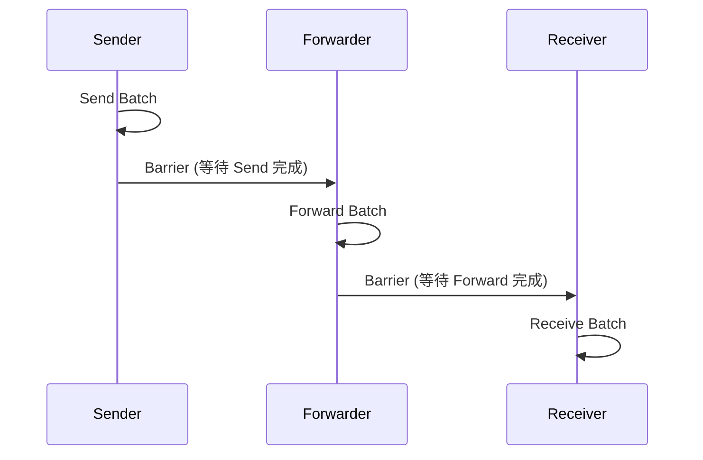
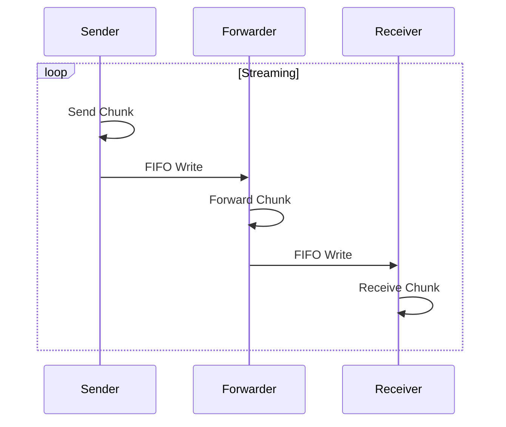
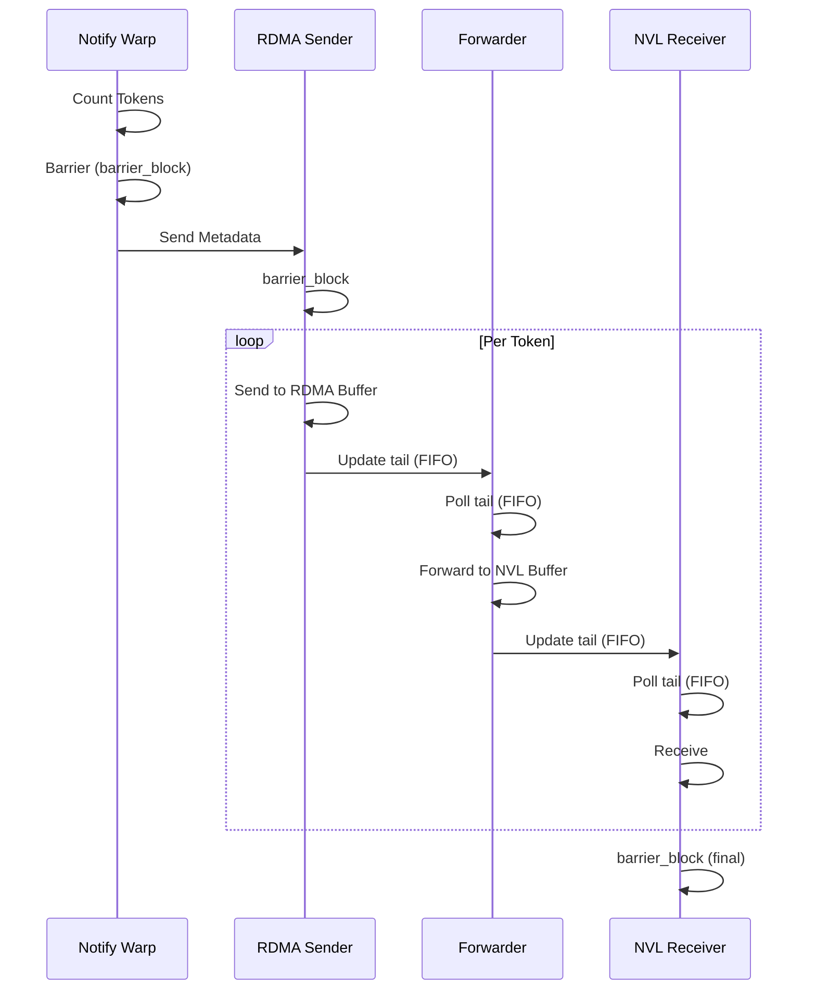
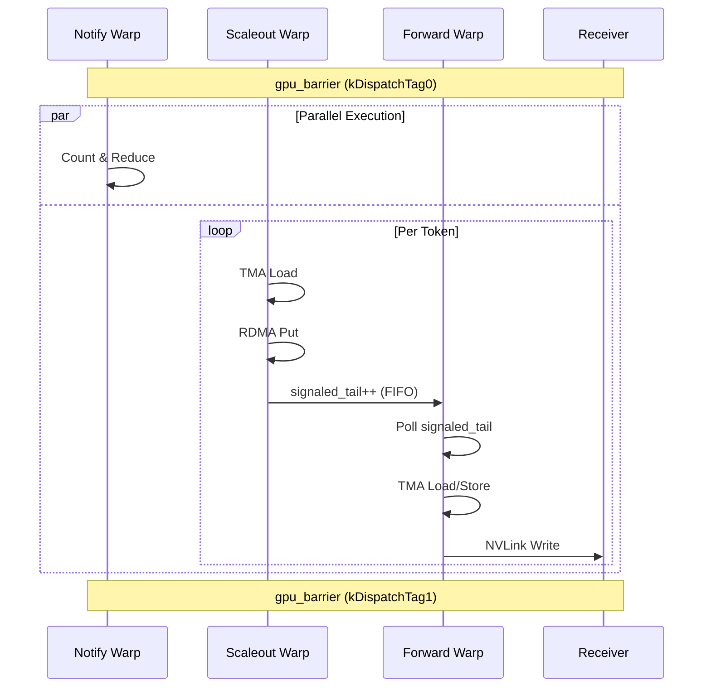

# 07 - DeepEP FIFO/Streaming Pipeline 机制深度分析: Blog 论述 vs 源码实现

> 分析目标: 对比 Blog《DeepEP's First Principles》第 6 节 "FIFO: From Synchronous to Streaming Pipeline" 的论述与 DeepEP 源码的实际同步机制,验证其准确性。

---

## 1. Blog 核心论述

Blog 第 6 节提出了以下核心观点:

> **Without FIFO**: 前一阶段完成前, 下一阶段必须等待:
> ```
> Send → Barrier → Forward → Barrier → Receive
> ```
> 效率低下。
>
> **With FIFO**: 每个阶段只关心自己的写入/读取:
> ```
> Send → FIFO → Forward → FIFO → Receive
> ```
> 无需等待整个 Batch。
>
> **FIFO 的本质**: 将通信流水线从同步执行转变为流式执行(streaming execution)。

**Blog 的关键主张**:
1. FIFO 解耦了通信阶段,使流水线从同步变为流式
2. 每个阶段独立读写,无需等待整个 Batch 完成
3. 这种转变是 DeepEP 高吞吐的关键

---

## 2. Legacy 内核同步模式 (internode.cu)

### 2.1 架构概述

Legacy 内核 (`csrc/kernels/legacy/internode.cu`) 使用 **Warp Specialization** 将通信分为三类角色:

```cpp
enum class WarpRole {
    kRDMASender,           // RDMA 发送
    kRDMASenderCoordinator,// RDMA 发送协调
    kRDMAAndNVLForwarder,  // RDMA-NVL 转发
    kForwarderCoordinator, // 转发协调
    kNVLReceivers          // NVL 接收
};
```

### 2.2 同步原语: barrier_block

Legacy 使用 **barrier_block** 进行跨阶段同步 (`utils.cuh:515`):

```cpp
template <int kNumRanks, bool kSyncOnly = false>
__forceinline__ __device__ void barrier_block(int** barrier_signal_ptrs, int rank) {
    // 1. 内存 fence + block 同步
    if constexpr (not kSyncOnly) {
        memory_fence();          // fence.acq_rel.sys
        __syncthreads();         // block 级同步
    }

    // 2. 原子操作: 通知其他 rank, 减去自己的信号
    if (thread_id < kNumRanks) {
        atomicAdd_system(barrier_signal_ptrs[rank] + thread_id, LEGACY_FINISHED_SUM_TAG);
        atomicSub_system(barrier_signal_ptrs[thread_id] + rank, LEGACY_FINISHED_SUM_TAG);
    }

    // 3. 轮询等待所有 rank 完成
    while (true) {
        auto value = ld_volatile_global(barrier_signal_ptrs[rank] + thread_id);
        if (__all_sync(0xffffffff, value <= 0))
            break;  // 所有 rank 完成
        // timeout 检查...
    }
    __syncthreads();
}
```

**关键观察**: 这是典型的 **Barrier 同步**, 不是 FIFO!

### 2.3 notify_dispatch 中的同步流程

```cpp
// 1. 等待所有之前的 RDMA 操作完成
for (int i = thread_id; i < qps_per_rdma_rank * (kNumRDMARanks - 1); ++i)
    nvshmemi_ibgda_quiet(dst_rdma_rank, qp_id);
__syncthreads();

// 2. 跨节点 barrier
if (thread_id == 32)
    nvshmem_sync_with_same_gpu_idx(rdma_team);

// 3. 节点内 barrier
barrier_block<LEGACY_NUM_MAX_NVL_PEERS, true>(barrier_signal_ptrs, nvl_rank);

// ... 执行发送 ...

// 4. 再次 barrier
if (thread_id == 0)
    nvshmem_sync_with_same_gpu_idx(rdma_team);
__syncthreads();

// ... NVL 操作 ...

// 5. 最终 barrier
if (thread_id == 32)
    nvshmem_sync_with_same_gpu_idx(rdma_team);
barrier_block<LEGACY_NUM_MAX_NVL_PEERS>(barrier_signal_ptrs, nvl_rank);
```

**结论**: Legacy notify 阶段使用 **4 次 barrier** 分隔不同操作阶段。

### 2.4 dispatch 数据阶段的同步

dispatch 数据阶段使用 **head/tail 指针** 作为环形缓冲区:

```cpp
// RDMA sender warp: 使用 head/tail 管理发送窗口
while (is_token_in_rank_uint64 != 0 and 
       rdma_tail_idx - cached_rdma_channel_head >= num_max_rdma_chunked_recv_tokens) {
    cached_rdma_channel_head = ld_volatile_global(rdma_channel_head.buffer(lane_id));
    // timeout 检查...
}

// 发送完成后, 使用锁保护更新 tail
acquire_lock(rdma_send_channel_lock + lane_id);
auto window = rdma_send_channel_window[lane_id] | (1u << offset);
if (offset == 0) {
    auto num_empty_slots = (~window) == 0 ? 32 : __ffs(~window) - 1;
    st_release_cta(rdma_send_channel_tail + lane_id, latest_tail + num_empty_slots);
    window >>= num_empty_slots;
}
rdma_send_channel_window[lane_id] = window;
release_lock(rdma_send_channel_lock + lane_id);
```

**关键观察**: head/tail 机制确实类似 FIFO, 但这是 **生产者-消费者模式** 的环形缓冲区, 不是 Blog 描述的端到端流式流水线。

### 2.5 Forwarder 的同步模式

```cpp
// Forwarder 轮询等待 RDMA 数据
while (true) {
    src_rdma_rank = (src_rdma_rank + 1) % kNumRDMARanks;
    if (__shfl_sync(0xffffffff, num_tokens_to_recv_from_rdma, src_rdma_rank) > 0) {
        if (lane_id == src_rdma_rank and cached_rdma_channel_head == cached_rdma_channel_tail)
            cached_rdma_channel_tail = ld_acquire_sys_global(rdma_channel_tail.buffer(src_rdma_rank));
        if (__shfl_sync(0xffffffff, cached_rdma_channel_tail > cached_rdma_channel_head, src_rdma_rank))
            break;
    }
    // timeout 检查...
}
```

**关键观察**: Forwarder 使用 **轮询 tail 指针** 判断是否有新数据, 这是典型的 FIFO empty/full 检查。

---

## 3. Elastic 内核同步模式 (dispatch.cuh / hybrid_dispatch.cuh)

### 3.1 gpu_barrier: 全局跨 SM 同步

Elastic 内核 (`deep_ep/include/deep_ep/common/comm.cuh`) 使用 **gpu_barrier** 进行全局同步:

```cpp
template <bool kIsScaleupNVLink, int kNumScaleoutRanks, int kNumScaleupRanks,
          int kNumSMs, int kNumThreads, int kNumQPs,
          int64_t kNumTimeoutCycles, int kTag = kDeviceBarrierTag,
          bool kFlushStores = true, bool kSyncAtStart = true, bool kSyncAtEnd = true>
__forceinline__ __device__ void gpu_barrier(...) {
    // 1. TMA store 等待 (确保数据写入完成)
    if constexpr (kFlushStores) {
        ptx::tma_store_commit();
        ptx::tma_store_wait();
        __syncwarp();
    }

    // 2. 网格级同步 (所有 SM 等待)
    if constexpr (kSyncAtStart) {
        cooperative_groups::this_grid().sync();  // 网格级 barrier!
    }

    // 3. 执行 scaleout/scaleup barrier
    if (do_scaleup and do_scaleout) {
        // 并行执行: SM 0 做 scaleup, 其他 SM 做 scaleout
        if (sm_idx == 0) {
            scaleup_barrier_wo_local_sync(...);
            if constexpr (kFlushStores) 
                cooperative_groups::this_grid().sync();
        } else {
            scaleout_barrier_wo_local_sync(...);
        }
    }

    // 4. 最终网格级同步
    if constexpr (kSyncAtEnd)
        cooperative_groups::this_grid().sync();
}
```

**关键观察**: `cooperative_groups::this_grid().sync()` 是 **网格级 barrier**, 所有 SM 必须同步等待!

### 3.2 NVLink barrier 实现

```cpp
template <int kNumRanks, int kNumSMs, int kNumThreads, int64_t kNumTimeoutCycles, int kTag>
__forceinline__ __device__ void nvlink_barrier_wo_local_sync(...) {
    // 只使用 SM 0
    if (kNumSMs > 1 and sm_idx > 0) return;

    // 读取当前 barrier phase
    const int status = static_cast<int>((*workspace.get_nvl_barrier_counter_ptr()) & 3);
    const int phase = status & 1, sign = status >> 1;

    // 每个 thread 原子操作信号
    if (thread_idx < kNumRanks) {
        const auto dst_ptr = gin.get_sym_ptr<ncclTeamTagLsa>(
            workspace.get_nvl_barrier_signal_ptr(phase), thread_idx);
        ptx::red_add_rel_sys(dst_ptr, sign ? -1 : 1);  // 原子加减
    }
    __syncthreads();

    // 增加 phase counter
    if (thread_idx == 0)
        atomicAdd(workspace.get_nvl_barrier_counter_ptr(), 1);

    // 轮询等待信号到达目标值
    const auto target = sign ? 0 : kNumRanks;
    timeout_while<kNumTimeoutCycles>(thread_idx == 0, [=](const bool& is_last_check) {
        const auto signal = ptx::ld_acquire_sys<int>(workspace.get_nvl_barrier_signal_ptr(phase));
        if (signal == target) return true;  // barrier 完成
        // timeout 处理...
    });
}
```

**关键观察**: NVLink barrier 使用 **phase-based 原子计数 + 轮询等待**, 这是典型的 barrier 实现。

### 3.3 NCCL Gin barrier (RDMA 场景)

```cpp
template <int kNumRanks, int kNumSMs, int kNumThreads, int kNumQPs, 
          int64_t kNumTimeoutCycles, typename team_t, int kTag, bool kFlushStores>
__forceinline__ __device__ void gin_barrier_wo_local_sync(...) {
    // 1. 刷新所有 QP (确保 RDMA 操作完成)
    if constexpr (kFlushStores) {
        for (int i = global_warp_idx; i < num_qps; i += kNumSMs * kNumWarps) {
            ncclGin(nccl_dev_comm, i, NCCL_GIN_RESOURCE_SHARING_CTA).flush(ncclCoopWarp());
        }
        (gridDim.x > 1) ? cooperative_groups::this_grid().sync() : __syncthreads();
    }

    // 2. 使用 QP 0 做 barrier
    if (sm_idx == 0) {
        const auto team = (std::is_same_v<team_t, ncclTeamTagWorld>) ?
            ncclTeamWorld(nccl_dev_comm) : ncclTeamRail(nccl_dev_comm);
        const ncclGin gin(nccl_dev_comm, 0, NCCL_GIN_RESOURCE_SHARING_CTA);
        
        // 发送 signal 给所有 rank
        for (int i = thread_idx; i < kNumRanks; i += kNumThreads)
            gin.signal(team, i, ncclGin_SignalInc{static_cast<ncclGinSignal_t>(rank_idx)});

        // 等待所有 rank 的 signal
        for (int i = thread_idx; i < kNumRanks; i += kNumThreads) {
            const auto signal_idx = static_cast<ncclGinSignal_t>(i);
            const auto shadow_ptr = gin.getSignalShadowPtr(signal_idx);
            const auto target = ++(*shadow_ptr);
            const auto signal_ptr = reinterpret_cast<uint64_t*>(...);
            
            timeout_while<kNumTimeoutCycles>([=](const bool& is_last_check) {
                const auto signal = ptx::ld_acquire_sys<uint64_t>(signal_ptr);
                if (signal >= target) return true;  // signal 到达
                // timeout 处理...
            });
        }
    }
}
```

**关键观察**: NCCL barrier 使用 **signal/wait 机制**, 仍然是 barrier 语义。

### 3.4 dispatch 内核中的 barrier 使用

```cpp
// dispatch_impl 开始: 全局 barrier (kDispatchTag0)
comm::gpu_barrier<kIsScaleupNVLink, 1, kNumRanks, kNumSMs, kNumThreads, 
                  kNumQPs, kNumTimeoutCycles, comm::kDispatchTag0, 
                  false, false, true>(...);  // kSyncAtStart=true

// ... 执行 dispatch 操作 ...

// dispatch_impl 结束: 全局 barrier (kDispatchTag1)
comm::gpu_barrier<kIsScaleupNVLink, 1, kNumRanks, kNumSMs, kNumThreads, 
                  kNumQPs, kNumTimeoutCycles, comm::kDispatchTag1, 
                  true, true, false>(...);  // kFlushStores=true, kSyncAtStart=true

// 触发 copy epilogue kernel
cudaTriggerProgrammaticLaunchCompletion();
```

**关键观察**: dispatch 内核 **首尾各有一个 gpu_barrier**, 这是典型的同步执行模式!

### 3.5 hybrid_dispatch 的三阶段流水线

hybrid_dispatch 实现了真正的 **三阶段流水线**:

```cpp
// 阶段 0: Notify warps - 统计 token 数量
if (warp_idx < kNumNotifyWarps) {
    // atomic add 统计 expert_count / rank_count
    // 全局 reduction
    // 写入 scaleout rank count
}

// 阶段 1: Scaleout warps - RDMA 发送
else if (warp_idx < kNumNotifyWarps + kNumScaleoutWarps) {
    // TMA load token
    // RDMA put 到远端
    // 更新 signaled_tail
}

// 阶段 2: Forward warps - NVLink 转发
else {
    // 轮询 signaled_tail 检查新数据
    // TMA load from scaleout_recv_buffer
    // TMA store to scaleup_buffer
}
```

**关键观察**: 三阶段通过 **warp specialization** 并行执行, 但阶段间存在数据依赖:

```cpp
// Forward warp 轮询等待 scaleout 数据
while ((wip_mask = ptx::gather(
    stored_scaleout_tail_idx > stored_scaleout_old_tail_idx or stored_finish_flag == 0))) {
    
    // 等待该 rank 有数据到达 (或完成)
    comm::timeout_while<kNumTimeoutCycles>([&](const bool& is_last_check) {
        const uint32_t arrived_or_finished =
            stored_scaleout_tail_idx > stored_scaleout_old_tail_idx or stored_finish_flag > 0;
        if (ptx::exchange(arrived_or_finished, recv_scaleout_rank_idx))
            return true;  // 数据到达

        // 读取新的 signaled tails
        if (lane_idx < kNumScaleoutRanks) {
            const auto signaled_tail = ptx::ld_acquire_sys<int64_t>(
                workspace_layout.get_scaleout_channel_signaled_tail_ptr(channel_idx, lane_idx));
            math::unpack2<int, int64_t>(signaled_tail, stored_finish_flag, stored_scaleout_tail_idx);
        }
        __syncwarp();
        return false;
    });
    // ... 处理数据 ...
}
```

**关键观察**: 这是 **生产者-消费者 FIFO** 模式! Scaleout warp 生产数据, Forward warp 消费数据, 通过 signaled_tail 同步。

---

## 4. mbarrier: TMA 流水线同步

### 4.1 mbarrier 原语

DeepEP 使用 **mbarrier** (memory barrier) 进行 TMA load/store 之间的同步:

```cpp
// ptx.cuh 中的 mbarrier 原语
__forceinline__ __device__ void mbarrier_init_with_fence(mbarrier* ptr, const int& arrive_count) {
    asm volatile("mbarrier.init.shared::cta.b64 [%1], %0;" :: "r"(arrive_count), "r"(...));
    asm volatile("fence.mbarrier_init.release.cluster;");
}

__forceinline__ __device__ void mbarrier_arrive_and_set_tx(mbarrier* ptr, const int& num_bytes) {
    asm volatile("mbarrier.arrive.expect_tx.shared::cta.b64 _, [%1], %0;" :: 
                 "r"(num_bytes), "r"(...));
}

__forceinline__ __device__ void mbarrier_wait_and_flip_phase(mbarrier* ptr, arrival_phase& phase) {
    asm volatile(
        "{\n\t"
        ".reg .pred P1; \n\t"
        "LAB_WAIT: \n\t"
        "mbarrier.try_wait.parity.shared::cta.b64 P1, [%0], %1, %2; \n\t"
        "@P1 bra DONE; \n\t"
        "bra LAB_WAIT; \n\t"
        "DONE: \n\t"
        "}" ::"r"(...), "r"(phase), "r"(0x989680));
    phase ^= 1;  // flip phase
}
```

### 4.2 dispatch 中的 mbarrier 使用

```cpp
// dispatch_impl 中的 TMA 流水线
ptx::arrival_phase phase = 0;
const auto mbarrier_ptr = tma_buffer.get_mbarrier_ptr();
if (ptx::elect_one_sync())
    ptx::mbarrier_init_with_fence(mbarrier_ptr, 1);
__syncwarp();

for (int token_idx = token_start; token_idx < num_tokens; token_idx += token_stride) {
    // 1. 等待 TMA store 完成
    ptx::tma_store_wait();
    __syncwarp();

    // 2. Issue TMA load (使用 mbarrier)
    if (ptx::elect_one_sync()) {
        ptx::tma_load_1d(tma_buffer.get_hidden_ptr(), 
                         math::advance_ptr(x, token_i64_idx * kNumHiddenBytes),
                         mbarrier_ptr, kNumHiddenBytes);  // cp.async.bulk with mbarrier
    }
    __syncwarp();

    // 3. 等待 TMA load 完成
    if (ptx::elect_one_sync()) {
        ptx::mbarrier_arrive_and_set_tx(mbarrier_ptr, kNumHiddenBytes);
        ptx::mbarrier_wait_and_flip_phase(mbarrier_ptr, phase);  // 等待数据到达
    }
    __syncwarp();

    // 4. 使用数据: TMA store 到 send buffer
    ptx::tma_store_1d(send_buffer_ptr, tma_buffer.get_base_ptr(), ...);
    ptx::tma_store_commit();
    __syncwarp();
}
```

**关键观察**: mbarrier 实现了 **TMA load → SMEM → TMA store** 的两级流水线, 这是 **生产者-消费者 FIFO** 模式!

### 4.3 combine 中的 mbarrier 使用

```cpp
// combine_impl 中的 TMA 流水线
for (int i = token_start_idx; i < token_end_idx; ++i) {
    // 1. 等待 TMA store 完成
    ptx::tma_store_wait();
    __syncwarp();

    // 2. TMA load
    if (ptx::elect_one_sync()) {
        ptx::tma_load_1d(tma_buffer.get_base_ptr(), load_ptr, mbarrier_ptr, kNumHiddenBytes);
        ptx::mbarrier_arrive_and_set_tx(mbarrier_ptr, kNumHiddenBytes);
        ptx::mbarrier_wait_and_flip_phase(mbarrier_ptr, phase);
    }
    __syncwarp();

    // 3. TMA store 到目标 buffer
    ptx::tma_store_1d(master_token_buffer.get_base_ptr(), tma_buffer.get_base_ptr(), kNumHiddenBytes);
    ptx::tma_store_commit();
    __syncwarp();
}
```

---

## 5. named_barrier: Warp 组内同步

```cpp
// ptx.cuh
template <int kNumThreads>
__forceinline__ __device__ void named_barrier(const int& idx) {
    asm volatile("bar.sync %0, %1;" ::"r"(idx), "r"(kNumThreads));
}

// dispatch_impl 中的使用
constexpr int kNotifyBarrierIndex = 1;

// Notify warps 内部同步
ptx::named_barrier<kNumNotifyThreads>(kNotifyBarrierIndex);

// 统计 expert count
for (int i = global_warp_idx; i < num_tokens; i += kNumNotifyWarps * kNumSMs) {
    atomicAdd_block(expert_count + dst_expert_idx, 1);
}
ptx::named_barrier<kNumNotifyThreads>(kNotifyBarrierIndex);

// 全局 reduction
for (int i = thread_idx; i < kNumRanks + kNumExperts; i += kNumNotifyThreads) {
    ptx::red_add(workspace_layout.get_notify_reduction_workspace_ptr() + i, counter);
}
```

**关键观察**: named_barrier 是 **CTA 级 barrier**, 用于 warp 组内同步。

---

## 6. NCCL Signal/Wait 机制

### 6.1 信号操作

```cpp
// handle.cuh 中的 signal 封装
template <typename team_t, typename remote_action_t>
__device__ __forceinline__
void signal(const int& dst_rank_idx, const remote_action_t& remote_action) const {
    gin.signal(TEAM_WORLD_RAIL(), dst_rank_idx, remote_action);
}

// gin_barrier_wo_local_sync 中的使用
gin.signal(team, i, ncclGin_SignalInc{static_cast<ncclGinSignal_t>(rank_idx)});
```

### 6.2 等待操作

```cpp
// gin_barrier_wo_local_sync 中的等待
for (int i = thread_idx; i < kNumRanks; i += kNumThreads) {
    const auto signal_idx = static_cast<ncclGinSignal_t>(i);
    const auto shadow_ptr = gin.getSignalShadowPtr(signal_idx);
    const auto target = ++(*shadow_ptr);  // 期望的 signal 值
    const auto signal_ptr = reinterpret_cast<uint64_t*>(...);
    
    timeout_while<kNumTimeoutCycles>([=](const bool& is_last_check) {
        const auto signal = ptx::ld_acquire_sys<uint64_t>(signal_ptr);
        if (signal >= target) return true;  // signal 到达
        // timeout 处理...
    });
}
```

**关键观察**: NCCL signal/wait 是 **单向通知机制**, 一方 signal, 另一方 wait, 这是 barrier 的基础构建块。

---

## 7. 同步原语对比表

| 同步原语 | 作用域 | 语义 | 使用场景 |
|---------|--------|------|---------|
| `gpu_barrier` | 网格级 (所有 SM) | 全局 barrier | dispatch/combine 首尾同步 |
| `nvlink_barrier_wo_local_sync` | SM 0 + 信号 | NVLink barrier | 节点内跨 SM 同步 |
| `gin_barrier_wo_local_sync` | SM 0 + NCCL signal | RDMA barrier | 跨节点同步 |
| `named_barrier` | CTA 级 | Warp 组内 barrier | Notify warps 内部同步 |
| `mbarrier` | Warp 级 | TMA load/store 同步 | Token 级流水线 |
| `cooperative_groups::this_grid().sync()` | 网格级 | 全局 barrier | 所有 SM 同步 |
| `__syncthreads()` | Block 级 | CTA 级 barrier | 线程块内同步 |
| `__syncwarp()` | Warp 级 | Warp 级 barrier | 线程束内同步 |
| head/tail 指针 | 跨 warp/SM | 生产者-消费者 FIFO | 缓冲区管理 |
| signaled_tail | 跨 scaleout rank | 生产者-消费者 FIFO | hybrid_dispatch 阶段间 |

---

## 8. 时序图对比

### 8.1 Blog 描述的 "Without FIFO" 模式



### 8.2 Blog 描述的 "With FIFO" 模式



### 8.3 DeepEP Legacy 实际模式



### 8.4 DeepEP Elastic 实际模式



---

## 9. 关键发现总结

### 9.1 Blog 论述的准确性评估

| Blog 主张 | 实际实现 | 准确性 |
|-----------|---------|--------|
| "Without FIFO: Send → Barrier → Forward → Barrier → Receive" | Legacy 确实使用 barrier_block 分隔阶段 | **准确** |
| "With FIFO: Send → FIFO → Forward → FIFO → Receive" | 部分准确: 使用 head/tail 指针管理缓冲区 | **部分准确** |
| "FIFO 将同步执行转变为流式执行" | 部分准确: 阶段内流式, 阶段间仍然同步 | **过度简化** |
| "每个阶段只关心自己的写入/读取" | 准确: warp specialization 实现解耦 | **准确** |
| "无需等待整个 Batch" | 不准确: gpu_barrier 仍然等待整个 Batch | **不准确** |

### 9.2 DeepEP 实际的同步层次

```
┌─────────────────────────────────────────────────────────────┐
│                    网格级 Barrier                            │
│  gpu_barrier / cooperative_groups::this_grid().sync()       │
│  使用场景: dispatch/combine 首尾, 阶段间大同步               │
├─────────────────────────────────────────────────────────────┤
│                    节点级 Barrier                            │
│  nvlink_barrier / gin_barrier / barrier_block               │
│  使用场景: 跨 SM 同步, 跨节点同步                            │
├─────────────────────────────────────────────────────────────┤
│                    Warp 组内 Barrier                         │
│  named_barrier / __syncthreads / __syncwarp                 │
│  使用场景: Notify warps 内部, TMA 操作前后                   │
├─────────────────────────────────────────────────────────────┤
│                    生产者-消费者 FIFO                        │
│  head/tail 指针 / signaled_tail / mbarrier                  │
│  使用场景: 缓冲区管理, Token 级流水线                        │
└─────────────────────────────────────────────────────────────┘
```

### 9.3 FIFO vs Barrier 的准确理解

**DeepEP 实际使用的同步机制**:

1. **阶段间 (Inter-stage)**: **Barrier 主导**
   - `gpu_barrier` 在 dispatch/combine 首尾
   - `barrier_block` 在 Legacy notify 阶段之间
   - 这些是 **全局同步点**, 所有 SM/warp 必须等待

2. **阶段内 (Intra-stage)**: **FIFO 主导**
   - head/tail 指针管理环形缓冲区
   - signaled_tail 通知新数据到达
   - mbarrier 同步 TMA load/store
   - 这些是 **局部同步点**, 生产者-消费者解耦

3. **Token 级**: **流水线并行**
   - mbarrier 实现 TMA load → SMEM → TMA store 流水线
   - 不同 token 的不同阶段可以重叠执行

### 9.4 Blog 论述的问题

1. **过度简化**: Blog 将 DeepEP 的同步机制简化为 "FIFO vs Barrier" 的二元对立, 实际上 DeepEP 是 **多层混合** 的同步体系。

2. **忽略网格级 barrier**: Blog 没有提到 `gpu_barrier` 和 `cooperative_groups::this_grid().sync()` 这些 **全局同步点**, 它们仍然是 "等待整个 Batch" 的同步操作。

3. **混淆不同层次的 FIFO**: 
   - Token 级 mbarrier 流水线 (真正的流式)
   - 缓冲区 head/tail 指针 (生产者-消费者 FIFO)
   - 阶段间 barrier (同步)
   
   Blog 没有区分这些不同层次的同步机制。

4. **"无需等待整个 Batch" 不准确**: 
   - `gpu_barrier` 要求所有 SM 同步
   - `barrier_block` 要求所有 rank 同步
   - 这些仍然是 Batch 级同步

---

## 10. 代码证据汇总

### 10.1 Barrier 证据

| 文件 | 行号 | 代码 | 说明 |
|------|------|------|------|
| `comm.cuh` | 227 | `cooperative_groups::this_grid().sync()` | 网格级 barrier |
| `comm.cuh` | 89-129 | `nvlink_barrier_wo_local_sync` | NVLink barrier 实现 |
| `comm.cuh` | 135-181 | `gin_barrier_wo_local_sync` | NCCL barrier 实现 |
| `utils.cuh` | 515-544 | `barrier_block` | Legacy barrier 实现 |
| `ptx.cuh` | 170-173 | `named_barrier` | Warp 组内 barrier |

### 10.2 FIFO 证据

| 文件 | 行号 | 代码 | 说明 |
|------|------|------|------|
| `internode.cu` | 529-530 | `rdma_channel_head/tail` | RDMA 缓冲区指针 |
| `internode.cu` | 557-560 | `nvl_channel_head/tail` | NVL 缓冲区指针 |
| `internode.cu` | 649 | `rdma_tail_idx - cached_rdma_channel_head >= num_max_rdma_chunked_recv_tokens` | FIFO full 检查 |
| `hybrid_dispatch.cuh` | 338-351 | `update_scaleout_tail` | signaled_tail 更新 |
| `hybrid_dispatch.cuh` | 493-526 | forward warp 轮询 | FIFO empty 检查 |
| `ptx.cuh` | 56-90 | `mbarrier_*` | TMA 流水线同步 |

### 10.3 混合证据

| 文件 | 行号 | 代码 | 说明 |
|------|------|------|------|
| `dispatch.cuh` | 74-76 | `gpu_barrier<..., kDispatchTag0>` | dispatch 起始 barrier |
| `dispatch.cuh` | 397-400 | `gpu_barrier<..., kDispatchTag1>` | dispatch 结束 barrier |
| `hybrid_dispatch.cuh` | 82-84 | `gpu_barrier<..., kHybridDispatchTag0>` | hybrid dispatch 起始 barrier |
| `hybrid_dispatch.cuh` | 663-665 | `gpu_barrier<..., kHybridDispatchTag1>` | hybrid dispatch 结束 barrier |

---

## 11. 结论

### 11.1 Blog 论述的评价

**优点**:
- 正确识别了 FIFO 在解耦通信阶段中的作用
- 准确描述了生产者-消费者模式的核心思想
- 对 warp specialization 的解释清晰

**不足**:
- **过度简化**: 将多层同步体系简化为 "FIFO vs Barrier"
- **忽略全局 barrier**: 没有提到 `gpu_barrier` 等全局同步点
- **"无需等待整个 Batch" 不准确**: 全局 barrier 仍然是 Batch 级同步
- **混淆层次**: 没有区分 Token 级 FIFO、缓冲区 FIFO、阶段间 Barrier

### 11.2 DeepEP 同步机制的真实图景

DeepEP 的同步机制是 **多层混合** 的:

1. **Token 级**: mbarrier 实现真正的流式流水线
2. **缓冲区级**: head/tail 指针实现生产者-消费者 FIFO
3. **阶段间**: gpu_barrier 实现全局同步
4. **跨节点**: NCCL signal/wait 实现分布式同步

**FIFO 和 Barrier 不是对立关系, 而是协同工作**:
- FIFO 管理缓冲区, 实现阶段内流式
- Barrier 分隔阶段, 实现全局同步
- 两者共同构成 DeepEP 的高效通信流水线

### 11.3 对 "同步→流式" 的准确理解

Blog 的 "同步→流式" 转变应该更准确地表述为:

> **DeepEP 通过 warp specialization 和 FIFO 缓冲区, 在阶段内实现流式执行, 同时在阶段间保留必要的 barrier 同步, 形成 "阶段内流式 + 阶段间同步" 的混合执行模式。**

这种混合模式是 DeepEP 的实际设计, 而不是简单的 "FIFO 替代 Barrier"。

---

## 附录: 关键源码路径

| 文件 | 路径 | 说明 |
|------|------|------|
| `barrier.cuh` | `deep_ep/include/deep_ep/impls/barrier.cuh` | Elastic barrier 入口 |
| `comm.cuh` | `deep_ep/include/deep_ep/common/comm.cuh` | gpu_barrier 实现 |
| `ptx.cuh` | `deep_ep/include/deep_ep/common/ptx.cuh` | mbarrier/named_barrier 原语 |
| `dispatch.cuh` | `deep_ep/include/deep_ep/impls/dispatch.cuh` | Elastic dispatch 内核 |
| `hybrid_dispatch.cuh` | `deep_ep/include/deep_ep/impls/hybrid_dispatch.cuh` | Hybrid dispatch 内核 |
| `combine.cuh` | `deep_ep/include/deep_ep/impls/combine.cuh` | Elastic combine 内核 |
| `internode.cu` | `csrc/kernels/legacy/internode.cu` | Legacy dispatch/combine 内核 |
| `utils.cuh` | `csrc/kernels/legacy/utils.cuh` | Legacy barrier/mbarrier 原语 |
| `handle.cuh` | `deep_ep/include/deep_ep/common/handle.cuh` | NCCL signal/wait 封装 |
| `layout.cuh` | `deep_ep/include/deep_ep/common/layout.cuh` | 工作空间布局 (含 barrier 信号) |
