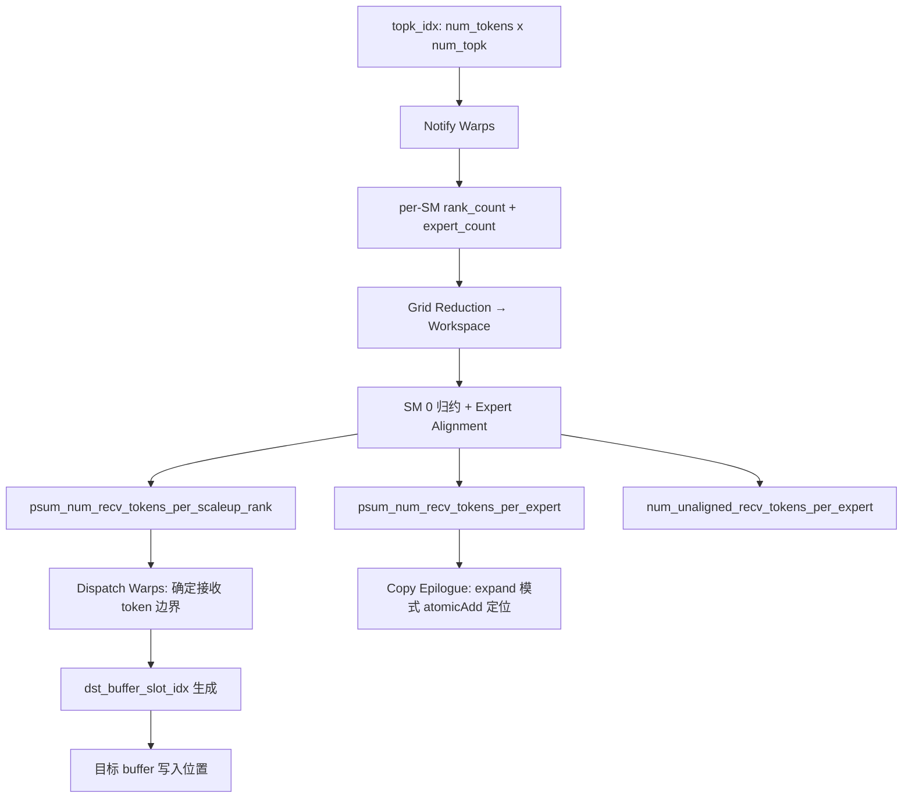
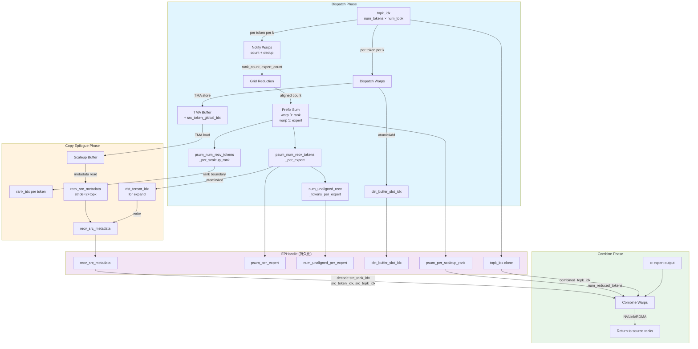

# 07 DeepEP Metadata 系统深度分析：Blog 概念 vs 源码实现

> 分析目标：验证 Blog "First Principles" 第 7 节 Metadata 概念模型（Layout Metadata / Identity Metadata），逐字段对照 DeepEP 源码实现，评估其准确性。
>
> 分析日期：2026-07-30
>
> 参考文件：
> - `deep_ep/buffers/elastic.py` — EPHandle 类定义
> - `deep_ep/include/deep_ep/impls/dispatch.cuh` — dispatch 元数据生成
> - `deep_ep/include/deep_ep/impls/dispatch_copy_epilogue.cuh` — copy epilogue 元数据写入
> - `deep_ep/include/deep_ep/impls/combine.cuh` — combine 元数据消费
> - `deep_ep/include/deep_ep/common/layout.cuh` — TokenLayout / BufferLayout / WorkspaceLayout
> - `csrc/kernels/elastic/dispatch.hpp` — C++ launch 运行时
> - `csrc/elastic/buffer.hpp` — Python ↔ C++ 桥接层

---

## 0. 核心结论

**Blog 的 Metadata 概念模型是准确的，但过度简化。** 两个抽象（Layout Metadata / Identity Metadata）在 DeepEP 中确实存在对应物，但源码实现远比博客描述的 `count → prefix sum → scatter` 复杂：

1. **Layout Metadata** 在代码中拆分为 **4 个独立张量**（psum_num_recv_tokens_per_scaleup_rank / psum_num_recv_tokens_per_expert / num_unaligned_recv_tokens_per_expert / num_recv_tokens_per_expert_list），分别服务不同阶段。
2. **Identity Metadata** 对应 `recv_src_metadata` 的 **stride=2+topk** 布局，编码了 source token index + rank/topk 联合索引 + expand slot 三元组。
3. **dst_buffer_slot_idx** 是 Blog 未明确提及的关键元数据——它承载 dispatch 阶段的 "Where" 映射。
4. **deterministic_sort** 是 Blog 完全未覆盖的机制，用于保证输出确定性。

---

## 1. Blog 概念引用

Blog 原文（`/tmp/deep_ep_blog_text.txt`，第 231-253 行）：

> **Layout Metadata (Where?):** count, prefix sum, offset. `dst = prefix[expert]++` completes contiguous writes.
>
> **Identity Metadata (Who?):** token id, expert id, gate weight, top-k slot.

Blog 进一步解释：

> Layout Metadata 解决 **dynamic mapping → contiguous addresses**。
> Identity Metadata 在 Combine 时恢复语义：`Token17 = 0.73 × Expert2 + 0.27 × Expert7`。

Blog 也明确声明：*"Layout Metadata / Identity Metadata are not official DeepEP source code terms — they are conceptual models proposed for understanding MoE Runtimes."*

### Blog 概念模型的本质

```
Layout Metadata (Where?)          Identity Metadata (Who?)
┌─────────────────────┐          ┌────────────────────────────┐
│ count per expert    │          │ token id (which token?)    │
│ prefix sum / offset │          │ expert id (which expert?)  │
│                     │          │ gate weight (how much?)    │
│ → dst = prefix[e]++ │          │ top-k slot (which slot?)   │
└─────────────────────┘          └────────────────────────────┘
         ↓                                ↓
  写入位置计算                      Combine 语义恢复
```

---

## 2. EPHandle 全字段清单

`EPHandle` 是 `ElasticBuffer.dispatch()` 的返回对象，承载 dispatch 产生的所有元数据，供后续 `combine()` 消费。源码位于 `deep_ep/buffers/elastic.py:25-98`。

### 2.1 完整字段表

| 字段名 | 类型 | 形状 | 语义 | Blog 对应 |
|--------|------|------|------|-----------|
| `do_expand` | `bool` | scalar | 是否使用 expand layout（一 token 占一 expert slot） | — |
| `num_experts` | `int` | scalar | 全局 expert 总数 | — |
| `expert_alignment` | `int` | scalar | 每个 expert 的 token 数对齐粒度 | — |
| `num_max_tokens_per_rank` | `int` | scalar | 每 rank 最大 token 数 | — |
| `num_sms` | `int` | scalar | dispatch 使用的 SM 数 | — |
| `topk_idx` | `Tensor` | `[num_tokens, num_topk]` | 克隆的 top-k expert 索引（防用户修改） | Identity |
| `psum_num_recv_tokens_per_scaleup_rank` | `Tensor` | `[num_scaleup_ranks]` | 按 scaleup rank 的去重接收 token 数 inclusive prefix sum | **Layout** |
| `psum_num_recv_tokens_per_expert` | `Tensor` | `[num_local_experts]` | 按 local expert 的 alignment-padded 接收 token 数 prefix sum | **Layout** |
| `num_unaligned_recv_tokens_per_expert` | `Tensor` | `[num_local_experts]` | 每个 local expert 实际（未对齐）接收 token 数 | Layout（辅助） |
| `num_recv_tokens_per_expert_list` | `list[int]` | Python list | CPU 侧每 expert 接收 token 数 | Layout（镜像） |
| `recv_src_metadata` | `Tensor` | `[num_recv_tokens, 2+topk]` | 源 token 索引 + buffer slot 索引 | **Identity** |
| `dst_buffer_slot_idx` | `Tensor` | `[num_tokens, topk]` | dispatch 目标 buffer slot 索引 | **Layout**（Where） |
| `token_metadata_at_forward` | `Tensor` | `[channels, max_fwd_tokens, 2+2*topk]` | hybrid mode per-channel 前传 token 元数据 | Layout（hybrid） |
| `channel_linked_list` | `Tensor` | `[channels, max_tokens, scaleup_ranks]` | hybrid mode per-channel 链表 | Layout（hybrid） |
| `num_recv_tokens` | `int` | scalar | 接收 token 总数（可能不精确，无 CPU sync 时） | — |
| `num_expanded_tokens` | `int` | scalar | expand 后 token 总数 | — |
| `cached_recv_src_metadata_before_sort` | `Tensor` | 同 recv_src_metadata | deterministic_sort 前缓存 | Identity（辅助） |

### 2.2 字段分类映射到 Blog 概念

```
EPHandle 字段分类
├── Layout Metadata (Where?)
│   ├── psum_num_recv_tokens_per_scaleup_rank  ← per-rank 前缀和
│   ├── psum_num_recv_tokens_per_expert        ← per-expert 前缀和
│   ├── num_unaligned_recv_tokens_per_expert   ← 实际未对齐计数
│   ├── num_recv_tokens_per_expert_list        ← CPU 侧镜像
│   ├── dst_buffer_slot_idx                    ← 写入位置（核心）
│   ├── token_metadata_at_forward              ← hybrid 前传位置
│   └── channel_linked_list                    ← hybrid 链表
│
├── Identity Metadata (Who?)
│   ├── recv_src_metadata                      ← 源 token 索引 + slot 索引
│   ├── topk_idx                               ← expert 选择
│   └── cached_recv_src_metadata_before_sort   ← 原始顺序备份
│
└── 控制字段
    ├── do_expand, num_experts, expert_alignment
    ├── num_max_tokens_per_rank, num_sms
    ├── num_recv_tokens, num_expanded_tokens
    └── deterministic_sort() 方法
```

---

## 3. Layout Metadata 在代码中的实现

### 3.1 psum_num_recv_tokens_per_scaleup_rank 的生成

Blog 所说 "count, prefix sum, offset" 对应 dispatch kernel 的 **notify warps** 阶段。源码位于 `dispatch.cuh:79-258`。

**第一步：共享内存原子计数（dispatch.cuh:92-107）**

```cpp
// Notify warps: 每个 warp 处理一部分 token，原子累加到 smem
const auto global_warp_idx = warp_idx * kNumSMs + sm_idx;
for (int i = global_warp_idx; i < num_tokens; i += kNumNotifyWarps * kNumSMs) {
    const auto dst_expert_idx = lane_idx < kNumTopk ?
        static_cast<int>(__ldg(topk_idx + i * kNumTopk + lane_idx)) : -1;
    if (dst_expert_idx >= 0)
        atomicAdd_block(expert_count + dst_expert_idx, 1);

    // Rank 维度需要去重（一个 token 可能多个 topk 落在同一 rank）
    const auto dst_rank_idx = dst_expert_idx >= 0 ? dst_expert_idx / kNumExpertsPerRank : -1;
    if (ptx::deduplicate(dst_rank_idx, lane_idx) and dst_rank_idx >= 0)
        atomicAdd_block(rank_count + dst_rank_idx, 1);
}
```

**关键点**：Rank 维度使用 `ptx::deduplicate` 去重——同一 token 的多个 top-k expert 落在同一 rank 时只计一次。这正是 Blog 说的 "A token is counted once per rank even if multiple of its top-k experts land on the same rank"。

**第二步：grid 级归约（dispatch.cuh:110-147）**

```cpp
// 每个 SM 将局部计数写入 workspace，等待全部 SM 完成后归约
for (int i = thread_idx; i < kNumRanks + kNumExperts; i += kNumNotifyThreads) {
    const int64_t counter = (1ll << 32ll) | rank_expert_count[i];
    ptx::red_add(workspace_layout.get_notify_reduction_workspace_ptr() + i, counter);
}
// 编码：高 32 位 = 已到达 SM 计数，低 32 位 = token 计数
```

**第三步：expert count 对齐 + 前缀和（dispatch.cuh:204-257）**

```cpp
// Expert count 对齐到 expert_alignment
for (int i = thread_idx; i < kNumExpertsPerRank; i += kNumNotifyThreads) {
    int sum = 0;
    for (int j = 0; j < kNumRanks; ++ j)
        sum += expert_count[j * kNumExpertsPerRank + i];
    // 先保存未对齐值
    if (num_unaligned_recv_tokens_per_expert != nullptr)
        num_unaligned_recv_tokens_per_expert[i] = sum;
    expert_count[i] = math::align(sum, kExpertAlignment);
}

// Inclusive prefix sum (warp 0 处理 rank)
do_psum(rank_count, psum_num_recv_tokens_per_scaleup_rank, kNumRanks, 0);
// Exclusive prefix sum (warp 1 处理 expert，用于 expand)
do_psum(expert_count, psum_num_recv_tokens_per_expert, kNumExpertsPerRank, 1);
```

### 3.2 psum_num_recv_tokens_per_expert 的双重语义

EPHandle docstring 揭示了一个微妙的差异：

> - **non-expand mode**: inclusive prefix sum
> - **expand mode**: `psum[i]` equals the aligned cumulative count of experts before `i` plus the actual (unaligned) token count of expert `i`

源码中的处理（`buffer.hpp:1114-1123`）：

```cpp
if (not cached_mode) {
    if (do_expand) {
        // expand 模式：slice 出 exclusive 部分，后续 atomicAdd 转 inclusive
        psum_num_recv_tokens_per_expert = psum_num_recv_tokens_per_expert.slice(0, 0, num_local_experts);
    } else {
        // non-expand 模式：slice 出 inclusive 部分（后续不再被 epilogue 使用）
        psum_num_recv_tokens_per_expert = psum_num_recv_tokens_per_expert.slice(0, 1, num_local_experts + 1);
    }
}
```

### 3.3 Layout Metadata 流向图



---

## 4. Identity Metadata 在代码中的实现

### 4.1 recv_src_metadata 的内存布局

Blog 说 Identity Metadata 包含 "token id, expert id, gate weight, top-k slot"。源码中实际编码更紧凑：

```
recv_src_metadata 布局 (kMetadataStride = 2 + topk)
┌────────────────────────────────────────────────────────────────┐
│ [i, 0] │ src_token_global_idx                                 │  ← 全局唯一 token ID (rank * max_tokens + local_idx)
│ [i, 1] │ src_rank_topk_idx (编码 rank_idx * topk + topk_lane) │  ← 联合索引
│ [i, 2] │ topk slot 0 (expand mode 的 dst_tensor_idx)          │  ← expert slot
│ [i, 3] │ topk slot 1                                          │
│ ...    │ ...                                                  │
│ [i, 2+topk-1] │ topk slot (topk-1)                            │
└────────────────────────────────────────────────────────────────┘
```

**注意**：Blog 说的 "gate weight" 和 "expert id" 并不在 recv_src_metadata 中——它们分别存储在 `recv_topk_weights` 和 `recv_topk_idx` 中。Blog 的概念模型做了合并抽象。

### 4.2 recv_src_metadata 的生成代码

源数据在 **dispatch 主 kernel** 中写入 TMA buffer（`dispatch.cuh:329-334`）：

```cpp
// 在 dispatch warps 中，每个 token 写入全局唯一 ID
if (ptx::elect_one_sync())
    *tma_buffer.get_src_token_global_idx_ptr() = rank_idx * kNumMaxTokensPerRank + token_idx;
ptx::tma_store_fence();
```

然后在 **copy epilogue** 中写入输出张量（`dispatch_copy_epilogue.cuh:192-207`）：

```cpp
constexpr int kMetadataStride = 2 + kNumTopk;
if constexpr (not kCachedMode) {
    if (ptx::elect_one_sync()) {
        // Field 0: 全局源 token 索引
        recv_src_metadata[i * kMetadataStride + 0] = *tma_buffer.get_src_token_global_idx_ptr();
        // Field 1: 联合编码 (rank_idx * topk + master_topk_lane)
        if constexpr (kNumScaleoutRanks == 1) {
            recv_src_metadata[i * kMetadataStride + 1] = current_rank_idx * kNumTopk + master_src_topk_idx;
        } else {
            recv_src_metadata[i * kMetadataStride + 1] = (i - current_rank_start) * kNumTopk + master_src_topk_idx;
        }
    }
    // Fields 2..2+topk-1: expand 模式下的目标 tensor slot
    if (kDoExpand and lane_idx < kNumTopk)
        recv_src_metadata[i * kMetadataStride + 2 + lane_idx] = dst_tensor_idx;
}
```

### 4.3 Identity Metadata 在 Combine 中的消费

Combine kernel 反向解码 Identity Metadata（`combine.cuh:86-105`）：

```cpp
constexpr int kMetadataStride = 2 + kNumTopk;
// 解码源 token 索引
const int src_token_idx = __ldg(src_metadata + i * kMetadataStride) % kNumMaxTokensPerRank;
// 解码联合索引 → rank_idx + topk_lane
const int src_rank_topk_idx = __ldg(src_metadata + i * kMetadataStride + 1);
const int src_rank_idx = src_rank_topk_idx / kNumTopk;
const int src_topk_idx = src_rank_topk_idx % kNumTopk;

// 使用 src_rank_idx 定位写入目标
layout::TokenLayout master_token_buffer = [=]() {
    if (nvlink_bypass) {
        auto token_buffer = recv_buffer.get_rank_buffer(...).get_token_buffer(src_token_idx);
        token_buffer.set_base_ptr(gin.get_sym_ptr<team_t>(token_buffer.get_base_ptr(), src_rank_idx));
        return token_buffer;
    }
    return send_buffer.get_rank_buffer(src_rank_idx).get_token_buffer(src_token_idx);
}();
```

**精妙之处**：Blog 说的 "Token17 = 0.73 × Expert2 + 0.27 × Expert7" 语义恢复，实际由 combine kernel 的以下机制完成：
1. `src_rank_idx` 确定回写目标 rank
2. `src_token_idx` 确定回写到目标 rank 的哪个 token 位置
3. `src_topk_idx` 确定写入哪个 top-k slot
4. `topk_weights` 从 `master_token_buffer.get_topk_weights_ptr()[lane_idx]` 读取（`combine.cuh:216-225`）

---

## 5. dst_buffer_slot_idx：Blog 未明示的核心元数据

### 5.1 语义

`dst_buffer_slot_idx` 是 Blog 概念模型中**未明确命名**但实际最关键的一个字段。它承载了 **"Where should data go?"** 的核心答案：

> 对于每个 token 的每个 top-k 选择，`dst_buffer_slot_idx[token_i][k]` 给出该 token 在目标 rank 的接收 buffer 中应写入的全局 slot 索引。

形状：`[num_tokens, topk]`，值为 `rank_idx * num_max_tokens_per_rank + local_slot_idx`，或 -1（无效选择）。

### 5.2 生成代码（dispatch.cuh:336-351）

```cpp
int stored_dst_slot_idx = -1;
if constexpr (kReuseSlotIndices) {
    // Cached dispatch: 从 handle 中复用
    if (lane_idx < kNumTopk)
        stored_dst_slot_idx = __ldg(dst_buffer_slot_idx + token_idx * kNumTopk + lane_idx);
    stored_dst_slot_idx = stored_dst_slot_idx >= 0 ?
        (stored_dst_slot_idx - rank_idx * kNumMaxTokensPerRank) : -1;
} else {
    // 首次 dispatch: atomic 分配 slot
    if (ptx::deduplicate(stored_dst_rank_idx, lane_idx) and stored_dst_rank_idx >= 0)
        stored_dst_slot_idx = atomicAdd(workspace_layout.get_scaleup_atomic_sender_counter() + stored_dst_rank_idx, 1);
    if (lane_idx < kNumTopk) {
        const auto value = stored_dst_slot_idx >= 0 ?
            rank_idx * kNumMaxTokensPerRank + stored_dst_slot_idx : -1;
        dst_buffer_slot_idx[token_idx * kNumTopk + lane_idx] = value;
    }
}
```

**关键机制**：
1. **Rank deduplication**：同一 token 多个 top-k 落在同一 rank 时只分配一个 slot
2. **Atomic counter**：`scaleup_atomic_sender_counter[dst_rank]` 是 per-rank 原子计数器，保证 slot 分配无冲突
3. **全局编码**：`rank_idx * max_tokens + local_slot` 使 slot 全局唯一

### 5.3 dst_buffer_slot_idx 的双重角色

```
dst_buffer_slot_idx
├── Dispatch 阶段 (作为输出)
│   ├── 写入目标 buffer 位置: recv_buffer.get_token_buffer(stored_dst_slot_idx)
│   └── TMA store 目标: gin.get_sym_ptr(recv_buffer.get_token_buffer(stored_dst_slot_idx), dst_rank)
│
├── Cached dispatch 阶段 (作为输入)
│   └── 复用已有 slot 映射，跳过 atomic 分配（kReuseSlotIndices=true）
│
└── 语义本质
    └── 回答了 Blog 的 "Where?" → 这个 token 的这份 copy 应该写到目标 rank 的哪个 slot
```

---

## 6. deterministic_sort：Blog 未覆盖的机制

### 6.1 问题背景

Blog 第 7.1 节问 "Does Sort Exist?"，回答是 "Counting Sort / Bucketization"。但 Blog 完全没有提到 **deterministic sort**——这是 DeepEP 实际存在的一个重要机制。

**问题**：dispatch 的接收顺序取决于各 rank 的网络到达顺序，具有非确定性。当 `deterministic=True` 时，需要对接收到的 token 排序以保证可复现。

### 6.2 实现代码（elastic.py:100-193）

```python
def deterministic_sort(self, do_cpu_sync, is_cached_dispatch,
                       recv_x, recv_sf, recv_topk_idx, recv_topk_weights,
                       channel_linked_list):
    # 关键：只在首次 dispatch 时缓存，后续 cached dispatch 复用
    if not is_cached_dispatch:
        self.cached_recv_src_metadata_before_sort = self.recv_src_metadata.clone()
    sort_keys = self.cached_recv_src_metadata_before_sort[:, 0]  # src_token_global_idx

    # 越界 token 设为 max（排到最后）
    if not do_cpu_sync:
        oob_tokens_mask = torch.arange(0, self.recv_src_metadata.shape[0], ...) >= num_recv_tokens
        sort_keys = sort_keys.clone()
        sort_keys[oob_tokens_mask] = torch.iinfo(sort_keys.dtype).max
    orig_indices = torch.sort(sort_keys).indices

    if not self.do_expand:
        # Non-expand: 按 src_token_global_idx 排序
        permute(recv_x, orig_indices)
        permute(recv_sf, orig_indices)
        permute(recv_topk_weights, orig_indices)
        permute(recv_topk_idx, orig_indices)
        if not is_cached_dispatch:
            permute(self.recv_src_metadata, orig_indices)
        # 更新 channel_linked_list 中的索引
        ...
    elif not is_cached_dispatch:
        # Expand: 按 (expert_idx, src_token_global_idx) 两键排序
        # 排序 key = expert_idx * 1e10 + (-5e9 + src_token_global_idx)
        # 保证 valid token 在 padding 之前，且 valid 按 src_token_global_idx 排序
        expert_token_idx_start = self.psum_num_recv_tokens_per_expert - self.num_unaligned_recv_tokens_per_expert
        token_idx2expert_idx = torch.bucketize(...)
        sort_keys_for_expanded_tensors = token_idx2expert_idx * src_token_global_index_max_x2
        # scatter_add 将 src_token_global_idx 编码进 slot 位置
        ...
```

### 6.3 deterministic_sort 的语义保证

```
排序前（到达顺序不确定）          排序后（确定顺序）
┌──────────────────────┐       ┌──────────────────────┐
│ recv token 0: src=42 │       │ recv token 0: src=7  │  ← 按 src_token_global_idx 升序
│ recv token 1: src=7  │  →    │ recv token 1: src=17 │
│ recv token 2: src=103│       │ recv token 2: src=42 │
│ recv token 3: src=17 │       │ recv token 3: src=103│
└──────────────────────┘       └──────────────────────┘
```

**核心洞察**：排序键是 `src_token_global_idx`（即 `recv_src_metadata[:, 0]`）——这正是 Identity Metadata 的第一个字段。这意味着 **deterministic_sort 本质上是按 Identity 排序**，使输出仅取决于 token 身份，而非到达时序。

---

## 7. Metadata 全流程：Dispatch → EPHandle → Combine

### 7.1 完整数据流图



### 7.2 Metadata 生命周期表

| 阶段 | 生成/消费 | 字段 | 作用 |
|------|----------|------|------|
| Dispatch Notify Warps | **生成** | rank_count, expert_count | 局部计数 |
| Dispatch Grid Reduction | **生成** | 归约后 count | 全局聚合 |
| Dispatch SM 0 | **生成** | psum_num_recv_tokens_per_scaleup_rank | rank 边界 |
| Dispatch SM 0 | **生成** | psum_num_recv_tokens_per_expert | expert 边界 |
| Dispatch SM 0 | **生成** | num_unaligned_recv_tokens_per_expert | 实际计数 |
| Dispatch Warps | **生成** | dst_buffer_slot_idx | 写入位置 |
| Dispatch Warps | **生成** | src_token_global_idx (in TMA) | 源 token ID |
| Copy Epilogue | **生成** | recv_src_metadata[:, 0] | 源 token 全局 ID |
| Copy Epilogue | **生成** | recv_src_metadata[:, 1] | rank+topk 联合索引 |
| Copy Epilogue | **生成** | recv_src_metadata[:, 2:] | expand slot 索引 |
| EPHandle 缓存 | **存储** | 全部 metadata | 跨层复用 |
| Deterministic Sort | **消费+变换** | recv_src_metadata, recv_x 等 | 确定序重排 |
| Combine | **消费** | recv_src_metadata → src_rank/topk/token_idx | 反向路由 |
| Combine | **消费** | psum_num_recv_tokens_per_scaleup_rank | 接收总数 |
| Combine | **消费** | topk_idx (as combined_topk_idx) | expert 选择 |

---

## 8. 代码证据汇总

### 8.1 Metadata 字段编码细节

**src_token_global_idx 编码**（dispatch.cuh:332）：
```cpp
*tma_buffer.get_src_token_global_idx_ptr() = rank_idx * kNumMaxTokensPerRank + token_idx;
```
解码（combine.cuh:89）：
```cpp
const int src_token_idx = __ldg(src_metadata + i * kMetadataStride) % kNumMaxTokensPerRank;
```

**src_rank_topk_idx 联合编码**（dispatch_copy_epilogue.cuh:196-198）：
```cpp
// Non-hybrid: 编码 scaleup rank + master topk lane
recv_src_metadata[i * kMetadataStride + 1] = current_rank_idx * kNumTopk + master_src_topk_idx;
// Hybrid: 编码 slot 偏移 + master topk lane
recv_src_metadata[i * kMetadataStride + 1] = (i - current_rank_start) * kNumTopk + master_src_topk_idx;
```
解码（combine.cuh:90-92）：
```cpp
const int src_rank_topk_idx = __ldg(src_metadata + i * kMetadataStride + 1);
const int src_rank_idx = src_rank_topk_idx / kNumTopk;
const int src_topk_idx = src_rank_topk_idx % kNumTopk;
```

### 8.2 TokenLayout 中的 Metadata 偏移（layout.cuh:179-248）

```cpp
struct TokenLayout {
    // Metadata 字节数: topk indices + weights + optional (src_token + linked_list)
    int num_metadata_bytes = num_topk * (sizeof(int) + sizeof(float)) +
                             (with_metadata ? (1 + num_topk) * sizeof(int) : 0);

    int* get_topk_idx_ptr() const { return get_metadata_ptr(); }
    float* get_topk_weights_ptr() const { return advance_ptr<float>(get_metadata_ptr(), num_topk * sizeof(int)); }
    int* get_src_token_global_idx_ptr() const { return advance_ptr<int>(get_topk_weights_ptr(), num_topk * sizeof(float)); }
    int* get_linked_list_idx_ptr() const { return get_src_token_global_idx_ptr() + 1; }
};
```

### 8.3 EPHandle 如何从 C++ 返回（buffer.hpp:1164-1176）

```cpp
return {recv_x, recv_sf,
        recv_topk_idx, recv_topk_weights,
        copied_topk_idx,
        num_recv_tokens, num_expanded_tokens,
        num_recv_tokens_per_expert_list,
        psum_num_recv_tokens_per_scaleup_rank,   // → EPHandle.psum_num_recv_tokens_per_scaleup_rank
        psum_num_recv_tokens_per_expert,         // → EPHandle.psum_num_recv_tokens_per_expert
        num_unaligned_recv_tokens_per_expert,    // → EPHandle.num_unaligned_recv_tokens_per_expert
        recv_src_metadata,                       // → EPHandle.recv_src_metadata
        dst_buffer_slot_idx,                     // → EPHandle.dst_buffer_slot_idx
        token_metadata_at_forward,               // → EPHandle.token_metadata_at_forward
        channel_linked_list,                     // → EPHandle.channel_linked_list
        event};
```

### 8.4 Combine 消费的 Python 入口（elastic.py:1091-1107）

```python
combined_x, combined_topk_weights, event = \
    self.runtime.combine(x, topk_weights,
                         bias_0, bias_1,
                         handle.recv_src_metadata,                         # Identity
                         handle.topk_idx,                                   # Identity
                         handle.psum_num_recv_tokens_per_scaleup_rank,      # Layout
                         handle.token_metadata_at_forward,                   # Layout (hybrid)
                         handle.channel_linked_list,                         # Layout (hybrid)
                         handle.num_experts,
                         handle.num_max_tokens_per_rank,
                         ...)
```

---

## 9. Blog 描述准确性评估

### 9.1 逐项对照

| Blog 声称 | 代码事实 | 准确性 | 评注 |
|-----------|---------|--------|------|
| Layout = count, prefix sum, offset | ✅ 准确 | **精确** | 4 个独立张量拆分存储，语义等价 |
| `dst = prefix[expert]++` | ⚠️ 部分准确 | **简化** | 实际用 atomicAdd，且分 rank/expert 两层 |
| Identity = token id, expert id, gate weight, top-k slot | ⚠️ 部分准确 | **合并抽象** | 实际分布在 3 个张量中，expert id 在 topk_idx 而非 metadata |
| "dst = prefix[expert]++ completes contiguous writes" | ⚠️ 简化 | **不完整** | 实际通过 dst_buffer_slot_idx 间接寻址，非直接 ++ |
| Layout 解决 "dynamic mapping → contiguous addresses" | ✅ 准确 | **精确** | 核心语义正确 |
| Identity 在 Combine 恢复语义 | ✅ 准确 | **精确** | combine 通过 src_metadata 反向路由 |
| Counting Sort / Bucketization | ✅ 准确 | **精确** | notify warps 即 counting sort |
| "Top-K slot 信息必须保留" | ✅ 准确 | **精确** | recv_src_metadata[:, 2:] 即此 |

### 9.2 Blog 遗漏的关键要素

| 遗漏项 | 代码重要性 | 说明 |
|--------|----------|------|
| **dst_buffer_slot_idx** | ⭐⭐⭐ | 核心 "Where" 映射，Blog 未命名 |
| **deterministic_sort** | ⭐⭐⭐ | 保证确定性的关键机制，Blog 未提及 |
| **src_token_global_idx 全局编码** | ⭐⭐ | `rank * max_tokens + local` 编码，Blog 未说明 |
| **rank/topk 联合编码** | ⭐⭐ | 用一个 int 编码两个字段，Blog 未说明 |
| **hybrid mode 元数据** | ⭐ | token_metadata_at_forward, channel_linked_list |
| **cached dispatch 复用** | ⭐⭐ | EPHandle 缓存避免重算，Blog 未提及 |
| **expert_alignment + 未对齐计数** | ⭐⭐ | 两态 prefix sum 语义，Blog 未提及 |
| **per-rank 去重** | ⭐⭐ | 同一 token 多 top-k 同 rank 只计一次 |

### 9.3 准确性结论

```
Blog 概念模型准确性评估
├── 概念层面: ★★★★★ (5/5)
│   └── Layout/Identity 二分法准确抓住本质
├── 字段覆盖: ★★★☆☆ (3/5)
│   └── 遗漏 dst_buffer_slot_idx、deterministic_sort 等重要字段
├── 流程描述: ★★★☆☆ (3/5)
│   └── "count → prefix sum → scatter" 正确但过度简化
├── 实现细节: ★★☆☆☆ (2/5)
│   └── 编码方式、联合索引、去重机制未涉及
└── 总体: 概念模型正确，可作为理解入口，但不足以指导实现
```

---

## 10. Blog 概念 vs 源码实现对比表

### 10.1 映射总表

| Blog 概念 | DeepEP 实现 | 存储位置 | 生命周期 |
|-----------|------------|---------|---------|
| Layout: count | `rank_count[]`, `expert_count[]` (smmem) | dispatch notify warps | 瞬时 |
| Layout: prefix sum | `psum_num_recv_tokens_per_scaleup_rank` | EPHandle | dispatch → combine |
| Layout: offset | `psum_num_recv_tokens_per_expert` | EPHandle | dispatch → combine |
| Layout: dst offset | `dst_buffer_slot_idx` | EPHandle (可复用) | dispatch → combine |
| Identity: token id | `recv_src_metadata[:, 0]` (src_token_global_idx) | EPHandle | dispatch → combine |
| Identity: expert id | `topk_idx` / `recv_topk_idx` | EPHandle / output | dispatch → combine |
| Identity: gate weight | `recv_topk_weights` | kernel output | dispatch → combine |
| Identity: top-k slot | `recv_src_metadata[:, 1]` (rank_topk联合编码) | EPHandle | dispatch → combine |
| Identity: expand slot | `recv_src_metadata[:, 2:]` | EPHandle | dispatch → combine |

### 10.2 关键差异分析

```
Blog 描述:                    DeepEP 实际:
prefix[expert]++              atomicAdd(atomic_counter[rank], 1)
                              ↓
                              dst_buffer_slot_idx[token][k] = rank * max_tokens + slot
                              ↓
                              recv_buffer[slot] = data  (间接寻址)

Blog: Identity 直接映射       Expert ID 在 topk_idx 中
                              Token ID 在 recv_src_metadata[:, 0]
                              Gate weight 在 recv_topk_weights 中
                              三者分离存储，combine 时联合解码
```

---

## 11. 深度洞察：为什么 Blog 的抽象仍然成立

尽管源码实现远比 Blog 描述复杂，Layout/Identity 二分法在概念层面仍然精确，因为：

### 11.1 职责分离原理

```
Layout Metadata 回答: "数据应该去哪？"
  → 所有 prefix sum / slot / offset 字段服务于此
  → 与 token 身份无关，只与数量和位置有关

Identity Metadata 回答: "这份数据是谁？"
  → src_token_global_idx / topk slot 服务于此
  → 与路由无关，只与 token 身份有关
```

这种分离使得：
1. **Layout 可缓存**：只要 expert 分布不变，prefix sum 可跨层复用（cached dispatch）
2. **Identity 可排序**：deterministic_sort 只改变 Identity 的排列，不改变 Layout
3. **Combine 解耦**：combine 需要 Identity 来回写，需要 Layout 来确定总量

### 11.2 编码效率考量

Blog 将 Identity 描述为 "token id, expert id, gate weight, top-k slot" 四个独立字段，但源码将它们编码为：
- 1 个 `src_token_global_idx`（解码时取模得到 local token idx）
- 1 个 `src_rank_topk_idx`（解码时除法/取模得到 rank + topk lane）
- top-k 个 `dst_tensor_idx`（expand slot）

这种**联合编码**是 GPU 优化的典型手法：减少内存传输次数，利用 32 位 int 的带宽效率。

### 11.3 dst_buffer_slot_idx 的本质

`dst_buffer_slot_idx` 是 Blog 概念模型中**隐含但未明示**的 "offset" 字段。Blog 说 `dst = prefix[expert]++`，但实际实现中：
- prefix sum 给出的是 **边界**（每个 expert 从哪里开始）
- atomicAdd 给出的是 **具体 slot**（当前 token 写到哪）
- `dst_buffer_slot_idx` 是 **全局编码的写入地址**（rank * max_tokens + slot）

这比 `prefix[expert]++` 更通用：它支持任意顺序写入（因为每个 token 独立计算目标地址），而 `prefix[expert]++` 隐含顺序写入假设。

---

## 12. 总结

### 12.1 Blog 概念模型的定位

Blog 提出的 Layout Metadata / Identity Metadata 是一个**教学模型**（conceptual model），而非实现规范。它准确抓住了 DeepEP 元数据系统的**概念结构**：

- ✅ Layout = Where → 确定数据位置
- ✅ Identity = Who → 确定数据身份
- ✅ Counting Sort → 产生连续布局
- ✅ 语义恢复 → Combine 核心作用

### 12.2 源码实现的超集

DeepEP 的实际实现是 Blog 概念的**严格超集**：

```
Blog 概念                     DeepEP 实现
─────────                    ──────────
Layout (count/psum/offset) → 4 张量 + hybrid 扩展 + alignment 处理
Identity (token/expert/weight/slot) → 联合编码 3 段 + topk_idx 分离
Counting Sort              → notify warps + grid reduction + psum
Combine 语义恢复            → + deterministic_sort + cached dispatch
```

### 12.3 对研究者的启示

1. **Blog 是合格的概念入口**：Layout/Identity 二分法可用于理解任何 MoE Runtime（Mega MoE、DeepEP、vLLM 等）
2. **实现必须处理确定性**：Blog 未提及的 deterministic_sort 是生产系统的必要机制
3. **编码方式影响性能**：联合编码（rank * topk + lane）是 GPU 友好的关键优化
4. **Layout/Identity 分离使缓存成为可能**：EPHandle 的 cached dispatch 模式依赖此分离

---

## 附录 A：关键源码文件索引

| 文件 | 行号范围 | 内容 |
|------|---------|------|
| `deep_ep/buffers/elastic.py` | 25-98 | EPHandle 类定义 |
| `deep_ep/buffers/elastic.py` | 100-193 | deterministic_sort 实现 |
| `deep_ep/buffers/elastic.py` | 510-527 | _unpack_handle 桥接方法 |
| `deep_ep/buffers/elastic.py` | 999-1033 | dispatch 返回 EPHandle |
| `deep_ep/buffers/elastic.py` | 1046-1107 | combine 消费 EPHandle |
| `deep_ep/include/deep_ep/impls/dispatch.cuh` | 79-107 | notify warps counting |
| `deep_ep/include/deep_ep/impls/dispatch.cuh` | 204-257 | expert alignment + psum |
| `deep_ep/include/deep_ep/impls/dispatch.cuh` | 329-351 | src_token + dst_slot 生成 |
| `deep_ep/include/deep_ep/impls/dispatch_copy_epilogue.cuh` | 192-207 | recv_src_metadata 写入 |
| `deep_ep/include/deep_ep/impls/combine.cuh` | 86-105 | src_metadata 解码 |
| `deep_ep/include/deep_ep/impls/combine.cuh` | 216-225 | topk_weights 回写 |
| `deep_ep/include/deep_ep/common/layout.cuh` | 179-248 | TokenLayout metadata 偏移 |
| `csrc/kernels/elastic/dispatch.hpp` | 14-128 | DispatchRuntime Args |
| `csrc/elastic/buffer.hpp` | 1074-1176 | dispatch 返回 + metadata 分配 |

## 附录 B：Metadata 张量形状速查

```
假设: T=num_tokens, R=num_ranks, RU=num_scaleup_ranks, E=num_experts,
      EL=num_local_experts=E/R, K=num_topk, M=num_max_tokens_per_rank

生成阶段:
  rank_count:             [RU]          (smmem)
  expert_count:           [E]           (smmem)
  psum_per_scaleup_rank:  [RU]          ← EPHandle 字段
  psum_per_expert:        [EL+1] → [EL] ← EPHandle 字段 (slice 后)
  num_unaligned_per_expert: [EL]        ← EPHandle 字段
  dst_buffer_slot_idx:    [T, K]        ← EPHandle 字段
  src_token_global_idx:   scalar/TMA    ← 写入 per-token metadata
  recv_src_metadata:      [num_recv, 2+K] ← EPHandle 字段

消费阶段:
  combine 读取:
    recv_src_metadata[i, 0]     → src_token_global_idx
    recv_src_metadata[i, 1]     → src_rank_topk_idx
    recv_src_metadata[i, 2+k]   → expand slot (或 -1)
    psum_per_scaleup_rank[-1]   → num_reduced_tokens
```
