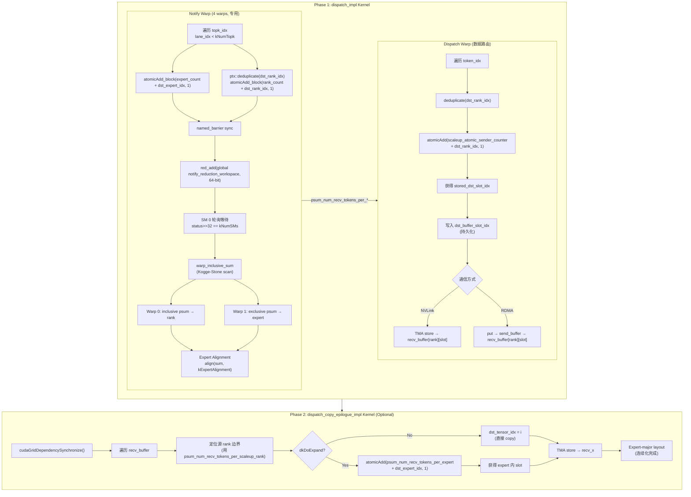
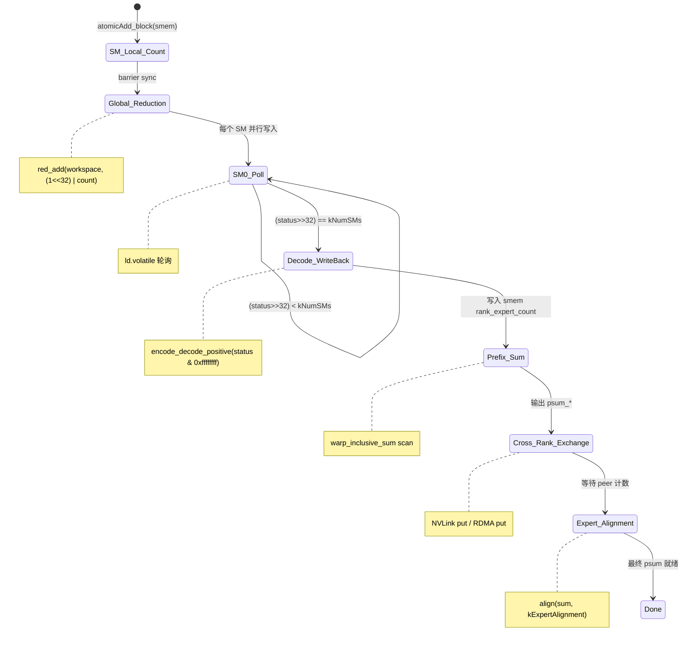

# 07 DeepEP Counting Sort / Bucketization 深度校验：博客第一性原理 vs 源码实现

> 分析日期: 2026-07-30
> 目标: 以博客 "Count → Prefix Sum → Scatter" 第一性原理描述为基准，**逐行对照 DeepEP 源码**，验证其准确性、揭示实现细节、并评估描述的完整度。
> 与 `06_10_counting_sort.md` 的区别：本文是 **DeepEP 单项目深度校验**（博客 vs 源码），而非三方对比。

---

## 1. 核心结论

**博客描述准确，但过于精简。** 博客用一句话 "Count → Prefix Sum → Scatter, essentially Counting Sort / Bucketization" 抓住了本质，但 DeepEP 的实际实现远比这三步复杂：

| 博客描述 | 实际 DeepEP 实现 | 匹配度 |
|----------|------------------|--------|
| Count | **两级计数**：SM-local `atomicAdd_block`(smem) + 全局 `red_add` reduction | 准确但隐藏了关键的两级合并细节 |
| Prefix Sum | **SM 0 集中 warp-level scan**（非分布式），且分 rank/expert 两个维度 | 准确但未体现 "SM 0 瓶颈" 与 "64-bit 编码同步" |
| Scatter | **两个独立的 scatter**：dispatch warp 的 rank-slot scatter + copy epilogue 的 expert scatter | **不完整** — 博客未区分两个阶段 |
| 目标：连续 layout | 仅在 **expand 模式** 下产生 expert-major 连续 layout；非 expand 模式只产生 rank-contiguous | **部分准确** — 连续化是有条件的 |

**关键发现**：博客描述的 "Counting Sort" 在 DeepEP 中 **不是以产生 Expert-major layout 为首要目标的**，而是以 **通信寻址**（确定每个 token 的目标 rank + slot）为核心目标。Expert-major 连续化是 expand 模式的副产品。

---

## 2. 博客原文引用

> **7.1 Does Sort Exist?**
>
> Yes, but not traditional sorting. Core process: **Count → Prefix Sum → Scatter**
>
> Essentially **Counting Sort / Bucketization**. Goal: produce contiguous layout, not sort by size.

博客的核心洞察（3 条）：
1. **不是传统排序**，而是 Counting Sort / Bucketization
2. **目标：产生连续 layout**，而非按大小排序
3. 核心流程：Count（统计每个 expert 的 token 数）→ Prefix Sum（计算每个 expert 的起始偏移）→ Scatter（将 token 写入对应位置）

**本文将逐条验证以上三点在 DeepEP 源码中的对应关系。**

---

## 3. DeepEP Counting Sort 完整流程架构

DeepEP 的 Counting Sort **横跨两个 kernel、两个 warp 角色、两个计数维度**，远比博客的三步描述复杂：

```
┌─────────────────────────────────────────────────────────────────────────────────┐
│                  Phase 1: dispatch_impl (主 Dispatch Kernel)                     │
│                                                                                 │
│  ┌─────────────────────────────────────────────────────────────────────────┐    │
│  │ Notify Warp (warp_idx < kNumNotifyWarps, 通常 4 个 warp)                │    │
│  │ 职责：统计 → 聚合 → Prefix Sum → 发布给 peers                           │    │
│  │                                                                         │    │
│  │  Step 1a: SM-local COUNT (atomicAdd_block to smem)                      │    │
│  │  Step 1b: 全局 REDUCTION (red_add to global workspace, 64-bit 编码)     │    │
│  │  Step 1c: SM 0 集中 PREFIX SUM (warp-level inclusive/exclusive scan)    │    │
│  │  Step 1d: 跨 rank 交换计数 (NVLink put / RDMA put)                      │    │
│  │  Step 1e: Expert Alignment + 本地 expert_count 累加                     │    │
│  └─────────────────────────────────────────────────────────────────────────┘    │
│                                          │                                      │
│                                          ▼                                      │
│  ┌─────────────────────────────────────────────────────────────────────────┐    │
│  │ Dispatch Warp (warp_idx >= kNumDispatchWarps)                            │    │
│  │ 职责：按 token 路由，分配目标 slot，发送数据                              │    │
│  │                                                                         │    │
│  │  Step 2a: SM 间 SCATTER — atomicAdd(scaleup_atomic_sender_counter)       │    │
│  │           → 获得目标 rank 内的 slot index                                │    │
│  │  Step 2b: 写入 dst_buffer_slot_idx (持久化，供 combine/cached 复用)      │    │
│  │  Step 2c: TMA store / RDMA put → 目标 rank 的 recv_buffer               │    │
│  └─────────────────────────────────────────────────────────────────────────┘    │
│                                          │                                      │
│               ═══════════════════════════╪══════════════════════════            │
│               Phase 2: 分离的 copy epilogue kernel (可选)                        │
│               ═══════════════════════════╪══════════════════════════            │
│                                          ▼                                      │
│  ┌─────────────────────────────────────────────────────────────────────────┐    │
│  │ dispatch_copy_epilogue_impl (仅 expand 模式或需要 copy 时)                │    │
│  │                                                                         │    │
│  │  Step 3a: 按 psum_num_recv_tokens_per_scaleup_rank 定位源 rank 边界     │    │
│  │  Step 3b: Expert-level SCATTER — atomicAdd(psum_num_recv_tokens_per_    │    │
│  │           expert + dst_expert_idx, 1) → 获得 expert 内 slot              │    │
│  │  Step 3c: TMA store → recv_x (Expert-major layout, 连续化完成)          │    │
│  └─────────────────────────────────────────────────────────────────────────┘    │
└─────────────────────────────────────────────────────────────────────────────────┘
```

---

## 4. Step 1: COUNT — 两级计数机制

### 4.1 博客描述 vs 实际

博客说 "Count"（统计每个 expert 的 token 数）。实际 DeepEP 有 **两个计数维度** 和 **两级合并**：

- **两个维度**：Expert 维度（每个 expert 收到多少 token）+ Rank 维度（每个 rank 收到多少 token，需去重）
- **两级合并**：SM-local 计数（smem atomicAdd）→ 全局 reduction（global red_add）

### 4.2 Step 1a: SM-local 计数（Notify Warp）

**文件**: `deep_ep/include/deep_ep/impls/dispatch.cuh`，line 92-108

```cpp
// Atomic add on shared memory
EP_STATIC_ASSERT(kNumTopk <= 32, "Insufficient lanes");
const auto global_warp_idx = warp_idx * kNumSMs + sm_idx;
for (int i = global_warp_idx; i < num_tokens; i += kNumNotifyWarps * kNumSMs) {
    // Expert choice can not be redundant
    const auto dst_expert_idx = lane_idx < kNumTopk ?
        static_cast<int>(__ldg(topk_idx + i * kNumTopk + lane_idx)) : -1;
    if (dst_expert_idx >= 0)
        atomicAdd_block(expert_count + dst_expert_idx, 1);          // line 101

    // Rank choice should do deduplication here
    const auto dst_rank_idx = dst_expert_idx >= 0 ? dst_expert_idx / kNumExpertsPerRank : -1;
    if (ptx::deduplicate(dst_rank_idx, lane_idx) and dst_rank_idx >= 0)
        atomicAdd_block(rank_count + dst_rank_idx, 1);             // line 106
}
ptx::named_barrier<kNumNotifyThreads>(kNotifyBarrierIndex);
```

**关键细节**：

| 维度 | 操作 | 去重 | 原因 |
|------|------|------|------|
| `expert_count[dst_expert_idx]++` | `atomicAdd_block` | 不需要 | 每个 (token, expert) pair 是唯一的 |
| `rank_count[dst_rank_idx]++` | `atomicAdd_block` | **需要** `ptx::deduplicate` | 同一 token 的多个 expert 可能落在同一 rank，但只应计数一次 |

**`ptx::deduplicate` 实现**（`ptx.cuh` line 419-421）：

```cpp
__device__ __forceinline__ bool deduplicate(const int& value, const int& lane_idx) {
    return get_master_lane_idx(match(value)) == lane_idx;
}
```

通过 `__match_any_sync` 找到具有相同 `dst_rank_idx` 的 lane group，只有 "master lane"（最高位 lane）返回 true。这保证了一个 rank 只被同一个 token 计数一次。

**注意**：这里 `expert_count` 和 `rank_count` 是 **smem 数组**（`rank_expert_count`），每个 SM 独立一份。

### 4.3 Step 1b: 全局 Reduction（跨 SM 聚合）

**文件**: `dispatch.cuh`，line 110-115

```cpp
// Do full-grid reduction
#pragma unroll
for (int i = thread_idx; i < kNumRanks + kNumExperts; i += kNumNotifyThreads) {
    const int64_t counter = (1ll << 32ll) | rank_expert_count[i];    // 64-bit 编码
    ptx::red_add(workspace_layout.get_notify_reduction_workspace_ptr() + i, counter);
}
```

**64-bit 编码协议**（这是 DeepEP 的核心同步原语）：

```
┌──────────────────────────────────────────────────────────┐
│                    64-bit counter 编码                     │
├──────────────────────┬───────────────────────────────────┤
│   High 32-bit        │   Low 32-bit                       │
│   SM 完成计数         │   累计 token 数                    │
│   (完成信号)          │   (实际数据)                        │
├──────────────────────┼───────────────────────────────────┤
│  当 high == kNumSMs  │  low = 所有 SM 对该 expert/rank    │
│  时表示所有 SM 完成  │   的 token 计数总和                  │
└──────────────────────┴───────────────────────────────────┘
```

**`ptx::red_add` 实现**（`ptx.cuh` line 277-280）：

```cpp
__forceinline__ __device__ void red_add(const int64_t* ptr, const int64_t& value) {
    asm volatile("red.gpu.global.add.u64 [%0], %1;" :: "l"(ptr), "l"(value));
}
```

使用 PTX `red.gpu.global.add.u64` —— GPU 级别的全局原子加（绕过 L2，直接到 DRAM），比 `atomicAdd` 更快。

### 4.4 Step 1c: SM 0 集中等待 + 解码

**文件**: `dispatch.cuh`，line 118-147

```cpp
// Do the remaining work by SM 0
if (sm_idx == 0) {
    // Reduce all SM's count
    // Wait all SMs' arrival
    for (int i = thread_idx; i < kNumRanks + kNumExperts; i += kNumNotifyThreads) {
        comm::timeout_while<kNumTimeoutCycles>(true, [=](const bool& is_last_check) {
            const auto status = ptx::ld_volatile<int64_t>(
                workspace_layout.get_notify_reduction_workspace_ptr() + i);
            if ((status >> 32) == kNumSMs) {           // 所有 SM 都完成了？
                const auto encoded = math::encode_decode_positive(static_cast<int>(status & 0xffffffffll));
                rank_expert_count[i] = encoded;         // 写回 smem
                // ... 清理 workspace
                return true;
            }
            // ... 超时检查
            return false;
        });
    }
}
```

**关键设计**：
- 只有 **SM 0** 做后续工作（集中式设计）
- 通过 `ld.volatile.global` 轮询等待所有 SM 的 reduction 完成
- 完成后通过 `encode_decode_positive` 解码（取负减一），恢复原始计数值

### 4.5 两级计数的交互总结

```
        SM 0                    SM 1                    SM ...                  SM N
          │                       │                        │                       │
    ┌─────▼─────┐           ┌─────▼─────┐           ┌─────▼─────┐          ┌─────▼─────┐
    │ smem      │           │ smem      │           │ smem      │          │ smem      │
    │ expert_   │           │ expert_   │           │ expert_   │          │ expert_   │
    │ count[E]  │           │ count[E]  │           │ count[E]  │          │ count[E]  │
    │           │           │           │           │           │          │           │
    │ atomicAdd │           │ atomicAdd │           │ atomicAdd │          │ atomicAdd │
    │ _block    │           │ _block    │           │ _block    │          │ _block    │
    └─────┬─────┘           └─────┬─────┘           └─────┬─────┘          └─────┬─────┘
          │                       │                        │                       │
          │   red_add (64-bit)    │    red_add (64-bit)    │   red_add (64-bit)    │
          │───────────────────────│────────────────────────│───────────────────────│──▶
          │                       │                        │                       │
          │              Global notify_reduction_workspace[E] (DRAM)
          │                       │                        │                       │
          │                       │                        │                       │
          ▼ (SM 0 only)           │                        │                       │
    ┌───────────────┐             │                        │                       │
    │ 轮询等待       │             │                        │                       │
    │ status>>32    │             │                        │                       │
    │ == kNumSMs?   │             │                        │                       │
    └───────┬───────┘             │                        │                       │
            │                     │                        │                       │
            ▼                     │                        │                       │
    ┌───────────────┐             │                        │                       │
    │ Warp-level    │             │                        │                       │
    │ Prefix Sum    │             │                        │                       │
    └───────────────┘             │                        │                       │
```

**博客匹配度评估**：博客的 "Count" 描述准确但隐藏了两级合并的关键细节。实际上 "Count" 阶段包含了 SM-local 计数 + 全局 reduction + SM 0 集中协调，这是一个复杂的多阶段同步过程。

---

## 5. Step 2: PREFIX SUM — Warp-level Scan

### 5.1 博客描述 vs 实际

博客说 "Prefix Sum"（计算每个 expert 的起始偏移）。实际实现：

- **位置**：SM 0 集中执行（非分布式）
- **算法**：Warp-level inclusive scan（`__shfl_up_sync` 蝶形扫描）
- **维度**：两个独立的 prefix sum（rank 维度 inclusive + expert 维度 exclusive）
- **实现方式**：手动循环展开，非 `cub::BlockScan`（代码注释明确说明）

### 5.2 核心 Prefix Sum 代码

**文件**: `dispatch.cuh`，line 232-257

```cpp
// Do prefix sum by the warps
// NOTES: we may have fast implementation with `cub::BlockScan`, but it is too heavy to use
const auto do_psum = [=](const int* count, int* out, const int n, const int is_exclusive) {
    int psum = 0;
    #pragma unroll
    for (int i = 0; i < math::ceil_div(n + is_exclusive, 32); ++ i) {
        const auto idx = i * 32 + lane_idx;
        const auto mem_idx = idx - is_exclusive;
        const auto value = (0 <= mem_idx and mem_idx < n) ? count[mem_idx] : 0;
        const auto sum = psum + ptx::warp_inclusive_sum(value, lane_idx);

        // Store into global memory
        if (idx < n + is_exclusive)
            out[idx] = sum;

        // Update `psum` by using the last lane's value
        psum = ptx::exchange(sum, 31);
    }
};
if (warp_idx == 0) {
    // Inclusive prefix sum
    do_psum(rank_count, psum_num_recv_tokens_per_scaleup_rank, kNumRanks, 0);
} else if (warp_idx == 1) {
    // Exclusive prefix sum for later expanding
    do_psum(expert_count, psum_num_recv_tokens_per_expert, kNumExpertsPerRank, 1);
}
```

### 5.3 Warp-level Inclusive Sum 实现

**文件**: `ptx.cuh`，line 423-431

```cpp
__device__ __forceinline__ int warp_inclusive_sum(int value, const int& lane_idx) {
    #pragma unroll
    for (int offset = 1; offset < 32; offset <<= 1) {
        const auto synced = __shfl_up_sync(0xffffffff, value, offset);
        if (lane_idx >= offset)
            value += synced;
    }
    return value;
}
```

这是经典的 **Kogge-Stone 蝶形并行前缀和**，在 32 个 lane 的 warp 内完成：

```
Iteration 1 (offset=1):  lane i ← lane i + lane (i-1)
Iteration 2 (offset=2):  lane i ← lane i + lane (i-2)
Iteration 3 (offset=4):  lane i ← lane i + lane (i-4)
Iteration 4 (offset=8):  lane i ← lane i + lane (i-8)
Iteration 5 (offset=16): lane i ← lane i + lane (i-16)
```

**复杂度**：O(log W) = 5 步（W=32），无需 shared memory，纯寄存器操作。

### 5.4 跨 Warp 合并（psum 变量）

`do_psum` 中 `psum` 变量是关键：它保存了上一个 32-element block 的总和，通过 `ptx::exchange(sum, 31)`（即 `__shfl_sync` 广播 lane 31 的值）传递给下一个 block。

```cpp
// Update `psum` by using the last lane's value
psum = ptx::exchange(sum, 31);
```

**`ptx::exchange` 实现**（`ptx.cuh` line 357-366）：

```cpp
template <typename dtype_t>
__device__ __forceinline__ dtype_t exchange(dtype_t ptr, const int& src_lane_idx) {
    const auto send_int_values = reinterpret_cast<int*>(&ptr);
    dtype_t recv_dtype;
    auto recv_int_values = reinterpret_cast<int*>(&recv_dtype);
    for (int i = 0; i < sizeof(dtype_t) / sizeof(int); ++i)
        recv_int_values[i] = __shfl_sync(0xffffffff, send_int_values[i], src_lane_idx);
    return recv_dtype;
}
```

### 5.5 Inclusive vs Exclusive 的区别

| 用途 | 模式 | 参数 | 输出 |
|------|------|------|------|
| Rank 维度 | **Inclusive** | `is_exclusive=0` | `psum_num_recv_tokens_per_scaleup_rank[i]` = rank 0..i 的累计 token 数 |
| Expert 维度 | **Exclusive** | `is_exclusive=1` | `psum_num_recv_tokens_per_expert[i]` = expert 0..i-1 的累计 token 数（i 的起始偏移） |

**为什么 expert 用 exclusive？** 因为 `psum_num_recv_tokens_per_expert` 在 expand 模式的 copy epilogue 中直接用作原子计数器的初始值（每个 expert 的写入起始位置），exclusive prefix sum 恰好给出 expert i 的起始偏移。

### 5.6 博客匹配度评估

博客的 "Prefix Sum" 描述准确。但实际实现的 "SM 0 集中 scan" 是一个潜在瓶颈（当 expert/rank 数很大时），博客未提及这一点。

---

## 6. Step 3: SCATTER — 两个独立的 Scatter 阶段

### 6.1 博客描述 vs 实际

博客说 "Scatter"（将 token 写入对应位置）。实际 DeepEP 有 **两个完全独立的 scatter 阶段**：

| Scatter | 位置 | 目标 | 原子操作 | 产物 |
|---------|------|------|----------|------|
| **Scatter 1**: Rank-level | `dispatch_impl` 的 dispatch warp | 分配目标 rank 内的 slot | `atomicAdd(scaleup_atomic_sender_counter)` | `dst_buffer_slot_idx` |
| **Scatter 2**: Expert-level | `dispatch_copy_epilogue_impl` | 分配目标 expert 内的 slot | `atomicAdd(psum_num_recv_tokens_per_expert)` | `recv_x` (Expert-major) |

**博客只描述了 Scatter 2（expert-level scatter）的目标（连续 layout），但 Scatter 1（rank-level scatter）才是 dispatch 阶段的核心。**

### 6.2 Scatter 1: Rank-level Slot 分配（Dispatch Warp）

**文件**: `dispatch.cuh`，line 336-351

```cpp
// Deduplicate ranks and assign slots
int stored_dst_slot_idx = -1;
if constexpr (kReuseSlotIndices) {
    // Cached 模式：复用之前计算的 slot
    if (lane_idx < kNumTopk)
        stored_dst_slot_idx = __ldg(dst_buffer_slot_idx + token_idx * kNumTopk + lane_idx);
    stored_dst_slot_idx = stored_dst_slot_idx >= 0 ?
        (stored_dst_slot_idx - rank_idx * kNumMaxTokensPerRank) : -1;
} else {
    // 非 cached 模式：实时分配 slot
    if (ptx::deduplicate(stored_dst_rank_idx, lane_idx) and stored_dst_rank_idx >= 0)
        stored_dst_slot_idx = atomicAdd(
            workspace_layout.get_scaleup_atomic_sender_counter() + stored_dst_rank_idx, 1);
    if (lane_idx < kNumTopk) {
        const auto value = stored_dst_slot_idx >= 0 ?
            rank_idx * kNumMaxTokensPerRank + stored_dst_slot_idx : -1;
        dst_buffer_slot_idx[token_idx * kNumTopk + lane_idx] = value;
    }
}
```

**关键机制**：

1. **去重**（`ptx::deduplicate`）：同一 token 的多个 expert 落在同一 rank 时，只有一个 lane 执行 atomicAdd，避免重复分配
2. **全局原子计数器**（`scaleup_atomic_sender_counter`）：每个 rank 一个计数器，保证跨 SM 的 slot 分配唯一性
3. **持久化**：`dst_buffer_slot_idx` 写入 global memory，供 combine kernel 和 cached dispatch 复用

**`scaleup_atomic_sender_counter`** 定义（`layout.cuh` line 111-114）：

```cpp
__forceinline__ __device__ __host__ int* get_scaleup_atomic_sender_counter() const {
    return math::advance_ptr<int>(
        get_scaleup_rank_expert_count_ptr<true>(), 2 * (kNumMaxRanks + kNumMaxExperts) * sizeof(int64_t));
}
```

这是一个 **global memory 中的 int 数组**，大小 `kNumMaxRanks`（1024），在 kernel 结束时清零（`dispatch.cuh` line 406-408）：

```cpp
// Clean atomic counters
if (not kReuseSlotIndices and sm_idx == 0 and thread_idx < kNumRanks)
    workspace_layout.get_scaleup_atomic_sender_counter()[thread_idx] = 0;
```

### 6.3 Scatter 1 后的数据移动

分配 slot 后，dispatch warp 立即执行数据移动：

**文件**: `dispatch.cuh`，line 371-393

```cpp
// Issue TMA NVLink stores
const auto dst_ptr = stored_dst_slot_idx >= 0 ?
    gin.get_sym_ptr<team_t>(recv_buffer.get_token_buffer(stored_dst_slot_idx).get_base_ptr(),
                            stored_dst_rank_idx) : nullptr;
if (dst_ptr != nullptr)
    ptx::tma_store_1d(dst_ptr, tma_buffer.get_base_ptr(), tma_buffer.get_num_bytes<false>());
ptx::tma_store_commit();

// Issue RDMA put
if constexpr (not kIsScaleupNVLink) {
    ptx::tma_store_wait<1>();
    if (stored_dst_slot_idx >= 0 and dst_ptr == nullptr) {
        gin.put<team_t>(recv_buffer.get_token_buffer(stored_dst_slot_idx).get_base_ptr(),
                        send_buffer_ptr, tma_buffer.get_num_bytes<false>(), stored_dst_rank_idx);
    }
}
```

**关键**：Scatter 1 的目标是 **recv_buffer**（按 rank 分区的对称内存），此时数据是 **Destination-major**（按目标 rank 连续排列），但 **不是 Expert-major**。

### 6.4 Scatter 2: Expert-level Slot 分配（Copy Epilogue, Expand 模式）

**文件**: `dispatch_copy_epilogue.cuh`，line 120-122

```cpp
} else if (kDoExpand and not kCachedMode and dst_expert_idx >= 0) {
    dst_tensor_idx = atomicAdd(psum_num_recv_tokens_per_expert + dst_expert_idx, 1);
}
```

**机制**：
- `psum_num_recv_tokens_per_expert` 在 dispatch kernel 中被计算为 exclusive prefix sum
- 在 copy epilogue 中被 **复用为原子计数器**：每次 `atomicAdd` 返回当前 expert 的写入位置，然后自增
- 这实现了 **expert 内 token 的连续排列**

**为什么 copy epilogue 中需要 PDL（Programmatic Dependence Launch）？**

```cpp
// Will block until the main dispatch kernel has finished and all data are visible
cudaGridDependencySynchronize();
```

copy epilogue 必须等待 dispatch kernel 完成后才能开始，因为它要读取 dispatch kernel 写入的 `psum_num_recv_tokens_per_expert` 和 `recv_buffer`。

### 6.5 博客匹配度评估

博客的 "Scatter" 描述 **部分准确但不完整**：
- 博客暗示 scatter 的目标是 "contiguous layout"，这对应 Scatter 2（expert-level）
- 但 DeepEP 的核心 scatter 是 Scatter 1（rank-level），其目标是 **通信寻址** 而非连续化
- 博客未区分两个 scatter 阶段

---

## 7. Expert Alignment 机制

### 7.1 什么是 Expert Alignment

Expert Alignment 强制每个 expert 接收的 token 数对齐到 `kExpertAlignment` 的倍数。这在 Tensor Core GEMM 中很重要（例如 BLOCK_M=64 时，M 维度需要 64 对齐）。

### 7.2 Alignment 的实现

**文件**: `dispatch.cuh`，line 204-221

```cpp
// Reduce expert count and add stats
for (int i = thread_idx; i < kNumExpertsPerRank; i += kNumNotifyThreads) {
    int sum = 0;
    for (int j = 0; j < kNumRanks; ++ j)
        sum += expert_count[j * kNumExpertsPerRank + i];

    // Write unaligned count before aligning
    if (num_unaligned_recv_tokens_per_expert != nullptr)
        num_unaligned_recv_tokens_per_expert[i] = sum;

    expert_count[i] = math::align(sum, kExpertAlignment);   // 向上对齐

    // Update statistics counters
    if (cumulative_local_expert_recv_stats != nullptr)
        atomicAdd(cumulative_local_expert_recv_stats + i, sum);
}
```

**`math::align` 实现**（`math.cuh` line 15-18）：

```cpp
template <typename T, bool kDoCeilAlignment = true>
__forceinline__ __device__ __host__ T align(T a, T b) {
    return (kDoCeilAlignment ? ceil_div(a, b) : (a / b)) * b;
}
```

即 `align(sum, kExpertAlignment) = ceil(sum / kExpertAlignment) * kExpertAlignment`。

### 7.3 Alignment 对 Layout 的影响

```
Expert 2: 实际收到 50 个 token, alignment=64

内存布局:
┌──────────────────────────────────────────────────────────────┐
│  Token 0  │ Token 1  │ ... │ Token 49 │ PAD  │ PAD  │ ... │ PAD  │
│  (real)   │ (real)   │     │ (real)   │ (0)  │ (0)  │     │ (0)  │
└──────────────────────────────────────────────────────────────┘
◄─────── 50 个 real token ───────►◄──── 14 个 padding ───────►
◄────────────────────── 64 slots (aligned) ──────────────────►
```

**关键点**：
- Alignment 只影响 **expand 模式** 的布局（因为只有 expand 模式需要 expert-major）
- `psum_num_recv_tokens_per_expert` 是 **对齐后** 的 prefix sum
- `num_unaligned_recv_tokens_per_expert` 保存了对齐前的真实计数（用于 zero padding 时知道哪些是 pad）
- Padding 在 `dispatch_copy_epilogue.cuh` 的 `kDoZeroPadding` 分支中被清零

### 7.4 博客匹配度评估

博客完全没有提及 Expert Alignment。这是一个重要的实现细节，直接影响 expert-major layout 的内存效率。

---

## 8. Expand vs Non-expand 模式

### 8.1 两种模式的本质区别

| 维度 | Non-expand 模式 | Expand 模式 |
|------|-----------------|-------------|
| **数据在 recv_buffer** | 是最终存储位置 | 是中间缓冲，需要 copy epilogue |
| **Layout 类型** | Destination-major（按 rank 分区） | Expert-major（按 expert 连续排列） |
| **是否需要 copy epilogue** | 否（可直接消费 recv_buffer） | 是（必须 copy 到 recv_x） |
| **Expert Alignment** | 不影响数据布局 | 影响布局（padding 插入） |
| **适用场景** | 自定义 GEMM 消费 recv_buffer | 标准 Expert GEMM（需要 expert-major） |
| **连续化** | 不产生 expert-contiguous layout | 产生 expert-contiguous layout |

### 8.2 Expand 模式的完整 Scatter 链路

```
Non-expand:
  dispatch warp → atomicAdd(rank_counter) → dst_slot → TMA store → recv_buffer[rank][slot]
                                                                        ↓
                                                                 Consumer 直接读取 recv_buffer

Expand:
  dispatch warp → atomicAdd(rank_counter) → dst_slot → TMA store → recv_buffer[rank][slot]
                                                                        ↓
  copy epilogue → read recv_buffer → atomicAdd(psum_expert) → expert_slot
                                                                        ↓
                                                                  TMA store → recv_x[expert_slot]
                                                                        ↓
                                                                 Expert-major layout (GEMM input)
```

### 8.3 代码中的分支

**`dispatch_copy_epilogue.cuh`，line 115-122**：

```cpp
int dst_tensor_idx = -1;
if (not kDoExpand and ptx::elect_one_sync()) {
    dst_tensor_idx = i;                              // Non-expand: 直接按位置 copy
} else if (kDoExpand and kCachedMode and lane_idx < kNumTopk) {
    dst_tensor_idx = recv_src_metadata[i * kMetadataStride + 2 + lane_idx];  // Cached expand
} else if (kDoExpand and not kCachedMode and dst_expert_idx >= 0) {
    dst_tensor_idx = atomicAdd(psum_num_recv_tokens_per_expert + dst_expert_idx, 1);  // Expand scatter
}
```

### 8.4 博客匹配度评估

博客说 "Goal: produce contiguous layout"。这在 **expand 模式** 下是准确的（产生 expert-contiguous layout），但在 **non-expand 模式** 下不准确：non-expand 模式只产生 rank-contiguous layout（Destination-major），并不产生 expert-contiguous layout。

---

## 9. 完整 Mermaid 流程图

### 9.1 DeepEP Counting Sort 端到端流程



### 9.2 64-bit 编码同步协议状态机



---

## 10. 数据结构内存布局

### 10.1 Workspace 中的计数相关区域

**文件**: `layout.cuh`，WorkspaceLayout 定义

```
Workspace Memory Layout:
┌─────────────────────────────────────────────────────────────────────────────┐
│ Offset                                                                    │
├─────────────────────────────────────────────────────────────────────────────┤
│ 0x000  │ NVL Barrier Signal (16 bytes)                                     │
├────────┼───────────────────────────────────────────────────────────────────┤
│ 0x010  │ notify_reduction_workspace[int64_t × (MaxRanks + MaxExperts)]     │
│        │   ← 全局 reduction 目标 (64-bit 编码)                             │
├────────┼───────────────────────────────────────────────────────────────────┤
│        │ scaleup_rank_expert_count<true>[int64_t × (MaxRanks+MaxExperts)]  │
│        │   ← send buffer (本 rank 发给各 peer 的计数)                       │
├────────┼───────────────────────────────────────────────────────────────────┤
│        │ scaleup_rank_expert_count<false>[int64_t × (MaxRanks+MaxExperts)] │
│        │   ← recv buffer (从各 peer 接收的计数)                             │
├────────┼───────────────────────────────────────────────────────────────────┤
│        │ scaleup_atomic_sender_counter[int × MaxRanks]                     │
│        │   ← Scatter 1 的原子计数器 (kernel 结束时清零)                     │
└────────┴───────────────────────────────────────────────────────────────────┘
```

### 10.2 EPHandle 中的 Prefix Sum 输出

**文件**: `elastic.py`，EPHandle 类（line 38-57）

```python
psum_num_recv_tokens_per_scaleup_rank: inclusive prefix sum of deduplicated
    received token counts per scaleup rank, shape [num_scaleup_ranks]
    → 最后一个元素 = 总接收 token 数

psum_num_recv_tokens_per_expert: prefix sum of alignment-padded received token
    counts per local expert, shape [num_local_experts]
    → non-expand: inclusive prefix sum
    → expand: psum[i] = align(psum[i-1]) + unaligned_count[i]
      满足: psum[i] - align(psum[i-1]) = expert i 的真实 token 数
          align(psum[i]) = expert i+1 的起始偏移
```

### 10.3 Expand 模式下 psum_num_recv_tokens_per_expert 的特殊语义

EPHandle 文档（`elastic.py` line 42-48）明确说明了 expand 模式下 prefix sum 的 **非标准语义**：

> In expand mode, `psum[i]` equals the aligned cumulative count of experts before `i` plus the actual (unaligned) token count of expert `i` — so `psum[i] - align(psum[i-1], expert_alignment)` recovers the real count for expert `i`, and `align(psum[i], expert_alignment)` gives expert `i+1`'s starting offset.

这解释了为什么 copy epilogue 中 `atomicAdd(psum_num_recv_tokens_per_expert + dst_expert_idx, 1)` 能正确工作：
- 初始时 `psum[i]` = expert i 的起始偏移（对齐后的前序累计 + 当前 expert 未对齐计数... 实际上是上一段的结束位置）
- 每次 `atomicAdd` 返回当前写入位置并自增
- 当 expert i 的 `atomicAdd` 返回值达到 `align(psum[i], expert_alignment)` 时，该 expert 写入完成

---

## 11. 博客准确性评估

### 11.1 逐条验证

| # | 博客声明 | 准确性 | 详细评估 |
|---|----------|--------|----------|
| 1 | "not traditional sorting" | **准确** | 确实是 bucketization，不是比较排序 |
| 2 | "Count → Prefix Sum → Scatter" | **准确但过度简化** | 实际是 SM-local Count → Global Reduction → SM0 Prefix Sum → Cross-Rank Exchange → Alignment → Rank Scatter → Expert Scatter |
| 3 | "Essentially Counting Sort / Bucketization" | **准确** | 按 expert/rank 分桶 |
| 4 | "Goal: produce contiguous layout" | **部分准确** | 仅在 expand 模式下成立；non-expand 模式只产生 rank-contiguous |
| 5 | "not sort by size" | **准确** | 按 expert id 分桶，不按 token 大小排序 |

### 11.2 博客遗漏的关键细节

| 遗漏 | 重要性 | 影响 |
|------|--------|------|
| **两级计数**（SM-local + 全局 reduction） | 高 | 不理解这一点就无法理解同步开销 |
| **64-bit 编码同步协议** | 高 | DeepEP 核心同步原语 |
| **SM 0 集中 scan 的瓶颈** | 中 | 当 expert 数很大时影响性能 |
| **两个独立的 scatter 阶段** | 高 | 博客暗示只有一个 scatter |
| **Expert Alignment** | 中 | 影响内存效率和布局 |
| **Expand vs Non-expand 的区别** | 高 | "contiguous layout" 仅在 expand 模式下成立 |
| **Cached dispatch 的 slot 复用** | 中 | 生产环境关键优化 |

### 11.3 总体评估

**博客描述在概念层面准确，但在实现细节层面过度简化。** 博客成功抓住了 "Counting Sort / Bucketization" 的本质（这是第一性原理分析的正确方法），但如果读者仅凭博客描述去实现，会遗漏以下关键挑战：

1. **多 SM 同步**：如何让所有 SM 的本地计数正确聚合？
2. **64-bit 编码**：如何用单个 64-bit atomic 同时传递 "完成信号" 和 "计数值"？
3. **跨 rank 交换**：如何让每个 rank 知道其他 rank 发给它的 token 数？
4. **Expert Alignment 的布局影响**：对齐后的 padding 如何处理？
5. **Expand 模式的双 scatter**：rank scatter 和 expert scatter 如何协调？

---

## 12. 代码位置索引

| 代码位置 | 行号 | 功能 |
|----------|------|------|
| `dispatch.cuh` | 86-89 | smem 计数数组初始化 |
| `dispatch.cuh` | 92-108 | **COUNT**: `atomicAdd_block(expert_count + dst_expert_idx, 1)` |
| `dispatch.cuh` | 104-106 | Rank 维度去重: `ptx::deduplicate` + `atomicAdd_block(rank_count)` |
| `dispatch.cuh` | 110-115 | 全局 Reduction: `ptx::red_add(notify_reduction_workspace, 64-bit)` |
| `dispatch.cuh` | 118-147 | SM 0 集中等待 + 解码 |
| `dispatch.cuh` | 152-202 | 跨 rank 交换计数 (NVLink/RDMA) |
| `dispatch.cuh` | 204-221 | Expert Alignment: `math::align(sum, kExpertAlignment)` |
| `dispatch.cuh` | 232-257 | **PREFIX SUM**: `do_psum` warp-level inclusive/exclusive scan |
| `dispatch.cuh` | 336-351 | **SCATTER 1**: `atomicAdd(scaleup_atomic_sender_counter + dst_rank_idx, 1)` |
| `dispatch.cuh` | 363-393 | 数据移动: TMA store + RDMA put |
| `dispatch.cuh` | 406-408 | 清理 atomic sender counter |
| `dispatch_copy_epilogue.cuh` | 60 | PDL 同步: `cudaGridDependencySynchronize()` |
| `dispatch_copy_epilogue.cuh` | 63-64 | 非 CPU sync 时从 psum 读取实际接收 token 数 |
| `dispatch_copy_epilogue.cuh` | 70-80 | 按 psum 定位源 rank 边界 |
| `dispatch_copy_epilogue.cuh` | 115-122 | **SCATTER 2**: `atomicAdd(psum_num_recv_tokens_per_expert + dst_expert_idx, 1)` |
| `dispatch_copy_epilogue.cuh` | 232-322 | Zero Padding: 清零 alignment 间隙 |
| `ptx.cuh` | 277-280 | `red_add`: PTX `red.gpu.global.add.u64` |
| `ptx.cuh` | 423-431 | `warp_inclusive_sum`: Kogge-Stone 蝶形扫描 |
| `ptx.cuh` | 419-421 | `deduplicate`: `__match_any_sync` 去重 |
| `math.cuh` | 15-18 | `align`: 向上对齐 |
| `layout.cuh` | 90-92 | `get_notify_reduction_workspace_ptr` |
| `layout.cuh` | 111-114 | `get_scaleup_atomic_sender_counter` |
| `elastic.py` | 38-57 | EPHandle 文档: psum 语义 |
| `elastic.py` | 174-175 | expand 模式 bucketize 使用 psum |
| `csrc/kernels/elastic/dispatch.hpp` | 166-177 | launch 参数组装 (cached_mode 决定 counting 是否执行) |

---

## 13. 核心发现总结

1. **博客 "Count → Prefix Sum → Scatter" 在概念层面准确**，抓住了 DeepEP 路由机制的本质
2. **实际实现是 5+ 阶段**：SM-local Count → Global Reduction → SM0 Prefix Sum → Cross-Rank Exchange → Alignment → Rank Scatter → Expert Scatter
3. **两个独立的 scatter 阶段**：rank-level scatter（通信寻址）和 expert-level scatter（连续化），博客只描述了后者
4. **"Contiguous layout" 仅在 expand 模式** 下成立，non-expand 模式只产生 rank-contiguous layout
5. **64-bit 编码同步** 是 DeepEP 的核心创新：用高 32-bit 做完成信号，低 32-bit 做计数值，实现高效的全局同步
6. **Expert Alignment 影响布局语义**：expand 模式的 prefix sum 具有非标准语义（对齐后累计 + 未对齐计数混合）
7. **Cached dispatch 复用 scatter 结果**：`dst_buffer_slot_idx` 持久化，避免重复计算（`kReuseSlotIndices`）
8. **博客作为第一性原理描述是成功的**，但实现者需要深入源码才能理解全部细节
