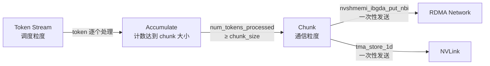
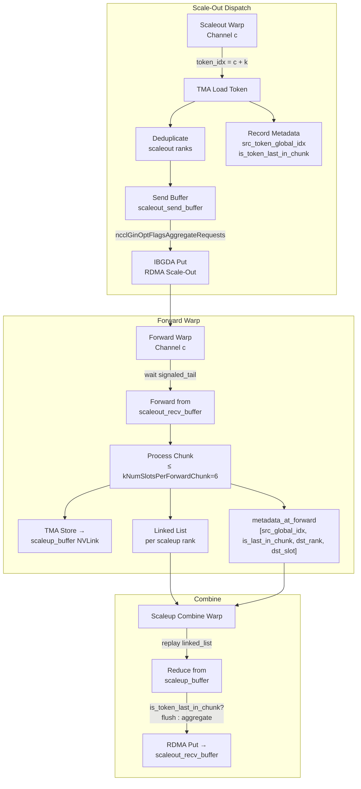
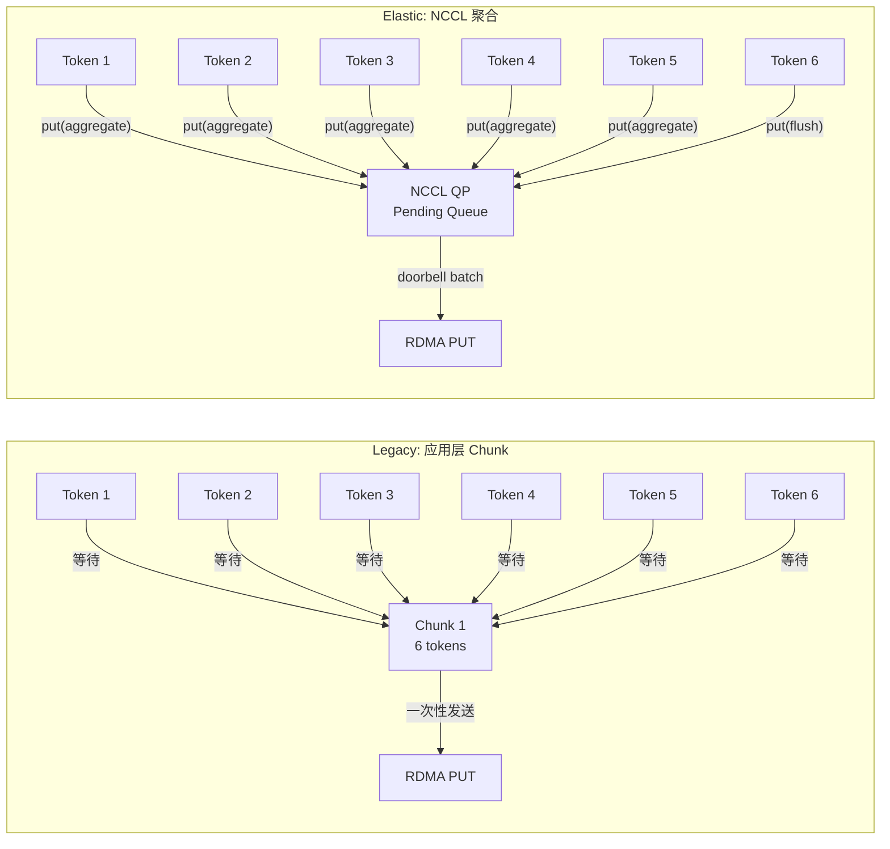

# DeepEP Chunk Streaming 机制深度分析：博客第一性原理 vs 源码实现

> 分析日期：2026-07-30
> 代码版本：DeepEP main 分支
> 博客来源：`/tmp/deep_ep_blog_text.txt`（Understanding GPU Microarchitecture from a Workload Perspective (3): DeepEP's First Principles）

---

## 1. 博客核心主张：Token → Chunk → Network

博客在 Section 2.1 中对 Chunk Streaming 给出了高度凝练的描述：

> **Chunk Buffer**: Critically important. The network is unsuitable for single-Token sends — produces small packets, high startup overhead, low bandwidth utilization. Tokens are aggregated:
>
> **Token Stream → Chunk → Network Transfer**
>
> **Token is the scheduling granularity; Chunk is the communication granularity.**

并在 Section 3 的对比表中强调：

| | Normal Kernel | Low-Latency Kernel |
|---|---|---|
| Chunk | Critical | Reduced |

**博客的论断总结**：
1. Token 是调度粒度（scheduling granularity），Chunk 是通信粒度（communication granularity）
2. Token 必须聚合成 Chunk 才能网络传输，否则小包开销大
3. Normal Kernel 依赖 Chunk，Low-Latency Kernel 弱化 Chunk

---

## 2. Legacy（V1）的 Chunk 机制：显式固定大小 Chunk

### 2.1 Config 结构定义 Chunk 大小

**文件**: `csrc/legacy/config.hpp:24-51`

```cpp
struct Config {
    int num_sms;
    int num_max_nvl_chunked_send_tokens;      // NVL 发送 chunk 大小
    int num_max_nvl_chunked_recv_tokens;      // NVL 接收 chunk 大小
    int num_max_rdma_chunked_send_tokens;     // RDMA 发送 chunk 大小
    int num_max_rdma_chunked_recv_tokens;     // RDMA 接收 chunk 大小
    // ...
};
```

**关键约束**：
- `num_max_rdma_chunked_recv_tokens` 向上对齐到 `num_max_rdma_chunked_send_tokens`
- `num_max_rdma_chunked_send_tokens <= num_max_rdma_chunked_recv_tokens / 2`（防止溢出）

### 2.2 推荐的 Chunk 配置

**文件**: `deep_ep/buffers/legacy.py:245-258`

```python
config_map = {
    2:   Config(Buffer.num_sms, 24, 256, 6, 128),
    4:   Config(Buffer.num_sms, 6, 256, 6, 128),
    8:   Config(Buffer.num_sms, 6, 256, 6, 128),
    16:  Config(Buffer.num_sms, 36, 288, 20, 128),
    24:  Config(Buffer.num_sms, 32, 288, 8, 128),
    32:  Config(Buffer.num_sms, 32, 288, 8, 128),
    48:  Config(Buffer.num_sms, 32, 288, 8, 128),
    64:  Config(Buffer.num_sms, 32, 288, 8, 128),
    96:  Config(Buffer.num_sms, 20, 480, 12, 128),
    128: Config(Buffer.num_sms, 20, 560, 12, 128),
    # Config 参数顺序：num_sms, nvl_chunked_send, nvl_chunked_recv, rdma_chunked_send, rdma_chunked_recv
}
```

**规律**：RDMA chunk send 大小通常在 6-32 之间，NV chunk send 在 1-36 之间，远小于 buffer 总容量。

### 2.3 internode.cu 中的 Chunk 发送逻辑

**文件**: `csrc/kernels/legacy/internode.cu:808-817`（RDMA Sender Coordinator）

```cpp
// Issue RDMA send
auto num_tokens_to_issue = min(num_tokens_processed, num_max_rdma_chunked_send_tokens);
EP_DEVICE_ASSERT(num_tokens_to_issue >= 0 and num_tokens_to_issue <= synced_num_tokens_to_send);
if (dst_rdma_rank != rdma_rank) {
    auto dst_slot_idx = synced_last_issued_tail % num_max_rdma_chunked_recv_tokens;
    EP_DEVICE_ASSERT(dst_slot_idx + num_tokens_to_issue <= num_max_rdma_chunked_recv_tokens);
    const size_t num_bytes_per_msg = num_bytes_per_token * num_tokens_to_issue;
    nvshmemi_ibgda_put_nbi_warp<true>(dst_ptr, src_ptr, num_bytes_per_msg, ...);
}
```

**核心逻辑**：
- 当 `num_tokens_processed >= num_max_rdma_chunked_send_tokens` 时，触发一次 RDMA send
- 每次 send 的 token 数 = `min(已处理 token 数, chunk 大小)`
- 多个 chunk 可流水线化（`last_issued_tail` 滑动）

**文件**: `csrc/kernels/legacy/internode.cu:1833-1884`（NVL Combine Sender）

```cpp
// Iterate over all tokens and send by chunks
int current_rdma_idx = channel_id % kNumRDMARanks;
while (true) {
    // ...
    int num_tokens_in_chunk =
        __shfl_sync(0xffffffff, min(num_max_nvl_chunked_send_tokens, token_end_idx - token_start_idx), current_rdma_idx);

    // Send by chunk
    for (int chunk_idx = 0; chunk_idx < num_tokens_in_chunk; ++chunk_idx, ++token_idx) {
        int dst_slot_idx = (cached_channel_tail_idx++) % num_max_nvl_chunked_recv_tokens_per_rdma;
        // ... TMA store
    }
}
```

### 2.4 Legacy Chunk 的数据流



**Legacy 总结**：Chunk 是 **显式的、固定大小的**，在 kernel 内部通过计数器阈值触发 flush。一次 RDMA/NVL 操作发送一个 Chunk 的全部 token。

---

## 3. Elastic（V2）的 Chunk 机制：Token 级流式 + NCCL 聚合

### 3.1 V2 Direct Dispatch（scaleout=1）：无显式 Chunk

**文件**: `deep_ep/include/deep_ep/impls/dispatch.cuh:280-394`

```cpp
// Iterate all tokens
const auto token_start = dispatch_warp_idx * kNumSMs + sm_idx;
const auto token_stride = kNumDispatchWarps * kNumSMs;
for (int token_idx = token_start; token_idx < num_tokens; token_idx += token_stride) {
    // ... TMA load hidden + SF + topk_idx + topk_weights
    // ... TMA store to send buffer
    // ... TMA NVLink store
    // Issue RDMA put
    if constexpr (not kIsScaleupNVLink) {
        ptx::tma_store_wait<1>();
        __syncwarp();
        if (stored_dst_slot_idx >= 0 and dst_ptr == nullptr) {
            gin.put<team_t>(recv_buffer.get_token_buffer(stored_dst_slot_idx).get_base_ptr(),
                            send_buffer_ptr, tma_buffer.get_num_bytes<false>(), stored_dst_rank_idx);
        }
        __syncwarp();
    }
}
```

**关键发现**：V2 Direct Dispatch 中 **没有显式 Chunk 概念**！
- 每个 token 独立执行 TMA load → shared memory → TMA store → RDMA put
- 没有计数器累积到某个 chunk_size 再触发发送
- Token 是流式逐个处理的（Token Streaming）

### 3.2 Notify Warp 中的聚合标记

**文件**: `deep_ep/include/deep_ep/impls/dispatch.cuh:152-158`

```cpp
// Issue scaleup rank count writes to peers
for (int i = thread_idx; i < kNumRanks; i += kNumNotifyThreads) {
    const auto dst_rank_counter =
        workspace_layout.get_scaleup_rank_count_ptr<false>() + rank_idx;
    gin.put_value<team_t>(dst_rank_counter, static_cast<int64_t>(rank_count[i]), i,
                          ncclGinOptFlagsAggregateRequests);
}
```

这里使用了 `ncclGinOptFlagsAggregateRequests`，这是 **NCCL 层面的请求聚合**，不是 token 层面的 chunk 聚合。

### 3.3 `ncclGinOptFlagsAggregateRequests` 的含义

`ncclGinOptFlagsAggregateRequests` 是 NCCL Gin (GPU Initiated) 的一个 flag，其语义是：

> **告诉 NCCL：这个 put 请求可以延迟发送，等待后续请求聚合后再统一发出**。

当使用该 flag 时，NCCL 内部会：
1. 将请求放入 QP (Queue Pair) 的 pending queue
2. 与后续请求合并（ Doorbell batching / request coalescing ）
3. 在实际 flush 时（调用 `gin.flush()` 或遇到不带 aggregate flag 的请求）统一 doorbell 写入

**这不是 DeepEP 源码层面的 Chunk，而是 NCCL 运行时层面的聚合优化**。

---

## 4. V2 Hybrid Dispatch：显式 Chunk 回归

### 4.1 Forward Warp 的 Chunk 处理

**文件**: `deep_ep/include/deep_ep/impls/hybrid_dispatch.cuh:26-27`

```cpp
int kScaleoutUpdateInterval = 6,
int kNumSlotsPerForwardChunk = kScaleoutUpdateInterval,
```

**文件**: `deep_ep/include/deep_ep/impls/hybrid_dispatch.cuh:528-535`

```cpp
// Process one chunk from the current rank
const auto start_slot_idx = ptx::exchange(stored_scaleout_old_tail_idx, recv_scaleout_rank_idx);
const auto end_slot_idx = std::min(
    ptx::exchange(stored_scaleout_tail_idx, recv_scaleout_rank_idx),
    start_slot_idx + kNumSlotsPerForwardChunk
);
if (lane_idx == recv_scaleout_rank_idx)
    stored_scaleout_old_tail_idx = end_slot_idx;
```

**Hybrid Dispatch 中 Chunk 是显式的**：
- 每次最多处理 `kNumSlotsPerForwardChunk = 6` 个 token
- 处理完后记录 metadata（包括 `is_token_last_in_chunk`）

### 4.2 `is_token_last_in_chunk` 记录

**文件**: `deep_ep/include/deep_ep/impls/hybrid_dispatch.cuh:618-622`

```cpp
// Record metadata at forward
if constexpr (not kReuseSlotIndices) {
    const auto metadata_ptr = token_metadata_at_forward +
        num_tokens_processed * kNumForwardMetadataDims;

    // Source token index and last token index flag
    if (ptx::elect_one_sync()) {
        metadata_ptr[0] = tma_buffer.get_src_token_global_idx_ptr()[0];
        metadata_ptr[1] = slot_idx == (end_slot_idx - 1);  // ← is_token_last_in_chunk
    }
    // ...
}
```

**`is_token_last_in_chunk = (slot_idx == end_slot_idx - 1)`** 标记一个 Chunk 的最后一个 token。

### 4.3 Hybrid Combine：`is_token_last_in_chunk` 触发 RDMA flush

**文件**: `deep_ep/include/deep_ep/impls/hybrid_combine.cuh:371-387`

```cpp
const auto flush_last_tma_and_issue_rdma = [&]() {
    if (last_src_scaleout_rank_idx >= 0 and ptx::elect_one_sync()) {
        ptx::tma_store_wait();

        // Issue only if not local rank
        if (last_src_scaleout_rank_idx != scaleout_rank_idx) {
            gin.put<ncclTeamTagRail>(
                last_recv_token_buffer_ptr,
                last_send_token_buffer_ptr,
                token_layout.get_num_bytes<false>(),
                last_src_scaleout_rank_idx,
                last_is_token_last_in_chunk ? 0 : ncclGinOptFlagsAggregateRequests
                //  ↑↑↑ 关键逻辑 ↑↑↑
            );
        }
    }
    __syncwarp();
};
```

**核心决策逻辑**：
```
if is_token_last_in_chunk:
    flags = 0              → 立即 flush，不聚合
else:
    flags = ncclGinOptFlagsAggregateRequests  → 聚合等待
```

**文件**: `deep_ep/include/deep_ep/impls/hybrid_combine.cuh:482-491`（非 multiple reduction 模式）

```cpp
gin.put<ncclTeamTagRail>(
    recv_buffer_ptr,
    send_buffer_ptr,
    token_layout.get_num_bytes<false>(),
    src_scaleout_rank_idx,
    topk_valid_mask == 0 and is_token_last_in_chunk ? 0 : ncclGinOptFlagsAggregateRequests
);
```

---

## 5. Channel + Linked List：Elastic 的 Token 流组织

### 5.1 Channel 架构

**文件**: `deep_ep/include/deep_ep/impls/hybrid_dispatch.cuh:23-24`

```cpp
int kNumChannelsPerSM = kNumScaleoutWarps,
int kNumChannels = kNumScaleoutWarps * kNumSMs,
int kNumMaxTokensPerChannel = math::constexpr_ceil_div(kNumMaxTokensPerRank, kNumChannels),
```

- 每个 SM 内有 `kNumChannelsPerSM` 个 channel（通常等于 scaleout warps 数）
- 每个 channel 是一个 warp，独立处理一组 token
- Token 按 `token_idx % kNumChannels` 分发到不同 channel

### 5.2 Linked List 机制

**文件**: `deep_ep/include/deep_ep/impls/hybrid_dispatch.cuh:562-575`

```cpp
// Write the per-scaleup channel index for this token
int linked_list_idx = -1;
#pragma unroll
for (int j = 0; j < kNumScaleupRanksPerLane; ++ j) {
    const auto src_lane_idx = stored_dst_scaleup_rank_idx - j * 32;
    const bool valid = 0 <= src_lane_idx and src_lane_idx < 32;
    const auto exchanged = ptx::exchange(
        stored_scaleup_send_counters[j], valid ? src_lane_idx : 0);
    linked_list_idx = valid ? exchanged : linked_list_idx;
}
if (not kReuseSlotIndices and lane_idx < kNumTopk) {
    tma_buffer.get_linked_list_idx_ptr()[lane_idx] = transform_linked_list_idx(linked_list_idx);
    ptx::tma_store_fence();
}
```

**Linked List 的作用**：
- 每个 channel 为每个 scale-up peer 维护一个链表
- 链表索引 = token 在 scale-up 接收 buffer 中的位置
- Combine 时通过重放链表恢复 token 顺序

### 5.3 完整 Token 流



---

## 6. 代码证据汇总

### 6.1 Legacy Chunk 发送触发

| 文件 | 行号 | 代码/逻辑 |
|------|------|-----------|
| `csrc/legacy/config.hpp` | 24-51 | `Config` 定义 `num_max_*_chunked_send/recv_tokens` |
| `csrc/kernels/legacy/internode.cu` | 809 | `if (num_tokens_processed != synced_num_tokens_to_send and num_tokens_processed < num_max_rdma_chunked_send_tokens) continue;` |
| `csrc/kernels/legacy/internode.cu` | 813 | `auto num_tokens_to_issue = min(num_tokens_processed, num_max_rdma_chunked_send_tokens);` |
| `csrc/kernels/legacy/internode.cu` | 1880-1881 | `int num_tokens_in_chunk = __shfl_sync(0xffffffff, min(num_max_nvl_chunked_send_tokens, token_end_idx - token_start_idx), current_rdma_idx);` |
| `csrc/kernels/legacy/internode.cu` | 2014 | `for (int token_start_idx = 0; token_start_idx < num_tokens_to_combine; token_start_idx += num_max_rdma_chunked_send_tokens)` |

### 6.2 Elastic V2 聚合触发

| 文件 | 行号 | 代码/逻辑 |
|------|------|-----------|
| `deep_ep/include/deep_ep/impls/dispatch.cuh` | 157 | `gin.put_value<team_t>(..., ncclGinOptFlagsAggregateRequests);` (notify) |
| `deep_ep/include/deep_ep/impls/hybrid_dispatch.cuh` | 183 | `gin.put<ncclTeamTagRail>(..., ncclGinOptFlagsAggregateRequests);` (notify) |
| `deep_ep/include/deep_ep/impls/hybrid_dispatch.cuh` | 454 | `gin.put<ncclTeamTagRail>(..., ncclGinOptFlagsAggregateRequests);` (scaleout send) |
| `deep_ep/include/deep_ep/impls/hybrid_dispatch.cuh` | 27 | `kNumSlotsPerForwardChunk = kScaleoutUpdateInterval = 6` |
| `deep_ep/include/deep_ep/impls/hybrid_dispatch.cuh` | 621 | `metadata_ptr[1] = slot_idx == (end_slot_idx - 1)` — is_token_last_in_chunk |
| `deep_ep/include/deep_ep/impls/hybrid_combine.cuh` | 382 | `last_is_token_last_in_chunk ? 0 : ncclGinOptFlagsAggregateRequests` |
| `deep_ep/include/deep_ep/impls/hybrid_combine.cuh` | 489 | `topk_valid_mask == 0 and is_token_last_in_chunk ? 0 : ncclGinOptFlagsAggregateRequests` |
| `deep_ep/include/deep_ep/impls/engram_fetch.cuh` | 73 | `(request_idx % kGinQPFlushDepth == (kGinQPFlushDepth - 1)) ? 0 : ncclGinOptFlagsAggregateRequests` |

---

## 7. 准确性评估

### 7.1 博客描述对 Legacy V1 的准确性：**准确**

| 博客主张 | Legacy 代码证据 | 判定 |
|----------|----------------|------|
| "Token is the scheduling granularity" | Token 是 kernel 循环的基本单位，每个 token 独立 TMA load/store | ✅ 准确 |
| "Chunk is the communication granularity" | `num_max_rdma_chunked_send_tokens` / `num_max_nvl_chunked_send_tokens` 定义通信粒度 | ✅ 准确 |
| "Tokens are aggregated: Token Stream → Chunk → Network Transfer" | 代码明确累积 token 直到 chunk_size 再触发 `ibgda_put_nbi` / `tma_store` | ✅ 准确 |
| "Normal Kernel: Chunk Critical" | Normal Kernel 完全依赖 chunk 化发送 | ✅ 准确 |
| "Low-Latency Kernel: Reduced Chunk" | Low-Latency kernel 走 `low_latency_dispatch`，单 token RDMA，无 chunk 聚合 | ✅ 准确 |

### 7.2 博客描述对 Elastic V2 的准确性：**部分准确，需要细化**

| 博客主张 | Elastic 代码证据 | 判定 |
|----------|----------------|------|
| "Token is the scheduling granularity" | V2 Direct: token 逐个循环；V2 Hybrid: token 按 channel 分发 | ✅ 准确 |
| "Chunk is the communication granularity" | V2 Direct: **无显式 chunk**，token 级流式；V2 Hybrid: forward chunk=6 | ⚠️ 有条件成立 |
| "Tokens are aggregated: Token Stream → Chunk → Network" | V2 Direct: Token Stream → **NCCL 聚合** → Network（非显式 chunk） | ⚠️ 需修正 |
| "Normal Kernel: Chunk Critical" | V2 Normal 用 NCCL `AggregateRequests` 替代显式 chunk | ⚠️ 机制不同但效果类似 |

### 7.3 关键差异总结

| 维度 | Legacy V1 | Elastic V2 Direct | Elastic V2 Hybrid |
|------|-----------|-------------------|-------------------|
| Chunk 定义 | 显式，Config 固定大小 | 无显式 chunk | Forward chunk = 6 slots |
| 聚合位置 | kernel 内部计数器 | NCCL Gin 运行时 | NCCL Gin + metadata |
| 触发条件 | `num_processed ≥ chunk_size` | 每个 token 发 put | `is_token_last_in_chunk` 触发 flush |
| 通信粒度 | chunk（6-32 tokens） | 单 token | 单 token（聚合由 NCCL 完成） |
| 博客吻合度 | 高 | 中（博客需补充说明） | 高 |

---

## 8. 深度分析：为什么 V2 要"去 Chunk 化"？

### 8.1 Legacy Chunk 的问题

Legacy 的固定 chunk 大小存在固有缺陷：
1. **延迟与吞吐的权衡**：chunk 越大，带宽利用率越高，但首 token 延迟越大
2. **Buffer 浪费**：recv buffer 必须按 `chunk_recv_size` 对齐，且 `recv ≥ 2 × send`
3. **静态配置**：chunk size 是离线调优的，无法适应动态 token 分布

### 8.2 V2 的解决方案：NCCL 聚合 + Token Streaming

V2 的哲学转变：
```
V1: 应用层 Chunk → 固定阈值 flush → RDMA
V2: Token 流式 → NCCL AggregateRequests → NCCL 运行时决定 flush 时机
```

**优势**：
1. **更低延迟**：首 token 无需等待 chunk 填满即可发出
2. **硬件利用**：NCCL 内部可以 doorbell batching、自适应 coalescing
3. **弹性**：不依赖固定 chunk size 调优

### 8.3 `ncclGinOptFlagsAggregateRequests` 的实际效果



**本质相同，但决策者不同**：
- V1：应用代码决定何时 flush（chunk_size 阈值）
- V2：NCCL 运行时决定何时 flush（QP 压力、doorbell 时机）

---

## 9. 结论

### 9.1 博客第一性原理的评价

博客的 **"Token → Chunk → Network Transfer"** 描述：

1. **对 Legacy V1**：**完全准确**，Chunk 是显式的、应用层控制的通信粒度
2. **对 Elastic V2 Direct**：**需要修正**，实际是 **"Token → NCCL AggregateRequests → Network"**，chunk 被 NCCL 运行时的请求聚合替代
3. **对 Elastic V2 Hybrid**：**准确**，forward warp 仍有显式 chunk（6 slots），combine 通过 `is_token_last_in_chunk` 触发 flush

### 9.2 更深层的洞察

> **从 V1 到 V2 的演进，是"通信粒度决策权从应用层下沉到通信运行时层"的体现。**

- V1 假设：应用最了解何时聚合 → 固定 chunk size
- V2 假设：NCCL 运行时能更好地自适应聚合 → `AggregateRequests` flag

这与 NCCL 整体演进方向一致：**把更多的通信调度决策交给网络层**，应用层只提供 hints（aggregate or flush），而不是硬性规定。

### 9.3 建议修正

博客若要更精确描述 V2，可将：

> "Token is the scheduling granularity; Chunk is the communication granularity."

修正为：

> "Token is the scheduling granularity; in Legacy, Chunk is the communication granularity; in Elastic, the communication granularity is managed by NCCL's request aggregation (`ncclGinOptFlagsAggregateRequests`), with explicit chunking only in the Hybrid forward path."

---

## 附录：关键文件路径索引

| 文件 | 作用 |
|------|------|
| `csrc/legacy/config.hpp` | Legacy Config（含 chunk 大小） |
| `csrc/kernels/legacy/internode.cu` | Legacy internode dispatch/combine kernel |
| `deep_ep/buffers/legacy.py` | Legacy Python buffer 接口 |
| `deep_ep/buffers/elastic.py` | Elastic Python buffer 接口 |
| `deep_ep/include/deep_ep/impls/dispatch.cuh` | Elastic Direct dispatch kernel |
| `deep_ep/include/deep_ep/impls/hybrid_dispatch.cuh` | Elastic Hybrid dispatch kernel |
| `deep_ep/include/deep_ep/impls/combine.cuh` | Elastic Direct combine kernel |
| `deep_ep/include/deep_ep/impls/hybrid_combine.cuh` | Elastic Hybrid combine kernel |
| `deep_ep/include/deep_ep/common/layout.cuh` | Buffer/Token/Workspace 布局 |
| `csrc/elastic/buffer.hpp` | Elastic C++ buffer 实现 |
| `csrc/kernels/elastic/dispatch.hpp` | Elastic JIT dispatch runtime |
