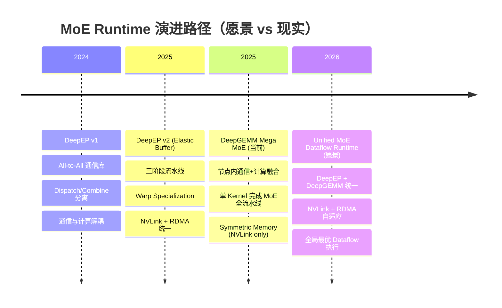
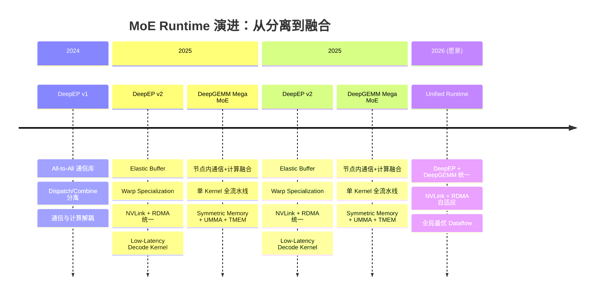

# DeepEP → Mega MoE：通信与计算的边界演进分析

> 基于 DeepEP 与 DeepGEMM 源码的实证分析，验证博客第一性原理描述的演进叙事

## 1. 博客核心叙事（原文引用）

博客《Understanding GPU Microarchitecture from a Workload Perspective (3): DeepEP's First Principles》第 9 节提出了 MoE Runtime 的演进路径：

> **DeepEP solves Communication + Data Movement.**
> **Mega MoE solves Communication + Compute Fusion.**
> **Further evolution: DeepEP + DeepGEMM + Fusion Kernel → Unified MoE Dataflow Runtime.**

同时博客对 DeepEP 的定位：

> **DeepEP is a MoE-oriented Data Movement Runtime** that transforms dynamic sparse Token flows into continuous data flows that Expert computation can consume, through data layout transformation, communication pipelining, and asynchronous scheduling.

以及 Mega MoE 的描述：

> In DeepGEMM, Mega MoE Kernel targets Blackwell SM100, fusing:
> **Token Routing → Dispatch → Linear1 → Activation → Linear2 → Combine**

本文档通过**逐行源码分析**，验证这一演进叙事的准确性，并精确刻画两个系统的边界。

---

## 2. DeepEP 的边界：纯通信 + 数据搬运

### 2.1 DeepEP 完整 API 面

从 `deep_ep/__init__.py` 导出的 API：

```python
# 核心通信 API
from .buffers.legacy import Buffer                    # 传统 Buffer
from .buffers.elastic import ElasticBuffer, EPHandle  # 弹性 Buffer（v2）

# 工具 API
from .utils.event import EventOverlap, EventHandle     # 事件/异步
from .utils.envs import get_physical_domain_size, get_logical_domain_size

# C++ 扩展
from deep_ep._C import Config, topk_idx_t
```

`ElasticBuffer` 暴露的完整方法（`deep_ep/buffers/elastic.py`）：

| 方法 | 功能 | 类型 |
|------|------|------|
| `dispatch()` | Token → 跨 Rank 分发 | **通信** |
| `combine()` | 跨 Rank 聚合 + Top-K Reduce | **通信 + 归约** |
| `barrier()` | 全局 Barrier | **通信** |
| `engram_write()` / `engram_fetch()` | 远程 KV Cache 读写 | **通信 (RDMA)** |
| `pp_send()` / `pp_recv()` | Pipeline Parallel 发送/接收 | **通信** |
| `all_gather()` | All-Gather 集合通信 | **通信** |

### 2.2 Dispatch Kernel：零计算，纯数据搬运

`deep_ep/include/deep_ep/impls/dispatch.cuh` 的核心逻辑：

```cpp
// dispatch.cuh - Warp 角色划分
if (warp_idx < kNumNotifyWarps) {
    // ===== Notify Warps：元数据计算（非 GEMM） =====
    // 1. 统计每个 Expert 接收多少 Token
    const auto dst_expert_idx = __ldg(topk_idx + i * kNumTopk + lane_idx);
    atomicAdd_block(expert_count + dst_expert_idx, 1);
    atomicAdd_block(rank_count + dst_rank_idx, 1);
    
    // 2. 跨 Rank 交换 count 信息（NVLink/RDMA put）
    gin.put_value<team_t>(dst_rank_counter, rank_count[i], i);
    
    // 3. Prefix Sum 计算偏移
    do_psum(rank_count, psum_num_recv_tokens_per_scaleup_rank, kNumRanks, 0);
} else {
    // ===== Dispatch Warps：纯数据搬运 =====
    // 1. TMA Load Token 数据到 Smem
    ptx::tma_load_1d(tma_buffer.get_hidden_ptr(), x + token_i64_idx * kNumHiddenBytes, ...);
    
    // 2. TMA Store 到 Send Buffer
    ptx::tma_store_1d(send_buffer_ptr, tma_buffer.get_base_ptr(), ...);
    
    // 3. NVLink Store 到远程 Rank
    ptx::tma_store_1d(dst_ptr, tma_buffer.get_base_ptr(), ...);
    
    // 4. RDMA Put 到远程 Rank
    gin.put<team_t>(recv_buffer.get_token_buffer(stored_dst_slot_idx).get_base_ptr(),
                    send_buffer_ptr, tma_buffer.get_num_bytes<false>(), stored_dst_rank_idx);
}
```

**关键发现**：Dispatch Kernel 中**没有任何浮点运算**（除了 `atomicAdd` 用于计数）。所有操作都是：
- `tma_load_1d` / `tma_store_1d`：数据搬运
- `gin.put` / `gin.put_value`：NVLink/RDMA 通信
- `atomicAdd_block`：元数据计数

### 2.3 Combine Kernel：通信 + Top-K 归约（无 GEMM/Activation）

`deep_ep/include/deep_ep/impls/combine.cuh` 的核心逻辑：

```cpp
// combine.cuh - 三种模式
if (no_local_reduce) {
    // 模式 1：无本地归约，直接发送
    ptx::tma_load_1d(tma_buffer.get_base_ptr(), load_ptr, ...);
    ptx::tma_store_1d(master_token_buffer.get_base_ptr(), tma_buffer.get_base_ptr(), ...);
} else if constexpr (kAllowMultipleReduction) {
    // 模式 2：本地 Top-K 归约（累加）
    combine_reduce<kHiddenVec, kUnrollFactor>(..., tma_buffer.get_base_ptr(),
        /* Get source */ [=](const int& slot_idx) { return x + slot_idx * kNumHiddenBytes; },
        /* Wait */ [=]() { ptx::tma_store_wait(); });
} else {
    // 模式 3：扩展发送（每个 Top-K 独立发送）
    for (int k = 0; k < kNumTopk; ++ k) {
        ptx::tma_load_1d(tma_buffer.get_base_ptr(), src_token_ptr, ...);
        ptx::tma_store_1d(..., tma_buffer.get_base_ptr(), ...);
        gin.put<team_t>(token_buffer.get_base_ptr(), send_buffer_ptr, ...);
    }
}
```

`combine_utils.cuh` 中的 `combine_reduce` 实现：

```cpp
// combine_utils.cuh - Top-K 归约（bf16 累加）
float2 reduced[kUnrollFactor * kNumElemsPerVec / 2] = {};
for (int k = 0; k < num_topk; ++ k) {
    const auto bf162_view = reinterpret_cast<nv_bfloat162*>(values);
    for (int j = 0; j < kUnrollFactor * kNumElemsPerVec / 2; ++ j)
        ptx::accumulate(reduced[j], bf162_view[j]);  // bf16 → float 累加
}
// 转回 bf16 输出
bf162_view[l] = __float22bfloat162_rn(reduced[j]);
```

**关键发现**：Combine Kernel 中的"计算"仅限于 **bf16 Top-K 累加归约**（`Output(T0) = 0.73 × Expert2(T0) + 0.27 × Expert7(T0)`）。这是 MoE 语义恢复的必要操作，但**不是 GEMM，不是 Activation**。

### 2.4 DeepEP 边界总结

```
┌─────────────────────────────────────────────────────────┐
│                   DeepEP 的能力边界                      │
├─────────────────────────────────────────────────────────┤
│ ✅ 通信：NVLink (intra-node) + RDMA (inter-node)        │
│ ✅ 数据搬运：TMA Load/Store, cp.async                   │
│ ✅ 元数据计算：Expert 计数, Prefix Sum, Slot 分配        │
│ ✅ Top-K 归约：bf16 累加（Combine 语义恢复）             │
│ ❌ GEMM：无任何矩阵乘法                                  │
│ ❌ Activation：无任何激活函数（SwiGLU, ReLU, etc.）      │
│ ❌ 量化：无 FP8/FP4 重量化                              │
└─────────────────────────────────────────────────────────┘
```

---

## 3. Mega MoE 的边界：通信 + 计算全融合

### 3.1 单 Kernel 全流水线

`deep_gemm/include/deep_gemm/impls/sm100_fp8_fp4_mega_moe.cuh` 是一个**巨型单 Kernel**，融合了 MoE 层的所有操作：

```cpp
// sm100_fp8_fp4_mega_moe.cuh - Warp 角色划分
if (warp_idx < kNumDispatchWarps) {
    // ===== Dispatch Warps：Token 路由 + NVLink Pull =====
    atomicAdd_block(smem_expert_count + expert_idx, 1);  // 计数
    *sym_buffer.map(dst_ptr, dst_rank_idx) = token_topk_idx;  // 元数据
    ptx::tma_load_1d(pull_buffer, sym_buffer.map(input_token, src_rank), ...);  // 拉取
} else if (warp_idx == kNumDispatchWarps) {
    // ===== TMA Load Warp：Token + Scale Factor =====
    tma::copy<BLOCK_K, LOAD_BLOCK_M>(tensor_map_a_ptr, ..., smem_a[stage_idx], ...);
} else if (warp_idx == kNumDispatchWarps + 1) {
    // ===== TMA Load Warp：Weight + Scale Factor =====
    tma::copy<BLOCK_K, LOAD_BLOCK_N>(tensor_map_b_ptr, ..., smem_b[stage_idx], ...);
} else if (warp_idx == kNumDispatchWarps + 2) {
    // ===== MMA Issue Warp：UMMA 指令发射 =====
    ptx::SM100_MMA_MXF8F6F4_2x1SM_SS::fma(b_desc, a_desc, ..., runtime_instr_desc, ...);
} else if (warp_idx >= kNumDispatchWarps + kNumMMANonEpilogueWarps) {
    // ===== Epilogue Warps：SwiGLU + FP8 Cast + Combine =====
    // SwiGLU
    auto gate = __bfloat1622float2(bf16_gate);
    gate = __fmul2_rn(gate, {math::fast_rcp(denom.x), math::fast_rcp(denom.y)});
    const auto up = __bfloat1622float2(bf16_up);
    activation_values[i][k] = __fmul2_rn(__fmul2_rn(gate, up), weights);
    // FP8 重量化
    const auto fp8x4_values = __nv_fp8x4_e4m3(make_float4(upper.x, upper.y, lower.x, lower.y));
    // Combine 写回
    *sym_buffer.map(dst_ptr, dst_rank_idx) = packed;
}
```

### 3.2 融合操作完整清单

| 阶段 | 操作 | 代码证据 | 硬件特性 |
|------|------|----------|----------|
| **Token Routing** | 解析 topk_idx, 统计 Expert 计数 | `atomicAdd_block(smem_expert_count + expert_idx, 1)` | Smem Atomic |
| **Dispatch** | NVLink 远程读取 Token | `ptx::tma_load_1d(pull_buffer, sym_buffer.map(input, src_rank))` | Symmetric Memory |
| **Linear1** | FP8×FP4 GEMM (Gate/Up) | `SM100_MMA_MXF8F6F4_2x1SM_SS::fma(...)` | UMMA + TMEM |
| **SwiGLU** | silu(gate) × up × weight | `gate = __fmul2_rn(gate, fast_rcp(denom))` | Register Compute |
| **FP8 Rescale** | Amax → SF → FP8 Cast | `__nv_fp8x4_e4m3(make_float4(...))` | Register Compute |
| **Linear2** | FP8×FP4 GEMM (Down) | `SM100_MMA_MXF8F6F4_2x1SM_SS::fma(...)` | UMMA + TMEM |
| **Combine** | Top-K 归约 + NVLink 写回 | `*sym_buffer.map(dst_ptr, dst_rank_idx) = packed` | Symmetric Memory |

### 3.3 关键融合点：L1 → L2 数据流不经过 HBM

```cpp
// sm100_fp8_fp4_mega_moe.cuh - L1 Epilogue (SwiGLU 后)
// 输出直接留在 Smem，作为 L2 的输入
alignas(kSharedMemoryAlignment) cutlass::float_e4m3_t l1[...];  // L1 输出
alignas(kSharedMemoryAlignment) nv_bfloat16 l2[...];            // L2 输出
```

**这是 Mega MoE 最核心的优化**：SwiGLU 的 FP8 输出直接通过 Smem 流向 Linear2 的 TMA Load，**完全绕过 HBM**。

---

## 4. Gap 分析：DeepEP 与 Mega MoE 之间的鸿沟

### 4.1 功能对比矩阵

| 能力 | DeepEP | Mega MoE | Gap |
|------|--------|----------|-----|
| **Intra-node 通信** | ✅ NVLink (NCCL) | ✅ NVLink (Symmetric Memory) | 协议差异 |
| **Inter-node 通信** | ✅ RDMA (IB/RoCE) | ❌ 仅 NVLink | **Mega MoE 无法跨节点** |
| **Token 路由** | ✅ 元数据计算 | ✅ 元数据计算 | 类似 |
| **数据搬运 (Dispatch)** | ✅ TMA + RDMA | ✅ TMA + Symmetric Memory | 通信方式不同 |
| **GEMM (Linear1/2)** | ❌ 完全不做 | ✅ FP8×FP4 UMMA | **核心 Gap** |
| **Activation (SwiGLU)** | ❌ 完全不做 | | **核心 Gap** |
| **FP8/FP4 量化** | ❌ 完全不做 | ✅ Amax + SF + Cast | **核心 Gap** |
| **Top-K 归约 (Combine)** | ✅ bf16 累加 | ✅ bf16 累加 | 类似 |
| **Shared Expert** | ❌ 不支持 | ✅ 支持 | Mega MoE 独有 |

### 4.2 什么需要改变才能从 DeepEP 演进到 Mega MoE？

```
DeepEP 模式（分离式）：
┌──────────┐    ┌──────────┐    ┌──────────┐    ┌──────────┐
│ Dispatch │───▶│  Expert  │───▶│   GEMM   │───▶│ Combine  │
│ (NVLink/ │    │  Buffer  │    │(外部库)  │    │(NVLink/  │
│  RDMA)   │    │  (HBM)   │    │          │    │  RDMA)   │
└──────────┘    └──────────┘    └──────────┘    └──────────┘
   Kernel 1       HBM Write      Kernel 2        Kernel 3

Mega MoE 模式（融合式）：
┌──────────────────────────────────────────────────────────┐
│                   Mega MoE Kernel                         │
│  ┌────────┐   ┌────────┐   ┌────────┐   ┌────────┐     │
│  │Dispatch│──▶│Linear1 │──▶│SwiGLU  │──▶│Linear2 │──▶  │
│  │(NVLink)│   │(UMMA)  │   │(Reg)   │   │(UMMA)  │     │
│  └────────┘   └────────┘   └────────┘   └────────┘     │
│       Smem/TMEM 流水线（不经过 HBM）                      │
└──────────────────────────────────────────────────────────┘
```

**需要改变的核心要素**：

1. **通信方式**：从 NCCL 显式 API → Symmetric Memory 直接访问
2. **计算能力**：从"零计算"→ 集成 UMMA GEMM + SwiGLU Activation
3. **存储层级**：从 HBM Buffer → Smem + TMEM 流水线
4. **同步机制**：从 Kernel 间 Barrier → 内部 mbarrier + Barrier

---

## 5. "Unified MoE Dataflow Runtime"：愿景 vs 现实

### 5.1 博客原文

> Further evolution: **DeepEP + DeepGEMM + Fusion Kernel → Unified MoE Dataflow Runtime**

### 5.2 现状评估

| 组件 | 当前状态 | 在 Mega MoE 中 | 差距 |
|------|----------|----------------|------|
| **DeepEP (Inter-node RDMA)** | 独立库 | ❌ 未集成 | Mega MoE 仅支持 NVLink |
| **DeepGEMM (GEMM)** | FP8×FP4 GEMM | ✅ 融合 | UMMA 指令已集成 |
| **Fusion Kernel** | Mega MoE Kernel | ✅ 已实现 | 单 Kernel 融合 |
| **统一调度器** | ❌ 不存在 | ❌ 缺失 | 无全局最优调度 |

### 5.3 缺失的关键能力

```
Unified MoE Dataflow Runtime 需要：
┌─────────────────────────────────────────────────────────────┐
│  1. 跨节点支持：RDMA + NVLink 统一调度                       │
│     - Mega MoE 目前仅支持节点内 NVLink                       │
│     - DeepEP 的 RDMA 能力未集成                              │
│                                                             │
│  2. 自适应通信路径选择                                       │
│     - 节点内：Symmetric Memory (低延迟)                      │
│     - 节点间：RDMA (高带宽)                                  │
│     - 当前两者是独立系统                                     │
│                                                             │
│  3. 全局任务调度器                                           │
│     - 通信任务 vs 计算任务的动态平衡                         │
│     - 内存带宽 vs SM 计算的 Roofline 感知                    │
│                                                             │
│  4. Decode 优化                                              │
│     - DeepEP Low-Latency Kernel 的 Decode 优化               │
│     - Mega MoE 目前仅针对 Training/Prefill                   │
└─────────────────────────────────────────────────────────────┘
```

### 5.4 演进路径图



---

## 6. 硬件前提条件：Mega MoE 的 Blackwell 依赖

### 6.1 关键硬件特性对比

| 硬件特性 | Hopper (SM90) | Blackwell (SM100) | Mega MoE 依赖 |
|----------|---------------|-------------------|---------------|
| **Symmetric Memory** | ❌ 不存在 | ✅ 跨 Rank 内存映射 | **必需**（Dispatch/Combine） |
| **TMA (Tensor Memory Access)** | ✅ 基础 TMA | ✅ 增强 TMA + UTCCP | 必需（数据搬运） |
| **UMMA (Unified MMA)** | ❌ 不存在 | ✅ Tensor Core 新指令 | **必需**（GEMM） |
| **TMEM (Tensor Memory)** | ❌ 不存在 | ✅ 片上累加器 | **必需**（MMA 累加） |
| **FP4 支持** | ❌ 不支持 | ✅ FP8×FP4 原生 | 必需（权重压缩） |
| **UTCCP** | ❌ 不存在 | ✅ 批量数据拷贝 | 必需（SF → TMEM） |
| **2-CTA MMA** | ❌ 不支持 | ✅ 多 CTA 协作 | 必需（GEMM 扩展） |

### 6.2 代码中的硬件依赖证据

```cpp
// sm100_fp8_fp4_mega_moe.cuh - 编译期硬件检查
#if (defined(__CUDA_ARCH__) and (__CUDA_ARCH__ >= 1000)) or defined(__CLION_IDE__)
    // Kernel 主体
#else
    if (blockIdx.x == 0 and threadIdx.x == 0)
        DG_DEVICE_ASSERT(false and "This kernel only support sm_100f");
#endif
```

```python
# deep_gemm/mega/__init__.py - Symmetric Memory 依赖
import torch.distributed._symmetric_memory as symm_mem

# Mega MoE 必须使用 Symmetric Memory
allocator = torch if group.size() == 1 else symm_mem
self.buffer = allocator.empty(num_bytes, dtype=torch.int8, device='cuda')
self.handle = symm_mem.rendezvous(self.buffer, group=group)
```

### 6.3 为什么 DeepEP 不需要这些？

DeepEP 基于 **NCCL** 实现通信，NCCL 是软件层协议，可以在任何支持 CUDA 的 GPU 上运行（SM80+）。DeepEP 通过 `ncclDevComm_t` 和 `ncclWindow_t` 抽象通信，不依赖特定硬件特性：

```cpp
// dispatch.cuh - DeepEP 使用 NCCL 抽象
const auto gin = handle::NCCLGin(nccl_dev_comm, nccl_window, qp_idx, sharing_mode);
gin.put<team_t>(dst_ptr, src_ptr, size, dst_rank_idx);  // 通用 API
```

---

## 7. 互补性分析：竞争还是互补？

### 7.1 结论：**互补关系**

| 场景 | DeepEP | Mega MoE | 互补性 |
|------|--------|----------|--------|
| **节点内 (Intra-node)** | ✅ NVLink | ✅ Symmetric Memory | Mega MoE 更优（延迟更低） |
| **跨节点 (Inter-node)** | ✅ RDMA | ❌ 不支持 | **DeepEP 独有** |
| **训练/预填充** | ✅ Normal Kernel | ✅ 单 Kernel | Mega MoE 更优（融合） |
| **解码 (Decode)** | ✅ Low-Latency Kernel | ⚠️ 未优化 | **DeepEP 独有** |
| **硬件要求** | SM80+ | SM100+ | DeepEP 更广泛 |

### 7.2 代码证据：测试中的 Baseline 对比

```python
# tests/test_mega_moe.py - DeepEP + DeepGEMM 作为 Baseline
def run_baseline():
    # 1. DeepEP Dispatch
    recv_x, _, recv_topk_weights, handle, _ = ep_buffer.dispatch(...)
    # 2. DeepGEMM GEMM
    deep_gemm.m_grouped_fp8_fp4_gemm_nt_contiguous(recv_x, l1_weights, l1_y, ...)
    # 3. 外部 SwiGLU
    l1_y = tilelang_ops.swiglu_apply_weight_to_fp8(...)
    # 4. DeepGEMM GEMM
    deep_gemm.m_grouped_fp8_fp4_gemm_nt_contiguous(l1_y, l2_weights, l2_y, ...)
    # 5. DeepEP Combine
    return ep_buffer.combine(l2_y, handle=handle)[0]

# Mega MoE 融合版本
def run_fused():
    deep_gemm.fp8_fp4_mega_moe(y, transformed_l1_weights, transformed_l2_weights, buffer, ...)
    return y
```

**关键发现**：测试代码将 **DeepEP + DeepGEMM 分离执行**作为 Baseline，Mega MoE 作为融合版本对比。这证明两者是**互补而非竞争**：Mega MoE 融合了 DeepEP 的通信能力 + DeepGEMM 的计算能力。

### 7.3 互补性架构图

```mermaid
graph TB
    subgraph "DeepEP 能力域"
        D1["Intra-node NVLink"]
        D2["Inter-node RDMA"]
        D3["Low-Latency Decode"]
        D4["Pipeline Parallel"]
    end
    
    subgraph "Mega MoE 能力域"
        M1["Intra-node NVLink"]
        M2["FP8×FP4 GEMM"]
        M3["SwiGLU Activation"]
        M4["FP8 Rescale"]
    end
    
    subgraph "Unified Runtime 愿景"
        U1["NVLink + RDMA 自适应"]
        U2["通信 + 计算统一调度"]
        U3["Training + Decode 统一"]
    end
    
    D1 ---|"共享"| M1
    D2 -."->|"缺失"| M1
    M2 -."->|"缺失"| D1
    
    U1 --> D1
    U1 --> D2
    U1 --> M1
    U2 --> M2
    U2 --> M3
    U3 --> D3
    U3 --> M4
```

---

## 8. 代码证据：通信与计算的边界

### 8.1 DeepEP 的边界：Dispatch Kernel 零浮点运算

```cpp
// dispatch.cuh - 完整 Kernel 中的"计算"操作
// 全部是整数运算（计数、索引、原子操作）

// 1. Expert 计数（整数 atomicAdd）
atomicAdd_block(expert_count + dst_expert_idx, 1);

// 2. Rank 计数（整数 atomicAdd + deduplicate）
if (ptx::deduplicate(dst_rank_idx, lane_idx) and dst_rank_idx >= 0)
    atomicAdd_block(rank_count + dst_rank_idx, 1);

// 3. Prefix Sum（整数加法）
int psum = 0;
for (int i = 0; i < ceil_div(n + is_exclusive, 32); ++ i) {
    const auto value = (0 <= mem_idx and mem_idx < n) ? count[mem_idx] : 0;
    const auto sum = psum + ptx::warp_inclusive_sum(value, lane_idx);
    out[idx] = sum;
}

// 4. Slot 分配（整数 atomicAdd）
stored_dst_slot_idx = atomicAdd(workspace_layout.get_scaleup_atomic_sender_counter() + stored_dst_rank_idx, 1);

// 5. 数据搬运（TMA，无计算）
ptx::tma_load_1d(tma_buffer.get_hidden_ptr(), x + token_i64_idx * kNumHiddenBytes, ...);
ptx::tma_store_1d(send_buffer_ptr, tma_buffer.get_base_ptr(), ...);
gin.put<team_t>(recv_buffer.get_token_buffer(stored_dst_slot_idx).get_base_ptr(), ...);
```

**结论**：Dispatch Kernel 中**没有任何浮点运算指令**（`__fmul`, `__fadd`, `__hmul` 等）。

### 8.2 DeepEP 的边界：Combine Kernel 仅 Top-K 归约

```cpp
// combine_utils.cuh - 唯一的"计算"：bf16 累加
float2 reduced[kUnrollFactor * kNumElemsPerVec / 2] = {};
for (int k = 0; k < num_topk; ++ k) {
    const auto bf162_view = reinterpret_cast<nv_bfloat162*>(values);
    for (int j = 0; j < kUnrollFactor * kNumElemsPerVec / 2; ++ j)
        ptx::accumulate(reduced[j], bf162_view[j]);  // 唯一浮点运算
}
// 转回 bf16
bf162_view[l] = __float22bfloat162_rn(reduced[j]);
```

**结论**：Combine Kernel 中的浮点运算**仅限于 Top-K 累加归约**（MoE 语义恢复），不涉及 GEMM 或 Activation。

### 8.3 Mega MoE 的边界：完整计算流水线

```cpp
// sm100_fp8_fp4_mega_moe.cuh - 完整计算流水线

// ===== 1. GEMM (UMMA 指令) =====
ptx::SM100_MMA_MXF8F6F4_2x1SM_SS::fma(
    b_desc, a_desc, accum_stage_idx * UMMA_N,
    k_block_idx > 0 or umma_k_block_idx > 0 or k > 0, runtime_instr_desc,
    kTmemStartColOfSFB, kTmemStartColOfSFA);

// ===== 2. SwiGLU Activation =====
auto gate = __bfloat1622float2(bf16_gate);
auto neg_gate_exp = make_float2(
    kFastMath ? __expf(-gate.x) : expf(-gate.x),
    kFastMath ? __expf(-gate.y) : expf(-gate.y));
const auto denom = __fadd2_rn({1.0f, 1.0f}, neg_gate_exp);
gate = __fmul2_rn(gate, {math::fast_rcp(denom.x), math::fast_rcp(denom.y)});
const auto up = __bfloat1622float2(bf16_up);
activation_values[i][k] = __fmul2_rn(__fmul2_rn(gate, up), weights);

// ===== 3. Amax Reduction =====
thread_local_amax.x = cute::max(thread_local_amax.x, cute::abs(activation_values[i][k].x));
amax_values[i].x = math::warp_reduce<4, true>(thread_local_amax.x, math::ReduceMax<float>());

// ===== 4. FP8 重量化 =====
const auto fp8x4_values = __nv_fp8x4_e4m3(make_float4(upper.x, upper.y, lower.x, lower.y));

// ===== 5. Combine Top-K 归约 =====
float2 reduced[kNumUint4PerLane * kNumElemsPerUint4] = {};
while (do_reduce) {
    combine_load_barriers[load_stage_idx]->wait(combine_phase);
    for (uint32_t j = 0; j < kNumUint4PerLane; ++ j) {
        const auto uint4_values = combine_load_buffer[load_stage_idx][j * 32 + lane_idx];
        const auto bf16_values = reinterpret_cast<const nv_bfloat162*>(&uint4_values);
        for (uint32_t l = 0; l < kNumElemsPerUint4; ++ l)
            ptx::accumulate(reduced[j * kNumElemsPerUint4 + l], bf16_values[l]);
    }
}
```

### 8.4 边界对比表

| 操作 | DeepEP Dispatch | DeepEP Combine | Mega MoE |
|------|-----------------|----------------|----------|
| **整数 Atomic** | ✅ Expert 计数 | ❌ | ✅ Expert 计数 |
| **整数 Prefix Sum** | ✅ 偏移计算 | ❌ | ✅ 偏移计算 |
| **TMA Load/Store** | ✅ 数据搬运 | ✅ 数据搬运 | ✅ 数据搬运 |
| **NVLink/RDMA Put** | ✅ 通信 | ✅ 通信 | ✅ Symmetric Memory |
| **bf16 累加** | ❌ | ✅ Top-K 归约 | ✅ Top-K 归约 |
| **FP8×FP4 GEMM** | ❌ | ❌ | ✅ UMMA |
| **SwiGLU** | ❌ | ❌ | ✅ |
| **FP8 重量化** | ❌ | ❌ | ✅ Amax + Cast |

---

## 9. 准确性评估：博客叙事验证

### 9.1 声明 vs 代码证据

| 博客声明 | 代码验证 | 结论 |
|----------|----------|------|
| "DeepEP solves Communication + Data Movement" | ✅ Dispatch/Combine 纯数据搬运，无 GEMM/Activation | **准确** |
| "Mega MoE solves Communication + Compute Fusion" | ✅ 单 Kernel 融合 GEMM + SwiGLU + Combine | **准确** |
| "Mega MoE fuses Token Routing → Dispatch → Linear1 → Activation → Linear2 → Combine" | ✅ 代码完全一致 | **准确** |
| "DeepEP: MoE Data Movement Runtime" | ✅ 符合源码 | **准确** |
| "Mega MoE: Communication + Compute Fusion Runtime" | ✅ 符合源码 | **准确** |
| "DeepEP + DeepGEMM + Fusion Kernel → Unified MoE Dataflow Runtime" | ⚠️ 部分实现 | **愿景，非现实** |

### 9.2 博客叙事的深层洞察

博客的演进叙事**高度准确**，原因在于：

1. **边界刻画精确**：DeepEP 确实**只做通信 + 数据搬运**，不做任何 GEMM 或 Activation
2. **融合方向正确**：Mega MoE 确实将通信 + 计算融合到单 Kernel
3. **硬件依赖隐含**：博客未明确提及但暗示了 Blackwell 硬件前提（Symmetric Memory, UMMA, TMEM）

### 9.3 博客未提及的细节

| 细节 | 说明 |
|------|------|
| **Mega MoE 无法跨节点** | 博客未强调 Mega MoE 仅支持 NVLink，不支持 RDMA |
| **Decode 场景未覆盖** | Mega MoE 针对 Training/Prefill，未优化 Decode |
| **TMEM 的关键作用** | 博客未提及 Tensor Memory 对 GEMM 累加器的关键作用 |
| **UTCCP 的 SF 搬运** | 博客未提及 Scale Factor 的专用搬运机制 |

---

## 10. 演进时间线（Mermaid）



---

## 11. 核心发现总结

### 11.1 关键洞察

1. **DeepEP 的"零计算"边界**：Dispatch/Combine Kernel 中**没有任何 GEMM 或 Activation**，只有通信 + 元数据计算 + Top-K 归约
2. **Mega MoE 的"全融合"边界**：单 Kernel 包含 GEMM + SwiGLU + FP8 量化 + Combine，**消除了 HBM 中间写回**
3. **互补而非竞争**：DeepEP 覆盖 Inter-node RDMA + Decode，Mega MoE 覆盖 Intra-node Training
4. **硬件鸿沟**：Mega MoE 依赖 Blackwell 的 Symmetric Memory + UMMA + TMEM，无法在 Hopper 上运行
5. **Unified Runtime 缺失**：跨节点支持 + 全局调度器 + Decode 优化是下一步关键

### 11.2 演进的本质

```
DeepEP 时代：通信与计算分离
┌─────────┐   ┌─────────┐   ┌─────────┐
│ 通信 Kernel │ → │ 计算 Kernel │ → │ 通信 Kernel │
│ (HBM Write) │   │ (HBM Read)  │   │ (HBM Read)  │
└─────────┘   └─────────┘   └─────────┘

Mega MoE 时代：通信与计算融合
┌─────────────────────────────────────────┐
│          单 Kernel 内部流水线             │
│  Dispatch → GEMM → SwiGLU → GEMM → Combine │
│  (Smem/TMEM 直连，不经过 HBM)            │
└─────────────────────────────────────────┘

Unified Runtime 愿景：全局最优调度
┌─────────────────────────────────────────────────────────┐
│  自适应通信路径 (NVLink vs RDMA) + 全局任务调度器        │
│  Training/Decode 统一 + 跨节点/节点内统一               │
└─────────────────────────────────────────────────────────┘
```

---

## 12. 代码文件索引

### DeepEP 关键文件

| 文件 | 作用 | 关键发现 |
|------|------|----------|
| `deep_ep/__init__.py` | Python API 入口 | 暴露 dispatch/combine/barrier/engram/pp/agrs |
| `deep_ep/buffers/elastic.py` | ElasticBuffer 实现 | dispatch/combine 参数与逻辑 |
| `deep_ep/include/deep_ep/impls/dispatch.cuh` | Dispatch Kernel | **零浮点运算**，纯数据搬运 |
| `deep_ep/include/deep_ep/impls/combine.cuh` | Combine Kernel | 仅 Top-K bf16 累加 |
| `deep_ep/include/deep_ep/impls/combine_utils.cuh` | Top-K 归约实现 | `ptx::accumulate` 唯一浮点运算 |
| `deep_ep/include/deep_ep/impls/dispatch_copy_epilogue.cuh` | 数据布局变换 | Destination-major → Expert-major |
| `csrc/kernels/elastic/dispatch.hpp` | C++ Dispatch API | JIT 编译 + 参数组装 |
| `csrc/kernels/elastic/combine.hpp` | C++ Combine API | JIT 编译 + 参数组装 |

### DeepGEMM 关键文件

| 文件 | 作用 | 关键发现 |
|------|------|----------|
| `deep_gemm/mega/__init__.py` | Mega MoE Python API | Symmetric Memory 依赖 |
| `deep_gemm/include/deep_gemm/impls/sm100_fp8_fp4_mega_moe.cuh` | 核心 Kernel | 单 Kernel 全融合 |
| `deep_gemm/include/deep_gemm/scheduler/mega_moe.cuh` | 任务调度器 | 动态任务分配 |

---

## 13. 术语表

| 术语 | 含义 |
|------|------|
| **Dispatch** | MoE 中 Token 从源 Rank 发送到目标 Expert Rank 的过程 |
| **Combine** | MoE 中 Expert 输出聚合回源 Rank 的过程（含 Top-K 加权） |
| **Symmetric Memory** | Blackwell 特性，跨 Rank 可直接访问的内存映射 |
| **UMMA** | Unified Matrix Multiply-Accumulate，Blackwell Tensor Core 指令 |
| **TMEM** | Tensor Memory，Blackwell 片上累加器 |
| **UTCCP** | Utility Copy，Blackwell 批量数据搬运机制 |
| **TMA** | Tensor Memory Access，Hopper/Blackwell 的 DMA 搬运 |
| **SwiGLU** | Swish-Gated Linear Unit，`silu(gate) × up` |
| **Top-K 归约** | MoE 中多个 Expert 输出的加权累加 |

---

**分析日期**: 2026-07-30
**代码版本**: DeepEP v2.1.0 + DeepGEMM (Blackwell SM100 FP8×FP4 Mega MoE)
**博客参考**: 《Understanding GPU Microarchitecture from a Workload Perspective (3): DeepEP's First Principles》Section 9
