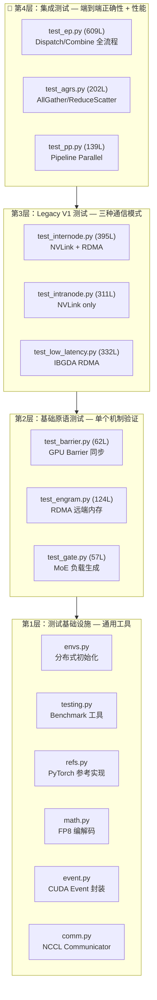
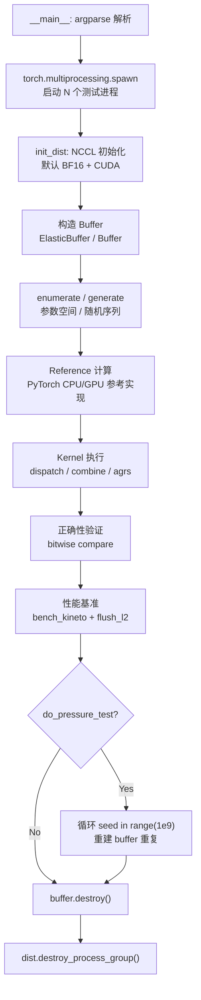

# DeepEP 测试体系总览

> **快速导航**：本文提供 DeepEP 测试架构的全局视图，5 篇详细分析报告见文末链接。
> **测试代码位置**：`DeepEP/tests/` + `DeepEP/deep_ep/utils/`

---

## 1. 测试体系全景

DeepEP 的测试体系是一个**四层金字塔**，从底层原语到顶层集成测试，逐层构建对 EP（Expert Parallelism）通信正确性的信心：



---

## 2. 测试文件角色速查

| 层级 | 文件 | 行数 | 核心职责 | 详细分析 |
|------|------|------|---------|---------|
| **集成** | `test_ep.py` | 609 | ElasticBuffer dispatch/combine 正确性 + 性能基准 | [→ 08_test_ep](08_test_ep_analysis.md) |
| **集成** | `test_agrs.py` | 202 | AllGather/ReduceScatter stress test + 带宽测量 | [→ 08_test_agrs_pp](08_test_agrs_pp_analysis.md) |
| **集成** | `test_pp.py` | 139 | Pipeline Parallel send/recv + 延迟测量 | [→ 08_test_agrs_pp](08_test_agrs_pp_analysis.md) |
| **Legacy** | `test_internode.py` | 395 | V1 Normal 模式（跨节点 NVLink+RDMA） | [→ 08_test_legacy](08_test_legacy_analysis.md) |
| **Legacy** | `test_intranode.py` | 311 | V1 Intranode 模式（纯 NVLink） | [→ 08_test_legacy](08_test_legacy_analysis.md) |
| **Legacy** | `test_low_latency.py` | 332 | V1 Low-Latency 模式（IBGDA） | [→ 08_test_legacy](08_test_legacy_analysis.md) |
| **原语** | `test_barrier.py` | 62 | GPU barrier 同步延迟基准 | [→ 08_test_barrier_engram_gate](08_test_barrier_engram_gate_analysis.md) |
| **原语** | `test_engram.py` | 124 | RDMA 远端内存访问正确性 + 带宽 | [→ 08_test_barrier_engram_gate](08_test_barrier_engram_gate_analysis.md) |
| **原语** | `test_gate.py` | 57 | MoE 非均衡负载分布统计验证 | [→ 08_test_barrier_engram_gate](08_test_barrier_engram_gate_analysis.md) |
| **基础设施** | `deep_ep/utils/` | ~800 | 初始化/参考实现/Benchmark/FP8工具 | [→ 08_test_infrastructure](08_test_infrastructure_analysis.md) |

---

## 3. 测试设计哲学

### 3.1 核心原则：Bitwise Identical

DeepEP 对**确定性算法**要求 GPU kernel 输出与 PyTorch 参考实现**逐比特一致**，而非传统的误差容忍比较：

```python
# test_ep.py 中的典型验证模式
assert bitwise compare(dispatch_result, ref_dispatch_result)  # 不是 torch.allclose!
```

这意味着：
- 参考实现 (`refs.py`) 必须与 kernel 使用**完全相同的计算路径**
- FP8 编解码 (`math.py`) 的量化/反量化语义必须精确匹配
- 排序结果（包括 tie-breaking）必须确定性

### 3.2 参数空间穷举

`test_ep.py` 通过 `enumerate_ep_modes()` 生成 **192~288 种参数组合**的笛卡尔积：

| 维度 | 取值 | 说明 |
|------|------|------|
| `do_handle_copy` | 0, 1 | 是否拷贝 topk_idx |
| `expert_alignment` | 1, 128 | Expert 对齐粒度 |
| `use_fp8_dispatch` | 0, 1 | FP8 vs BF16 dispatch |
| `num_bias` | 0, 1, 2 | Bias 数量 |
| `with_previous_event` | 0, 1 | Event 流水线模式 |
| `async_with_compute_stream` | 0, 1 | 异步 compute stream |
| `allocate_on_comm_stream` | 0, 1 | Comm stream 内存分配 |

### 3.3 Stress Test 范式

AGRS 和 PP 测试使用**随机操作序列**模拟真实场景的不确定性：

```mermaid
flowchart LR
    A["生成随机操作序列<br/>create/ag/fetch/destroy"] --> B["执行操作<br/>随机批量大小"]
    B --> C["确定性参考<br/>种子 = 42 + round×43 + rank"]
    C --> D["Bitwise 比对"]
    D --> E{"通过?"}
    E -->|Yes| F["Profiling<br/>bench_kineto"]
    E -->|No| G["立即失败<br/>报告不匹配位置"]
```

---

## 4. 测试执行流程

所有测试共享统一的执行链路：



---

## 5. V1 (Legacy) vs V2 (Elastic) 测试对比

| 维度 | Legacy (V1) | Elastic (V2) |
|------|-----------|--------------|
| **底层传输** | NVSHMEM + NCCL | NCCL Gin (GPU-initiated RDMA) |
| **Buffer API** | `deep_ep.Buffer` | `deep_ep.ElasticBuffer` |
| **通信模式** | Normal / Intranode / Low-Latency | 统一弹性模式 |
| **Buffer 大小** | 固定 (2GB NVL + 1GB RDMA) | 动态按需分配 |
| **测试重点** | 三种模式各自正确性 | 参数空间全覆盖 |
| **QP 配置** | 手动计算 | `get_theoretical_num_qps()` |
| **SM 配置** | 手动指定 `Config` | 分析式自动推导 |
| **压力测试** | 无 | `do_pressure_test` 无限循环 |

---

## 6. 测试基础设施关键模块

### 6.1 参考实现 (`refs.py`)

提供与 kernel 计算路径**完全一致**的 PyTorch 参考实现，是正确性验证的"黄金标准"：

| 函数 | 对应 Kernel | 计算路径 |
|------|-----------|---------|
| `ref_dispatch()` | `dispatch_impl` | scores → topk → permute → FP8 cast |
| `ref_combine()` | `combine_impl` | topk weights → scatter → BF16 cast |

### 6.2 Benchmark 工具 (`testing.py`)

| 工具 | 功能 | 关键特性 |
|------|------|---------|
| `bench()` | 简单计时 | 返回中位数耗时 |
| `bench_kineto` | Kineto profiler 集成 | `barrier_comm_profiling` 消除 CPU 启动偏斜 |
| `flush_l2_cache` | L2 Cache 刷新 | 256MB 全局 memory zero |

### 6.3 非均衡负载生成 (`gate.py`)

通过 `get_unbalanced_scores(ratio, precise)` 生成可控的 MoE 流量倾斜：

- `precise=True`：精确控制每个 rank 的 token 数量
- `precise=False`：通过二分搜索 factor 逼近目标倾斜比
- 用途：验证 EP 通信在**最坏情况负载**下的正确性

---

## 7. 测试覆盖率矩阵

| 功能 | 测试文件 | 覆盖方式 |
|------|---------|---------|
| Dispatch (Normal) | test_ep.py | 192~288 参数组合 |
| Dispatch (Low-Latency) | test_low_latency.py | IBGDA 模式 |
| Combine (Normal) | test_ep.py | normal + reduced 模式 |
| Combine (Low-Latency) | test_low_latency.py | 低延迟 combine |
| AllGather | test_agrs.py | Stress test 随机序列 |
| ReduceScatter | test_agrs.py | 与 AG 共享测试框架 |
| Send/Recv (PP) | test_pp.py | 延迟基准 |
| Barrier | test_barrier.py | 1000 次延迟测量 |
| Engram (RDMA) | test_engram.py | 正确性 + 带宽 |
| FP8 编解码 | test_ep.py | FP8 dispatch 模式 |
| 非均衡负载 | test_ep.py | gate.py 生成 |
| 压力测试 | test_ep.py, test_barrier.py | `do_pressure_test` 无限循环 |
| 确定性排序 | test_ep.py | `deterministic=True` 模式 |
| Hybrid Combine | test_ep.py | `allow_hybrid_mode` |
| Event 流水线 | test_ep.py | `with_previous_event` + `async` |

---

## 8. 阅读路径建议

根据你的目标，推荐以下阅读顺序：

| 目标 | 推荐路径 |
|------|---------|
| **快速理解测试全貌** | 本文 → [API 参考](08_test_01_api_reference.md) → §3 设计哲学 |
| **了解测了什么 API** | [API 参考](08_test_01_api_reference.md) → §5 API 演化路径 |
| **验证 EP 通信正确性** | `08_test_infrastructure` → `08_test_ep` |
| **理解 V1→V2 演进** | `08_test_legacy` → `08_test_ep` |
| **定位性能问题** | `08_test_infrastructure` (bench) → `08_test_barrier_engram_gate` |
| **理解 MoE 负载模型** | `08_test_barrier_engram_gate` (gate) → `08_test_ep` |

---

## 9. 详细分析报告索引

| # | 文档 | 行数 | 核心内容 |
|---|------|------|---------|
| 0 | [08_test_01_api_reference.md](08_test_01_api_reference.md) | ~320 | **被测 API 系统参考**：签名、语义、参数矩阵、测试覆盖方式、V1→V2 演化 |
| 1 | [08_test_infrastructure_analysis.md](08_test_infrastructure_analysis.md) | 941 | 测试基础设施全解：init_dist, testing.py, gate.py, refs.py, math.py, event.py |
| 2 | [08_test_ep_analysis.md](08_test_ep_analysis.md) | 735 | 主 EP 测试：参数空间枚举、dispatch/combine 流程、验证逻辑、性能基准 |
| 3 | [08_test_agrs_pp_analysis.md](08_test_agrs_pp_analysis.md) | 481 | AGRS Stress Test + PP send/recv 延迟测试 |
| 4 | [08_test_barrier_engram_gate_analysis.md](08_test_barrier_engram_gate_analysis.md) | 395 | 基础原语：Barrier 同步、Engram RDMA、Gate 负载生成 |
| 5 | [08_test_legacy_analysis.md](08_test_legacy_analysis.md) | 793 | Legacy V1 三模式对比：Internode / Intranode / Low-Latency |

---

## 10. 关键洞察

1. **测试是规格的另一种形式**：DeepEP 的测试代码精确编码了 kernel 的行为规格——参考实现 (`refs.py`) 不仅是验证工具，更是 kernel 的"可执行规格说明"。

2. **Bitwise identical 是设计约束**：要求逐比特一致意味着 kernel 实现必须严格遵循参考实现的计算顺序和舍入路径，排除了"等价但不同实现"的可能性。

3. **V1→V2 的测试简化**：V1 需要 3 个独立测试文件覆盖三种通信模式，V2 只需 1 个——弹性抽象消除了模式间的差异。

4. **非均衡负载是测试的隐藏难点**：`gate.py` 的二分搜索 factor + 精确 token 分配算法，确保测试覆盖"最坏情况"流量模式。

5. **Benchmark 的 CPU 偏斜消除**：`bench_kineto` 的 `barrier_comm_profiling` 模式（sleep + barrier 同步）是测量精度的关键——没有它，CPU 启动偏斜会淹没真实 kernel 耗时。
