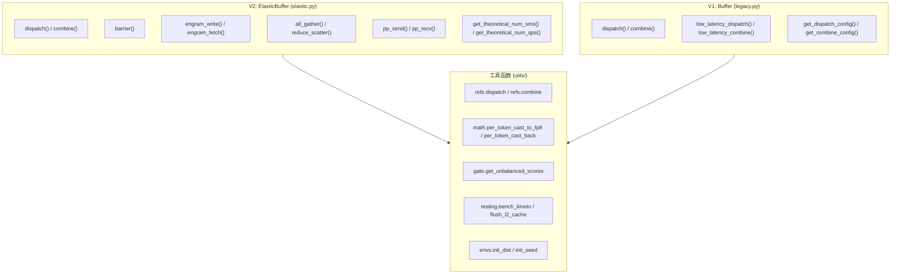
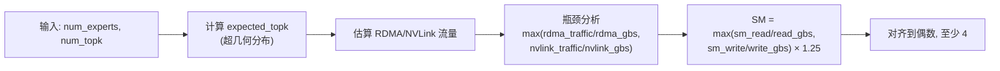
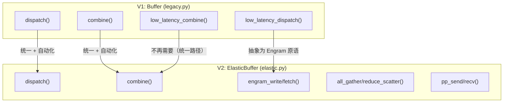
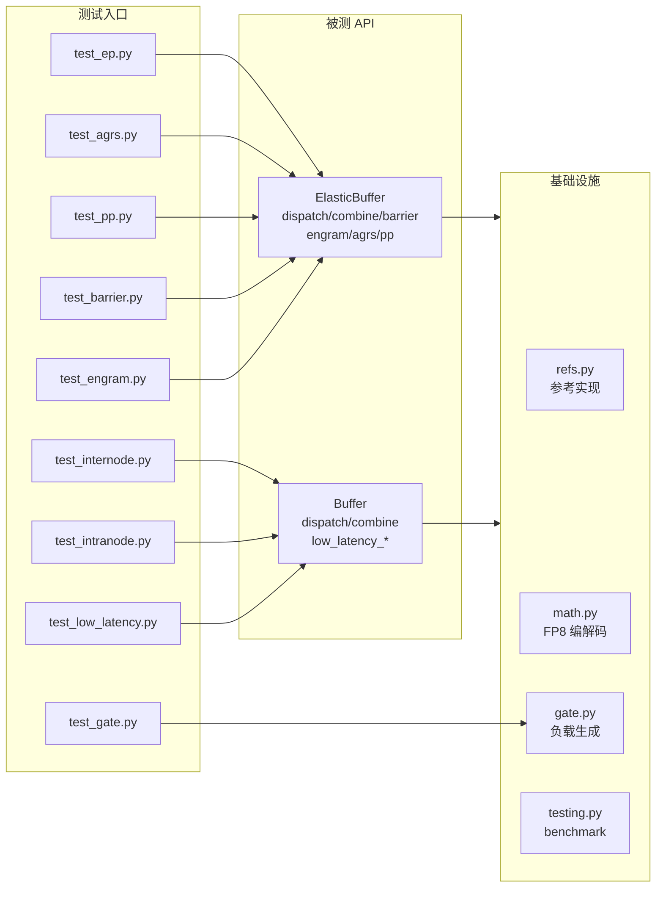

# DeepEP 测试目标 API 系统性参考

> **定位**：本文以"被测 API"为中心，系统描述 DeepEP 测试程序验证的所有关键 API —— 签名、语义、参数约束、测试覆盖方式。
> **配套文档**：[测试体系总览](08_test_00_overview.md) | [测试基础设施](08_test_infrastructure_analysis.md) | [主EP测试](08_test_ep_analysis.md)

---

## 1. API 体系全景

DeepEP 测试覆盖两大 Buffer 类 + 一组工具函数，构成完整的 API 测试矩阵：



---

## 2. V2 ElasticBuffer API 详解

### 2.1 `dispatch()` — Token 分发

**源码位置**：`deep_ep/buffers/elastic.py:855-1044`

**函数签名**：
```python
def dispatch(self,
             x: Union[torch.Tensor, Tuple[torch.Tensor, torch.Tensor]],
             topk_idx: Optional[torch.Tensor] = None,
             topk_weights: Optional[torch.Tensor] = None,
             cumulative_local_expert_recv_stats: Optional[torch.Tensor] = None,
             num_experts: Optional[int] = None,
             num_max_tokens_per_rank: Optional[int] = None,
             expert_alignment: Optional[int] = None,
             num_sms: int = 0, num_qps: int = 0,
             previous_event: Optional[EventHandle] = None,
             previous_event_before_epilogue: Optional[EventHandle] = None,
             async_with_compute_stream: bool = False,
             allocate_on_comm_stream: bool = False,
             handle: Optional[EPHandle] = None,
             do_handle_copy: bool = True,
             do_cpu_sync: Optional[bool] = None,
             do_expand: bool = False,
             do_zero_padding: bool = False,
             use_tma_aligned_col_major_sf: bool = False
            ) -> Tuple[Union[torch.Tensor, Tuple[torch.Tensor, torch.Tensor]],
                        Optional[torch.Tensor], Optional[torch.Tensor],
                        EPHandle, EventOverlap]
```

**核心语义**：将本地 token 根据 `topk_idx` 选择分发到对应 expert 所在的 rank，支持 NVLink（节点内）和 RDMA（跨节点）两种传输路径。

**参数矩阵**：

| 参数 | 类型 | 默认值 | 语义 | 测试覆盖方式 |
|------|------|--------|------|-------------|
| `x` | Tensor 或 (Tensor, Tensor) | — | 输入 token [num_tokens, hidden]，FP8 模式下为 (fp8_tensor, scales) | `use_fp8_dispatch` ∈ {0, 1} |
| `topk_idx` | int64 Tensor [T, K] | None | 每个 token 选择的 expert 索引，-1 表示未选择 | 由 `gate.get_unbalanced_scores` 生成 |
| `topk_weights` | float Tensor [T, K] | None | expert 权重 | `num_bias` ∈ {0, 1, 2} |
| `num_experts` | int | None | 全局 expert 数 | 从 `args.num_experts` 传入 |
| `expert_alignment` | int | None | 每个 expert 接收 token 数对齐粒度 | ∈ {1, 128} |
| `num_sms` | int | 0 | SM 数（0=自动） | 自动推导 `get_theoretical_num_sms()` |
| `num_qps` | int | 0 | RDMA QP 数（0=自动） | 自动推导 `get_theoretical_num_qps()` |
| `previous_event` | EventHandle | None | 等待的前置事件（流水线模式） | `with_previous_event` ∈ {0, 1} |
| `async_with_compute_stream` | bool | False | 异步执行，compute stream 不等待 | `async_with_compute_stream` ∈ {0, 1} |
| `allocate_on_comm_stream` | bool | False | 在 comm stream 上分配张量 | `allocate_on_comm_stream` ∈ {0, 1} |
| `handle` | EPHandle | None | 缓存的通信 handle（复用 layout） | `do_handle_copy` ∈ {0, 1} |
| `do_expand` | bool | False | 使用 expand 布局（每个 expert 一个 slot） | expand 模式测试 |
| `do_zero_padding` | bool | False | 对 expand 布局的对齐间隙填零 | expand + alignment 组合 |

**返回值**：
| 返回值 | 类型 | 说明 |
|--------|------|------|
| `recv_x` | Tensor 或 (Tensor, Tensor) | 接收到的 token（类型与输入一致） |
| `recv_topk_idx` | int64 Tensor | 接收到的 expert 索引 |
| `recv_topk_weights` | float Tensor | 接收到的 expert 权重 |
| `handle` | EPHandle | 通信 handle（用于 combine） |
| `event` | EventOverlap | 事件句柄（async 模式下有效） |

**测试覆盖**：`test_ep.py` 通过 `enumerate_ep_modes()` 生成 **192~288 种参数组合**，覆盖上表所有维度。

---

### 2.2 `combine()` — Token 聚合

**源码位置**：`deep_ep/buffers/elastic.py:1046-1107`

**函数签名**：
```python
def combine(self,
            x: torch.Tensor,
            handle: EPHandle,
            topk_weights: Optional[torch.Tensor] = None,
            bias: Union[torch.Tensor, Tuple[torch.Tensor, torch.Tensor]] = None,
            num_sms: int = 0, num_qps: int = 0,
            previous_event: EventHandle = None,
            previous_event_before_epilogue: Optional[EventHandle] = None,
            async_with_compute_stream: bool = False,
            allocate_on_comm_stream: bool = False
           ) -> Tuple[torch.Tensor, Optional[torch.Tensor], EventOverlap]
```

**核心语义**：将经过 expert 计算的 token 按 `handle` 记录的原始路由信息聚合回源 rank，执行加权归约（weighted reduction）。

**参数矩阵**：

| 参数 | 类型 | 默认值 | 语义 | 测试覆盖方式 |
|------|------|--------|------|-------------|
| `x` | BF16 Tensor [T, hidden] | — | 要发送的 token | dispatch 的输出 |
| `handle` | EPHandle | — | dispatch 返回的通信 handle | 自动传递 |
| `topk_weights` | float Tensor | None | 归约权重 | 与 dispatch 共享 |
| `bias` | Tensor 或 (Tensor, Tensor) | None | 输出偏置（0/1/2 个） | `num_bias` ∈ {0, 1, 2} |
| `num_sms` | int | 0 | SM 数（0=复用 dispatch 的） | 自动推导 |
| `num_qps` | int | 0 | QP 数 | 自动推导 |
| `previous_event` | EventHandle | None | 前置事件 | 流水线模式 |
| `async_with_compute_stream` | bool | False | 异步执行 | ∈ {0, 1} |

**返回值**：
| 返回值 | 类型 | 说明 |
|--------|------|------|
| `combined_x` | BF16 Tensor [T, hidden] | 聚合后的 token |
| `combined_topk_weights` | float Tensor | 聚合后的权重 |
| `event` | EventOverlap | 事件句柄 |

**测试覆盖**：`test_ep.py` 测试两种 combine 模式：
- **normal combine**：标准归约
- **reduced combine**：`allow_multiple_reduction` 模式下的多级归约

---

### 2.3 `barrier()` — GPU 级同步

**源码位置**：`deep_ep/buffers/elastic.py:497-508`

```python
def barrier(self, use_comm_stream: bool = True, with_cpu_sync: bool = False, sequential: bool = True) -> None
```

**参数矩阵**：

| 参数 | 类型 | 默认值 | 语义 |
|------|------|--------|------|
| `use_comm_stream` | bool | True | 使用 comm stream（否则用 compute stream） |
| `with_cpu_sync` | bool | False | 是否额外调用 `cudaDeviceSynchronize` |
| `sequential` | bool | True | 串行模式（单 SM，更安全）vs 并行模式（多 SM） |

**底层实现路径**：
```
buffer.barrier() → runtime.barrier() → launch_barrier() → barrier_impl<kSequential>
```

**测试覆盖**：`test_barrier.py` 测量 1000 次连续调用的平均延迟（微秒级）。

---

### 2.4 `engram_write()` / `engram_fetch()` — RDMA 远端内存访问

**源码位置**：`deep_ep/buffers/elastic.py:569-604`

```python
def engram_write(self, storage: torch.Tensor, sf: Optional[torch.Tensor] = None) -> None
def engram_fetch(self, indices: torch.Tensor, num_qps: int = 0,
                 use_tma_aligned_col_major_sf: bool = False) -> Callable
```

**核心语义**：Engram 是 DeepEP 的**远端内存访问原语**，通过 NCCL Gin（GPU-initiated RDMA）直接读写远端 GPU 的存储窗口。

| API | 方向 | 说明 |
|-----|------|------|
| `engram_write(storage, sf)` | 本地 → Window | 将本地数据注册到 NCCL window，供远端读取 |
| `engram_fetch(indices)()` | 远端 → 本地 | 异步发起 RDMA get，返回 callable `hook`；调用 `hook()` 阻塞等待完成 |

**参数详解**：

| 参数 | 类型 | 语义 |
|------|------|------|
| `storage` | BF16/FP8 Tensor [num_entries, hidden] | 要注册的存储数据 |
| `sf` | float/int Tensor [num_entries, num_sf_packs] | FP8 scaling factors（FP8 模式必须提供） |
| `indices` | int Tensor [num_tokens, num_entries_per_token] | 要获取的 entry 索引 |
| `num_qps` | int | QP 数（0=全部） |

**测试覆盖**：`test_engram.py` 验证正确性 + 带宽测量。

---

### 2.5 `all_gather()` / `reduce_scatter()` — 集合通信

**源码位置**：`deep_ep/buffers/elastic.py:706-726`

```python
def all_gather(self, t: Union[torch.Tensor, Sequence[torch.Tensor]])
```

**核心语义**：在 AGRS session 内执行 All-Gather，通过 NVLink symmetric memory 将每个 rank 的数据广播到所有 rank。

**使用模式**：
```python
# 单 tensor 模式
gathered, handle = buffer.all_gather(tensor)  # gathered 多一维 num_ranks

# Batched 模式
*gathered_tensors, handle = buffer.all_gather([t1, t2, t3])

# 等待完成
handle()
```

**配套 API**：

| API | 说明 |
|-----|------|
| `create_agrs_session()` / `destroy_agrs_session()` | session 生命周期管理 |
| `agrs_get_inplace_tensor(shapes, dtype)` | 获取 in-place 张量（零拷贝） |
| `agrs_set_config(max_bytes, max_ags)` | session 参数配置 |

**测试覆盖**：`test_agrs.py` 使用 Stress Test 范式，随机操作序列验证正确性。

---

### 2.6 `pp_send()` / `pp_recv()` — Pipeline Parallel 通信

**源码位置**：`deep_ep/buffers/elastic.py:616-636`

```python
def pp_send(self, t: torch.Tensor, dst_rank_idx: int, num_sms: int = 0) -> None
def pp_recv(self, t: torch.Tensor, src_rank_idx: int, num_sms: int = 0) -> None
```

**核心语义**：在 PP ring 中向相邻 rank 发送/接收张量（仅支持 prev/next rank）。

**测试覆盖**：`test_pp.py` 测量 send/recv 延迟。

---

### 2.7 `get_theoretical_num_sms()` / `get_theoretical_num_qps()` — 自动资源计算

**源码位置**：`deep_ep/buffers/elastic.py:728-853`

```python
def get_theoretical_num_sms(self, num_experts: int, num_topk: int, ...) -> int
def get_theoretical_num_qps(self, num_sms: int) -> int
```

**核心语义**：基于带宽建模自动推导最优 SM 数和 QP 数。

**SM 计算模型**：



**QP 计算规则**：
| 模式 | QP 数 |
|------|-------|
| Direct | `min(num_sms, 9)` |
| Hybrid | `num_sms * 16 + 1` |

---

## 3. V1 Buffer API 详解

### 3.1 `Buffer.dispatch()` — V1 Token 分发

**源码位置**：`deep_ep/buffers/legacy.py:322-405`

```python
def dispatch(self, x, handle=None,
             num_tokens_per_rank=None, num_tokens_per_rdma_rank=None,
             is_token_in_rank=None, num_tokens_per_expert=None,
             topk_idx=None, topk_weights=None,
             expert_alignment=1, num_worst_tokens=0,
             config=None, previous_event=None,
             async_finish=False, allocate_on_comm_stream=False) -> \
            Tuple[recv_x, recv_topk_idx, recv_topk_weights, 
                  num_recv_tokens_per_expert_list, handle, event]
```

**与 V2 的关键差异**：

| 维度 | V1 (Buffer) | V2 (ElasticBuffer) |
|------|-------------|---------------------|
| 路由计算 | 需手动提供 `num_tokens_per_rank`, `is_token_in_rank` | 自动从 `topk_idx` 推导 |
| 配置 | 需手动创建 `Config` 对象 | 自动推导 SM/QP |
| 返回值 | 包含 `num_recv_tokens_per_expert_list` | 通过 `handle` 间接获取 |
| 内部路径 | 自动分发到 `internode_dispatch` 或 `intranode_dispatch` | 统一路径 |

**测试覆盖**：`test_internode.py`（跨节点）、`test_intranode.py`（节点内）。

---

### 3.2 `Buffer.combine()` — V1 Token 聚合

**源码位置**：`deep_ep/buffers/legacy.py:408-470`

```python
def combine(self, x, handle, topk_weights=None, bias=None,
            config=None, previous_event=None,
            async_finish=False, allocate_on_comm_stream=False) -> \
            Tuple[combined_x, combined_topk_weights, event]
```

**注意**：V1 combine 是**无权重归约**（纯加法），topk_weights 仅用于返回。

---

### 3.3 `Buffer.low_latency_dispatch()` — 低延迟分发

**源码位置**：`deep_ep/buffers/legacy.py:553-621`

```python
def low_latency_dispatch(self, x, topk_idx,
                         num_max_dispatch_tokens_per_rank, num_experts,
                         cumulative_local_expert_recv_stats=None,
                         dispatch_wait_recv_cost_stats=None,
                         use_fp8=True, round_scale=False, use_ue8m0=False,
                         async_finish=False, return_recv_hook=False) -> \
            Tuple[recv_x, recv_count, handle, event, hook]
```

**核心语义**：使用 IBGDA（GPU-initiated RDMA）实现低延迟 dispatch，**不经过 NVLink**，直接通过 RDMA 网络传输。

**关键参数**：

| 参数 | 类型 | 语义 |
|------|------|------|
| `num_max_dispatch_tokens_per_rank` | int | 每 rank 最大 token 数（所有 rank 必须相同） |
| `use_fp8` | bool | FP8 模式（默认开启） |
| `round_scale` | bool | 将 scale 取整为 2 的幂 |
| `use_ue8m0` | bool | 使用 UE8M0 scale 格式 |
| `return_recv_hook` | bool | 返回 hook 而非等待完成（支持流水线） |

**测试覆盖**：`test_low_latency.py`。

---

### 3.4 `Buffer.low_latency_combine()` — 低延迟聚合

**源码位置**：`deep_ep/buffers/legacy.py:624-670`

```python
def low_latency_combine(self, x, topk_idx, topk_weights, handle,
                        use_logfmt=False, zero_copy=False,
                        async_finish=False, return_recv_hook=False,
                        out=None, combine_wait_recv_cost_stats=None) -> \
            Tuple[combined_x, event, hook]
```

**与 normal combine 的关键差异**：

| 维度 | Normal Combine | Low-Latency Combine |
|------|---------------|---------------------|
| 归约方式 | 无权重（纯加法） | **带权重**（weighted reduction） |
| 传输路径 | NVLink + RDMA 三阶段 | 直接 RDMA（IBGDA） |
| 额外功能 | — | `use_logfmt`（10-bit 对数格式）、`zero_copy` |

---

## 4. 工具函数 API

### 4.1 `refs.py` — PyTorch 参考实现

| 函数 | 签名 | 语义 | 对应 Kernel |
|------|------|------|-------------|
| `dispatch()` | `(x, topk_idx, topk_weights, num_experts, num_tokens_per_rank, expert_alignment) → (recv_x, recv_topk_idx, recv_topk_weights, num_recv_tokens_per_expert_list)` | 完整的 dispatch 参考实现 | `dispatch_impl` |
| `generate_pre_combine_data()` | `(src_token_global_idx, topk_idx, topk_weights, num_experts) → (pre_x, pre_topk_idx, pre_topk_weights)` | 为 combine 准备参考数据 | — |
| `ordered_accumulate()` | `(data, initial_value) → accumulated` | 有序累加（保证 bitwise 确定性） | combine 中的 reduction |
| `combine()` | `(y, topk_idx, topk_weights, num_experts, initial_value) → combined` | 完整的 combine 参考实现 | `combine_impl` |

**设计要点**：
- 使用 `ordered_accumulate` 保证累加顺序确定性，与 kernel 计算路径一致
- 不使用 `torch.scatter_add`（非确定性），而是手动实现有序累加

---

### 4.2 `math.py` — FP8 编解码与数值工具

| 函数 | 签名 | 语义 |
|------|------|------|
| `per_token_cast_to_fp8(x) → (x_fp8, scales)` | BF16 → FP8 E4M3，per-token 量化 |
| `per_token_cast_back(x_fp8, scales) → x` | FP8 → BF16 反量化 |
| `calc_diff(x, y) → float` | 计算两个张量的相对差异 |
| `align(x, y) → int` | 将 x 向上对齐到 y 的倍数 |
| `ceil_div(x, y) → int` | 向上取整除法 |
| `count_bytes(*tensors) → int` | 计算张量总字节数 |
| `hash_tensor(t) → int` | 张量内容哈希（用于调试） |

**FP8 量化语义**（测试关键）：
```python
# per_token_cast_to_fp8: 每行独立量化
scales = x.abs().max(dim=1) / fp8_max  # per-token scale
x_fp8 = (x / scales.unsqueeze(1)).to(float8_e4m3fn)

# per_token_cast_back: 反量化
x = x_fp8.float() * scales.unsqueeze(1)
```

---

### 4.3 `gate.py` — MoE 非均衡负载生成

| 函数 | 签名 | 语义 |
|------|------|------|
| `get_unbalanced_scores(ratio, precise) → scores` | 生成非均衡 MoE 路由分数 |
| `get_precise_unbalanced_scores(ratio)` | 精确控制 token 分布 |
| `get_random_unbalanced_scores(ratio)` | 随机逼近目标倾斜比 |

**`ratio` 参数语义**：
- `ratio = 0`：完全均匀分布
- `ratio = 1`：极端倾斜（所有 token 选择同一 expert）
- 中间值：通过二分搜索 factor 逼近

---

### 4.4 `testing.py` — Benchmark 工具

| 函数 | 签名 | 语义 |
|------|------|------|
| `bench(fn, name, ...) → float` | 简单计时（中位数） |
| `bench_kineto(fn, name, ...) → float` | Kineto profiler 集成 |
| `flush_l2_cache(enabled)` | L2 Cache 刷新（256MB zero） |

**`bench_kineto` 关键参数**：

| 参数 | 语义 |
|------|------|
| `barrier_comm_profiling` | 每次迭代前 sleep + barrier（消除 CPU 启动偏斜） |
| `flush_l2` | 每次迭代前刷新 L2 |
| `barrier` | 用于同步的 barrier 函数 |

---

### 4.5 `envs.py` — 分布式初始化

| 函数 | 签名 | 语义 |
|------|------|------|
| `init_dist(local_rank, num_local_ranks, seed) → (rank, world_size, group)` | NCCL 进程组初始化 |
| `init_seed(seed)` | 设置全局随机种子 |
| `dist_print(*args)` | 仅 rank 0 打印 |

---

## 5. API 测试覆盖矩阵

### 5.1 按 API 维度

| API | 测试文件 | 覆盖方式 | 验证标准 |
|-----|---------|---------|---------|
| `ElasticBuffer.dispatch()` | test_ep.py | 192~288 参数组合 | bitwise identical |
| `ElasticBuffer.combine()` | test_ep.py | normal + reduced | bitwise identical |
| `ElasticBuffer.barrier()` | test_barrier.py | 1000 次延迟测量 | 无错误 |
| `ElasticBuffer.engram_write/fetch()` | test_engram.py | 正确性 + 带宽 | bitwise identical |
| `ElasticBuffer.all_gather()` | test_agrs.py | Stress test 随机序列 | bitwise identical |
| `ElasticBuffer.pp_send/recv()` | test_pp.py | 延迟基准 | 无错误 |
| `Buffer.dispatch()` (internode) | test_internode.py | 跨节点场景 | bitwise identical |
| `Buffer.dispatch()` (intranode) | test_intranode.py | 节点内场景 | bitwise identical |
| `Buffer.low_latency_dispatch()` | test_low_latency.py | IBGDA 模式 | bitwise identical |
| `Buffer.low_latency_combine()` | test_low_latency.py | 带权重归约 | bitwise identical |
| `get_theoretical_num_sms()` | test_ep.py | 自动推导值使用 | 隐式验证 |
| `per_token_cast_to_fp8/back()` | test_ep.py | FP8 dispatch 模式 | bitwise identical |
| `get_unbalanced_scores()` | test_gate.py | 统计分布验证 | 分布符合预期 |

### 5.2 按测试类型维度

| 测试类型 | 覆盖的 API | 验证方式 |
|---------|-----------|---------|
| **正确性验证** | dispatch, combine, all_gather, engram | 与 refs.py 参考实现 bitwise compare |
| **性能基准** | barrier, dispatch, combine, pp_send/recv | bench_kineto 测量延迟/带宽 |
| **压力测试** | dispatch, barrier | `do_pressure_test` 无限循环 |
| **统计验证** | get_unbalanced_scores | 分布形状验证 |

---

## 6. API 演化路径（V1 → V2）



**关键演化**：
1. **三种模式 → 统一路径**：V1 需要 internode/intranode/low_latency 三套路径，V2 统一为一套 dispatch/combine
2. **手动配置 → 自动推导**：V1 需手动指定 Config（SM 数、chunk 大小），V2 通过 `get_theoretical_num_sms/qps()` 自动推导
3. **低延迟模式 → Engram 原语**：V1 的 low_latency 模式在 V2 中抽象为更通用的 Engram RDMA 原语
4. **新增能力**：V2 新增 AGRS（all_gather/reduce_scatter）和 PP（pipeline parallel）支持

---

## 7. 测试入口与 API 调用关系



---

## 8. 快速查找：我想测什么？

| 场景 | 应关注的 API | 对应测试文件 |
|------|-------------|-------------|
| 新增 expert 路由算法 | `dispatch()` 的 `topk_idx` 处理 | test_ep.py |
| 修改 FP8 量化逻辑 | `math.per_token_cast_to_fp8/back()` | test_ep.py (FP8 模式) |
| 调整 SM 分配策略 | `get_theoretical_num_sms()` | test_ep.py (隐式) |
| 修改 combine 归约逻辑 | `combine()` + `refs.combine()` | test_ep.py |
| 新增 RDMA 传输路径 | `engram_write/fetch()` | test_engram.py |
| 修改 barrier 同步 | `barrier()` | test_barrier.py |
| 调整 MoE 负载模型 | `gate.get_unbalanced_scores()` | test_gate.py |
| 性能回归检测 | `testing.bench_kineto()` | 所有 test 文件 |
