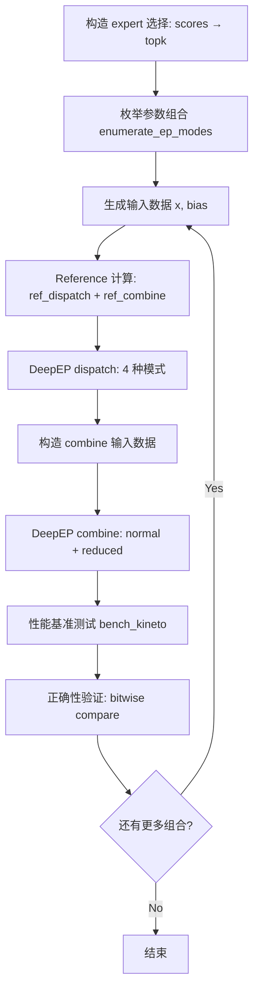
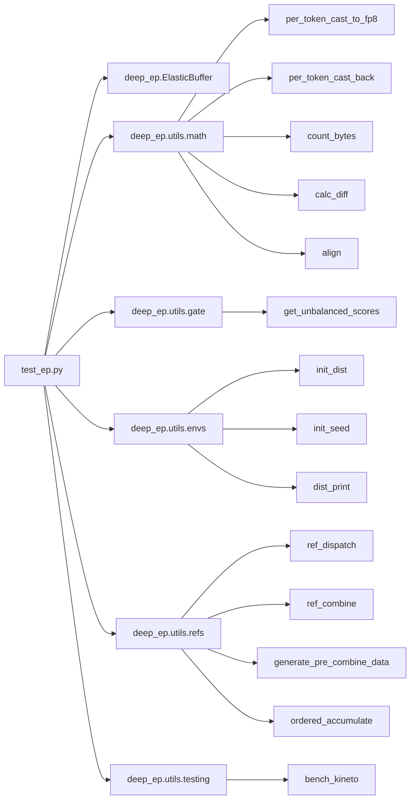

# DeepEP Elastic Test 源码深度分析

> **文件**: `tests/elastic/test_ep.py` (609 行)
> **目标**: 对 DeepEP 的 ElasticBuffer 进行全面的功能正确性验证 + 性能基准测试
> **测试对象**: `deep_ep.ElasticBuffer` 的 `dispatch()` 和 `combine()` API

---

## 目录

1. [文件结构概览](#1-文件结构概览)
2. [测试环境初始化](#2-测试环境初始化)
3. [参数空间枚举](#3-参数空间枚举)
4. [核心辅助函数](#4-核心辅助函数)
5. [主测试函数 test_dispatch_combine](#5-主测试函数-test_dispatch_combine)
6. [API 使用模式](#6-api-使用模式)
7. [验证逻辑](#7-验证逻辑)
8. [性能基准测试](#8-性能基准测试)
9. [依赖关系](#9-依赖关系)
10. [关键设计洞察](#10-关键设计洞察)

---

## 1. 文件结构概览

```
test_ep.py (609 行)
├── 导入区 (L1-19)
├── enumerate_ep_modes() (L22-31)     ← 参数空间笛卡尔积生成器
├── launch() (L34-41)                 ← 统一调用 dispatch/combine 的封装器
├── fold_expanded() (L44-55)          ← expand 模式结果折叠验证
├── test_dispatch_combine() (L59-516)  ← 核心测试逻辑
├── test_loop() (L20-561)             ← 分布式入口 + 压力测试
└── __main__ (L564-609)               ← argparse + multiprocessing.spawn
```

### 函数角色总览

| 函数 | 行号 | 角色 |
|------|------|------|
| `enumerate_ep_modes()` | 22-31 | 生成 7 维参数空间的笛卡尔积 |
| `launch()` | 34-41 | 统一封装 dispatch/combine 调用，支持 `previous_event` 和 async 模式 |
| `fold_expanded()` | 44-55 | 将 expand 模式的结果按 valid_mask 折叠回 non-expand 布局 |
| `test_dispatch_combine()` | 59-516 | 核心测试：构造数据 → dispatch → combine → 对比 reference |
| `test_loop()` | 520-561 | 分布式入口：初始化 → 构造 buffer → 运行测试 → 压力循环 |

---

## 2. 测试环境初始化

### 2.1 分布式初始化 (`test_loop`, L520-561)

```python
# L522: 通过 envs.init_dist() 初始化 NCCL 进程组
rank_idx, num_ranks, group = init_dist(local_rank, num_local_ranks, seed=args.seed)
```

`init_dist()` 的关键行为（`envs.py` L73-113）：
- 读取 `MASTER_ADDR`, `MASTER_PORT`, `WORLD_SIZE`, `RANK` 环境变量
- 使用 `nccl` backend 初始化 `torch.distributed`
- 设置默认 dtype 为 `bfloat16`，默认 device 为 `cuda`
- 调用 `init_seed(seed)` 设置随机种子
- 创建新的通信组 `dist.new_group(...)`

### 2.2 ElasticBuffer 构造

```python
# L523-534: construct_elastic_buffer 闭包
def construct_elastic_buffer():
    return deep_ep.ElasticBuffer(group,
                                 num_max_tokens_per_rank=args.num_tokens,
                                 hidden=args.hidden,
                                 deterministic=args.deterministic,
                                 allow_hybrid_mode=args.allow_hybrid_mode,
                                 allow_multiple_reduction=args.allow_multiple_reduction,
                                 prefer_overlap_with_compute=bool(args.prefer_overlap_with_compute),
                                 sl_idx=args.sl_idx,
                                 num_allocated_qps=max(args.num_allocated_qps, args.num_qps),
                                 explicitly_destroy=True,
                                 num_gpu_timeout_secs=args.num_gpu_timeout_secs,
                                 num_cpu_timeout_secs=args.num_cpu_timeout_secs)
```

**关键参数说明**：
- `num_max_tokens_per_rank`: 每个 rank 的最大 token 数（用于计算 `src_token_global_idx`）
- `deterministic`: 是否启用确定性排序模式
- `allow_hybrid_mode`: 是否允许 hybrid combine（intra-scaleup reduction）
- `allow_multiple_reduction`: 是否允许多级 reduction
- `num_allocated_qps`: 预分配的 QP（Queue Pair）数量

### 2.3 进程启动

```python
# L608-609: 使用 torch.multiprocessing.spawn 启动多进程
num_processes = args.num_processes
torch.multiprocessing.spawn(test_loop, args=(num_processes, args), nprocs=num_processes)
```

默认 8 进程（对应 8 GPU），可通过 `--num-processes` 调整。

---

## 3. 参数空间枚举

### 3.1 `enumerate_ep_modes()` (L22-31)

```python
def enumerate_ep_modes():
    for do_handle_copy in (1, 0):                    # 是否拷贝 topk_idx
        for expert_alignment in (128, 1):            # expert 对齐粒度
            for use_fp8_dispatch in (1, 0):          # FP8 vs BF16 dispatch
                for num_bias in (0, 1, 2):           # bias 数量
                    for with_previous_event in (0, 1):  # 是否传入 previous_event
                        for async_with_compute_stream in (0, 1):  # 异步 compute stream
                            for allocate_on_comm_stream in ((1, ) if with_previous_event else (0, 1)):
                                yield (do_handle_copy, expert_alignment, use_fp8_dispatch, num_bias,
                                       with_previous_event, async_with_compute_stream, allocate_on_comm_stream)
```

**总组合数**: 2 × 2 × 2 × 3 × 2 × 2 × (1 或 2) = **192 ~ 288 种组合**

> 注意 `allocate_on_comm_stream` 的条件约束：当 `with_previous_event=1` 时只取 `(1,)`，否则取 `(0, 1)`。

### 3.2 参数维度分析

| 参数 | 取值 | 测试目的 |
|------|------|---------|
| `do_handle_copy` | 0, 1 | 验证 handle 内部 topk_idx 拷贝行为 |
| `expert_alignment` | 1, 128 | 验证 expert 对齐（128 是 TMA 对齐要求） |
| `use_fp8_dispatch` | 0, 1 | FP8 (E4M3) vs BF16 精度路径 |
| `num_bias` | 0, 1, 2 | 无 bias / 单 bias / 双 bias（tuple） |
| `with_previous_event` | 0, 1 | CUDA event 链式依赖 |
| `async_with_compute_stream` | 0, 1 | 计算流异步执行 |
| `allocate_on_comm_stream` | 0, 1 | 通信流上分配 tensor |

---

## 4. 核心辅助函数

### 4.1 `launch()` (L34-41) — 统一调用封装

```python
def launch(buffer: deep_ep.ElasticBuffer, name: str,
           with_previous_event: int, async_with_compute_stream: int,
           params: dict):
    if with_previous_event:
        params.update(previous_event=buffer.capture())  # 捕获当前 CUDA event
    values = getattr(buffer, name)(**params)  # 动态调用 dispatch 或 combine
    values[-1].current_stream_wait() if async_with_compute_stream else ()
    return values
```

**设计要点**：
- `name` 参数化：同一函数可调用 `dispatch` 或 `combine`
- `previous_event`：通过 `buffer.capture()` 获取 event，实现跨 kernel 依赖
- `async_with_compute_stream`：控制是否在返回前同步 compute stream
- `values[-1]` 是返回的 event，调用 `.current_stream_wait()` 同步

### 4.2 `fold_expanded()` (L44-55) — Expand 结果折叠

```python
def fold_expanded(expanded, indices, valid_mask):
    if not isinstance(expanded, torch.Tensor):
        return tuple(fold_expanded(t, indices, valid_mask) for t in expanded)

    gathered = expanded[indices]  # 按 slot 索引收集
    first_valid_idx = valid_mask.to(torch.int).argmax(dim=1)  # 每行第一个有效位置
    folded = gathered[torch.arange(gathered.shape[0], device='cuda'), first_valid_idx]
    result = (gathered == folded.unsqueeze(1)).all(dim=-1)  # 验证所有有效位相同
    result = result | (~valid_mask)
    assert result.all()
    return folded
```

**作用**：expand 模式下同一 token 的多个 expert slot 值应相同（broadcast 语义），此函数验证并折叠为单值。

---

## 5. 主测试函数 test_dispatch_combine

### 5.1 执行流程总览



### 5.2 配置阶段 (L60-72)

```python
# L61-66: 获取逻辑域大小和计算参数
num_scaleout_ranks, num_scaleup_ranks = buffer.get_logical_domain_size()
num_max_tokens_per_rank, num_tokens, hidden = args.num_tokens, max(1, args.num_tokens - dist.get_rank()), args.hidden
num_topk, num_experts = args.num_topk, args.num_experts
num_local_experts = num_experts // buffer.num_ranks
num_sms = buffer.get_theoretical_num_sms(num_experts, num_topk) if args.num_sms == 0 else args.num_sms
num_qps = buffer.get_theoretical_num_qps(num_sms) if args.num_qps == 0 else args.num_qps
```

**关键设计**：
- `num_tokens = max(1, args.num_tokens - dist.get_rank())`：不同 rank 有不同 token 数，模拟真实场景
- `num_sms` 和 `num_qps` 默认自动计算（`args.num_sms == 0`），也可手动指定

### 5.3 Expert 选择构造 (L74-81)

```python
# L75-76: 生成不平衡的 expert 选择
scores = get_unbalanced_scores(num_tokens, num_experts, buffer.num_ranks, num_topk, 
                               args.unbalanced_ratio, args.precise_unbalanced_ratio)
topk_weights, topk_idx = torch.topk(scores, num_topk, dim=-1, largest=True, sorted=False)
topk_idx = topk_idx.to(deep_ep.topk_idx_t)

# L78-81: 可选的 masked ratio（模拟 -1 索引）
if args.masked_ratio > 0:
    rand_mask = torch.rand_like(topk_idx, dtype=torch.float)
    topk_idx.masked_fill_(rand_mask < args.masked_ratio, -1)
    topk_weights.masked_fill_(topk_idx < 0, 0)
```

**`get_unbalanced_scores` 机制**（`gate.py`）：
- `precise=True`: 精确控制每个 rank 的 token 分布比例
- `precise=False`: 通过 factor 二分搜索逼近目标 ratio
- `unbalanced_ratio=1.0` 时退化为均匀分布

### 5.4 Reference 计算 (L107-141)

```python
# L109-111: NCCL reference dispatch
ref_recv_x, ref_recv_topk_idx, ref_recv_topk_weights, \
    ref_recv_src_token_idx, ref_num_recv_tokens_per_rank = \
    ref_dispatch(x, topk_idx, topk_weights, num_max_tokens_per_rank, num_experts)

# L125-140: Reference combine（两种 recipe）
ref_y = generate_pre_combine_data(...)
ref_reduced_combined_y = ref_combine(ref_y, topk_idx, ..., *reduced_combine_recipe)
ref_combined_y = ref_combine(ref_y, topk_idx, ..., *combine_recipe)
```

**Reference dispatch 算法**（`refs.py` L10-123）：
1. 按目标 rank 分组 token
2. `dist.all_to_all_single` 交换数据
3. 本地 expert 之外的 topk_idx 设为 -1

**Reference combine 算法**（`refs.py` L177-243）：
- `grouped_reduce`: 按 group_id 分组累加
- 支持 `(reduce_in_local, reduce_in_scaleup)` 两种 reduction 级别

### 5.5 四种 Dispatch 模式 (L143-177)

```python
# L144-153: 标准 dispatch
recv_x, recv_topk_idx, recv_topk_weights, handle, dispatch_event = \
    launch(buffer, 'dispatch', with_previous_event, async_with_compute_stream, dispatch_args)

# L157-159: Expanding dispatch（do_expand=True）
expanded_recv_x, expanded_recv_topk_idx, expanded_recv_topk_weights, expanded_handle, expanded_dispatch_event = \
    launch(buffer, 'dispatch', with_previous_event, async_with_compute_stream, expanded_dispatch_args)

# L163-170: Cached dispatch（复用 handle）
cached_recv_x, cached_recv_topk_idx, cached_recv_topk_weights, cached_handle, cached_dispatch_event = \
    launch(buffer, 'dispatch', with_previous_event, async_with_compute_stream, cached_dispatch_args)

# L173-177: Cached expanding dispatch + zero padding
cached_expanded_recv_x, _, cached_expanded_recv_topk_weights, _, _ = \
    launch(buffer, 'dispatch', with_previous_event, async_with_compute_stream, cached_expanded_dispatch_args)
```

**四种模式对比**：

| 模式 | do_expand | handle 来源 | 特殊参数 |
|------|-----------|------------|---------|
| 标准 | False | None | 完整参数 |
| Expanding | True | None | `use_tma_aligned_col_major_sf=True` |
| Cached | False | 复用 handle | 仅需 `x` |
| Cached Expanding + Zero Padding | True | 复用 expanded_handle | `do_zero_padding=True` |

### 5.6 Combine 输入构造 (L179-206)

```python
# L186-195: 标准 combine 输入
src_token_global_idx = handle.recv_src_metadata[:num_recv_tokens, 0]
local_y = generate_pre_combine_data(src_token_global_idx, num_max_tokens_per_rank, num_topk, hidden)
local_y[recv_topk_idx[:num_recv_tokens] == -1] = 0
local_reduced_y = ordered_accumulate(local_y)
input_for_combine = torch.empty_like(recv_x_bf16, dtype=torch.bfloat16, device='cuda')
input_for_combine[:num_recv_tokens] = local_reduced_y

# L197-206: Expand combine 输入（按 slot 索引 scatter）
input_for_expand_combine = torch.empty((expanded_recv_x_bf16.shape[0] + 1, hidden), ...)
input_for_expand_combine[expanded_handle.recv_src_metadata[:num_recv_tokens, 2:].flatten()] = local_y_expand.view(-1, hidden)
input_for_expand_combine = input_for_expand_combine[:-1, ...]  # 移除额外行
```

**`generate_pre_combine_data` 设计**（`refs.py` L126-153）：
- 使用确定性公式生成：`y[j,k] = sin((token_seeds * P % max_seed + 1) / max_seed * (k+1) + sin(seed))`
- `P=131071`（大素数），`token_seeds = src_token_global_idx * num_topk + j`
- 保证所有 rank 可独立生成相同数据，无需通信

### 5.7 Combine 执行 (L208-231)

```python
# L209-217: 标准 combine
combined_x, combined_topk_weights, combine_event = \
    launch(buffer, 'combine', with_previous_event, async_with_compute_stream, combine_args)

# L219-231: Reduced combine（expand 模式）
reduced_combined_x, reduced_combined_topk_weights, reduced_combine_event = \
    launch(buffer, 'combine', with_previous_event, async_with_compute_stream, reduced_combine_args)
```

---

## 6. API 使用模式

### 6.1 `dispatch()` 参数完整列表

```python
dispatch_args = dict(
    x=x,                                    # 输入 token [num_tokens, hidden]
    topk_idx=topk_idx,                      # top-k expert 索引 [num_tokens, num_topk]
    topk_weights=topk_weights,              # top-k 权重 [num_tokens, num_topk]
    num_sms=num_sms,                        # 使用的 SM 数量
    num_qps=num_qps,                        # 使用的 QP 数量
    num_max_tokens_per_rank=num_max_tokens_per_rank,
    num_experts=num_experts,
    expert_alignment=expert_alignment,      # expert 对齐（128 或 1）
    async_with_compute_stream=async_with_compute_stream,
    allocate_on_comm_stream=allocate_on_comm_stream,
    do_handle_copy=do_handle_copy,          # 是否拷贝 topk_idx
    do_cpu_sync=args.do_cpu_sync,           # 是否 CPU 同步
)
```

**返回值**：`(recv_x, recv_topk_idx, recv_topk_weights, handle, dispatch_event)`

### 6.2 `combine()` 参数完整列表

```python
combine_args = dict(
    x=input_for_combine,                    # combine 输入
    topk_weights=recv_topk_weights,         # dispatch 返回的 topk_weights
    bias=bias,                              # 可选 bias
    handle=handle,                          # dispatch 返回的 handle
    num_sms=num_sms,
    num_qps=num_qps,
    async_with_compute_stream=async_with_compute_stream,
    allocate_on_comm_stream=allocate_on_comm_stream,
)
```

**返回值**：`(combined_x, combined_topk_weights, combine_event)`

### 6.3 Cached Dispatch 模式

```python
# 仅需 x 和 handle，跳过 layout 重计算
cached_dispatch_args = dict(
    x=x,
    num_sms=num_sms, num_qps=num_qps,
    async_with_compute_stream=async_with_compute_stream,
    allocate_on_comm_stream=allocate_on_comm_stream,
    handle=handle,  # 复用之前的 handle
)
```

---

## 7. 验证逻辑

### 7.1 Handle Copy 验证 (L363-366)

```python
# L364: do_handle_copy=1 时 topk_idx 应该被拷贝（data_ptr 不同）
assert (topk_idx.data_ptr() != handle.topk_idx.data_ptr()) == do_handle_copy
# L365: cached handle 也应拷贝
assert (topk_idx.data_ptr() != cached_handle.topk_idx.data_ptr()) == do_handle_copy
# L366: 两次 dispatch 返回的 handle 共享同一 topk_idx
assert handle.topk_idx.data_ptr() == cached_handle.topk_idx.data_ptr()
```

### 7.2 Deterministic 验证 (L388-404)

```python
if args.deterministic:
    # 再次 dispatch，结果应 bitwise 相同
    recv_x_twice, recv_topk_idx_twice, recv_topk_weights_twice, handle_twice, _ = \
        launch(buffer, 'dispatch', ...)
    assert torch.equal(recv_x_bf16, recv_x_twice_bf16)
    assert torch.equal(recv_topk_idx, recv_topk_idx_twice[:num_recv_tokens])
    assert torch.equal(recv_topk_weights, recv_topk_weights_twice[:num_recv_tokens])
```

### 7.3 Expert 计数验证 (L445-462)

```python
# L448-453: 验证 cumulative_local_expert_recv_stats
for i in range(num_local_experts if args.do_cpu_sync else 0):
    ref_count = (ref_recv_topk_idx == i).sum().item()
    aligned_ref_count = align(ref_count, expert_alignment)
    assert ref_count == cumulative_local_expert_recv_stats[i].item()
    assert aligned_ref_count == handle.num_recv_tokens_per_expert_list[i]

# L454-462: 验证 psum 计数
for i in range(num_local_experts):
    ref_count = (ref_recv_topk_idx == i).sum().item()
    count = psum_num_recv_tokens_per_expert_list[i + 1] - psum_num_recv_tokens_per_expert_list[i]
    expanded_count = (expanded_psum_num_recv_tokens_per_expert_list[i + 1] -
                      align(expanded_psum_num_recv_tokens_per_expert_list[i], expert_alignment))
    assert align(ref_count, expert_alignment) == count
    assert ref_count == expanded_count
```

### 7.4 Dispatch 数据 Bitwise 验证 (L471-500)

```python
# L476-500: 逐 rank 验证数据 bitwise 一致
for i in range(buffer.num_ranks):
    rank_start_idx = sum(ref_num_recv_tokens_per_rank[:i])
    rank_end_idx = rank_start_idx + ref_num_recv_tokens_per_rank[i]
    sorted_metadata = torch.sort(check_handle.recv_src_metadata[:, 0])
    sorted_indices = sorted_metadata.indices[rank_start_idx:rank_end_idx]
    
    # Data should be bitwise identical
    for ref_t, t, do_mask in check_list:
        ref_t = ref_t[rank_start_idx:rank_end_idx]
        t = t[sorted_indices]
        if do_mask:
            ref_t = ref_t.masked_fill(ref_mask, 0)
            t = t.masked_fill(ref_mask, 0)
        assert torch.equal(ref_t, t)
```

### 7.5 Combine 结果验证 (L502-511)

```python
# L503: 标准 combine 结果 bitwise 一致
assert torch.equal(combined_x, ref_combined_y), \
    f'Diff: {calc_diff(combined_x, ref_combined_y)}'

# L505: Reduced combine 结果 bitwise 一致
assert torch.equal(reduced_combined_x, ref_reduced_combined_y), \
    f'Diff: {calc_diff(reduced_combined_x, ref_reduced_combined_y)}'

# L507: topk_weights 应还原
assert torch.equal(combined_topk_weights, topk_weights)
```

### 7.6 Zero Padding 验证 (L424-428)

```python
# 验证 cached expand 模式的 zero padding 正确性
for expert_idx in range(num_local_experts):
    start = expanded_handle.psum_num_recv_tokens_per_expert[expert_idx].item()
    end = align(start, expert_alignment)
    assert (cached_expanded_recv_x_bf16[start:end] == 0).all()
    assert (cached_expanded_recv_topk_weights[start:end] == 0).all()
```

---

## 8. 性能基准测试

### 8.1 测试矩阵

| 测试项 | kernel_names | 模式 |
|--------|-------------|------|
| dispatch | `('dispatch_impl', 'dispatch_copy_epilogue_impl')` | 标准 |
| expanded dispatch | `('dispatch_impl', 'dispatch_copy_epilogue_impl')` | expand |
| cached dispatch | `('dispatch_impl', 'dispatch_copy_epilogue_impl')` | cached |
| combine | `('combine_impl', 'combine_reduce_epilogue_impl')` | 标准 |
| reduced combine | `('combine_impl', 'combine_reduce_epilogue_impl')` | expand |

### 8.2 带宽计算 (L239-336)

```python
# L253-255: dispatch 字节数计算
num_bytes_per_dispatch_token = safe_div(count_bytes(recv_x, recv_topk_idx, recv_topk_weights), recv_topk_idx.size(0))
num_scaleup_bytes = num_bytes_per_dispatch_token * num_scaleup_recv_tokens
num_scaleout_bytes = num_bytes_per_dispatch_token * num_scaleout_send_tokens
```

**`get_combine_bytes()` 函数** (L291-336)：
- 计算 combine 的 scaleout/scaleup/reduction 三部分字节数
- 考虑 `allow_multiple_reduction` 和 `allow_hybrid_mode` 的不同路径
- 使用 `get_unique_and_valid_dst_count()` 去重计算有效目标数

### 8.3 bench_kineto 调用

```python
# L256-263: dispatch 性能测试
t, copy_t = bench_kineto(lambda: buffer.dispatch(**dispatch_args),
                         kernel_names=('dispatch_impl', 'dispatch_copy_epilogue_impl'),
                         barrier_comm_profiling=True, barrier=buffer.barrier, 
                         trace_path=get_trace_path('dispatch'))
```

**bench_kineto 机制**（`testing.py` L111-219）：
- 使用 `torch.profiler.profile` 进行 kineto 级别的性能分析
- `barrier_comm_profiling=True`：插入 `torch.cuda._sleep(2e7)` + barrier 消除 CPU 启动不均衡
- 返回每个 kernel 的平均执行时间
- 可选导出 Chrome trace JSON

### 8.4 输出格式

```python
# L259-263: 性能结果输出
dist_print(f'   * EP: {buffer.rank_idx:3}/{buffer.num_ranks} | '
        f'dispatch: '
        f'{num_scaleout_bytes / t / 1e9:.0f} GB/s (SO), '
        f'{num_scaleup_bytes / t / 1e9:.0f} GB/s (SU), {t * 1e6:.3f} us, {num_scaleup_bytes:.0f} bytes | '
        f'copy: {2 * num_recv_tokens * num_bytes_per_dispatch_token / copy_t / 1e9:.0f} GB/s, {copy_t * 1e6:.3f} us')
```

---

## 9. 依赖关系

### 9.1 外部依赖



### 9.2 关键依赖说明

| 模块 | 用途 | 关键函数 |
|------|------|---------|
| `deep_ep.utils.math` | FP8 转换、字节计算、对齐 | `per_token_cast_to_fp8`, `count_bytes`, `align` |
| `deep_ep.utils.gate` | 不平衡 expert 分布生成 | `get_unbalanced_scores`, `generate_rank_count` |
| `deep_ep.utils.envs` | 分布式初始化、日志 | `init_dist`, `dist_print`, `init_seed` |
| `deep_ep.utils.refs` | NCCL reference 实现 | `ref_dispatch`, `ref_combine`, `generate_pre_combine_data` |
| `deep_ep.utils.testing` | 性能分析 | `bench_kineto` |

---

## 10. 关键设计洞察

### 10.1 测试的完备性设计

该测试文件展现了 **工业级通信库测试** 的核心特征：

1. **参数空间穷举**：192~288 种参数组合覆盖所有代码路径
2. **Reference 对比**：使用纯 NCCL `all_to_all_single` 作为 ground truth
3. **Bitwise 精确**：不是 approximate comparison，而是 `torch.equal` bitwise 一致
4. **多模式覆盖**：standard / expand / cached / zero-padding 四种 dispatch 模式
5. **确定性验证**：deterministic 模式下重复执行验证一致性

### 10.2 `generate_pre_combine_data` 的巧妙设计

```python
# 确定性公式，无需通信即可生成相同数据
y[j,k] = sin((token_seeds * P % max_seed + 1) / max_seed * (k+1) + sin(seed))
```

- 基于 `src_token_global_idx` 生成，每个 rank 可独立计算
- 大素数 `P=131071` 保证哈希均匀性
- 避免了在 combine 测试中引入额外的通信开销

### 10.3 `allow_multiple_reduction` 的分支逻辑

```python
# L114-124: combine recipe 选择
if args.allow_multiple_reduction:
    if args.allow_hybrid_mode and num_scaleout_ranks > 1:
        reduced_combine_recipe = (True, True)   # Hybrid: local + scaleup reduction
        combine_recipe = (True, True)
    else:
        reduced_combine_recipe = (True, False)  # Non-hybrid: local only
        combine_recipe = (True, False)
else:
    reduced_combine_recipe = (False, False)     # No reduction
    combine_recipe = (True, False)
```

这对应 DeepEP 的三种 combine 模式：
- `(True, True)`: Hybrid combine（intra-scaleup reduction + global reduction）
- `(True, False)`: Standard combine（local reduction + global reduction）
- `(False, False)`: Multiple reduction（每个 expert slot 独立）

### 10.4 `launch()` 封装的异步模式

```python
# L40: async_with_compute_stream 控制同步行为
values[-1].current_stream_wait() if async_with_compute_stream else ()
```

- `async_with_compute_stream=1`：返回前等待 compute stream 完成
- `async_with_compute_stream=0`：立即返回，不等待

这验证了 DeepEP 的 **计算流与通信流重叠** 能力。

### 10.5 压力测试设计

```python
# L548-557: 压力测试循环
for seed in range(int(1e9) if args.do_pressure_test else 0):
    if not args.reuse_elastic_buffer:
        buffer.destroy()
        buffer = construct_elastic_buffer()
    init_seed(seed)
    test_dispatch_combine(buffer, args)
```

- 可选的无限循环压力测试（`--do-pressure-test`）
- 支持 buffer 重建或复用两种模式
- 每个 seed 重新初始化随机分布

### 10.6 命令行参数完整列表

| 类别 | 参数 | 默认值 | 说明 |
|------|------|--------|------|
| 资源 | `--num-processes` | 8 | 进程数 |
| 资源 | `--num-sms` | 0 (auto) | SM 数量 |
| 资源 | `--num-qps` | 0 (auto) | QP 数量 |
| 资源 | `--num-allocated-qps` | 0 (auto) | 预分配 QP 数 |
| 资源 | `--num-gpu-timeout-secs` | 100 | GPU 超时 |
| 资源 | `--num-cpu-timeout-secs` | 100 | CPU 超时 |
| 模型 | `--num-tokens` | 4096 | Token 数 |
| 模型 | `--hidden` | 7168 | 隐藏维度 |
| 模型 | `--num-topk` | 6 | Top-k 专家数 |
| 模型 | `--num-experts` | 256 | 总专家数 |
| 场景 | `--do-cpu-sync` | 1 | 是否 CPU 同步 |
| 场景 | `--allow-hybrid-mode` | 1 | 允许 hybrid 模式 |
| 场景 | `--allow-multiple-reduction` | 1 | 允许多级 reduction |
| 测试 | `--deterministic` | False | 确定性模式 |
| 测试 | `--skip-check` | False | 跳过正确性检查 |
| 测试 | `--skip-perf-test` | False | 跳过性能测试 |
| 测试 | `--do-pressure-test` | False | 压力测试 |
| 测试 | `--unbalanced-ratio` | 1.0 | 不平衡比例 |
| 测试 | `--masked-ratio` | 0.0 | 掩码比例 |

---

## 附录：测试执行流程图

```mermaid
sequenceDiagram
    participant Main as __main__
    participant Loop as test_loop
    participant Init as init_dist
    participant Buf as ElasticBuffer
    participant Test as test_dispatch_combine
    participant Ref as ref_dispatch/combine
    participant DEP as DeepEP kernels
    participant Bench as bench_kineto

    Main->>Loop: torch.multiprocessing.spawn
    Loop->>Init: init_dist(local_rank, ...)
    Init-->>Loop: (rank, world_size, group)
    Loop->>Buf: construct_elastic_buffer()
    Loop->>Test: test_dispatch_combine(buffer, args)

    loop 192~288 参数组合
        Test->>Test: get_unbalanced_scores()
        Test->>Ref: ref_dispatch(x, topk_idx, ...)
        Ref-->>Test: (ref_recv_x, ref_recv_topk_idx, ...)
        Test->>Ref: ref_combine(ref_y, ...)
        Ref-->>Test: ref_combined_y

        Test->>DEP: buffer.dispatch(x, topk_idx, ...)
        DEP-->>Test: (recv_x, recv_topk_idx, ..., handle)
        Test->>DEP: buffer.dispatch(do_expand=True)
        DEP-->>Test: expanded_recv_x, expanded_handle
        Test->>DEP: buffer.dispatch(handle=handle)  // cached
        DEP-->>Test: cached_recv_x, cached_handle
        Test->>DEP: buffer.dispatch(do_zero_padding=True)
        DEP-->>Test: cached_expanded_recv_x

        Test->>DEP: buffer.combine(input_for_combine, handle=handle)
        DEP-->>Test: combined_x, combined_topk_weights
        Test->>DEP: buffer.combine(input_for_expand_combine, handle=expanded_handle)
        DEP-->>Test: reduced_combined_x

        Test->>Bench: bench_kineto(dispatch)
        Bench-->>Test: (t, copy_t)
        Test->>Bench: bench_kineto(combine)
        Bench-->>Test: (t, copy_t)

        Test->>Test: assert torch.equal(combined_x, ref_combined_y)
        Test->>Test: assert bitwise checks...
    end

    Loop->>Buf: buffer.destroy()
    Loop->>Init: dist.destroy_process_group()
```

---

## 总结

`test_ep.py` 是 DeepEP 的 **核心验收测试**，其设计体现了以下工程哲学：

1. **穷举式参数覆盖**：7 维参数空间的笛卡尔积确保所有代码路径被测试
2. **NCCL Reference 对比**：使用 `dist.all_to_all_single` 作为 ground truth，而非近似比较
3. **Bitwise 精确性**：所有验证使用 `torch.equal`，而非 tolerance-based 比较
4. **性能与正确性分离**：`--skip-check` 和 `--skip-perf-test` 允许独立运行
5. **工业级压力测试**：支持无限循环 + buffer 重建的 pressure test 模式
6. **确定性验证**：deterministic 模式下重复执行验证结果一致性

该测试文件不仅是功能验证工具，也是 DeepEP 的 **性能回归测试基准**，通过 `bench_kineto` 获取 kernel 级别的时间分解。
