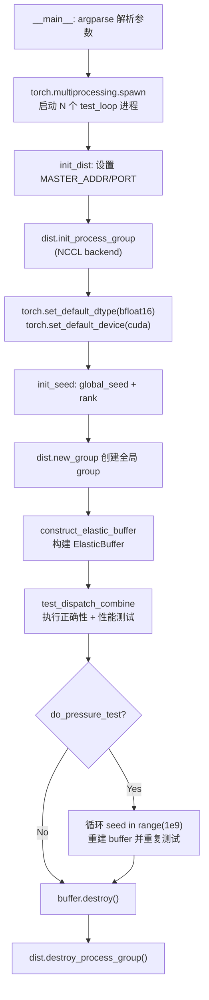
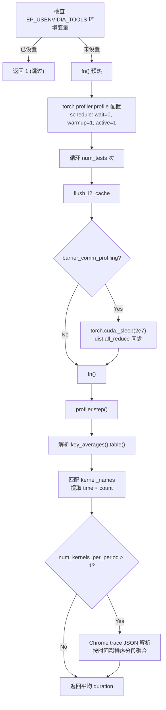
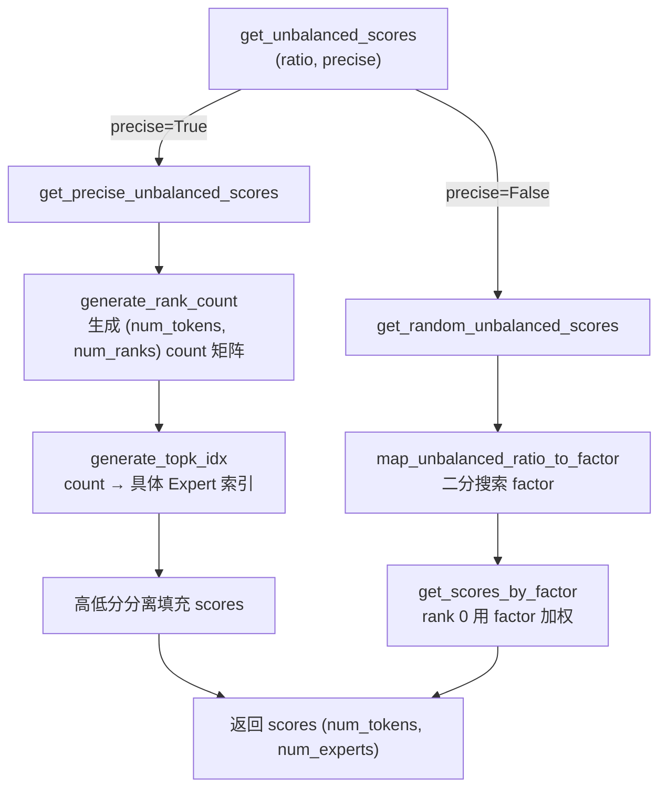
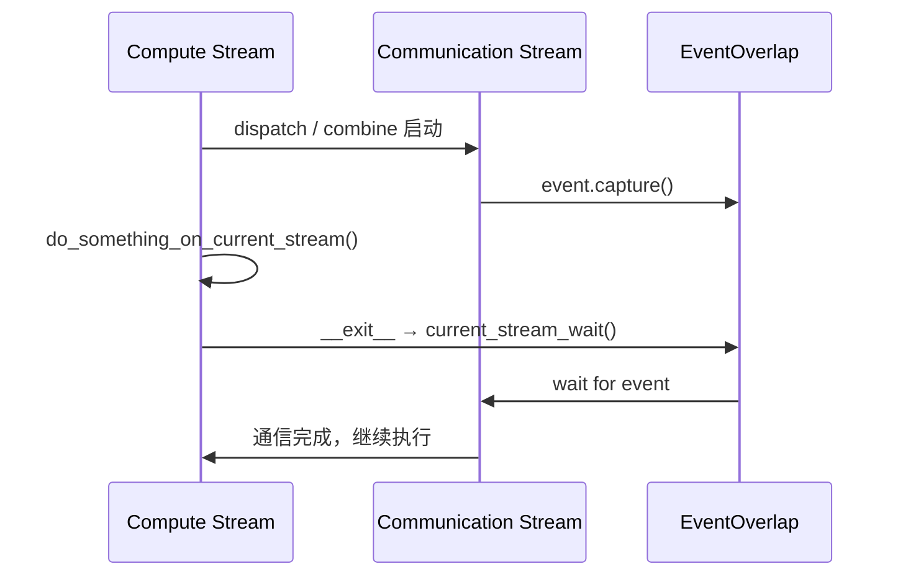

# DeepEP 测试基础设施与通用工具深度分析

## 1. 概述

DeepEP 的测试基础设施是一个面向多 GPU 分布式 Expert Parallelism (EP) 场景的**全栈验证系统**，涵盖分布式进程组初始化、参考实现（Reference Implementation）、数值精度验证、性能基准测试（Benchmark）、硬件带宽探测等核心模块。测试设计的核心哲学是 **"bitwise identical"** —— 对于确定性算法，要求 GPU kernel 输出与 PyTorch 参考实现**逐比特一致**，而非传统的误差容忍比较。

### 文件结构总览

```
DeepEP/
├── tests/
│   ├── elastic/
│   │   ├── test_ep.py          # 核心: Dispatch/Combine 正确性 + 性能测试
│   │   ├── test_agrs.py        # AllGather/ReduceScatter 测试
│   │   ├── test_barrier.py     # Barrier 同步原语测试
│   │   ├── test_engram.py      # Engram 内存管理测试
│   │   └── test_pp.py          # Pipeline Parallelism 测试
│   ├── legacy/                 # 旧版 (V1) 测试
│   └── utils/                  # 工具测试
└── deep_ep/utils/
    ├── __init__.py             # 导出 EventHandle
    ├── testing.py              # bench / bench_kineto / flush_l2_cache
    ├── gate.py                 # 非均衡 MoE 流量生成 (Unbalanced Score)
    ├── comm.py                 # NCCL Communicator 封装
    ├── envs.py                 # 分布式初始化 / 硬件探测
    ├── event.py                # EventOverlap CUDA 事件封装
    ├── refs.py                 # PyTorch 参考实现 (dispatch / combine)
    ├── math.py                 # FP8 编解码 / 对齐 / 差异计算
    ├── semantic.py             # weak_lru / value_or
    └── find_pkgs.py            # NVIDIA 包路径探测
```

---

## 2. 测试初始化：分布式进程组构建

### 2.1 `init_dist` —— 分布式环境初始化

`envs.py:73-113` 定义了测试入口的分布式初始化流程：

```python
# envs.py:73-113
def init_dist(local_rank: int, num_local_ranks: int, seed: int = 0) -> Tuple[int, int, dist.ProcessGroup]:
    ip = os.getenv('MASTER_ADDR', '127.0.0.1')
    port = int(os.getenv('MASTER_PORT', '8361'))
    num_nodes = int(os.getenv('WORLD_SIZE', 1))
    node_rank = int(os.getenv('RANK', 0))

    sig = inspect.signature(dist.init_process_group)
    params = {
        'backend': 'nccl',
        'init_method': f'tcp://{ip}:{port}',
        'world_size': num_nodes * num_local_ranks,
        'rank': node_rank * num_local_ranks + local_rank,
    }
    if 'device_id' in sig.parameters:
        params['device_id'] = torch.device(f'cuda:{local_rank}')
    dist.init_process_group(**params)
    torch.set_default_dtype(torch.bfloat16)
    torch.set_default_device('cuda')
    torch.cuda.set_device(local_rank)

    init_seed(seed)
    return dist.get_rank(), dist.get_world_size(), dist.new_group(list(range(num_local_ranks * num_nodes)))
```

**关键设计要点**：

| 要素 | 实现 | 说明 |
|------|------|------|
| 后端 | `nccl` | 强制使用 NCCL 后端，匹配生产环境 |
| 默认 dtype | `torch.bfloat16` | 全局设定，所有未指定 dtype 的张量默认为 BF16 |
| 默认 device | `cuda` | 避免 CPU/GPU 混用导致的隐性同步 |
| `device_id` 兼容 | `inspect.signature` 探测 | 适配不同 PyTorch 版本（新版的 `device_id` 参数） |
| 全局 group | `dist.new_group(list(range(N)))` | 创建包含所有 rank 的全局通信组 |

### 2.2 测试启动流程

`test_ep.py:564-609` 使用 `torch.multiprocessing.spawn` 启动多进程测试：

```python
# test_ep.py:609
torch.multiprocessing.spawn(test_loop, args=(num_processes, args), nprocs=num_processes)
```

### 2.3 初始化流程图



---

## 3. `testing.py` —— 性能基准测试工具集

`testing.py` 提供了三个核心工具：`flush_l2_cache`、`bench`、`bench_kineto`，以及一个 IO 抑制上下文管理器。

### 3.1 `flush_l2_cache` —— L2 Cache 刷新

```python
# testing.py:12-21
def flush_l2_cache(enabled: bool = True):
    l2_flush_cache_size = 256e6
    if enabled:
        torch.empty(int(l2_flush_cache_size // 4), dtype=torch.int, device='cuda').zero_()
```

**原理**：分配 256MB / 4 = 64M 个 int（256MB）零初始化张量，用大量无效数据冲刷 L2 Cache，确保每次 benchmark 迭代从相同的缓存状态开始。这是 GPU benchmark 的标准做法 —— 避免前一次迭代的残留缓存影响当前迭代的命中率。

### 3.2 `bench` —— 基于 CUDA Event 的粗粒度 Benchmark

```python
# testing.py:24-60
def bench(fn, num_warmups: int = 50, num_tests: int = 50,
          post_fn: Optional[Callable] = None, flush_l2: bool = True):
    torch.cuda.synchronize()
    for _ in range(num_warmups):
        fn()
    start_events = [torch.cuda.Event(enable_timing=True) for _ in range(num_tests)]
    end_events = [torch.cuda.Event(enable_timing=True) for _ in range(num_tests)]
    for i in range(num_tests):
        flush_l2_cache(flush_l2)
        start_events[i].record()
        fn()
        end_events[i].record()
        if post_fn is not None:
            post_fn()
    torch.cuda.synchronize()
    times = np.array([s.elapsed_time(e) / 1e3 for s, e in zip(start_events, end_events)])[1:]
    return np.average(times), np.min(times), np.max(times)
```

**设计要点**：
- **Warmup 50 次**：消除 JIT 编译、CUDA context 初始化等一次性开销
- **跳过首次测量**：`times[1:]` 排除第一次可能存在的延迟峰值
- **返回 avg/min/max**：提供统计分布信息

### 3.3 `bench_kineto` —— 基于 PyTorch Profiler 的细粒度 Kernel 级 Benchmark

这是测试框架中**最精巧的工具**，用于测量单个 CUDA kernel 的执行时间：

```python
# testing.py:111-219
def bench_kineto(fn, kernel_names: Union[str, tuple], num_tests: int = 30,
                 suppress_kineto_output: bool = False, trace_path: Optional[str] = None,
                 flush_l2: bool = True, barrier_comm_profiling: bool = False,
                 num_kernels_per_period: int = 1, barrier: Optional[Callable] = None):
```

**核心流程**：



**关键设计**：

1. **与 Nsight 工具互斥**（L143-144）：检测到 `EP_USE_NVIDIA_TOOLS` 时直接跳过，避免 profiler 冲突
2. **Barrier 消除 CPU 发射不均**（L164-171）：`torch.cuda._sleep(2e7)` (~10ms 大 kernel) + `dist.all_reduce` 同步所有 rank 的 CPU 发射
3. **多 kernel 周期展开**（L205-216）：当单次 `fn()` 调用会发射多个同类 kernel 时（如 dispatch 的 `dispatch_impl` + `dispatch_copy_epilogue_impl`），从 Chrome trace 按时间戳排序后分段计算每个 kernel pattern 的平均耗时

### 3.4 `suppress_stdout_stderr` —— IO 抑制

```python
# testing.py:72-108
class suppress_stdout_stderr:
    def __enter__(self):
        self.outnull_file = open(os.devnull, 'w')
        self.errnull_file = open(os.devnull, 'w')
        self.old_stdout_fileno = os.dup(sys.stdout.fileno())
        self.old_stderr_fileno = os.dup(sys.stderr.fileno())
        os.dup2(self.outnull_file.fileno(), self.old_stdout_fileno_undup)
        os.dup2(self.errnull_file.fileno(), self.old_stderr_fileno_undup)
        ...
```

通过 `os.dup2` 将 stdout/stderr 重定向到 `/dev/null`，用于抑制 PyTorch profiler 的冗余输出。使用底层文件描述符操作而非简单的 `sys.stdout` 赋值，确保 C 扩展层的输出也被抑制。

---

## 4. `gate.py` —— 非均衡 MoE 流量生成

`gate.py` 是测试数据生成的核心，专门用于模拟**非均衡 Expert 选择**（Unbalanced Routing），这是 MoE 系统中最具挑战性的场景。

### 4.1 问题定义

在真实 MoE 负载中，某些 Expert 会被过度选择（Hot Expert 问题），导致通信不均。测试框架需要可控地生成这种非均衡分布：

- **ratio = 1.0**：完全均衡
- **ratio > 1.0**：某个特殊 rank 的流量是其他 rank 的 `ratio` 倍

### 4.2 两种生成策略

#### 策略 A：`get_precise_unbalanced_scores` —— 精确非均衡

```python
# gate.py:116-137
def get_precise_unbalanced_scores(num_tokens, num_experts, num_ranks, num_topk, ratio):
    rank_count = generate_rank_count(num_tokens, num_experts, num_ranks, num_topk, ratio)
    threshold = 0.9
    scores = torch.empty((num_tokens, num_experts), dtype=torch.float32, device='cuda')
    scores.uniform_(to=threshold)                  # 低分填充
    topk_idx = generate_topk_idx(rank_count, ...)
    topk_scores = torch.empty((num_tokens, num_topk), ...)
    topk_scores.uniform_(threshold + 1e-6, 1.0)    # 高分填充
    scores[row_idx, topk_idx] = topk_scores
    return scores
```

**算法流程**：
1. `generate_rank_count`：先生成每个 token 选择各 rank 的 Expert 数量分布（一个 `(num_tokens, num_ranks)` 的 count 矩阵）
2. `generate_topk_idx`：将 count 映射为具体的 Expert 索引，通过随机排列避免模式化
3. **高低分分离**：被选中的 Expert 给 0.9-1.0 高分，其余给 0-0.9 低分，确保 topk 选择的确定性

#### 策略 B：`get_random_unbalanced_scores` —— 随机非均衡

```python
# gate.py:167-173
def get_random_unbalanced_scores(num_tokens, num_experts, num_ranks, num_topk, ratio):
    factor = 1.0
    if ratio != 1.0:
        factor = map_unbalanced_ratio_to_factor(num_tokens, num_experts, num_ranks, num_topk, ratio)
    return get_scores_by_factor(num_tokens, num_experts, num_ranks, factor)
```

使用**二分搜索**（`map_unbalanced_ratio_to_factor`，L148-164）找到使 rank 0 流量达到 `ratio` 倍的 factor 值：

```python
# gate.py:148-164
def map_unbalanced_ratio_to_factor(...):
    factor_l, factor_r = 1.0, 100.0
    for _i in range(num_iterations):  # 20 次迭代
        factor_mid = (factor_l + factor_r) / 2
        scores = get_scores_by_factor(...)
        _, topk_idx = torch.topk(scores, num_topk, ...)
        rank_idx = topk_idx // num_experts_per_rank
        one_hot = torch.nn.functional.one_hot(rank_idx, num_ranks)
        counts = one_hot.any(dim=1).to(torch.float).sum(dim=0)
        if counts[0].item() > counts[1:].mean().item() * ratio:
            factor_r = factor_mid
        else:
            factor_l = factor_mid
    return factor_l
```

### 4.3 `generate_rank_count` —— 核心分布生成算法

```python
# gate.py:32-113
def generate_rank_count(num_tokens, num_experts, num_ranks, num_topk, ratio):
    # 1. 随机 topk 选择，计算每个 token 覆盖的 rank 数 a[i]
    random_scores = torch.rand(num_tokens, num_experts, device='cuda')
    topk_weights_, topk_indices = torch.topk(random_scores, num_topk, ...)
    topk_indices //= num_experts_per_rank
    sorted_topk_indices = torch.sort(topk_indices, dim=1)[0]
    topk_indices_diff_mask = sorted_topk_indices[:, 1:] != sorted_topk_indices[:, :-1]
    a = topk_indices_diff_mask.sum(dim=1) + 1

    # 2. 计算特殊 rank 必须/可选出现的 token 数
    upper_bound_per_token = int(num_normal_ranks / ratio) + 1
    a = torch.clamp(a, None, upper_bound_per_token)
    must_mask = (a == num_ranks)
    ...

    # 3. 生成 rank 排列并插入特殊 rank
    rank_perm = (torch.randperm(num_normal_ranks, device='cuda') + 1).repeat(...)
    rank_perm_with_special_rank = torch.zeros(num_tokens * num_topk, ...)
    # ... 复杂的索引计算 ...

    # 4. scatter_add 生成最终 count
    rank_count = torch.zeros((num_tokens, num_ranks), dtype=torch.int32, device='cuda')
    rank_count.scatter_add_(dim=1, index=result, src=torch.ones_like(result, dtype=torch.int32))
    return rank_count
```

**算法本质**：通过控制"特殊 rank 必须出现在 topk 中的 token 数量"来精确调控流量倾斜比，同时保持随机性以避免测试偏差。

### 4.4 数据生成流程图



---

## 5. `comm.py` —— NCCL Communicator 封装

### 5.1 `NCCLCommHandle` —— 生命周期管理

```python
# comm.py:11-37
class NCCLCommHandle:
    def __init__(self, nccl_comm: int, managed: bool):
        self.nccl_comm = nccl_comm
        self.managed = managed
        self.destroy = _C.destroy_nccl_comm

    def __del__(self):
        if self.managed:
            self.destroy(self.nccl_comm)
```

DeepEP 的 C++ 层需要直接操作 NCCL communicator 的裸指针（`int` 类型）。`NCCLCommHandle` 封装了这个指针的生命周期：
- `managed=True`：DeepEP 自己创建的 comm，`__del__` 时调用 `_C.destroy_nccl_comm` 销毁
- `managed=False`：复用 PyTorch 的 comm，不主动销毁

### 5.2 `get_nccl_comm_handle` —— 缓存与复用

```python
# comm.py:42-75
_storage = dict()

def get_nccl_comm_handle(group: dist.ProcessGroup, force_new_comm: bool = False) -> NCCLCommHandle:
    global _storage
    if not force_new_comm and group in _storage:
        return _storage[group]

    backend = group._get_backend(torch.device('cuda'))
    if not force_new_comm and hasattr(backend, '_comm_ptr') and int(os.getenv('EP_REUSE_NCCL_COMM', '1')):
        _storage[group] = NCCLCommHandle(backend._comm_ptr(), False)
        return _storage[group]

    # 旧版 PyTorch: 手动 all_gather unique_id 后创建新 comm
    nccl_unique_ids = [None, ] * group.size()
    dist.all_gather_object(nccl_unique_ids, _C.get_local_nccl_unique_id(), group)
    root_unique_id = nccl_unique_ids[0]
    key = time.time_ns() if force_new_comm else group
    _storage[key] = NCCLCommHandle(
        _C.create_nccl_comm(root_unique_id, group.size(), group.rank()), True)
    return _storage[key]
```

**三种获取路径**：

| 场景 | 行为 | 说明 |
|------|------|------|
| 缓存命中 | 直接返回 | 避免重复创建 |
| PyTorch 有 `_comm_ptr` | 复用，`managed=False` | 现代 PyTorch 默认路径 |
| 旧版 PyTorch | `all_gather_object` + 新建 | 兼容性回退 |

`EP_REUSE_NCCL_COMM=1`（默认）控制是否允许复用 PyTorch 的 communicator。`force_new_comm=True` 用于需要独立 comm 的场景（避免与 PyTorch 的通信冲突）。

---

## 6. `envs.py` —— 环境探测与硬件检测

### 6.1 种子管理

```python
# envs.py:24-35
def init_seed(global_seed: int) -> None:
    global _local_seed, _global_seed
    _local_seed = global_seed + dist.get_rank()
    _global_seed = global_seed
    torch.manual_seed(_local_seed)
    random.seed(_local_seed)
```

**设计**：local_seed = global_seed + rank，确保每个 rank 生成**不同的随机数据**（这对 EP 正确性至关重要 —— 不同 rank 必须有不同的 token 和路由），同时保持可复现性。

### 6.2 `dist_print` —— 分布式安全打印

```python
# envs.py:58-70
def dist_print(s: str = '', once_in_node: bool = False) -> None:
    global _local_rank
    assert _local_rank is not None
    if not once_in_node or _local_rank == 0:
        print(s, flush=True)
    dist.barrier()
```

**关键**：末尾有 `dist.barrier()`，确保所有 rank 同步到达后才继续，避免某 rank 的打印阻塞其他 rank 的等待。`once_in_node=True` 时仅 local_rank 0 打印，减少多节点场景下的输出冗余。

### 6.3 物理 / 逻辑域大小获取

```python
# envs.py:116-142
def get_physical_domain_size(group) -> Tuple[int, int]:
    return _C.get_physical_domain_size(get_nccl_comm_handle(group).get())

def get_logical_domain_size(group, allow_hybrid_mode=True) -> Tuple[int, int]:
    return _C.get_logical_domain_size(get_nccl_comm_handle(group).get(), allow_hybrid_mode)
```

- **物理域**：`(num_rdma_ranks, num_nvlink_ranks)` —— 硬件拓扑决定
- **逻辑域**：`(num_scaleout_ranks, num_scaleup_ranks)` —— 由 EP 配置决定，`allow_hybrid_mode` 控制是否允许混合模式

### 6.4 硬件带宽探测

#### NVLink 带宽

```python
# envs.py:192-219
@functools.lru_cache()
def get_nvlink_gbs(factor: float = 0.9) -> float:
    result = subprocess.run(['nvidia-smi', 'nvlink', '-s'], ...)
    pattern = r'GPU \d+:.*?(?=^GPU \d+:|^$)'
    match = re.search(pattern, output, re.MULTILINE | re.DOTALL)
    gpu_block = match.group(0)
    link_pattern = r'Link \d+:\s*([\d\.]+) GB/s'
    link_matches = re.findall(link_pattern, gpu_block)
    return sum(float(bw) for bw in link_matches) * factor
```

解析 `nvidia-smi nvlink -s` 输出，汇总所有 Link 的带宽后乘以 `factor=0.9`（效率系数）。

#### RDMA 带宽

```python
# envs.py:245-268
@functools.lru_cache()
def get_rdma_gbs(nic_name: str = _DEFAULT_NIC_NAME) -> float:
    result = subprocess.run(['ibstat'], ...)
    pattern = rf"CA '{nic_name}'.*?Port \d+:\s*.*?Rate:\s*(\d+)"
    match = re.search(pattern, output, re.DOTALL)
    rate = int(match.group(1))
    return rate / 8  # Gb/s → GB/s
```

解析 `ibstat` 输出，提取指定 NIC（默认 `mlx5_0`）的端口速率。`rate / 8` 将 Gb/s 转为 GB/s。

#### 快速 RDMA 原子操作检测

```python
# envs.py:222-242
@functools.lru_cache()
def check_fast_rdma_atomic_support(nic_name: str = _DEFAULT_NIC_NAME) -> bool:
    result = subprocess.run(['ibstat'], ...)
    pattern = rf"CA '{nic_name}'.*?CA type:\s*(\S+)"
    match = re.search(pattern, output, re.DOTALL)
    return match.group(1) == 'MT4131'
```

检测 NIC 是否为 MT4131 型号（支持快速 RDMA 原子操作），用于决定是否启用某些低延迟优化路径。

### 6.5 其他环境检测

| 函数 | 功能 |
|------|------|
| `check_nvlink_connections` | PCIe GPU 场景下用 `pynvml` 检查 NVLink P2P 连通性 |
| `check_torch_deterministic` | 确保 `deterministic_algorithms` 和 `fill_uninitialized_memory` 不同时为 True（会导致 `torch.empty` 初始化 kernel 与通信 stream 冲突） |

---

## 7. `event.py` —— EventOverlap CUDA 事件封装

### 7.1 类设计

```python
# event.py:8-96
class EventOverlap:
    def __init__(self, event: Optional[EventHandle] = None,
                 extra_tensors: Optional[Tuple[torch.Tensor]] = None):
        self.event = event
        self.extra_tensors = extra_tensors
        self._release_handle_by_call = False
        self.hook_after_wait: Optional[Callable] = None
```

### 7.2 核心方法

#### `current_stream_wait` —— 流同步 + Hook 触发

```python
# event.py:39-54
def current_stream_wait(self, release_handle: bool = False) -> None:
    assert self.event is not None
    self.event.current_stream_wait()
    if self.hook_after_wait is not None:
        self.hook_after_wait()
        self.hook_after_wait = None
    if release_handle:
        self.event = None
```

**Hook 机制**：`hook_after_wait` 允许在等待完成后执行回调，用于 deterministic dispatch 场景 —— 通信完成后需要在当前 stream 上执行排序操作。

#### 上下文管理器模式 —— 计算与通信重叠

```python
# event.py:74-96
def __enter__(self) -> Any:
    return self

def __exit__(self, exc_type, exc_val, exc_tb) -> None:
    if self.event is not None:
        self.current_stream_wait(release_handle=self._release_handle_by_call)
    self._release_handle_by_call = False
```

**使用模式**：

```python
event_overlap = event_after_all_to_all_kernels()
with event_overlap:
    do_something_on_current_stream()  # 与通信并行执行
# 退出 with 时自动 current_stream_wait
```

### 7.3 `extra_tensors` —— CUDA Graph 兼容的 Stream Recording

注释说明（L27-29）：`extra_tensors` 用于模拟 PyTorch tensor 的 `record_stream` 行为。标准 `record_stream` 与 CUDA Graph 不兼容，通过持有 tensor 的额外引用来延迟释放，确保事件等待完成前 tensor 不被回收。

### 7.4 EventOverlap 使用模式图



---

## 8. `refs.py` —— PyTorch 参考实现

参考实现（Reference Implementation）是测试正确性的**金标准**。DeepEP 的 GPU kernel 输出必须与参考实现 bitwise identical。

### 8.1 `ref_dispatch` —— Dispatch 参考实现

```python
# refs.py:10-123
def dispatch(x, topk_idx, topk_weights, num_max_tokens_per_rank, num_experts):
    # 1. 按目标 rank 分组发送数据
    for dst_rank_idx in range(num_ranks):
        expert_start_idx = dst_rank_idx * num_experts_per_rank
        expert_end_idx = expert_start_idx + num_experts_per_rank
        mask_to_send = ((expert_start_idx <= topk_idx) & (topk_idx < expert_end_idx)).any(dim=1)
        indices_to_send = mask_to_send.nonzero(as_tuple=True)[0]
        # ... 选择 x, sf, topk_idx, topk_weights ...

    # 2. all_to_all_single 交换大小和数据
    dist.all_to_all_single(num_recv_tokens_per_rank, num_send_tokens_per_rank)
    dist.all_to_all_single(recv_x, send_x, ...)
    # ... 其他张量同理 ...

    # 3. 本地 Expert 索引转换 + mask
    recv_topk_idx = recv_topk_idx - expert_start_idx
    recv_topk_idx.masked_fill_(~mask, -1)
```

**关键点**：
- 使用 `dist.all_to_all_single`（PyTorch 的 NCCL 封装）作为通信原语
- `src_token_global_idx = src_rank_idx * num_max_tokens_per_rank + src_token_local_idx` 的全局索引编码方式与 DeepEP 一致
- 不在本 rank 的 Expert 索引置为 `-1`

### 8.2 `ref_combine` —— Combine 参考实现

```python
# refs.py:177-243
def combine(y, topk_idx, num_scaleout_ranks, num_scaleup_ranks, num_experts,
            bias, reduce_in_local, reduce_in_scaleup):
```

**三种模式**：
- `(True, True)` → Hybrid combine（先 rank 内 reduce，再 scaleup 内 reduce）
- `(True, False)` → Non-hybrid combine（仅 rank 内 reduce）
- `(False, False)` → 无 reduce，直接 accumulate

核心是 `grouped_reduce` 函数，按 `group_id` 分组进行**有序 segmented reduce**：

```python
# refs.py:201-234
def grouped_reduce(data_to_reduce, group_id):
    group_id, src_indices = torch.sort(group_id, dim=-1, stable=True)
    # 重排 data 使同组连续
    data_to_reduce = data_to_reduce.view(-1, hidden)[transformed_src_indices]...
    # 逐 topk 维度扫描，检测 segment break
    for i in range(num_topk):
        is_segment_break = ... group_id[:, i] != group_id[:, i + 1]
        cur_accum_buf += data_to_reduce[:, i, :].float()
        data_to_reduce[segment_break_token_indices, i] = cur_accum_buf[...]
        cur_accum_buf[segment_break_token_indices] = 0.0
```

### 8.3 `generate_pre_combine_data` —— 确定性测试数据生成

```python
# refs.py:126-153
def generate_pre_combine_data(src_token_global_idx, num_max_tokens_per_rank, num_topk, hidden):
    token_seeds = (src_token_global_idx.unsqueeze(1) * num_topk +
                   torch.arange(num_topk, ...).unsqueeze(0))
    max_seed = num_ranks * num_max_tokens_per_rank * num_topk
    result = torch.sin(
        (((token_seeds * 131071 % max_seed).float() + 1) / max_seed).unsqueeze(-1) *
        torch.arange(1, hidden + 1, ...) +
        math.sin(float(get_global_seed()))
    )
    return result.to(torch.bfloat16)
```

**设计精妙之处**：
1. **确定性**：仅依赖 `src_token_global_idx` 和 `global_seed`，所有 rank 可独立生成
2. **唯一性**：`token_seeds = global_idx * num_topk + j` 保证每个 (token, topk_slot) 有不同的 seed
3. **素数哈希**：`131071`（2^17 - 1，Mersenne 素数）取模确保 seed 分布均匀
4. **sin 函数**：将 seed 映射到 BF16 可表示的值域
5. **可复现性**：`math.sin(float(get_global_seed()))` 引入全局种子偏移

---

## 9. `math.py` —— 数学工具集

### 9.1 FP8 编解码

```python
# math.py:30-56
@torch.compile(dynamic=True)
def per_token_cast_to_fp8(x: torch.Tensor) -> Tuple[torch.Tensor, torch.Tensor]:
    # 1. align hidden 到 128
    x_padded = torch.nn.functional.pad(x, (0, aligned_n - n), mode='constant', value=0)
    # 2. 按 128 分组计算 amax
    x_padded_view = x_padded.view(m, -1, 128)
    x_amax = x_padded_view.abs().float().amax(dim=2).view(m, -1).clamp(1e-4)
    # 3. scale = 448 / amax (FP8 E4M3 max = 448)
    return (x_padded_view * (448.0 / x_amax.unsqueeze(2))).to(torch.float8_e4m3fn).view(m, aligned_n)[:, :n].contiguous(), \
           (x_amax / 448.0).view(m, -1)
```

**关键**：`@torch.compile(dynamic=True)` 启用 TorchCompile 加速，`dynamic=True` 允许动态 shape。

### 9.2 差异计算

```python
# math.py:5-9
def calc_diff(x: torch.Tensor, y: torch.Tensor) -> float:
    x, y = x.double() + 1, y.double() + 1
    denominator = (x * x + y * y).sum()
    sim = 2 * (x * y).sum() / denominator
    return (1 - sim).item()
```

这是 **Cosine Similarity 的变体**（加 1 避免零向量问题），用于量化两个张量的差异。返回值越接近 0 表示越相似。

---

## 10. 测试数据生成模式

### 10.1 随机输入生成

```python
# test_ep.py:94-98
x = torch.randn((num_tokens, hidden), dtype=torch.bfloat16, device='cuda')
x = per_token_cast_to_fp8(x) if use_fp8_dispatch else x
bias = torch.randn((num_tokens, hidden), dtype=torch.bfloat16, device='cuda') if num_bias == 1 else None
```

### 10.2 Masked Expert Selection

```python
# test_ep.py:78-81
if args.masked_ratio > 0:
    rand_mask = torch.rand_like(topk_idx, dtype=torch.float)
    topk_idx.masked_fill_(rand_mask < args.masked_ratio, -1)
    topk_weights.masked_fill_(topk_idx < 0, 0)
```

模拟 token 未选中任何 Expert 的场景（topk_idx = -1）。

### 10.3 全模式枚举

```python
# test_ep.py:22-31
def enumerate_ep_modes():
    for do_handle_copy in (1, 0):
        for expert_alignment in (128, 1):
            for use_fp8_dispatch in (1, 0):
                for num_bias in (0, 1, 2):
                    for with_previous_event in (0, 1):
                        for async_with_compute_stream in (0, 1):
                            for allocate_on_comm_stream in ((1, ) if with_previous_event else (0, 1)):
                                yield (do_handle_copy, expert_alignment, use_fp8_dispatch, num_bias,
                                       with_previous_event, async_with_compute_stream, allocate_on_comm_stream)
```

**2 × 2 × 2 × 3 × 2 × 2 × ~1 = ~96 种组合**，覆盖所有功能交叉场景。这是**组合测试**的典型案例。

---

## 11. 验证模式

### 11.1 Bitwise Identical（主要验证方式）

```python
# test_ep.py:503-508
assert torch.equal(combined_x, ref_combined_y), \
    f'Diff: {calc_diff(combined_x, ref_combined_y)}'
assert torch.equal(reduced_combined_x, ref_reduced_combined_y), \
    f'Diff: {calc_diff(reduced_combined_x, ref_reduced_combined_y)}'
assert torch.equal(combined_topk_weights, topk_weights), \
    f'{calc_diff(combined_topk_weights, topk_weights)}'
```

**`torch.equal`** 要求逐比特一致。这是 DeepEP 测试的核心验证方式，因为：
1. Dispatch 是确定性路由 —— 给定相同输入，接收的数据应完全相同
2. Combine 使用 deterministic algorithm —— 累加顺序确定，结果唯一
3. BF16 精度下，只要计算顺序一致，结果必然 bitwise identical

### 11.2 差异诊断

当 bitwise 不一致时，`calc_diff` 提供量化诊断信息：

```python
# test_ep.py:500
assert torch.equal(ref_t, t), f'{ref_t=}, {t=}'
```

### 11.3 专家计数验证

```python
# test_ep.py:448-462
for i in range(num_local_experts):
    ref_count = (ref_recv_topk_idx == i).sum().item()
    aligned_ref_count = align(ref_count, expert_alignment)
    assert ref_count == cumulative_local_expert_recv_stats[i].item()
    assert aligned_ref_count == handle.num_recv_tokens_per_expert_list[i]
```

### 11.4 Zero Padding 验证

```python
# test_ep.py:424-428
for expert_idx in range(num_local_experts):
    start = expanded_handle.psum_num_recv_tokens_per_expert[expert_idx].item()
    end = align(start, expert_alignment)
    assert (cached_expanded_recv_x_bf16[start:end] == 0).all()
    assert (cached_expanded_recv_topk_weights[start:end] == 0).all()
```

### 11.5 Deterministic 模式验证

```python
# test_ep.py:388-397
if args.deterministic:
    recv_x_twice, ... = launch(buffer, 'dispatch', ...)
    assert torch.equal(recv_x_bf16, recv_x_twice_bf16)
    assert torch.equal(recv_topk_idx, recv_topk_idx_twice[:num_recv_tokens])
```

运行两次 dispatch 并验证结果完全一致，确保 deterministic 算法的可靠性。

---

## 12. 性能度量模式

### 12.1 带宽计算

```python
# test_ep.py:253-255
num_bytes_per_dispatch_token = safe_div(count_bytes(recv_x, recv_topk_idx, recv_topk_weights), recv_topk_idx.size(0))
num_scaleup_bytes = num_bytes_per_dispatch_token * num_scaleup_recv_tokens
num_scaleout_bytes = num_bytes_per_dispatch_token * num_scaleout_send_tokens
```

### 12.2 吞吐量报告

```python
# test_ep.py:259-263
dist_print(f'   * EP: {buffer.rank_idx:3}/{buffer.num_ranks} | '
        f'dispatch: '
        f'{num_scaleout_bytes / t / 1e9:.0f} GB/s (SO), '
        f'{num_scaleup_bytes / t / 1e9:.0f} GB/s (SU), {t * 1e6:.3f} us, {num_scaleup_bytes:.0f} bytes | '
        f'copy: {2 * num_recv_tokens * num_bytes_per_dispatch_token / copy_t / 1e9:.0f} GB/s, {copy_t * 1e6:.3f} us')
```

**报告维度**：
- Scale-Out GB/s：跨节点 RDMA 吞吐
- Scale-Up GB/s：节点内 NVLink 吞吐
- 延迟 (μs)
- Copy 阶段带宽
- 总字节数

### 12.3 流量分析

测试框架精确计算每个 rank 的发送/接收 token 数，区分 scaleout 和 scaleup 流量：

```python
# test_ep.py:240-245
dst_scaleout_rank_idx = topk_idx // (num_experts // num_scaleout_ranks)
num_scaleout_send_tokens = 0
for i in range(num_scaleout_ranks if num_scaleout_ranks > 1 else 0):
    if args.ignore_local_traffic and i == dist.get_rank() // num_scaleup_ranks:
        continue
    num_scaleout_send_tokens += (dst_scaleout_rank_idx == i).any(dim=1).sum().item()
```

---

## 13. 其他工具

### 13.1 `semantic.py` —— `weak_lru`

```python
# semantic.py:9-27
def weak_lru(maxsize: Optional[int] = 128, typed: bool = False):
    def wrapper(func):
        @functools.lru_cache(maxsize, typed)
        def _func(_self, *args, **kwargs):
            return func(_self(), *args, **kwargs)
        @functools.wraps(func)
        def inner(self, *args, **kwargs):
            return _func(weakref.ref(self), *args, **kwargs)
        return inner
    return wrapper
```

使用 `weakref.ref(self)` 作为 LRU cache 的键，避免 `lru_cache` 持有 `self` 的强引用导致内存泄漏。适用于需要缓存方法的场景。

### 13.2 `find_pkgs.py` —— NVIDIA 包路径探测

```python
# find_pkgs.py:8-54
def find_pkg_root(name: str, lib_name: Optional[str] = None, optional: bool = False):
    # 1. 检查环境变量 EP_{NAME}_ROOT_DIR 和 {NAME}_DIR
    # 2. 遍历 importlib.metadata.distributions()
    # 3. 匹配 nvidia-{name} 包名
    # 4. 查找 lib_name 文件确定 root
```

用于在构建 / 运行时定位 NCCL、NVSHMEM 等 NVIDIA 库的安装路径。

---

## 14. 设计哲学总结

### 14.1 "Bitwise or Nothing"

DeepEP 测试不采用误差容忍（atol/rtol）比较，而是要求 **bitwise identical**。这之所以可行，是因为：
1. 所有计算在 BF16 下是确定性的（无 TF32 等自动精度提升）
2. 使用 `deterministic_sort` 保证累加顺序一致
3. 通信是 all_to_all 的确定性置换

### 14.2 全模式覆盖

`enumerate_ep_modes` 枚举所有功能开关的组合，确保新功能不会在某个组合下回归。

### 14.3 硬件感知

`get_nvlink_gbs`、`get_rdma_gbs`、`check_fast_rdma_atomic_support` 使测试能感知硬件能力，据此调整性能预期或启用/禁用特定优化路径。

### 14.4 参考实现驱动

所有正确性验证基于独立的 PyTorch 参考实现（`refs.py`），而非手工计算的期望值。这保证了：
- 参考实现易于理解和验证
- 任何协议变更只需修改参考实现
- GPU kernel 与参考实现对齐

### 14.5 生产级 Benchmark

`bench_kineto` 不是简单的 `time.time()` 测量，而是：
- 使用 PyTorch profiler 获取真实 kernel 时间
- 消除 CPU 发射不均（barrier_comm_profiling）
- 消除缓存效应（flush_l2_cache）
- 支持多 kernel 周期分析（num_kernels_per_period）

---

## 15. 关键文件行数统计

| 文件 | 行数 | 核心职责 |
|------|------|---------|
| `tests/elastic/test_ep.py` | 610 | 集成测试主入口 |
| `deep_ep/utils/testing.py` | 220 | Benchmark 工具 |
| `deep_ep/utils/gate.py` | 181 | 非均衡流量生成 |
| `deep_ep/utils/comm.py` | 84 | NCCL Comm 封装 |
| `deep_ep/utils/envs.py` | 269 | 环境初始化 / 硬件探测 |
| `deep_ep/utils/event.py` | 97 | CUDA Event 封装 |
| `deep_ep/utils/refs.py` | 244 | PyTorch 参考实现 |
| `deep_ep/utils/math.py` | 104 | FP8 / 数学工具 |
| `deep_ep/utils/semantic.py` | 28 | weak_lru 等 |
| `deep_ep/utils/find_pkgs.py` | 83 | 包路径探测 |
| **合计** | **~1920** | — |

---

## 附录：测试运行命令示例

```bash
# 基本正确性测试 (8 卡)
torchrun --nproc_per_node=8 tests/elastic/test_ep.py --num-tokens 4096 --hidden 7168 --num-experts 256 --num-topk 6

# 跳过正确性验证，仅做性能测试
torchrun --nproc_per_node=8 tests/elastic/test_ep.py --skip-check

# 压力测试 (循环多种子)
torchrun --nproc_per_node=8 tests/elastic/test_ep.py --do-pressure-test

# 非均衡流量测试
torchrun --nproc_per_node=8 tests/elastic/test_ep.py --unbalanced-ratio 2.0

# Deterministic 模式
torchrun --nproc_per_node=8 tests/elastic/test_ep.py --deterministic

# 导出 profiling trace
torchrun --nproc_per_node=8 tests/elastic/test_ep.py --dump-profile-traces ./traces
```
