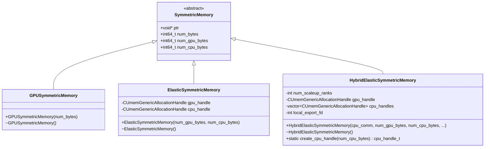
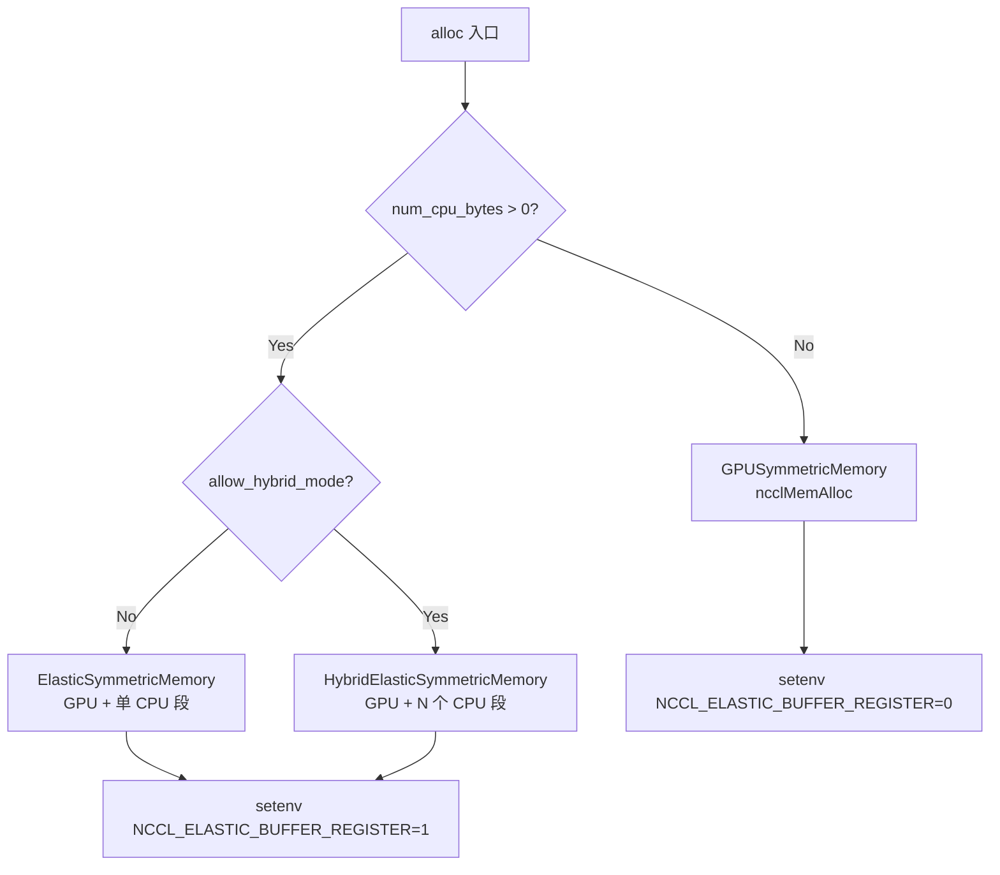
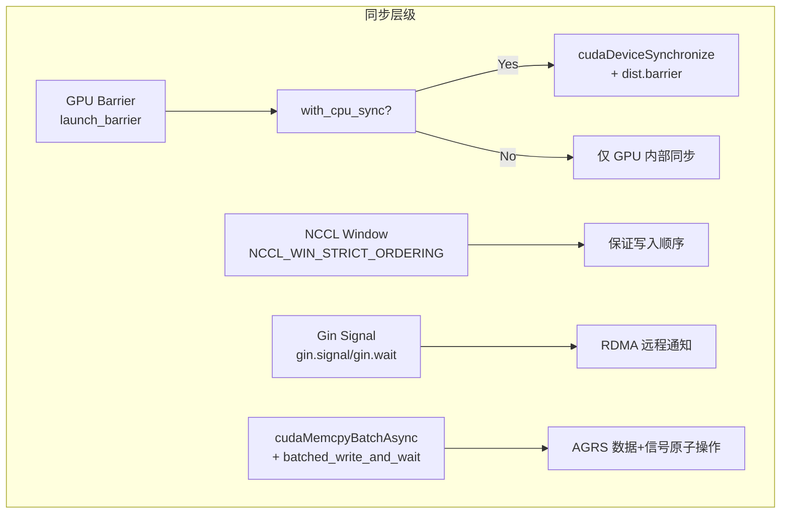

# DeepEP Symmetric Memory 全面架构分析

> 本文档深入分析 DeepEP 中 **symmetric memory（对称内存）** 的所有版本实现（V1 Legacy NVSHMEM 和 V2 Elastic NCCL Gin），涵盖软件依赖、内存类型、分配/映射/访问/同步机制、内核级代码示例，以及 V1 vs V2 的演进对比。

---

## 目录

1. [概述与背景](#1-概述与背景)
2. [软件依赖](#2-软件依赖)
3. [Symmetric Memory 类型体系](#3-symmetric-memory-类型体系)
4. [核心数据结构与分配流程](#4-核心数据结构与分配流程)
5. [指针映射与远程访问机制](#5-指针映射与远程访问机制)
6. [内核级代码示例](#6-内核级代码示例)
7. [同步机制](#7-同步机制)
8. [V1 vs V2 对比分析](#8-v1-vs-v2-对比分析)
9. [Python API 与用户使用示例](#9-python-api-与用户使用示例)
10. [架构洞察总结](#10-架构洞察总结)

---

## 1. 概述与背景

Symmetric memory 是 DeepEP 通信架构的核心基础设施。其本质是：**一块内存，多个 GPU 可以通过各自独立的虚拟地址（VA）访问同一块物理内存**。这使得：

- **NVLink 域内**：GPU 可以直接通过 NVLink 远程直接读写对端 HBM
- **RDMA 域间**：NIC 可以直接通过 GPUDirect RDMA 读写远端 GPU 的 HBM，无需 CPU 介入

```
┌─────────────────────────────────────────────────────────────────────┐
│                    Symmetric Memory 物理布局                         │
├─────────────────────────────────────────────────────────────────────┤
│                                                                     │
│   GPU 0 VA  ──────┐                                                 │
│                   │     ┌──────────────────────────┐                │
│   GPU 1 VA  ──────┼────▶│   Physical Memory        │                │
│                   │     │   (HBM or DRAM)          │                │
│   GPU 2 VA  ──────┘     └──────────────────────────┘                │
│                                                                     │
│   每个 GPU 持有不同的 VA 指针，但映射到同一块物理内存                    │
└─────────────────────────────────────────────────────────────────────┘
```

DeepEP 的 symmetric memory 演进分为两个大版本：

| 版本 | 后端 | 分配 API | 通信 API |
|------|------|---------|---------|
| V1 Legacy | NVSHMEM | `nvshmem_alloc` | `nvshmemi_ibgda_put_nbi` |
| V2 Elastic | NCCL GIN | `ncclMemAlloc` / CUDA Driver API | `ncclGin` |

---

## 2. 软件依赖

### 2.1 PyTorch APIs

DeepEP **未直接使用** `torch.distributed._symmetric_memory`（这是 PyTorch 更高层的封装）。DeepEP 直接调用底层 NCCL 和 CUDA Driver API：

```cpp
// symmetric.hpp:128 - 纯 GPU 分配
NCCL_CHECK(ncclMemAlloc(&ptr, num_bytes));

// symmetric.hpp:164 - CUDA Driver API 分配
CUDA_DRIVER_CHECK(lazy_cuMemAddressReserve(&addr, this->num_bytes, kNumAlignmentBytes, 0, 0));
CUDA_DRIVER_CHECK(lazy_cuMemCreate(&gpu_handle, num_gpu_bytes, &gpu_prop));
CUDA_DRIVER_CHECK(lazy_cuMemMap(addr, num_gpu_bytes, 0, gpu_handle, 0));
```

但 Python 侧使用 `torch.distributed` 进行 bootstrap 信息交换：

```python
# elastic.py:342 - 交换 CPU handle (pid, fd)
dist.all_gather_object(cpu_comm, (pid, fd), self.group)
```

### 2.2 NCCL 要求

| 功能 | NCCL 版本要求 | 说明 |
|------|-------------|------|
| GIN (GPU-initiated Network) | ≥ 2.18+ | V2 Elastic 核心依赖 |
| `ncclDevCommCreate` runtime version | ≥ 2.31 | 编译时/运行时版本解耦 |
| `ncclCommWindowRegister` | ≥ 2.28 | symmetric memory 注册为 NCCL window |
| `ncclMemAlloc` | ≥ 2.20 | 纯 GPU symmetric memory 分配 |
| `ncclGetLsaPointer` | ≥ 2.28 | 获取 NVLink 域内 LSA 指针 |

关键代码（`nccl.cu:100-108`）：

```cpp
// NCCL 2.31+ 使用 runtime version 创建 device communicator
#if NCCL_VERSION_CODE >= NCCL_VERSION(2, 31, 0)
    reqs.useRuntimeVersion = true;
    dev_comm.ptr = malloc(props.devCommRuntimeVersionSize);
#else
    EP_HOST_ASSERT(NCCL_VERSION_CODE == nccl_runtime_version);
    dev_comm.ptr = malloc(sizeof(ncclDevComm_t));
#endif
NCCL_CHECK(ncclDevCommCreate(comm, &reqs, static_cast<ncclDevComm_t*>(dev_comm.ptr)));
```

### 2.3 硬件要求

| 硬件 | 要求 | 用途 |
|------|------|------|
| NVLink | SM90 (H100/H800) 必需 | 节点内 symmetric pointer 直接访问 |
| GPUDirect RDMA | 跨节点通信必需 | NIC 直接读写远端 GPU HBM |
| SM90/SM100 | V2 主要目标架构 | 支持 GIN 和 TMA |
| NVSwitch (可选) | 全连接 NVLink | 更大 scale-up domain |

`DeviceContext` 构造函数（`symmetric.hpp:27-31`）自动检测硬件能力：

```cpp
DeviceContext() {
    CUDA_RUNTIME_CHECK(cudaGetDevice(&device_idx));
    CUDA_DRIVER_CHECK(lazy_cuDeviceGet(&device, device_idx));
    CUDA_DRIVER_CHECK(lazy_cuDeviceGetAttribute(&numa_idx, 
        CU_DEVICE_ATTRIBUTE_HOST_NUMA_ID, device));
}
```

---

## 3. Symmetric Memory 类型体系

DeepEP V2 定义了三种 symmetric memory 类型，根据使用场景自动选择：



### 3.1 GPUSymmetricMemory — 纯 GPU 分配

**当前默认路径**，使用 `ncclMemAlloc` 分配纯 GPU symmetric memory。

```cpp
// symmetric.hpp:124-140
class GPUSymmetricMemory final : public SymmetricMemory {
public:
    explicit GPUSymmetricMemory(const int64_t& num_bytes) {
        EP_HOST_ASSERT(num_bytes > 0 and num_bytes % kNumAlignmentBytes == 0);
        NCCL_CHECK(ncclMemAlloc(&ptr, num_bytes));  // NCCL 分配，自动支持 symmetric
        EP_HOST_ASSERT(reinterpret_cast<uint64_t>(ptr) % kNumAlignmentBytes == 0);
        this->num_bytes = num_bytes;
        this->num_gpu_bytes = num_bytes;
    }

    ~GPUSymmetricMemory() override {
        if (ptr != nullptr) {
            NCCL_CHECK(ncclMemFree(ptr));
            ptr = nullptr;
        }
    }
};
```

**使用场景**：`num_cpu_bytes == 0` 时自动选择，即纯 GPU 通信场景（无 Engram、无 CPU 缓冲区）。

### 3.2 ElasticSymmetricMemory — GPU + CPU 混合分配

使用 CUDA Driver API 分配 **GPU VRAM + CPU RAM（NUMA-local）** 的连续 VA 范围：

```cpp
// symmetric.hpp:145-186
class ElasticSymmetricMemory : public SymmetricMemory {
    CUmemGenericAllocationHandle gpu_handle = {};
    CUmemGenericAllocationHandle cpu_handle = {};

public:
    ElasticSymmetricMemory(const int64_t& num_gpu_bytes, const int64_t& num_cpu_bytes) {
        DeviceContext ctx;
        auto gpu_prop = ctx.gpu_alloc_prop();
        auto cpu_prop = ctx.cpu_alloc_prop();

        this->num_gpu_bytes = num_gpu_bytes;
        this->num_cpu_bytes = num_cpu_bytes;
        this->num_bytes = num_gpu_bytes + num_cpu_bytes;

        // 1. 预留 VA 空间
        CUdeviceptr addr;
        CUDA_DRIVER_CHECK(lazy_cuMemAddressReserve(&addr, this->num_bytes, 
            kNumAlignmentBytes, 0, 0));
        this->ptr = reinterpret_cast<void*>(static_cast<uintptr_t>(addr));

        // 2. 映射 GPU 段
        cumem_create_with_fallback(&gpu_handle, num_gpu_bytes, &gpu_prop);
        CUDA_DRIVER_CHECK(lazy_cuMemMap(addr, num_gpu_bytes, 0, gpu_handle, 0));
        set_access(addr, num_gpu_bytes, ctx.device_idx);

        // 3. 映射 CPU 段
        cumem_create_with_fallback(&cpu_handle, num_cpu_bytes, &cpu_prop);
        CUDA_DRIVER_CHECK(lazy_cuMemMap(addr + num_gpu_bytes, num_cpu_bytes, 0, cpu_handle, 0));
        set_access(addr + num_gpu_bytes, num_cpu_bytes, ctx.device_idx, ctx.numa_idx);
    }
};
```

**内存布局**：

```
┌──────────────────────────────────────────────────────────────┐
│              ElasticSymmetricMemory VA 布局                   │
├──────────────────────────────────────────────────────────────┤
│  [ GPU VRAM (front) ]  [ CPU RAM / NUMA-local (back) ]      │
│  ←── num_gpu_bytes ──→  ←──── num_cpu_bytes ────→           │
│                                                              │
│  整个连续 VA 范围兼容 `ncclCommWindowRegister`                │
└──────────────────────────────────────────────────────────────┘
```

**使用场景**：`num_cpu_bytes > 0` 且 `allow_hybrid_mode == false` 时。

### 3.3 HybridElasticSymmetricMemory — 混合弹性分配

**最复杂的模式**：每个 rank 创建自己的 NUMA-local CPU 段，然后导入并映射所有 intra-node CPU 段到每个 rank 的 VA 空间。

```cpp
// symmetric.hpp:191-289
class HybridElasticSymmetricMemory final : public SymmetricMemory {
    int num_scaleup_ranks;
    CUmemGenericAllocationHandle gpu_handle = {};
    std::vector<CUmemGenericAllocationHandle> cpu_handles;
    int local_export_fd = -1;

public:
    HybridElasticSymmetricMemory(const cpu_comm_t& cpu_comm,
                                 const int64_t& num_gpu_bytes, const int64_t& num_cpu_bytes,
                                 const int& num_scaleup_ranks, const int& scaleout_rank_idx):
        num_scaleup_ranks(num_scaleup_ranks),
        cpu_handles(num_scaleup_ranks) {
        DeviceContext ctx;
        auto gpu_prop = ctx.gpu_alloc_prop();

        this->num_gpu_bytes = num_gpu_bytes;
        this->num_cpu_bytes = num_cpu_bytes;
        this->num_bytes = num_gpu_bytes + num_cpu_bytes * num_scaleup_ranks;

        // 预留 VA
        CUdeviceptr addr;
        CUDA_DRIVER_CHECK(lazy_cuMemAddressReserve(&addr, this->num_bytes, 
            kNumAlignmentBytes, 0, 0));
        this->ptr = reinterpret_cast<void*>(static_cast<uintptr_t>(addr));

        // 映射 GPU 段
        cumem_create_with_fallback(&gpu_handle, num_gpu_bytes, &gpu_prop);
        CUDA_DRIVER_CHECK(lazy_cuMemMap(addr, num_gpu_bytes, 0, gpu_handle, 0));
        set_access(addr, num_gpu_bytes, ctx.device_idx);

        // 导入并映射所有 intra-node CPU 段
        const auto local_pid = getpid();
        for (int i = 0; i < num_scaleup_ranks; ++ i) {
            auto [pid, fd] = cpu_comm[num_scaleup_ranks * scaleout_rank_idx + i];
            int local_fd = fd;
            if (pid != local_pid) {
                // 跨进程：通过 pidfd 导入 FD
                int pidfd = syscall(SYS_pidfd_open, pid, 0);
                local_fd = syscall(SYS_pidfd_getfd, pidfd, fd, 0);
                close(pidfd);
            }

            const auto offset = num_gpu_bytes + i * num_cpu_bytes;
            CUDA_DRIVER_CHECK(lazy_cuMemImportFromShareableHandle(
                &cpu_handles[i],
                reinterpret_cast<void*>(static_cast<uintptr_t>(local_fd)),
                CU_MEM_HANDLE_TYPE_POSIX_FILE_DESCRIPTOR));
            CUDA_DRIVER_CHECK(lazy_cuMemMap(addr + offset, num_cpu_bytes, 0, cpu_handles[i], 0));
            set_access(addr + offset, num_cpu_bytes, ctx.device_idx, ctx.numa_idx);
        }
    }

    // 创建 NUMA-local CPU 段并导出 POSIX FD
    static cpu_handle_t create_cpu_handle(const int64_t& num_cpu_bytes) {
        DeviceContext ctx;
        auto cpu_prop = ctx.cpu_alloc_prop();

        CUmemGenericAllocationHandle handle;
        cumem_create_with_fallback(&handle, num_cpu_bytes, &cpu_prop);

        int fd = -1;
        CUDA_DRIVER_CHECK(lazy_cuMemExportToShareableHandle(
            &fd, handle, CU_MEM_HANDLE_TYPE_POSIX_FILE_DESCRIPTOR, 0));

        // POSIX FD 保持物理内存存活，可以释放 allocation handle
        CUDA_DRIVER_CHECK(lazy_cuMemRelease(handle));
        return {getpid(), fd};
    }
};
```

**内存布局**：

```
┌────────────────────────────────────────────────────────────────────────────┐
│              HybridElasticSymmetricMemory VA 布局                           │
├────────────────────────────────────────────────────────────────────────────┤
│  [GPU VRAM] [CPU rank0] [CPU rank1] [CPU rank2] ... [CPU rank(N-1)]       │
│  ←─ GPU ──→ ←────────── intra-node CPU segments ──────────────→           │
│                                                                            │
│  每个 rank 的 CPU 段是 NUMA-local 的，通过 POSIX FD 跨进程导入               │
└────────────────────────────────────────────────────────────────────────────┘
```

**使用场景**：`num_cpu_bytes > 0` 且 `allow_hybrid_mode == true` 时。

### 3.4 类型选择逻辑

```cpp
// symmetric.hpp:291-317 - 统一分配入口
static std::shared_ptr<SymmetricMemory> alloc(const int64_t& num_gpu_bytes, const int64_t& num_cpu_bytes,
                                              const bool& allow_hybrid_mode = false,
                                              const int& num_scaleup_ranks = 0, const int& scaleout_rank_idx = 0,
                                              const cpu_comm_t& cpu_comm = {}) {
    std::shared_ptr<SymmetricMemory> result;
    if (num_cpu_bytes > 0) {
        if (allow_hybrid_mode) {
            result = std::make_shared<HybridElasticSymmetricMemory>(
                cpu_comm, num_gpu_bytes, num_cpu_bytes,
                num_scaleup_ranks, scaleout_rank_idx);
        } else {
            result = std::make_shared<ElasticSymmetricMemory>(
                num_gpu_bytes, num_cpu_bytes);
        }
    } else {
        result = std::make_shared<GPUSymmetricMemory>(num_gpu_bytes);
    }

    // 如果分配器可能产生 CPU 段，启用 NCCL elastic buffer register
    if (dynamic_cast<ElasticSymmetricMemory*>(result.get()) != nullptr)
        setenv("NCCL_ELASTIC_BUFFER_REGISTER", "1", 0);
    return result;
}
```



---

## 4. 核心数据结构与分配流程

### 4.1 分配流程总览

```mermaid
sequenceDiagram
    participant Python as elastic.py
    participant C++ as buffer.hpp
    participant Sym as symmetric.hpp
    participant NCCL as NCCL Runtime
    participant CUDA as CUDA Driver

    Python->>Python: 计算 buffer 大小
    Python->>Python: create_cpu_handle (if hybrid)
    Python->>Python: dist.all_gather_object 交换 (pid, fd)
    Python->>C++: ElasticBuffer 构造函数
    
    C++->>C++: 计算 workspace + buffer 总大小
    C++->>C++: 创建 NCCLSymmetricMemoryContext
    
    C++->>Sym: symmetric::alloc(num_gpu, num_cpu, hybrid, ...)
    Sym->>NCCL: ncclMemAlloc (纯 GPU)
    Sym->>CUDA: cuMemAddressReserve + cuMemCreate + cuMemMap (含 CPU)
    Sym-->>C++: 返回 SymmetricMemory
    
    C++->>NCCL: ncclCommWindowRegister(comm, ptr, num_bytes, &window)
    C++->>NCCL: ncclGetLsaDevicePointer(window, 0, nvl_rank, &mapped_window_ptr)
    C++->>NCCL: ncclDevCommCreate(comm, &reqs, &dev_comm)
    C++-->>Python: 构造完成
```

### 4.2 NCCLSymmetricMemoryContext — 核心上下文

```cpp
// api.cuh:47-93
struct NCCLSymmetricMemoryContext {
    // 原始窗口指针（不可从外部直接使用）
    void* raw_window_ptr;
    std::shared_ptr<symmetric::SymmetricMemory> symmetric_memory;

    // 全局信息
    int rank_idx;
    int num_ranks;

    // 逻辑域
    int num_scaleout_ranks, num_scaleup_ranks;
    int scaleout_rank_idx, scaleup_rank_idx;

    // 物理域
    int num_rdma_ranks, num_nvl_ranks;
    int rdma_rank_idx, nvl_rank_idx;
    bool is_scaleup_nvlink;

    // NCCL 句柄
    ncclComm_t comm;
    jit::NoRefPtr dev_comm;      // ncclDevComm_t*
    ncclWindow_t window;
    void* mapped_window_ptr;     // 本地映射指针
    std::vector<void*> nvl_window_ptrs;  // NVLink peer 指针

    // 配置
    int num_allocated_qps;
    int64_t num_gpu_bytes;
    int64_t num_cpu_bytes;

    // 获取 symmetric 指针（给定 rank）
    void* get_sym_ptr(void* ptr, const int& dst_rank_idx) const;
};
```

### 4.3 构造函数详解

```cpp
// nccl.cu:62-148
NCCLSymmetricMemoryContext::NCCLSymmetricMemoryContext(
        const int64_t& nccl_comm, const symmetric::cpu_comm_t& cpu_comm,
        const int& num_ranks, const int& rank_idx,
        const int64_t& num_bytes, const int64_t& num_cpu_bytes,
        const bool& allow_hybrid_mode,
        const int& sl_idx, const int& num_allocated_qps):
    rank_idx(rank_idx), num_ranks(num_ranks), num_allocated_qps(num_allocated_qps) {
    
    // 1. 复用 NCCL communicator
    comm = reinterpret_cast<ncclComm_t>(nccl_comm);

    // 2. 初始化 NCCL device communicator（GIN 资源）
    ncclDevCommRequirements_t reqs = NCCL_DEV_COMM_REQUIREMENTS_INITIALIZER;
    if (num_ranks > 1 and get_env("EP_DISABLE_GIN", 0) == 0) {
        reqs.ginContextCount = num_allocated_qps;
        reqs.ginExclusiveContexts = true;
        reqs.ginQueueDepth = kGinQPDepth;
        reqs.ginTrafficClass = sl_idx;
        reqs.ginSignalCount = num_ranks + 2 * 2;
        reqs.ginConnectionType = allow_hybrid_mode ? 
            NCCL_GIN_CONNECTION_RAIL : NCCL_GIN_CONNECTION_FULL;
    }
    NCCL_CHECK(ncclDevCommCreate(comm, &reqs, dev_comm.ptr));

    // 3. 创建 symmetric memory
    this->symmetric_memory = symmetric::alloc(
        num_bytes - num_cpu_bytes, num_cpu_bytes,
        allow_hybrid_mode, num_scaleup_ranks, scaleout_rank_idx, cpu_comm);

    // 4. 注册为 NCCL window（集合操作，内部 barrier）
    raw_window_ptr = this->symmetric_memory->ptr;
    NCCL_CHECK(ncclCommWindowRegister(comm, raw_window_ptr, 
        this->symmetric_memory->num_bytes, &window, NCCL_WIN_STRICT_ORDERING));
    
    // 5. 获取 LSA 指针
    NCCL_CHECK(ncclGetLsaDevicePointer(window, 0, nvl_rank_idx, &mapped_window_ptr));
    
    // 6. 获取所有 LSA peer 指针
    nvl_window_ptrs.resize(num_nvl_ranks);
    for (int i = 0; i < num_nvl_ranks; ++ i)
        NCCL_CHECK(ncclGetLsaDevicePointer(window, 0, i, &nvl_window_ptrs[i]));
}
```

### 4.4 ElasticBuffer 内存布局

```
┌─────────────────────────────────────────────────────────────────────────┐
│                    ElasticBuffer 完整内存布局                             │
├─────────────────────────────────────────────────────────────────────────┤
│                                                                         │
│  symmetric memory (num_sym_bytes = workspace + buffer):                 │
│  ┌─────────────────────────────────────────────────────────────────┐   │
│  │  [Workspace]  [              GPU Buffer              ] [CPU]   │   │
│  │  ←─ 2MB ───→  ←──────── num_gpu_buffer_bytes ────────→ ←CPU→  │   │
│  └─────────────────────────────────────────────────────────────────┘   │
│                                                                         │
│  workspace = mapped_window_ptr (本地 LSA 映射)                           │
│  buffer = workspace + num_workspace_bytes                               │
│  CPU 段 = buffer + num_gpu_buffer_bytes                                 │
│                                                                         │
│  host_workspace (额外分配，用于 CPU 侧同步):                              │
│  ┌─────────────────────────────────────────────────────────────────┐   │
│  │  [Host Workspace (pinned, mapped)]                              │   │
│  └─────────────────────────────────────────────────────────────────┘   │
│                                                                         │
└─────────────────────────────────────────────────────────────────────────┘
```

```cpp
// buffer.hpp:104-135 - ElasticBuffer 构造函数中的布局分配
const auto num_workspace_bytes = math::align<int64_t>(
    layout::WorkspaceLayout::get_num_bytes(), symmetric::kNumAlignmentBytes);

// 创建 NCCL symmetric memory context
const auto num_sym_bytes = num_workspace_bytes + num_buffer_bytes;
this->nccl_context = std::make_shared<nccl::NCCLSymmetricMemoryContext>(
    nccl_comm, cpu_comm, num_ranks, rank_idx,
    num_sym_bytes, num_cpu_buffer_bytes,
    allow_hybrid_mode, sl_idx, num_allocated_qps);

// 分配 workspace 和 buffer 指针
workspace = this->nccl_context->mapped_window_ptr;
buffer = static_cast<uint8_t*>(workspace) + num_workspace_bytes;

// 分配 host workspaces
CUDA_RUNTIME_CHECK(cudaMallocHost(&host_workspace, 
    layout::WorkspaceLayout::get_num_bytes(), cudaHostAllocMapped));
CUDA_RUNTIME_CHECK(cudaHostGetDevicePointer(&mapped_host_workspace, host_workspace, 0));
```

---

## 5. 指针映射与远程访问机制

### 5.1 Host 侧指针映射

```cpp
// nccl.cu:150-153 - Host 侧 symmetric 指针转换
void* NCCLSymmetricMemoryContext::get_sym_ptr(void* ptr, const int& dst_rank_idx) const {
    const auto offset = static_cast<uint8_t*>(ptr) - static_cast<uint8_t*>(mapped_window_ptr);
    return static_cast<uint8_t*>(nvl_window_ptrs[dst_rank_idx]) + offset;
}
```

**原理**：同一块 symmetric memory 在不同 rank 的 VA 空间中有不同的基地址，但 **offset 相同**。通过 `nvl_window_ptrs` 数组缓存每个 peer 的基地址，实现 O(1) 指针转换。

### 5.2 Device 侧指针映射 — NCCLGin

```cpp
// handle.cuh:57-92 - Device 侧 symmetric 指针转换
template <typename team_t, typename dtype_t = void*>
__device__ __forceinline__
dtype_t* get_sym_ptr(dtype_t* ptr, const int& dst_rank_idx) const {
    IS_TEAM_RAIL({
        return team_rail.rank == dst_rank_idx ? ptr : nullptr;
    })

    IS_TEAM_WORLD_LSA({
        constexpr bool kIsTeamLSA = (std::is_same_v<team_t, ncclTeamTagLsa>);

        // 不可通过 symmetric pointer 访问的返回 nullptr
        if (not is_nvlink_accessible<team_t>(dst_rank_idx))
            return nullptr;

        // 转换为 NVLink rank index
        const auto dst_nvl_rank_idx = kIsTeamLSA ?
            dst_rank_idx : (dst_rank_idx - team_rail.rank * team_lsa.nRanks);

        // Local rank bypass
        if (dst_nvl_rank_idx == team_lsa.rank)
            return ptr;

        // 获取目标 rank 的基地址 + offset
        const auto dst_ptr = ncclGetLsaPointer(
            nccl_window, get_sym_offset(ptr), dst_nvl_rank_idx);
        return static_cast<dtype_t*>(dst_ptr);
    });
}
```

**关键设计**：
- 如果目标 rank 可通过 NVLink 访问 → 返回 symmetric pointer（直接 NVLink 读写）
- 如果不可访问 → 返回 `nullptr`，调用者 fallback 到 RDMA (GIN)

### 5.3 NVLink 可达性判断

```cpp
// handle.cuh:37-54
template <typename team_t>
__device__ __forceinline__ bool is_nvlink_accessible(const int& dst_rank_idx) const {
    IS_TEAM_LSA({
        return true;  // LSA team 内全 NVLink 连接
    })

    IS_TEAM_WORLD({
        // 仅 rail team 内的 rank 可通过 NVLink 访问
        return team_rail.rank * team_lsa.nRanks <= dst_rank_idx and
               dst_rank_idx < (team_rail.rank + 1) * team_lsa.nRanks;
    })

    IS_TEAM_RAIL({
        return team_rail.rank == dst_rank_idx;
    });
}
```

### 5.4 远程原子操作 — red_add_rel

```cpp
// handle.cuh:96-120 - 自动选择 NVLink 或 RDMA 的远程原子加
template <typename team_t, typename dtype_t>
__device__ __forceinline__
void red_add_rel(dtype_t* sym_ptr, const dtype_t& value, const int& dst_rank_idx,
                 const int& extra_options = 0) const {
    const auto dst_ptr = get_sym_ptr<team_t>(sym_ptr, dst_rank_idx);
    if (dst_ptr != nullptr) {
        // NVLink 可达：使用 PTX 直接远程原子操作
        if (std::is_same_v<team_t, ncclTeamTagRail> or dst_ptr == sym_ptr) {
            ptx::red_add_rel_gpu(dst_ptr, value);  // GPU 端原子加
        } else {
            ptx::red_add_rel_sys(dst_ptr, value);  // SYS 端原子加（跨 chip）
        }
    } else {
        // NVLink 不可达：fallback 到 GIN RDMA
        gin.signal(TEAM_WORLD_RAIL(), dst_rank_idx,
            ncclGin_VASignalAdd(nccl_window, 
                reinterpret_cast<int64_t>(sym_ptr) - lsa_base_ptr, 
                static_cast<uint64_t>(value)),
            ncclCoopThread(), ncclGin_None(),
            cuda::thread_scope_thread, cuda::thread_scope_device,
            ncclGinOptFlagsDefault | extra_options);
    }
}
```

---

## 6. 内核级代码示例

### 6.1 Dispatch 中的 symmetric memory 使用

```cpp
// buffer.hpp:980-1003 - dispatch 内核启动
launch_dispatch(x.data_ptr(), sf_ptr,
                topk_idx.data_ptr<topk_idx_t>(), topk_weights_ptr,
                copied_topk_idx_ptr,
                cumulative_local_expert_recv_stats_ptr,
                psum_num_recv_tokens_per_scaleup_rank.data_ptr<int>(),
                psum_num_recv_tokens_per_expert.data_ptr<int>(),
                num_unaligned_recv_tokens_per_expert_ptr,
                dst_buffer_slot_idx.data_ptr<int>(),
                token_metadata_at_forward_ptr,
                num_tokens, num_max_tokens_per_rank,
                hidden, x.element_size(),
                num_sf_packs, sf_token_stride, sf_hidden_stride,
                num_experts, num_topk, expert_alignment,
                nccl_context->dev_comm, nccl_context->window,  // NCCL device comm + window
                buffer,                                        // symmetric memory 缓冲区
                workspace, mapped_host_workspace,              // workspace
                nccl_context->scaleout_rank_idx, nccl_context->scaleup_rank_idx,
                nccl_context->num_scaleout_ranks, nccl_context->num_scaleup_ranks,
                nccl_context->is_scaleup_nvlink,
                num_sms, num_channels_per_sm,
                num_smem_bytes,
                num_qps, num_gpu_timeout_cycles,
                cached_mode, do_cpu_sync,
                comm_stream);
```

### 6.2 All-Gather 中的 symmetric memory 直接访问

```cpp
// buffer.hpp:469-482 - all_gather 使用 symmetric pointer 进行拷贝
for (int i = 0; i < nccl_context->num_ranks; ++ i) {
    for (int j = 0; j < num_tensors; ++ j) {
        const auto& x = tensors[j];
        const auto dst_rank_idx = (nccl_context->rank_idx + i) % nccl_context->num_ranks;
        void* src_ptr = x.data_ptr();
        // 使用 get_sym_ptr 获取目标 rank 的 symmetric pointer
        void* dst_ptr = nccl_context->get_sym_ptr(
            math::advance_ptr(buffer, offset[j] + x.nbytes() * nccl_context->rank_idx), 
            dst_rank_idx);
        if (src_ptr != dst_ptr) {
            src_ptrs[count] = src_ptr;
            dst_ptrs[count] = dst_ptr;
            sizes[count] = x.nbytes();
            count += 1;
        }
    }
}
// 批量异步拷贝
cudaMemcpyBatchAsync(dst_ptrs.data(), src_ptrs.data(), sizes.data(), num_copies, attrs, comm_stream);
```

### 6.3 AGRS Session Signal 的 symmetric pointer 写入

```cpp
// buffer.hpp:411-417 - destroy_agrs_session 中的跨 rank 信号
for (int i = 0; i < nccl_context->num_ranks - 1; ++ i) {
    const auto dst_rank_idx = (nccl_context->rank_idx + i + 1) % nccl_context->num_ranks;
    // 写入目标 rank 的 symmetric memory 信号位置
    write_ptrs[i] = static_cast<int*>(
        nccl_context->get_sym_ptr(
            workspace_layout_wo_expert->get_agrs_session_signal_ptr(nccl_context->rank_idx), 
            dst_rank_idx));
    wait_ptrs[i] = workspace_layout_wo_expert->get_agrs_session_signal_ptr(dst_rank_idx);
}
cuda_driver::batched_write_and_wait(comm_stream, write_ptrs, wait_ptrs, agrs_session_idx);
```

### 6.4 Engram Fetch — RDMA 通过 symmetric memory

```cpp
// buffer.hpp:292-309 - engram_fetch 内核启动
launch_engram_fetch(
    nccl_context->dev_comm, nccl_context->window,
    math::advance_ptr(buffer, num_gpu_buffer_bytes),  // CPU 段作为源
    fetched.data_ptr(),
    indices.data_ptr<int>(),
    static_cast<ncclGinRequest_t*>(last_gin_requests.data_ptr()),
    sf_table_ptr, fetched_sf_ptr, sf_token_stride, sf_hidden_stride,
    num_engram_entries,
    engram_hidden, elem_size, num_sf_packs,
    num_entries_per_token,
    num_tokens,
    nccl_context->num_scaleout_ranks,
    nccl_context->num_scaleup_ranks,
    num_cpu_buffer_bytes,
    num_qps,
    allow_hybrid_mode,
    at::cuda::getCurrentCUDAStream()
);
```

---

## 7. 同步机制

### 7.1 多层同步体系



### 7.2 Barrier 实现

```cpp
// buffer.hpp:181-208 - ElasticBuffer::barrier
void barrier(const bool& use_comm_stream, const bool& with_cpu_sync, const bool& sequential = true) const {
    const auto compute_stream = at::cuda::getCurrentCUDAStream();
    const auto stream = use_comm_stream ? comm_stream : compute_stream;
    if (use_comm_stream)
        stream_wait(comm_stream, compute_stream);

    // CPU 同步
    if (with_cpu_sync)
        CUDA_RUNTIME_CHECK(cudaDeviceSynchronize());

    // 启动 GPU barrier（使用 NCCL GIN）
    launch_barrier(nccl_context->dev_comm, nccl_context->window,
                   workspace,
                   nccl_context->scaleout_rank_idx, nccl_context->scaleup_rank_idx,
                   nccl_context->num_scaleout_ranks, nccl_context->num_scaleup_ranks,
                   num_gpu_timeout_cycles,
                   nccl_context->is_scaleup_nvlink,
                   sequential,
                   stream);

    if (with_cpu_sync)
        CUDA_RUNTIME_CHECK(cudaDeviceSynchronize());

    if (use_comm_stream)
        stream_wait(compute_stream, comm_stream);
}
```

### 7.3 CPU 侧同步 — 64-bit 编码

```cpp
// buffer.hpp:1017-1064 - dispatch 中的 CPU 同步等待
while (true) {
    bool ready = true;

    // 读取每个 scaleup rank 的接收 token 数
    while (counter_scaleup_rank_idx < nccl_context->num_scaleup_ranks and ready) {
        const auto count = math::encode_decode_positive(
            host_workspace_layout.get_scaleup_rank_count_ptr<false>()[counter_scaleup_rank_idx]);
        if ((ready = math::is_decoded_positive_ready(count))) {
            num_recv_tokens += count;
            ++ counter_scaleup_rank_idx;
        }
    }

    // 读取 expert 计数
    while (counter_local_expert_idx < num_local_experts and ready) {
        const auto count = math::encode_decode_positive(
            host_workspace_layout.get_expert_count_ptr<false>()[counter_local_expert_idx]);
        if ((ready = math::is_decoded_positive_ready(count))) {
            num_recv_tokens_per_expert_list.push_back(count);
            num_expanded_tokens += count;
            ++ counter_local_expert_idx;
        }
    }

    if (ready) break;

    // 超时检查
    if (std::chrono::duration_cast<std::chrono::seconds>(now - start_cpu_time).count() 
        > num_cpu_timeout_secs)
        throw EPExceptionWithLineInfo("Dispatch CPU wait", get_buffer_info());
}
```

---

## 8. V1 vs V2 对比分析

### 8.1 架构总览对比

```
┌──────────────────────────────────────────────────────────────────────────────┐
│                        V1 Legacy (NVSHMEM)                                   │
├──────────────────────────────────────────────────────────────────────────────┤
│                                                                              │
│  ┌─────────────┐    ┌─────────────┐    ┌─────────────┐                     │
│  │  NVLink IPC │    │  NVSHMEM    │    │  NVSHMEM    │                     │
│  │  (intra)    │    │  (inter)    │    │  (LL mode)  │                     │
│  └──────┬──────┘    └──────┬──────┘    └──────┬──────┘                     │
│         │                  │                  │                             │
│  cudaMemcpy           nvshmem_put_nbi    nvshmemi_ibgda_put_nbi             │
│  (IPC open)           (RDMA via QP)      (IBGDA direct)                     │
│                                                                              │
│  分配: cudaMalloc + IPC handle    分配: nvshmem_alloc                       │
└──────────────────────────────────────────────────────────────────────────────┘

┌──────────────────────────────────────────────────────────────────────────────┐
│                        V2 Elastic (NCCL GIN)                                 │
├──────────────────────────────────────────────────────────────────────────────┤
│                                                                              │
│  ┌─────────────────────────────────────────────────────────────────────┐    │
│  │                    Symmetric Memory (统一抽象)                        │    │
│  │  GPUSymmetricMemory / ElasticSymmetricMemory / HybridElastic        │    │
│  └──────────────────────────────┬──────────────────────────────────────┘    │
│                                 │                                            │
│                    ncclCommWindowRegister                                    │
│                                 │                                            │
│         ┌───────────────────────┼───────────────────────┐                    │
│         ▼                       ▼                       ▼                    │
│  ┌────────────┐          ┌────────────┐          ┌────────────┐            │
│  │ NVLink LSA │          │  NCCL GIN  │          │  RDMA QP   │            │
│  │ (direct)   │          │  (signal)  │          │  (put/get) │            │
│  └────────────┘          └────────────┘          └────────────┘            │
│                                                                              │
│  分配: ncclMemAlloc / CUDA Driver API                                        │
└──────────────────────────────────────────────────────────────────────────────┘
```

### 8.2 内存分配对比

| 维度 | V1 Legacy | V2 Elastic |
|------|-----------|------------|
| **NVLink 分配** | `cudaMalloc` + IPC handle 导出 | `ncclMemAlloc` 或 CUDA Driver API |
| **RDMA 分配** | `nvshmem_alloc(size, alignment)` | 同 NVLink（统一 symmetric memory） |
| **CPU 分配** | 无 | `cuMemCreate` (NUMA-local) |
| **跨进程共享** | IPC handle (`cudaIpcMemHandle`) | POSIX FD (`pidfd_getfd`) |
| **Window 注册** | 无（NVSHMEM 自行管理） | `ncclCommWindowRegister` |
| **对齐要求** | `LEGACY_NUM_BUFFER_ALIGNMENT_BYTES` (128B) | `kNumAlignmentBytes` (2MB) |

### 8.3 V1 NVSHMEM 分配代码

```cpp
// buffer.hpp:256-286 (V1 Legacy)
void sync(const std::vector<int>& device_ids,
          const std::vector<std::optional<pybind11::bytearray>>& all_gathered_handles,
          const std::optional<pybind11::bytearray>& root_unique_id_opt) {
    // 1. NVLink IPC handle 同步
    if (num_nvl_bytes > 0) {
        for (int i = 0, offset = rdma_rank * num_nvl_ranks; i < num_nvl_ranks; ++i) {
            if (offset + i != rank) {
                shared_memory_allocator.open_mem_handle(&buffer_ptrs[i], &ipc_handles[i]);
                barrier_signal_ptrs[i] = reinterpret_cast<int*>(
                    static_cast<uint8_t*>(buffer_ptrs[i]) + num_nvl_bytes);
            }
        }
        cudaMemcpy(buffer_ptrs_gpu, buffer_ptrs, sizeof(void*) * LEGACY_NUM_MAX_NVL_PEERS, 
            cudaMemcpyHostToDevice);
    }

    // 2. NVSHMEM 初始化与分配
    if (num_rdma_bytes > 0) {
        nvshmem::init(root_unique_id, nvshmem_rank, num_nvshmem_ranks, ...);
        rdma_buffer_ptr = nvshmem::alloc(num_rdma_bytes, LEGACY_NUM_BUFFER_ALIGNMENT_BYTES);
        cudaMemset(rdma_buffer_ptr, 0, num_rdma_bytes);
        nvshmem::barrier(true);
    }
}
```

### 8.4 V1 NVSHMEM 通信代码

```cpp
// internode.cu:176-194 - V1 使用 NVSHMEM IBGDA 进行 RDMA put
for (int i = warp_id; i < kNumRDMARanks; i += num_warps) {
    if (i != rdma_rank) {
        // 跨 rank：使用 NVSHMEM IBGDA put
        nvshmemi_ibgda_put_nbi_warp<true>(
            reinterpret_cast<uint64_t>(rdma_recv_num_tokens_mixed.recv_buffer(rdma_rank)),
            reinterpret_cast<uint64_t>(rdma_recv_num_tokens_mixed.send_buffer(i)),
            (LEGACY_NUM_MAX_NVL_PEERS + num_rdma_experts + 1) * sizeof(int),
            translate_dst_rdma_rank<kLowLatencyMode>(i, nvl_rank),
            0, lane_id, 0);
    } else {
        // 同 rank：直接 copy
        UNROLLED_WARP_COPY(1, lane_id, ..., ld_volatile_global, st_na_global);
    }
}
```

### 8.5 V2 NCCL GIN 通信代码

```cpp
// handle.cuh:175-198 - V2 使用 NCCL GIN put
template <typename team_t, typename remote_action_t>
__device__ __forceinline__
void put(void* recv_sym_ptr, void* send_sym_ptr, const int& num_bytes, const int& dst_rank_idx,
         const int& extra_options = 0,
         const remote_action_t& remote_action = remote_action_t()) const {
    IS_TEAM_WORLD_RAIL({
        gin.put(TEAM_WORLD_RAIL(),
                dst_rank_idx,
                nccl_window, reinterpret_cast<int64_t>(recv_sym_ptr) - lsa_base_ptr,
                nccl_window, reinterpret_cast<int64_t>(send_sym_ptr) - lsa_base_ptr,
                num_bytes,
                remote_action,
                ncclGin_None(),
                ncclCoopThread(),
                ncclGin_None(),
                cuda::thread_scope_thread,
                cuda::thread_scope_device,
                ncclGinOptFlagsDefault | extra_options);
    });
}
```

### 8.6 关键差异总结

| 特性 | V1 Legacy | V2 Elastic |
|------|-----------|------------|
| **内存模型** | NVLink IPC + NVSHMEM 分离 | 统一 symmetric memory 抽象 |
| **通信后端** | NVSHMEM IBGDA | NCCL GIN |
| **RDMA 编程** | 显式 QP 管理 | GIN 自动管理 QP |
| **CPU 段支持** | 无 | 有（Elastic/Hybrid） |
| **同步机制** | `nvshmem_sync` + `barrier_block` | NCCL barrier + Gin signal |
| **指针转换** | 手动 `buffer_ptrs[]` 数组 | `ncclGetLsaPointer` + `get_sym_ptr` |
| **多节点** | NVSHMEM team | NCCL rail/world team |
| **弹性** | 固定大小 | 支持 CPU+GPU 混合、hybrid mode |

---

## 9. Python API 与用户使用示例

### 9.1 ElasticBuffer 初始化

```python
# elastic.py:228-367 - ElasticBuffer 构造函数
class ElasticBuffer:
    def __init__(self,
                 group: dist.ProcessGroup,
                 num_bytes: Optional[int] = None,
                 num_cpu_bytes: int = 0,
                 num_max_tokens_per_rank: int = 0,
                 hidden: int = 0,
                 num_topk: int = 0,
                 use_fp8_dispatch: bool = False,
                 allow_hybrid_mode: bool = True,
                 allow_multiple_reduction: bool = True,
                 prefer_overlap_with_compute: bool = True,
                 sl_idx: int = 3,
                 num_allocated_qps: int = 0,
                 num_cpu_timeout_secs: int = 300, 
                 num_gpu_timeout_secs: int = 100,
                 explicitly_destroy: bool = False):
        
        # 1. 创建 NCCL comm handle
        self.nccl_comm_handle = get_nccl_comm_handle(group, force_new_comm=num_cpu_bytes > 0)

        # 2. 计算 buffer 大小
        if num_bytes is None:
            num_bytes = _C.calculate_elastic_buffer_size(
                self.nccl_comm_handle.get(),
                num_max_tokens_per_rank, hidden, num_topk, use_fp8_dispatch,
                allow_hybrid_mode, allow_multiple_reduction)

        # 3. 创建 CPU communicator（交换 POSIX FD handles）
        cpu_comm = []
        if allow_hybrid_mode and num_cpu_bytes > 0:
            pid, fd = _C.create_cpu_handle(num_cpu_bytes)
            cpu_comm = [None] * self.num_ranks
            dist.all_gather_object(cpu_comm, (pid, fd), self.group)

        # 4. 创建 C++ handle
        self.runtime = _C.ElasticBuffer(group.rank(), group.size(),
                                        self.nccl_comm_handle.get(), cpu_comm,
                                        num_bytes, num_cpu_bytes,
                                        allow_hybrid_mode,
                                        allow_multiple_reduction,
                                        prefer_overlap_with_compute,
                                        sl_idx, num_allocated_qps,
                                        num_cpu_timeout_secs, num_gpu_timeout_secs,
                                        self.explicitly_destroy)

        # 5. Barrier 确保所有 peer 初始化可见
        torch.cuda.synchronize()
        group.barrier()
        torch.cuda.synchronize()
```

### 9.2 典型使用示例

```python
import torch
import torch.distributed as dist
import deep_ep

# 初始化
group = dist.new_group(ranks=[0, 1, 2, 3])
buffer = deep_ep.ElasticBuffer(
    group=group,
    num_max_tokens_per_rank=128,
    hidden=7168,
    num_topk=8,
    use_fp8_dispatch=True,
    allow_hybrid_mode=True,
)

# Dispatch（使用 symmetric memory 进行 all-to-all）
recv_x, recv_topk_idx, recv_topk_weights, handle, event = buffer.dispatch(
    x, topk_idx, topk_weights,
    num_experts=256,
    num_sms=128,
    async_with_compute_stream=True,
    allocate_on_comm_stream=True,
)

# ... 计算 ...

# Combine（反向传输）
combined_x, combined_topk_weights, event = buffer.combine(
    x, handle, topk_weights, num_sms=128,
    async_with_compute_stream=True,
    allocate_on_comm_stream=True,
)
```

### 9.3 Engram — CPU 段使用示例

```python
# 写入 Engram 存储（到 CPU 段）
buffer.engram_write(storage, sf)

# 从远端 fetch Engram（通过 RDMA 读取远端 CPU 段）
fetch_hook = buffer.engram_fetch(indices, num_qps=65)
recv_x, recv_sf = fetch_hook()  # 阻塞等待 RDMA 完成
```

### 9.4 AGRS — All-Gather Reduce-Scatter

```python
buffer.agrs_set_config(num_max_session_bytes=1024*1024, num_max_all_gathers_per_session=8)
buffer.create_agrs_session()

# 获取 in-place tensor（直接在 symmetric memory 上操作）
tensor = buffer.agrs_get_inplace_tensor((128, 7168), torch.bfloat16)

# All-gather（通过 NVLink symmetric memory）
gathered, handle = buffer.all_gather(tensor)
handle()  # 等待数据到达

buffer.destroy_agrs_session()
```

### 9.5 Buffer 大小计算

```python
# 获取推荐的 buffer 大小
num_bytes = deep_ep.ElasticBuffer.get_buffer_size_hint(
    group, num_max_tokens_per_rank=128, hidden=7168, num_topk=8,
    use_fp8_dispatch=True, allow_hybrid_mode=True, allow_multiple_reduction=True
)
print(f"Recommended buffer size: {num_bytes / 1024 / 1024:.2f} MB")
```

---

## 10. 架构洞察总结

### 10.1 设计哲学

DeepEP 的 symmetric memory 设计体现了 **"统一抽象 + 自动 fallback"** 的哲学：

1. **统一抽象**：`SymmetricMemory` 基类封装了三种底层实现，上层代码无需关心具体类型
2. **自动 fallback**：`get_sym_ptr` 在 device 侧自动判断 NVLink 可达性，不可达时返回 `nullptr`，调用者 fallback 到 RDMA
3. **零拷贝**：通过 symmetric pointer 实现跨 rank 直接读写，无需本地暂存

### 10.2 V1 → V2 演进的本质

| 演进维度 | V1 | V2 |
|---------|-----|-----|
| **内存管理** | 手动 IPC + NVSHMEM | NCCL 统一 window |
| **通信编程** | 显式 QP 操作 | 声明式 GIN API |
| **CPU 集成** | 无 | NUMA-aware CPU 段 |
| **弹性** | 固定拓扑 | Hybrid mode 自适应 |

### 10.3 关键性能因素

1. **2MB 对齐**：`symmetric::kNumAlignmentBytes = 2097152` 确保大页映射，减少 TLB miss
2. **NUMA-local CPU**：`HybridElasticSymmetricMemory` 使用 `CU_MEM_LOCATION_TYPE_HOST_NUMA` 确保 CPU 段在本地 NUMA 节点
3. **FABRIC fallback**：`cumem_create_with_fallback` 自动尝试 FABRIC handle，失败时回退到 POSIX FD
4. **GIN QP 数量**：hybrid mode 分配 65/129 QPs，direct mode 仅 17 QPs

### 10.4 代码路径总结

```
Python: deep_ep.buffers.elastic.ElasticBuffer
    │
    ▼ pybind11
C++: deep_ep::elastic::ElasticBuffer (csrc/elastic/buffer.hpp)
    │
    ├── nccl::NCCLSymmetricMemoryContext (csrc/kernels/backend/api.cuh)
    │       │
    │       ├── symmetric::alloc() → GPUSymmetricMemory / ElasticSymmetricMemory / HybridElastic
    │       ├── ncclCommWindowRegister → ncclWindow_t
    │       ├── ncclGetLsaDevicePointer → mapped_window_ptr + nvl_window_ptrs
    │       └── ncclDevCommCreate → ncclDevComm_t (GIN)
    │
    ├── launch_dispatch / launch_combine → kernel
    │       │
    │       └── handle.cuh NCCLGin (device side)
    │               ├── get_sym_ptr → NVLink pointer or nullptr
    │               ├── red_add_rel → PTX atomic or Gin signal
    │               ├── put / get → Gin RDMA operations
    │               └── signal / wait → Gin notifications
    │
    └── launch_barrier / launch_engram_fetch / launch_pp_send_recv / ...
```

### 10.5 核心文件索引

| 文件 | 行数 | 核心职责 |
|------|------|---------|
| `csrc/kernels/backend/symmetric.hpp` | 319 | symmetric memory 分配抽象 |
| `csrc/elastic/buffer.hpp` | 1383 | ElasticBuffer 主实现 |
| `deep_ep/buffers/elastic.py` | 1107 | Python 侧 API |
| `deep_ep/include/deep_ep/common/handle.cuh` | 230 | Device 侧 NCCLGin 访问 |
| `csrc/kernels/backend/api.cuh` | 105 | NCCLSymmetricMemoryContext 定义 |
| `csrc/kernels/backend/nccl.cu` | 165 | NCCL 后端实现 |
| `csrc/kernels/legacy/internode.cu` | ~2385 | V1 NVSHMEM 通信内核 |
| `csrc/legacy/config.hpp` | 190 | V1 配置与布局 |
| `csrc/legacy/buffer.hpp` | ~1795 | V1 Legacy Buffer 实现 |

---

## 附录 A：关键常量与类型定义

```cpp
// symmetric.hpp:16 - 对齐常量
static constexpr int64_t kNumAlignmentBytes = 2097152;  // 2 MB

// symmetric.hpp:19-20 - CPU 通信类型
using cpu_handle_t = std::pair<int, int>;  // (pid, fd)
using cpu_comm_t = std::vector<cpu_handle_t>;

// nccl.cu - GIN 配置
reqs.ginContextCount = num_allocated_qps;
reqs.ginExclusiveContexts = true;
reqs.ginQueueDepth = kGinQPDepth;
reqs.ginConnectionType = allow_hybrid_mode ? 
    NCCL_GIN_CONNECTION_RAIL : NCCL_GIN_CONNECTION_FULL;
```

## 附录 B：环境变量

| 变量 | 默认值 | 说明 |
|------|--------|------|
| `NCCL_ELASTIC_BUFFER_REGISTER` | 自动设置 | 启用 NCCL elastic buffer 注册 |
| `NCCL_WIN_STRIDE` | 自动设置 | NCCL window stride（大 buffer 时） |
| `NCCL_SYM_REUSE_SYSMEM_HANDLES` | 设置 | 多平面网络下复用 sysmem handles |
| `EP_DISABLE_GIN` | 0 | 禁用 GIN（调试用） |
| `EP_BUFFER_DEBUG` | 0 | 打印 buffer 调试信息 |
| `EP_OVERRIDE_RDMA_SL` | - | 覆盖 RDMA service level |
| `EP_AVOID_RECORD_STREAM` | 0 | 避免 record_stream（性能优化） |
| `EP_NUM_MAX_LOCAL_RANKS` | 16 | 最大本地 rank 数 |

---

> **文档版本**: v1.0
> **分析日期**: 2026-07-30
> **基于代码**: DeepEP main branch (commit dd758ca)
> **分析方法**: 全量源码阅读 + 架构逆向
