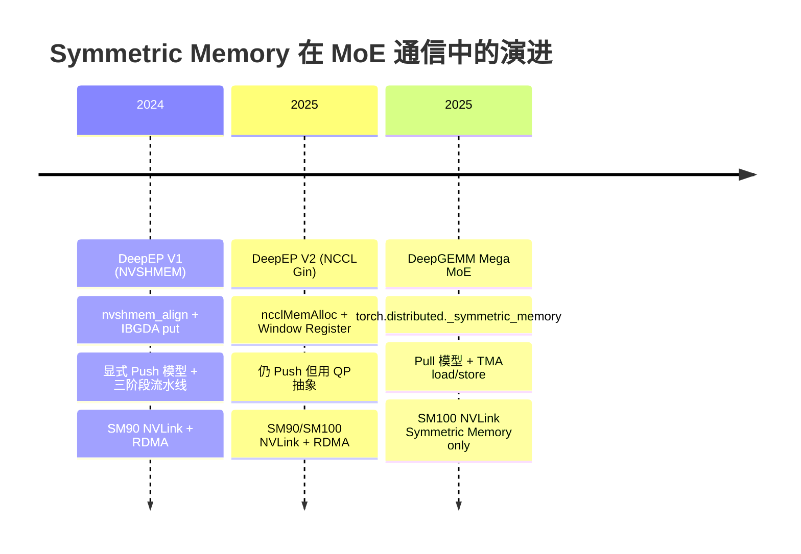
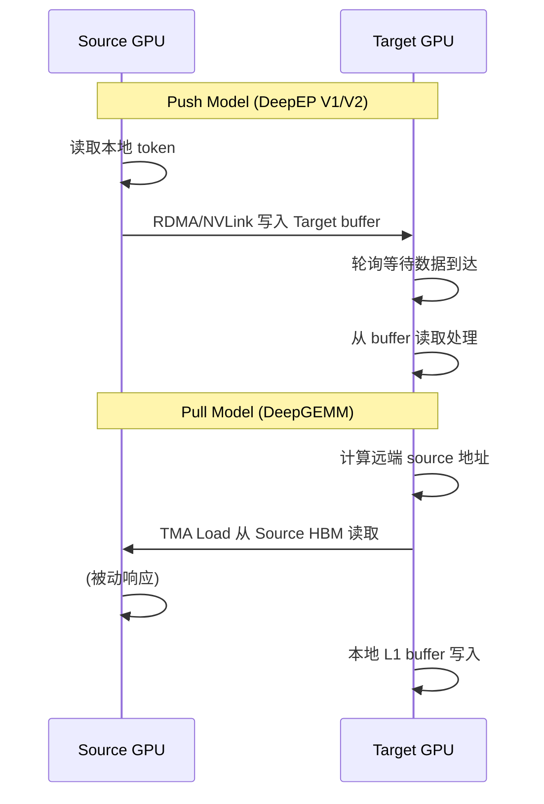
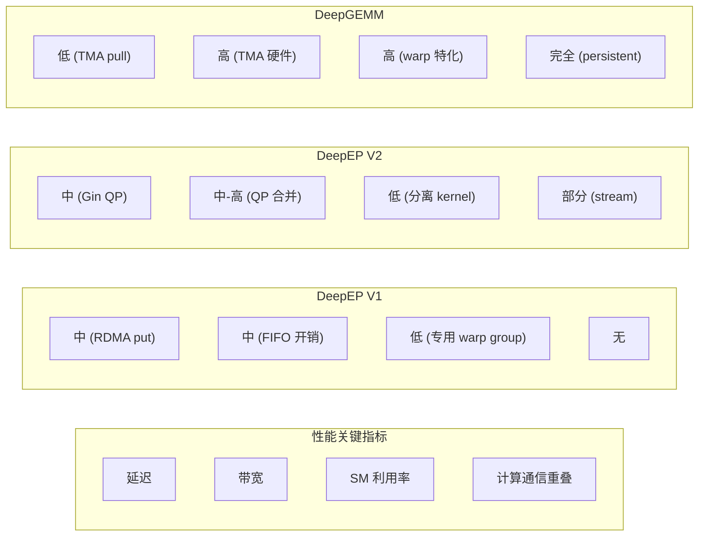

# 09: Symmetric Memory 演进深度对比 — DeepEP V1 / V2 vs DeepGEMM Mega MoE

> 分析日期: 2026-07-30
> 源材料: DeepEP (NVSHMEM + NCCL Gin) vs DeepGEMM Mega MoE (PyTorch Symmetric Memory + TMA)
> 关联文档: `05_02_buffer_symmbuffer.md`, `05_06_nvlink_rdma.md`

---

## 1. 核心问题

**Symmetric Memory（对称内存）是 MoE All-to-All 通信的范式转变**——从"显式消息传递"到"隐式 load/store 远程访问"。但三个系统对 symmetric memory 的使用方式截然不同：

| 系统 | Symmetric Memory 角色 | 通信范式 |
|------|----------------------|---------|
| DeepEP V1 (NVSHMEM) | **不直接使用** — 用 NVSHMEM API 分配对称内存 | Push + 显式 RDMA put |
| DeepEP V2 (NCCL Gin) | **底层传输层** — NCCL window register 暴露远程地址 | Push + NCCL Gin QP |
| DeepGEMM Mega MoE | **核心编程模型** — SymBuffer.map() 是唯一的远程访问原语 | Pull + TMA load/store |

**核心洞察**: DeepEP V2 的 symmetric memory 是"传输层实现细节"，对 kernel 不透明；DeepGEMM 的 symmetric memory 是"编程模型核心"，kernel 直接通过 `map()` 发起远程访问。

---

## 2. 演进时间线

### 2.1 三代系统的架构定位



### 2.2 DeepEP V1: NVSHMEM 时代

**核心机制**: NVSHMEM 提供跨 rank 的对称内存分配，通过 `nvshmemi_ibgda_put_nbi_warp` 发起 RDMA 写入。

```cpp
// csrc/kernels/backend/nvshmem.cu (line 23-25)
void* alloc(const size_t& size, const size_t& alignment) {
    return nvshmem_align(alignment, size);  // NVSHMEM 对称内存分配
}
```

**内存模型**: 两个独立 buffer — `num_nvl_bytes` (NVLink) 和 `num_rdma_bytes` (RDMA)：

```python
# deep_ep/buffers/legacy.py (line 33-36)
def __init__(self, group, num_nvl_bytes=0, num_rdma_bytes=0, ...):
    # 两个 buffer 分别用于 NVLink 和 RDMA
```

**跨 rank 访问**: 显式 RDMA put 到远端 recv buffer：

```cpp
// csrc/kernels/legacy/internode.cu (line 617-623)
nvshmemi_ibgda_put_nbi_warp<true>(
    reinterpret_cast<uint64_t>(rdma_channel_meta.recv_buffer(rdma_rank)),  // 远端目标
    reinterpret_cast<uint64_t>(rdma_channel_meta.send_buffer(dst_rdma_rank)), // 本地源
    sizeof(int) * (LEGACY_NUM_MAX_NVL_PEERS * 2 + 2),
    translate_dst_rdma_rank<kLowLatencyMode>(dst_rdma_rank, nvl_rank),
    channel_id, lane_id, 0);
```

**同步**: `nvshmem_sync_all()` + `barrier_block`：

```cpp
// csrc/kernels/legacy/internode.cu (line 93-95)
template <bool kLowLatencyMode>
__forceinline__ __device__ void nvshmem_sync_with_same_gpu_idx(const nvshmem_team_t& rdma_team) {
    kLowLatencyMode ? nvshmem_sync(rdma_team) : nvshmem_sync_all();
}
```

### 2.3 DeepEP V2: NCCL Gin + Symmetric Memory

**核心转变**: 从 NVSHMEM 迁移到 NCCL 生态，用 `ncclMemAlloc` / `cuMemCreate` 分配 symmetric memory，通过 `ncclCommWindowRegister` 暴露远程可访问窗口。

```cpp
// csrc/kernels/backend/symmetric.hpp (line 123-140)
// GPUSymmetricMemory: 纯 GPU，当前默认
class GPUSymmetricMemory final : public SymmetricMemory {
    explicit GPUSymmetricMemory(const int64_t& num_bytes) {
        NCCL_CHECK(ncclMemAlloc(&ptr, num_bytes));  // NCCL 分配器
        this->num_gpu_bytes = num_bytes;
    }
};
```

**三种分配模式**:

| 类型 | 用途 | 内存布局 |
|------|------|---------|
| `GPUSymmetricMemory` | 纯 GPU buffer | `[GPU VRAM]` |
| `ElasticSymmetricMemory` | GPU + 本地 CPU | `[GPU VRAM] [CPU RAM]` |
| `HybridElasticSymmetricMemory` | GPU + 所有 rank 的 CPU | `[GPU VRAM] [CPU rank0] [CPU rank1] ...` |

**地址映射**: `NCCLSymmetricMemoryContext::get_sym_ptr()` 是 V2 的核心映射原语：

```cpp
// csrc/kernels/backend/nccl.cu (line 150-153)
void* NCCLSymmetricMemoryContext::get_sym_ptr(void* ptr, const int& dst_rank_idx) const {
    const auto offset = static_cast<uint8_t*>(ptr) - static_cast<uint8_t*>(mapped_window_ptr);
    return static_cast<uint8_t*>(nvl_window_ptrs[dst_rank_idx]) + offset;
}
```

**关键差异**: V2 的 `get_sym_ptr` 仅映射到 **NVLink 域 (LSA) peer**，不直接映射 RDMA 远端。RDMA 传输通过 NCCL Gin QP 独立发起。

### 2.4 DeepGEMM Mega MoE: Symmetric Memory 作为编程模型

**核心机制**: PyTorch `torch.distributed._symmetric_memory` 提供跨 rank 的 buffer 注册，`SymBuffer.map()` 是唯一的远程访问原语。

```python
# deep_gemm/mega/__init__.py (line 42-49)
allocator = torch if group.size() == 1 else symm_mem
self.buffer = allocator.empty(num_bytes, dtype=torch.int8, device='cuda')
self.handle = (
    types.SimpleNamespace(buffer_ptrs=[self.buffer.data_ptr()])
    if group.size() == 1
    else symm_mem.rendezvous(self.buffer, group=group)
)
```

**地址映射**: `SymBuffer::map()` 支持任意 rank 的地址映射：

```cpp
// deep_gemm/layout/sym_buffer.cuh (line 34-40)
template <typename ptr_t>
CUTLASS_DEVICE ptr_t map(const ptr_t& ptr, const uint32_t& dst_rank_idx) const {
    if constexpr (kNumRanks == 1) return ptr;
    int64_t mapped_ptr = offsets[dst_rank_idx] + reinterpret_cast<int64_t>(ptr);
    return *reinterpret_cast<ptr_t*>(&mapped_ptr);
}
```

**关键差异**: DeepGEMM 的 `map()` 支持 **任意 rank**（包括 RDMA 远端），底层自动选择 NVLink 或 RDMA 传输。

---

## 3. API 对比

### 3.1 初始化 API

```mermaid
flowchart TB
    subgraph V1["DeepEP V1: Buffer(group, num_nvl_bytes, num_rdma_bytes)"]
        V1A["nvshmem_align() 分配 RDMA buffer"] --> V1B["CUDA IPC handle 交换 NVLink buffer"]
        V1B --> V1C["nvshmemx_init_attr() 初始化 NVSHMEM"]
    end

    subgraph V2["DeepEP V2: ElasticBuffer(group, num_bytes, num_cpu_bytes)"]
        V2A["symmetric::alloc() 分配 symmetric memory"] --> V2B["ncclCommWindowRegister() 注册窗口"]
        V2B --> V2C["ncclDevCommCreate() 创建 Gin QP"]
    end

    subgraph MM["DeepGEMM: SymmBuffer(group, ...)"]
        MMA["symm_mem.empty() 分配 buffer"] --> MMB["symm_mem.rendezvous() 注册到进程组"]
        MMB --> MMC["handle.buffer_ptrs 获取所有 rank 地址"]
    end
```



### 3.2 初始化代码对比

**DeepEP V1**:
```python
# deep_ep/buffers/legacy.py
buffer = Buffer(group, num_nvl_bytes=1024**3, num_rdma_bytes=1024**3)
# 内部: nvshmem_align() + IPC handle exchange
```

**DeepEP V2**:
```python
# deep_ep/buffers/elastic.py (line 346-354)
runtime = _C.ElasticBuffer(group.rank(), group.size(),
    nccl_comm_handle.get(), cpu_comm,
    num_bytes, num_cpu_bytes, ...)
# 内部: ncclMemAlloc/cuMemCreate + ncclCommWindowRegister
```

**DeepGEMM**:
```python
# deep_gemm/mega/__init__.py (line 42-49)
self.buffer = symm_mem.empty(num_bytes, dtype=torch.int8, device='cuda')
self.handle = symm_mem.rendezvous(self.buffer, group=group)
# handle.buffer_ptrs = [addr_rank0, addr_rank1, ...]
```

### 3.3 地址映射 API 对比

| 系统 | 映射函数 | 映射范围 | 底层实现 |
|------|---------|---------|---------|
| DeepEP V1 | `nvshmemi_ibgda_put_nbi_warp(dst_addr, ...)` | 仅 RDMA 远端 | NVSHMEM IBGDA |
| DeepEP V2 | `get_sym_ptr(ptr, dst_rank_idx)` | 仅 NVLink LSA peer | NCCL LSA pointer |
| DeepGEMM | `sym_buffer.map(ptr, dst_rank_idx)` | **任意 rank** | UVA 偏移计算 |

### 3.4 Buffer 布局对比

**DeepEP V1**: 分离的 NVLink + RDMA buffer
```
NVLink buffer (num_nvl_bytes): [send_buf | recv_buf] per channel per rank
RDMA buffer (num_rdma_bytes):  [send_buf | recv_buf] per channel per rank
```

**DeepEP V2**: 统一的 symmetric memory 窗口
```
Symmetric Memory: [[Workspace] GPU buffer [CPU buffer]]
                  ↑ mapped_window_ptr
```

**DeepGEMM**: 单一逻辑 buffer，多段划分
```
SymmBuffer: [Workspace | Input Token | L1 Pool | L2 Pool | Combine]
            ↑ 所有 rank 相同布局，map() 通过偏移访问
```

---

## 4. 内存访问模式对比: Push vs Pull

### 4.1 DeepEP V1: Push 模型 (Source → Destination)

```cpp
// csrc/kernels/legacy/internode.cu (line 688-693)
// RDMA Sender Warp: 将本地 token 写入远端 RDMA buffer
auto st_broadcast = [=](const int key, const int4& value) {
    for (int j = 0; j < num_topk_ranks; ++j)
        st_na_global(reinterpret_cast<int4*>(dst_send_buffers[j]) + key, value);
    // ↑ 写入远端 send_buffer (通过 NVLink/RDMA)
};
UNROLLED_WARP_COPY(5, lane_id, hidden_int4, 0, x + token_idx * hidden_int4, ld_nc_global, st_broadcast);
```

**Push 模型特征**:
- Source warp 读取本地 token
- Source warp 通过 `nvshmemi_ibgda_put_nbi_warp` 写入远端 `recv_buffer`
- Destination 被动等待 `recv_buffer` 数据到达
- 需要 FIFO head/tail 流控

### 4.2 DeepEP V2: 仍 Push 但 QP 抽象化

```cpp
// csrc/elastic/buffer.hpp (line 469-489)
// all_gather: 通过 cudaMemcpyBatchAsync 推送到远端
for (int i = 0; i < nccl_context->num_ranks; ++i) {
    for (int j = 0; j < num_tensors; ++j) {
        void* dst_ptr = nccl_context->get_sym_ptr(
            math::advance_ptr(buffer, offset[j] + x.nbytes() * nccl_context->rank_idx),
            dst_rank_idx);  // 远端目标地址
        dst_ptrs[count] = dst_ptr;
        src_ptrs[count] = x.data_ptr();  // 本地源
    }
}
cudaMemcpyBatchAsync(dst_ptrs.data(), src_ptrs.data(), sizes.data(), num_copies, attrs, comm_stream);
```

**V2 Push 特征**:
- 使用 `get_sym_ptr` 计算远端地址
- 通过 `cudaMemcpyBatchAsync` 或 NCCL Gin QP 推送
- 仍需要 barrier 同步

### 4.3 DeepGEMM: Pull 模型 (Destination → Source)

```cpp
// sm100_fp8_fp4_mega_moe.cuh (line 533-555)
// Dispatch Warp: 从远端 rank 拉取 token 到本地 smem
const auto src_base_ptr = sym_buffer.map(
    buffer.input_token_buffer.get_data_buffer(src_token_idx).get_base_ptr(),
    current_rank_in_expert_idx);  // ← 远端源地址
const auto dst_base_ptr = buffer.l1_token_buffer.get_data_buffer(pool_token_idx % kNumRingTokens).get_base_ptr();

// TMA load: 远端 → 本地 smem → 本地 L1 buffer
for (uint32_t i = 0; i < kNumChunks; ++i) {
    ptx::tma_load_1d(
        pull_buffer.get_base_ptr(),                    // 本地 smem 目标
        math::advance_ptr(src_base_ptr, i * kNumBytesPerPull),  // 远程源
        pull_mbarrier, kNumBytesPerPull);
    ptx::mbarrier_arrive_and_set_tx(pull_mbarrier, kNumBytesPerPull);
    issue_and_wait_pull_store(i);  // smem → L1 buffer (TMA store)
}
```

**Pull 模型特征**:
- Destination warp 计算远端 source 地址 (`sym_buffer.map`)
- TMA load 直接从远端 HBM 拉到本地 smem
- 再 TMA store 到本地 L1 buffer
- 接收方控制速率，天然负载均衡

### 4.4 Combine 写回对比

**DeepEP V1/V2 Combine**: Source 推送结果到远端
```cpp
// V1: Forwarder warp 将 NVLink recv_buffer 数据写入远端 combine buffer
// V2: 类似，通过 get_sym_ptr 定位远端 combine buffer
```

**DeepGEMM Combine**: Epilogue warp 拉取式写回
```cpp
// sm100_fp8_fp4_mega_moe.cuh (line 1293-1299)
// 从本地 smem 读取，写入远端 combine buffer
const auto packed = ptx::ld_shared(reinterpret_cast<float4*>(smem_ptr));
const auto dst_token = buffer.combine_token_buffer.get_rank_buffer(dst_topk_idx)
                       .get_data_buffer(dst_token_idx);
const auto dst_ptr = math::advance_ptr<float4>(dst_token.get_base_ptr(), ...);
*sym_buffer.map(dst_ptr, dst_rank_idx) = packed;  // ← NVLink store 写回
```

### 4.5 Push vs Pull 范式总结



| 维度 | Push (DeepEP) | Pull (DeepGEMM) |
|------|--------------|-----------------|
| 通信发起方 | Source (生产方) | Target (消费方) |
| 速率控制 | Source 需 FIFO 流控 | Target 天然控制 |
| 负载均衡 | 需显式协调 | 处理快的 rank 多 pull |
| 同步复杂度 | 高 (head/tail + barrier) | 低 (arrival count) |
| 缓冲需求 | 中间 send/recv buffer | 无中间 buffer |

---

## 5. 硬件要求对比

### 5.1 硬件依赖表

| 硬件特性 | DeepEP V1 | DeepEP V2 | DeepGEMM Mega MoE |
|---------|-----------|-----------|-------------------|
| **GPU 架构** | SM90 (H100) | SM90 / SM100 | **SM100 (B200) only** |
| **NVLink** | ✅ 必需 | ✅ 必需 | ✅ 必需 (通过 SymMem) |
| **RDMA (IB)** | ✅ 跨节点必需 | ✅ 跨节点必需 | ❌ 不需要 (NVLink SymMem 自动) |
| **NVSHMEM** | ✅ 必需 | ❌ 不需要 | ❌ 不需要 |
| **NCCL Gin** | ❌ | ✅ 必需 | ❌ (PyTorch SymMem 内部使用) |
| **TMA** | ❌ | ❌ | ✅ 必需 (远程 load/store) |
| **Symmetric Memory** | ❌ (NVSHMEM 模拟) | ✅ (NCCL 抽象) | ✅ (PyTorch 抽象) |
| **TMEM** | ❌ | ❌ | ✅ 必需 (计算流水线) |

### 5.2 为什么 DeepGEMM 只需要 NVLink Symmetric Memory?

**核心原因**: SM100 的 symmetric memory 抽象**自动处理底层传输**：

```python
# deep_gemm/mega/__init__.py
import torch.distributed._symmetric_memory as symm_mem
# PyTorch SymMem 内部: 同节点 NVLink, 跨节点 RDMA (NCCL 自动选择)
```

DeepGEMM 不区分 intra/inter-node：
- **同节点**: `sym_buffer.map()` → NVLink P2P 访问
- **跨节点**: `sym_buffer.map()` → RDMA (NCCL 后端自动)

但 DeepGEMM 当前**仅支持 SM100**，因为 TMA 的远程访问需要 SM100 的 hardware support。

### 5.3 DeepEP V2 为什么仍需要 RDMA?

**核心原因**: V2 的 `get_sym_ptr()` 仅映射到 **NVLink LSA peer**，不覆盖 RDMA 远端：

```cpp
// csrc/kernels/backend/nccl.cu (line 143-147)
// 仅获取 NVLink domain 内 peer 的指针
nvl_window_ptrs.resize(num_nvl_ranks);
for (int i = 0; i < num_nvl_ranks; ++i)
    NCCL_CHECK(ncclGetLsaDevicePointer(window, 0, i, &nvl_window_ptrs[i]));
```

跨节点通信必须通过 NCCL Gin QP 发起 RDMA 操作，因此 V2 仍依赖 RDMA 硬件。

---

## 6. 同步机制对比

### 6.1 同步原语总览

| 系统 | 节点内同步 | 跨节点同步 | 数据传输同步 |
|------|-----------|-----------|-------------|
| **DeepEP V1** | `barrier_block<>` | `nvshmem_sync_all()` | FIFO head/tail |
| **DeepEP V2** | `launch_barrier()` | NCCL barrier (Gin) | `cudaMemcpyBatchAsync` + event |
| **DeepGEMM** | `grid_sync` + `mbarrier` | `nvlink_barrier` | `mbarrier` (TMA) |

### 6.2 DeepEP V1: NVSHMEM 同步

```cpp
// csrc/kernels/legacy/internode.cu (line 147-149)
// 两阶段同步: NVLink intra-node + RDMA inter-node
if (thread_id == 32)
    nvshmem_sync_with_same_gpu_idx<kLowLatencyMode>(rdma_team);
barrier_block<LEGACY_NUM_MAX_NVL_PEERS>(barrier_signal_ptrs, nvl_rank);
```

**V1 同步层次**:
1. `nvshmem_sync_all()` — 跨 RDMA rank 全局同步
2. `barrier_block<NVL_PEERS>` — NVLink domain 内同步
3. FIFO head/tail — 流控 (per-channel)

### 6.3 DeepEP V2: NCCL Barrier

```cpp
// csrc/elastic/buffer.hpp (line 191-199)
void barrier(const bool& use_comm_stream, const bool& with_cpu_sync, const bool& sequential) {
    // GPU barrier via NCCL
    launch_barrier(nccl_context->dev_comm, nccl_context->window,
                   workspace,
                   nccl_context->scaleout_rank_idx, nccl_context->scaleup_rank_idx,
                   nccl_context->num_scaleout_ranks, nccl_context->num_scaleup_ranks,
                   num_gpu_timeout_cycles, ...);
}
```

**V2 同步层次**:
1. `launch_barrier()` — NCCL 内置 barrier (scaleout + scaleup)
2. `cudaMemcpyBatchAsync` + event — 异步数据传输
3. `stream_wait()` — stream 间依赖

### 6.4 DeepGEMM: 三层同步

```cpp
// deep_gemm/comm/barrier.cuh (line 46-89)
// NVLink barrier: 跨 rank 全局同步
void nvlink_barrier(...) {
    grid_sync<kNumSMs, kGridSyncIndex>(...);  // 1. 节点内 SM 同步
    if (sm_idx == 0) {
        // SM 0 发送信号到远端 rank
        ptx::red_add_rel_sys(sym_buffer.map(signal_ptr, thread_idx), signal_sign ? -1 : 1);
        // 等待所有 rank 到达
        while (ptx::ld_acq_sys(signal_ptr) != target) { /* spin */ }
    }
    grid_sync<kNumSMs, kGridSyncIndex>(...);  // 3. 再次节点内同步
}
```

**DeepGEMM 同步层次**:

| 层级 | 原语 | 作用 |
|------|------|------|
| 节点内 | `grid_sync<kNumSMs>` | 所有 SM 同步 (atomic counter) |
| 跨节点 | `nvlink_barrier` | SM 0 发送 signal + 等待远端 |
| 数据传输 | `mbarrier` | TMA load/store 完成通知 |
| 流水线 | `full_barriers` / `empty_barriers` | 生产者-消费者 (ring buffer) |

**NVLink Barrier Tag 语义**:
```cpp
// sm100_fp8_fp4_mega_moe.cuh (line 309-311)
constexpr uint32_t kBeforeDispatchPullBarrierTag = 1;      // Dispatch 拉取前
constexpr uint32_t kBeforeCombineReduceBarrierTag = 2;     // Combine 归约前
constexpr uint32_t kAfterWorkspaceCleanBarrierTag = 3;     // Workspace 清理后
```

### 6.5 同步开销对比

| 维度 | DeepEP V1 | DeepEP V2 | DeepGEMM |
|------|-----------|-----------|----------|
| 全局同步次数/迭代 | 2-3 (notify + data) | 1-2 (barrier) | 2-3 (grid_sync + nvlink_barrier) |
| 同步粒度 | 全局 | 全局 | 节点内 + 跨节点分离 |
| 同步参与者 | 所有 SM | 所有 SM | 节点内全部 SM, 跨节点仅 SM 0 |
| 超时机制 | `clock64()` 轮询 | `num_gpu_timeout_cycles` | `kNumTimeoutCycles` (60s) |

---

## 7. 性能影响分析

### 7.1 延迟差异

| 操作 | DeepEP V1 | DeepEP V2 | DeepGEMM |
|------|-----------|-----------|----------|
| 跨节点单程 | ~5-10 μs (RDMA put) | ~5-10 μs (Gin QP) | ~3-5 μs (TMA load) |
| 节点内单程 | ~1-2 μs (NVLink store) | ~1-2 μs (get_sym_ptr + store) | ~0.5-1 μs (TMA load) |
| 全局同步 | ~5-10 μs (nvshmem_sync) | ~3-5 μs (NCCL barrier) | ~2-3 μs (grid_sync + nvlink_barrier) |

**DeepGEMM 延迟优势来源**:
1. **Pull 模型**: 消费方按需拉取，无需等待生产方推送
2. **TMA 硬件加速**: 专用数据传输引擎，不占用 SM
3. **SM 0 专责 barrier**: 其他 SM 可继续计算

### 7.2 带宽利用率

| 维度 | DeepEP V1 | DeepEP V2 | DeepGEMM |
|------|-----------|-----------|----------|
| NVLink 带宽 | ~900 GB/s (理论) | ~900 GB/s | ~900 GB/s (通过 SymMem) |
| RDMA 带宽 | ~400 Gb/s (IB) | ~400 Gb/s (Gin) | 自动 (NCCL 后端) |
| 有效利用率 | 70-80% (FIFO 开销) | 75-85% (QP 抽象) | 80-90% (TMA + 流水线) |
| 小数据包效率 | 低 (需 chunk 聚合) | 中 (QP 合并) | 高 (TMA 硬件优化) |

### 7.3 SM 占用

| 系统 | 通信占用 SM | 计算占用 SM | 重叠方式 |
|------|-----------|-----------|---------|
| DeepEP V1 | 专用 warp group (IB Sending / Forwarding / NVLink Receiving) | 不重叠 (分离 kernel) | 无 |
| DeepEP V2 | 专用 notify warp + QP 引擎 | 不重叠 (分离 kernel) | 部分 (stream overlap) |
| DeepGEMM | **Dispatch Warps** (warp 特化) | **MMA Warps + Epilogue Warps** | **完全重叠** (persistent kernel) |

**DeepGEMM 的 warp 特化**:
```cpp
// sm100_fp8_fp4_mega_moe.cuh (line 329-416)
if (warp_idx < kNumDispatchWarps) {
    // Dispatch Warps: 远程拉取 token
    cutlass::arch::warpgroup_reg_dealloc<kNumDispatchRegisters>();  // 48 regs
} else if (warp_idx < kNumDispatchWarps + kNumMMANonEpilogueWarps) {
    // MMA Warps: GEMM 计算
    cutlass::arch::warpgroup_reg_dealloc<kNumNonEpilogueRegisters>();  // 40 regs
} else {
    // Epilogue Warps: SwiGLU + Combine 写回
    // 208 regs (高寄存器用于 TMEM load/STSM)
}
```

### 7.4 性能对比总结



---

## 8. 关键代码位置索引

### 8.1 DeepEP V1 (NVSHMEM)

| 文件 | 关键内容 |
|------|---------|
| `csrc/kernels/backend/nvshmem.cu` | `nvshmem_align()`, `nvshmem_barrier_all()` |
| `csrc/kernels/legacy/internode.cu` | `notify_dispatch`, `dispatch` kernel, `nvshmemi_ibgda_put_nbi_warp` |
| `csrc/kernels/legacy/buffer.cuh` | `SymBuffer`, `AsymBuffer` 布局 |
| `deep_ep/buffers/legacy.py` | `Buffer` 类, NVSHMEM 初始化 |

### 8.2 DeepEP V2 (NCCL Gin)

| 文件 | 关键内容 |
|------|---------|
| `csrc/kernels/backend/symmetric.hpp` | `GPUSymmetricMemory`, `ElasticSymmetricMemory`, `HybridElasticSymmetricMemory` |
| `csrc/kernels/backend/nccl.cu` | `NCCLSymmetricMemoryContext`, `get_sym_ptr()`, `ncclCommWindowRegister` |
| `csrc/elastic/buffer.hpp` | `ElasticBuffer`, `barrier()`, `all_gather()`, `engram_fetch()` |
| `csrc/kernels/elastic/dispatch.hpp` | `DispatchRuntime`, JIT kernel 生成 |
| `deep_ep/buffers/elastic.py` | `ElasticBuffer` Python API, `EPHandle` |

### 8.3 DeepGEMM Mega MoE

| 文件 | 关键内容 |
|------|---------|
| `deep_gemm/include/deep_gemm/layout/sym_buffer.cuh` | `SymBuffer::map()` — 核心地址映射 |
| `deep_gemm/include/deep_gemm/layout/mega_moe.cuh` | `Workspace`, `MegaMoEBuffer`, `TokenSrcMetadata` |
| `deep_gemm/include/deep_gemm/comm/barrier.cuh` | `grid_sync`, `nvlink_barrier` |
| `deep_gemm/include/deep_gemm/impls/sm100_fp8_fp4_mega_moe.cuh` | 完整 kernel (dispatch + GEMM + combine) |
| `deep_gemm/mega/__init__.py` | `SymmBuffer`, `get_symm_buffer_for_mega_moe` |
| `tests/test_mega_moe.py` | 多进程测试, 性能 benchmark |

---

## 9. 核心洞察总结

### 9.1 Symmetric Memory 的三种使用范式

| 范式 | 代表系统 | Symmetric Memory 角色 | 对 Kernel 可见性 |
|------|---------|----------------------|-----------------|
| **分配器** | DeepEP V1 (NVSHMEM) | 仅用于分配跨 rank 可访问内存 | ❌ 不可见 (kernel 用 put/get) |
| **传输层** | DeepEP V2 (NCCL Gin) | 注册远程可访问窗口 | ⚠️ 部分可见 (get_sym_ptr) |
| **编程模型** | DeepGEMM | 核心远程访问抽象 | ✅ 完全可见 (map + TMA) |

### 9.2 范式演进的本质

```
DeepEP V1: "在哪里分配?" — NVSHMEM 提供跨 rank 内存分配
    ↓
DeepEP V2: "怎么暴露?" — NCCL Window Register 暴露远程指针
    ↓
DeepGEMM: "怎么用?" — SymBuffer.map() + TMA 直接远程 load/store
```

**每一步都在提升抽象层级**:
1. V1: 关注**物理分配** (nvshmem_align)
2. V2: 关注**地址暴露** (ncclCommWindowRegister + get_sym_ptr)
3. DeepGEMM: 关注**访问语义** (map + TMA load/store)

### 9.3 Pull vs Push 的设计权衡

| 维度 | Push (DeepEP) | Pull (DeepGEMM) |
|------|--------------|-----------------|
| 适用场景 | 通用通信 (多种 pattern) | MoE All-to-All (固定 pattern) |
| 控制灵活性 | 高 (Source 决定发送时机) | 中 (Target 决定拉取时机) |
| 实现复杂度 | 高 (FIFO + 三阶段) | 低 (map + TMA) |
| 性能上限 | 高 (可极致优化) | 高 (TMA 硬件加速) |
| 通用性 | 高 (EP/PP/AGRS/Engram) | 低 (仅 MoE) |

### 9.4 一句话总结

> **DeepEP V1 用 NVSHMEM 解决"分配"，V2 用 NCCL Gin 解决"暴露"，DeepGEMM 用 SymBuffer + TMA 解决"使用"。Symmetric Memory 从"底层分配器"演进为"核心编程模型"，使得 MoE 通信从"显式消息传递"坍缩为"隐式 load/store"。**

---

## 附录 A: 三种 Symmetric Memory 分配器的完整对比

| 维度 | NVSHMEM (V1) | NCCL Gin (V2) | PyTorch SymMem (DeepGEMM) |
|------|-------------|---------------|--------------------------|
| 分配 API | `nvshmem_align()` | `ncclMemAlloc()` / `cuMemCreate()` | `symm_mem.empty()` |
| 注册 API | 自动 (NVSHMEM 初始化) | `ncclCommWindowRegister()` | `symm_mem.rendezvous()` |
| 地址映射 | 隐式 (put/get 指定 rank) | `get_sym_ptr(ptr, dst_rank)` | `sym_buffer.map(ptr, dst_rank)` |
| 映射范围 | 所有 rank | 仅 NVLink LSA peer | 所有 rank |
| CPU 支持 | ❌ | ✅ (Elastic/Hybrid) | ❌ |
| 释放 API | `nvshmem_free()` | `ncclMemFree()` / `cuMemRelease()` | 自动 (Python GC) |
| 对齐要求 | 2 MB | 2 MB (`kNumAlignmentBytes`) | 无 (PyTorch 处理) |
| 超时机制 | `clock64()` 轮询 | `num_gpu_timeout_cycles` | `kNumTimeoutCycles` |

## 附录 B: 关键源码片段

### B.1 DeepEP V2 的 Hybrid Symmetric Memory 布局

```cpp
// csrc/kernels/backend/symmetric.hpp (line 188-290)
// HybridElasticSymmetricMemory: GPU + 所有 rank 的 CPU segment
// Layout: [GPU VRAM (front)] [CPU rank0 | CPU rank1 | ... | CPU rank(N-1) (back)]
class HybridElasticSymmetricMemory final : public SymmetricMemory {
    // 每个 rank 创建 NUMA-local CPU segment
    // 通过 POSIX FD (pidfd_open + pidfd_getfd) 跨进程导入
    for (int i = 0; i < num_scaleup_ranks; ++ i) {
        auto [pid, fd] = cpu_comm[num_scaleup_ranks * scaleout_rank_idx + i];
        if (pid != local_pid) {
            int pidfd = syscall(SYS_pidfd_open, pid, 0);
            local_fd = syscall(SYS_pidfd_getfd, pidfd, fd, 0);
        }
        CUDA_DRIVER_CHECK(lazy_cuMemImportFromShareableHandle(&cpu_handles[i], ...));
        CUDA_DRIVER_CHECK(lazy_cuMemMap(addr + offset, num_cpu_bytes, 0, cpu_handles[i], 0));
    }
};
```

### B.2 DeepGEMM 的 Combine 写回 (Pull 范式)

```cpp
// sm100_fp8_fp4_mega_moe.cuh (line 1274-1299)
// Epilogue warp 将 L2 输出写回远程 combine buffer
uint32_t dst_rank_idx, dst_token_idx, dst_topk_idx;
if (task_info.is_shared()) {
    dst_rank_idx = sym_buffer.rank_idx;
    dst_token_idx = pool_m_idx + m_idx_in_block;
    dst_topk_idx = kNumTopk;
} else {
    const auto src_metadata = *workspace.get_token_src_metadata_ptr(pool_m_idx + m_idx_in_block);
    dst_rank_idx = src_metadata.rank_idx;
    dst_token_idx = src_metadata.token_idx;
    dst_topk_idx = src_metadata.topk_idx;
}
// 从本地 smem 读取，通过 sym_buffer.map 写入远端
const auto packed = ptx::ld_shared(reinterpret_cast<float4*>(smem_ptr));
const auto dst_token = buffer.combine_token_buffer.get_rank_buffer(dst_topk_idx)
                       .get_data_buffer(dst_token_idx);
const auto dst_ptr = math::advance_ptr<float4>(dst_token.get_base_ptr(), ...);
*sym_buffer.map(dst_ptr, dst_rank_idx) = packed;  // NVLink/RDMA store
```

### B.3 DeepGEMM 的 NVLink Barrier 实现

```cpp
// deep_gemm/comm/barrier.cuh (line 46-89)
// 三层同步: grid_sync → NVLink signal → grid_sync
template <uint32_t kNumRanks, uint32_t kNumSMs, ...>
void nvlink_barrier(...) {
    if (sync_prologue)
        grid_sync<kNumSMs, kGridSyncIndex>(...);  // 节点内同步

    if (sm_idx == 0) {  // 仅 SM 0 参与跨节点
        auto* signal_ptr = workspace.get_nvl_barrier_signal_ptr(signal_phase);
        if (thread_idx < kNumRanks)
            ptx::red_add_rel_sys(sym_buffer.map(signal_ptr, thread_idx), signal_sign ? -1 : 1);
        if (thread_idx == 0) {
            ptx::red_add(counter_ptr, 1);
            while (ptx::ld_acq_sys(signal_ptr) != target) { /* spin */ }
        }
    }

    if (sync_epilogue)
        grid_sync<kNumSMs, kGridSyncIndex>(...);  // 再次节点内同步
}
```

---

*分析基于 DeepEP 源码 (commit: 当前 main 分支) 与 DeepGEMM 源码 (commit: 当前 main 分支)*
