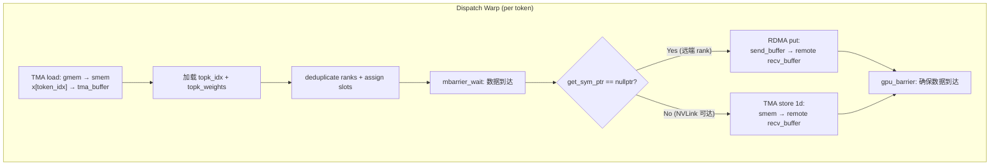
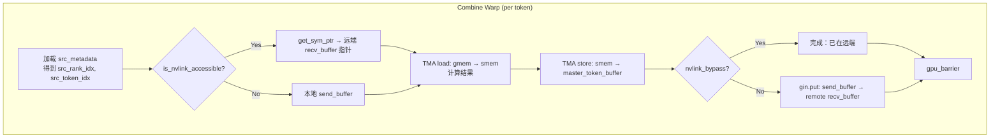
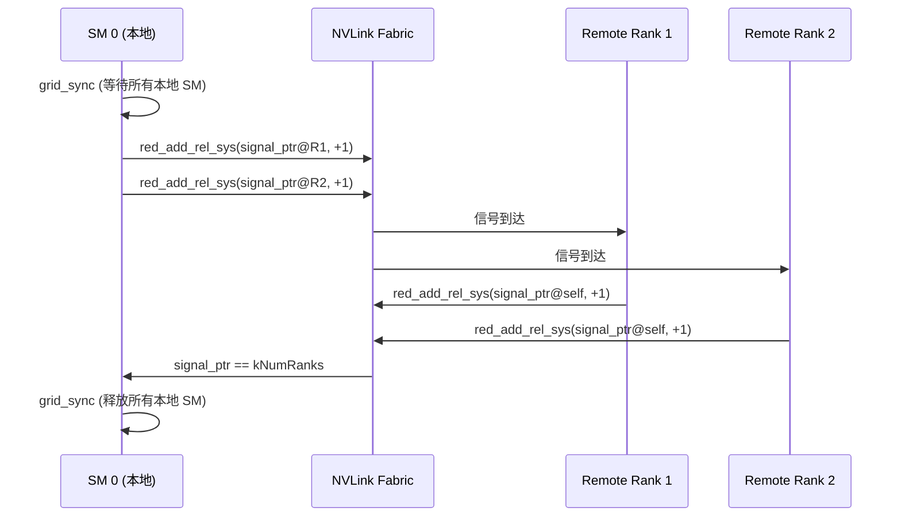
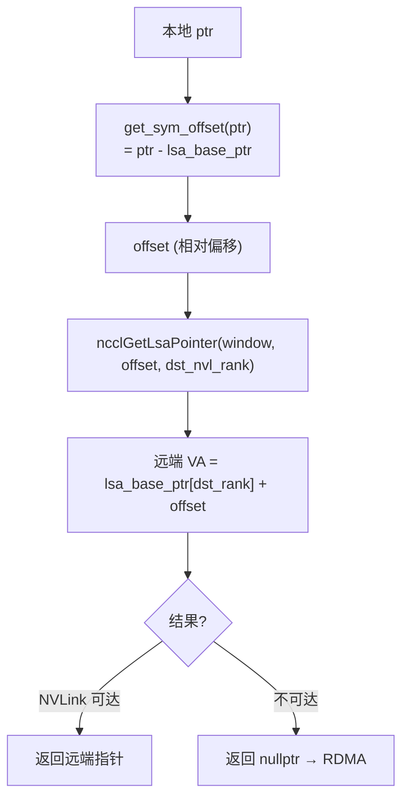
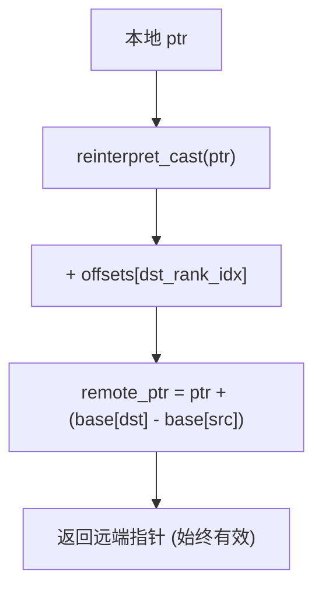
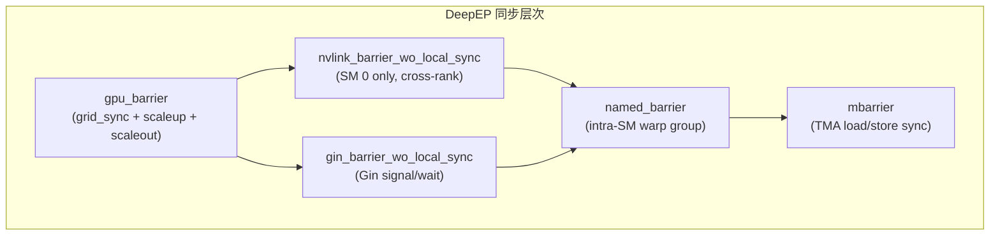
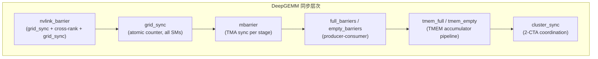

# 对称内存访问模式内核级深度分析

> **分析范围**: DeepEP (NCCL Gin + IBGDA + TMA) vs DeepGEMM (纯 TMA + NVLink) 的 symmetric memory 访问模式
>
> **代码版本**: DeepEP main 分支, DeepGEMM main 分支
>
> **分析日期**: 2026-07-30

---

## 目录

1. [核心概念与术语](#1-核心概念与术语)
2. [DeepEP 内核对称内存访问模式](#2-deepep-内核对称内存访问模式)
3. [DeepGEMM 内核对称内存访问模式](#3-deepgemm-内核对称内存访问模式)
4. [TMA vs IBGDA 对比分析](#4-tma-vs-ibgda-对比分析)
5. [指针映射机制深度对比](#5-指针映射机制深度对比)
6. [同步原语对比分析](#6-同步原语对比分析)
7. [总结对比表](#7-总结对比表)

---

## 1. 核心概念与术语

| 术语 | 全称 | 含义 |
|------|------|------|
| **Symmetric Memory** | 对称内存 | 多 rank 间通过 CUDA VMM 映射到同一 VA 范围的内存，任何 rank 可直接访问 |
| **NVLink** | NVIDIA Link | GPU 间高带宽直连，latency ~1-2 us |
| **RDMA** | Remote Direct Memory Access | 通过 NIC (IB/Gin) 远程访问，latency ~5-10 us |
| **IBGDA** | InfiniBand GPU Direct Async | GPU 直接发起 IB RDMA 操作，无需 CPU 介入 |
| **Gin** | NCCL Generic Interface | NCCL 的 GPU 端通信接口抽象层 |
| **TMA** | Tensor Memory Accelerator | Hopper+ 硬件单元，异步 bulk copy |
| **mbarrier** | Memory Barrier | Hopper+ 硬件同步原语，与 TMA 配合 |
| **LSA** | Local Scale-up All | NCCL team 类型，表示 NVLink 域内 |
| **get_sym_ptr** | Get Symmetric Pointer | DeepEP 中将本地指针翻译为远端对称指针 |
| **sym_buffer.map** | Symmetric Buffer Map | DeepGEMM 中将本地指针翻译为远端对称指针 |

---

## 2. DeepEP 内核对称内存访问模式

### 2.1 `get_sym_ptr()` — 对称指针翻译的核心

DeepEP 的对称指针翻译封装在 `handle::NCCLGin` 类中，定义于 `deep_ep/include/deep_ep/common/handle.cuh`。

```cpp
// handle.cuh:63-92
template <typename team_t, typename dtype_t = void*>
__device__ __forceinline__
dtype_t* get_sym_ptr(dtype_t* ptr, const int& dst_rank_idx) const {
    IS_TEAM_RAIL({
        return team_rail.rank == dst_rank_idx ? ptr : nullptr;
    })

    IS_TEAM_WORLD_LSA({
        constexpr bool kIsTeamLSA = (std::is_same_v<team_t, ncclTeamTagLsa>);

        // Team world and not accessible by symmetric pointers
        if (not is_nvlink_accessible<team_t>(dst_rank_idx))
            return nullptr;  // ← 无法 NVLink 访问，返回 nullptr → 走 RDMA

        // Translate into NVLink rank index
        const auto dst_nvl_rank_idx = kIsTeamLSA ?
            dst_rank_idx : (dst_rank_idx - team_rail.rank * team_lsa.nRanks);

        // Local rank bypass
        if (dst_nvl_rank_idx == team_lsa.rank)
            return ptr;  // ← 本地 rank，直接返回原指针

        // Get base ptr
        const auto dst_ptr = ncclGetLsaPointer(
            nccl_window, get_sym_offset(ptr), dst_nvl_rank_idx);
        return static_cast<dtype_t*>(dst_ptr);
    });
}
```

**关键机制**：

1. **`get_sym_offset(ptr)`**（line 58-61）：计算指针相对于 `lsa_base_ptr` 的偏移：
   ```cpp
   uint64_t get_sym_offset(dtype_t* ptr) const {
       return reinterpret_cast<uint64_t>(ptr) - lsa_base_ptr;
   }
   ```

2. **`ncclGetLsaPointer`**：NCCL 提供的 API，将 `(window, offset, dst_nvl_rank)` 翻译为远端 NVLink 可访问的指针。

3. **返回值语义**：
   - `nullptr` → 该 rank 无法通过 NVLink symmetric pointer 访问，必须走 RDMA
   - 非空 → 可直接通过 TMA/NVLink 写入远端

### 2.2 `is_nvlink_accessible()` — 路径选择的关键

```cpp
// handle.cuh:37-54
template <typename team_t>
__device__ __forceinline__ bool is_nvlink_accessible(const int& dst_rank_idx) const {
    IS_TEAM_LSA({
        return true;  // LSA team 内全部 NVLink 可达
    })

    IS_TEAM_WORLD({
        // 检查 dst_rank_idx 是否在当前 rail group 内
        return team_rail.rank * team_lsa.nRanks <= dst_rank_idx and
               dst_rank_idx < (team_rail.rank + 1) * team_lsa.nRanks;
    })

    IS_TEAM_RAIL({
        return team_rail.rank == dst_rank_idx;  // 仅同 rail
    })
}
```

**三种 team 模式总结**：

| team_t | NVLink 范围 | 使用场景 |
|--------|------------|---------|
| `ncclTeamTagLsa` | 整个 LSA 域（同节点） | Scale-up 模式 |
| `ncclTeamTagWorld` | 当前 rail group 内 | 跨节点 World 模式 |
| `ncclTeamTagRail` | 仅同 rail | Scale-out 模式 |

### 2.3 `dispatch.cuh` — Dispatch Warps 的远端写入

Dispatch kernel (`dispatch_impl`) 的核心数据流：本地 TMA load → smem → **TMA store 到远端 NVLink** 或 **RDMA put 到远端**。

```cpp
// dispatch.cuh:370-393 — 核心对称内存写入逻辑
// Issue TMA NVLink stores
const auto dst_ptr = stored_dst_slot_idx >= 0 ?
    gin.get_sym_ptr<team_t>(
        recv_buffer.get_token_buffer(stored_dst_slot_idx).get_base_ptr(),
        stored_dst_rank_idx) :
    nullptr;

// 路径 A: NVLink symmetric pointer → TMA store 直写远端
if (dst_ptr != nullptr)
    ptx::tma_store_1d(dst_ptr, tma_buffer.get_base_ptr(), tma_buffer.get_num_bytes<false>());
ptx::tma_store_commit();
__syncwarp();

// Issue RDMA put
if constexpr (not kIsScaleupNVLink) {
    // Wait the send buffer store to arrive
    ptx::tma_store_wait<1>();
    __syncwarp();

    // 路径 B: 无法 NVLink 访问 → RDMA put
    if (stored_dst_slot_idx >= 0 and dst_ptr == nullptr) {
        gin.put<team_t>(recv_buffer.get_token_buffer(stored_dst_slot_idx).get_base_ptr(),
                        send_buffer_ptr, tma_buffer.get_num_bytes<false>(), stored_dst_rank_idx);
    }
    __syncwarp();
}
```

**Dispatch 数据流图**：



**关键细节**：

1. **send_buffer 的中间角色**：RDMA 路径需要先 TMA store 到本地 `send_buffer`，再通过 `gin.put` 发起 RDMA。NVLink 路径直接 TMA store 到远端 `recv_buffer`，**消除了中间拷贝**。

2. **`tma_store_wait<1>`**（line 384）：等待 send_buffer 的 TMA store 完成，确保 RDMA 读取的数据是完整的。

3. **`ncclGinOptFlagsAggregateRequests`**：在 `gin.put_value` 中使用，聚合多个小请求为一个大 RDMA 操作。

### 2.4 `combine.cuh` — Combine Warps 的远端回写

Combine kernel 的数据流方向与 Dispatch 相反：本地计算结果 → **TMA store 到远端** 或 **RDMA put 到远端**。

```cpp
// combine.cuh:94-106 — 路径选择
const bool nvlink_bypass = gin.is_nvlink_accessible<team_t>(src_rank_idx);
layout::TokenLayout master_token_buffer = [=]() {
    // NVLink bypass: 直接写到远端对称指针
    if (nvlink_bypass) {
        auto token_buffer = recv_buffer.get_rank_buffer(...).get_token_buffer(src_token_idx);
        token_buffer.set_base_ptr(
            gin.get_sym_ptr<team_t>(token_buffer.get_base_ptr(), src_rank_idx));
        return token_buffer;
    }
    // Use RDMA: 写到本地 send buffer
    return send_buffer.get_rank_buffer(src_rank_idx).get_token_buffer(src_token_idx);
}();
```

```cpp
// combine.cuh:133-143 — 无 reduce 场景的写入
if (no_local_reduce) {
    if (ptx::elect_one_sync()) {
        const auto load_ptr = math::advance_ptr(x, ...);
        ptx::tma_store_wait();
        ptx::tma_load_1d(tma_buffer.get_base_ptr(), load_ptr, mbarrier_ptr, kNumHiddenBytes);
        ptx::mbarrier_arrive_and_set_tx(mbarrier_ptr, kNumHiddenBytes);
        ptx::mbarrier_wait_and_flip_phase(mbarrier_ptr, phase);
        // 写入远端（NVLink 或 send_buffer）
        ptx::tma_store_1d(master_token_buffer.get_base_ptr(), tma_buffer.get_base_ptr(), kNumHiddenBytes);
        ptx::tma_store_commit();
    }
    __syncwarp();
}
```

```cpp
// combine.cuh:228-236 — RDMA 路径的延迟发送
if (not kDoExpandedSend and not nvlink_bypass and ptx::elect_one_sync()) {
    ptx::tma_store_wait();
    const auto dst_ptr = recv_buffer.get_rank_buffer(...)
        .get_token_buffer(src_token_idx).get_base_ptr();
    // RDMA put: send_buffer → remote recv_buffer
    gin.put<team_t>(dst_ptr, master_token_buffer.get_base_ptr(),
                    master_token_buffer.get_num_bytes<false>(), src_rank_idx);
}
```

**Combine 数据流图**：



### 2.5 `hybrid_dispatch.cuh` — 三阶段流水线的对称内存访问

Hybrid dispatch 引入 **Scale-out Warps** 和 **Forward Warps** 两种角色：

**Scale-out Warps**（跨节点 RDMA）：
```cpp
// hybrid_dispatch.cuh:448-455 — IBGDA RDMA put
if (stored_dst_slot_idx >= 0 and stored_dst_scaleout_rank_idx != scaleout_rank_idx) {
    gin.put<ncclTeamTagRail>(
            scaleout_recv_buffer.get_token_buffer(stored_dst_slot_idx).get_base_ptr(),
            scaleout_send_buffer.get_token_buffer(token_idx).get_base_ptr(),
            tma_buffer.get_num_bytes<false>(),
            stored_dst_scaleout_rank_idx,
            ncclGinOptFlagsAggregateRequests);
}
```

**Forward Warps**（节点内 NVLink TMA store）：
```cpp
// hybrid_dispatch.cuh:593-598 — NVLink symmetric pointer TMA store
if (stored_dst_slot_idx >= 0) {
    const auto dst_ptr = gin.get_sym_ptr<ncclTeamTagLsa>(
        scaleup_buffer.get_token_buffer(stored_dst_slot_idx).get_base_ptr(),
        stored_dst_scaleup_rank_idx);
    ptx::tma_store_1d(dst_ptr, tma_buffer.get_base_ptr(), tma_buffer.get_num_bytes<false>());
    ptx::tma_store_commit();
}
```

**Forward Warps 的计数器直写**（通过 symmetric pointer 的原子操作）：
```cpp
// hybrid_dispatch.cuh:647-649 — 通过 symmetric pointer 写入远端 linked list tail
ptx::st_relaxed_sys(
    gin.get_sym_ptr<ncclTeamTagLsa>(tail_ptr, j),
    transform_linked_list_idx(stored_scaleup_send_counters[i]));
```

### 2.6 `put_value` — 远端对称指针的原子写

```cpp
// handle.cuh:200-220
template <typename team_t, typename dtype_t>
__device__ __forceinline__
void put_value(dtype_t* sym_ptr, const dtype_t& value, const int& dst_rank_idx,
               const int& extra_options = 0) const {
    const auto dst_ptr = get_sym_ptr<team_t>(sym_ptr, dst_rank_idx);
    if (dst_ptr != nullptr) {
        // NVLink 路径: 直接 store 到远端
        ptx::st_relaxed_sys(dst_ptr, value);
    } else {
        // RDMA 路径: Gin putValue
        gin.putValue(TEAM_WORLD_RAIL(),
                     dst_rank_idx,
                     nccl_window, reinterpret_cast<int64_t>(sym_ptr) - lsa_base_ptr,
                     value, ...);
    }
}
```

### 2.7 `red_add_rel` — 远端对称指针的归约加

```cpp
// handle.cuh:96-120
template <typename team_t, typename dtype_t>
__device__ __forceinline__
void red_add_rel(dtype_t* sym_ptr, const dtype_t& value, const int& dst_rank_idx,
                 const int& extra_options = 0) const {
    const auto dst_ptr = get_sym_ptr<team_t>(sym_ptr, dst_rank_idx);
    if (dst_ptr != nullptr) {
        if (std::is_same_v<team_t, ncclTeamTagRail> or dst_ptr == sym_ptr) {
            ptx::red_add_rel_gpu(dst_ptr, value);   // 本地或 rail: GPU scope
        } else {
            ptx::red_add_rel_sys(dst_ptr, value);   // NVLink 远端: SYS scope
        }
    } else {
        // RDMA 路径: Gin signal
        gin.signal(TEAM_WORLD_RAIL(), dst_rank_idx,
                   ncclGin_VASignalAdd(nccl_window, ..., value), ...);
    }
}
```

---

## 3. DeepGEMM 内核对称内存访问模式

### 3.1 `sym_buffer.map()` — 极简的偏移映射

DeepGEMM 的对称指针翻译极其简洁，定义于 `deep_gemm/include/deep_gemm/layout/sym_buffer.cuh`：

```cpp
// sym_buffer.cuh:9-41
template <uint32_t kNumRanks = kNumMaxRanks>
struct SymBuffer {
    int64_t base;                        // 本地基地址
    int64_t offsets[kNumMaxRanks];       // 每个 rank 相对于 base 的偏移
    uint32_t rank_idx;                   // 当前 rank 索引

    SymBuffer() = default;

    template <typename Container>
    explicit SymBuffer(const Container& c, const uint32_t& rank_idx): rank_idx(rank_idx) {
        const auto size = static_cast<uint32_t>(c.size());
        base = c[rank_idx];                          // 本地 base
        for (uint32_t i = 0; i < kNumMaxRanks; ++ i)
            offsets[i] = i < size ? (c[i] - base) : 0;  // 预计算偏移
    }

    template <typename ptr_t>
    CUTLASS_DEVICE ptr_t map(const ptr_t& ptr, const uint32_t& dst_rank_idx) const {
        if constexpr (kNumRanks == 1)
            return ptr;

        int64_t mapped_ptr = offsets[dst_rank_idx] + reinterpret_cast<int64_t>(ptr);
        return *reinterpret_cast<ptr_t*>(&mapped_ptr);
    }
};
```

**核心公式**：
```
remote_ptr = local_ptr + (base[dst_rank] - base[src_rank])
```

**对比 DeepEP 的 `get_sym_ptr`**：

| 维度 | DeepEP `get_sym_ptr` | DeepGEMM `sym_buffer.map` |
|------|---------------------|--------------------------|
| 计算方式 | `ncclGetLsaPointer(window, offset, dst_rank)` | `ptr + offsets[dst_rank]` |
| 返回值 | `nullptr` 表示不可达 | 始终返回有效指针（假设全 NVLink） |
| 运行时开销 | NCCL API 调用（较重） | 一次加法（极轻） |
| 硬件依赖 | NCCL Gin + LSA | 纯地址偏移 |
| 安全性 | 编译期 + 运行时检查 | 仅编译期 |

### 3.2 Dispatch Warps — 从远端拉取 token 数据

Dispatch warps 的核心任务：从远端 rank 的 `input_token_buffer` 拉取 token 数据到本地 `l1_token_buffer`。

```cpp
// sm100_fp8_fp4_mega_moe.cuh:533-555 — TMA load from remote rank
const auto src_base_ptr = sym_buffer.map(
    buffer.input_token_buffer.get_data_buffer(src_token_idx).get_base_ptr(),
    current_rank_in_expert_idx);   // ← 远端 rank 指针
const auto dst_base_ptr = buffer.l1_token_buffer.get_data_buffer(
    pool_token_idx % kNumRingTokens).get_base_ptr();  // ← 本地 l1 buffer

if (cute::elect_one_sync()) {
    #pragma unroll
    for (uint32_t i = 0; i < kNumChunks; ++ i) {
        ptx::tma_load_1d(
            pull_buffer.get_base_ptr(),                           // smem 目标
            math::advance_ptr(src_base_ptr, i * kNumBytesPerPull), // 远端源
            pull_mbarrier, kNumBytesPerPull
        );
        ptx::mbarrier_arrive_and_set_tx(pull_mbarrier, kNumBytesPerPull);
        i != (kNumChunks - 1) ? issue_and_wait_pull_store(i) : void();
    }
}
```

**SF (Scaling Factor) 的远端读取**：
```cpp
// sm100_fp8_fp4_mega_moe.cuh:562-575
const auto remote_sf_ptr = sym_buffer.map(
    buffer.input_sf_buffer.get_data_buffer(src_token_idx).get_base_ptr<uint32_t>(),
    current_rank_in_expert_idx);
const auto local_sf_ptr = buffer.l1_sf_buffer.get_base_ptr<uint32_t>();
// 逐元素 copy SF（非 TMA，因为 layout 不同）
for (uint32_t i = 0; i < math::constexpr_ceil_div(kNumSFUint32, 32u); ++ i) {
    const uint32_t j = i * 32 + lane_idx;
    if (j < kNumSFUint32)
        local_sf_ptr[j * kNumSFRingTokens + sf_ring_token_idx] = remote_sf_ptr[j];
}
```

**topk_weights 的远端读取**：
```cpp
// sm100_fp8_fp4_mega_moe.cuh:581-583
const auto weight = *sym_buffer.map(
    buffer.input_topk_weights_buffer.get_base_ptr<float>() + src_token_topk_idx,
    current_rank_in_expert_idx);
```

**Dispatch 写回元数据到远端**（symmetric pointer store）：
```cpp
// sm100_fp8_fp4_mega_moe.cuh:376 — 写 src_token_topk_idx 到远端
const auto dst_ptr = workspace.get_src_token_topk_idx_ptr(
    expert_idx % kNumExpertsPerRank, sym_buffer.rank_idx, dst_slot_idx);
*sym_buffer.map(dst_ptr, dst_rank_idx) = token_topk_idx;

// sm100_fp8_fp4_mega_moe.cuh:392-394 — 写 expert_recv_count 到远端
*sym_buffer.map(
    workspace.get_expert_recv_count_ptr(sym_buffer.rank_idx, dst_local_expert_idx),
    dst_rank_idx) = expert_status & 0xffffffff;

// sm100_fp8_fp4_mega_moe.cuh:395-397 — 原子加到远端 sum 计数器
ptx::atomic_add_sys(
    sym_buffer.map(workspace.get_expert_recv_count_sum_ptr(dst_local_expert_idx), dst_rank_idx),
    expert_status);
```

### 3.3 Epilogue Warps — 计算结果回写到远端

Epilogue warps 将 GEMM 计算结果（BF16）写回到远端 rank 的 `combine_token_buffer`。

```cpp
// sm100_fp8_fp4_mega_moe.cuh:1274-1299 — 写回远端
uint32_t dst_rank_idx, dst_token_idx, dst_topk_idx;
if (task_info.is_shared()) {
    dst_rank_idx = sym_buffer.rank_idx;
    dst_token_idx = pool_m_idx + m_idx_in_block;
    dst_topk_idx = kNumTopk;
} else {
    const auto src_metadata = *workspace.get_token_src_metadata_ptr(pool_m_idx + m_idx_in_block);
    dst_rank_idx = src_metadata.rank_idx;
    dst_token_idx = src_metadata.token_idx;
    dst_topk_idx = src_metadata.topk_idx;
}

// 从 smem 读取计算结果
const auto smem_ptr = reinterpret_cast<uint8_t*>(shared_storage.smem_d.l2[epilogue_wg_idx]) + ...;
const auto packed = ptx::ld_shared(reinterpret_cast<float4*>(smem_ptr));

// 写回远端 combine buffer
const auto dst_token = buffer.combine_token_buffer.get_rank_buffer(dst_topk_idx)
                           .get_data_buffer(dst_token_idx);
const auto dst_ptr = math::advance_ptr<float4>(
    dst_token.get_base_ptr(),
    n_idx * static_cast<uint32_t>(sizeof(nv_bfloat16)) + (lane_idx % 16) * static_cast<uint32_t>(sizeof(float4)));
*sym_buffer.map(dst_ptr, dst_rank_idx) = packed;  // ← 远端写入
```

### 3.4 `nvlink_barrier` — 跨 rank 同步屏障

DeepGEMM 的 NVLink barrier 是保证对称内存一致性的核心同步原语：

```cpp
// deep_gemm/include/deep_gemm/comm/barrier.cuh:46-89
template <uint32_t kNumRanks, uint32_t kNumSMs, uint32_t kNumThreads,
          uint32_t kGridSyncIndex, uint32_t kTag, typename sync_scope_t>
CUTLASS_DEVICE void nvlink_barrier(const layout::Workspace& workspace,
                                   const layout::SymBuffer<kNumRanks>& sym_buffer,
                                   const uint32_t& sm_idx, const uint32_t& thread_idx,
                                   const sync_scope_t& sync_scope,
                                   const bool& sync_prologue = true,
                                   const bool& sync_epilogue = true) {
    // Grid sync before NVLink signaling
    if (sync_prologue)
        grid_sync<kNumSMs, kGridSyncIndex>(workspace, sm_idx, thread_idx, sync_scope);

    // NVLink cross-rank barrier, only SM 0 participates
    if (sm_idx == 0) {
        auto* counter_ptr = workspace.get_nvl_barrier_counter_ptr();
        const auto status = (*counter_ptr) & 3;
        const auto signal_phase = status & 1, signal_sign = status >> 1;
        auto* signal_ptr = workspace.get_nvl_barrier_signal_ptr(signal_phase);

        // Send signals to remote ranks
        if (thread_idx < kNumRanks)
            ptx::red_add_rel_sys(sym_buffer.map(signal_ptr, thread_idx), sign ? -1 : 1);
        sync_scope();

        // Update status and wait arrival
        if (thread_idx == 0) {
            ptx::red_add(counter_ptr, 1);
            const int target = signal_sign ? 0 : static_cast<int>(kNumRanks);
            while (ptx::ld_acq_sys(signal_ptr) != target) { /* timeout check */ }
        }
    }

    // Grid sync after NVLink completion
    if (sync_epilogue)
        grid_sync<kNumSMs, kGridSyncIndex>(workspace, sm_idx, thread_idx, sync_scope);
}
```

**NVLink barrier 的工作流程**：



### 3.5 `full_barriers` / `empty_barriers` — 生产者-消费者协议

DeepGEMM 使用经典的 full/empty barrier 协议实现流水线同步：

```cpp
// sm100_fp8_fp4_mega_moe.cuh:248-251 — 初始化
for (uint32_t i = 0; i < kNumStages; ++ i) {
    // Arrive at 2 CTAs, A + B (TMA load warps 各一个)
    shared_storage.full_barriers[i].init(2 * 2);
    shared_storage.empty_barriers[i].init(1);
}
```

```cpp
// sm100_fp8_fp4_mega_moe.cuh:708 — 消费者等待数据
shared_storage.empty_barriers[stage_idx].wait(phase ^ 1);
// ... TMA copy ...
// sm100_fp8_fp4_mega_moe.cuh:727-730 — 生产者通知
if (is_leader_cta) {
    shared_storage.full_barriers[stage_idx].arrive_and_expect_tx(...);
} else {
    shared_storage.full_barriers[stage_idx].arrive(0u);
}
```

**Full/Empty 协议语义**：

| Barrier | 生产者 (arrive) | 消费者 (wait) | 含义 |
|---------|----------------|--------------|------|
| `full_barriers[i]` | TMA load warp 数据加载完成 | MMA warp 数据可用 | "数据满了" |
| `empty_barriers[i]` | MMA warp 消费完成 | TMA load warp 可重用 | "数据空了" |

```mermaid
flowchart LR
    subgraph "Pipeline Stage i"
        A["TMA Load Warp"] -->|arrive: full_barriers[i]| B["smem_a + smem_b"]
        B -->|wait: full_barriers[i]| C["MMA Warp"]
        C -->|arrive: empty_barriers[i]| D["stage 可重用"]
        D -->|wait: empty_barriers[i]| A
    end
```

---

## 4. TMA vs IBGDA 对比分析

### 4.1 DeepEP 的双路径设计

```cpp
// dispatch.cuh:376-391 — 双路径写入
if (dst_ptr != nullptr)
    ptx::tma_store_1d(dst_ptr, ..., tma_buffer.get_num_bytes<false>());  // 路径 A: TMA
ptx::tma_store_commit();

if constexpr (not kIsScaleupNVLink) {
    ptx::tma_store_wait<1>();
    if (stored_dst_slot_idx >= 0 and dst_ptr == nullptr)
        gin.put<team_t>(recv_buffer..., send_buffer_ptr, ..., stored_dst_rank_idx);  // 路径 B: IBGDA
}
```

```cpp
// hybrid_dispatch.cuh:448-455 — Scale-out 纯 IBGDA
gin.put<ncclTeamTagRail>(
    scaleout_recv_buffer.get_token_buffer(stored_dst_slot_idx).get_base_ptr(),
    scaleout_send_buffer.get_token_buffer(token_idx).get_base_ptr(),
    tma_buffer.get_num_bytes<false>(),
    stored_dst_scaleout_rank_idx,
    ncclGinOptFlagsAggregateRequests);
```

### 4.2 DeepGEMM 的纯 TMA 设计

```cpp
// sm100_fp8_fp4_mega_moe.cuh:548-552 — 远端 TMA load
ptx::tma_load_1d(
    pull_buffer.get_base_ptr(),                              // 本地 smem
    math::advance_ptr(src_base_ptr, i * kNumBytesPerPull),   // 远端 gmem (NVLink)
    pull_mbarrier, kNumBytesPerPull
);
```

```cpp
// sm100_fp8_fp4_mega_moe.cuh:1299 — 远端 TMA store (通过 sym_buffer.map)
*sym_buffer.map(dst_ptr, dst_rank_idx) = packed;
```

### 4.3 核心对比

| 维度 | DeepEP (NVLink 路径) | DeepEP (RDMA 路径) | DeepGEMM |
|------|---------------------|-------------------|----------|
| **硬件机制** | TMA `cp.async.bulk.global` | IBGDA `gin.put` | TMA `cp.async.bulk` |
| **发起者** | GPU (SM) | GPU (通过 NCCL Gin QP) | GPU (SM) |
| **中间缓冲** | 无（直写远端） | 需要 send_buffer | 无（直写远端） |
| **地址翻译** | `get_sym_ptr` → NCCL API | offset in window | `sym_buffer.map` → 加法 |
| **适用场景** | 同节点 NVLink | 跨节点 RDMA | 全 NVLink (SM100) |
| **延迟** | ~1-2 us | ~5-10 us | ~1-2 us |
| **带宽** | ~900 GB/s (NVLink-C2C) | ~50 GB/s (HDR IB) | ~900 GB/s |

### 4.4 为什么 DeepGEMM 可以纯 TMA？

DeepGEMM 假设 **SM100 (Blackwell) 架构的全 NVLink 互联**：
- SM100 支持 NVLink 5.0，单 GPU 可连接最多 18 个 NVLink peer
- 不需要跨节点 RDMA，所有 rank 间都是 NVLink 可达
- 因此 `sym_buffer.map` 始终返回有效指针，无需 `nullptr` 检查

DeepEP 需要支持 **Hopper (SM90) + 跨节点** 场景：
- SM90 NVLink 仅 18 个 peer，但跨节点需要 RDMA
- 必须区分 NVLink 可达 vs 不可达，走不同路径

---

## 5. 指针映射机制深度对比

### 5.1 DeepEP: `get_sym_ptr` 的地址计算



**lsa_base_ptr 的初始化**：
```cpp
// handle.cuh:34
lsa_base_ptr = reinterpret_cast<uint64_t>(ncclGetLsaPointer(nccl_window, 0, team_lsa.rank));
```

**关键洞察**：DeepEP 的地址翻译是 **NCCL 运行时 API 调用**，依赖于 NCCL 内部维护的 LSA (Local Scale-up Allocation) window。每个 rank 的 buffer 在 NCCL 初始化时注册到 window 中，NCCL 维护了 rank 间的地址映射表。

### 5.2 DeepGEMM: `sym_buffer.map` 的地址计算



**offsets 的预计算**（host 端）：
```cpp
// sym_buffer.cuh:20-25
explicit SymBuffer(const Container& c, const uint32_t& rank_idx): rank_idx(rank_idx) {
    base = c[rank_idx];
    for (uint32_t i = 0; i < kNumMaxRanks; ++ i)
        offsets[i] = i < size ? (c[i] - base) : 0;
}
```

**关键洞察**：DeepGEMM 假设所有 rank 的 buffer 在 VA 空间中是 **等间距映射** 的。`base[i]` 是 rank i 的 buffer 基地址，`base[i] - base[j]` 就是 rank i 到 rank j 的固定偏移。这要求：
1. 所有 rank 的 buffer 大小相同
2. VA 映射在初始化时确定，运行时不改变

### 5.3 运行时开销对比

| 操作 | DeepEP | DeepGEMM |
|------|--------|----------|
| 地址翻译 | NCCL API 调用 (~数十 cycles) | 一次加法 (~1 cycle) |
| 分支判断 | `nullptr` 检查（分支预测） | 无分支（`kNumRanks == 1` 编译期） |
| 内存访问 | 可能访问 NCCL 内部表 | 访问 `offsets` 数组（register/const） |
| 灵活性 | 支持动态拓扑 | 静态拓扑 |

---

## 6. 同步原语对比分析

### 6.1 DeepEP 同步层次



**`gpu_barrier`**（comm.cuh:213-264）：
```cpp
template <bool kIsScaleupNVLink, ...>
__forceinline__ __device__ void gpu_barrier(...) {
    // 1. TMA store flush
    ptx::tma_store_commit();
    ptx::tma_store_wait();

    // 2. Grid sync (所有 SM)
    cooperative_groups::this_grid().sync();

    // 3. Scaleup / Scaleout barrier
    if (do_scaleup) {
        if (kIsScaleupNVLink)
            nvlink_barrier_wo_local_sync(...);  // NVLink 路径
        else
            gin_barrier_wo_local_sync(...);     // RDMA 路径
    }
    if (do_scaleout)
        scaleout_barrier_wo_local_sync(...);

    // 4. Final grid sync
    cooperative_groups::this_grid().sync();
}
```

**`nvlink_barrier_wo_local_sync`**（comm.cuh:88-129）：
```cpp
if (thread_idx < kNumRanks) {
    const auto dst_ptr = gin.get_sym_ptr<ncclTeamTagLsa>(
        workspace.get_nvl_barrier_signal_ptr(phase), thread_idx);
    ptx::red_add_rel_sys(dst_ptr, sign ? -1 : 1);  // ← 远端原子加
}
```

### 6.2 DeepGEMM 同步层次



**`grid_sync`**（barrier.cuh:21-44）：
```cpp
template <uint32_t kNumSMs, uint32_t kGridSyncIndex, typename sync_scope_t>
CUTLASS_DEVICE void grid_sync(...) {
    sync_scope();
    if (thread_idx == 0) {
        const auto count_ptr = workspace.get_grid_sync_count_ptr<kGridSyncIndex>();
        const auto old_value = ptx::atomic_add_rel(
            count_ptr, sm_idx == 0 ? (kFinishSumTag - (kNumSMs - 1)) : 1);
        // 等待所有 SM 到达
        do {
            new_value = ptx::ld_acq(count_ptr);
        } while (((new_value ^ old_value) & kFinishSumTag) == 0);
    }
    sync_scope();
}
```

**`cluster_sync_with_relaxed_arrive`**（barrier.cuh:14-19）：
```cpp
CUTLASS_DEVICE void cluster_sync_with_relaxed_arrive() {
    cute::cluster_arrive_relaxed();  // 弱序 arrive
    cute::cluster_wait();
}
```

### 6.3 同步原语对照表

| 层级 | DeepEP | DeepGEMM | 作用 |
|------|--------|----------|------|
| **跨节点** | `gin_barrier_wo_local_sync` | N/A | Gin signal/wait |
| **跨 rank (NVLink)** | `nvlink_barrier_wo_local_sync` | `nvlink_barrier` | 对称内存写入后的全局同步 |
| **全 grid** | `cooperative_groups::this_grid().sync()` | `grid_sync` | 所有 SM 对齐 |
| **SM 内 warp group** | `named_barrier` | `ptx::sync_aligned` | warp 对齐 |
| **TMA 生产者-消费者** | `mbarrier` (via `ptx::`) | `full_barriers`/`empty_barriers` | 流水线 stage 同步 |
| **TMEM 流水线** | N/A | `tmem_full`/`tmem_empty` | accumulator 重用 |
| **Cluster (2-CTA)** | N/A | `cluster_sync_with_relaxed_arrive` | 2-CTA MMA 协调 |

### 6.4 关键差异

1. **DeepEP 的 `gpu_barrier` 是复合操作**：包含 TMA flush + grid sync + scaleup/scaleout barrier + final grid sync。这是因为 DeepEP 的通信模式需要保证跨节点的全局一致性。

2. **DeepGEMM 的 `nvlink_barrier` 也是复合操作**：grid_sync + cross-rank signal + grid_sync。但 DeepGEMM 将 grid_sync 和 NVLink barrier 解耦为独立函数，更灵活。

3. **DeepEP 使用 NCCL 的 Gin signal/wait 做跨节点 barrier**：通过 `gin.signal()` 发送递增信号，`gin.getSignalShadowPtr()` 读取并等待目标值。

4. **DeepGEMM 使用 atomic counter 做 grid_sync**：`kFinishSumTag` 技巧 — SM 0 写入 `tag - (N-1)`，其他 SM 各写入 `1`，当 counter 的 tag bit 翻转时表示所有 SM 到达。

---

## 7. 总结对比表

### 7.1 对称内存访问模式总览

| 维度 | DeepEP | DeepGEMM |
|------|--------|----------|
| **地址翻译** | `get_sym_ptr` (NCCL API) | `sym_buffer.map` (偏移加法) |
| **可达性检查** | `is_nvlink_accessible` → `nullptr` | 无（假设全 NVLink） |
| **NVLink 写入** | TMA store 1d 到远端 | TMA store 1d 到远端 |
| **RDMA 写入** | `gin.put` (IBGDA) | 不支持 |
| **本地写入** | `red_add_rel_gpu` / `st_relaxed_sys` | `sym_buffer.map` 后 store |
| **远端原子操作** | `red_add_rel_sys` | `ptx::atomic_add_sys` |
| **远端 load** | `tma_load_1d` from remote | `tma_load_1d` from remote |
| **同步屏障** | `gpu_barrier` (复合) | `nvlink_barrier` + `grid_sync` |
| **流水线协议** | `mbarrier` | `full_barriers`/`empty_barriers` |
| **硬件要求** | SM90+ (Hopper) | SM100 (Blackwell) |
| **拓扑支持** | NVLink + RDMA 混合 | 纯 NVLink |

### 7.2 代码路径长度对比

| 操作 | DeepEP 代码行数 | DeepGEMM 代码行数 |
|------|----------------|-----------------|
| 地址翻译 | ~30 行 (handle.cuh) | ~5 行 (sym_buffer.cuh) |
| NVLink 写入 | ~10 行 (dispatch.cuh) | ~5 行 (mega_moe.cuh) |
| RDMA 写入 | ~15 行 (gin.put) | N/A |
| 跨 rank barrier | ~50 行 (comm.cuh) | ~45 行 (barrier.cuh) |
| 流水线同步 | ~20 行 (mbarrier) | ~30 行 (full/empty) |

### 7.3 设计哲学差异

| 维度 | DeepEP | DeepGEMM |
|------|--------|----------|
| **抽象层级** | 高 (NCCL Gin 封装) | 低 (直接 PTX/TMA) |
| **灵活性** | 高 (支持混合拓扑) | 低 (假设全 NVLink) |
| **性能上限** | 受 NCCL 抽象层限制 | 接近硬件极限 |
| **代码复杂度** | 高 (多路径分支) | 中 (单路径 + 流水线) |
| **可移植性** | 中 (依赖 NCCL 版本) | 低 (SM100 only) |

### 7.4 核心洞察

1. **DeepEP 的 `get_sym_ptr` 是 "安全但昂贵" 的设计**：每次地址翻译都需要调用 NCCL API，运行时检查可达性。这保证了跨拓扑的正确性，但引入了开销。

2. **DeepGEMM 的 `sym_buffer.map` 是 "极简但受限" 的设计**：纯偏移加法，零开销。但假设所有 rank 的 buffer  VA 映射是等间距的，且全部 NVLink 可达。

3. **两种设计反映了不同的硬件假设**：
   - DeepEP 面向 Hopper 时代：NVLink 有限，需要 RDMA 扩展
   - DeepGEMM 面向 Blackwell 时代：NVLink 5.0 全互联，无需 RDMA

4. **同步原语的差异反映了通信模型的不同**：
   - DeepEP 需要跨节点的 `gin_barrier`，依赖 NCCL 的 signal/wait
   - DeepGEMM 只需要节点内的 `nvlink_barrier`，直接通过 `red_add_rel_sys` 实现

5. **TMA 是两种设计的共同基础**：无论是 DeepEP 还是 DeepGEMM，NVLink 路径都使用 TMA 做 bulk copy。DeepEP 的 RDMA 路径额外使用 IBGDA，而 DeepGEMM 完全不需要 IBGDA。

---

## 附录：关键文件索引

| 文件 | 行数 | 核心内容 |
|------|------|---------|
| `DeepEP/deep_ep/include/deep_ep/common/handle.cuh` | 230 | `get_sym_ptr`, `is_nvlink_accessible`, `NCCLGin` |
| `DeepEP/deep_ep/include/deep_ep/impls/dispatch.cuh` | 411 | Dispatch Warps 的 NVLink/RDMA 双路径写入 |
| `DeepEP/deep_ep/include/deep_ep/impls/combine.cuh` | 245 | Combine Warps 的远端回写 |
| `DeepEP/deep_ep/include/deep_ep/impls/hybrid_dispatch.cuh` | 677 | 三阶段流水线的 IBGDA + NVLink |
| `DeepEP/deep_ep/include/deep_ep/common/comm.cuh` | 267 | `gpu_barrier`, `nvlink_barrier`, Gin barrier |
| `DeepEP/deep_ep/include/deep_ep/common/ptx.cuh` | ~310 | TMA, mbarrier, red_add_rel_sys PTX 封装 |
| `DeepEP/csrc/kernels/backend/symmetric.hpp` | 319 | SymmetricMemory 分配器 (VMM) |
| `DeepGEMM/deep_gemm/include/deep_gemm/layout/sym_buffer.cuh` | 44 | `sym_buffer.map` 极简偏移映射 |
| `DeepGEMM/deep_gemm/include/deep_gemm/comm/barrier.cuh` | 91 | `nvlink_barrier`, `grid_sync` |
| `DeepGEMM/deep_gemm/include/deep_gemm/impls/sm100_fp8_fp4_mega_moe.cuh` | 1460 | 完整 Mega MoE kernel (Dispatch + GEMM + Epilogue + Combine) |
| `DeepGEMM/deep_gemm/include/deep_gemm/ptx/ld_st.cuh` | ~304 | PTX load/store/atomics 封装 |
| `DeepGEMM/deep_gemm/include/deep_gemm/layout/mega_moe.cuh` | ~440 | Buffer 布局定义 |
