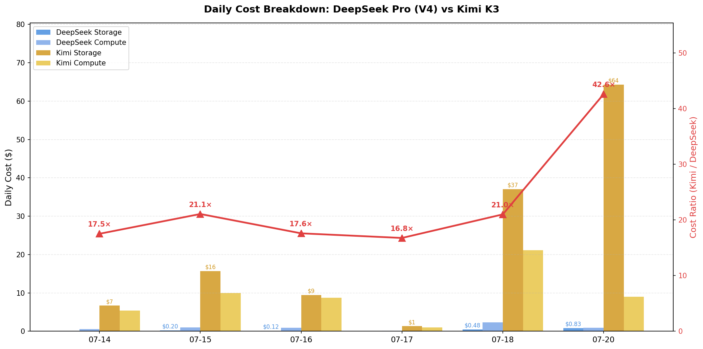

# Two Paths, One Battlefield

CNBC noted that "Kimi K3 still trails on overall performance, but leads on frontend coding, web browsing comprehension" [6]. Bleap rates it highest on "Multi-Step Workflow Reliability" [7]. The market is paying a premium for quality — and the storage bill reflects it.

Benchmark data (July 2026): Kimi K3 scores ==88.3%== on Terminal-Bench 2.1 (vs GPT-5.6 Sol's 88.8%) [2], ==80.96/100== on BenchLM (#4 of 200) [5]. In a 35-benchmark head-to-head vs Claude Fable 5: Fable wins 22, K3 wins 12, 1 tie — but K3 leads on Terminal-Bench, SWE Marathon (+7), and BrowseComp [4].

These observations point to a deeper question: the frontier model landscape is splitting into two directions, and the storage layer is where this divergence becomes concrete.

## The split

The frontier model landscape has split into two diverging philosophies. DeepSeek pushes extreme cost-efficiency — compressing KV cache, quantizing to FP4, activating only 1.8% of parameters. Kimi3 pushes toward high-precision — larger context windows, fuller KV caches, less aggressive compression.

This may not be a temporary divergence. It appears to be a fundamental architectural choice, and it likely has significant implications for how we think about AI storage infrastructure.

Our previous analysis ([The Million-Token Bill](https://backyes.github.io/posts/million-seq-storage-vs-compute.html)) showed that ==99.1%== of tokens in a long-context Agent session are "remembered," not "computed" [1]. The storage:compute ratio reaches ==42.7:1==. Storage dominates the bill. So when models make opposite choices about how much storage to consume per token, they are making opposite bets about what the storage layer should look like.

> **The memory wall is not a problem to be solved — it is a design constraint that shapes the entire inference stack.**

---

## Two Directions, Two Storage Philosophies

### Cost-Efficiency: DeepSeek

DeepSeek's goal is simple: minimize storage cost per token.

| Technique | Impact |
|---|---|
| MLA (Multi-head Latent Attention) | 32× KV cache compression |
| DSA (Dense-Sparse Attention) | Near-linear scaling, offloadable |
| FP4 Quantization | 2× memory reduction |
| MoE 1.8% activation | Only 1.8% of params active per token |

Result: DeepSeek Pro charges ==$0.003625/M== cache hit tokens — ==77×== cheaper than Kimi3 [1].

### High-Precision: Kimi3

The high-precision camp prioritizes quality through memory capacity. Kimi3 exemplifies this: it uses a 3:1 hybrid of KDA (linear attention) and MLA, supports 1M token context, and does not aggressively compress its KV cache. Our first post confirmed the consequence — Kimi3's cache hit cost (==$0.28/M==) is ==77×== higher than DeepSeek's (==$0.003625/M==), cache miss cost (==$2.78/M==) is ==6×== higher, and output cost (==$13.90/M==) is ==16×== higher [1]. This is the direct price of a memory-rich architecture: higher quality, but a substantially larger storage footprint that infrastructure must accommodate.

---

## Model Architecture Comparison

The following table maps how frontier models handle the memory-compute trade-off as of July 2026.

| Model | Attention | Key Efficiency Mechanism | Storage Philosophy |
|---|---|---|---|
| **DeepSeek V4** | DSA + KV compression + FP4 | Indexing + HCA | Minimize |
| **Kimi K3** | KDA (3:1 linear:MLA) | None special | Maximize |
| **LongCat 2.0** | DSA + IndexSharing + MTP | IndexSharing, KVSharing | Optimize |
| **GLM5.2** | DSA + IndexSharing | IndexSharing + MTP | Optimize |
| **Qwen3.5** | GDN (Gated DeltaNet) | GQA | Minimize |
| **MiMo V2/V2.5** | SWA (Sliding Window) | GQA | Minimize |

For sparsity and multi-token prediction:

| Model | MoE Sparsity | MTP |
|---|---|---|
| DeepSeek V4 | 1.8% activation | DSpark (dynamic adaptive) |
| Kimi K3 | 1.8% (16/896 experts) | None special |
| LongCat 2.0 | MoE sparse | MTP-3 |
| GLM5.2 | MoE sparse | MTP |
| Qwen3.5 | MoE sparse | — |

---

## The Storage Imperative: What Happens If Kimi3's Path Persists

The two-direction split creates a concrete design constraint for storage infrastructure. Our first post ([The Million-Token Bill](https://backyes.github.io/posts/million-seq-storage-vs-compute.html)) revealed the numbers behind one Agent session (July 14–20, 2026) [1]:

**Daily cost comparison — DeepSeek vs Kimi (July 2026)** [1]

| Metric | DeepSeek | Kimi K3 | Ratio |
|---|---|---|---|
| **Peak Day Total Cost** | $1.72 | $70.47 | **41×** |
| **Storage Cost (cache hits)** | $0.83 | $64.34 | **77×** |
| **Compute Cost (miss + output)** | $0.89 | $6.13 | **6.9×** |
| **Full Week Storage Cost** | $1.74 | $134.51 | **77×** |
| **Full Week Total Cost** | $6.45 | $70.33 | **10.9×** |

The storage:compute ratio is ==42.7:1== — meaning 99.1% of tokens are "remembered," not "computed." On peak day (July 20), a single Agent session generated ==229.6M== cache hit tokens. Storage dominates the bill.

### The Critical Question

**What if Kimi3's memory-rich path is not a temporary experiment, but a persistent direction?**

If high-precision models continue to prioritize quality over compression, then:

1. **KV Cache total storage becomes the primary bottleneck.** A 1M-token context window with full (uncompressed) KV cache requires substantially more HBM than DeepSeek's compressed approach. At 42.7:1 storage:compute ratio, every token of additional context multiplies the memory requirement.

2. **HBM data movement efficiency determines cost.** Moving KV data between HBM, DRAM, and compute units consumes power and adds latency. If storage is 99% of the workload, then data movement efficiency — not raw compute throughput — becomes the key optimization target.

3. **The storage hierarchy must be redesigned.** DeepSeek's compressed KV can fit in less HBM with more aggressive offloading. Kimi3's full KV demands either more HBM (expensive) or faster tiered storage (CXL, NVMe) with minimal overhead.

This is not a theoretical concern. At Kimi3's pricing ($0.28/M cache hit), running the same Agent session that cost $1.74 on DeepSeek costs ==$134.51== — ==77×== more [1]. If the market continues to value Kimi3's quality advantage (as CNBC and Bleap suggest), then **storage cost reduction becomes the single most important lever for infrastructure efficiency.**

### The Infrastructure Implication

For infrastructure planners, the message is straightforward:

1. **Support compressed KV** (DeepSeek-style) — less HBM, more compute for decompression
2. **Support full KV** (Kimi3-style) — more HBM, lower compute overhead, faster tiered storage
3. **Optimize data movement** — at 99% storage workload, moving data efficiently matters more than computing faster
4. **Stay protocol-agnostic** — CXL for open memory pooling, NVLink for NVIDIA-integrated

The key insight: **the storage layer determines which model architectures you can serve efficiently.** A facility optimized only for DeepSeek will struggle to run Kimi3-class models cost-effectively, and vice versa.

---

## The Path Forward

Don't all-in on either direction. The market needs both:

- **Cost-sensitive, high-volume workloads** → DeepSeek's efficiency path
- **Quality-sensitive, Agent-heavy workloads** → Kimi3's precision path

The winners in AI infrastructure will be the ones whose storage hierarchies can serve both directions — from DeepSeek's compressed efficiency to Kimi3's memory-rich precision. The storage layer is where model strategy becomes hardware reality.

---

## References

[1] [backyes — The Million-Token Bill](https://backyes.github.io/posts/million-seq-storage-vs-compute.html) — 42.7:1 storage:compute ratio, 77× cache hit cost difference

[2] [CodingFleet — SWE-bench Pro Leaderboard 2026](https://codingfleet.com/blog/swe-bench-pro-leaderboard-2026/) — Kimi K3 Terminal-Bench 2.1: 88.3%

[3] [SWE-bench Official Leaderboard](https://www.swebench.com/) — Cross-model SWE-bench comparison

[4] [CodingFleet — SWE-bench Pro](https://codingfleet.com/blog/swe-bench-pro-leaderboard-2026/) — K3 vs Fable 5: 12-22 across 35 benchmarks; K3 leads Terminal-Bench, SWE Marathon

[5] [BenchLM — Kimi K3](https://benchlm.ai/models/kimi-3) — 80.96/100 aggregate, #4 of 200

[6] [CNBC — Moonshot AI Kimi K3](https://www.cnbc.com/2026/07/17/moonshot-ai-kimi-k3-model-openai-anthropic-china.html)

[7] [Bleap — Kimi K3 Review](https://www.bleap.finance/blog/kimi-k3-review) — Multi-Step Workflow Reliability

[8] [BBC — Kimi K3](https://www.bbc.com/news/articles/cy9w4q88pgp0o) — Open weights differentiation

---

*Draft post. Views are my own analysis based on publicly available data. Not investment advice.*
