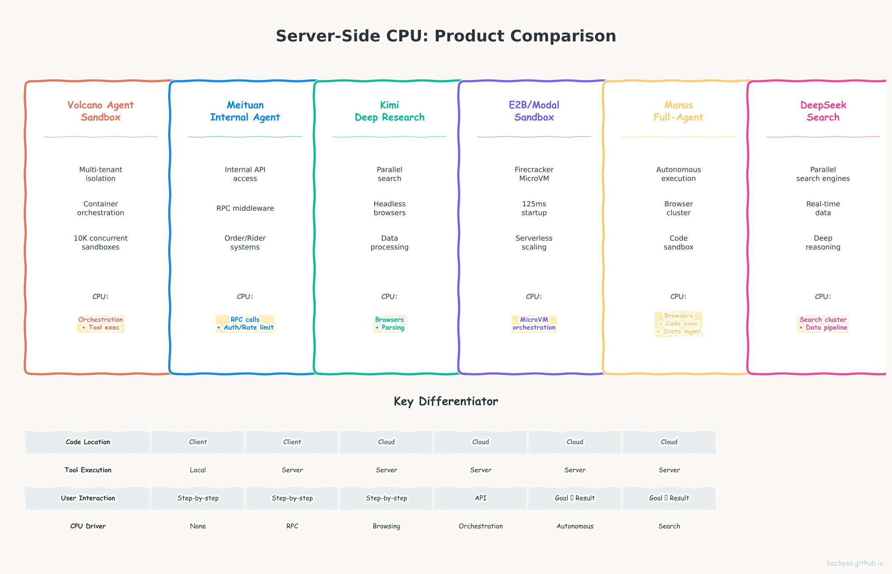

# Server-Side CPU Boom: How Hyperscaler Products Are Shifting Compute from Client to Cloud

## The Core Question

Today's AI coding assistants — Claude Code, Cursor, Cline — follow one model: **tools run locally, models run in the cloud.** But look at what hyperscalers are actually building, and a different picture emerges. Products from DeepSeek, Manus, Kimi, Volcano Engine, Meituan, and E2B are architecting **server-side tool execution** as a core feature.

This post analyzes real product designs to explain why.

---

## Part 1: The Pattern — What the Products Tell Us

### 1.1 Product Comparison Overview



### 1.2 The Common Architecture

```
[ User Interface / API ]
          │
          ▼
[ Cloud Agent Orchestrator ] ← CPU: Planning, scheduling, state management
          │
          ├── [ LLM Inference ] ← GPU: Model calls
          │
          ├── [ Tool Execution ] ← CPU: The growing layer
          │       ├── Sandbox / Container
          │       ├── API calls / RPC
          │       ├── Data processing
          │       └── Browser automation
          │
          └── [ State Persistence ] ← CPU: Session, checkpoint, recovery
```

**Key insight:** All products share the same pattern — when agents operate on **shared infrastructure** (not local files), CPU moves to the cloud.

### 1.3 Why Server-Side? The Product Reasons

<div style="background:rgba(255,107,107,.08);border:1px solid rgba(255,107,107,.25);border-radius:8px;padding:16px 20px;margin:1.5em 0">

| Product | Why Server-Side? | CPU Driver |
|---|---|---|
| 🔴 **DeepSeek** | Search engines, real-time data, parallel queries | Search cluster + data pipeline |
| 🔴 **Manus** | Autonomous execution, multi-step tasks | Browser cluster + code sandbox |
| 🔴 **Kimi** | Parallel web scraping, GB-scale data processing | Headless browsers + chunking |
| 🔴 **Volcano** | Multi-tenant enterprise isolation | Container orchestration |
| 🔴 **Meituan** | Internal API access (orders, payments, GPS) | RPC middleware + auth |
| 🔴 **E2B** | Managed serverless environments | MicroVM orchestration |

</div>

---

## Part 2: Consumer-Facing Products — DeepSeek, Manus, Kimi

### 2.1 DeepSeek: Server-Side Search & Reasoning

<span style="color:#ff6b6b;font-weight:700">🔥 重点产品: DeepSeek 联网搜索 / 深度思考</span> — [DeepSeek 官网](https://chat.deepseek.com/)

**Product:** DeepSeek Chat — 集成联网搜索与深度推理的对话产品

**Architecture:**
```
[ User Query ] → [ DeepSeek Cloud ]
                      │
                      ├── [ Query Planner ] ← Server CPU
                      │       ├── 生成 3-5 个搜索变体
                      │       └── 决定搜索策略
                      │
                      ├── [ Search Execution ] ← Server CPU (核心)
                      │       ├── 并行搜索引擎调用 (Google/Bing/百度)
                      │       ├── 无头浏览器抓取 (JS 渲染页面)
                      │       └── 实时数据源 (股票/新闻 RSS)
                      │
                      ├── [ Data Processing ] ← Server CPU
                      │       ├── 多源去重 + 可信度评分
                      │       └── 文本摘要 + 关键信息提取
                      │
                      └── [ Deep Reasoning ] ← GPU + CPU
                              ├── R1 深度思考链 (5-10 轮)
                              └── 每轮可能触发新搜索
```

**Key server-side CPU logic:**
- 每次联网搜索: 3-5 并行查询 × 3 搜索引擎 = 9-15 HTTP 请求
- 无头浏览器: Chromium 渲染 + 等待 AJAX, ~3-5 秒 CPU/页
- 深度思考链: 5-10 轮"思考-验证-再思考",每轮可能触发新搜索

**CPU 估算:** ~23.5 核·秒/次联网搜索

---

### 2.2 Manus: Full-Stack Autonomous Agent

<span style="color:#ff6b6b;font-weight:700">🔥 重点产品: Manus AI Agent</span> — [Manus 官网](https://manus.im/)

**Product:** Manus — 全自主 AI Agent,用户输入目标后无需干预

**Architecture:**
```
[ User: "调研 AI infra 创业公司并生成报告" ]
          │
          ▼
[ Manus Cloud ]
     │
     ├── [ Task Planner ] ← Server CPU
     │       └── 分解任务 → 决定工具调用顺序
     │
     ├── [ Tool Execution ] ← Server CPU (核心)
     │       ├── 无头浏览器集群 (5-20 Chromium 实例)
     │       │       ├── 网页抓取 + 截图
     │       │       └── 表单填写 + 点击
     │       ├── Python 代码沙箱
     │       │       ├── 数据分析 (pandas/matplotlib)
     │       │       └── PDF/Excel 生成
     │       └── 文件系统操作
     │
     └── [ State Manager ] ← Server CPU
             └── 任务持久化 + 断点续传 (30分钟-数小时)
```

**User usage model:**
1. 输入自然语言任务
2. 等待 (Agent 自主执行,无需干预)
3. 接收最终报告/文件

**Key server-side CPU logic:**
- 浏览器集群: 每任务 5-20 Chromium, ~100MB 内存 + 持续 CPU
- Python 沙箱: Docker/Firecracker 隔离,动态代码执行
- 状态管理: 长任务持久化 + 崩溃恢复

**CPU 估算:** ~90 核·分钟/任务

---

### 2.3 Kimi: Cloud-Native Research Agent

<span style="color:#ff6b6b;font-weight:700">🔥 重点产品: Kimi 深度搜索 / 代码解释器</span> — [Kimi 官网](https://kimi.moonshot.cn/)

**Product:** Kimi Deep Research — 云端研究助手

**Architecture:**
```
[ User: "Research AI infra trends" ] → [ Kimi Cloud ]
                                             │
                                             ├── [ Search Orchestrator ] ← Server CPU
                                             │       ├── 并行搜索 API 调用 (10-50)
                                             │       └── 无头浏览器抓取
                                             │
                                             └── [ Data Processing ] ← Server CPU
                                                     ├── 文本分块 (Chunking)
                                                     ├── 去重 + 摘要
                                                     └── 向量化嵌入
```

**Key server-side CPU logic:**
- 并行执行: 10-50 搜索查询同时发起 (客户端无法承受)
- 无头浏览器: 服务端 Chromium 实例池,提取 JS 渲染内容
- 数据量: 100MB+ 原始内容需在送 LLM 前清洗

**CPU 估算:** ~25 核·小时/100K 请求

---

## Part 3: Infrastructure Products — Volcano, Meituan, E2B

### 3.1 Volcano Engine (ByteDance): Agent Sandbox as Core Infrastructure

<span style="color:#ff6b6b;font-weight:700">🔥 重点产品: 火山方舟 Agent Sandbox</span> — [官方文档](https://www.volcengine.com/product/ark) | [火山引擎](https://www.volcengine.com/)

**Product:** 火山方舟 — 多租户企业级 Agent 沙箱

| Feature | Claude Code | Volcano Agent Sandbox |
|---|---|---|
| Code location | Client laptop | Cloud container/VM |
| Tool execution | Local bash/npm | Server-side Python/Bash |
| Isolation | None | Multi-tenant (Firecracker) |
| Concurrency | 1 user | 1000s concurrent |

**Why server-side?** 企业客户需要隔离、合规、持久运行。Agent 不能依赖本地机器。

**CPU 驱动:** 容器编排 (毫秒启动) + 工具执行 + 监控日志。10K 沙箱 = 数百万 CPU 核。

---

### 3.2 Meituan: 100% Server-Side by Necessity

<span style="color:#ff6b6b;font-weight:700">🔥 重点产品: 美团内部 Agent 平台</span> — [美团技术团队](https://tech.meituan.com/)

**Product:** 美团内部 Agent — 智能客服/商家助手/骑手调度

| Tool | Why Server-Side? |
|---|---|
| `cancel_order()` | 订单数据库 + 支付系统 |
| `query_rider_location()` | 实时骑手 GPS |
| `apply_refund()` | 支付系统 + 审计 |

**Why server-side?** 内部系统不能暴露给客户端。每个工具调用都是 RPC 到微服务。

**CPU 驱动:** 1M Agent 会话 × 10 工具调用 = 10M RPC/天。每调用需认证、限流、序列化。

---

### 3.3 E2B / Modal / Daytona: Agent Sandbox Infrastructure

<span style="color:#ff6b6b;font-weight:700">🔥 重点产品: E2B Agent Sandbox</span> — [E2B 官网](https://e2b.dev/) | [E2B GitHub](https://github.com/e2b-dev/e2b) | [Modal](https://modal.com/) | [Daytona](https://daytona.io/)

**Product:** Serverless Agent Sandboxes — 开发者 API 驱动的 Agent 执行环境

| Feature | Claude Code | E2B Sandbox |
|---|---|---|
| Environment | User's laptop | Cloud MicroVM |
| Startup | Instant | 125ms |
| Scalability | 1/user | 1000s/user |

**Why server-side?** 开发者不想管理本地环境,需要按需伸缩的隔离沙箱。

**CPU 驱动:** 每个沙箱 1 vCPU + 1GB RAM。10K 并发 = 10K vCPU + 10% 编排开销。

---

## Part 4: The Market Implication

### 4.1 CPU vs GPU Spending Shift

| Scenario | GPU | CPU |
|---|---|---|
| Claude Code (current) | 90% | 10% |
| DeepSeek Search (100K req/day) | 25% | 65% |
| Manus (10K tasks/day) | 30% | 60% |
| Volcano (10K sandboxes) | 40% | 50% |

**Why?** 每 Agent 会话产生 ~10 工具调用/LLM 调用。规模化后,工具执行 CPU 超过 GPU 推理。

### 4.2 Who Benefits

| Category | Examples | Value |
|---|---|---|
| **Cloud providers** | AWS, GCP, Azure, Volcano | 出售 Agent 基础设施 CPU |
| **Agent sandbox startups** | E2B, Modal, Daytona | 托管 Agent 执行环境 |
| **MCP infrastructure** | Workato, MuleSoft | 协议转换 + 连接管理 |
| **Data processing** | Snowflake, Databricks | RAG 预处理 + 向量索引 |

---

## Conclusion

The server-side CPU boom is not theoretical — it's visible in product designs today:

1. **DeepSeek** runs search engines + data pipelines server-side because clients can't handle GB-scale data
2. **Manus** runs browser clusters + code sandboxes server-side because autonomous agents need persistent cloud environments
3. **Kimi** runs parallel web scrapers server-side because research requires 10-50 concurrent queries
4. **Volcano** runs multi-tenant sandboxes server-side because enterprise clients demand isolation
5. **Meituan** runs internal API calls server-side because order/payment systems can't be exposed
6. **E2B** runs MicroVMs server-side because developers want managed, auto-scaling environments

**The common pattern:** When agents operate on shared infrastructure (not local files), CPU moves to the cloud.

**The market implication:** Cloud AI spending is shifting from "GPU-only" to "GPU + CPU heterogeneous." The CPU share will grow from ~20% to ~50% as agentic products scale.

---

*Based on public product documentation from [DeepSeek](https://chat.deepseek.com/), [Manus](https://manus.im/), [Kimi](https://kimi.moonshot.cn/), [Volcano Engine](https://www.volcengine.com/), [E2B](https://e2b.dev/), and [Anthropic MCP](https://www.anthropic.com/mcp). Architecture diagrams are inferred from published technical blogs and API documentation.*
