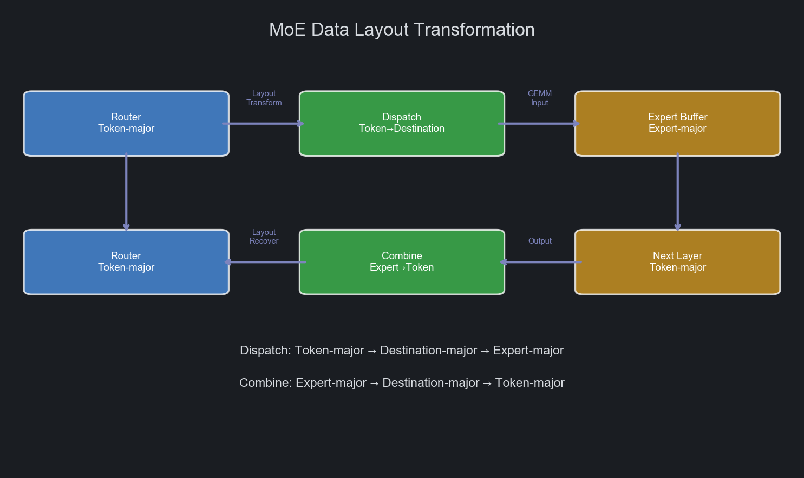
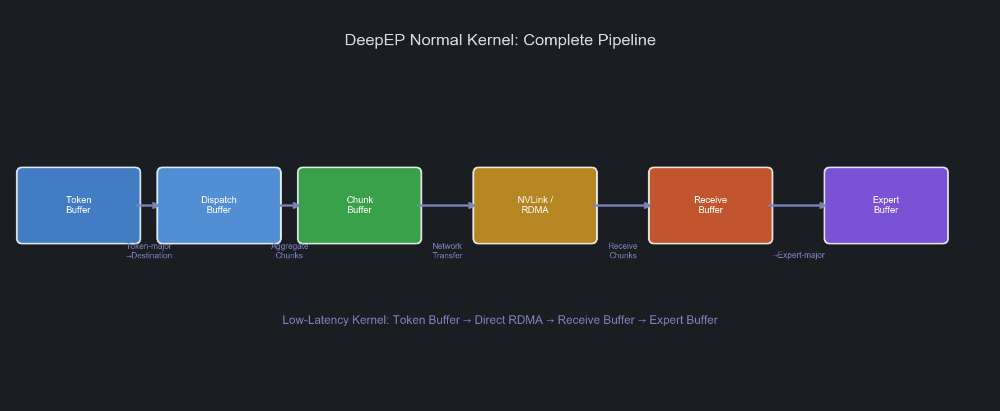
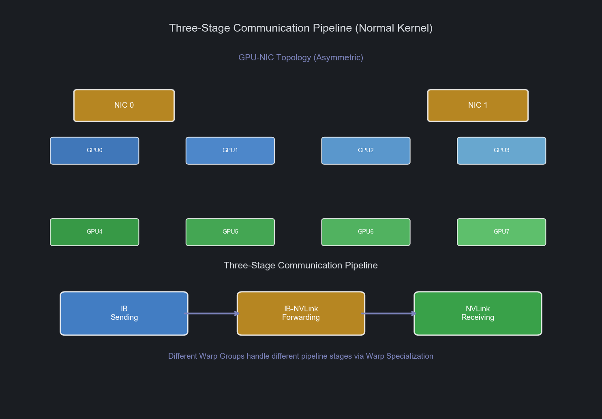
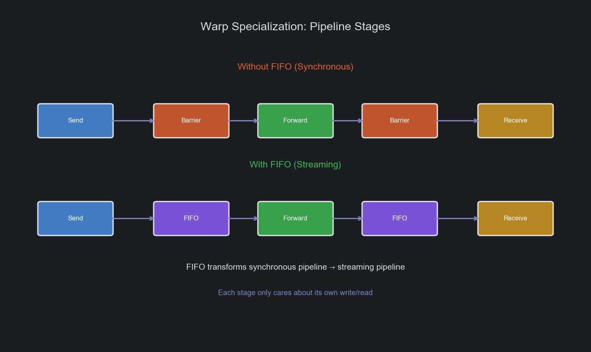
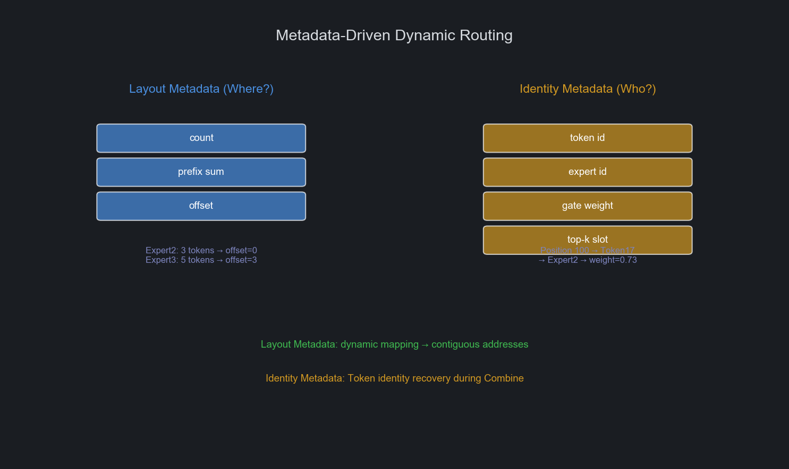

# Understanding GPU Microarchitecture from a Workload Perspective (3): DeepEP's First Principles

## Introduction: Re-understanding DeepEP

In many descriptions, DeepEP is simply characterized as:

> "A high-performance All-to-All communication library for MoE."

This is not wrong, but it fails to explain *why* MoE communication became a core bottleneck, and *why* DeepEP needs complex kernels, buffers, and Warp pipelines.

From a first-principles perspective, MoE's real challenge is not "how to send data from GPU A to GPU B."

The truly difficult problem is:

> **How does the dynamic sparse Token-Expert mapping produced by the Router get transformed into data layouts that both GPU communication hardware and Tensor Core compute hardware can process efficiently?**

MoE's core tension:



```
Dynamic sparse Token-Expert data flow
              ↓
Continuous regular GPU Tensor data flow
```

The Router outputs `Token → Expert`, but:
- The network wants **Destination-major**
- Expert GEMM wants **Expert-major**
- The next Transformer layer still wants **Token-major**

Every MoE Layer must perform a dynamic data layout transformation.

**DeepEP is not primarily a complete MoE Runtime — it is a Runtime specialized in solving MoE Expert Parallelism data movement problems.**

It connects:

```
Router → DeepEP → Expert Buffer → Expert GEMM
```

A more accurate definition:

> **DeepEP is a MoE-oriented Data Movement Runtime that transforms dynamic sparse Token flows into continuous data flows that Expert computation can consume, through data layout transformation, communication pipelining, and asynchronous scheduling.**

---

## 1. Dispatch / Combine: Dynamic Data Layout Transformation

### 1.1 Why Does MoE Need Dispatch?

In ordinary Transformers, input naturally maintains Token-major layout. But in MoE, the Router dynamically selects Experts per Token:

```
T0 → E2, E7
T1 → E1, E5
T2 → E7, E3
```

GPU modules need different layouts.

### Communication Phase Wants Destination-major

GPU communication asks: *which GPU should this data go to?* Communication needs data organized by destination for contiguous sends.

### Expert GEMM Wants Expert-major

Expert GEMM wants data organized by Expert — a continuous `[M, K]` matrix for Tensor Core.

Therefore, Dispatch performs:

```
Token-major → Destination-major → Expert-major
```

This is not simple communication — it is a ==**dynamic data layout transformation**==.

### 1.2 Combine: Expert-major Back to Token-major

After Expert computation, output remains Expert-major. The next layer needs Token-major. Combine reverses:

```
Expert-major → Destination-major → Token-major
```

While recovering Router semantics:

```
Output(T0) = 0.73 × Expert2(T0) + 0.27 × Expert7(T0)
```

Combine is ==**data layout recovery + semantic recovery**==.

---

## 2. DeepEP Buffer System: Data Flow Organization Under Different Kernels

DeepEP does not use identical data paths in all scenarios:
- **Training / Prefill** care about throughput
- **Decode** cares about latency

### 2.1 Normal Kernel: Throughput-Optimized Complete Pipeline



Data path:

```
Token Buffer → Dispatch Buffer → Chunk Buffer → NVLink / RDMA Pipeline → Receive Buffer → Expert Buffer
```

**Token Buffer**: Stores Router output. Layout: Token-major.

**Dispatch Buffer**: First layout transformation: Token-major → Destination-major.

**Chunk Buffer**: Critically important. The network is unsuitable for single-Token sends — produces small packets, high startup overhead, low bandwidth utilization. Tokens are aggregated:

```
Token Stream → Chunk → Network Transfer
```

Token is the **scheduling granularity**; Chunk is the **communication granularity**.

**Receive Buffer**: Destination GPU receives Chunks from multiple GPUs.

**Expert Buffer**: Final transformation: Destination-major → Expert-major, forming Expert GEMM input.

### 2.2 Low-Latency Kernel: Decode-Oriented Short Path

Decode: small batch, few Tokens, single-Token latency sensitive. Waiting for Chunk aggregation increases latency.

Low-Latency Kernel reduces intermediate layers:

```
Token Buffer → Direct RDMA → Receive Buffer → Expert Buffer
```

Goal: minimize ==**end-to-end Token latency**==.

---

## 3. Normal vs Low-Latency: Two Communication Philosophies

| | Normal Kernel | Low-Latency Kernel |
|---|---|---|
| **Primary Scenario** | Training / Prefill | Decode |
| **Goal** | Maximize throughput | Minimize latency |
| **Core Tension** | Bandwidth | Latency |
| **Chunk** | Critical | Reduced |
| **Pipeline** | Deep | Shallow |
| **Communication Path** | NVLink + RDMA coordination | Direct RDMA |

### 3.1 Normal Kernel: Communication Pipelining

In multi-GPU nodes, GPU-NIC topology is not fully symmetric. Communication paths may include:

```
IB Sending → IB-to-NVLink Forwarding → NVLink Receiving
```

Forming a three-stage communication pipeline.

---

## 4. Warp Specialization: Pipelined Execution Inside the Communication Kernel

Warp Specialization in DeepEP is *not* about GPU role assignment or SMs dedicated to compute/communication. It is primarily used for **parallelizing different stages within the communication Kernel**.



Different Warp Groups handle:

```
Warp Group A: IB Sending
Warp Group B: IB-NVLink Forwarding
Warp Group C: NVLink Receiving
```

Forming: `Send → Forward → Receive`

---

## 5. FIFO: From Synchronous to Streaming Pipeline



Without FIFO: before the previous stage completes, the next stage must wait:

```
Send → Barrier → Forward → Barrier → Receive
```

Inefficient.

With FIFO:

```
Send → FIFO → Forward → FIFO → Receive
```

Each stage only cares about its own write/read. No need to wait for the entire Batch.

==**FIFO's essence: transforms the communication pipeline from synchronous execution to streaming execution.**==

---

## 6. Metadata: How Dynamic Routing Becomes Contiguous Access



Two analytical abstractions. Note: **Layout Metadata / Identity Metadata are not official DeepEP source code terms — they are conceptual models proposed for understanding MoE Runtimes.**

### 6.1 Layout Metadata: Where Should Data Go?

Core question: **Where?**

Describes data layout. Typical information: count, prefix sum, offset.

```
Expert2: 3 tokens → offset=0
Expert3: 5 tokens → offset=3
```

Then: `dst = prefix[expert]++` completes contiguous writes.

Solves: ==**dynamic mapping → contiguous addresses**==.

### 6.2 Identity Metadata: Who Is This Data?

Core question: **Who?**

Describes Token identity. Includes: token id, expert id, gate weight, top-k slot.

```
Position 100 → Token17 → Expert2 → weight=0.73
```

During Combine:

```
Token17 = 0.73 × Expert2 + 0.27 × Expert7
```

---

## 7. Key Details in MoE Runtime

### 7.1 Does Sort Exist?

Yes, but not traditional sorting. Core process: `Count → Prefix Sum → Scatter`

Essentially **Counting Sort / Bucketization**. Goal: produce contiguous layout, not sort by size.

### 7.2 Why Must Top-K Information Be Preserved?

MoE is Top-K Experts per Token. Combine must know: which Experts, corresponding weights, ordering. Top-K slot information must be preserved.

### 7.3 Why Is Memory Reorganization Unavoidable?

Three stages are inherently different: Communication (Destination-major), Compute (Expert-major), Model (Token-major). Rearrangement is a **necessary transformation** produced by MoE architecture. The optimization direction is not to eliminate it, but to ==**make data rearrangement, communication, and computation as pipelined as possible**==.

---

## 8. From DeepEP to Mega MoE: MoE Runtime Evolution

DeepEP solves **Communication + Data Movement**. System trends are further fusing **Communication + Compute**.

In DeepGEMM, Mega MoE Kernel targets Blackwell SM100, fusing:

```
Token Routing → Dispatch → Linear1 → Activation → Linear2 → Combine
```

Distinction:
- **DeepEP**: MoE Data Movement Runtime
- **Mega MoE**: Communication + Compute Fusion Runtime

---

## 9. Summary: DeepEP's True System Significance

> **How to transform dynamic sparse Token-Expert dataflows into continuous dataflows that GPU hardware prefers.**

Core mechanisms: Dispatch / Combine, Data Layout Transformation, Buffer Pipeline, Chunk Streaming, FIFO Stage Decoupling, Warp Specialization, Metadata-driven Mapping.

```
Router → Token-Expert Stream → DeepEP (Data Movement Runtime) → Expert Buffer → Expert GEMM → Combine
```

Further evolution: `DeepEP + DeepGEMM + Fusion Kernel → Unified MoE Dataflow Runtime`

==**DeepEP represents MoE systems' evolution from "communication optimization" to "dataflow execution."**==

It solves a fundamental problem: **How to make dynamic sparse AI workloads ultimately flow into the continuous compute streams that GPUs excel at processing.**

---

*Analysis based on DeepEP paper and source code, CUTLASS documentation, and NVIDIA NVLink/RDMA architecture. Views are my own.*

---

*© 2026 backyes · Created by backyes*
